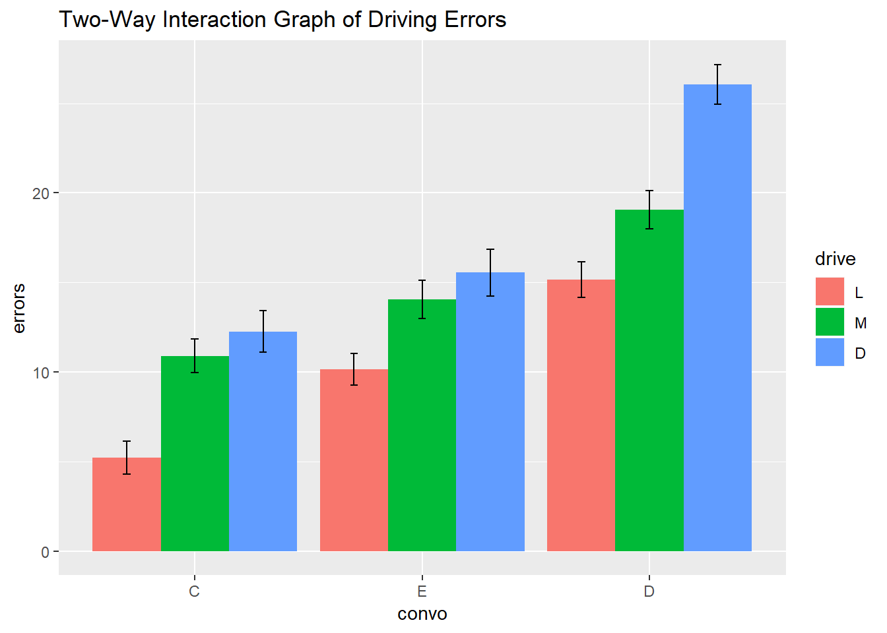

You are doing a replication of a previous study. You are now conducting an experiment to hopefully replicate the interaction effect between driving difficulty and conversation difficulty on driving errors in a driving simulator. In the replication, you administered the same three levels of conversation difficulty; (1) control, (2) easy, (3) difficult (C, E, D) but you decided to add a third level of driving difficulty. Therefore driving difficulty is now: (1) low, (2) moderate, (3) difficult (L, M, D).  The design was completely between subjects. See if your study indeed replicated the original study by testing the main effects of conversation and driving difficulty as well as the interaction effect. The DV is the number of errors committed in the driving simulator.

DV = errors 
IV 1 = convo (C = control, E = easy, D = difficult) 
IV 2 = drive (L = low, M = moderate, D = difficult)

Conduct the appropriate analyses to answer the following 10 questions. Please submit your answer sheet and your output (R).

  <!-- LEAVE THIS HERE, DO NOT PUT ANY CODE ABOVE IT -->
```{r, echo=FALSE, results=FALSE, message=FALSE, cache=FALSE}
library(knitr); opts_chunk$set(error=TRUE, cache=FALSE)
library(psych)
library(jmv)
library(ggplot2)


#load data
dat <- read.csv("https://www.dropbox.com/s/mssrsx06ajq4p37/PSY.308b.DA3.csv?dl=1")

#View(dat) Row x Col
head(dat)
tail(dat)
message ("running 'dim(dat)'")
dim(dat)

#order IV's correctly
message("wrong order")
levels(dat$convo)
levels(dat$drive)
dat$convo <- factor(dat$convo, levels = c("C", "E", "D"))
dat$drive <- factor(dat$drive, levels = c("L", "M", "D"))
message("correct order")
levels(dat$convo)
levels(dat$drive)
```

##Question 1
###Assumptions
####IV 1
```{r}

#IV 1 = convo (C = control, E = easy, D = difficult)

#subset groups by IV 1
dat.convo.Control <- subset(dat, dat$convo == "C")
dat.convo.Easy <- subset(dat, dat$convo == "E")
dat.convo.Difficult <- subset(dat, dat$convo == "D")

#descriptives way 1 by convo

desc.by.convo <- descriptives(dat, vars = c('errors'), splitBy = 'convo', hist = TRUE, sd = TRUE, se = TRUE, skew = TRUE, kurt = TRUE)
desc.by.convo

#descriptives way 2 by convo

describeBy(dat, dat$convo)

#histograms by convo
hist(dat.convo.Control$errors)
hist(dat.convo.Easy$errors)
hist(dat.convo.Difficult$errors)

```

####IV 2
```{r}

#IV 2 = drive (L = low, M = moderate, D = difficult)

#subset groups by IV 2
dat.drive.Low <- subset(dat, dat$drive == "L")
dat.drive.Moderate <- subset(dat, dat$drive == "M")
dat.drive.Difficult <- subset(dat, dat$drive == "D")

#descriptives way 1 by drive

desc.by.drive <- descriptives(dat, vars = c('errors'), splitBy = 'drive', hist = TRUE, sd = TRUE, se = TRUE, skew = TRUE, kurt = TRUE)
desc.by.drive

#descriptives way 2 by drive

describeBy(dat, dat$drive)

#histograms by convo
hist(dat.drive.Low$errors)
hist(dat.drive.Moderate$errors)
hist(dat.drive.Difficult$errors)

```

###ANOVA
####Levene's test for homogeneity
```{r}
anova(data = dat, dep = 'errors', factors = c('convo', 'drive'), homo = TRUE)

#NOTES: Residuals = MSwithin = error
     #a = levels of a; k = number of groups total; n = number per group; N = total sample
     #dfA = a - 1 = 2
     #dfB = b - 1 = 2
     #dfAxB = (a - 1)(b - 1) = 4
     #dfERROR = ab(n-1) = 171 = dfRESIDUALS
     #dfTOTAL = abn-1 = N-1 = (dfA + dfB + dfAxB + dfERROR) = 179
     #**df1 for Levene's test = k - 1; df2 for Levene's test = MSwithin (dfERROR)**

```

##Question 2
##Question 3
### ANOVA with post-hoc analyses
```{r}


anova(data = dat, dep = 'errors', factors = c('convo', 'drive'), effectSize = 'partEta', postHoc = c('convo', 'drive'), postHocCorr = 'bonf')
```

##Questions 5 and 6
###Simple effects

```{r}

#Simple effect of Driving Difficulty at each level of Conversation Difficulty

#Convo.Control
anova(data = dat.convo.Control, dep = 'errors', factors = c('drive'), effectSize = 'eta', postHoc = 'drive', postHocCorr = 'bonf')

#Convo.Easy
anova(data = dat.convo.Easy, dep = 'errors', factors = c('drive'), effectSize = 'eta', postHoc = 'drive', postHocCorr = 'bonf')

#Convo.Difficult
anova(data = dat.convo.Difficult, dep = 'errors', factors = c('drive'), effectSize = 'eta', postHoc = 'drive', postHocCorr = 'bonf')


```

##Question 7
###Data Visualization (ggplot2)
####bar plot script
```{r}
#Recommended that you save this function in a separate R script or doc to refer to later (trust me, it's worth it).

summarySE <- function(data=NULL, measurevar, groupvars=NULL, na.rm=FALSE,
                      conf.interval=.95, .drop=TRUE) {
    library(plyr)

    # New version of length which can handle NA's: if na.rm==T, don't count them
    length2 <- function (x, na.rm=FALSE) {
        if (na.rm) sum(!is.na(x))
        else       length(x)
    }

    # This does the summary. For each group's data frame, return a vector with
    # N, mean, and sd
    datac <- ddply(data, groupvars, .drop=.drop,
      .fun = function(xx, col) {
        c(N    = length2(xx[[col]], na.rm=na.rm),
          mean = mean   (xx[[col]], na.rm=na.rm),
          sd   = sd     (xx[[col]], na.rm=na.rm)
        )
      },
      measurevar
    )

    # Rename the "mean" column    
    datac <- rename(datac, c("mean" = measurevar))

    datac$se <- datac$sd / sqrt(datac$N)  # Calculate standard error of the mean

    # Confidence interval multiplier for standard error
    # Calculate t-statistic for confidence interval: 
    # e.g., if conf.interval is .95, use .975 (above/below), and use df=N-1
    ciMult <- qt(conf.interval/2 + .5, datac$N-1)
    datac$ci <- datac$se * ciMult

    return(datac)
}
```

####summary of factors for this barplot
```{r}
sumdat <- summarySE(dat, measurevar="errors", groupvars=c("convo","drive"))

```

####barplot
```{r}
plot1 <- ggplot(sumdat, aes(x = convo, y = errors, fill = drive))+
  geom_bar(stat='identity', position= 'dodge') +
  geom_errorbar(aes(ymin=errors-se, ymax=errors+se), position = position_dodge(.9), width = .1)

plot1 + ggtitle('Two-Way Interaction Graph of Driving Errors')

```

##Questions
###1. As stated in the description, we are trying to help out the replication crisis. We need to figure out if there are any differences between driving errors based on conversation difficulty and driving difficulty. State the type of test we are going to run and test the appropriate assumptions for this test. Report whether or not each assumption was violated and provide evidence to support your conclusion.

Test type: Factorial ANOVA testing effects of two independent variables (convo and drive) on one dependent variable (errors)

Assumptions: 

1. DV *error* is continuous - **TRUE**
2. IV's *convo* and *drive* are categorical - **TRUE**
3. DV is normally distributed across conditions - **TRUE**
     + Histograms visually inspected and appear normal for IV 1 = convo
     + Histograms visually inspected and appear normal for IV 2 = drive
     + For convo: Skew should be between -3 and 3. skew = -0.15 for group C. skew = 0.06 for group E. skew = 0.09 for group D 
     + For drive: Skew should be between -3 and 3. skew = 0.18 for group D. skew = -0.04 for group L. skew = -0.12 for group M 
     + For convo: kurtosis should be between -10 and 10. kurtosis = -0.50 for group C. kurtosis = -0.39 for group E. kurtosis = -0.43 for group D.
     + For drive: kurtosis should be between -10 and 10. kurtosis = -0.93 for group D. kurtosis = -0.85 for group L. kurtosis = -0.65 for group M.
4. Independent observations - each group observation is separate for all groups - **TRUE**
5. Homogeneity of variance - **TRUE**
     + Levene's and check the p-value (less than .05 is a violation). *F*(8, 171) = 1.02, *p* = .42.

###2. Is there a main effect for conversation difficulty (i.e., are people who had different levels of conversation difficulty make significantly different driving errors) or a main effect for driving difficulty (i.e., are people who had different levels of driving difficulty make significantly different driving errors)? Report the relevant statistics according to APA format.

A 3 x 3 factorial ANOVA was used to compare number of driving errors between levels of conversation difficulty (control, easy, difficult) and levels of driving difficulty (low, moderate, difficult). There was a significant main effect for conversation difficulty averaged across levels of driving difficulty, *F*(2, 171) = 77.54, *p*< .001, *$\eta$^2^p* = .48. There was a large effect, with levels of conversation difficulty accounting for 48% of the variance in driving errors. There was a significant main effect for driving difficulty averaged across levels of conversation difficulty, *F*(2, 171) = 40.78, *p*< .001, *$\eta$^2^p* = .32. There was a large effect, with levels of driving difficulty accounting for 32% of the variance in driving errors.

###3. Follow up each main effect with any necessary tests to see where the differences lie. Note the differences and report your statistics in an orderly manner. 

Post-hoc tests with Bonferroni correction were used to further examine main effects.

In main effect for conversation difficulty, the control group had significantly lower levels of driving errors than difficult group, (*M1* - *M3* = -10.63, *t* = -12.29, *p* < .001), the control group had significantly lower levels of driving errors than the easy group (*M1* - *M2* = -3.80, *t* = -4.39, *p* < .001), and the difficult group had significantly higher levels of driving errors than the easy group (*M3* - *M2* = 6.83, *t* = 7.90, *p* < .001).

In main effect for driving difficulty, difficult group had greater levels of driving errors than low group, (*M3* - *M1* = 7.78, *t* = 8.99, *p* < .001), difficult group had greater levels of driving errors than moderate group, (*M3* - *M2* = 3.28, *t* = 3.79, *p* < .001), and low group had lower levels of driving errors than moderate group, (*M1* - *M2* = -4.50, *t* = -5.20, *p* < .001).

###4. Is there an interaction? Report the relevant statistics according to APA format. 

There was a significant interaction of conversation and driving difficulty on number of driving errors, *F*(4, 171) = 2.88, *p*< .024, *$\eta$^2^p* = .06. There was a medium effect, with 6% of the variance accounted for in the interaction.

###5. Test the simple effects from the interaction. Report any significant simple effects, including all statistics APA format.

The simple effects of driving difficulty was calculated at each level of conversation difficulty using one-way ANOVA.

Across the control level of conversation difficulty, there was a significant interaction with driving difficulty on driving errors, *F*(2, 57) = 13.60, *p*< .001, *$\eta$^2^p* = .32. There was a large effect, with levels of driving difficulty within the control conversation condition accounting for 32% of the variance within the interaction.

Across the easy level of conversation difficulty, there was a significant interaction with driving difficulty on driving errors, *F*(2, 57) = 6.37, *p* = .003, *$\eta$^2^p* = .18. There was a large effect, with levels of driving difficulty within the easy conversation condition accounting for 18% of the variance within the interaction.

Across the difficult level of conversation difficulty, there was a significant interaction with driving difficulty on driving errors, *F*(2, 57) = 27.20, *p*< .001, *$\eta$^2^p* = .49. There was a large effect, with levels of driving difficulty within the difficult conversation condition accounting for 49% of the variance within the interaction.

###6. Follow up your simple effects with pairwise comparisons to see where the differences lie. Report any relevant statistics in an orderly manner.

The simple effects of driving difficulty was calculated at each level of conversation difficulty following one-way ANOVA with Bonferroni post-hoc tests.

Across the control level of conversation difficulty, the difficult driving condition had significantly more driving errors than the low driving condition (*M3* - *M1* = 1.35, *t* = 4.92, *p* < .001), but no significant difference from the moderate group. The low driving condition had significantly less driving errors than the moderate condition (*M1* - *M2* = -5.70, *t* = -3.98, *p* < .001).

Across the easy level of conversation difficulty, the difficult driving condition had significantly more driving errors than the low driving condition (*M3* - *M1* = 5.40, *t* = 3.46, *p* = .003), but no significant difference from the moderate group. The low driving condition had significantly less driving errors than the moderate condition (*M1* - *M2* = -3.90, *t* = -2.50, *p* = .046).

Across the  difficult level of conversation difficulty, the difficult driving condition had significantly more driving errors than the low driving condition (*M3* - *M1* = 10.90, *t* = 7.27, *p* < .001) and the moderate condition (*M3* - *M2* = 7.00, *t* = 4.67, *p* < .001). The low driving condition had significantly less driving errors than the moderate condition (*M1* - *M2* = -3.90, *t* = -2.60, *p* = .035).

###7. Create a graph showing the differences on the outcome measure by the 6 groups (make sure to include it here).



###8. Please interpret your analyses (#2-7) for the Journal of Cognitive Psychology (Suggestion: the graph can be helpful in interpreting your results).

A 3 x 3 factorial ANOVA was used to compare number of driving errors between levels of conversation difficulty (control, easy, difficult) and levels of driving difficulty (low, moderate, difficult). There was a significant main effect for conversation difficulty averaged across levels of driving difficulty, *F*(2, 171) = 77.54, *p*< .001, *$\eta$^2^p* = .48. There was a large effect, with levels of conversation difficulty accounting for 48% of the variance in driving errors. There was a significant main effect for driving difficulty averaged across levels of conversation difficulty, *F*(2, 171) = 40.78, *p*< .001, *$\eta$^2^p* = .32. There was a large effect, with levels of driving difficulty accounting for 32% of the variance in driving errors.

In main effect for conversation difficulty, the control group had significantly lower levels of driving errors than difficult group, (*M1* - *M3* = -10.63, *t* = -12.29, *p* < .001), the control group had significantly lower levels of driving errors than the easy group (*M1* - *M2* = -3.80, *t* = -4.39, *p* < .001), and the difficult group had significantly higher levels of driving errors than the easy group (*M3* - *M2* = 6.83, *t* = 7.90, *p* < .001).

In main effect for driving difficulty, difficult group had greater levels of driving errors than low group, (*M3* - *M1* = 7.78, *t* = 8.99, *p* < .001), difficult group had greater levels of driving errors than moderate group, (*M3* - *M2* = 3.28, *t* = 3.79, *p* < .001), and low group had lower levels of driving errors than moderate group, (*M1* - *M2* = -4.50, *t* = -5.20, *p* < .001).

There was a significant interaction of conversation and driving difficulty on number of driving errors, *F*(4, 171) = 2.88, *p*< .024, *$\eta$^2^p* = .06. There was a medium effect, with 6% of the variance accounted for in the interaction.

Across the control level of conversation difficulty, the difficult driving condition had significantly more driving errors than the low driving condition (*M3* - *M1* = 1.35, *t* = 4.92, *p* < .001), but no significant difference from the moderate group. The low driving condition had significantly less driving errors than the moderate condition (*M1* - *M2* = -5.70, *t* = -3.98, *p* < .001).

Across the easy level of conversation difficulty, the difficult driving condition had significantly more driving errors than the low driving condition (*M3* - *M1* = 5.40, *t* = 3.46, *p* = .003), but no significant difference from the moderate group. The low driving condition had significantly less driving errors than the moderate condition (*M1* - *M2* = -3.90, *t* = -2.50, *p* = .046).

Across the  difficult level of conversation difficulty, the difficult driving condition had significantly more driving errors than the low driving condition (*M3* - *M1* = 10.90, *t* = 7.27, *p* < .001) and the moderate condition (*M3* - *M2* = 7.00, *t* = 4.67, *p* < .001). The low driving condition had significantly less driving errors than the moderate condition (*M1* - *M2* = -3.90, *t* = -2.60, *p* = .035).


###9. Please interpret your analyses (#2-7) for the driver's ed teacher at your local high school (Suggestion: the graph can be helpful in interpreting your results)

Based on our tests, we conclude that both the difficulty of conversation as well as difficulty of driving conditions affect overall mistakes made while driving, both separately as well as in combination with each other.
Specifically, as driving difficulty increased, so did driving errors. Similarly, as conversation difficulty increased, so did driving errors. Finally, when conversation difficulty was low or moderate, driving difficulty only affected errors made while driving at the highest level of difficulty. However, when conversation difficulty increased to its highest level, all levels of driving difficulty affected errors made while driving. Based on our findings reported above, we recommend that it is best to keep conversational demands low for student drivers, especially as driving conditions increase in difficulty. It is to be expected that increased difficulty in driving will lead to more errors, so it is also best to keep driving difficulty low, especially for beginning drivers.

###10. Describe the following terms in your own words: main effect(s), interaction, simple effects, and pairwise comparisons. Following, please describe how those terms relate to each other in process of data analysis.

- main effect - an effect of one IV independent of any other IV's (or other IV's "averaged across")
- simple effect - The effect(s) of the interaction of one IV across each separate level of another IV.
- pairwise comparisons - The specific location and direction of a simple effect.

When completing data analysis, the main effect is calculated using factorial ANOVA. This ANOVA will indicate main effects but also if there are interactions between IV's, which will lead to post-hoc tests for main effects, and further analysis of simple effects. A simple effect is calculated after the prior ANOVA, by subsetting one IV across all levels of the other(s), and running one-way ANOVA comparisons. Based on these one-way comparisons, if a significant effect is found for one IV across a level of another IV, then pairwise comparisons are completed to zoom in where the interaction takes place and the direction of the effect(s)