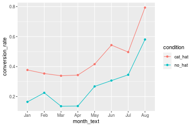
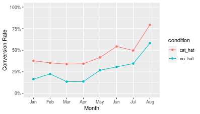
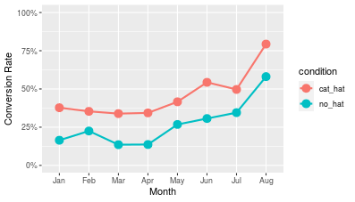
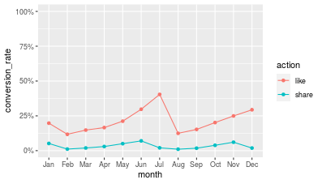
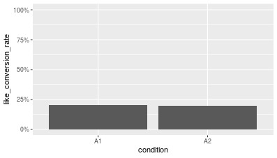
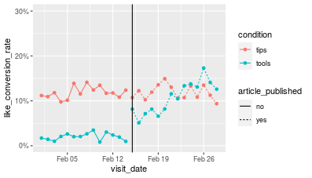
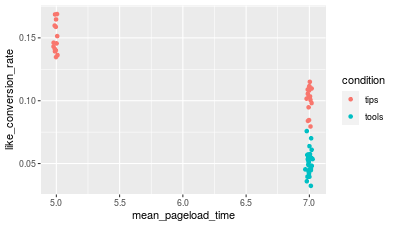
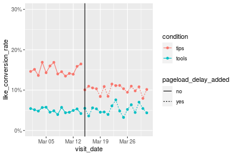
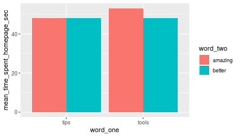
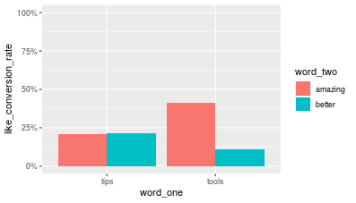

```{r setup, include=FALSE}
knitr::opts_chunk$set(echo = TRUE)
options(repos="https://CRAN.R-project.org")
```

## Introduction


**Preliminary data exploration**

In the video, we read in our preliminary dataset and had a quick look at it. Let's get some practice reading in data and do a little more exploration.

```{r}
# Load tidyverse
library(tidyverse)

# Read in data
click_data <- read_csv("_data/click_data.csv")
click_data

# Find oldest and most recent date
min(click_data$visit_date)
max(click_data$visit_date)
```

Well done! We now know that the first date in the dataset is January 1, 2017, and the oldest December 31, 2017.

## Baseline conversion rates


**Current conversion rate day of week**

Just as we did in the slides, let's start by computing our pre-experiment conversion rate as a baseline. Rather than computing it by month though, let's compute by day of the week. The core `tidyverse` packages and `lubridate` are pre-loaded for you.

```{r}
library(lubridate)

# Calculate the mean conversion rate by day of the week
click_data %>%
  group_by(wday(visit_date)) %>%
  summarize(conversion_rate = mean(clicked_adopt_today))
```

It looks like conversion rates vary a little bit from day to day, but not too much.

**Current conversion rate week**

Let's try one more grouping for our data and see how much conversion rates vary by week in the calendar year.

```{r}
# Calculate the mean conversion rate by week of the year
click_data %>%
  group_by(week(visit_date)) %>%
  summarize(conversion_rate = mean(clicked_adopt_today))
```

Great! You've now looked at four different ways to compute baseline conversion rates: overall, by month, by day of the week, and by week of the year.

**Plotting conversion rate seasonality**

Earlier we said that based on the summary by month, it looks like there are seasonal effects. Conversion rates are higher in the summer and in December. Let's visualize that effect, but by week of the year. We'll use `ggplot2` to build our plot. The `tidyverse` packages and `lubridate` are pre-loaded for you.

```{r}
# Compute conversion rate by week of the year
click_data_sum <- click_data %>%
  group_by(week(visit_date)) %>%
  summarize(conversion_rate = mean(clicked_adopt_today))

# Build plot
ggplot(click_data_sum, aes(x = `week(visit_date)`,
                           y = conversion_rate)) +
  geom_point() +
  geom_line() +
  scale_y_continuous(limits = c(0, 1),
                     labels = scales::percent)
```

Fantastic! We now have a plot to visualize our knowledge about seasonal conversion rates by week of the year.

## Experimental design, power analysis


**Power analysis August**

In the video, we ran a power analysis assuming we were going to run the experiment in January. Run a new power analysis assuming we'll run the experiment in August. To compute the conversion rate for our control and test you'll need to look at the dataset. Be sure to round all values to the hundredth of a percent (e.g., `0.13453` to `0.13`). The data `click_data_month` is available pre-loaded for you to look up the conversion rate for August.

```{r}
# Compute conversion rate by month of the year
click_data_month <- click_data %>%
  group_by(month(visit_date)) %>%
  summarize(conversion_rate = mean(clicked_adopt_today))

# Load powerMediation
library(powerMediation)

# Compute and look at sample size for experiment in August
total_sample_size <- SSizeLogisticBin(p1 = 0.54,
                                      p2 = 0.64,
                                      B = 0.5,
                                      alpha = 0.05,
                                      power = 0.8)
total_sample_size
```

Great! We now know if we ran the experiment in August we would need at least 758 data points or 379 per group.

**Power analysis August 5 percentage point increase**

Let's say you've reconsidered your expectations for running the experiment in August. 54% is already a really high conversion rate, so increasing it by 10 percentage points may be difficult. Rerun your power analysis assuming only a 5 percentage point increase in your conversion rate for the test condition.

```{r}
# Compute and look at sample size for experiment in August with a 5 percentage point increase
total_sample_size <- SSizeLogisticBin(p1 = 0.54,
                                      p2 = 0.59,
                                      B = 0.5,
                                      alpha = 0.05,
                                      power = 0.8)
total_sample_size
```

Wow! If we only expect a 5 percentage point conversion rate increase we need 3085 (about 1543 per group) to see a significant effect, much more than if we predicted a 10 percentage point increase.

## Analyzing results

**Plotting results**

It turns out there was a bug on January 10th and all of the data from that day was corrupted. A new data frame was created for you called `experiment_data_clean`, which drops the corrupted data. Re-build our plot showing the two conversion rates, one for the test condition and one for the control condition. The `tidyverse` and the updated data set are pre-loaded for you.

```{r}
experiment_data_clean <- read_csv("_data/experiment_data.csv")

# Group and summarize data
(experiment_data_clean_sum <- experiment_data_clean %>%
  group_by(visit_date, condition) %>%
  summarize(conversion_rate = mean(clicked_adopt_today)))

# Make plot of conversion rates over time
ggplot(experiment_data_clean_sum,
       aes(x = visit_date,
           y = conversion_rate,
           color = condition,
           group = condition)) +
  geom_point() +
  geom_line()
```

It looks like our results were pretty consistent over the month. The test condition almost always performed better.

**Practice with glm()**

In the video, we analyzed our results with a logistic regression, using the function `tidy()` from the `broom` package to see a cleaned up version of our results. Run the same analysis using our new data frame `experiment_data_clean`.

```{r}
# Load package for cleaning model results
library(broom)

# View summary of results
experiment_data_clean %>%
  group_by(condition) %>%
  summarize(conversion_rate = mean(clicked_adopt_today))

# Run logistic regression
experiment_results <- glm(clicked_adopt_today ~ condition,
                          family = "binomial",
                          data = experiment_data_clean) %>%
  tidy()
experiment_results
```

Great! Even dropping a day's worth of data our result was still significant. However, if this happened in real life we really should have run the experiment for another day to make sure we got the correct number of data points needed according to the power analysis.

## Designing follow-up experiments


**Follow-up experiment 1 power analysis**

Let's start your kitten experiment. The hat already increased conversion rates a lot, but you think making the photo a kitten will really make the difference, so you think conversion rates will go up to 59%. Let's run a power analysis to see how much data you need to see a significant effect.

```{r}
# Load package for running power analysis
library(powerMediation)

# Run logistic regression power analysis
total_sample_size <- SSizeLogisticBin(p1 = 0.39,
                                      p2 = 0.59,
                                      B = 0.5,
                                      alpha = 0.05,
                                      power = 0.8)
total_sample_size
```

Good job! Turns out we only need 194 data points in total (97 per group) since our expected effect is so large.

**Follow-up experiment 1 analysis**

Based on your power analysis, you have decided to run your experiment and now have data to analyze.

The `tidyverse` packages that you need for the exercise (`readr` and `dplyr`) and `broom` have been pre-loaded for you.

```r
# Read in data for follow-up experiment
followup_experiment_data <- read_csv("followup_experiment_data.csv")

# View conversion rates by condition
followup_experiment_data %>%
  group_by(condition) %>%
  summarize(conversion_rate = mean(clicked_adopt_today))
```
```
# A tibble: 2 x 2
  condition  conversion_rate
  <chr>                <dbl>
1 cat_hat              0.814
2 kitten_hat           0.876
```
```r
# Run logistic regression
followup_experiment_results <- glm(clicked_adopt_today ~ condition,
                                   family = "binomial",
                                   data = followup_experiment_data) %>%
  tidy()
followup_experiment_results
```
```
                 term  estimate std.error statistic      p.value
1         (Intercept) 1.4790761 0.2611777  5.663103 1.486597e-08
2 conditionkitten_hat 0.4786685 0.4041175  1.184479 2.362236e-01
```

You correctly found that the follow-up experiment didn't work (our p-value was about 0.24, which is not less than 0.05). This could be because kittens aren't actually that desirable, or because we went in with bad assumptions. We found our conversion results in our first experiment in January, but ran our second experiment in August, when conversion rates were already high. Remember to always consider what 'control' really means when building your follow-up experiments.

## Pre-follow-up experiment assumptions


**Plot 8 months data**

Before starting the next experiment, let's take a second to look at the data so far from our original two conditions. Even though the cat in the hat did better, you decided to keep running both versions so you could see how results compared over more time. All necessary libraries and the data frame `eight_month_checkin_data` has been pre-loaded for you.

```r
# Compute monthly summary
eight_month_checkin_data_sum <- eight_month_checkin_data %>%
  mutate(month_text = month(visit_date, label = TRUE)) %>%
  group_by(month_text, condition) %>%
  summarize(conversion_rate = mean(clicked_adopt_today))

# Plot month-over-month results
ggplot(eight_month_checkin_data_sum,
       aes(x = month_text,
           y = conversion_rate,
           color = condition,
           group = condition)) +
  geom_point() +
  geom_line()
```


It looks like conversion rates have been consistently higher for our cat in a hat condition.

**Plot styling 1**

This plot actually looks pretty nice and could be useful to share with someone else either on or outside of your team. Let's take some time to clean it up a bit. Some of these functions should be familiar from earlier. The summarized data and packages have been pre-loaded for you.

```r
# Plot monthly summary
ggplot(eight_month_checkin_data_sum,
       aes(x = month_text,
           y = conversion_rate,
           color = condition,
           group = condition)) +
  geom_point() +
  geom_line() +
  scale_y_continuous(limits = c(0, 1),
                     labels = percent) +
  labs(x = "Month",
       y = "Conversion Rate")
```


Our plot is looking much nicer now!

**Plot styling 2**

Let's do just a couple more updates and then we'll be ready to hand off our plot to others to show how great our first experiment was.

```r
# Plot monthly summary
ggplot(eight_month_checkin_data_sum,
       aes(x = month_text,
           y = conversion_rate,
           color = condition,
           group = condition)) +
  geom_point(size = 4) +
  geom_line(lwd = 1) +
  scale_y_continuous(limits = c(0, 1),
                     labels = percent) +
  labs(x = "Month",
       y = "Conversion Rate")
```


Great! Now we can see a lot more information about what's going on before getting ready for our next experiment.

## Follow-up experiment assumptions

**Conversion rate between years**

In the video, I computed the conversion rate between our no-hat condition and our hat condition for the most recent year. We should also check if conversion rates have changed **between** years for our no-hat condition. The dataset with both years worth of data summarized by month and year and any packages are pre-loaded for you. You can find the data in `no_hat_data_sum`.

```r
# Compute difference over time
no_hat_data_diff <- no_hat_data_sum %>%
  spread(year, conversion_rate) %>%
  mutate(year_diff = `2018` - `2017`)
no_hat_data_diff

# Compute summary statistics
mean(no_hat_data_diff$year_diff, na.rm = TRUE)
```
```
[1] 0.01323157
```
```
sd(no_hat_data_diff$year_diff, na.rm = TRUE)
```
```
[1] 0.03817146
```

Looks like our conversion rates have been pretty consistent for the no_hat condition. This is good! It means we can reference last year's data for months that haven't happened yet.

**Re-run power analysis for follow-up**

Let's rerun our power analysis for our new experiment now taking into consideration the time of year we're running our new experiment: September. To figure out our baseline assumptions, we'll give you some introductory information: 1) the conversion rate for the "no hat" condition in 2017 was 30% (or 0.3), and 2) the average difference between the "no hat" condition and the "cat hat" condition is 19% (0.19). Use this information to run an updated power analysis.

```{r}
# Run power analysis for logistic regression
total_sample_size <- SSizeLogisticBin(p1 = 0.49,
                                      p2 = 0.64,
                                      B = 0.5,
                                      alpha = 0.05,
                                      power = 0.8)
total_sample_size
```

Now our power analysis says we need 341 data points in total, much higher than when we ran it before.

**Re-run glm() for follow-up**

Now that we updated our power analysis, I ran our experiment for September, pulling 171 data points per condition. The data has been pre-loaded for you in the data frame `followup_experiment_data_sep`.

```r
# Load package to clean up model outputs
library(broom)

# View summary of data
followup_experiment_data_sep %>%
  group_by(condition) %>%
  summarize(conversion_rate = mean(clicked_adopt_today))
```
```
# A tibble: 2 x 2
  condition  conversion_rate
  <chr>                <dbl>
1 cat_hat              0.468
2 kitten_hat           0.614
```
```r
# Run logistic regression
followup_experiment_sep_results <- glm(clicked_adopt_today ~ condition,
                                       family = "binomial",
                                       data = followup_experiment_data_sep) %>%
  tidy()
followup_experiment_sep_results
```
```
                 term   estimate std.error  statistic     p.value
1         (Intercept) -0.1288329 0.1532613 -0.8406096 0.400566704
2 conditionkitten_hat  0.5931385 0.2194637  2.7026718 0.006878462
```

Our follow-up experiment was successful! Now that we pulled the correct number of data points, we can see that there is a boost by using a kitten over a cat.

## A/B testing research questions


**Article click frequency monthly**

In the video, we saw there were four different types of variables we've been collecting for our website. We looked at one of them. Compute the monthly average for how often people click on one of the articles on the homepage.

The data has been pre-loaded for you in the data frame `viz_website_2017` and all packages have been pre-loaded.

```{r}
viz_website_2017 <- read_csv("_data/data_viz_website_2018_04.csv")
```

```r
# Compute summary by month
viz_website_2017 %>%
  group_by(month(visit_date)) %>%
  summarize(article_conversion_rate = mean(clicked_article))
```
```
# A tibble: 12 x 2
   `month(visit_date)` article_conversion_rate
                 <dbl>                   <dbl>
 1                   1                   0.501
 2                   2                   0.601
 3                   3                   0.696
 4                   4                   0.602
 5                   5                   0.702
 6                   6                   0.647
 7                   7                   0.445
 8                   8                   0.602
 9                   9                   0.697
10                  10                   0.495
11                  11                   0.405
12                  12                   0.549
```

Well done! We see that overall conversion rates are pretty high, meaning that if someone comes to the website, they are pretty likely to click an article.

**'Like' click frequency plot**

Let's get some practice computing another variable, this time also plotting the results. Let's look at the amount of time someone clicked 'like' on one of the articles.

```r
# Compute 'like' click summary by month
viz_website_2017_like_sum <- viz_website_2017 %>%
  mutate(month = month(visit_date, label = TRUE)) %>%
  group_by(month) %>%
  summarize(like_conversion_rate = mean(clicked_like))

# Plot 'like' click summary by month
ggplot(viz_website_2017_like_sum,
       aes(x = month, y = like_conversion_rate, group = 1)) +
  geom_point() +
  geom_line() +
  scale_y_continuous(limits = c(0, 1), labels = percent)
```


It looks like conversion rates are below 50% and peaked in July.

**'Like' / 'Share' click frequency plot**

Instead of just computing another conversion rate, here, we want to plot the 'like' conversion rate and the 'share' conversion rate side by side. I did some work ahead of time for you and created a new data frame `viz_website_2017_like_share_sum`. Take a look at it and you'll see there are two new columns: `action`, which refers to clicking 'like' or clicking 'share' and `conversion_rate` which is the percentage of the time the action was done for a given month.

```r
# Plot comparison of 'like'ing and 'sharing'ing an article
ggplot(viz_website_2017_like_share_sum,
       aes(x = month, y = conversion_rate, color = action, group = action)) +
  geom_point() +
  geom_line() +
  scale_y_continuous(limits = c(0, 1), labels = percent)
```


Great! It looks like people are even less likely to 'share' an article as they are to 'like' it.

## Assumptions and types of A/B testing


**Plotting A/A data**

Before running our experiment, let's say we ran an A/A experiment first to be sure our "random" assignment of visitors really was random. Remember, a significant effect in an A/A experiment can mean our two groups of participants actually are different in some way. For this experiment, we're going to look at clicking 'like' conversion. We'll start by summarizing and plotting our data.

All packages and the data are pre-loaded for you. The data is in the data frame `viz_website_2018_01`.

```r
# Compute conversion rates for A/A experiment
viz_website_2018_01_sum <- viz_website_2018_01 %>%
  group_by(condition) %>%
  summarize(like_conversion_rate = mean(clicked_like))
viz_website_2018_01_sum

# Plot conversion rates for two conditions
ggplot(viz_website_2018_01_sum,
       aes(x = condition, y = like_conversion_rate)) +
  geom_bar(stat = "identity") +
  scale_y_continuous(limits = c(0, 1), labels = percent)
```


**Analyzing A/A data**

Just as for a normal A/B experiment, we need to statistically analyze our A/A results to be sure there really was no effect. Here we'll build a logistic regression again, this time hoping for a null effect.

```r
# Run logistic regression
aa_experiment_results <- glm(clicked_like ~ condition,
                             family = "binomial",
                             data = viz_website_2018_01) %>%
  tidy()
aa_experiment_results
```
```
         term    estimate  std.error   statistic   p.value
1 (Intercept) -1.38025691 0.02004420 -68.8606672 0.0000000
2 conditionA2 -0.02591398 0.02845802  -0.9106038 0.3625041
```

There was no statistical difference between our two conditions. We can now safely say we randomly selected two groups of participants.

## Confounding variables


**Confounding variable example analysis**

You have decided to run your "Tips" versus "Tools" experiment and look at percentage of 'like's. You run the experiment over the month of February. In the later half of February, an article goes viral called "Tips Just Get you Started, but Tools Open all the Doors". Let's see how this article affected results.

The data frame is `viz_website_2018_02`. All packages have already been loaded for you.

```r
# Compute 'like' conversion rate by week and condition
viz_website_2018_02 %>%
  mutate(week = week(visit_date)) %>%
  group_by(week, condition) %>%
  summarize(like_conversion_rate = mean(clicked_like))
```
```
# A tibble: 10 x 3
# Groups:   week [?]
    week condition like_conversion_rate
   <dbl> <chr>                    <dbl>
 1     5 tips                    0.109 
 2     5 tools                   0.0156
 3     6 tips                    0.124 
 4     6 tools                   0.0238
 5     7 tips                    0.115 
 6     7 tools                   0.0492
 7     8 tips                    0.124 
 8     8 tools                   0.110 
 9     9 tips                    0.114 
10     9 tools                   0.147 
```
```r
# Compute 'like' conversion rate by if article published and condition
viz_website_2018_02 %>%
  group_by(article_published, condition) %>%
  summarize(like_conversion_rate = mean(clicked_like))
```
```
# A tibble: 4 x 3
# Groups:   article_published [?]
  article_published condition like_conversion_rate
  <chr>             <chr>                    <dbl>
1 no                tips                    0.118 
2 no                tools                   0.0200
3 yes               tips                    0.119 
4 yes               tools                   0.106 
```

Clearly there was an effect of the article coming out. First we saw a switch in 'like' rates in the second half of February and then saw it was directly related to whether the article was published or not.

**Confounding variable example plotting**

Let's see if we can tell when 'like' rates really started to change by plotting daily like rates.

The data frame summarized by day is `viz_website_2018_02_sum`. All packages have already been loaded for you.

```r
# Plot 'like' conversion rates by date for experiment
ggplot(viz_website_2018_02_sum,
       aes(x = visit_date,
           y = like_conversion_rate,
           color = condition,
           linetype = article_published,
           group = interaction(condition, article_published))) +
  geom_point() +
  geom_line() +
  geom_vline(xintercept = as.numeric(as.Date("2018-02-15"))) +
  scale_y_continuous(limits = c(0, 0.3), labels = percent)
```


It looks like the article had a pretty clear effect, and the effect seemed to increase over time as it presumably got more hits.

## Side effects


**Side effect load time plot**

The viral article has died down, so you've decided to rerun your experiment on "tips" vs. "tools". However, after running it for a month you realized there was a larger load delay for the "tools" homepage than the "tips" homepage. You then added a delay to the "tips" homepage so that they even out. To start, let's visualize the effect the delay has on a 'like' rates on a daily basis.

```r
# Compute 'like' conversion rate and mean pageload time by day
viz_website_2018_03_sum <- viz_website_2018_03 %>%
  group_by(visit_date, condition) %>%
  summarize(mean_pageload_time = mean(pageload_time),
            like_conversion_rate = mean(clicked_like))

# Plot effect of 'like' conversion rate by pageload time
ggplot(viz_website_2018_03_sum,
       aes(x = mean_pageload_time, y = like_conversion_rate, color = condition)) +
  geom_point()
```


**Side effects experiment plot**

Let's end by plotting our new conversion rate, seeing if we can find the effect of when the page load delay was added.

```r
# Plot 'like' conversion rate by day
ggplot(viz_website_2018_03_sum,
       aes(x = visit_date,
           y = like_conversion_rate,
           color = condition,
           linetype = pageload_delay_added,
           group = interaction(condition, pageload_delay_added))) +
  geom_point() +
  geom_line() +
  geom_vline(xintercept = as.numeric(as.Date("2018-03-15"))) +
  scale_y_continuous(limits = c(0, 0.3), labels = percent)
```


Great job! We can clearly see the effect that adding the delay had on the two conditions.

## Power analyses


**Logistic regression power analysis**

In the previous chapters you got some practice with power analyses with logistic regression (you didn't think you got to forget about that did you?). Let's test your recall knowledge by running that kind of power analysis assuming we're running an experiment on whether or not someone clicked 'like' on an article.

```{r}
# Load package to run power analysis
library(powerMediation)

# Run power analysis for logistic regression
total_sample_size <- SSizeLogisticBin(p1 = 0.17,
                                      p2 = 0.27,
                                      B = 0.5,
                                      alpha = 0.05,
                                      power = 0.8)
total_sample_size
```

Great! We need 537 data points in total to see an increase in 'like' clicks by 10 percentage points.

**T-test power analysis**

Now that we know how to run power analyses for continuous data using a t-test, let's try running a power analysis for an experiment on time spent on the homepage.

```{r}
# Load package to run power analysis
library(pwr)

# Run power analysis for t-test
sample_size <- pwr.t.test(d = 0.3,
                          sig.level = 0.05,
                          power = 0.8)
sample_size
```

At an effect size of 0.3, we need a sample size of 176 data points per group.

## Statistical tests


**Logistic regression**

In the previous lessons, we got some practice with logistic regression. Let's do the same here looking at our experiment to see if people clicked 'like' or not depending on if the homepage has "Tips" (the control) or "Tools" (the test) in the title. You can assume this is after all confounding and side effects were figured out.

The data frame is pre-loaded as `viz_website_2018_04`.

```r
# Load package to clean up model outputs
library(broom)

# Run logistic regression
ab_experiment_results <- glm(clicked_like ~ condition,
                             family = "binomial",
                             data = viz_website_2018_04) %>%
  tidy()
ab_experiment_results
```
```
            term   estimate  std.error statistic       p.value
1    (Intercept) -1.6123207 0.02192998 -73.52131  0.000000e+00
2 conditiontools -0.9887948 0.03895874 -25.38057 4.133837e-142
```

Based on our logistic regression there was a significant effect, however not in the direction we wanted. It look like 'Tools' actually had lower 'like' click rates than 'Tips'.

**T-test**

Let's now analyze one of our dependent variables for a continuous dependent variable using a t-test. The data frame is pre-loaded for you as `viz_website_2018_04`.

```r
# Run t-test
ab_experiment_results <- t.test(time_spent_homepage_sec ~ condition,
                                data = viz_website_2018_04)
ab_experiment_results
```
```
	Welch Two Sample t-test

data:  time_spent_homepage_sec by condition
t = 0.36288, df = 29997, p-value = 0.7167
alternative hypothesis: true difference in means is not equal to 0
95 percent confidence interval:
 -0.01850573  0.02691480
sample estimates:
 mean in group tips mean in group tools 
           49.99909            49.99489 
```

It looks like our experiment had no effect of time spent on the homepage, despite a lower 'like' click rate.

## Stopping rules and sequential analysis


**Sequential analysis three looks**

In the video, we built a sequential analysis with four looks at the data. In this exercise, you will build a sequential analysis for only three looks.

```{r}
# Load package to run sequential analysis
library(gsDesign)

# Run sequential analysis
seq_analysis_3looks <- gsDesign(k = 3,
                               test.type = 1,
                               alpha = 0.05,
                               beta = 0.2,
                               sfu = "Pocock")
seq_analysis_3looks
```

It looks like our p-value cutoff is higher if we only look at the data three times.

**Sequential analysis sample sizes**

Now that we've built our sequential analysis with three looks, let's see what our stopping points are.

```{r}
# Run sequential analysis
seq_analysis_3looks = gsDesign(k = 3,
                               test.type = 1,
                               alpha = 0.05,
                               beta = 0.2,
                               sfu = "Pocock")

# Fill in max number of points and compute points per group and find stopping points
max_n <- 3000
max_n_per_group <- max_n / 2
stopping_points = max_n_per_group * seq_analysis_3looks$timing
stopping_points
```

Based on this we should run our analysis at 500, 1000, and 1500 data points per group.

## Multivariate testing


**Plotting time homepage in multivariate experiment**

In the video, I ran our statistical analysis but didn't plot our data. Remember, it's always important to plot your data first so you're sure you have a sense of what's going on. Let's plot the means for our four conditions for time spent on the homepage.

The data is preloaded in a data frame for you called `viz_website_2018_05`.

```r
# Compute summary values for four conditions
viz_website_2018_05_sum <- viz_website_2018_05 %>%
  group_by(word_one, word_two) %>%
  summarize(mean_time_spent_homepage_sec = mean(time_spent_homepage_sec))

# Plot summary values for four conditions
ggplot(viz_website_2018_05_sum,
       aes(x = word_one,
           y = mean_time_spent_homepage_sec,
           fill = word_two)) +
  geom_bar(stat = "identity", position = "dodge")
```


The results of our regression look validated. Indeed time spent on the homepage was highest in the 'Tools'/'Amazing' combination.

**Plotting 'like' clicks in multivariate experiment**

Now that we've seen that there was an interaction for time spent on the homepage, let's take look at the conversion rates for clicking 'like' to see if there was an additive effect.

All packages you need are pre-loaded. The data is preloaded in the data frame `viz_website_2018_05`.

```r
# Compute summary values for four conditions
viz_website_2018_05_sum <- viz_website_2018_05 %>%
  group_by(word_one, word_two) %>%
  summarize(like_conversion_rate = mean(clicked_like))

# Plot summary values for four conditions
ggplot(viz_website_2018_05_sum,
       aes(x = word_one,
           y = like_conversion_rate,
           fill = word_two)) +
  geom_bar(stat = "identity", position = "dodge") +
  scale_y_continuous(limits = c(0, 1), labels = percent)
```


Looks like we have another interaction! This one appears to be even stronger. While the 'like' click rate decreased with 'Tools' with 'Better', it looks to be even higher than the control with 'Amazing'.

**Multivariate design statistical test**

Let's also run a statistical analysis for 'like' conversion rate.

```r
# Load package for cleaning model output
library(broom)

# Organize variables and run logistic regression
viz_website_2018_05_like_results <- viz_website_2018_05 %>%
  mutate(word_one = factor(word_one,
                           levels = c("tips", "tools"))) %>%
  mutate(word_two = factor(word_two,
                           levels = c("better", "amazing"))) %>%
  glm(clicked_like ~ word_one * word_two,
                                    family = "binomial",
                                    data = .) %>%
  tidy()
viz_website_2018_05_like_results
```
```
                           term    estimate  std.error   statistic
1                   (Intercept) -1.30558956 0.01961052 -66.5759940
2                 word_onetools -0.79640382 0.03239365 -24.5851815
3               word_twoamazing -0.01933586 0.02781111  -0.6952566
4 word_onetools:word_twoamazing  1.77174758 0.04128273  42.9174069
        p.value
1  0.000000e+00
2 1.819678e-133
3  4.868945e-01
4  0.000000e+00
```

Once again we found a significant interaction. While there was no effect of `word_two` for the baseline of 'Tips', there likely was an effect for 'Tools'.

## A/B Testing Recap


