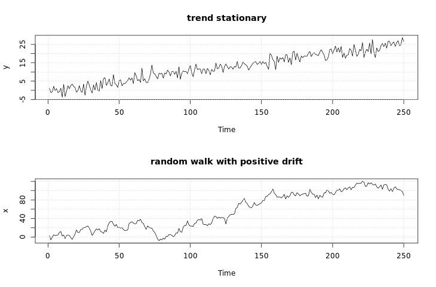

```{r setup, include=FALSE}
knitr::opts_chunk$set(echo = TRUE)
```

**Time series regression models**

Regression: $Y_i = \beta X_i + \epsilon_i$, where $\epsilon_i$ is white noise
- assumptions about errors:
  - independent
  - normally distributed
  - homoscedastic
  - i.e., white noise
- white noise:
  - independent normals with common variance
  - is basic building block of time series
  
AutoRegression: $X_t = \phi X_{t-1} + \epsilon_t$ ($\epsilon_t$ is white noise)
- assuming that $t$ and $t-1$ are not correlated
  - may lead to bad forecasts
  
Moving Average: $\epsilon_t = W_t + \theta W_{t-1}$ ($W_t$ is white noise)  
- moving average assumes $t$ and $t-1$ **are** correlated 

ARMA: $X_t = \phi X_{t-1} + W_t + \theta W_{t-1}$
- AutoRegression + Moving Average
- i.e., AutoRegression with autocorrelated errors

**Data play**

In the video, you saw various types of data. In this exercise, you will plot additional time series data and compare them to what you saw in the video. It is useful to think about how these time series compare to the series in the video. In particular, concentrate on the type of trend, seasonality or periodicity, and homoscedasticity.

Before you use a data set for the first time, you should use the help system to see the details of the data. For example, use `help(AirPassengers)` or `?AirPassengers` to see the details of the series.

```{r}
library(pacman)
p_load(astsa, xts)

# View a detailed description of AirPassengers
help(AirPassengers)

# Plot AirPassengers
plot(AirPassengers)

# Plot the DJIA daily closings
plot(astsa::djia$Close)

# Plot the Southern Oscillation Index (soi)
plot(astsa::soi)

```

As you can see, the `AirPassengers` dataset contains monthly information on airline passengers from 1949 through 1960. Note that when you plot ts objects using `plot()`, the data will automatically be plotted over time.

The `AirPassengers` data show a handful of important qualities, including seasonality, trend, and heteroscedasticity, which distinguish the data from standard white noise.

**Stationarity and nonstationarity**

A time series is stationary when it is "stable", meaning:
- the mean is constant over time (no trend)
- the correlation structure remains constant over time

**Stationarity**

Given data, $x_1,...,x_n$ we can estimate by averaging

For example, if the mean is constant, we can estimate it by the sample average $\bar{x}$

Pairs can be used to estimate **correlation** on different lags:
- $(x_1,x_2), (x_2,x_3), (x_3,x_4)$, for lag 1
- $(x_1,x_3), (x_2,x_4), (x_3,x_5)$, for lag 2

**Random Walk trend**

Not stationary, but differenced data are stationary
- e.g., $X_t$ for global temperatures trends upwards
- $X_t-X_{t-1}$ is stationary with random movement

**Trend Stationarity**

Stationary around a trend, differencing still works like Random Walk!

**Nonstationarity in trend and variability**
- First log (stabilize variance and/or linearize trend), then difference
  - $X_t$
  - $log(X_t)$
  - $log(X_t) - log(X_{t-1})$

**Differencing**

As seen in the video, when a time series is trend stationary, it will have stationary behavior around a trend. A simple example is $Y_t=\alpha+\beta t+Xt$ where $X_t$ is stationary.

A different type of model for trend is *random* walk, which has the form $X_t=X_{t−1}+W_t$, where $W_t$ is white noise. It is called a random walk because at time $t$ the process is where it was at time $t−1$ plus a completely random movement. For a *random walk with drift*, a constant is added to the model and will cause the random walk to drift in the direction (positive or negative) of the drift.

We simulated and plotted data from these models. Note the difference in the behavior of the two models.

In both cases, simple *differencing* can remove the trend and coerce the data to stationarity. Differencing looks at the difference between the value of a time series at a certain point in time and its preceding value. That is, $X_t−X_{t−1}$ is computed.

To check that it works, you will difference each generated time series and plot the detrended series. If a time series is in `x`, then `diff(x)` will have the detrended series obtained by differencing the data. To plot the detrended series, simply use `plot(diff(x))`.


```
# Plot detrended y (trend stationary)
plot(diff(y))
```

```
# Plot detrended x (random walk)
plot(diff(x))

```


As you can see, differencing both your trend stationary data and your random walk data has the effect of removing the trends, despite the important differences between the two datasets.

**Detrending data**

As you have seen in the previous exercise, differencing is generally good for removing trend from time series data. Recall that differencing looks at the difference between the value of a time series at a certain point in time and its preceding value.

In this exercise, you will use differencing diff() to detrend and plot real time series data.

```{r}
# Plot globtemp and detrended globtemp
par(mfrow = c(2,1))
plot(astsa::globtemp) 
plot(diff(astsa::globtemp))

# Plot cmort and detrended cmort
par(mfrow = c(2,1))
plot(astsa::cmort)
plot(diff(astsa::cmort))

```

Differencing is a great way to remove trends from your data.

**Dealing with trend and heteroscedasticity**
Here, we will coerce nonstationary data to stationarity by calculating the return or growth rate as follows.

Often time series are generated as

$X_t=(1+p_t)X_{t−1}$

meaning that the value of the time series observed at time $t$ equals the value observed at time $t−1$ and a small percent change $p_t$ at time $t$.

A simple deterministic example is putting money into a bank with a fixed interest $p$. In this case, $X_t$ is the value of the account at time period $t$ with an initial deposit of $X_0$.

Typically, $p_t$ is referred to as the *return* or *growth rate* of a time series, and this process is often stable.

For reasons that are outside the scope of this course, it can be shown that the growth rate $p_t$ can be approximated by

$Y_t = logXt−logX_{t−1} ≈ p_t$

In R, $p_t$ is often calculated as `diff(log(x))` and plotting it can be done in one line `plot(diff(log(x)))`.

```{r}
# astsa and xts are preloaded 

# Plot GNP series (gnp) and its growth rate
par(mfrow = c(2,1))
plot(astsa::gnp)
plot(diff(log(astsa::gnp)))

# Plot the DJIA closings (djia$Close) and its returns
par(mfrow = c(2,1))
plot(astsa::djia$Close)
plot(diff(log((astsa::djia$Close))))

```

Once again, by combining a few commands to manipulate your data, you can coerce otherwise nonstationary data to stationarity.

**Stationary time series: ARMA**

**Wold Decomposition**

Wold proved that any stationary time series may be represented as a linear combination of white noise:

$X_t = W_t + a_1W_{t-1} + a_2W_{t-2} + ...$

for constants $a_1, a_2, ...$

Any **ARMA** model has this form, which means they are suited to modeling time series

Note: Special case of MA(q) is already in this form, where constants are 0 after q-th term.

**Generating ARMA using arima.sim()
- Basic syntax
```
arima.sim(model, n, ...)
```
- `model` is a list with order of the model as `c(p, d, q)` and the coefficients
  - p - AR order
  - d - to be discussed
  - q - MA order

**Simulating ARMA models**

As we saw in the video, any stationary time series can be written as a linear combination of white noise. In addition, any ARMA model has this form, so it is a good choice for modeling stationary time series.

R provides a simple function called `arima.sim()` to generate data from an ARMA model. For example, the syntax for generating 100 observations from an MA(1) with parameter .9 is `arima.sim(model = list(order = c(0, 0, 1), ma = .9 ), n = 100)`. You can also use `order = c(0, 0, 0)` to generate white noise.

In this exercise, you will generate data from various ARMA models. For each command, generate **200** observations and plot the result.

```{r}
# Generate and plot white noise
WN <- arima.sim(model = list(order = c(0, 0, 0)), n = 200)
plot(WN)

# Generate and plot an MA(1) with parameter .9 by filtering the noise
MA <- arima.sim(model = list(order = c(0, 0, 1), ma = .9), n = 200)  
plot(MA)

# Generate and plot an AR(1) with parameters 1.5 and -.75
AR <- arima.sim(model = list(order = c(2, 0, 0), ar = c(1.5, -.75)), n = 200) 
plot(AR)

```

The `arima.sim()` command is a very useful way to quickly simulate time series data.