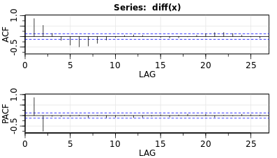
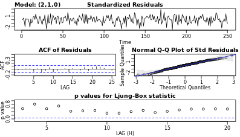
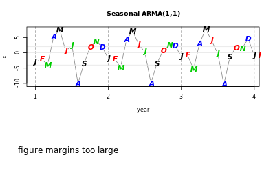
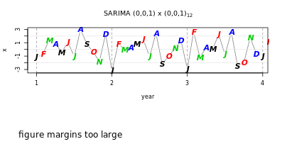
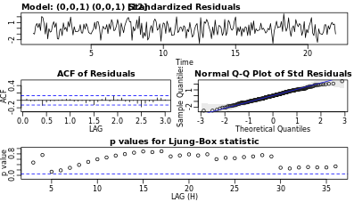

```{r setup, include=FALSE}
knitr::opts_chunk$set(echo = TRUE)
```

**Time series regression models**

Regression: $Y_i = \beta X_i + \epsilon_i$, where $\epsilon_i$ is white noise
- assumptions about errors:
  - independent
  - normally distributed
  - homoscedastic
  - i.e., white noise
- white noise:
  - independent normals with common variance
  - is basic building block of time series
  
AutoRegression: $X_t = \phi X_{t-1} + \epsilon_t$ ($\epsilon_t$ is white noise)
- assuming that $t$ and $t-1$ are not correlated
  - may lead to bad forecasts
  
Moving Average: $\epsilon_t = W_t + \theta W_{t-1}$ ($W_t$ is white noise)  
- moving average assumes $t$ and $t-1$ **are** correlated 

ARMA: $X_t = \phi X_{t-1} + W_t + \theta W_{t-1}$
- AutoRegression + Moving Average
- i.e., AutoRegression with autocorrelated errors

**Data play**

In the video, you saw various types of data. In this exercise, you will plot additional time series data and compare them to what you saw in the video. It is useful to think about how these time series compare to the series in the video. In particular, concentrate on the type of trend, seasonality or periodicity, and homoscedasticity.

Before you use a data set for the first time, you should use the help system to see the details of the data. For example, use `help(AirPassengers)` or `?AirPassengers` to see the details of the series.

```{r}
library(pacman)
p_load(astsa, xts)

# View a detailed description of AirPassengers
help(AirPassengers)

# Plot AirPassengers
plot(AirPassengers)

# Plot the DJIA daily closings
plot(astsa::djia$Close)

# Plot the Southern Oscillation Index (soi)
plot(astsa::soi)

```

As you can see, the `AirPassengers` dataset contains monthly information on airline passengers from 1949 through 1960. Note that when you plot ts objects using `plot()`, the data will automatically be plotted over time.

The `AirPassengers` data show a handful of important qualities, including seasonality, trend, and heteroscedasticity, which distinguish the data from standard white noise.

**Stationarity and nonstationarity**

A time series is stationary when it is "stable", meaning:
- the mean is constant over time (no trend)
- the correlation structure remains constant over time

**Stationarity**

Given data, $x_1,...,x_n$ we can estimate by averaging

For example, if the mean is constant, we can estimate it by the sample average $\bar{x}$

Pairs can be used to estimate **correlation** on different lags:
- $(x_1,x_2), (x_2,x_3), (x_3,x_4)$, for lag 1
- $(x_1,x_3), (x_2,x_4), (x_3,x_5)$, for lag 2

**Random Walk trend**

Not stationary, but differenced data are stationary
- e.g., $X_t$ for global temperatures trends upwards
- $X_t-X_{t-1}$ is stationary with random movement

**Trend Stationarity**

Stationary around a trend, differencing still works like Random Walk!

**Nonstationarity in trend and variability**
- First log (stabilize variance and/or linearize trend), then difference
  - $X_t$
  - $log(X_t)$
  - $log(X_t) - log(X_{t-1})$

**Differencing**

As seen in the video, when a time series is trend stationary, it will have stationary behavior around a trend. A simple example is $Y_t=\alpha+\beta t+Xt$ where $X_t$ is stationary.

A different type of model for trend is *random* walk, which has the form $X_t=X_{t−1}+W_t$, where $W_t$ is white noise. It is called a random walk because at time $t$ the process is where it was at time $t−1$ plus a completely random movement. For a *random walk with drift*, a constant is added to the model and will cause the random walk to drift in the direction (positive or negative) of the drift.

We simulated and plotted data from these models. Note the difference in the behavior of the two models.

In both cases, simple *differencing* can remove the trend and coerce the data to stationarity. Differencing looks at the difference between the value of a time series at a certain point in time and its preceding value. That is, $X_t−X_{t−1}$ is computed.

To check that it works, you will difference each generated time series and plot the detrended series. If a time series is in `x`, then `diff(x)` will have the detrended series obtained by differencing the data. To plot the detrended series, simply use `plot(diff(x))`.


```
# Plot detrended y (trend stationary)
plot(diff(y))
```

```
# Plot detrended x (random walk)
plot(diff(x))

```


As you can see, differencing both your trend stationary data and your random walk data has the effect of removing the trends, despite the important differences between the two datasets.

**Detrending data**

As you have seen in the previous exercise, differencing is generally good for removing trend from time series data. Recall that differencing looks at the difference between the value of a time series at a certain point in time and its preceding value.

In this exercise, you will use differencing diff() to detrend and plot real time series data.

```{r}
# Plot globtemp and detrended globtemp
par(mfrow = c(2,1))
plot(astsa::globtemp) 
plot(diff(astsa::globtemp))

# Plot cmort and detrended cmort
par(mfrow = c(2,1))
plot(astsa::cmort)
plot(diff(astsa::cmort))

```

Differencing is a great way to remove trends from your data.

**Dealing with trend and heteroscedasticity**
Here, we will coerce nonstationary data to stationarity by calculating the return or growth rate as follows.

Often time series are generated as

$X_t=(1+p_t)X_{t−1}$

meaning that the value of the time series observed at time $t$ equals the value observed at time $t−1$ and a small percent change $p_t$ at time $t$.

A simple deterministic example is putting money into a bank with a fixed interest $p$. In this case, $X_t$ is the value of the account at time period $t$ with an initial deposit of $X_0$.

Typically, $p_t$ is referred to as the *return* or *growth rate* of a time series, and this process is often stable.

For reasons that are outside the scope of this course, it can be shown that the growth rate $p_t$ can be approximated by

$Y_t = logXt−logX_{t−1} ≈ p_t$

In R, $p_t$ is often calculated as `diff(log(x))` and plotting it can be done in one line `plot(diff(log(x)))`.

```{r}
# astsa and xts are preloaded 

# Plot GNP series (gnp) and its growth rate
par(mfrow = c(2,1))
plot(astsa::gnp)
plot(diff(log(astsa::gnp)))

# Plot the DJIA closings (djia$Close) and its returns
par(mfrow = c(2,1))
plot(astsa::djia$Close)
plot(diff(log((astsa::djia$Close))))

```

Once again, by combining a few commands to manipulate your data, you can coerce otherwise nonstationary data to stationarity.

**Stationary time series: ARMA**

**Wold Decomposition**

Wold proved that any stationary time series may be represented as a linear combination of white noise:

$X_t = W_t + a_1W_{t-1} + a_2W_{t-2} + ...$

for constants $a_1, a_2, ...$

Any **ARMA** model has this form, which means they are suited to modeling time series

Note: Special case of MA(q) is already in this form, where constants are 0 after q-th term.

**Generating ARMA using arima.sim()
- Basic syntax
```
arima.sim(model, n, ...)
```
- `model` is a list with order of the model as `c(p, d, q)` and the coefficients
  - p - AR order
  - d - to be discussed
  - q - MA order

**Simulating ARMA models**

As we saw in the video, any stationary time series can be written as a linear combination of white noise. In addition, any ARMA model has this form, so it is a good choice for modeling stationary time series.

R provides a simple function called `arima.sim()` to generate data from an ARMA model. For example, the syntax for generating 100 observations from an MA(1) with parameter .9 is `arima.sim(model = list(order = c(0, 0, 1), ma = .9 ), n = 100)`. You can also use `order = c(0, 0, 0)` to generate white noise.

In this exercise, you will generate data from various ARMA models. For each command, generate **200** observations and plot the result.

```{r}
# Generate and plot white noise
WN <- arima.sim(model = list(order = c(0, 0, 0)), n = 200)
plot(WN)

# Generate and plot an MA(1) with parameter .9 by filtering the noise
MA <- arima.sim(model = list(order = c(0, 0, 1), ma = .9), n = 200)  
plot(MA)

# Generate and plot an AR(1) with parameters 1.5 and -.75
AR <- arima.sim(model = list(order = c(2, 0, 0), ar = c(1.5, -.75)), n = 200) 
plot(AR)

```

The `arima.sim()` command is a very useful way to quickly simulate time series data.

**AR and MA models**

Identifying model types


**Estimation**

- Estimation for time series is similar to using least squares for regression
- Estimates are obtained numerically using ideas of Gauss and Newton


**Fitting an AR(1) model**

Recall that you use the ACF and PACF pair to help identify the orders $p$ and $q$ of an ARMA model. 

In this exercise, you will generate data from the AR(1) model,

$X_t=.9X_{t−1}+W_t$,

look at the simulated data and the sample ACF and PACF pair to determine the order. Then, you will fit the model and compare the estimated parameters to the true parameters.

Throughout this course, you will be using `sarima()` from the [astsa](https://www.rdocumentation.org/packages/astsa/versions/1.6/) package to easily fit models to data. The command produces a residual diagnostic graphic that can be ignored until diagnostics is discussed later in the chapter.

```{r}
# Generate 100 observations from the AR(1) model
x <- arima.sim(model = list(order = c(1, 0, 0), ar = .9), n = 100)

# Plot the generated data  
plot(x)

# Plot the sample P/ACF pair
astsa::acf2(x)

# Fit an AR(1) to the data and examine the t-table
astsa::sarima(x, p = 1, d = 0, q = 0)

```

As you can see, the `sarima()` command provides extensive output to understand the results of your model fit. What do you glean from this output?

**Fitting an AR(2) model**

For this exercise, we generated data from the AR(2) model,

$X_t=1.5X_{t−1}−.75X_{t−2}+W_t$

Look at the simulated dataand the sample ACF and PACF pair to determine the model order. Then fit the model and compare the estimated parameters to the true parameters.

```{r}
x <- arima.sim(model = list(order = c(2, 0, 0), ar = c(1.5, -.75)), n = 200)

# Plot x
plot(x)

# Plot the sample P/ACF of x
astsa::acf2(x)

# Fit an AR(2) to the data and examine the t-table
astsa::sarima(x, p = 2, d = 0, q = 0)
```

As you can see from the t-table output, the estimates produced by the `sarima()` command are close to the true parameters.

**Fitting an MA(1) model**

In this exercise, we generated data from an MA(1) model,

$X_t=W_t−.8W_{t−1}$

Look at the simulated data and the sample ACF and PACF to determine the order based on the table given in the first exercise. Then fit the model.

Recall that for pure MA(q) models, the theoretical ACF will cut off at lag q while the PACF will tail off.

```{r}
x <- arima.sim(model = list(order = c(0, 0, 1), ma = -.8), n = 100)

# Plot x
plot(x)

# Plot the sample P/ACF of x
acf2(x)

# Fit an MA(1) to the data and examine the t-table
sarima(x, p = 0, d = 0, q = 1)
```

Once again, the parameter estimates produced by `sarima()` come quite close to the input specified when the data was created (-.8)

**AR and MA together: ARMA**

$X_t = \phi X_{t-1} + W_t + \theta W_{t-1}$
      autoregression  with  correlated errors
      
**Fitting an ARMA model**

You are now ready to merge the AR model and the MA model into the ARMA model. We generated data from the ARMA(2,1) model,

$X_t= X_{t−1} − .9X_{t−2} + W_t + .8W_{t−1}$,

```
x <- arima.sim(model = list(order = c(2, 0, 1), ar = c(1, -.9), ma = .8), n = 250). 
```

Look at the simulated data and the sample ACF and PACF pair to determine a possible model.

Recall that for $ARMA(p,q)$ models, both the theoretical ACF and PACF tail off. In this case, the orders are difficult to discern from data and it may not be clear if either the sample ACF or sample PACF is cutting off or tailing off. In this case, you know the actual model orders, so fit an ARMA(2,1) to the generated data. General modeling strategies will be discussed further in the course.

```{r}
x <- arima.sim(model = list(order = c(2, 0, 1), ar = c(1, -.9), ma = .8), n = 250)

# astsa is preloaded

# Plot x
plot(x)

# Plot the sample P/ACF of x
astsa::acf2(x)

# Fit an ARMA(2,1) to the data and examine the t-table
astsa::sarima(x, p = 2, d = 0, q = 1)
```

As you can see, the `sarima()` command can estimate parameter values for many different types of models, including AR, MA, and ARMA.

**Identify an ARMA model**

Look at (1) the data plots and (2) the sample ACF and PACF of the logged and differenced varve series:

```
dl_varve <- diff(log(astsa::varve))
```

Use help(varve) to read about the data or use an internet search on varve to learn more.

From the ACF and PACF, which model is the most likely model for `dl_varve`?


Remember that an MA(q) model has an ACF that cuts off at lag q and a PACF that tails off. In this case, the ACF cuts off at lag 1 and the PACF tails off, suggesting an MA(1) model.

**Model choice and residual analysis**

**AIC and BIC**

Error|     |Number of Parameters
:---:|:---:|:------------------:
$\textit{average(observed-predicted)}^\textit{2}$| + |$\textit{k(p+q)}$

- AIC and BIC measure the error and penalize (differently) for adding parameters
- for example AIC has *k = 2* and BIC has *k = log(n)*
- Goal: find the model with the smallest AIC or BIC

**Residual Analysis**

`sarima()` includes residual analysis and graphic showing:

1. Standardized residuals
  - should be white noise
2. Sample ACF of residuals
  - points within blue lines indicates normality
3. Normal Q-Q plot
  - points should mostly be on the line
4. Q-statistic p-values
  - points above blue line indicates normality

**Model choice - I**
Based on the sample P/ACF pair of the logged and differenced varve data (`dl_varve`), an MA(1) was indicated. The best approach to fitting ARMA is to start with a low order model, and then try to add a parameter at a time to see if the results change.

In this exercise, you will fit various models to the `dl_varve` data and note the AIC and BIC for each model. In the next exercise, you will use these AICs and BICs to choose a model. Remember that you want to retain the model with the smallest AIC and/or BIC value.

A note before you start:

`sarima(x, p = 0, d = 0, q = 1)` and `sarima(x, 0, 0, 1)`

are the same.

```{r}
dl_varve <- diff(log(astsa::varve))

# Fit an MA(1) to dl_varve.   
sarima(dl_varve, p = 0, d = 0, q = 1)

# Fit an MA(2) to dl_varve. Improvement?
sarima(dl_varve, p = 0, d = 0, q = 2)

# Fit an ARMA(1,1) to dl_varve. Improvement?
sarima(dl_varve, p = 1, d = 0, q = 1)
```

IC and BIC help you find the model with the smallest error using the least number of parameters. The idea is based on the *parsimony principle*, which is basic to all science and tells you to choose the simplest scientific explanation that fits the evidence.

**Residual analysis - I**

As you saw in the video, an `sarima()` run includes a residual analysis graphic. Specifically, the output shows (1) the standardized residuals, (2) the sample ACF of the residuals, (3) a normal Q-Q plot, and (4) the p-values corresponding to the Box-Ljung-Pierce Q-statistic.

In each run, check the four residual plots as follows (model assumes errors are Gaussian white noise):

  1. The standardized residuals should behave as a white noise sequence with mean zero and variance one. Examine the residual plot for departures from this behavior.
  2. The sample ACF of the residuals should look like that of white noise. Examine the ACF for departures from this behavior.
  3. Normality is an essential assumption when fitting ARMA models. Examine the Q-Q plot for departures from normality and to identify outliers.
  4. Use the Q-statistic plot to help test for departures from whiteness of the residuals.
  
As in the previous exercise, `dl_varve <- diff(log(varve))`, which is plotted below a plot of `varve`. The [astsa](https://www.rdocumentation.org/packages/astsa/versions/1.6/) package is preloaded.

```{r}
par(mfrow = c(2,1))
plot(astsa::varve) 
plot(dl_varve)

# Fit an MA(1) to dl_varve. Examine the residuals  
sarima(dl_varve, p = 0, d = 0, q = 1)

# Fit an ARMA(1,1) to dl_varve. Examine the residuals
sarima(dl_varve, p = 1, d = 0, q = 1)
```

By now you have mastered constructing parameters through the `sarima()` command, but the rich and comprehensive output of this command is always worth exploring. What did you learn about the residuals produced by your MA(1) and ARMA(1,1) models?

**ARMA get in**
By now you have gained considerable experience fitting ARMA models to data, but before you start celebrating, try one more exercise (sort of) on your own.

The data in `oil` are crude oil, WTI spot price FOB (in dollars per barrel), weekly data from 2000 to 2008. Use your skills to fit an ARMA model to the returns. The weekly crude oil prices (`oil`) are plotted for you. Throughout the exercise, work with the returns, which you will calculate.

As before, the **astsa** package is preloaded for you. The data are preloaded as `oil`.

```{r}
oil <- ts(astsa::oil, start = 2000, end = 2008, frequency = 52)
plot(oil, main = "Crude Oil - USD per Barrel")

# Calculate approximate oil returns
oil_returns <- diff(log(oil))

# Plot oil_returns. Notice the outliers.
plot(oil_returns)

# Plot the P/ACF pair for oil_returns
acf2(oil_returns)

# Assuming both P/ACF are tailing, fit a model
sarima(oil_returns, p = 1, d = 0, q = 1)
```

You have now successfully manipulated some real-world time series data, explored the qualities of that data, and modeled an ARMA(1,1) model to your data. In the next chapter, you will explore more complicated models.

**ARIMA - integrated ARMA**

**Identifying ARIMA**

- a time series exhibits ARIMA behavior if the differenced data has ARMA behavior

**ACF and PCF of an integrated ARMA**

- ACF has a linear decay
- PCF is close to 1 at lag one, and zero afterwards.

**ARIMA - plug and play**

As you saw in the video, a time series is called $ARIMA(p,d,q)$ if the differenced series (of order $d$) is $ARMA(p,q)$.

To get a sense of how the model works, you will analyze simulated data from the integrated model

$Y_t =.9Y_{t−1} + W_t$

where $Y_t = \nabla X_t = X_t − X_{t−1}$. In this case, the model is an $ARIMA(1,1,0)$ because the differenced data are an autoregression of order one.

The simulated time series is in `x` and it was generated in R as

```
x <- arima.sim(model = list(order = c(1, 1, 0), ar = .9), n = 200)
```

You will plot the generated data and the sample ACF and PACF of the generated data to see how integrated data behave. Then, you will difference the data to make it stationary. You will plot the differenced data and the corresponding sample ACF and PACF to see how differencing makes a difference.

As before, the [astsa](https://www.rdocumentation.org/packages/astsa/versions/1.6/) package is preloaded in your workspace. Data from an $ARIMA(1,1,0)$ with AR parameter .9 is saved in object `x`.
```{r}
x <- arima.sim(model = list(order = c(1, 1, 0), ar = .9), n = 200)

# Plot x
plot(x)

# Plot the P/ACF pair of x
acf2(x)

# Plot the differenced data
plot(diff(x))

# Plot the P/ACF pair of the differenced data
acf2(diff(x))
```

As you can see, differencing the data in your $ARIMA(1,1,0)$ model makes it stationary and allows for further analysis.

**Simulated ARIMA**

Before analyzing actual time series data, you should try working with a slightly more complicated model.

Here, we generated 250 observations from the $ARIMA(2,1,0)$ model with drift given by

$Y_t = 1 + 1.5Y_{t−1} − .75Y_{t−2} + W_t$

where $Y_t = \nabla X_t = X_t − X_{t−1}$.

You will use the established techniques to fit a model to the data.

The **astsa** package is preloaded and the generated data are in `x`. The series `x` and the detrended series` y <- diff(x)` have been plotted.


```
# Plot sample P/ACF of differenced data and determine model
acf2(diff(x))
```

```
# Estimate parameters and examine output
sarima(x, p = 2, d = 1, q = 0)
```
```
Call:
stats::arima(x = xdata, order = c(p, d, q), seasonal = list(order = c(P, D, 
    Q), period = S), xreg = constant, transform.pars = trans, fixed = fixed, 
    optim.control = list(trace = trc, REPORT = 1, reltol = tol))

Coefficients:
         ar1      ar2  constant
      1.5197  -0.7669    1.2335
s.e.  0.0401   0.0401    0.2570

sigma^2 estimated as 1.004:  log likelihood = -355.41,  aic = 718.82

$degrees_of_freedom
[1] 246

$ttable
         Estimate     SE  t.value p.value
ar1        1.5197 0.0401  37.9191       0
ar2       -0.7669 0.0401 -19.1321       0
constant   1.2335 0.2570   4.7996       0

$AIC
[1] 2.886818

$AICc
[1] 2.887211

$BIC
[1] 2.943323
```


As you can see from your t-table, the estimated parameters are very close to 1.5 and -0.75.

**Global warming**

Now that you have some experience fitting an ARIMA model to simulated data, your next task is to apply your skills to some real world data.

The data in `globtemp` (from astsa) are the annual global temperature deviations to 2015. In this exercise, you will use established techniques to fit an ARIMA model to the data. A plot of the data shows random walk behavior, which suggests you should work with the *differenced* data. The differenced data `diff(globtemp)` are also plotted.

After plotting the sample ACF and PACF of the differenced data `diff(globtemp)`, you can say that either

1. The ACF and the PACF are both tailing off, implying an ARIMA(1,1,1) model.
2. The ACF cuts off at lag 2, and the PACF is tailing off, implying an ARIMA(0,1,2) model.
3. The ACF is tailing off and the PACF cuts off at lag 3, implying an ARIMA(3,1,0) model. Although this model fits reasonably well, it is the worst of the three (you can check it) because it uses too many parameters for such small autocorrelations.

After fitting the first two models, check the AIC and BIC to choose the preferred model.

```{r}
par(mfrow = c(2,1))
plot(astsa::globtemp) 
plot(diff(astsa::globtemp))

# Plot the sample P/ACF pair of the differenced data 
acf2(diff(globtemp))

# Fit an ARIMA(1,1,1) model to globtemp
sarima(globtemp, p = 1, d = 1, q = 1)

# Fit an ARIMA(0,1,2) model to globtemp. Which model is better?
sarima(globtemp, p = 0, d = 1, q = 2)
```

Judging by the AIC and BIC, the ARIMA(0,1,2) model performs better than the ARIMA(1,1,1) model on the `globtemp` data. Remember to thoroughly examine the output of your `sarima()` command to gain a full understanding of your model.

**ARIMA diagnostics**

**Diagnostics - simulated overfitting**

One way to check an analysis is to overfit the model by adding an extra parameter to see if it makes a difference in the results. If adding parameters changes the results drastically, then you should rethink your model. If, however, the results do not change by much, you can be confident that your fit is correct.

We generated 250 observations from an ARIMA(0,1,1) model with MA parameter .9. First, you will fit the model to the data using established techniques.

Then, you can check a model by overfitting (adding a parameter) to see if it makes a difference. In this case, you will add an additional MA parameter to see that it is not needed.

As usual, the [astsa]() package is preloaded and the generated data in `x` are plotted in your workspace. The differenced data `diff(x)` are also plotted. Note that it looks stationary.

```{r}
x <- arima.sim(model = list(order = c(0, 1, 1), ma = .9), n = 250)

par(mfrow = c(2,1))
plot(x) 
plot(diff(x))

# Plot sample P/ACF pair of the differenced data
acf2(diff(x))

# Fit the first model, compare parameters, check diagnostics
astsa::sarima(x, p = 0, d = 1, q = 1)

# Fit the second model and compare fit
astsa::sarima(x, p = 0, d = 1, q = 2)   
```

As you can see from the t-table, the second MA parameter is not significantly different from zero and the first MA parameter is approximately the same in each run. Also, the AIC and BIC both increase when the parameter is added. In addition, the residual analysis of your ARIMA(0,1,1) model is fine. All of these facts together indicate that you have a successful model fit.

**Diagnostics - global temperatures**

You can now finish your analysis of global temperatures. Recall that you previously fit two models to the data in `globtemp`, an ARIMA(1,1,1) and an ARIMA(0,1,2). In the final analysis, check the residual diagnostics and use AIC and BIC for model choice.

The data are plotted for you.

```{r}
plot(astsa::globtemp, ylab = "globtemp", main = "Global Temperature Deviations")

# Fit ARIMA(0,1,2) to globtemp and check diagnostics  
sarima(globtemp, p = 0, d = 1, q = 2)

# Fit ARIMA(1,1,1) to globtemp and check diagnostics
sarima(globtemp, p = 1, d = 1, q = 1)

# Which is the better model?
"ARIMA(0,1,2)"
```

Your model diagnostics suggest that both the ARIMA(0,1,2) and the ARIMA(1,1,1) are reasonable models. However, the AIC and BIC suggest that the ARIMA(0,1,2) performs slightly better, so this should be your preferred model. Although you were not asked to do so, you can use overfitting to assess the final model. For example, try fitting an ARIMA(1,1,2) or an ARIMA(0,1,3) to the data.

**Forecasting ARIMA**

- the model describes how the dynamics of the time series behave over time.
- forecasting simply continues the mdoel dynamics into the future.\
- use `sarima.for()` to forecast in the `astsa-package`
  - red plotted area is predicted values
  - dark gray band is 1 * RMSPE
  - light gray band is 2 * RMSPE

**Forecasting simulated ARIMA**

Now that you are an expert at fitting ARIMA models, you can use your skills for forecasting. First, you will work with simulated data.

We generated 120 observations from an ARIMA(1,1,0) model with AR parameter .9. The data are in `y` and the first 100 observations are in x. These observations are plotted for you. You will fit an ARIMA(1,1,0) model to the data in `x` and verify that the model fits well. Then use [sarima.for()](https://www.rdocumentation.org/packages/astsa/versions/1.6/topics/sarima.for) from `astsa` to forecast the data 20 time periods ahead. You will then compare the forecasts to the actual data in `y`.

The basic syntax for forecasting is `sarima.for(data, n.ahead, p, d, q)` where `n.ahead` is a positive integer that specifies the forecast horizon. The predicted values and their standard errors are printed, the data are plotted in black, and the forecasts are in red along with 2 mean square prediction error bounds as blue dashed lines.

The [astsa](https://www.rdocumentation.org/packages/astsa/versions/1.6/) package is preloaded and the data (`x`) and differenced data (`diff(x)`) are plotted.

```{r}
y <- arima.sim(model = list(order = c(1, 1, 0), ar = .9), n = 120)
x <- ts(y, start = 1, end = 100, frequency = 1)

par(mfrow = c(2,1))
plot(x) 
plot(diff(x))

# Plot P/ACF pair of differenced data 
astsa::acf2(diff(x))

# Fit model - check t-table and diagnostics
astsa::sarima(x, p = 1, d = 1, q = 0)

# Forecast the data 20 time periods ahead
astsa::sarima.for(x, n.ahead = 20, p = 1, d = 1, q = 0) 
lines(y)
```

As you can see, the `sarima.for()` command provides a simple method for forecasting. Although the blue error bands are relatively wide, the prediction remains quite valuable.

**Forecasting global temperatures**
Now you can try forecasting real data.

Here, you will forecast the annual global temperature deviations `globtemp` to 2050. Recall that in previous exercises, you fit an ARIMA(0,1,2) model to the data. You will refit the model to confirm it, and then forecast the series 35 years into the future.

The **astsa** package is preloaded and the data are plotted.

```{r}
plot(astsa::globtemp, ylab = "globtemp", main = "Global Temperature Deviations")

# Fit an ARIMA(0,1,2) to globtemp and check the fit
sarima(globtemp, p = 0, d = 1, q = 2)

# Forecast data 35 years into the future
sarima.for(globtemp, n.ahead = 35, p = 0, d = 1, q = 2) 
```

In the next chapter, you will learn how to analyze seasonal time series data.

**Pure seasonal models**

- often collect data with a known seasonal component
- air passengers (1 cycle every S = 12 months)
- Johnson & Johnson earnings (1 cycle every S = 4 quarters)

Consider pure seasonal models such as an SAR$(P = 1)_{s=12}$

$X_t = \Phi X_{t-12} + W_t$


- all lags are at the seasonal level

**Fit a pure seasonal model**
As with other models, you can fit seasonal models in R using the `sarima()` command in the **astsa** package.

To get a feeling of how pure seasonal models work, it is best to consider simulated data. We generated 250 observations from a pure seasonal model given by

$X_t = .9X_{t−12} + Wt + .5W_{t−12}$,

which we would denote as a SARMA$(P = 1, Q = 1)_S = 12$. Three years of data and the model ACF and PACF are plotted for you.

You will compare the sample ACF and PACF values from the generated data to the true values.

The `astsa` package is preloaded for you and the generated data are in `x`.



```
# Plot sample P/ACF to lag 60 and compare to the true values
acf2(x, max.lag = 60)
```

```
# Fit the seasonal model to x
sarima(x, p = 0, d = 0, q = 0, P = 1, D = 0, Q = 1, S = 12)
```
```
Call:
stats::arima(x = xdata, order = c(p, d, q), seasonal = list(order = c(P, D, 
    Q), period = S), xreg = xmean, include.mean = FALSE, transform.pars = trans, 
    fixed = fixed, optim.control = list(trace = trc, REPORT = 1, reltol = tol))

Coefficients:
        sar1    sma1    xmean
      0.9311  0.4824  -0.5766
s.e.  0.0204  0.0633   0.8797

sigma^2 estimated as 0.9767:  log likelihood = -372.74,  aic = 753.48

$degrees_of_freedom
[1] 249

$ttable
      Estimate     SE t.value p.value
sar1    0.9311 0.0204 45.6189  0.0000
sma1    0.4824 0.0633  7.6158  0.0000
xmean  -0.5766 0.8797 -0.6554  0.5128

$AIC
[1] 2.989992

$AICc
[1] 2.990377

$BIC
[1] 3.046015
```


Fitting a seasonal model using `sarima()` requires a few additional arguments, but follows the same basic process as nonseasonal models.

**Mixed seasonal models**

- mixed models: SARIMA$(p, d, q)$ x $(P, D, Q)_s$ model
- consider a SARIMA$(0, 0, 1)$ x $(1, 0, 0)_{12}$ model
  - $X_t = \Phi X_{t-12} + W_t + \theta W_{t-1}$
  - SAR(1): value this month related to last year's value $X_{t-12}$
  - MA(1): this month's value related to last month's shock $W_{t-1}$

**Fit a mixed seasonal model**

Pure seasonal dependence such as that explored earlier in this chapter is relatively rare. Most seasonal time series have *mixed* dependence, meaning only some of the variation is explained by seasonal trends.

Recall that the full seasonal model is denoted by SARIMA$(p,d,q)$x$(P,D,Q)_S$ where capital letters denote the seasonal orders.

As before, this exercise asks you to compare the sample P/ACF pair to the true values for some simulated seasonal data and fit a model to the data using `sarima()`. This time, the simulated data come from a mixed seasonal model, SARIMA$(0,0,1)$x$(0,0,1)_{12}$. The plots show three years of data, as well as the model ACF and PACF. Notice that, as opposed to the pure seasonal model, there are correlations at the nonseasonal lags as well as the seasonal lags.

As always, the [astsa](https://www.rdocumentation.org/packages/astsa/versions/1.6/) package is preloaded. The generated data are in `x`.


```
# Plot sample P/ACF pair to lag 60 and compare to actual
acf2(x,  max.lag = 60)
```

```
# Fit the seasonal model to x
sarima(x, p = 0, d = 0, q = 1, P = 0, D = 0, Q = 1, S = 12)
```
```
Call:
stats::arima(x = xdata, order = c(p, d, q), seasonal = list(order = c(P, D, 
    Q), period = S), xreg = xmean, include.mean = FALSE, transform.pars = trans, 
    fixed = fixed, optim.control = list(trace = trc, REPORT = 1, reltol = tol))

Coefficients:
          ma1    sma1   xmean
      -0.6142  0.7888  0.0784
s.e.   0.0565  0.0475  0.0430

sigma^2 estimated as 1.005:  log likelihood = -364.26,  aic = 736.52

$degrees_of_freedom
[1] 249

$ttable
      Estimate     SE  t.value p.value
ma1    -0.6142 0.0565 -10.8809  0.0000
sma1    0.7888 0.0475  16.6094  0.0000
xmean   0.0784 0.0430   1.8253  0.0692

$AIC
[1] 2.922696

$AICc
[1] 2.92308

$BIC
[1] 2.978718
```


Time series data collected on a seasonal basis typically have mixed dependence. For example, what happens in June is often related to what happened in May as well as what happened in June of last year.

**Data analysis - unemployment I**

In the video, we fit a seasonal ARIMA model to the log of the monthly `AirPassengers` data set. You will now start to fit a seasonal ARIMA model to the monthly US unemployment data, `unemp`, from the `astsa` package.

The first thing to do is to plot the data, notice the trend and the seasonal persistence. Then look at the detrended data and remove the seasonal persistence. After that, the fully differenced data should look stationary.

The **astsa** package is preloaded in your workspace.

```{r}
# Plot unemp 
plot(unemp, main = "Unemployment")

# Difference your data and plot
d_unemp <- diff(unemp)
plot(d_unemp, main = "Differenced Unemployment")

# Plot seasonal differenced diff_unemp
dd_unemp <- diff(d_unemp, lag = 12)   
plot(dd_unemp, main = "Seasonal Differenced Unemployment")
```

Now that you have removed the trend and seasonal variation in unemployment, the data appear to be stationary.

**Data analysis - unemployment II**

Now, you will continue fitting an SARIMA model to the monthly US unemployment `unemp` time series by looking at the sample ACF and PACF of the fully differenced series.

*Note that the lag axis in the sample P/ACF plot is in terms of years*. Thus, lags 1, 2, 3, … represent 1 year (12 months), 2 years (24 months), 3 years (36 months), …

Once again, the [astsa](https://www.rdocumentation.org/packages/astsa/versions/1.6/) package is preloaded in your workspace.

```{r}
# Plot P/ACF pair of the fully differenced data to lag 60
dd_unemp <- diff(diff(unemp), lag = 12)
acf2(dd_unemp, max.lag = 60)

# Fit an appropriate model
sarima(unemp, p = 2, d = 1, q = 0, P = 0, D = 1, Q = 1, S = 12)
```

As always, keep a close eye on the output from your `sarima()` command to get a feel for the fit of your model.

**Data analysis - commodity prices**

Making money in commodities is not easy. Most commodities traders lose money rather than make it. The package `astsa` includes the data set `chicken`, which is the monthly whole bird spot price, Georgia docks, US cents per pound, from August, 2001 to July, 2016.

The [astsa](https://www.rdocumentation.org/packages/astsa/versions/1.6/) package is preloaded in your R console and the data are plotted for you, note the trend and seasonal components.

First, you will use your skills to carefully fit an SARIMA model to the commodity. Later, you will use the fitted model to try and forecast the whole bird spot price.

After removing the trend, the sample ACF and PACF suggest an AR(2) model because the PACF cuts off after lag 2 and the ACF tails off. However, the ACF has a small seasonal component remaining. This can be taken care of by fitting an addition SAR(1) component.

By the way, if you are interested in analyzing other commodities from various regions, you can find many different time series at [index mundi](http://www.indexmundi.com/commodities/).

```{r}
plot(chicken, ylab = "Cents per Pound", main = "Chicken Prices")

# Plot differenced chicken
plot(diff(chicken)) 

# Plot P/ACF pair of differenced data to lag 60
acf2(diff(chicken), max.lag = 60)

# Fit ARIMA(2,1,0) to chicken - not so good
sarima(chicken, p = 2, d = 1, q = 0)

# Fit SARIMA(2,1,0,1,0,0,12) to chicken - that works
sarima(chicken, p = 2, d = 1, q = 0, P = 1, D = 0, Q = 0, S = 12)
```

You have successfully fit an ARIMA model to a commodity. If you are interested in analyzing other commodities from various regions, you can find many different time series at [index mundi](http://www.indexmundi.com/commodities/)

**Data analysis - birth rate**

Now you will use your new skills to carefully fit an SARIMA model to the `birth` time series from `astsa`. The data are monthly live births (adjusted) in thousands for the United States, 1948-1979, and includes the baby boom after WWII.

The `birth` data are plotted in your R console. Note the long-term trend (random walk) and the seasonal component of the data.

```{r}
plot(birth, main="US Birth Rate")

# Plot P/ACF to lag 60 of differenced data
d_birth <- diff(birth)
acf2(d_birth, max.lag = 60)

# Plot P/ACF to lag 60 of seasonal differenced data
dd_birth <- diff(d_birth, lag = 12)
acf2(dd_birth, max.lag = 60)

# Fit SARIMA(0,1,1)x(0,1,1)_12. What happens?
sarima(birth, p = 0, d = 1, q = 1, P = 0, D = 1, Q = 1, S = 12)

# Fit another model, this time with an AR
sarima(birth, p = 1, d = 1, q = 1, P = 0, D = 1, Q = 1, S = 12)
```

The residual analysis from the first fit indicated that the residuals were not white noise. Hence, it was necessary to include an additional nonseasonal AR term to account for the extra correlation.

**Forecasting seasonal ARIMA**

**Forecasting monthly unemployment**

Previously, you fit an SARIMA$(2,1,0, 0,1,1)_{12}$ model to the monthly US unemployment time series `unemp`. You will now use that model to forecast the data 3 years.

The `unemp` data are preloaded into your R workspace and plotted.

```{r}
plot(unemp)

# Fit your previous model to unemp and check the diagnostics
sarima(unemp, p = 2, d = 1, q = 0, P = 0, D = 1, Q = 1, S = 12)

# Forecast the data 3 years into the future
sarima.for(unemp, n.ahead = 36, p = 2, d = 1, q = 0, P = 0, D = 1, Q = 1, S = 12)
```

As you can see, the forecast is able to replicate much of the seasonal variation in the original unemployment data.

**How hard is it to forecast commodity prices?**

As previously mentioned, making money in commodities is not easy. To see a difficulty in predicting a commodity, you will forecast the price of chicken to five years in the future. When you complete your forecasts, you will note that even just a few years out, the acceptable range of prices is very large. This is because commodities are subject to many sources of variation.

Recall that you previously fit an SARIMA$(2,1,0, 1,0,0)_{12}$ model to the monthly US chicken price series `chicken`. You will use this model to calculate your forecasts.

The [astsa](https://www.rdocumentation.org/packages/astsa/versions/1.6/) package is preloaded for you and the monthly price of chicken data (`chicken`) are plotted.

```{r}
plot(chicken)

# Fit the chicken model again and check diagnostics
sarima(chicken, p = 2, d = 1, q = 0, P = 1, D = 0, Q = 0, S = 12)

# Forecast the chicken data 5 years into the future
sarima.for(chicken, n.ahead = 60, p = 2, d = 1, q = 0, P = 1, D = 0, Q = 0, S = 12)
```

You have now mastered the process of detrending your time series data, exploring the qualities of the data to determine an appropriate model, fitting and adjusting a model, and even forecasting based on the model!

**Congratulations!**

**What you've learned**

- how to identify an ARMA model from data looking at ACF and PACF
- how to use integrated ARMA (ARIMA) models for nonstationary time series
- how to cope with seasonality

**Don't stop here**

- `astsa` package
- other DataCamp courses in Time Series Analysis