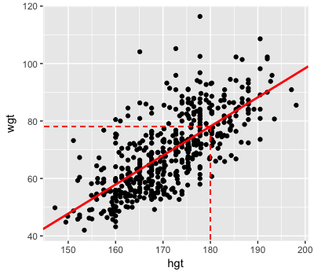

```{r setup, include=FALSE}
knitr::opts_chunk$set(echo = TRUE)
options(repos="https://CRAN.R-project.org")
```

## The prior model


**Simulating a Beta prior**

Suppose you're running in an election for public office. Let $p$ be your underlying support, the proportion of voters that plan to vote for you. Based on past polls, your prior model of $p$ is captured by a Beta distribution with shape parameters 45 and 55.

You will approximate the Beta(45, 55) prior using random samples from the `rbeta()` function. This function takes three arguments: sample size (`n`) and two *shape* parameters (`shape1`,`shape2`). Subsequently, you will construct a density plot of the samples using `ggplot()`. This function takes two arguments: the data set containing the samples and, within `aes()`, the variable to be plotted on the `x` axis. The density plot layer is added using `geom_density()`.

```{r}
library(ggplot2)

# Sample 10000 draws from Beta(45,55) prior
prior_A <- rbeta(n = 10000, shape1 = 45, shape2 = 55)

# Store the results in a data frame
prior_sim <- data.frame(prior_A)

# Construct a density plot of the prior sample
ggplot(prior_sim, aes(x = prior_A)) + 
    geom_density()
```

Great! Take a quick look - the distribution of your sample approximates the features of the Beta(45,55) prior.

**Comparing & contrasting Beta priors**

The Beta($a$,$b$) distribution is defined on the interval from 0 to 1, thus provides a natural and flexible prior for your underlying election support, $p$. You can *tune* the Beta shape parameters $a$ and $b$ to produce alternative prior models. Below you will compare your original Beta(45,55) prior with two alternatives: Beta(1, 1) and Beta(100, 100). The original 10,000 `prior_A` samples drawn from Beta(45,55) are in your workspace.

```{r}
library(tibble)

# Sample 10000 draws from the Beta(1,1) prior
prior_B <- rbeta(n = 10000, shape1 = 1, shape2 = 1)    

# Sample 10000 draws from the Beta(100,100) prior
prior_C <- rbeta(n = 10000, shape1 = 100, shape2 = 100)

# Combine the results in a single data frame
prior_sim <- data.frame(samples = c(prior_A, prior_B, prior_C),
        priors = rep(c("A","B","C"), each = 10000))
tibble(prior_sim)

# Plot the 3 priors
ggplot(prior_sim, aes(x = samples, fill = priors)) + 
    geom_density(alpha = 0.5)
```

Nice work! The three Beta priors here are just a few of the countless different priors we can obtain by tuning the shape parameters.

Prior B reflects 'vague' prior information about p - it gives equal prior weight to all values of p between 0 and 1. Prior C reflects more prior certainty about p - it has less spread and is centered around a mean that's greater than that for Prior A.

## Data & the likelihood


**Simulating the dependence of X on p**

In your quest for election to public office, your campaign polls 10 likely voters. Let $X$ be the number that support you. Of course, $X$ varies from sample to sample and depends upon $p$, your underlying support in the broader population. Since  $X$ is a count of successes in 10 independent trials, each having probability of success $p$, you can model its dependence on $p$ by the Binomial distribution: Bin(10, $p$).

You will simulate the Binomial model using random samples from the `rbinom(n, size, prob)` function. This *vectorized* function draws `n` samples from a Bin(`size`, `prob`) distribution. Given a *vector* of `prob` values, the first `prob` value will be used for the first draw, the second `prob` value will be used for the second draw, etc.

```{r}
library(ggridges)

# Define a vector of 1000 p values    
p_grid <- seq(from = 0, to = 1, length.out = 1000)

# Simulate 1 poll result for each p in p_grid   
poll_result <- rbinom(n = 1000, size = 10, prob = p_grid)    

# Create likelihood_sim data frame
likelihood_sim <- data.frame(p_grid, poll_result)    

# Density plots of p_grid grouped by poll_result
ggplot(likelihood_sim, aes(x = p_grid, y = poll_result, group = poll_result)) + 
    geom_density_ridges()
```

Great! Notice that polls in which 0 people supported you (`poll_result = 0`) correspond to smaller values of underlying support p (`p_grid`). The opposite is true for polls in which all 10 people supported you.

**Approximating the likelihood function**

The first election poll is in! $X$ = 6 of 10 polled voters plan to vote for you. You can use these data to build insight into your underlying support $p$. To this end, you will use the `likelihood_sim` data frame (in your workspace). This contains the values of $X$ (`poll_result`) simulated from each of 1,000 possible values of $p$ between 0 to 1 (`p_grid`).

```{r}
# Density plots of p_grid grouped by poll_result
ggplot(likelihood_sim, aes(x = p_grid, y = poll_result, group = poll_result, fill = poll_result == 6)) + 
    geom_density_ridges()
```

Great! Reexamine the highlighted density plot. This is a scaled approximation of the likelihood function! It indicates that the simulated surveys in which 6 of 10 voters supported you corresponded to underlying support p that ranged from approximately 0.25 to 1, with p around 0.6 being the most common.

## The posterior model


**Define, compile, and simulate**

In your election quest, let $p$ be the proportion of the underlying voting population that supports you. Built from previous polls & election data, your *prior* model of $p$ is a Beta($a$,$b$) with shape parameters $a=45$  and $b=55$. For added insight into $p$, you also polled $n$ potential voters. The dependence of $X$, the number of these voters that support you, on $p$ is modeled by the Bin($n$,$p$) distribution.

In the completed poll, $X=6$ of $n=10$ voters supported you. The next goal is to update your model of $p$ in light of these observed polling data! To this end, you will use the `rjags` package to approximate the *posterior* model of $p$. We break this exercise down into the 3 `rjags` steps: *define*, *compile*, *simulate*.

```{r}
library(rjags)

# DEFINE the model
vote_model <- "model{
    # Likelihood model for X
    X ~ dbin(p, n)
    
    # Prior model for p
    p ~ dbeta(a, b)
}"

# COMPILE the model    
vote_jags <- jags.model(textConnection(vote_model), 
    data = list(a = 45, b = 55, X = 6, n = 10),
    inits = list(.RNG.name = "base::Wichmann-Hill", .RNG.seed = 100))

# SIMULATE the posterior
vote_sim <- coda.samples(model = vote_jags, variable.names = c("p"), n.iter = 10000)

# PLOT the posterior
plot(vote_sim, trace = FALSE)
```

Nice work! You've successfully defined, compiled, and simulated your Bayesian model. Notice that after observing a poll in which 6 of 10 (60%) of voters supported you, your updated posterior optimism and certainty about your underlying support, p, are slightly higher than they were prior to the poll.

**Updating the posterior**

The posterior model of your underlying election support $p$ is informed by both the prior model of $p$ and polling data $X$. Run the script to the right to remind yourself of the posterior that evolved from your original prior (Beta(45, 55)) and original poll data ($X=6$ of $n=10$ polled voters support you). The defined `vote_model` is in your workspace.

In a 3-step exercise, you will explore how using a *different prior model* or observing *new data* (or a combination of the two!) might impact the posterior.

Re-compile, simulate, and plot the  posterior to reflect the setting in which you start with a Beta(1,1) prior but observe the same polling data ($X=6$, $n=10$). NOTE: Recall that Beta(1,1) is uniform across the (0,1) interval.

```{r}
# COMPILE the model    
vote_jags <- jags.model(textConnection(vote_model), 
    data = list(a = 1, b = 1, X = 6, n = 10),
    inits = list(.RNG.name = "base::Wichmann-Hill", .RNG.seed = 100))

# SIMULATE the posterior
vote_sim <- coda.samples(model = vote_jags, variable.names = c("p"), n.iter = 10000)

# PLOT the posterior
plot(vote_sim, trace = FALSE, xlim = c(0,1), ylim = c(0,18))
```

In a new poll, 214 of 390 voters support you. Combined with the first poll, a total $X=220$ of $n=400$ voters support you. Re-compile, simulate, and plot the $p$ posterior to reflect these combined poll results and a Beta(1,1) prior.

```{r}
# COMPILE the model    
vote_jags <- jags.model(textConnection(vote_model), 
    data = list(a = 1, b = 1, X = 220, n = 400),
    inits = list(.RNG.name = "base::Wichmann-Hill", .RNG.seed = 100))

# SIMULATE the posterior
vote_sim <- coda.samples(model = vote_jags, variable.names = c("p"), n.iter = 10000)

# PLOT the posterior
plot(vote_sim, trace = FALSE, xlim = c(0,1), ylim = c(0,18))
```

Finally, re-compile, simulate, and plot the $p$ posterior to reflect the **combined** poll results ($X=220$ of $n=400$) and your **original** Beta(45,55) prior.

```{r}
# COMPILE the model    
vote_jags <- jags.model(textConnection(vote_model), 
    data = list(a = 45, b = 55, X = 220, n = 400),
    inits = list(.RNG.name = "base::Wichmann-Hill", .RNG.seed = 100))

# SIMULATE the posterior
vote_sim <- coda.samples(model = vote_jags, variable.names = c("p"), n.iter = 10000)

# PLOT the posterior
plot(vote_sim, trace = FALSE, xlim = c(0,1), ylim = c(0,18))
```

Nice work! Re-visit the plots you constructed throughout this exercise to review the impact of the prior and data on the posterior.

- Even in light of the same data, different priors lead to different posteriors.

- The influence of the prior on the posterior diminishes as the sample size of your data increases.

- As sample size increases, your posterior understanding becomes more precise.

## The Normal-Normal model


**Normal-Normal priors**

Researchers developed a test to evaluate the impact of sleep deprivation on reaction time. For subject $i$, let $Y_i$ be the change in reaction time (in ms) after 3 sleep deprived nights. Of course, people react differently to sleep deprivation. It's reasonable to assume that $Y_i$ are Normally distributed around some *average* $m$ with *standard deviation* $s$: $Y_i \sim N(m, s^2)$.

In the first step of your Bayesian analysis, you'll simulate the following prior models for parameters $m$ and $s$: $m \sim N(50, 25^2)$ and $s \sim Unif(0,200)$. This requires the `rnorm(n, mean, sd)` and `runif(n, min, max)` functions.

```{r}
# Take 10000 samples from the m prior
prior_m <- rnorm(n = 10000, mean = 50, sd = 25)    

# Take 10000 samples from the s prior    
prior_s <- runif(n = 10000, min = 0, max = 200)    

# Store samples in a data frame
samples <- data.frame(prior_m, prior_s)

# Density plots of the prior_m & prior_s samples    
ggplot(samples, aes(x = prior_m)) + 
    geom_density()
ggplot(samples, aes(x = prior_s)) + 
    geom_density()
```

Right! The distributions of these random samples approximate the features of your Normal prior for `m` and Uniform prior for `s`.

**Sleep study data**

Researchers enrolled 18 subjects in a sleep deprivation study. Their observed `sleep_study` data are loaded in the workspace. These data contain the `day_0` reaction times and `day_3` reaction times after 3 sleep deprived nights for each `subject`.

You will define and explore `diff_3`, the observed *difference* in reaction times for each subject. This will require the `mutate()` & `summarize()` functions. For example, the following would add variable `day_0_s`, `day_0` reaction times in *seconds*, to `sleep_study`:

```r
sleep_study <- sleep_study %>% 
    mutate(day_0_s = day_0 * 0.001)
```

You can then `summarize()` the `day_0_s` values, here by their minimum & maximum:

```r
sleep_study  %>% 
    summarize(min(day_0_s), max(day_0_s))
```

```{r}
library(dplyr)

sleep_study <- read.csv("_data/sleep_study.csv")

# Check out the first 6 rows of sleep_study
head(sleep_study)

# Define diff_3
sleep_study <- sleep_study %>% 
    mutate(diff_3 = day_3 - day_0)    

# Histogram of diff_3    
ggplot(sleep_study, aes(x = diff_3)) + 
    geom_histogram(binwidth = 20, color = "white")

# Mean and standard deviation of diff_3    
sleep_study %>% 
    summarize(mean(diff_3), sd(diff_3))
```

Great work! Reaction times increased by an average of ~26 ms with a standard deviation of ~37 ms. Further, only 4 of the 18 test subjects had faster reaction times on day 3 than on day 0.


Though not in perfect agreement about the degree to which the average reaction time changes under sleep deprivation, both the likelihood and prior are consistent with the hypothesis that the average increases relative to reaction time under normal sleep conditions.

## Simulating the Normal-Normal in RJAGS


**Define, compile, & simulate the Normal-Normal**

Upon observing the change in reaction time $Y_i$ for each of the 18 subjects $i$ enrolled in the sleep study, you can update your *posterior* model of the effect of sleep deprivation on reaction time. This requires the combination of insight from the likelihood and prior models:

- **likelihood**: $Y_i \sim N(m,s^2)$ 
- **priors**: $m \sim N(50,25^2)$ and $s \sim Unif(0,200)$
In this series of exercises, you'll **define**, **compile**, and **simulate** your Bayesian posterior. The observed `sleep_study` data are in your work space.

```{r}
# DEFINE the model    
sleep_model <- "model{
    # Likelihood model for Y[i]
    for(i in 1:length(Y)) {
        Y[i] ~ dnorm(m, s^(-2))
    }

    # Prior models for m and s
    m ~ dnorm(50, 25^(-2))
    s ~ dunif(0, 200)
}"

# COMPILE the model
sleep_jags <- jags.model(
  textConnection(sleep_model),
  data = list(Y = sleep_study$diff_3),
  inits = list(.RNG.name = "base::Wichmann-Hill", .RNG.seed = 1989)
)

# SIMULATE the posterior    
sleep_sim <- coda.samples(model = sleep_jags, variable.names = c("m", "s"), n.iter = 10000)

# PLOT the posterior    
plot(sleep_sim, trace = FALSE)
```

Nice work! You've successfully defined, compiled, and simulated your Bayesian Normal-Normal model.


Your posterior model is more narrow and lies almost entirely above 0, thus you're more confident that the average reaction time increases under sleep deprivation. Further, the location of the posterior is below that of the prior. This reflects the strong insight from the observed sleep study data in which the increase in average reaction time was only ~26 ms.

## Markov chains


**Markov chain distribution: an approximation of the posterior!**


**Storing Markov chains**

Let $m$ be the average change in reaction time after 3 days of sleep deprivation. In a previous exercise, you obtained an approximate sample of 10,000 draws from the posterior model of $m$. You stored the resulting `mcmc.list` object as `sleep_sim` which is loaded in your workspace:

```r
sleep_sim <- coda.samples(model = sleep_jags, variable.names = c("m", "s"), n.iter = 10000)
```

In fact, the sample of $m$ values in `sleep_sim` is a dependent **Markov chain**, the distribution of which *converges* to the posterior. You will examine the contents of `sleep_sim` and, to have finer control over your analysis, store the contents in a data frame.

```{r}
# Check out the head of sleep_sim
head(sleep_sim)

# Store the chains in a data frame
sleep_chains <- data.frame(sleep_sim[[1]], iter = 1:10000)

# Check out the head of sleep_chains
head(sleep_chains)
```

Great! Next, you'll visualize the contents of these Markov chains.

**Markov chain trace plots**

A **trace plot** provides a visualization of a Markov chain's *longitudinal* behavior. Specifically, a trace plot for the $m$ chain plots the observed chain value (y-axis) against the corresponding iteration number (x-axis).

You will construct trace plots of the $m$ chain using two different approaches: by applying the built-in `plot()` function to the `mcmc.list` object `sleep_sim` and, for finer control over this graphic (and finer control over analyses in later chapters), by applying `ggplot()` to the `data.frame` object `sleep_chains`. Both `sleep_sim` and `sleep_chains` are in your workspace:

```r
sleep_sim <- coda.samples(model = sleep_jags, variable.names = c("m", "s"), n.iter = 10000)
sleep_chains <- data.frame(sleep_sim[[1]], iter = 1:10000)
```

```{r}
# Use plot() to construct trace plots of the m and s chains
plot(sleep_sim, density = FALSE)

# Use ggplot() to construct a trace plot of the m chain
ggplot(sleep_chains, aes(x = iter, y = m)) + 
    geom_line()

# Trace plot the first 100 iterations of the m chain
ggplot(sleep_chains[1:100, ], aes(x = iter, y = m)) + 
    geom_line()
```

Nice work! Note that the longitudinal behavior of the chain appears quite random and that the trend remains relatively constant. This is a good thing - it indicates that the Markov chain (likely) converges quickly to the posterior distribution of m.

**Markov chain density plots**

Whereas a trace plot captures a Markov chain's longitudinal behavior, a **density plot** illustrates the final distribution of the chain values. In turn, the density plot provides an *approximation* of the posterior model. You will construct and examine density plots of the $m$ Markov chain below. The `mcmc.list` object `sleep_sim` and `sleep_chains` data frame are in your workspace:

```
sleep_sim <- coda.samples(model = sleep_jags, variable.names = c("m", "s"), n.iter = 10000)
sleep_chains <- data.frame(sleep_sim[[1]], iter = 1:10000)
```

```{r}
# Use plot() to construct density plots of the m and s chains
plot(sleep_sim, trace = FALSE)

# Use ggplot() to construct a density plot of the m chain
ggplot(sleep_chains, aes(x = m)) + 
    geom_density()
```

Check it out! These density plots approximate the posterior models of m and s.

## Markov chain diagnostics & reproducibility


**Multiple chains**

**Trace plots** help us diagnose the quality of a Markov chain simulation. A "good" Markov chain will exhibit stability as the chain length increases and consistency across repeated simulations, or **multiple chains**. You will use `RJAGS` to run and construct trace plots for four parallel chains below. The defined `sleep_model` is in your workspace.

```{r}
# COMPILE the model
sleep_jags_multi <- jags.model(textConnection(sleep_model), data = list(Y = sleep_study$diff_3), n.chains = 4)   

# SIMULATE the posterior    
sleep_sim_multi <- coda.samples(model = sleep_jags_multi, variable.names = c("m", "s"), n.iter = 1000)

# Check out the head of sleep_sim_multi
head(sleep_sim_multi)

# Construct trace plots of the m and s chains
plot(sleep_sim_multi, density = FALSE)
```

Good work! The most important thing to notice here is the similarity and stability among the 4 parallel chains. This provides some reassurance about the quality and consistency of our Markov chain simulation.

**Naive standard errors**

The mean of the $m$ Markov chain provides an estimate of the posterior mean of $m$. The **naive standard error** provides a measure of the potential *error* in this estimate. In turn, we can use this measure to determine an appropriate chain length. For example, suppose your *goal* is to estimate the posterior mean of $m$ within a standard error of `0.1` ms. If your *observed* naive standard error exceeds this target, no problem! Simply run a longer chain - the error in using a Markov chain to approximate a posterior tends to decrease as chain length increases.

The defined `sleep_model` and compiled `sleep_jags` object are your workspace.

```{r}
# SIMULATE the posterior    
sleep_sim_1 <- coda.samples(model = sleep_jags, variable.names = c("m", "s"), n.iter = 1000)

# Summarize the m and s chains of sleep_sim_1
summary(sleep_sim_1)

# RE-SIMULATE the posterior    
sleep_sim_2 <- coda.samples(model = sleep_jags, variable.names = c("m", "s"), n.iter = 10000)

# Summarize the m and s chains of sleep_sim_2
summary(sleep_sim_2)
```

No problem! You've proved to yourself that if the standard errors associated with your Markov chain are too big, simply increase the number of iterations. In general, naive standard error will decrease as the chain length increases.

**Reproducibility**

Now that you've completed (and passed!) some Markov chain diagnostics, you're ready to finalize your `RJAGS` simulation. To this end, reproducibility is crucial. To obtain reproducible simulation output, you must set the seed of the `RJAGS` random number generator. This works differently than in base `R`. Instead of using `set.seed()`, you will specify a starting seed using 

```r
inits = list(.RNG.name = "base::Wichmann-Hill", .RNG.seed = ___) 
```

when you *compile* your model.

```{r}
# COMPILE the model
sleep_jags <- jags.model(textConnection(sleep_model), data = list(Y = sleep_study$diff_3), inits = list(.RNG.name = "base::Wichmann-Hill", .RNG.seed = 1989)) 

# SIMULATE the posterior    
sleep_sim <- coda.samples(model = sleep_jags, variable.names = c("m", "s"), n.iter = 10000)

# Summarize the m and s chains of sleep_sim
summary(sleep_sim)
```

Excellent work. Now that you can diagnose and reproduce your Markov chain simulations, you're ready for the next Bayesian model!

## A simple Bayesian regression model


**Regression priors**

Let $Y_i$ be the weight (in kg) of subject $i$. Past studies have shown that weight is linearly related to height $X_i$ (in cm). The average weight $m_i$ among adults of any shared height $X_i$ can be written as $m_i=a+bX_i$. But height isn't a perfect predictor of weight - individuals vary from the trend. To this end, it's reasonable to assume that $Y_i$ are Normally distributed around $m_i$ with *residual standard deviation* $s$: $Y_i \sim N(m_i, s^2)$.

Note the 3 parameters in the model of weight by height: intercept $a$, slope $b$, & standard deviation $s$. In the first step of your Bayesian analysis, you will simulate the following prior models for these parameters: $a \sim N(0, 200^2)$, $b \sim N(1, 0.5^2)$, and $s \sim Unif(0,20)$.

```{r}
# Take 10000 samples from the a, b, & s priors
a <- rnorm(n = 10000, mean = 0, sd = 200)    
b <- rnorm(n = 10000, mean = 1, sd = 0.5)    
s <- runif(n = 10000, min = 0, max = 20)

# Store samples in a data frame
samples <- data.frame(set = 1:10000, a, b, s)

# Construct density plots of the prior samples    
ggplot(samples, aes(x = a)) + 
    geom_density()
ggplot(samples, aes(x = b)) + 
    geom_density()
ggplot(samples, aes(x = s)) + 
    geom_density()
```

Great work! These simulations approximate your prior models of each separate model parameter. There's likely a positive association between weight & height (b > 0) but more uncertainty about the intercept a. Further, at any given height, the typical deviation of individuals' weights from the trend is equally likely to be anywhere between 0 and 20 kg.

**Visualizing the regression priors**

In the previous exercise, you simulated 10,000 `samples` for each parameter ($a$, $b$, $s$) in the Bayesian regression model of weight $Y$ by height $X$:$Y \sim N(m, s^2)$  with mean $m = a + bX$. The set of $a$, $b$, and $s$ values in each *row* of `samples` represents a prior plausible regression scenario. To explore the scope of these prior scenarios, you will simulate 50 pairs of height and weight values from **each of the first 12 sets of prior parameters** $a$, $b$, and $s$.

```{r}
# Replicate the first 12 parameter sets 50 times each
prior_scenarios_rep <- bind_rows(replicate(n = 50, expr = samples[1:12, ], simplify = FALSE)) 

# Simulate 50 height & weight data points for each parameter set
prior_simulation <- prior_scenarios_rep %>% 
    mutate(height = rnorm(n = 600, mean = 170, sd = 10)) %>% 
    mutate(weight = rnorm(n = 600, mean = a + b * height, sd = s))

# Plot the simulated data & regression model for each parameter set
ggplot(prior_simulation, aes(x = height, y = weight)) + 
    geom_point() + 
    geom_smooth(method = "lm", se = FALSE, size = 0.75) + 
    facet_wrap(~ set)
```

Exciting! These 12 plots demonstrate the range of prior plausible models. These models have different intercepts, slopes, and residual standard deviations. Almost all of the models have positive slopes, demonstrating the prior information that there is likely a positive association between weight & height. Given your vague prior for `a`, some of these models are even biologically impossible!

**Weight & height data**

The `bdims` data set from the `openintro` package is loaded in your workspace. `bdims` contains physical measurements on a sample of 507 individuals, including their weight in kg (`wgt`) and height in cm (`hgt`). You will use these data to build insights into the relationship between weight and height.

```{r}
library(openintro)
data(bdims, package = "openintro")

# Construct a scatterplot of wgt vs hgt
ggplot(bdims, aes(x = hgt, y = wgt)) + 
    geom_point()

# Add a model smooth
ggplot(bdims, aes(x = hgt, y = wgt)) + 
    geom_point() + 
    geom_smooth(method = "lm", se = FALSE)
```

Nice work. These data support your prior information about a positive association between weight and height. With insights from the priors and data in place, you're ready to simulate the posterior regression model in RJAGS!

## Bayesian regression in RJAGS


**Insight from the observed weight & height data**


**Define, compile, & simulate the regression model**

Upon observing the relationship between weight $Y_i$ and height $X_i$ for the 507 subjects $i$ in the `bdims` data set, you can update your *posterior* model of this relationship. To build your posterior, you must combine your insights from the likelihood and priors:

- likelihood: $Y_i \sim (m_i, s^2)$,  where $m_i = a +bX_i$
- priors: $a \sim N(0,200^2)$, $b \sim N(1, 0.5^2)$ and $s \sim Unif(0,20)$

In this series of exercises, you'll **define**, **compile**, and **simulate** your Bayesian regression posterior. The `bdims` data are in your work space.

```{r}
# DEFINE the model    
weight_model <- "model{
    # Define model for data Y[i]
    for(i in 1:length(Y)) {
      Y[i] ~ dnorm(m[i], s^(-2))
      m[i] <- a + b * X[i]
    }

    # Define the a, b, s priors
    a ~ dnorm(0, 200^(-2))
    b ~ dnorm(1, 0.5^(-2))
    s ~ dunif(0, 20)
}"

# COMPILE the model
weight_jags <- jags.model(
  textConnection(weight_model),
  data = list(Y = bdims$wgt, X = bdims$hgt),
  inits = list(.RNG.name = "base::Wichmann-Hill", .RNG.seed = 1989)
)

# SIMULATE the posterior    
weight_sim <- coda.samples(model = weight_jags, variable.names = c("a", "b", "s"), n.iter = 1000)

# PLOT the posterior    
plot(weight_sim)
```

Yuck! You've successfully defined, compiled, and simulated your Bayesian regression model. But the results don't look that great. Let's fix that.

```{r}
# SIMULATE the posterior    
weight_sim_big <- coda.samples(model = weight_jags, variable.names = c("a", "b", "s"), n.iter = 100000)

# PLOT the posterior    
plot(weight_sim_big)
```

Trace plots indicate that after only 1,000 iterations, the a and b parallel chains had not stabilized. However, after 100,000 iterations, the chains demonstrate greater stability. We might also increase the stability of our simulation by *standardizing* the height data, but this is beyond the scope of our current discussion.

## Posterior estimation & inference


**Posterior point estimates**

Recall the likelihood of the Bayesian regression model of weight $Y$ by height $X$:$Y \sim N(m,s^2)$ where $m = a + bX$. A 100,000 iteration RJAGS simulation of the posterior, `weight_sim_big`, is in your workspace along with a data frame of the Markov chain output:

```r
> head(weight_chains, 2)
          a        b        s iter
1 -113.9029 1.072505 8.772007    1
2 -115.0644 1.077914 8.986393    2
```

The posterior *means* of the intercept & slope parameters, $a$ & $b$, reflect the posterior mean *trend* in the relationship between weight & height. In contrast, the *full* posteriors of $a$ & $b$ reflect the *range* of plausible parameters, thus posterior uncertainty in the trend. You will examine the trend and uncertainty in this trend below. The `bdims` data are in your workspace.

```{r}
# Summarize the posterior Markov chains
summary(weight_sim_big)

# Calculate the estimated posterior mean of b
weight_chains <- data.frame(weight_sim_big[[1]], iter = 1:100000)
mean(weight_chains$b)

# Plot the posterior mean regression model
ggplot(bdims, aes(x = hgt, y = wgt)) + 
    geom_point() + 
    geom_abline(intercept = mean(weight_chains$a), slope = mean(weight_chains$b), color = "red")

# Visualize the range of 20 posterior regression models
ggplot(bdims, aes(x = hgt, y = wgt)) + 
    geom_point() +
    geom_abline(intercept = weight_chains$a[1:20], slope = weight_chains$b[1:20], color = "gray", size = 0.25)
```

Excellent work. You now have a sense of the posterior mean trend in the linear relationship between weight and height as well as the posterior uncertainty in this trend. Given the size of the data and selection of priors, the posterior uncertainty is noticeably small as evidenced by the tight distribution of the gray posterior plausible lines around the trend.

**Posterior credible intervals**

Let's focus on slope parameter $b$, the rate of change in weight over height. The **posterior mean** of $b$ reflects the *trend* in the posterior model of the slope. In contrast, a posterior **credible interval** provides a *range* of posterior plausible slope values, thus reflects posterior *uncertainty* about $b$. For example, the 95% credible interval for $b$ ranges from the 2.5th to the 97.5th quantile of the $b$ posterior. Thus there's a 95% (posterior) chance that $b$ is in this range.

You will use RJAGS simulation output to *approximate* credible intervals for $b$. The 100,000 iteration RJAGS simulation of the posterior, `weight_sim_big`, is in your workspace along with a data frame of the Markov chain output, `weight_chains`.

```{r}
# Summarize the posterior Markov chains
summary(weight_sim_big)

# Calculate the 95% posterior credible interval for b
ci_95 <- quantile(weight_chains$b, probs = c(0.025, 0.975))
ci_95

# Calculate the 90% posterior credible interval for b
ci_90 <- quantile(weight_chains$b, probs = c(0.05, 0.95))
ci_90

# Mark the 90% credible interval 
ggplot(weight_chains, aes(x = b)) + 
    geom_density() + 
    geom_vline(xintercept = ci_90, color = "red")
```

Right! Based on your calculations we can say that there's a 90% (posterior) probability that, on average, the increase in weight per 1 cm increase in height is between 0.93 and 1.08 kg.

**Posterior probabilities**

You've used RJAGS output to explore and quantify the posterior trend & uncertainty $b$. You can also use RJAGS output to assess specific hypotheses. For example: What's the posterior probability that, on average, weight increases by more than 1.1 kg for every 1 cm increase in height? That is, what's the posterior probability that $b > 1.1$?

You will approximate this probability by the proportion of $b$ Markov chain values that exceed 1.1. The `weight_chains` data frame with the 100,000 iteration Markov chain output is in your workspace.

```{r}
# Mark 1.1 on a posterior density plot for b
ggplot(weight_chains, aes(x = b)) + 
    geom_density() + 
    geom_vline(xintercept = 1.1, color = "red")

# Summarize the number of b chain values that exceed 1.1
table(weight_chains$b > 1.1)

# Calculate the proportion of b chain values that exceed 1.1 
mean(weight_chains$b > 1.1)
```

Great. Based on your calculations we can say that there's only a ~2% (posterior) chance that, on average, the increase in weight per 1 cm increase in height exceeds 1.1 kg.

## Posterior prediction


**Inference for the posterior trend**

Recall the likelihood of the Bayesian regression model of weight $Y$ by height $X$:$Y \sim N(m,s^2)$ where $m = a+bX$. In earlier exercises you approximated the form of the posterior trend $m$(solid line). From this, notice that the typical weight among 180 cm adults is roughly 80 kg (dashed lines):



You will use RJAGS simulation output to approximate the posterior *trend* in weight among 180 cm tall adults as well as the posterior *uncertainty* in this trend. The 100,000 iteration RJAGS simulation of the posterior, `weight_sim_big`, is in your workspace along with a data frame of the Markov chain output, `weight_chains`.

```{r}
# Calculate the trend under each Markov chain parameter set
weight_chains <- weight_chains  %>% 
    mutate(m_180 = a + b * 180)
    
# Construct a posterior density plot of the trend
ggplot(weight_chains, aes(x = m_180)) + 
    geom_density()

# Construct a posterior credible interval for the trend
quantile(weight_chains$m_180, probs = c(0.025, 0.975))
```

Yes! The posterior trend of your regression model indicates that the typical weight among 180 cm tall adults is roughly 78 kg. However, posterior uncertainty in the regression model trickles down to uncertainty about this trend. This uncertainty is communicated through your credible interval: there's a 95% (posterior) chance that the typical weight at a height of 180 cm is between 76.95 and 79.24 kg.

**Calculating posterior predictions**

You just explored the posterior *trend* in weight $Y$ among adults with height $X=180$:$m_{180} = a+b*180$. The `weight_chains` data frame contains 100,000 posterior plausible values of $m_{180}$ that you calculated from the corresponding values of $a$ and $b$:

```
> head(weight_chains, 2)
          a        b        s iter     m_180
1 -113.9029 1.072505 8.772007    1  79.14803
2 -115.0644 1.077914 8.986393    2  78.96014
```

Forget the trend - what if you wanted to *predict* the weight of a *specific* 180 cm tall adult? You can! To do so, you must account for individual variability from the trend, modeled by

$Y_{180} \sim N(m_{180}, s^2)$

Using this model, you will simulate predictions of weight under each set of posterior plausible parameters in `weight_chains`.

```{r}
# Simulate 1 prediction under the first parameter set
rnorm(n = 1, mean = weight_chains$m_180[1], sd = weight_chains$s[1])

# Simulate 1 prediction under the second parameter set
rnorm(n = 1, mean = weight_chains$m_180[2], sd = weight_chains$s[2])

# Simulate & store 1 prediction under each parameter set
weight_chains <- weight_chains  %>% 
    mutate(Y_180 = rnorm(n = 100000, mean = m_180, sd = s))

# Print the first 6 parameter sets & predictions
head(weight_chains)
```

You now have 100,000 predictions for the weight of a 180 cm tall adult that reflect the range of posterior plausible parameter settings.

**Posterior predictive distribution**

The `weight_chains` data frame (in your workspace) contains your 100,000 posterior predictions, `Y_180`, for the weight of a 180 cm tall adult:

```
> head(weight_chains, 2)
          a        b        s iter    m_180    Y_180
1 -113.9029 1.072505 8.772007    1 79.14803 71.65811
2 -115.0644 1.077914 8.986393    2 78.96014 75.78893
```

You will use these 100,000 predictions to approximate the **posterior predictive** distribution for the weight of a 180 cm tall adult. The `bdims` data are in your workspace.

```{r}
# Construct a posterior credible interval for the prediction
ci_180 <- quantile(weight_chains$Y_180, probs = c(0.025, 0.975))
ci_180

# Construct a density plot of the posterior predictions
ggplot(weight_chains, aes(x = Y_180)) + 
    geom_density() + 
    geom_vline(xintercept = ci_180, color = "red")

# Visualize the credible interval on a scatterplot of the data
ggplot(bdims, aes(x = hgt, y = wgt)) + 
    geom_point() + 
    geom_abline(intercept = mean(weight_chains$a), slope = mean(weight_chains$b), color = "red") + 
    geom_segment(x = 180, xend = 180, y = ci_180[1], yend = ci_180[2], color = "red")
```

Congratulations! You've simulated your first posterior predictive distribution. Your 100,000 posterior plausible weights for a given 180 cm tall adult ranged from roughly 36 to 117 kg. Eliminating the most extreme 5% of these predictions, you observed that there's a 95% (posterior) chance that the weight is between 72 and 84 kg.

## Bayesian regression with a categorical predictor


**RailTrail sample data**

The `RailTrail` data frame from the `mosaic` package is loaded in your workspace. `RailTrail` contains data collected by the Pioneer Valley Planning Commission on the usage of a local rail-trail. For each of 90 days, they recorded the rail-trail `volume` (number of users) and whether it was a `weekday` (`TRUE` if yes and `FALSE` otherwise). You will explore the trends in weekday vs weekend volume below.

```{r}
library(mosaicData)
data(RailTrail)

# Confirm that weekday is a factor variable
class(RailTrail$weekday)

# Construct a density plot of volume by weekday
ggplot(RailTrail, aes(x = volume, fill = weekday)) + 
    geom_density(alpha = 0.5)
```

Right! Notice that, as might be intuitive, rail-trail volume tends to be slightly higher on weekends (~430 users per day) than on weekdays (~350 users per day).

**RJAGS simulation with categorical variables**

Consider the Normal regression model of volume $Y_i$ by weekday status $X_i$:

- **likelihood**: $Y_i \sim N(m_i, s^2)$ where $m_i=a+bX_i$
- priors: $a \sim N(400, 100^2)$, $b \sim N(0, 200^2)$, $s \sim Unif(0, 200)$

You explored the relationship between $Y_i$ and $X_i$ for the 90 days recorded in `RailTrail` (in your workspace). In light of these data and the priors above, you will update your *posterior* model of this relationship. This differs from previous analyses in that $X_i$ is categorical. In `rjags` syntax, its coefficient $b$ is defined by two elements, `b[1]` and `b[2]`, which correspond to the weekend and weekday levels, respectively. For reference, `b[1]` is set to 0. In contrast, `b[2]` is modeled by the prior for $b$

```{r}
RailTrail$weekday <- as.factor(RailTrail$weekday)

# DEFINE the model    
rail_model_1 <- "model{
    # Likelihood model for Y[i]
    for(i in 1:length(Y)){
      Y[i] ~ dnorm(m[i], s^(-2))
      m[i] <- a + b[X[i]]
    }
    
    # Prior models for a, b, s
    a ~ dnorm(400, 100^(-2))
    b[1] <- 0
    b[2] ~ dnorm(0, 200^(-2))
    s ~ dunif(0, 200)
}"

# COMPILE the model
rail_jags_1 <- jags.model(
  textConnection(rail_model_1),
  data = list(Y = RailTrail$volume, X = RailTrail$weekday),
  inits = list(.RNG.name = "base::Wichmann-Hill", .RNG.seed = 10)
)

# SIMULATE the posterior    
rail_sim_1 <- coda.samples(model = rail_jags_1, variable.names = c("a", "b", "s"), n.iter = 10000)

# Store the chains in a data frame
rail_chains_1 <- data.frame(rail_sim_1[[1]])

# PLOT the posterior
plot(rail_sim_1)
```

Nice work! You've successfully defined, compiled, and simulated a Bayesian regression model with a categorical predictor.

```{r}
summary(rail_sim_1)
```

Typically, there are 428.47 trail users on a weekend day and 77.78 fewer users (~350.69) on a weekday.

Parameter `a` describes the typical *weekend* volume whereas `b` describes the *contrast* between weekday and weekend volume.

**Inference for volume by weekday**

The 10,000 iteration RJAGS simulation output, `rail_sim_1`, is in your workspace along with a data frame of the Markov chain output:

```
> head(rail_chains_1, 2)
         a b.1.       b.2.        s 
1 420.6966    0  -54.30783 118.2328
2 399.5823    0  -52.02570 119.9499
```

These chains provide 10,000 unique sets of values for `a`, the typical trail volume on *weekend* days, and `b.2.`, the **contrast** between typical weekday volume vs weekend volume. For example, the first set of parameters indicate that there are typically `420.6966` riders on weekend days and `54.30783` *fewer* riders on weekdays. Thus there are typically `420.6966 - 54.30783 = 366.3888` riders on weekdays. You will utilize these simulation data to make inferences about weekday trail volume.

```{r}
# Construct a chain of values for the typical weekday volume
rail_chains_1 <- rail_chains_1 %>% 
    mutate(weekday_mean = a + b.2.)

# Construct a density plot of the weekday chain
ggplot(rail_chains_1, aes(x = weekday_mean)) + 
    geom_density()

# 95% credible interval for typical weekday volume
quantile(rail_chains_1$weekday_mean, c(0.025, 0.975))
```

Excellent! You've shown that there's a 95% posterior chance that the typical weekday volume is between 319 and 382 trail users.

## Multivariate Bayesian regression


**Re-examining the RailTrail data**

In your previous work, you observed that rail-trail `volume` tends to be lower on a `weekday` than a weekend. Some of the variability in `volume` might also be explained by outside temperature. For example, we might expect trail volume to increase on warm, pleasant days.

The `RailTrail` data set in your workspace includes `hightemp`, the observed high temperature (F) for each of the 90 days in the study period. You will use these data to explore the associations between trail `volume`, `weekday` status, and `hightemp`

```{r}
# Construct a plot of volume by hightemp & weekday
ggplot(RailTrail, aes(y = volume, x = hightemp, color = weekday)) + 
    geom_point() + 
	geom_smooth(method = "lm", se = FALSE)
```

Nice work. Notice that for the 90 days in the study period, volume tends to increase with temperature. Further, volume tends to be higher on weekends than on weekdays of the same temperature.

**RJAGS simulation for multivariate regression**

Consider the following Bayesian model of volume $Y_i$ by weekday status $X_i$ and temperature $Z_i$:

- **likelihood**: $Y_i \sim N(m_i, s^2)$, where $m_i = a+bX_i+cZ_i$.
- **priors**: $a \sim N(0,200^2)$, $b \sim N(0,200^2)$, $c \sim N(0, 20^2)$, $s \sim Unif(0, 200)$

Your previous exploration of the relationship between `volume`, `weekday`, and `hightemp` in the `RailTrail` data provided some insight into this relationship. You will combine this with insight from the priors to develop a *posterior* model of this relationship using RJAGS. The `RailTrail` data are in your work space.

```{r}
# DEFINE the model    
rail_model_2 <- "model{
    # Likelihood model for Y[i]
    for(i in 1:length(Y)) {
      Y[i] ~ dnorm(m[i], s^(-2))
	    m[i] <- a + b[X[i]] + c * Z[i]
    }

    # Prior models for a, b, c, s
    a ~ dnorm(0, 200^(-2))
    b[1] <- 0
    b[2] ~ dnorm(0, 200^(-2))
    c ~ dnorm(0, 20^(-2))
    s ~ dunif(0, 200)
}"

# COMPILE the model
rail_jags_2 <- jags.model(textConnection(rail_model_2), 
    data = list(Y = RailTrail$volume, X = RailTrail$weekday, Z = RailTrail$hightemp), 
    inits = list(.RNG.name = "base::Wichmann-Hill", .RNG.seed = 10))

# SIMULATE the posterior    
rail_sim_2 <- coda.samples(model = rail_jags_2, variable.names = c("a","b","c","s"), n.iter = 10000)

# Store the chains in a data frame
rail_chains_2 <- data.frame(rail_sim_2[[1]])

# PLOT the posterior
plot(rail_sim_2)
```

Wow! You've successfully defined, compiled, and simulated your multivariate Bayesian regression model.

```{r}
summary(rail_sim_2)
```

Typical volume is ~50 less on weekdays than on weekends of the same temperature.

The `b` coefficient represents the relationship between `volume` and `weekday` status *when controlling for*, or *on days with similar* `hightemp`.

**Posterior inference for multivariate regression**

The 10,000 iteration RJAGS simulation output, `rail_sim_2`, is in your workspace along with a data frame of the Markov chain output:

```
> head(rail_chains_2, 2)
         a b.1.      b.2.        c         s
1 49.76954    0 -12.62112 4.999202 111.02247
2 30.22211    0  -3.16221 4.853491  98.11892 
```

You will use these 10,000 unique sets of parameter values to summarize the posterior mean trend in the relationships between trail `volume`, `weekday` status, and `hightemp`.

```{r}
# Plot the posterior mean regression models
ggplot(RailTrail, aes(y = volume, x = hightemp, color = weekday)) + 
    geom_point() + 
    geom_abline(intercept = mean(rail_chains_2$a), slope = mean(rail_chains_2$c), color = "red") + 
    geom_abline(intercept = mean(rail_chains_2$a) + mean(rail_chains_2$b.2.), slope = mean(rail_chains_2$c), color = "turquoise3")
```

Your posterior analysis suggests that there's a positive association between volume and temperature. Further, the typical weekday volume is less than that on weekends of the same temperature.

## Bayesian Poisson regression


**RJAGS simulation for Poisson regression**

In the previous video we engineered a Poisson regression model of volume $Y_i$ by weekday status $X_i$ and temperature $Z_i$:

- **likelihood**: $Y_i \sim Pois(l_i)$ where $log(l_i) = a + bX_i + cZ_i$
- **priors**: $a \sim N(0,200^2)$, $b \sim N(0, 2^2)$, and $c \sim N(0,2^2)$

Combining your insights from the observed `RailTrail` data and the priors stated here, you will define, compile, and simulate a *posterior* model of this relationship using RJAGS. To challenge yourself in this last RJAGS simulation of the course, you'll be provided with less helpful code than usual!

The `RailTrail` data are in your work space.

```{r}
# DEFINE the model    
poisson_model <- "model{
    # Likelihood model for Y[i]
    for(i in 1:length(Y)) {
        Y[i] ~ dpois(l[i])
        log(l[i]) <- a + b[X[i]] + c * Z[i]
    }

    # Prior models for a, b, c
    a ~ dnorm(0, 200^(-2))
    b[1] <- 0
    b[2] ~ dnorm(0, 2^(-2))
    c ~ dnorm(0, 2^(-2))
}"

# COMPILE the model
poisson_jags <- jags.model(textConnection(poisson_model), 
    data = list(Y = RailTrail$volume, X = RailTrail$weekday, Z = RailTrail$hightemp), 
    inits = list(.RNG.name = "base::Wichmann-Hill", .RNG.seed = 10))

# SIMULATE the posterior    
poisson_sim <- coda.samples(model = poisson_jags, variable.names = c("a","b","c"), n.iter = 10000)

# Store the chains in a data frame
poisson_chains <- data.frame(poisson_sim[[1]])

# PLOT the posterior
plot(poisson_sim)
```

You've successfully defined, compiled, and simulated a Bayesian Poisson regression model!

**Plotting the Poisson regression model**

Recall the likelihood structure for your Bayesian Poisson regression model of volume $Y_i$ by weekday status $X_i$ and temperature $Z_i$:$Y_i \sim Pois(l_i)$ where

- $log(l_i) = a + bX_i + cZ_i$; thus
- $l_i = exp(a+bX_i+cZ_i)$

Your 10,000 iteration RJAGS simulation of the model posterior, `poisson_sim`, is in your workspace along with a data frame of the Markov chain output:

```
> head(poisson_chains, 2)
         a b.1.       b.2.          c
1 5.019807    0 -0.1222143 0.01405269
2 5.018642    0 -0.1217608 0.01407691
```

You will use these results to plot the posterior Poisson regression trends. These nonlinear trends can be added to a `ggplot()` using `stat_function()`. For example, specifying `fun = function(x){x^2}` would return a quadratic trend line.

```{r}
# Plot the posterior mean regression models
ggplot(RailTrail, aes(x = hightemp, y = volume, color = weekday)) + 
    geom_point() + 
    stat_function(fun = function(x){exp(mean(poisson_chains$a) + mean(poisson_chains$c) * x)}, color = "red") + 
    stat_function(fun = function(x){exp(mean(poisson_chains$a) + mean(poisson_chains$b.2.) + mean(poisson_chains$c) * x)}, color = "turquoise3")
```

Excellent work. Notice that unlike the Normal regression trend, the Poisson regression trend is *curved*.

**Inference for the Poisson rate parameter**

Again, recall the likelihood structure for your Bayesian Poisson regression model of volume $Y_i$ by weekday status $X_i$ and temperature $Z_i$:

$Y_1 \sim Pois(l_i)$ where $l_i = exp(a+bX_i+cZ_i)$

Your 10,000 iteration RJAGS simulation of the model posterior, `poisson_sim`, is in your workspace along with a data frame of the Markov chain output:

```
> head(poisson_chains, 2)
         a b.1.       b.2.          c
1 5.019807    0 -0.1222143 0.01405269
2 5.018642    0 -0.1217608 0.01407691
```

Using these 10,000 unique sets of posterior plausible values for parameters $a$, $b$, and $c$ you will make inferences about the typical trail volume on **80 degree days**.

```{r}
# Calculate the typical volume on 80 degree weekends & 80 degree weekdays
poisson_chains <- poisson_chains %>% 
    mutate(l_weekend = exp(a + c * 80)) %>% 
    mutate(l_weekday = exp(a + b.2. + c * 80))

# Construct a 95% CI for typical volume on 80 degree weekend
quantile(poisson_chains$l_weekend, c(0.025, 0.975))

# Construct a 95% CI for typical volume on 80 degree weekday
quantile(poisson_chains$l_weekday, c(0.025, 0.975))
```

This was your first analysis that incorporated transformations. It wasn't so bad (so long as you remember to back-transform)!

**Poisson posterior prediction**

Your `l_weekday` variable reflects the `trend` in volume on 80 degree weekdays:

```
> head(poisson_chains, 2)
       a b.1.    b.2.      c l_weekend l_weekday
1 5.0198    0 -0.1222 0.0141   465.924   412.324
2 5.0186    0 -0.1218 0.0141   466.284   412.829
```

Now that you understand the *trend*, let's make some predictions! Specifically, let's *predict* trail volumes on the next 80 degree weekday. To do so, you must take into account individual variability from the trend, modeled by the likelihood $Y_i \sim Pois(l_i)$.

Using `rpois(n, lambda)` for sample size `n` and rate parameter `lambda`, you will simulate Poisson predictions of volume under each value of the posterior plausible trend in `poisson_chains`.

```{r}
# Simulate weekday predictions under each parameter set
poisson_chains <- poisson_chains %>% 
    mutate(Y_weekday = rpois(n = 10000, lambda = l_weekday))
    
# Construct a density plot of the posterior weekday predictions
ggplot(poisson_chains, aes(x = Y_weekday)) + 
    geom_density()
    
# Posterior probability that weekday volume is less 400
mean(poisson_chains$Y_weekday < 400)
```

Recall that one of our motivations in applying the Poisson model was to accommodate the *count* nature of the volume data. This trickled down to your volume predictions `Y_weekday` - notice that these predictions, like the raw volume data, are discrete counts.

## Conclusion


