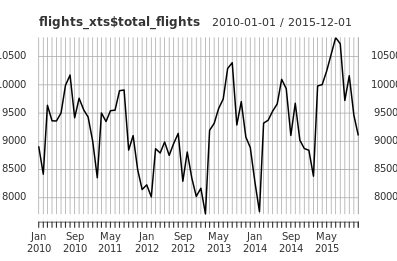
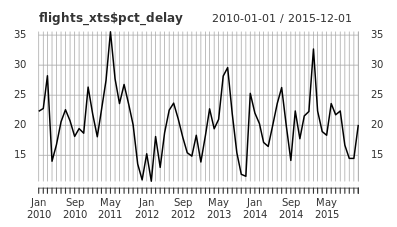

```{r setup, include=FALSE}
knitr::opts_chunk$set(echo = TRUE)
```

**Review xts fundamentals**

**Flight data**

- flight delay cancellations, 2010 through 2015

**Flight data**

Now that you're back in the time series mindset, it's time to get to work! Your task is to understand the travel patterns of tourists visiting Boston. As a first step, you've been assigned to explore patterns in flights arriving at Boston's Logan International Airport (BOS). In this exercise, you'll view the structure and qualities of some data in preparation for time series manipulation.

Lucky for you, the [U.S. Bureau of Transportation Statistics](http://www.transtats.bts.gov/ot_delay/ot_delaycause1.asp) provides open source data on flight arrival times. The `flights` data file has been preloaded in your workspace.

*This course touches on a lot of concepts you may have forgotten, so if you ever need a quick refresher, download the* [xts in R Cheat Sheet](https://datacamp-community-prod.s3.amazonaws.com/e04c5a6b-4aca-46f5-8cd5-803d975ccc4b) *and keep it handy!*

```
#View the structure of the flights data
str(flights)
```
```
'data.frame':	72 obs. of  5 variables:
 $ total_flights : num  8912 8418 9637 9363 9360 ...
 $ delay_flights : num  1989 1918 2720 1312 1569 ...
 $ cancel_flights: num  279 785 242 58 102 157 222 138 144 131 ...
 $ divert_flights: num  9 23 32 7 8 5 10 20 6 9 ...
 $ date          : chr  "2010-01-01" "2010-02-01" "2010-03-01" "2010-04-01" ...
```
```
#Examine the first few lines of the flights data
head(flights, n = 5)
```
```
  total_flights delay_flights cancel_flights divert_flights       date
1          8912          1989            279              9 2010-01-01
2          8418          1918            785             23 2010-02-01
3          9637          2720            242             32 2010-03-01
4          9363          1312             58              7 2010-04-01
5          9360          1569            102              8 2010-05-01
```
```
#Identify class of the column containing date information
class(flights$date)
```
```
[1] "character"
```

It's always helpful to use these commands to get a feel for your data before you begin analysis. As you can see, the `flights` object contains four columns of flight data and one column of dates. The `date` column is currently a character string. You'll need to convert this into a time-based object before moving forward with time series analysis.

**Encoding your flight data**

You're ready to encode your data to an `xts` object! Remember that `flights` is a data frame containing four columns of flight data and one column of dates.

To convert to an `xts` object, you'll need to ensure that your date column is in a time-based format. As you discovered earlier, the `date` column is currently a `character`. Once `date` is saved in a time-based format, you're ready to convert to xts! To do so, you'll use [as.xts()](https://www.rdocumentation.org/packages/xts/versions/0.9-7/topics/as.xts.methods), which takes two primary arguments.

First, you'll need to specify the object being converted (in this case, `flights`). To avoid redundancies, you should generally remove the time-based column from the data when you convert to `xts`. In this case, you'll remove the fifth column (`dates`), by specifying `[, -5]` in your `as.xts()` call.

Second, you'll need to tell xts how to index your object by specifying the `order.by` argument. In this case, you want to index your object on the `date` column.

The `flights` data frame is preloaded for you.

```
# Load the xts package
library(xts)

# Convert date column to a time-based class
flights$date <- as.Date(flights$date)

# Convert flights to an xts object using as.xts
flights_xts <- as.xts(flights[ , -5], order.by = flights$date)

# Check the class of flights
class(flights_xts)
```
```
[1] "xts" "zoo"
```
```
# View the first five lines of flights
head(flights_xts, n = 5)
```
```
          total_flights delay_flights cancel_flights divert_flights
2010-01-01          8912          1989            279              9
2010-02-01          8418          1918            785             23
2010-03-01          9637          2720            242             32
2010-04-01          9363          1312             58              7
2010-05-01          9360          1569            102              8
```

Your new xts object contains four columns of information about flights indexed on a series of months and years.

**Manipulating and visualizing your data**

**Qualities of xts objects**

- Periodicity: units of time in your data

**Exploring your flight data**
Before any analysis can be done, it is critical to explore the basic qualities of your data, including **periodicity**, **scope**, and **comprehensiveness**.

In this exercise, you'll gain a better understanding of your data by exploring these qualities. As you may recall from the earlier exercises, your time index seemed to be in months. To check that this is constant throughout your xts object, you can use the [periodicity()](https://www.rdocumentation.org/packages/xts/versions/0.9-7/topics/periodicity) command to tell you the periodicity and scope of the data.

Once you are sure of periodicity, you may also want to know how many periods are covered. To identify the number of periods in your data, you can use the [ndays()](https://www.rdocumentation.org/packages/xts/versions/0.9-7/topics/ndays) command, or one of its wrappers, `nmonths()`, `nyears()`, etc.

Finally, you may find it useful to query for a particular date by subsetting For example, inputting `xts_object["date"]` will generate the row pertaining to that date.

```
# Identify the periodicity of flights_xts
periodicity(flights_xts)
```
```
Monthly periodicity from 2010-01-01 to 2015-12-01
```
```
# Identify the number of periods in flights_xts
nmonths(flights_xts)
```
```
[1] 72
```
```
# Find data on flights arriving in BOS in June 2014
flights_xts['2014-06']
```
```
          total_flights delay_flights cancel_flights divert_flights
2014-06-01          9662          2279            141              6
```

It looks like you have monthly data on flights arriving in Boston over the course of 72 months from January 2010 through December 2015.

**Visualize flight data**

Now that you have a grip on your data, the next step is to visualize trends in your data over time. In this exercise, you'll plot the `flights_xts` data over time using a few different methods for plotting time series data.

Often the simplest way to plot xts objects is to use [plot.xts()](https://www.rdocumentation.org/packages/xts/versions/0.9-7/topics/plot.xts), which requires only a single argument for the y-axis in the plot. The x-axis is supplied by the time index in your xts object.

For more complicated plots, you may want to use [plot.zoo()](https://www.rdocumentation.org/packages/zoo/versions/1.7-13/topics/plot.zoo), which allows you to include multiple columns of data. In particular, the `plot.type` argument allows you to specify whether you'd like your data to appear in a single panel ("`single`") or multiple panels ("`multiple`"). This can be useful when comparing multiple columns of data over time.

```
lty = [1, 2, 3, 4]
labels = ["Total", "Delay", "Cancel", "Divert"]

# Use plot.xts() to view total monthly flights into BOS over time
plot.xts(flights_xts$total_flights)
```

```
# Use plot.xts() to view monthly delayed flights into BOS over time
plot.xts(flights_xts$delay_flights)
```

```
# Use plot.zoo() to view all four columns of data in their own panels
plot.zoo(flights_xts, plot.type = "multiple", ylab = labels)
```

```
# Use plot.zoo() to view all four columns of data in one panel
plot.zoo(flights_xts, plot.type = "single", lty = lty)
legend("right", lty = lty, legend = labels)
```


These plots provide some very important information about flights arriving in Boston. It looks like only a small percentage of flights are delayed, cancelled, or diverted. In the next exercise, you'll calculate these percentages.

**Calculate time series trends**
One of the most useful qualities of xts objects is the ability to conduct simple mathematical equations across time. In your flight data, one valuable metric to calculate would be the percentage of flights delayed, cancelled, or diverted each month.

In this exercise, you'll use your data to generate a new time series column containing the percentage of flights arriving late to Boston each month. You'll then generate a plot for this metric, before going on to calculate additional metrics for flight cancellations and diversions.

```
# Calculate percentage of flights delayed each month: pct_delay
flights_xts$pct_delay <- (flights_xts$delay_flights / flights_xts$total_flights) * 100

# Use plot.xts() to view pct_delay over time
plot.xts(flights_xts$pct_delay)
```

```
# Calculate percentage of flights cancelled each month: pct_cancel
flights_xts$pct_cancel <- (flights_xts$cancel_flights / flights_xts$total_flights) * 100

# Calculate percentage of flights diverted each month: pct_divert
flights_xts$pct_divert <- (flights_xts$divert_flights / flights_xts$total_flights) * 100

# Use plot.zoo() to view all three trends over time
plot.zoo(flights_xts[, c("pct_delay", "pct_cancel", "pct_divert")])
```


This plot shows the percentage of flights each month that are delayed, cancelled, or diverted. Do you notice any trends? Pay close attention to different y-axis scales across the different panels.

**Saving and exporting xts objects**

**Saving time - I**

You've now successfully converted your `flights` data into an xts object, plotted information over time, and calculated a few valuable metrics to help you proceed with analysis. You've even been able to conduct some quick descriptive analysis on your data by plotting these metrics over time.

The final step in any time series data manipulation is to save your xts object so you can easily return to it in the future.

As a first step, you'll want to save your xts object as a `rds` file for your own use. To do this, you'll use the command [saveRDS()](https://www.rdocumentation.org/packages/base/versions/3.3.1/topics/readRDS), which saves your object to a file with the name you specify (using the `file` argument). By default, `saveRDS()` will save to the current working directory.

When you're ready to return your saved data, you can use the `readRDS()` command to reopen the file. As you'll see in this exercise, this method maintains the class of your xts object.

```
# Save your xts object to rds file using saveRDS
saveRDS(object = flights_xts, file = "flights_xts.rds")

# Read your flights_xts data from the rds file
flights_xts2 <- readRDS("flights_xts.rds")

# Check the class of your new flights_xts2 object
class(flights_xts2)
```
```
[1] "xts" "zoo"
```
```
# Examine the first five rows of your new flights_xts2 object
head(flights_xts2, n = 5)
```
```
           total_flights delay_flights cancel_flights divert_flights pct_delay
2010-01-01          8912          1989            279              9  22.31822
2010-02-01          8418          1918            785             23  22.78451
2010-03-01          9637          2720            242             32  28.22455
2010-04-01          9363          1312             58              7  14.01260
2010-05-01          9360          1569            102              8  16.76282
           pct_cancel pct_divert
2010-01-01  3.1306104 0.10098743
2010-02-01  9.3252554 0.27322404
2010-03-01  2.5111549 0.33205354
2010-04-01  0.6194596 0.07476236
2010-05-01  1.0897436 0.08547009
```

As you can see, saving to rds files allows you to maintain the class of your data object. However, rds files are difficult to read into programs other than R. In the next exercise, you'll export your xts object to a standard format for sharing with others who don't use R.

**Saving time - II**

You've saved your `flights_xts` data to a rds file for future use. But what if you'd like to share your data with colleagues who don't use R?

A second option for saving xts objects is to convert them to shareable formats beyond the R environment, including comma-separated values (CSV) files. To do this, you'll use the [write.zoo()](https://www.rdocumentation.org/packages/zoo/versions/1.7-13/topics/read.zoo) command.

Once you've succesfully exported your xts object to a csv file, you can load the data back into R using the `read.zoo()` command. Unlike `readRDS`, however, you will need to re-encode your data to an xts object (using `as.xts`).

```
# Export your xts object to a csv file using write.zoo
write.zoo(flights_xts, file = "flights_xts.csv", sep = ",")

# Open your saved object using read.zoo
flights2 <- read.zoo("flights_xts.csv", sep = ",", FUN = as.Date, header = TRUE, index.column = 1)

# Encode your new object back into xts
flights_xts2 <- as.xts(flights2)

# Examine the first five rows of your new flights_xts2 object
head(flights_xts2, n = 5)
```
```
           total_flights delay_flights cancel_flights divert_flights pct_delay
2010-01-01          8912          1989            279              9  22.31822
2010-02-01          8418          1918            785             23  22.78451
2010-03-01          9637          2720            242             32  28.22455
2010-04-01          9363          1312             58              7  14.01260
2010-05-01          9360          1569            102              8  16.76282
           pct_cancel pct_divert
2010-01-01  3.1306104 0.10098743
2010-02-01  9.3252554 0.27322404
2010-03-01  2.5111549 0.33205354
2010-04-01  0.6194596 0.07476236
2010-05-01  1.0897436 0.08547009
```

You've succesfully completed a full cycle of time series data manipulation, including importing your data, converting it to xts, manipulating it, visualizing it, and saving it for future use. In the next chapter, you'll explore some additional time series data on Boston area weather to gain a deeper understanding of factors affecting flight delays and cancellations.

**Merging time series data by row**

**Weather data**

- practice with Boston area weather data

**Exploring temperature data**

Now that you've learned a bit about your `flights` data - and reviewed the basics of time series data manipulation - your next assignment is to explore weather patterns in the Boston area to understand what might be affecting flight delays and cancellations. To do this, you'll need to compile and manipulate some additional time series data.

In this exercise, you'll explore some temperature data in the Boston area, including measures of min, mean, and max daily temperature over time. These data were collected using the [weatherData](https://www.rdocumentation.org/packages/weatherData/versions/0.4.1) package in R, which scrapes publicly available data from [Weather Underground](https://www.wunderground.com/).

Before moving forward with your time series data manipulation, the first step in any data analysis is to examine the basic qualities of your data. Specifically, you'll take a closer look at two temperature data objects (`temps_1` and `temps_2`) to understand what information these objects contain and how you should proceed.

```
# View the structure of each object
str(temps_1)
str(temps_2)
```
```
str(temps_1)
'data.frame':	2192 obs. of  4 variables:
 $ min : int  21 41 30 24 23 28 24 28 30 28 ...
 $ mean: int  34 46 36 32 28 36 34 37 38 34 ...
 $ max : int  46 50 41 41 33 44 44 46 46 41 ...
 $ date: Date, format: "2007-01-01" "2007-01-02" ...
str(temps_2)
'data.frame':	1095 obs. of  4 variables:
 $ min : int  28 33 35 26 32 32 28 21 17 21 ...
 $ mean: int  33 40 42 36 39 36 35 27 28 30 ...
 $ max : int  38 46 50 46 46 41 42 33 39 39 ...
 $ date: Date, format: "2013-01-01" "2013-01-02" ...
```
```
# View the first and last rows of temps_1
head(temps_1)
tail(temps_1)
```
```
head(temps_1)
  min mean max       date
1  21   34  46 2007-01-01
2  41   46  50 2007-01-02
3  30   36  41 2007-01-03
4  24   32  41 2007-01-04
5  23   28  33 2007-01-05
6  28   36  44 2007-01-06
tail(temps_1)
     min mean max       date
2187  32   36  40 2012-12-26
2188  35   40  46 2012-12-27
2189  35   40  46 2012-12-28
2190  39   40  42 2012-12-29
2191  33   40  48 2012-12-30
2192  28   36  44 2012-12-31
```
```
# View the first and last rows of temps_2
head(temps_2)
tail(temps_2)
```
```
head(temps_2)
  min mean max       date
1  28   33  38 2013-01-01
2  33   40  46 2013-01-02
3  35   42  50 2013-01-03
4  26   36  46 2013-01-04
5  32   39  46 2013-01-05
6  32   36  41 2013-01-06
tail(temps_2)
     min mean max       date
1090  30   40  50 2015-12-26
1091  26   38  51 2015-12-27
1092  28   40  52 2015-12-28
1093  28   39  50 2015-12-29
1094  29   38  45 2015-12-30
1095  19   28  34 2015-12-31
```

When you're on the job, you'll find this brief data exploration to be a critical first step in any data analysis. When running these commands, always think about what the output means for your next steps.

**Merging using rbind()**

Now that you know the structure and scope of your temperature data, your next task will be to convert these objects to `xts` and merge them using `rbind()`.

Before you can convert an object to xts, you need to identify the column that will form the time index and ensure it is encoded as a time-based object. In this case, you'll want to check the class of the `date` column in `temps_1` and `temps_2`. Once you identify the appropriate time-based index, you can encode both objects to xts and merge by row.

The `temps_1` and `temps_2` objects are available in your workspace and the `xts` package has been loaded for you.

```
# Confirm that the date column in each object is a time-based class
class(temps_1$date)
class(temps_2$date)
```
```
class(temps_1$date)
[1] "Date"
class(temps_2$date)
[1] "Date"
```
```
# Encode your two temperature data frames as xts objects
temps_1_xts <- as.xts(temps_1[, -4], order.by = temps_1$date)
temps_2_xts <- as.xts(temps_2[, -4], order.by = temps_2$date)

# View the first few lines of each new xts object to confirm they are properly formatted
head(temps_1_xts)
head(temps_2_xts)
```
```
head(temps_1_xts)
           min mean max
2007-01-01  21   34  46
2007-01-02  41   46  50
2007-01-03  30   36  41
2007-01-04  24   32  41
2007-01-05  23   28  33
2007-01-06  28   36  44
head(temps_2_xts)
           min mean max
2013-01-01  28   33  38
2013-01-02  33   40  46
2013-01-03  35   42  50
2013-01-04  26   36  46
2013-01-05  32   39  46
2013-01-06  32   36  41
```
```
# Use rbind to merge your new xts objects
temps_xts <- rbind(temps_1_xts, temps_2_xts)

# View data for the first 3 days of the last month of the first year in temps_xts
first(last(first(temps_xts, "1 year"), "1 month"), "3 days")
```
```
           min mean max
2007-12-01  32   41  50
2007-12-02  28   39  50
2007-12-03  30   40  50
```

You now have a single xts object containing temperature data in the Boston area from 2007 through 2015. In the next exercise, you'll begin exploring your data in more depth.

**Visualizing Boston winters**

You discovered in the previous chapter that a much higher percentage of flights are delayed or cancelled in Boston during the winter. It seems logical that temperature is an important factor here. Perhaps colder temperatures are associated with a higher percentage of flight delays or cancellations?

In this exercise, you'll probe the plausibility of this hypothesis by plotting temperature trends over time and generating a visual overview of Boston winters.

```
# Identify the periodicity of temps_xts
periodicity(temps_xts)
```
```
Daily periodicity from 2007-01-01 to 2015-12-31 
```
```
# Generate a plot of mean Boston temperature for the duration of your data
plot.xts(temps_xts$mean)
```

```
# Generate a plot of mean Boston temperature from November 2010 through April 2011
plot.xts(temps_xts$mean["201011/201104"])
```

```
lty = [3, 1, 3]

# Use plot.zoo to generate a single plot showing mean, max, and min temperatures during the same period 
plot.zoo(temps_xts["201011/201104"], plot.type = "single", lty = lty)

```


Your temperature data look comprehensive and demonstrates clear variation across seasons. Boston has some cold winters! Your next step will be to combine your temperature data with the flight data you used in the previous chapter.

**Merging time series data by column**

**Preparing to merge**

- check periodicity and coverage
- subset data to include similar coverage
- convert periodicity
  - can only convert to a lower frequency
  
**using merge() with xts**

- order of `merge()` determines order of columns
- order of rows is based on time index

**Subsetting and adjusting periodicity**

Your next step is to merge your temperature data with the flight data from the previous chapter.

Recall from the previous chapter that your flight data stretches from 2010 through 2015 in `monthly` periods. By contrast, your temperature data ranges from 2007 through 2015 in `daily` periods. Before you merge, you should subset your data and adjust the periodicity to monthly.

To convert the periodicity of xts objects, you can use [to.period()](https://www.rdocumentation.org/packages/xts/versions/0.9-7/topics/to.period), which allows you to quickly convert your data to a lower frequency period. By default, this command produces specific values across the entire period (namely, Open-High-Low-Close, or OHLC) which are useful in financial analysis but may not be relevant in all contexts.

In this case, you should set the argument `OHLC` to `FALSE`. Rather than produce OHLC columns in your monthly xts object, this setting will simply take one row from each period as representative of the entire period. You can specify which row using the `indexAt` command.

Both the `temps_xts` data and the `flights_xts` data (from the previous chapter) are available in your workspace.

```
# Subset your temperature data to include only 2010 through 2015: temps_xts_2
temps_xts_2 <- temps_xts["2010/2015"]

# Use to.period to convert temps_xts_2 to monthly periodicity
temps_monthly <- to.period(temps_xts_2, period = "months", OHLC = FALSE, indexAt = "firstof")

# Compare the periodicity and duration of temps_monthly and flights_xts 
periodicity(temps_monthly)
periodicity(flights_xts)
```
```
periodicity(temps_monthly)
Monthly periodicity from 2010-01-01 to 2015-12-01 
periodicity(flights_xts)
Monthly periodicity from 2010-01-01 to 2015-12-01 
```

You've converted your daily temperature data to monthly and it looks like you are ready to merge with your flights data. Before moving forward, however,you should consider whether the value selected by the `to.period()` call (in this case, the first of the month) is appropriate for this context.

**Generating a monthly average**

While the `to.period()` command is useful in many contexts, for your purposes it may not be useful to select a single row as representative of the entire month.

Instead, it makes more sense to generate **average** temperature values per month. To do so, you'll need to manually calculate the monthly average using [split()](https://www.rdocumentation.org/packages/xts/versions/0.9-7/topics/split.xts) and [lapply()](https://www.rdocumentation.org/packages/base/versions/3.3.1/topics/lapply), then generate a new xts object using [as.xts()](https://www.rdocumentation.org/packages/xts/versions/0.9-7/topics/as.xts) This may seem like a complicated process, but you already have the skills to do it!

The subsetted xts object from the previous exercise, `temps_xts_2`, is preloaded in your workspace. Also preloaded is an `index` object containing a vector of dates for the first day of each month covered in the data.

```
# Split temps_xts_2 into separate lists per month
monthly_split <- split(temps_xts_2$mean , f = "months")

# Use lapply to generate the monthly mean of mean temperatures
mean_of_means <- lapply(monthly_split, FUN = mean)

# Use as.xts to generate an xts object of average monthly temperature data
temps_monthly <- as.xts(as.numeric(mean_of_means), order.by = index)

# Compare the periodicity and duration of your new temps_monthly and flights_xts 
periodicity(temps_monthly)
periodicity(flights_xts)
```
```
periodicity(temps_monthly)
Monthly periodicity from 2010-01-01 to 2015-12-01 
periodicity(flights_xts)
Monthly periodicity from 2010-01-01 to 2015-12-01 
```

You generated a new xts object containing *monthly* average temperature in Boston from 2010 through 2015. Although this process is more complicated than using `to.period()`, it produces a more precise measure of monthly temperature.

**Using merge() and plotting over time**

Now that you have temperature data covering the same time period (2010-2015) at the same frequency (monthly) as your flights data, you are ready to merge.

To merge xts objects by column, you can use [merge()](https://www.rdocumentation.org/packages/xts/versions/0.9-7/topics/merge.xts). When two xts objects share the same periodicity, `merge()` is generally able to combine information into appropriate rows. Even when xts objects do not share the same periodicity, `merge()` will preserve the correct time ordering of those objects across disparate periods.

In this exercise, you'll merge your two xts objects by column and generate new plots exploring how flight delays relate to temperature. `temps_monthly` and `flights_xts` are available in your workspace.

```
# Use merge to combine your flights and temperature objects
flights_temps <- merge(flights_xts, temps_monthly)

# Examine the first few rows of your combined xts object
head(flights_temps)
```
```
           total_flights delay_flights cancel_flights divert_flights pct_delay
2010-01-01          8912          1989            279              9  22.31822
2010-02-01          8418          1918            785             23  22.78451
2010-03-01          9637          2720            242             32  28.22455
2010-04-01          9363          1312             58              7  14.01260
2010-05-01          9360          1569            102              8  16.76282
2010-06-01          9502          1955            157              5  20.57462
           pct_cancel pct_divert temps_monthly
2010-01-01  3.1306104 0.10098743      36.12903
2010-02-01  9.3252554 0.27322404      37.71429
2010-03-01  2.5111549 0.33205354      42.22581
2010-04-01  0.6194596 0.07476236      51.26667
2010-05-01  1.0897436 0.08547009      56.87097
```
```
lty = [1, 2]

# Use plot.zoo to plot these two columns in a single panel
plot.zoo(flights_temps[,c("pct_delay", "temps_monthly")], plot.type = "single", lty = lty)
legend("topright", lty = lty, legend = labels, bg = "white")
```


Merging your two xts objects allows you to easily visualize the relationship between flight delays and temperature.


The relationship between flight cancellations and temperature is strong, while the relationship between flight delays and temperature is less obvious. By including all of this data on a single plot, we learn much more about these relationships.

**Time series data workflow**

**Workflow for merging**

1. Encode all time series objects to xts
2. Examine and adjust periodicity
3. Merge xts objects

**Expanding your data**

Now that you have a handle on time series workflow, you're ready to assess the hypothesis that flight delays are a function of visibility and wind.

In this exercise, you'll add a few more columns to your xts object by merging data on monthly average visibility (`vis`) and wind speeds (`wind`) in the Boston area from 2010 through 2015. These data are derived from the same source as your temperature data, but have already been manipulated and converted to xts to make your job easier.

This is similar to what you've done before, but this time you have less prewritten code to work with. Your working xts object, `flights_temps`, is also available in your workspace.

```
# Confirm the periodicity and duration of the vis and wind data
periodicity(vis)
periodicity(wind)
```
```
periodicity(vis)
Monthly periodicity from 2010-01-01 to 2015-12-01 
periodicity(wind)
Monthly periodicity from 2010-01-01 to 2015-12-01 
```
```
# Merge vis and wind with your existing flights_temps data
flights_weather <- merge(flights_temps, vis, wind)

# View the first few rows of your flights_weather data
head(flights_weather)
```
```
           total_flights delay_flights cancel_flights divert_flights pct_delay
2010-01-01          8912          1989            279              9  22.31822
2010-02-01          8418          1918            785             23  22.78451
2010-03-01          9637          2720            242             32  28.22455
2010-04-01          9363          1312             58              7  14.01260
2010-05-01          9360          1569            102              8  16.76282
2010-06-01          9502          1955            157              5  20.57462
           pct_cancel pct_divert temps_monthly      vis     wind
2010-01-01  3.1306104 0.10098743      36.12903 5.774194 7.193548
2010-02-01  9.3252554 0.27322404      37.71429 5.857143 5.214286
2010-03-01  2.5111549 0.33205354      42.22581 5.806452 4.903226
2010-04-01  0.6194596 0.07476236      51.26667 6.000000 4.700000
2010-05-01  1.0897436 0.08547009      56.87097 6.000000 4.129032
2010-06-01  1.6522837 0.05262050      63.56667 6.000000 4.300000
```

Working with time series data using xts can be quite simple once you master the basics. In only a few short commands, you've added two more potentially critical pieces of information to your data.

**Are flight delays related to visibility or wind?**

Well done! You've painlessly added some new data to your xts object. It gets easier every time!

The plot on the right shows the fruits of your labor: the percentage of delayed flights (which you calculated in the previous chapter), the average wind speed in Boston, and the average visibility, all on a monthly basis from 2010 through 2015.

After manipulating and exploring the data, it's time to report back to your client. Which of the following conclusions would you draw from this plot?


- There is no clear relationship between visibility and flight delays.

- Higher wind speeds show a weak correlation with percentage of delayed flights, but further analysis is required.

- Neither wind nor visibility can explain the high percentage of flights delayed in early 2011.

- We have reason to doubt the quality of data on visibility prior to 2012.

- **All of the above.**

Although this plot doesn't depict any strong relationships between visibility or wind and delayed flights, it tells you quite a bit about your data. Wind speed sometimes corresponds to flight delays, while visibility does not appear related to delays. More importantly, the flatline data on visibility prior to 2012 should raise some eyebrows. Before proceeding with your analysis, you may want to reassess the quality of your data.

**Handling missingness**

