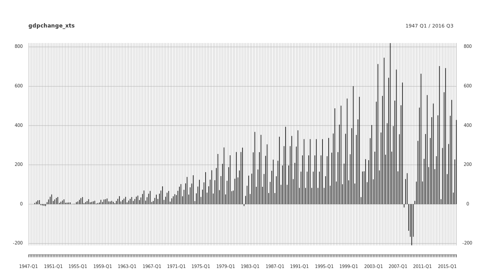
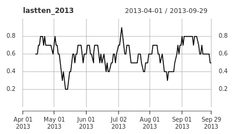

```{r setup, include=FALSE}
knitr::opts_chunk$set(echo = TRUE)
```

**Review xts fundamentals**

**Flight data**

- flight delay cancellations, 2010 through 2015

**Flight data**

Now that you're back in the time series mindset, it's time to get to work! Your task is to understand the travel patterns of tourists visiting Boston. As a first step, you've been assigned to explore patterns in flights arriving at Boston's Logan International Airport (BOS). In this exercise, you'll view the structure and qualities of some data in preparation for time series manipulation.

Lucky for you, the [U.S. Bureau of Transportation Statistics](http://www.transtats.bts.gov/ot_delay/ot_delaycause1.asp) provides open source data on flight arrival times. The `flights` data file has been preloaded in your workspace.

*This course touches on a lot of concepts you may have forgotten, so if you ever need a quick refresher, download the* [xts in R Cheat Sheet](https://datacamp-community-prod.s3.amazonaws.com/e04c5a6b-4aca-46f5-8cd5-803d975ccc4b) *and keep it handy!*

```
#View the structure of the flights data
str(flights)
```
```
'data.frame':	72 obs. of  5 variables:
 $ total_flights : num  8912 8418 9637 9363 9360 ...
 $ delay_flights : num  1989 1918 2720 1312 1569 ...
 $ cancel_flights: num  279 785 242 58 102 157 222 138 144 131 ...
 $ divert_flights: num  9 23 32 7 8 5 10 20 6 9 ...
 $ date          : chr  "2010-01-01" "2010-02-01" "2010-03-01" "2010-04-01" ...
```
```
#Examine the first few lines of the flights data
head(flights, n = 5)
```
```
  total_flights delay_flights cancel_flights divert_flights       date
1          8912          1989            279              9 2010-01-01
2          8418          1918            785             23 2010-02-01
3          9637          2720            242             32 2010-03-01
4          9363          1312             58              7 2010-04-01
5          9360          1569            102              8 2010-05-01
```
```
#Identify class of the column containing date information
class(flights$date)
```
```
[1] "character"
```

It's always helpful to use these commands to get a feel for your data before you begin analysis. As you can see, the `flights` object contains four columns of flight data and one column of dates. The `date` column is currently a character string. You'll need to convert this into a time-based object before moving forward with time series analysis.

**Encoding your flight data**

You're ready to encode your data to an `xts` object! Remember that `flights` is a data frame containing four columns of flight data and one column of dates.

To convert to an `xts` object, you'll need to ensure that your date column is in a time-based format. As you discovered earlier, the `date` column is currently a `character`. Once `date` is saved in a time-based format, you're ready to convert to xts! To do so, you'll use [as.xts()](https://www.rdocumentation.org/packages/xts/versions/0.9-7/topics/as.xts.methods), which takes two primary arguments.

First, you'll need to specify the object being converted (in this case, `flights`). To avoid redundancies, you should generally remove the time-based column from the data when you convert to `xts`. In this case, you'll remove the fifth column (`dates`), by specifying `[, -5]` in your `as.xts()` call.

Second, you'll need to tell xts how to index your object by specifying the `order.by` argument. In this case, you want to index your object on the `date` column.

The `flights` data frame is preloaded for you.

```
# Load the xts package
library(xts)

# Convert date column to a time-based class
flights$date <- as.Date(flights$date)

# Convert flights to an xts object using as.xts
flights_xts <- as.xts(flights[ , -5], order.by = flights$date)

# Check the class of flights
class(flights_xts)
```
```
[1] "xts" "zoo"
```
```
# View the first five lines of flights
head(flights_xts, n = 5)
```
```
          total_flights delay_flights cancel_flights divert_flights
2010-01-01          8912          1989            279              9
2010-02-01          8418          1918            785             23
2010-03-01          9637          2720            242             32
2010-04-01          9363          1312             58              7
2010-05-01          9360          1569            102              8
```

Your new xts object contains four columns of information about flights indexed on a series of months and years.

**Manipulating and visualizing your data**

**Qualities of xts objects**

- Periodicity: units of time in your data

**Exploring your flight data**
Before any analysis can be done, it is critical to explore the basic qualities of your data, including **periodicity**, **scope**, and **comprehensiveness**.

In this exercise, you'll gain a better understanding of your data by exploring these qualities. As you may recall from the earlier exercises, your time index seemed to be in months. To check that this is constant throughout your xts object, you can use the [periodicity()](https://www.rdocumentation.org/packages/xts/versions/0.9-7/topics/periodicity) command to tell you the periodicity and scope of the data.

Once you are sure of periodicity, you may also want to know how many periods are covered. To identify the number of periods in your data, you can use the [ndays()](https://www.rdocumentation.org/packages/xts/versions/0.9-7/topics/ndays) command, or one of its wrappers, `nmonths()`, `nyears()`, etc.

Finally, you may find it useful to query for a particular date by subsetting For example, inputting `xts_object["date"]` will generate the row pertaining to that date.

```
# Identify the periodicity of flights_xts
periodicity(flights_xts)
```
```
Monthly periodicity from 2010-01-01 to 2015-12-01
```
```
# Identify the number of periods in flights_xts
nmonths(flights_xts)
```
```
[1] 72
```
```
# Find data on flights arriving in BOS in June 2014
flights_xts['2014-06']
```
```
          total_flights delay_flights cancel_flights divert_flights
2014-06-01          9662          2279            141              6
```

It looks like you have monthly data on flights arriving in Boston over the course of 72 months from January 2010 through December 2015.

**Visualize flight data**

Now that you have a grip on your data, the next step is to visualize trends in your data over time. In this exercise, you'll plot the `flights_xts` data over time using a few different methods for plotting time series data.

Often the simplest way to plot xts objects is to use [plot.xts()](https://www.rdocumentation.org/packages/xts/versions/0.9-7/topics/plot.xts), which requires only a single argument for the y-axis in the plot. The x-axis is supplied by the time index in your xts object.

For more complicated plots, you may want to use [plot.zoo()](https://www.rdocumentation.org/packages/zoo/versions/1.7-13/topics/plot.zoo), which allows you to include multiple columns of data. In particular, the `plot.type` argument allows you to specify whether you'd like your data to appear in a single panel ("`single`") or multiple panels ("`multiple`"). This can be useful when comparing multiple columns of data over time.

```
lty = [1, 2, 3, 4]
labels = ["Total", "Delay", "Cancel", "Divert"]

# Use plot.xts() to view total monthly flights into BOS over time
plot.xts(flights_xts$total_flights)
```

```
# Use plot.xts() to view monthly delayed flights into BOS over time
plot.xts(flights_xts$delay_flights)
```

```
# Use plot.zoo() to view all four columns of data in their own panels
plot.zoo(flights_xts, plot.type = "multiple", ylab = labels)
```

```
# Use plot.zoo() to view all four columns of data in one panel
plot.zoo(flights_xts, plot.type = "single", lty = lty)
legend("right", lty = lty, legend = labels)
```


These plots provide some very important information about flights arriving in Boston. It looks like only a small percentage of flights are delayed, cancelled, or diverted. In the next exercise, you'll calculate these percentages.

**Calculate time series trends**
One of the most useful qualities of xts objects is the ability to conduct simple mathematical equations across time. In your flight data, one valuable metric to calculate would be the percentage of flights delayed, cancelled, or diverted each month.

In this exercise, you'll use your data to generate a new time series column containing the percentage of flights arriving late to Boston each month. You'll then generate a plot for this metric, before going on to calculate additional metrics for flight cancellations and diversions.

```
# Calculate percentage of flights delayed each month: pct_delay
flights_xts$pct_delay <- (flights_xts$delay_flights / flights_xts$total_flights) * 100

# Use plot.xts() to view pct_delay over time
plot.xts(flights_xts$pct_delay)
```

```
# Calculate percentage of flights cancelled each month: pct_cancel
flights_xts$pct_cancel <- (flights_xts$cancel_flights / flights_xts$total_flights) * 100

# Calculate percentage of flights diverted each month: pct_divert
flights_xts$pct_divert <- (flights_xts$divert_flights / flights_xts$total_flights) * 100

# Use plot.zoo() to view all three trends over time
plot.zoo(flights_xts[, c("pct_delay", "pct_cancel", "pct_divert")])
```


This plot shows the percentage of flights each month that are delayed, cancelled, or diverted. Do you notice any trends? Pay close attention to different y-axis scales across the different panels.

**Saving and exporting xts objects**

**Saving time - I**

You've now successfully converted your `flights` data into an xts object, plotted information over time, and calculated a few valuable metrics to help you proceed with analysis. You've even been able to conduct some quick descriptive analysis on your data by plotting these metrics over time.

The final step in any time series data manipulation is to save your xts object so you can easily return to it in the future.

As a first step, you'll want to save your xts object as a `rds` file for your own use. To do this, you'll use the command [saveRDS()](https://www.rdocumentation.org/packages/base/versions/3.3.1/topics/readRDS), which saves your object to a file with the name you specify (using the `file` argument). By default, `saveRDS()` will save to the current working directory.

When you're ready to return your saved data, you can use the `readRDS()` command to reopen the file. As you'll see in this exercise, this method maintains the class of your xts object.

```
# Save your xts object to rds file using saveRDS
saveRDS(object = flights_xts, file = "flights_xts.rds")

# Read your flights_xts data from the rds file
flights_xts2 <- readRDS("flights_xts.rds")

# Check the class of your new flights_xts2 object
class(flights_xts2)
```
```
[1] "xts" "zoo"
```
```
# Examine the first five rows of your new flights_xts2 object
head(flights_xts2, n = 5)
```
```
           total_flights delay_flights cancel_flights divert_flights pct_delay
2010-01-01          8912          1989            279              9  22.31822
2010-02-01          8418          1918            785             23  22.78451
2010-03-01          9637          2720            242             32  28.22455
2010-04-01          9363          1312             58              7  14.01260
2010-05-01          9360          1569            102              8  16.76282
           pct_cancel pct_divert
2010-01-01  3.1306104 0.10098743
2010-02-01  9.3252554 0.27322404
2010-03-01  2.5111549 0.33205354
2010-04-01  0.6194596 0.07476236
2010-05-01  1.0897436 0.08547009
```

As you can see, saving to rds files allows you to maintain the class of your data object. However, rds files are difficult to read into programs other than R. In the next exercise, you'll export your xts object to a standard format for sharing with others who don't use R.

**Saving time - II**

You've saved your `flights_xts` data to a rds file for future use. But what if you'd like to share your data with colleagues who don't use R?

A second option for saving xts objects is to convert them to shareable formats beyond the R environment, including comma-separated values (CSV) files. To do this, you'll use the [write.zoo()](https://www.rdocumentation.org/packages/zoo/versions/1.7-13/topics/read.zoo) command.

Once you've succesfully exported your xts object to a csv file, you can load the data back into R using the `read.zoo()` command. Unlike `readRDS`, however, you will need to re-encode your data to an xts object (using `as.xts`).

```
# Export your xts object to a csv file using write.zoo
write.zoo(flights_xts, file = "flights_xts.csv", sep = ",")

# Open your saved object using read.zoo
flights2 <- read.zoo("flights_xts.csv", sep = ",", FUN = as.Date, header = TRUE, index.column = 1)

# Encode your new object back into xts
flights_xts2 <- as.xts(flights2)

# Examine the first five rows of your new flights_xts2 object
head(flights_xts2, n = 5)
```
```
           total_flights delay_flights cancel_flights divert_flights pct_delay
2010-01-01          8912          1989            279              9  22.31822
2010-02-01          8418          1918            785             23  22.78451
2010-03-01          9637          2720            242             32  28.22455
2010-04-01          9363          1312             58              7  14.01260
2010-05-01          9360          1569            102              8  16.76282
           pct_cancel pct_divert
2010-01-01  3.1306104 0.10098743
2010-02-01  9.3252554 0.27322404
2010-03-01  2.5111549 0.33205354
2010-04-01  0.6194596 0.07476236
2010-05-01  1.0897436 0.08547009
```

You've succesfully completed a full cycle of time series data manipulation, including importing your data, converting it to xts, manipulating it, visualizing it, and saving it for future use. In the next chapter, you'll explore some additional time series data on Boston area weather to gain a deeper understanding of factors affecting flight delays and cancellations.

**Merging time series data by row**

**Weather data**

- practice with Boston area weather data

**Exploring temperature data**

Now that you've learned a bit about your `flights` data - and reviewed the basics of time series data manipulation - your next assignment is to explore weather patterns in the Boston area to understand what might be affecting flight delays and cancellations. To do this, you'll need to compile and manipulate some additional time series data.

In this exercise, you'll explore some temperature data in the Boston area, including measures of min, mean, and max daily temperature over time. These data were collected using the [weatherData](https://www.rdocumentation.org/packages/weatherData/versions/0.4.1) package in R, which scrapes publicly available data from [Weather Underground](https://www.wunderground.com/).

Before moving forward with your time series data manipulation, the first step in any data analysis is to examine the basic qualities of your data. Specifically, you'll take a closer look at two temperature data objects (`temps_1` and `temps_2`) to understand what information these objects contain and how you should proceed.

```
# View the structure of each object
str(temps_1)
str(temps_2)
```
```
str(temps_1)
'data.frame':	2192 obs. of  4 variables:
 $ min : int  21 41 30 24 23 28 24 28 30 28 ...
 $ mean: int  34 46 36 32 28 36 34 37 38 34 ...
 $ max : int  46 50 41 41 33 44 44 46 46 41 ...
 $ date: Date, format: "2007-01-01" "2007-01-02" ...
str(temps_2)
'data.frame':	1095 obs. of  4 variables:
 $ min : int  28 33 35 26 32 32 28 21 17 21 ...
 $ mean: int  33 40 42 36 39 36 35 27 28 30 ...
 $ max : int  38 46 50 46 46 41 42 33 39 39 ...
 $ date: Date, format: "2013-01-01" "2013-01-02" ...
```
```
# View the first and last rows of temps_1
head(temps_1)
tail(temps_1)
```
```
head(temps_1)
  min mean max       date
1  21   34  46 2007-01-01
2  41   46  50 2007-01-02
3  30   36  41 2007-01-03
4  24   32  41 2007-01-04
5  23   28  33 2007-01-05
6  28   36  44 2007-01-06
tail(temps_1)
     min mean max       date
2187  32   36  40 2012-12-26
2188  35   40  46 2012-12-27
2189  35   40  46 2012-12-28
2190  39   40  42 2012-12-29
2191  33   40  48 2012-12-30
2192  28   36  44 2012-12-31
```
```
# View the first and last rows of temps_2
head(temps_2)
tail(temps_2)
```
```
head(temps_2)
  min mean max       date
1  28   33  38 2013-01-01
2  33   40  46 2013-01-02
3  35   42  50 2013-01-03
4  26   36  46 2013-01-04
5  32   39  46 2013-01-05
6  32   36  41 2013-01-06
tail(temps_2)
     min mean max       date
1090  30   40  50 2015-12-26
1091  26   38  51 2015-12-27
1092  28   40  52 2015-12-28
1093  28   39  50 2015-12-29
1094  29   38  45 2015-12-30
1095  19   28  34 2015-12-31
```

When you're on the job, you'll find this brief data exploration to be a critical first step in any data analysis. When running these commands, always think about what the output means for your next steps.

**Merging using rbind()**

Now that you know the structure and scope of your temperature data, your next task will be to convert these objects to `xts` and merge them using `rbind()`.

Before you can convert an object to xts, you need to identify the column that will form the time index and ensure it is encoded as a time-based object. In this case, you'll want to check the class of the `date` column in `temps_1` and `temps_2`. Once you identify the appropriate time-based index, you can encode both objects to xts and merge by row.

The `temps_1` and `temps_2` objects are available in your workspace and the `xts` package has been loaded for you.

```
# Confirm that the date column in each object is a time-based class
class(temps_1$date)
class(temps_2$date)
```
```
class(temps_1$date)
[1] "Date"
class(temps_2$date)
[1] "Date"
```
```
# Encode your two temperature data frames as xts objects
temps_1_xts <- as.xts(temps_1[, -4], order.by = temps_1$date)
temps_2_xts <- as.xts(temps_2[, -4], order.by = temps_2$date)

# View the first few lines of each new xts object to confirm they are properly formatted
head(temps_1_xts)
head(temps_2_xts)
```
```
head(temps_1_xts)
           min mean max
2007-01-01  21   34  46
2007-01-02  41   46  50
2007-01-03  30   36  41
2007-01-04  24   32  41
2007-01-05  23   28  33
2007-01-06  28   36  44
head(temps_2_xts)
           min mean max
2013-01-01  28   33  38
2013-01-02  33   40  46
2013-01-03  35   42  50
2013-01-04  26   36  46
2013-01-05  32   39  46
2013-01-06  32   36  41
```
```
# Use rbind to merge your new xts objects
temps_xts <- rbind(temps_1_xts, temps_2_xts)

# View data for the first 3 days of the last month of the first year in temps_xts
first(last(first(temps_xts, "1 year"), "1 month"), "3 days")
```
```
           min mean max
2007-12-01  32   41  50
2007-12-02  28   39  50
2007-12-03  30   40  50
```

You now have a single xts object containing temperature data in the Boston area from 2007 through 2015. In the next exercise, you'll begin exploring your data in more depth.

**Visualizing Boston winters**

You discovered in the previous chapter that a much higher percentage of flights are delayed or cancelled in Boston during the winter. It seems logical that temperature is an important factor here. Perhaps colder temperatures are associated with a higher percentage of flight delays or cancellations?

In this exercise, you'll probe the plausibility of this hypothesis by plotting temperature trends over time and generating a visual overview of Boston winters.

```
# Identify the periodicity of temps_xts
periodicity(temps_xts)
```
```
Daily periodicity from 2007-01-01 to 2015-12-31 
```
```
# Generate a plot of mean Boston temperature for the duration of your data
plot.xts(temps_xts$mean)
```

```
# Generate a plot of mean Boston temperature from November 2010 through April 2011
plot.xts(temps_xts$mean["201011/201104"])
```

```
lty = [3, 1, 3]

# Use plot.zoo to generate a single plot showing mean, max, and min temperatures during the same period 
plot.zoo(temps_xts["201011/201104"], plot.type = "single", lty = lty)

```


Your temperature data look comprehensive and demonstrates clear variation across seasons. Boston has some cold winters! Your next step will be to combine your temperature data with the flight data you used in the previous chapter.

**Merging time series data by column**

**Preparing to merge**

- check periodicity and coverage
- subset data to include similar coverage
- convert periodicity
  - can only convert to a lower frequency
  
**using merge() with xts**

- order of `merge()` determines order of columns
- order of rows is based on time index

**Subsetting and adjusting periodicity**

Your next step is to merge your temperature data with the flight data from the previous chapter.

Recall from the previous chapter that your flight data stretches from 2010 through 2015 in `monthly` periods. By contrast, your temperature data ranges from 2007 through 2015 in `daily` periods. Before you merge, you should subset your data and adjust the periodicity to monthly.

To convert the periodicity of xts objects, you can use [to.period()](https://www.rdocumentation.org/packages/xts/versions/0.9-7/topics/to.period), which allows you to quickly convert your data to a lower frequency period. By default, this command produces specific values across the entire period (namely, Open-High-Low-Close, or OHLC) which are useful in financial analysis but may not be relevant in all contexts.

In this case, you should set the argument `OHLC` to `FALSE`. Rather than produce OHLC columns in your monthly xts object, this setting will simply take one row from each period as representative of the entire period. You can specify which row using the `indexAt` command.

Both the `temps_xts` data and the `flights_xts` data (from the previous chapter) are available in your workspace.

```
# Subset your temperature data to include only 2010 through 2015: temps_xts_2
temps_xts_2 <- temps_xts["2010/2015"]

# Use to.period to convert temps_xts_2 to monthly periodicity
temps_monthly <- to.period(temps_xts_2, period = "months", OHLC = FALSE, indexAt = "firstof")

# Compare the periodicity and duration of temps_monthly and flights_xts 
periodicity(temps_monthly)
periodicity(flights_xts)
```
```
periodicity(temps_monthly)
Monthly periodicity from 2010-01-01 to 2015-12-01 
periodicity(flights_xts)
Monthly periodicity from 2010-01-01 to 2015-12-01 
```

You've converted your daily temperature data to monthly and it looks like you are ready to merge with your flights data. Before moving forward, however,you should consider whether the value selected by the `to.period()` call (in this case, the first of the month) is appropriate for this context.

**Generating a monthly average**

While the `to.period()` command is useful in many contexts, for your purposes it may not be useful to select a single row as representative of the entire month.

Instead, it makes more sense to generate **average** temperature values per month. To do so, you'll need to manually calculate the monthly average using [split()](https://www.rdocumentation.org/packages/xts/versions/0.9-7/topics/split.xts) and [lapply()](https://www.rdocumentation.org/packages/base/versions/3.3.1/topics/lapply), then generate a new xts object using [as.xts()](https://www.rdocumentation.org/packages/xts/versions/0.9-7/topics/as.xts) This may seem like a complicated process, but you already have the skills to do it!

The subsetted xts object from the previous exercise, `temps_xts_2`, is preloaded in your workspace. Also preloaded is an `index` object containing a vector of dates for the first day of each month covered in the data.

```
# Split temps_xts_2 into separate lists per month
monthly_split <- split(temps_xts_2$mean , f = "months")

# Use lapply to generate the monthly mean of mean temperatures
mean_of_means <- lapply(monthly_split, FUN = mean)

# Use as.xts to generate an xts object of average monthly temperature data
temps_monthly <- as.xts(as.numeric(mean_of_means), order.by = index)

# Compare the periodicity and duration of your new temps_monthly and flights_xts 
periodicity(temps_monthly)
periodicity(flights_xts)
```
```
periodicity(temps_monthly)
Monthly periodicity from 2010-01-01 to 2015-12-01 
periodicity(flights_xts)
Monthly periodicity from 2010-01-01 to 2015-12-01 
```

You generated a new xts object containing *monthly* average temperature in Boston from 2010 through 2015. Although this process is more complicated than using `to.period()`, it produces a more precise measure of monthly temperature.

**Using merge() and plotting over time**

Now that you have temperature data covering the same time period (2010-2015) at the same frequency (monthly) as your flights data, you are ready to merge.

To merge xts objects by column, you can use [merge()](https://www.rdocumentation.org/packages/xts/versions/0.9-7/topics/merge.xts). When two xts objects share the same periodicity, `merge()` is generally able to combine information into appropriate rows. Even when xts objects do not share the same periodicity, `merge()` will preserve the correct time ordering of those objects across disparate periods.

In this exercise, you'll merge your two xts objects by column and generate new plots exploring how flight delays relate to temperature. `temps_monthly` and `flights_xts` are available in your workspace.

```
# Use merge to combine your flights and temperature objects
flights_temps <- merge(flights_xts, temps_monthly)

# Examine the first few rows of your combined xts object
head(flights_temps)
```
```
           total_flights delay_flights cancel_flights divert_flights pct_delay
2010-01-01          8912          1989            279              9  22.31822
2010-02-01          8418          1918            785             23  22.78451
2010-03-01          9637          2720            242             32  28.22455
2010-04-01          9363          1312             58              7  14.01260
2010-05-01          9360          1569            102              8  16.76282
2010-06-01          9502          1955            157              5  20.57462
           pct_cancel pct_divert temps_monthly
2010-01-01  3.1306104 0.10098743      36.12903
2010-02-01  9.3252554 0.27322404      37.71429
2010-03-01  2.5111549 0.33205354      42.22581
2010-04-01  0.6194596 0.07476236      51.26667
2010-05-01  1.0897436 0.08547009      56.87097
```
```
lty = [1, 2]

# Use plot.zoo to plot these two columns in a single panel
plot.zoo(flights_temps[,c("pct_delay", "temps_monthly")], plot.type = "single", lty = lty)
legend("topright", lty = lty, legend = labels, bg = "white")
```


Merging your two xts objects allows you to easily visualize the relationship between flight delays and temperature.


The relationship between flight cancellations and temperature is strong, while the relationship between flight delays and temperature is less obvious. By including all of this data on a single plot, we learn much more about these relationships.

**Time series data workflow**

**Workflow for merging**

1. Encode all time series objects to xts
2. Examine and adjust periodicity
3. Merge xts objects

**Expanding your data**

Now that you have a handle on time series workflow, you're ready to assess the hypothesis that flight delays are a function of visibility and wind.

In this exercise, you'll add a few more columns to your xts object by merging data on monthly average visibility (`vis`) and wind speeds (`wind`) in the Boston area from 2010 through 2015. These data are derived from the same source as your temperature data, but have already been manipulated and converted to xts to make your job easier.

This is similar to what you've done before, but this time you have less prewritten code to work with. Your working xts object, `flights_temps`, is also available in your workspace.

```
# Confirm the periodicity and duration of the vis and wind data
periodicity(vis)
periodicity(wind)
```
```
periodicity(vis)
Monthly periodicity from 2010-01-01 to 2015-12-01 
periodicity(wind)
Monthly periodicity from 2010-01-01 to 2015-12-01 
```
```
# Merge vis and wind with your existing flights_temps data
flights_weather <- merge(flights_temps, vis, wind)

# View the first few rows of your flights_weather data
head(flights_weather)
```
```
           total_flights delay_flights cancel_flights divert_flights pct_delay
2010-01-01          8912          1989            279              9  22.31822
2010-02-01          8418          1918            785             23  22.78451
2010-03-01          9637          2720            242             32  28.22455
2010-04-01          9363          1312             58              7  14.01260
2010-05-01          9360          1569            102              8  16.76282
2010-06-01          9502          1955            157              5  20.57462
           pct_cancel pct_divert temps_monthly      vis     wind
2010-01-01  3.1306104 0.10098743      36.12903 5.774194 7.193548
2010-02-01  9.3252554 0.27322404      37.71429 5.857143 5.214286
2010-03-01  2.5111549 0.33205354      42.22581 5.806452 4.903226
2010-04-01  0.6194596 0.07476236      51.26667 6.000000 4.700000
2010-05-01  1.0897436 0.08547009      56.87097 6.000000 4.129032
2010-06-01  1.6522837 0.05262050      63.56667 6.000000 4.300000
```

Working with time series data using xts can be quite simple once you master the basics. In only a few short commands, you've added two more potentially critical pieces of information to your data.

**Are flight delays related to visibility or wind?**

Well done! You've painlessly added some new data to your xts object. It gets easier every time!

The plot on the right shows the fruits of your labor: the percentage of delayed flights (which you calculated in the previous chapter), the average wind speed in Boston, and the average visibility, all on a monthly basis from 2010 through 2015.

After manipulating and exploring the data, it's time to report back to your client. Which of the following conclusions would you draw from this plot?


- There is no clear relationship between visibility and flight delays.

- Higher wind speeds show a weak correlation with percentage of delayed flights, but further analysis is required.

- Neither wind nor visibility can explain the high percentage of flights delayed in early 2011.

- We have reason to doubt the quality of data on visibility prior to 2012.

- **All of the above.**

Although this plot doesn't depict any strong relationships between visibility or wind and delayed flights, it tells you quite a bit about your data. Wind speed sometimes corresponds to flight delays, while visibility does not appear related to delays. More importantly, the flatline data on visibility prior to 2012 should raise some eyebrows. Before proceeding with your analysis, you may want to reassess the quality of your data.

**Handling missingness**

**Fill NAs with last observation**

- Last observation carried forward (LOCF)
- Next observation carried backward (NOCB)

**Linear interpolation**

**Exploring economic data**

Now that you've explored weather and flight patterns in Boston, your client has asked you to step back and prepare some economic data. You've gathered some data on the US economy, including gross domestic product (GDP) and unemployment in the US in general and the state of Massachusetts (home to Boston) in particular.

As always, your first step in manipulating time series data should be to convert your data to the [xts](https://www.rdocumentation.org/packages/xts/versions/0.9-7/topics/xts) class. In this exercise, you'll examine and encode time series data on US GDP, which is available in your workspace as `gdp`.

```
# Get a summary of your GDP data
summary(gdp)
```
```
     date      gdp_billions    
 1947 Q1:  1   Min.   :  243.1  
 1947 Q2:  1   1st Qu.:  708.8  
 1947 Q3:  1   Median : 3167.3  
 1947 Q4:  1   Mean   : 6186.6  
 1948 Q1:  1   3rd Qu.:11497.9  
 1948 Q2:  1   Max.   :18651.2  
 (Other):273   NA's   :80       
```
```
# Convert GDP date column to time object
gdp$date <- as.yearqtr(gdp$date)

# Convert GDP data to xts
gdp_xts <- as.xts(gdp[, -1], order.by = gdp$date)

# Plot GDP data over time
plot.xts(gdp_xts)
```


Your plot shows fairly consistent GDP growth in the United States. However, it looks like you are missing quite a bit of data! One of your interns must have fallen asleep on the keyboard. In the next few exercises, you'll practice some techniques for handling missing data.

**Replace missing data - I**

As you discovered in the previous exercise, your quarterly GDP data appear to be missing several observations. In fact, your call to `summary()` in the previous exercise revealed **80** missing data points!

As you may recall from the first xts course, xts and zoo provide a variety of functions to handle missing data.

The simplest technique is the [na.locf()](https://www.rdocumentation.org/packages/imputeTS/versions/1.7/topics/na.locf) command, which carries forward the last observation before the missing data (hence, "**l**ast **o**bservation **c**arried **f**orward", or `locf`). This approach is often the most appropriate way to handle missingness, especially when you have reasons to be conservative about growth in your data.

A similar approach works in the opposite direction by taking the first observation *after* the missing value and carrying it backward ("**n**ext **o**bservation **c**arried **b**ackward", or `nocb`). This technique can also be done using the `na.locf()` command by setting the `fromLast` argument to `TRUE`.

Which method is best depends on the type of data you are working with and your preconceived notions about how the data changes over time.

```
# Fill NAs in gdp_xts with the last observation carried forward
gdp_locf <- na.locf(gdp_xts)

# Fill NAs in gdp_xts with the next observation carried backward 
gdp_nocb <- na.locf(gdp_xts, fromLast = TRUE)

# Produce a plot for each of your new xts objects
par(mfrow = c(2,1))
plot.xts(gdp_locf, major.format = "%Y")
plot.xts(gdp_nocb, major.format = "%Y")
```

```
# Query for GDP in 1993 in both gdp_locf and gdp_nocb
gdp_locf["1993"]
gdp_nocb["1993"]
```
```
gdp_locf["1993"]
          [,1]
1993 Q1 5890.8
1993 Q2 5890.8
1993 Q3 5890.8
1993 Q4 5890.8
gdp_nocb["1993"]
          [,1]
1993 Q1 7545.3
1993 Q2 7545.3
1993 Q3 7545.3
1993 Q4 7545.3
```

You've filled in the missing values in your GDP data. As you can see, the `locf` and `nocb` techniques sometimes produce drastically different values, especially when you have long spells of missing data. In the next exercise, you'll practice a third technique for handling missingness: linear interpolation.

**Replace missing data - II**

Like most aspects of time series data manipulation, there are many ways to handle missingness. As you discovered in the previous exercise, both the `locf` and `nocb` approach require you to make certain assumptions about growth patterns in your data. While `locf` is more conservative and `nocb` is a more aggressive, both generate step-wise growth from missing data.

But what if you have reason to expect linear growth in your data? In this case, it may be more useful to use **linear interpolation**, which generates new values between the data on either end of the missing value weighted according to time.

In this exercise, you'll fill the missing values in your `gdp_xts` data using the [na.approx()](https://www.rdocumentation.org/packages/zoo/versions/1.7-13/topics/na.approx) command, which uses interpolation to estimate linear values in time.

```
# Fill NAs in gdp_xts using linear approximation
gdp_approx <- na.approx(gdp_xts)

# Plot your new xts object
plot.xts(gdp_approx, major.format = "%Y")
```

```
# Query for GDP in 1993 in gdp_approx
gdp_approx["1993"]

```
```
           [,1]
1993 Q1 6883.500
1993 Q2 6966.225
1993 Q3 7048.950
1993 Q4 7131.675
```

Although the values you generate may not be 100% accurate, linear interpolation provides a realistic overall picture of GDP growth from the 1940s through the 2010s. Ultimately, which technique you should use depends on the trends you see in the data you have as well as your preconceived notions about the data.

**Lagging and differencing**

**Lagging**

- `lag()` offsets observations in time

```
lag(unemployment, k = 1, ...)
```


**Differencing**

- `diff()` measures chan between periods

```
diff(unemployment, lag = 1, ...)
```


**Exploring unemployment data**

Now that you've reviewed the basic steps for handling missing data, you can more easily examine and clean new time series data on the fly.

In this exercise, you'll gain a bit more practice by exploring, cleaning, and plotting data on unemployment, both in the United States in general and in Massachusetts (MA) in particular. An xts object containing this data, `unemployment` is available in your workspace.

```
# View a summary of your unemployment data
summary(unemployment)
```
```
    Index            us               ma        
 Min.   :1976   Min.   : 3.800   Min.   : 2.100  
 1st Qu.:1986   1st Qu.: 5.300   1st Qu.: 4.300  
 Median :1996   Median : 6.000   Median : 5.500  
 Mean   :1996   Mean   : 6.365   Mean   : 5.612  
 3rd Qu.:2006   3rd Qu.: 7.300   3rd Qu.: 6.800  
 Max.   :2016   Max.   :10.800   Max.   :11.600  
                NA's   :73       NA's   :20      
```
```
# Use na.approx to remove missing values in unemployment data
unemployment <- na.approx(unemployment)

# Plot new unemployment data
plot.zoo(unemployment, plot.type = "single", lty = lty)
legend("topright", lty = lty, legend = labels, bg = "white")
```


Now that you have complete unemployment data, your next step is to generate some useful moving indicators.

**Lagging unemployment**

Given that economic trends may take some time to influence tourism, it may be helpful to lag your unemployment data before proceeding with analysis.

Generating a lag in xts is straightforward with the `lag()` command, which requires that you specify the data being lagged (the `x` argument) and a `k` value to determine the direction and scale of the lag.

Be careful to keep your formatting consistent. Base R and the zoo package require that you specify a lag with a *negative* value, so that a lag of 1 is expressed using `"-1"` (and a lead of 1 is counterintuitively expressed using `"1"`). By contrast, the xts package specifies lags using a *positive* value, so that a lag of 1 is expressed using `"1"` (and a lead of 1 is expressed using `"-1"`).

```
# Create a one month lag of US unemployment
us_monthlag <- lag(unemployment$us, k = 1)

# Create a one year lag of US unemployment
us_yearlag <- lag(unemployment$us, k = 12)

# Merge your original data with your new lags 
unemployment_lags <- merge(unemployment, us_monthlag, us_yearlag)

# View the first 15 rows of unemployment_lags
head(unemployment_lags, n = 15)
```
```
           us    ma us.1 us.2
Jan 1976 7.90 11.60   NA   NA
Feb 1976 7.70 11.25 7.90   NA
Mar 1976 7.60 10.90 7.70   NA
Apr 1976 7.70 10.15 7.60   NA
May 1976 7.40  9.40 7.70   NA
Jun 1976 7.60  9.80 7.40   NA
Jul 1976 7.60  9.70 7.60   NA
Aug 1976 7.60  9.00 7.60   NA
Sep 1976 7.60  9.00 7.60   NA
Oct 1976 7.70  8.30 7.60   NA
Nov 1976 7.80  8.30 7.70   NA
Dec 1976 7.65  8.20 7.80   NA
Jan 1977 7.50  9.50 7.65  7.9
Feb 1977 7.60  9.20 7.50  7.7
Mar 1977 7.40  8.80 7.60  7.6
```

When it comes to time series analysis, many of the theoretical processes you'll investigate take some time to have an effect. Including lags in your analysis is an easy way to account for this. However, as you may have noticed in your call to `head()`, lags generated through this process are not intuitively labelled in your data.

**Differencing unemployment**

In addition to adding lags to your data, you may find it helpful to generate a **difference** of the series.

To calculate a difference, simply use the [diff()](https://www.rdocumentation.org/packages/xts/versions/0.9-7/topics/diff.xts) command. This command requires you to specify the original data object, the number of lags (`lag`), and the order of the difference (`differences`).

In this exercise, you'll expand your `unemployment` data in a different direction by adding a few useful difference measures.

```
# Generate monthly difference in unemployment
unemployment$us_monthlydiff <- diff(unemployment$us, lag = 1, differences = 1)

# Generate yearly difference in unemployment
unemployment$us_yearlydiff <- diff(unemployment$us, lag = 12, differences = 1)

# Plot US unemployment and yearly difference
par(mfrow = c(2,1))
plot.xts(unemployment$us)
plot.xts(unemployment$us_yearlydiff, type = "h")
```


While lags are useful in time series analysis, differencing provides a very intuitive way to visualize growth trends over time. Both types of indicators are easy to produce using commands in xts and zoo.

**Rolling functions**

**Discrete windows**

- split the data according to period
- apply function within period
- bind new data into xts object

**Rolling windows**

- `rollapply()`

**Add a discrete rolling sum to GDP data**

While it helps to know the amount of change from one period to the next, you may want to know the total change since the beginning of the year. To generate this type of indicator, you can use the **split-lapply-rbind pattern**. This process is similar to the process used to generate monthly temperature averages in the previous chapter.

In this exercise, you'll return to the `gdp` data used earlier in the chapter. In addition to static GDP values in each quarter, you'd like to generate a measure of GDP change from one quarter to the next (using `diff()`) as well as a rolling sum of year-to-date GDP change (using `split()`, `lapply()` and `rbind()`.

```
# Add a quarterly difference in gdp
gdp$quarterly_diff <- diff(gdp$gdp, lag = 1, differences = 1)

# Split gdp$quarterly_diff into years
gdpchange_years <- split(gdp$quarterly_diff, f = "years")

# Use lapply to calculate the cumsum each year
gdpchange_ytd <- lapply(gdpchange_years, FUN = cumsum)

# Use do.call to rbind the results
gdpchange_xts <- do.call(rbind, gdpchange_ytd)

# Plot cumulative year-to-date change in GDP
plot.xts(gdpchange_xts, type = "h")
```



The **split-lapply-rbind pattern** is complicated but allows you to develop useful and precise indicators across your time series data. In the plot above, each bar shows cumulative GDP growth since the beginning of that year. Some additional manipulation would give you a percentage of year-to-date GDP growth - a common indicator in economic analysis!

**Add a continuous rolling average to unemployment data**

In addition to discrete measures such as year-to-date sums, you may be interested in adding a rolling sum or average to your time series data.

To do so, let's return to your monthly `unemployment` data. While you may be interested in static levels of unemployment in any given month, a broader picture of the economic environment might call for rolling indicators over several months.

To do this, you'll use the [rollapply()](https://www.rdocumentation.org/packages/zoo/versions/1.7-13/topics/rollapply) command, which takes a time series object, a window size `width`, and a `FUN` argument to apply to each rolling window.

```
# Use rollapply to calculate the rolling yearly average US unemployment
unemployment$year_avg <- rollapply(unemployment$us, width = 12, FUN = mean)

# Plot both columns of US unemployment data
lty = [2, 1]
lwd = [1, 2]
plot.zoo(unemployment[, c("us", "year_avg")], plot.type = "single", lty = lty, lwd = lwd)
```


Your rolling average helps smooth out some of the short term changes in unemployment from month to month and provides a broader picture of the health of the US economy.

**Manipulating MA unemployment data**

Now that you've added some lags, differences, and rolling values to your GDP and US unemployment data, it's time to take these skills back to your assignment.

Remember that your client wants information relevant to the Boston tourism industry. In addition to data on the US economy in general, it may help to prepare some relevant indicators for your Massachusetts economic data.

In this exercise, you'll use your time series data manipulation skills to generate: a one-year lag, a six-month first order difference, a six-month rolling average, and a one-year rolling maximum in the MA unemployment rate. Your client is waiting!

```
# Add a one-year lag of MA unemployment
unemployment$ma_yearlag <- lag(unemployment$ma, k = 12)

# Add a six-month difference of MA unemployment
unemployment$ma_sixmonthdiff <- diff(unemployment$ma, lag = 6, differences = 1)

# Add a six-month rolling average of MA unemployment
unemployment$ma_sixmonthavg <- rollapply(unemployment$ma, width = 6, FUN = mean)
  
# Add a yearly rolling maximum of MA unemployment
unemployment$ma_yearmax <- rollapply(unemployment$ma, width = 12, FUN = max)

# View the last year of unemployment data
tail(unemployment, n = 12)
```
```
         us  ma ma_yearlag ma_sixmonthdiff ma_sixmonthavg ma_yearmax
Jan 2015 5.7 5.8       6.80           -0.20       5.375000       6.50
Feb 2015 5.5 5.5       6.50           -0.35       5.316667       6.20
Mar 2015 5.5 5.2       6.20           -0.50       5.233333       6.00
Apr 2015 5.4 4.7       5.50           -0.30       5.183333       6.00
May 2015 5.5 4.9       5.50           -0.10       5.166667       6.00
Jun 2015 5.3 5.2       6.00            0.30       5.216667       6.00
Jul 2015 5.3 5.2       6.00           -0.60       5.116667       5.85
Aug 2015 5.1 4.7       5.85           -0.80       4.983333       5.80
Sep 2015 5.1 4.9       5.70           -0.30       4.933333       5.80
Oct 2015 5.0 4.5       5.00           -0.20       4.900000       5.80
Nov 2015 5.0 4.5       5.00           -0.40       4.833333       5.80
Dec 2015 5.0 4.6       4.90           -0.60       4.733333       5.80
```

You've mastered the xts and zoo commands for calculating a variety of useful values in your time series data, from simple lags and differences to more complex rolling indicators.

**Advanced features of xts**

**Finding endpoints**

- `endpoints()` indexes last observation per interval

**Apply by period**

- `period.apply()` extends apply function over time

**Sports data**

- Boston sports games, 2010 through 2015

**Encoding and plotting Red Sox data**

After exploring and manipulating data on flights, weather, and the economy, your client wants to cover all the bases. Naturally, they'd like you to collect data on Boston's major sports teams: the Boston Red Sox (baseball), the New England Patriots (football), the Boston Bruins (hockey), and the Boston Celtics (basketball). In this chapter, you'll prepare data on the schedule and outcome of all games involving these teams from 2010 through 2015. It's a perfect opportunity to gain further practice manipulating time series data!

As a start, you've compiled data on games played by the Boston Red Sox from 2010 through 2015. In this exercise, you'll explore the data, encode it to xts, and plot some trends over time. The `redsox` data frame is available in your workspace.

```
# View summary information about your redsox data
summary(redsox)
```
```
    date            boston_score    opponent_score      homegame        mlb   
 Length:972         Min.   : 0.000   Min.   : 0.000   Min.   :0.0   Min.   :1  
 Class :character   1st Qu.: 2.000   1st Qu.: 2.000   1st Qu.:0.0   1st Qu.:1  
 Mode  :character   Median : 4.000   Median : 4.000   Median :0.5   Median :1  
                    Mean   : 4.796   Mean   : 4.538   Mean   :0.5   Mean   :1  
                    3rd Qu.: 7.000   3rd Qu.: 6.000   3rd Qu.:1.0   3rd Qu.:1  
                    Max.   :22.000   Max.   :20.000   Max.   :1.0   Max.   :1  
      nfl         nhl         nba        season    
 Min.   :0   Min.   :0   Min.   :0   Min.   :2010  
 1st Qu.:0   1st Qu.:0   1st Qu.:0   1st Qu.:2011  
 Median :0   Median :0   Median :0   Median :2012  
 Mean   :0   Mean   :0   Mean   :0   Mean   :2012  
 3rd Qu.:0   3rd Qu.:0   3rd Qu.:0   3rd Qu.:2014  
 Max.   :0   Max.   :0   Max.   :0   Max.   :2015 
```
```
# Convert the date column to a time-based format
redsox$date <- as.Date(redsox$date)

# Convert your red sox data to xts
redsox_xts <- as.xts(redsox[,-1], order.by = redsox$date)

# Plot the Red Sox score and the opponent score over time
plot.zoo(redsox_xts[, c("boston_score", "opponent_score")])
```


You've converted your Red Sox data to xts and generated plots showing scores over time. You can clearly see the games clustered into seasons. However, these plots are difficult to interpret. Ideally, you want to visualize Red Sox wins using a clear metric and perhaps provide some indicator of how the team is doing over time. To do that, you'll need to do some math!

**Calculate a closing average**

Now that you've explored some trends in your Red Sox data, you want to produce some useful indicators. In this exercise, you'll calculate the team's win/loss average at the end of each season. In financial terms, you can think of this as the team's value at the *close* of the season.

To calculate a closing win/loss average, you'll need to combine a few of the commands used in previous chapters.

First, you'll identify wins based on the score of each game. You can do this using a simple `ifelse()` command and the knowledge that the Red Sox win each game in which they score more points than the opposing team.

Second, you'll identify the date of the last game in each season using [endpoints()](https://www.rdocumentation.org/packages/xts/versions/0.9-7/topics/endpoints). This command identifies the last date in your object within certain periods.

Finally, to calculate the closing win/loss average each season, simply use [period.apply()](https://www.rdocumentation.org/packages/xts/versions/0.9-7/topics/period.apply) on the `win_loss` column of your data, specifying the `close` dates as the index, and `mean` as the function.

The `redsox_xts` object is available in your workspace.

```
# Generate a new variable coding for red sox wins
redsox_xts$win_loss <- ifelse(redsox_xts$boston_score > redsox_xts$opponent_score, 1, 0)

# Identify the date of the last game each season
close <- endpoints(redsox_xts, on = "years")

# Calculate average win/loss record at the end of each season
period.apply(redsox_xts[, "win_loss"], close, mean)
```
```
            win_loss
2010-10-03 0.5493827
2011-09-28 0.5555556
2012-10-03 0.4259259
2013-09-29 0.5987654
2014-09-28 0.4382716
2015-10-04 0.4814815
```

The combination of `endpoints()` and `period.apply()` allows you to easily develop indicators as of the end of a period. In this case, you can see the Red Sox had a very strong season in 2013 (avg = 0.599) and a weak season in 2014 (avg = 0.438).

**Calculate and plot a seasonal average**

In the previous exercise you used `endpoints()` and `period.apply()` to quickly calculate the win/loss average for the Boston Red Sox at the end of each season. But what if you need to know the cumulative average *throughout* each season? Statisticians and sports fans alike often rely on this average to compare a team with its rivals.

To calculate a cumulative average in each season, you'll need to return to the **split-lapply-rbind** formula practiced in Chapter Three. First, you'll split the data by season, then you'll apply a cumulative mean function to the `win_loss` column in each season, then you'll bind the values back into an xts object.

A custom `cummean()` function, which generates a cumulative sum and divides by the number of values included in the sum, has been generated for you. The `redsox_xts` data, including the `win_loss` column, is available in your workspace.

```
cummean <- function(x) {
  cumsum(x) / seq_along(x)
}

# Split redsox_xts win_loss data into years 
redsox_seasons <- split(redsox_xts$win_loss, f = "years")

# Use lapply to calculate the cumulative mean for each season
redsox_ytd <- lapply(redsox_seasons, cummean)

# Use do.call to rbind the results
redsox_winloss <- do.call(rbind, redsox_ytd)

# Plot the win_loss average for the 2013 season
plot.xts(redsox_winloss["2013"], ylim = c(0, 1))
```


Your plot shows the cumulative win/loss average after each game in the 2013 season! Because each value is a cumulative average within the season, it makes sense that the value is extremely volatile at the beginning of the season, when each win or loss makes a bigger difference.

**Calculate and plot a rolling average**

The final baseball indicator you'd like to generate is the **L10**, or the moving win/loss average from the previous ten games. While the cumulative win/loss average tells you how the team is doing overall, the L10 indicator provides a more specific picture of the team's recent performance. Beyond the world of sports, this measure is comparable to a financial indicator focused on *recent* portfolio performance.

To generate a rolling win/loss average, return to the `rollapply()` command used in the previous chapter. In this case, you'll want to apply the `mean` function to the last 10 games played by the Red Sox at any given time during the 2013 season.

The `redsox_xts` object, including the `win_loss` column, is available in your workspace.

```
# Select only the 2013 season
redsox_2013 <- redsox_xts["2013"]

# Use rollapply to generate the last ten average
lastten_2013 <- rollapply(redsox_2013$win_loss, width = 10, FUN = mean)

# Plot the last ten average during the 2013 season
plot.xts(lastten_2013, ylim = c(0, 1))
```



You've now used your time series data manipulation skills to generate a closing average, a cumulative average, and a rolling average from basic sports scores. These types of indicators have diverse applications, whether you're a baseball fan or a portfolio analyst.

**Indexing commands in xts**

**Extracting the index**

- `.index()` extracts row time index

**Extract weekend games**

After calculating some useful indicators from your Red Sox data, it's time to step back and explore data from other Boston sports teams. Specifically, you've collected additional data on the New England Patriots (football), the Boston Bruins (hockey), and the Boston Celtics (basketball). Data for these teams, along with your `redsox` data, have been merged into a single xts object, `sports`, which now contains data on all games played by Boston-area sports teams from 2010 through 2015.

Before conducting further analysis, you want to refine your data into a few potentially useful subsets. In particular, it may be helpful to focus exclusively on *weekend* games involving Boston sports teams.

To identify games based on the day of the week, you should use the `.indexwday()` command, which tells you the *day of the week* of each observation in your xts object. These values range from 0-6, with Sunday equal to 0 and Saturday equal to 6.

```
# Extract the day of the week of each observation
weekday <- .indexwday(sports)
head(weekday)
```
```
[1] 0 2 3 5 6 0
```
```
# Generate an index of weekend dates
weekend <- which(.indexwday(sports) == 0 | .indexwday(sports) == 6)

# Subset only weekend games
weekend_games <- sports[weekend]
head(weekend_games)
```
```
          boston_score opponent_score homegame mlb nfl nhl nba season
2010-04-04            9              7        1   1   0   0   0   2010
2010-04-10            8              3        0   1   0   0   0   2010
2010-04-11            8              6        0   1   0   0   0   2010
2010-04-17            5              6        1   1   0   0   0   2010
2010-04-18            1              7        1   1   0   0   0   2010
2010-04-24            7              6        1   1   0   0   0   2010
           sports_type win_loss
2010-04-04           1        1
2010-04-10           1        1
2010-04-11           1        1
2010-04-17           1        0
2010-04-18           1        0
2010-04-24           1        1
```

The advanced xts indexing commands make a seemingly difficult task extremely simple. You now have an xts object containing data on all weekend games involving Boston sports teams from 2010 through 2015.

**Calculate a rolling average across all sports**

Now that you've mastered subsetting your data to include only weekend games, your client would like you to take a different approach. Perhaps Boston's tourism industry receives a boost when local sports teams win more games *at home*.

Instead of focusing on weekend games, you are tasked with generating a rolling win/loss average focused on games *played in Boston*. To produce this indicator, you'll return to the `rollapply()` command used above, this time applying your calculation to all Boston-area sports teams but subsetting to include only games played at home.

```
# Generate a subset of sports data with only homegames
homegames <- sports[sports$homegame == 1]

# Calculate the win/loss average of the last 20 home games
homegames$win_loss_20 <- rollapply(homegames$win_loss, width = 20, FUN = mean)

# Calculate the win/loss average of the last 100 home games
homegames$win_loss_100 <- rollapply(homegames$win_loss, width = 100, FUN = mean)

# Use plot.xts to generate
lty = [3, 1]
lwd = [1, 2]
plot.zoo(homegames[, c("win_loss_20", "win_loss_100")], plot.type = "single", lty = lty, lwd = lwd)
```


Your plot shows the general success of Boston sports teams when playing at home both in the short term (20 games) and the long term (100 games). It looks like Boston teams did very well at home in 2014!

**Congratulations**

**Time series data**

- Flight data
- Weather patterns
- Economic data
- Sports scores
- Portfolio returns
- Commodity prices
- User data