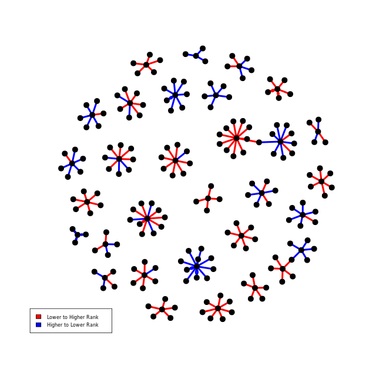
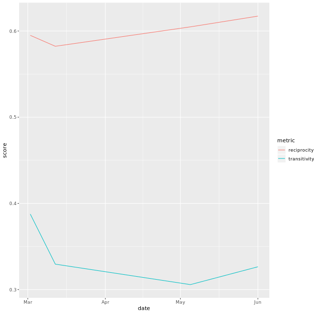
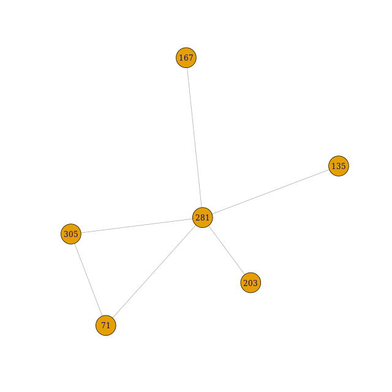
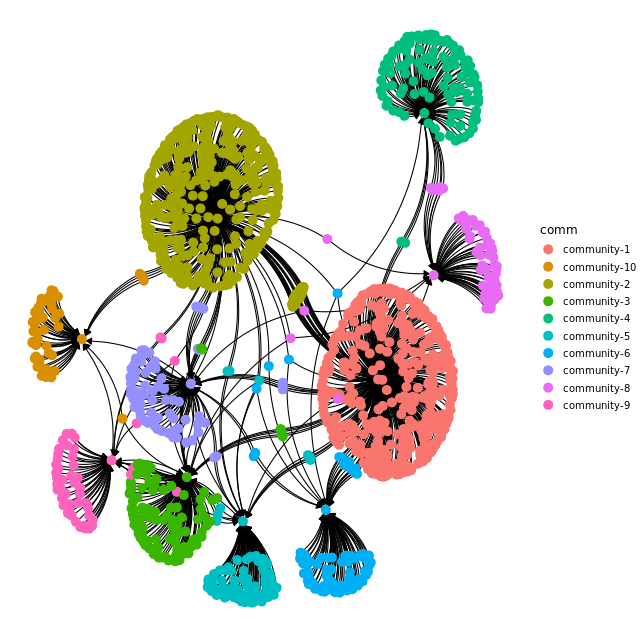
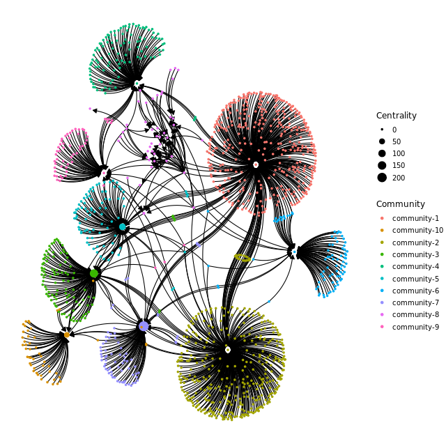
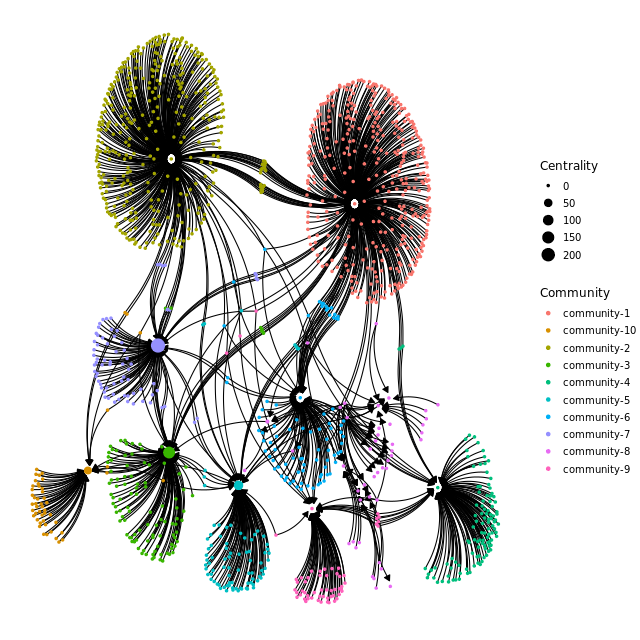
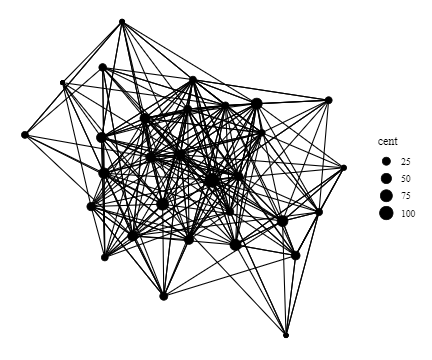
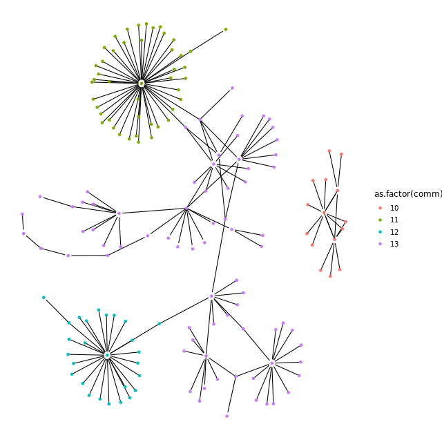
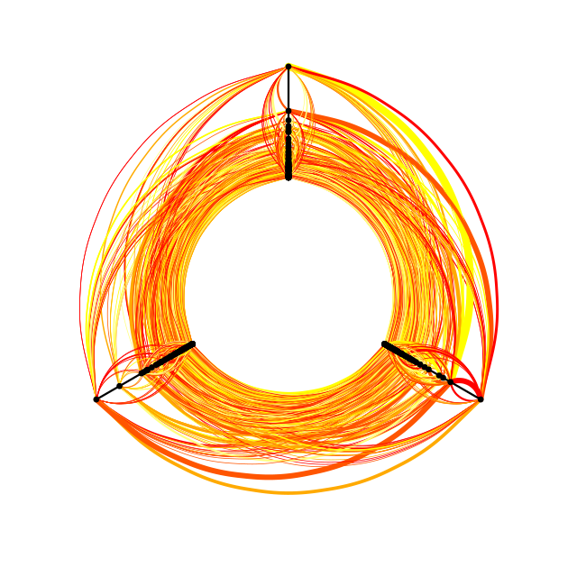
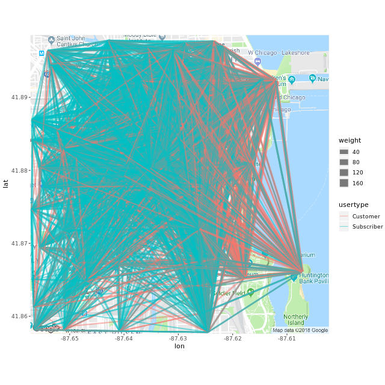

```{r setup, include=FALSE}
knitr::opts_chunk$set(echo = TRUE)
options(repos="https://CRAN.R-project.org")
```

## Exploring your data set

**Dyads**


**Triads**


*3-digit code*

1. count of vertices connected by a bidirectional symmetric edge
2. count of pairs of vertices connected by an asymmetric edge
3. count of pairs of unconnected vertices

*Letter code*

C. Cyclic
D. Single edges go **D**own
U. Single edges come **U**p
T. Transitive
  - if any two vertices in a triad are connected to each other, then there must exist a connection between the third
  
- Patterns 1, 2, 3 are dyad patterns


**Finding Dyads and Triads**

Let's think a little bit more about what we can learn from dyad and triad censuses of the overall graph. Because we are interested in understanding how items are purchased together and whether or not they are reciprocally purchased, dyad and triad censuses can provide a useful initial look. A dyad census will tell us how many items are purchased reciprocally vs. asymmetrically. The triad census will tell us which items might be important, specifically patterns 4, 9, and 12. All of these have one vertex that has 2 out degree edges and no in degree edges. Edge density should also give some insight we expect for graph clustering.

The Amazon co-purchase graph, `amzn_g`, is available.

```{r}
library(igraph)

amzn_g <- read.graph("_data/amzn_g.gml",format=c("gml"))

# The graph, amzn_g, is available
amzn_g

# Perform dyad census
dyad_census(amzn_g)

# Perform triad census
triad_census(amzn_g)

# Find the edge density
edge_density(amzn_g)
```

The dyad census shows us there were 3199 mutual connections, meaning items were bought together. There were also 215 out star triad patterns, or items that drive other purchases.

**Clustering and Reciprocity**

Our previous work looking at the dyad census should give some intuition about how we expect other graph level metrics like reciprocity and clustering in our co-purchase graph to look. Recall that there are 10,754 edges in our graph of 10,245 vertices, and of those, more than 3,000 are mutual, meaning that almost 60 percent of the vertices have a mutual connection. What do you expect the clustering and reciprocity measures to look like given this information? We can test our intuition against a null model by simulating random graphs. In light of the results of our previous simulation, what do you expect to see here? Will reciprocity also be much higher than expected by chance?

**reciprocity** is a measure of the likelihood of vertices in a directed network to be mutually linked

The graph, `amzn_g` is available.

```{r}
# Calculate reciprocity
actual_recip <- reciprocity(amzn_g)

# Calculate the order
n_nodes <- gorder(amzn_g)

# Calculate the edge density
(edge_dens <- edge_density(amzn_g))

# Run the simulation
simulated_recip <- rep(NA, 1000)
for(i in 1:1000) {
  # Generate an Erdos-Renyi simulated graph
  simulated_graph <- erdos.renyi.game(n_nodes, edge_dens, directed = TRUE)
  # Calculate the reciprocity of the simulated graph
  simulated_recip[i] <- reciprocity(simulated_graph)
}

# Reciprocity of the original graph
actual_recip

# Calculate quantile of simulated reciprocity
quantile(simulated_recip , c(0.025, 0.5, 0.975))
```

Resplendent reciprocity calculating! Weirdly though, notice how the reciprocity of the simulations is much lower than the reciprociy of the original graph.

**Important Products**

We've now seen that there's a clear pattern in our graph. Let's take the next step and move beyond just understanding the structure. Given the context of graph structure, what can we learn from it? For example, what drives purchases? A place to start might be to look for "important products", e.g. those products that someone purchases and then purchases something else. We can make inferences about this using in degree and out degree. First, we'll look at our graph and see the distribution of in degree and out degree, and then use that to set up a working definition for what an "important product" is (something that has > X out degrees and < Z in degrees). We'll then make a subgraph to visualize what these subgraphs look like.

For a directed graph and a vertex, the **Out-Degree** refers to the number of arcs directed away from the vertex. The **In-Degree** refers to the number of arcs directed towards the vertex.

```{r}
# Calculate the "out" degrees
out_degree <- degree(amzn_g, mode = "out")

## ... and "in" degrees
in_degree <- degree(amzn_g, mode = "in")

# See the distribution of out_degree
table(out_degree)

## ... and of in_degree
table(in_degree)

# Create condition of out degree greater than 3
# and in degree less than 3
is_important <- out_degree > 3 & in_degree < 3

# Subset vertices by is_important
imp_prod <- V(amzn_g)[is_important]

# Output the vertices
print(imp_prod)
```

Awesome, now you can use in-degree and out-degree to infer what products are important!

**What Makes an Important Product?**

Now that we've come up with a working definition of an important product, let's see if they have any properties that might be correlated. One candidate pairing is `salesrank.from` and `salesrank.to`. We can ask if important products tend to have higher sales ranks than the products people purchase downstream. We'll look at this by first subsetting out the important vertices, joining those back to the initial dataframe, and then creating a new dataframe using the package `dplyr`. We'll create a new graph, and color the edges blue for high ranking (1, 2, 3) to low ranking (20, 21, 22) and red for the opposite. If rank is correlated with downstream purchasing, then we'll see mostly blue links, and if there's no relationship, it will be about equally red and blue.

The dataset `ip_df` contains the information about important products.

```
# Select the from and to columns from ip_df
ip_df_from_to <- ip_df[c("from", "to")]

# Create a directed graph from the data frame
ip_g <- graph_from_data_frame(ip_df_from_to, directed = TRUE)

# Set the edge color. If salesrank.from is less than or 
# equal to salesrank.to then blue else red.
edge_color <- ifelse(
  ip_df$salesrank.from <= ip_df$salesrank.to, 
  yes = "blue", 
  no = "red"
)

plot(
  # Plot the graph
  ip_g, 
  # Set the edge color
  edge.color = edge_color,
  edge.arrow.width = 1, edge.arrow.size = 0, edge.width = 4, 
  vertex.label = NA, vertex.size = 4, vertex.color = "black"
)
legend(
  "bottomleft", 
  # Set the edge color
  fill = unique(edge_color), 
  legend = c("Lower to Higher Rank", "Higher to Lower Rank"), cex = 0.7
)
```


Congratulations! You can see that sales rank is correlated with product importance

## Exploring temporal structure


**Metrics through time**

So far, we have been looking at products that drive other purchases by examining their out degree. However, up until the last lesson we've just been looking at a single snapshot in time. One question is, do these products show similar out degrees at each time step? After all, a product driving other purchases could just be idiosyncratic, or it if were more stable through time it might indicate that product could be responsible for driving co-purchases. To get at this question, we're going to build off the code we've already walked through that generates a list with a graph at each time step.

```{r}
time_graph <- readRDS("_data/time_graph.rds")

d <- as.Date(c("2003-03-02", "2003-03-12", "2003-05-05", "2003-06-01"))

# Loop over time graphs calculating out degree
degree_count_list <- lapply(time_graph, degree, mode = "out")

# Flatten it
degree_count_flat <- unlist(degree_count_list)

degree_data <- data.frame(
  # Use the flattened counts
  degree_count = degree_count_flat,
  # Use the names of the flattened counts
  vertex_name = names(degree_count_flat),
  # Use the lengths of the count list
  date = rep(d, lengths(degree_count_list))
)

important_vertices <- c(1629, 132757, 117841)

important_degree_data <- degree_data %>% 
  # Filter for rows where vertex_name is
  # in the set of important vertices
  dplyr::filter(vertex_name %in% important_vertices)

# Using important_degree_data, plot degree_count vs. date, colored by vertex_name 
library(ggplot2)
ggplot(important_degree_data, aes(x = date, y = degree_count, color = vertex_name)) + 
  # Add a path layer
  geom_path()
```

Transcendent temporal analysis! Only one product, 132757, has a consistently high out degree, indicating it may be consistently driving secondary transactions. The other two might just be having high out degree by chance.

**Plotting Metrics Over Time**
We can also examine how metrics for the overall graph change (or don't) through time. Earlier we looked at two important ones, clustering and reciprocity. Each were quite high, as we expected after visually inspecting the graph structure. However, over time, each of these might change. Are global purchasing patterns on Amazon stable? If we think so, then we expect plots of these metrics to essentially be horizontal lines, indicating that reciprocity is about the same every day and there's a high degree of clustering structure. Let's see what we can find here.

Code to calculate the transitivity by graph is shown.

**Transitivity** of a relation means that when there is a tie from i to j, and also from j to h, then there is also a tie from i to h: friends of my friends are my friends. Transitivity depends on triads, subgraphs formed by 3 nodes.

```
# Examine this code
transitivity_by_graph <- data.frame(
  date = d,
  metric = "transitivity",
  score = sapply(all_graphs, transitivity)
)

# Calculate reciprocity by graph
reciprocity_by_graph <- data.frame(
  date = d,
  metric = "reciprocity",
  score = sapply(all_graphs, reciprocity)
)

metrics_by_graph <- bind_rows(transitivity_by_graph, reciprocity_by_graph)

# Using metrics_by_graph, plot score  vs. date, colored by metric
ggplot(metrics_by_graph, aes(x = date, y = score, color = metric)) +
  # Add a path layer
  geom_path()
```


Marvelous metric plotting! Reciprocity was fairly stable over time. Transitivity decreased after the first time point. This supports the idea that co-purchase networks are relatively stable over this time window.

## Creating your retweet graph

**Exploring the data**

- data is several days of all the tweets mentioning #rstats
- key attributes for building a graph are:
  - screen name
  - raw text of the tweet
  
  

  

 

 

**Visualize the graph**

Now that we've thought a bit about how we constructed our network, let's size our graph and make an initial visualization. Before you make the plot, you'll calculate the number of vertices and edges. This allows you to know if you can actually plot the entire network. Also, the ratio of nodes to edges will give you an intuition of just how dense or sparse your plot might be. As you create your plot, take a moment to hypothesize what you think the plot will look like based on these metrics.

```{r} 
retweet_graph <- read.graph("_data/rt_g.gml", format=c("gml"))

# Count the number of nodes in retweet_graph
gorder(retweet_graph)

# Count the number of edges in retweet_graph
gsize(retweet_graph)

# Calculate the graph density of retweet_graph
graph.density(retweet_graph)

# Plot retweet_graph
plot(retweet_graph)
```

Cool! This is the basic graph now let's check it out with some more visual information.

**Visualize nodes by degree**

Now that we've taken a look at our graph and explored some of the basic properties of it, let's think a bit more about our network. We observed that there are some highly connected nodes and many outlier points. We visualize this by conditionally plotting the graph and coloring some of the nodes by in and out degree. Let's think about the nodes as three different types:

- high retweeters and highly retweeted.
- users who retweeted only once (have an in-degree of 0 and an out-degree of 1).
- users who were retweeted only once (have an in-degree of 1 and an out-degree of 0).

This will help us get more information about what's going on in the ring around the cluster of highly connected nodes.

```{r}
# Calculate the "in" degree distribution
in_deg <- degree(retweet_graph, mode = "in")

# Calculate the "out" degree distribution
out_deg <- degree(retweet_graph, mode = "out")

# Find the case with one "in" degree and zero "out" degrees
has_tweeted_once_never_retweeted <- in_deg == 1 & out_deg == 0

# Find the case with zero "in" degrees and one "out" degree
has_never_tweeted_retweeted_once <- in_deg == 0 & out_deg == 1

# The default color is set to black
vertex_colors <- rep("black", gorder(retweet_graph))

# Set the color of nodes that were retweeted just once to blue
vertex_colors[has_tweeted_once_never_retweeted] <- "blue"

# Set the color of nodes that were retweeters just once to green 
vertex_colors[has_never_tweeted_retweeted_once] <- "green"

# See the result
head(vertex_colors)

plot(
  # Plot the network
  retweet_graph, 
  # Set the vertex colors
  vertex.color = vertex_colors
)
```

Looks awesome! Now we can quantify this visual information a bit more.

**What's the distribution of centrality?**

Recall that there are many ways that you can assess centrality of a graph. We will use two different methods you learned earlier: betweenness and eigen-centrality. Remember that betweenness is a measure of how often a given vertex is on the shortest path between other vertices, whereas eigen-centrality is a measure of how many other important vertices a given vertex is connected to. Before we overlay centrality on our graph plots, let's get a sense of how centrality is distributed.

Note that due to algorithmic rounding errors, we can't check for eigen-centrality equaling a specific value; instead, we check a range.

```{r}
# Calculate directed betweenness of vertices
retweet_btw <- betweenness(retweet_graph, directed = TRUE)

# Get a summary of retweet_btw
summary(retweet_btw)

# Calculate proportion of vertices with zero betweenness
mean(retweet_btw == 0)

# Calculate eigen-centrality using eigen_centrality()
retweet_ec <- eigen_centrality(retweet_graph, directed = TRUE)$vector

# Get a summary of retweet_ec
summary(retweet_ec)

# Calc proportion of vertices with eigen-centrality close to zero
almost_zero <- 1e-10
mean(retweet_ec < almost_zero)
```

Wow! The distributions are highly skewed. 95% of nodes have zero betweenness, but a few have a large value (with the highest close to 70k). Likewise, 97% of vertices have eigen-centrality close to zero.

**Who is important in the conversation?**

Different measures of centrality all try to get at the similar concept of "which vertices are most important." As we discussed earlier, these two metrics approach it slightly differently. Keep in mind that while each may give a similar distribution of centrality measures, how an individual vertex ranks according to both may be different. Now we're going to compare the top ranking vertices of Twitter users.

The vectors that store eigen and betweenness centrality are stored respectively as `retweet_ec` and `retweet_btw`.

```{r}
# Get 0.99 quantile of betweenness 
betweenness_q99 <- quantile(retweet_btw, 0.99)

# Get top 1% of vertices by betweenness
top_btw <- retweet_btw[retweet_btw > betweenness_q99]

# Get 0.99 quantile of eigen-centrality
eigen_centrality_q99 <- quantile(retweet_ec, 0.99)

# Get top 1% of vertices by eigen-centrality
top_ec <- retweet_ec[retweet_ec > eigen_centrality_q99]

# See the results as a data frame
data.frame(
  Rank = seq_along(top_btw), 
  Betweenness = names(sort(top_btw, decreasing = TRUE)), 
  EigenCentrality = names(sort(top_ec, decreasing = TRUE))
)
```

Awesome job, now you can see who the most central screen names are.

**Plotting important vertices**

Lastly, we'll visualize the graph with the size of the vertex corresponding to centrality. However, we already know the graph is highly skewed, so there will likely be a lot of visual noise. So next, we'll want to look at how connected the most central vertices are. We can do this by creating a subgraph based on centrality criteria. This is an important technique when dealing with large graphs. Later, we'll look at alternative visualization methods, but another powerful technique is visualizing subgraphs.

The graph, `retweet_graph`, its vertex betweenness, `retweet_btw`, and the 0.99 betweenness quantile, `betweenness_q99` are available.

```{r}
# Transform betweenness: add 2 then take natural log
transformed_btw <- log(retweet_btw + 2)

# Make transformed_btw the size attribute of the vertices
V(retweet_graph)$size <- transformed_btw

# Plot the graph
plot(
  retweet_graph, vertex.label = NA, edge.arrow.width = 0.2,
  edge.arrow.size = 0.0, vertex.color = "red"
)

# Subset nodes for betweenness greater than 0.99 quantile
vertices_high_btw <- V(retweet_graph)[retweet_btw > betweenness_q99]

# Induce a subgraph of the vertices with high betweenness
retweet_subgraph <- induced_subgraph(retweet_graph, vertices_high_btw)

# Plot the subgraph
plot(retweet_subgraph)
```

You can see that the most central vertices are all highly connected to each other, and by creating a sub-graph, we can more easily visualize the network. Now that we've explored the retweet graph let's move on to looking at another type of Twitter graph.

## Building a mentions graph

 

 

**Comparing mention and retweet graph**

By looking at the ratio of in degree to out degree, we can learn something slightly different about each network. In the case of a retweet network, it will show us users who are often retweeted but don't retweet (high values), or those who often retweet but aren't retweeted (low values). Similarly, if you have a in/out ratio of close to 1 in a mention graph, then the conversation is relatively equitable. However, a low ratio would imply that a given user often starts conversations but they aren't responded to. When you compare the density plots of the different networks, consider what you'd expect. Which network do you expect to be more skewed and which do you expect to have a ratio closer to 1?


```{r}
library(tidyverse)
mention_graph <- read.graph("_data/ment_g.gml", format=c("gml"))

# Read this code
(mention_data <- tibble(
  graph_type = "mention",
  degree_in = degree(mention_graph, mode = "in"),
  degree_out = degree(mention_graph, mode = "out"),
  io_ratio = degree_in / degree_out
))

# Create a dataset of retweet ratios
(retweet_data <- tibble(
  graph_type = "retweet",
  degree_in = degree(retweet_graph, mode = "in"),
  degree_out = degree(retweet_graph, mode = "out"),
  io_ratio = degree_in / degree_out
))

# Bind the datasets by row
io_data <- bind_rows(mention_data, retweet_data) %>% 
  # Filter for finite, positive io_ratio
  filter(is.finite(io_ratio), io_ratio > 0)

# Using io_data, plot io_ratio colored by graph_type
ggplot(io_data, aes(x = io_ratio, color = graph_type)) + 
  # Add a geom_freqpoly layer
  geom_freqpoly() + 
  scale_x_continuous(breaks = 0:10, limits = c(0, 10))

io_data %>% 
  # Group by graph_type
  group_by(graph_type) %>% 
  summarize(
    # Calculate the mean of io_ratio
    mean_io_ratio = mean(io_ratio),
    # Calculate the median of io_ratio
    median_io_ratio = median(io_ratio)
  )
```

Congratulations! Now you can see the difference in the ratio of in and out degrees of mention and retweet graphs.

**Assortativity and reciprocity**

Another two key components of understanding our graphs are reciprocity and degree assortativity. Recall that reciprocity is the number of vertices that have connections going in each direction. Therefore, in the retweet graph, reciprocity is measuring the overall amount of nodes that retweet each other. In the mention graph, it will tell us how many nodes are conversing back and forth.

Assortitivity is a bit less obvious. Values greater than 0 indicate that vertices with high degrees tend to be connected to each other. However, values less than zero indicate a more degree disassortative graph. If you visualize the graph and see a hub and spoke type pattern, this is likely to be disassortative.

**Assortativity**, or assortative mixing is a preference for a network's nodes to attach to others that are similar in some way. For instance, in social networks, nodes tend to be connected with other nodes with similar degree values. This tendency is referred to as assortative mixing, or assortativity.

```{r}
# Find the reciprocity of the retweet graph
reciprocity(retweet_graph) 

# Find the reciprocity of the mention graph
reciprocity(mention_graph)

# Find the directed assortivity of the retweet graph
assortativity.degree(retweet_graph, directed = TRUE)

# Find the directed assortivity of the mention graph
assortativity.degree(mention_graph, directed = TRUE)
```

Great job! Reciprocity is higher in the mention graph compared to the retweet graph, and both graphs have negative assortativity.

**Finding who is talking to whom**

Recall from the first lesson that cliques are complete subgraphs within a larger undirected graph. When we look at the clique structure of a conversational graph in Twitter, it tells us who is talking to whom. One way we can use this information is to see who might be interested in talking to other people. It's easy to see how this basic information could be used to construct models of suggested users to follow or interact with.

```{r}
# Get size 3 cliques
list_of_clique_vertices <- cliques(mention_graph, min = 3, max = 3)

# Loop over cliques, getting IDs
clique_ids <- lapply(list_of_clique_vertices, as_ids)

# See the result
head(clique_ids)

# Loop over cliques, finding cases where revodavid is in the clique
has_revodavid <- sapply(
  clique_ids, 
  function(clique) {
    "revodavid" %in% clique
  }
)

# Subset cliques that have revodavid
cliques_with_revodavid <- clique_ids[has_revodavid]

# Unlist cliques_with_revodavid and get unique values
(people_in_cliques_with_revodavid <- unique(unlist(cliques_with_revodavid)))

# Induce subgraph of mention_graph with people_in_cliques_with_revodavid 
revodavid_cliques_graph <- induced_subgraph(mention_graph, people_in_cliques_with_revodavid)

# Plot the subgraph
plot(revodavid_cliques_graph)
```

Classy clique analysis! Revodavid is in six cliques of size three.

## Finding communities

 

 

 

 

variance in information (how much variation is there in community membership for each vertex?)

 

 

**Comparing community algorithms**

There are many ways that you can find a community in a graph (you can [read more about them here](http://igraph.org/c/doc/igraph-Community.html)). Unfortunately, different community detection algorithms will give different results, and the best algorithm to choose depends on some of the properties of your graph [Yang et. al.](https://www.nature.com/articles/srep30750).

You can compare the resulting communities using `compare()`. This returns a score ("the variance in information"), which counts whether or not any two vertices are members of the same community. A lower score means that the two community structures are more similar.

You can see if two vertices are in the same community using `membership()`. If the vertices have the same membership number, then they are in the same community.

```{r}
# Make retweet_graph undirected
retweet_graph_undir <- as.undirected(retweet_graph)

# Find communities with fast greedy clustering
communities_fast_greedy <- cluster_fast_greedy(retweet_graph_undir)

# Find communities with infomap clustering
communities_infomap <- cluster_infomap(retweet_graph_undir)

# Find communities with louvain clustering
communities_louvain <- cluster_louvain(retweet_graph_undir)

# Compare fast greedy communities with infomap communities
compare(communities_fast_greedy, communities_infomap)

# Compare fast greedy with louvain
compare(communities_fast_greedy, communities_louvain)

# Compare infomap with louvain
compare(communities_infomap, communities_louvain)

two_users <- c("bass_analytics", "big_data_flow")

# Subset membership of communities_fast_greedy by two_users
membership(communities_fast_greedy)[two_users]

# Subset membership of communities_infomap by two_users
membership(communities_infomap)[two_users]

# Subset membership of communities_louvain by two_users
membership(communities_louvain)[two_users]
```

Delightful community detection! `compare()` returned a smaller distance between Infomap and Louvain communities, meaning that those algorithms gave more similar results than “Fast and Greedy”. In “Fast and Greedy”, the users `bass_analytics` and `big_data_flow` were placed in the same community but the other algorithms placed them in different communities.

**Visualizing the communities**

Now that we've found communities, we'll visualize our results. Before we plot, we'll assign each community membership to each vertex and a crossing value to each edge. The `crossing()` function in `igraph` will return true if a particular edge crosses communities. This is useful when we want to see certain vertices that are bridges between communities. You may just want to look at certain communities because the whole graph is a bit of a hairball. In this case, we'll create a subgraph of communities only of a certain size (number of members).

```{r}
# Color vertices by community membership, as a factor
V(retweet_graph)$color <- factor(membership(communities_louvain))

# Find edges that cross between commmunities
is_crossing <- igraph::crossing(communities_louvain, retweet_graph)

# Set edge linetype: solid for crossings, dotted otherwise 
E(retweet_graph)$lty <- ifelse(is_crossing, "solid", "dotted")

# Get the sizes of each community
community_size <- sizes(communities_louvain)

# Find some mid-size communities
in_mid_community <- unlist(communities_louvain[community_size > 50 & community_size < 90])

# Induce a subgraph of retweet_graph using in_mid_community
retweet_subgraph <- induced_subgraph(retweet_graph, in_mid_community)

# Plot those mid-size communities
plot(retweet_subgraph, vertex.label = NA, edge.arrow.width = 0.8, edge.arrow.size = 0.2, 
  coords = layout_with_fr(retweet_subgraph), margin = 0, vertex.size = 3)
```

Wow! Most of the edges connect members of a community to each other. There are only a few lines connecting each community to other communities.

## Creating our graph from raw data

 

 

 

 

- many self-loops in this graph, meaning many bikes were returned to the same station.

**Making Graphs of Different User Types**

Let's compare graphs of people who subscribe to the divvy bike vs. more casual non-subscribing customers.

It's convenient to use `dplyr` to manipulate the data before using `graph_from_data_frame()` to create the graph. One useful `dplyr` function you'll need is `n()`, which gives the number of rows in that group of the data frame.

```{r}
bike_dat <- read.csv("_data/divvy_bike_sample.csv", stringsAsFactors = TRUE)

subscribers <- bike_dat %>% 
  # Filter for rows where usertype is Subscriber
  filter(usertype == "Subscriber")

# Count the number of subscriber trips
n_subscriber_trips <- nrow(subscribers)

subscriber_trip_graph <- subscribers %>% 
  # Group by from_station_id and to_station_id
  group_by(from_station_id, to_station_id) %>% 
  # Calculate summary statistics
  summarize(
    # Set weights as proportion of total trips 
    weights = n() / n_subscriber_trips
  ) %>%
  # Make a graph from the data frame
  graph_from_data_frame()

customers <- bike_dat %>% 
  # Filter for rows where usertype is Customer
  filter(usertype == "Customer")

# Count the number of customer trips
n_customer_trips <- nrow(customers)

customer_trip_graph <- customers %>% 
  # Group by from_station_id and to_station_id
  group_by(from_station_id, to_station_id) %>% 
  # Calculate summary statistics
  summarize(
    # Set weights as proportion of total trips 
    weights = n() / n_customer_trips
  ) %>%
  # Make a graph from the data frame
  graph_from_data_frame()

# Calculate number of different trips by subscribers
gsize(subscriber_trip_graph)

# Calculate number of different trips by customers
gsize(customer_trip_graph)
```

Keep on pedalling! Subscribers made over 14 thousand different trips, compared to over 9 thousand for (non-subscribing) customers.

**Compare Graphs of Different User Types**

One of the easiest ways we can see differences between the graphs is by plotting a small subgraph of each one. If different patterns are strong, they should be easy to visually detect. As you look at these two different plots, what stands out? It's worth taking a moment to think about the differences between these two populations. While there's doubtless overlap between these two groups, what are some different traits between each population? Subscribers are probably regular users, local, and might be more likely to travel to more remote parts of the graph. Customers are likely tourists or locals who don't bike regularly. Their use is probably more centered in major stations, and they might ride more for leisure in some of the touristy parts of the city.

```{r}
# Induce a subgraph from subscriber_trip_graph of the first 12 vertices
twelve_subscriber_trip_graph <- induced_subgraph(subscriber_trip_graph, 1:12)

# Plot the subgraph
plot(
  twelve_subscriber_trip_graph, 
  main = "Subscribers"
)

# Induce a subgraph from customer_trip_graph of the first 12 vertices
twelve_customer_trip_graph <- induced_subgraph(customer_trip_graph, 1:12)

# Plot the subgraph
plot(
  twelve_customer_trip_graph, 
  main = "Customers"
)
```

That was loop of fun, but let's look at the full distance.

## Compare graph distance vs. geographic distance

 

 

 

 

**Compare Subscriber vs. Non-Subscriber Distances**

Let's compare subscriber to non-subscriber graphs by distance. Remember we can think of subscribers as local Chicago residents who regularly use the bikes, whereas non-subscribers are likely to be more casual users or tourists. Also it's important to keep in mind that this graph is a representation of geography. Which graph do you think has a further geographic distance? Why?

`get_diameter()` and `farthest_vertices()` both provide the vertices in the graph that have the longest "shortest route" between them – `get_diameter()` provides all the intermediate vertices, whereas `farthest_vertices()` provides the end vertices and the number of nodes between them.

`calc_physical_distance_m()`, a function that takes in two station IDs as inputs and calculates the physical distance between the stations (in meters), is also provided. You can view the function by running `calc_physical_distance_m` in the console.

```{r}
library(geosphere)

calc_physical_distance_m <- function(station_1, station_2) {
  station_1_long_lat <- bike_dat %>% 
    filter(from_station_id == !!station_1) %>% 
    top_n(1) %>% 
    select(from_longitude, from_latitude) %>%
    as.numeric()
  station_2_long_lat <- bike_dat %>% 
    filter(from_station_id == !!station_2) %>% 
    top_n(1) %>% 
    select(from_longitude, from_latitude) %>%
    as.numeric()
  as.numeric(geosphere::distm(station_1_long_lat, station_2_long_lat, distHaversine))
}

# Get the diameter of the subscriber graph
get_diameter(subscriber_trip_graph)

# Get the diameter of the customer graph
get_diameter(customer_trip_graph)

# Find the farthest vertices of the subscriber graph
farthest_vertices(subscriber_trip_graph)

# Find the farthest vertices of the customer graph
farthest_vertices(customer_trip_graph)

# From previous step
farthest_vertices(subscriber_trip_graph)
farthest_vertices(customer_trip_graph)

# Calc physical distance between end stations for subscriber graph
calc_physical_distance_m(200, 298)

# Calc physical distance between end stations for customer graph
calc_physical_distance_m(116, 281)
```

You're going the distance! In the subscriber graph, the furthest stations were 17km apart, compared to 7km for non-subscribing customers. Now on to most traveled to and from stations.

**Most Traveled To and From Stations**

Here we'll look at which stations are most commonly traveled to and from, as well as the ratio of in to out degree. This will tell us which stations are skewed as either having many stations pulling bikes from them or leaving bikes at them. In order for a bike sharing graph like this to work effectively, you can't have too many source or sink stations, otherwise the owner of the network would need to be constantly moving around bikes! Ideally, the network is designed to self correct, and if it's doing that, we expect to see almost all the stations with an in to out degree ratio of around one. First, we're going to look at this in the unweighted case.

```{r}
bike_dat_filtered <- bike_dat %>% filter(from_station_id != to_station_id)
total_trips <- nrow(bike_dat_filtered)

trip_g_simp <- bike_dat_filtered %>%
  group_by(from_station_id, to_station_id) %>% 
  summarize(
    weights = n() / total_trips
  ) %>%
  # Make a graph from the data frame
  graph_from_data_frame()

trip_deg <- data_frame(
  # Find the "out" degree distribution
  trip_out = degree(trip_g_simp, mode = "out"), 
  # ... and the "in" degree distribution
  trip_in = degree(trip_g_simp, mode = "in"),
  # Calculate the ratio of out / in
  ratio = trip_out / trip_in
)

trip_deg_filtered <- trip_deg %>%
  # Filter for rows where trips in and out are both over 10
  filter(trip_out > 10, trip_in > 10) 

# Plot histogram of filtered ratios
hist(trip_deg_filtered$ratio)
```

**Most Traveled To and From Stations with Weights**

So far, we've only looked at our network with unweighted edges. But our edge weights are actually the number of trips, so it seems logical that we would want to extend our analysis of degrees by adding a weighted degree distribution. This is important because while a balanced degree ratio is important, the item that would need to be rebalanced is bikes. If the weights are the same across all stations, then an unweighted degree ratio would work. But if we want to know how many bikes are actually flowing, we need to consider weights.

The weighted analog to degree distribution is **strength**. We can calculate this with the `strength()` function, which presents a weighted degree distribution based on the `weight` attribute of a graph's edges.

```{r}
trip_strng <- data_frame(
  # Find the "out" strength distribution
  trip_out = strength(trip_g_simp, mode = "out"), 
  # ... and the "in" strength distribution
  trip_in = strength(trip_g_simp, mode = "in"),
  # Calculate the ratio of out / in
  ratio = trip_out / trip_in
)

trip_strng_filtered <- trip_strng %>%
  # Filter for rows where trips in and out are both over 10
  filter(trip_out > 10, trip_in > 10) 

# Plot histogram of filtered ratios
hist(trip_strng_filtered$ratio)
```

Hopefully those weights didn't make this too heavy! Now on to more visualization.

**Visualize central vertices**

As we saw in the last lesson, station 275 had the lowest out/in degree ratio. We can visualize this using `make_ego_graph()` to see all the outbound paths from this station. It's also useful to plot this on a geographic coordinate layout, not the default `igraph` layout. By default, `igraph` uses the `layout_nicely()` function to display your graph, making an algorithmic guess about what the best layout should be. However, in this case we want to specify the coordinates of each station, because when a vertex is above another it means it's actually north of it.

```{r}
from_longitude <- c(-87.65650, -87.66100, -87.65549, -87.64275, -87.67328, -87.66154, -87.62373, -87.66875, -87.65103, -87.66651, -87.66661)

from_latitude <- c(41.85817, 41.86942, 41.86948, 41.88042, 41.87501, 41.85756, 41.86406, 41.85790, 41.87174, 41.86523, 41.89107)

latlong <- as.matrix(data.frame(from_longitude, from_latitude))

# Make an ego graph of the least traveled graph
g275 <- make_ego_graph(trip_g_simp, 1, nodes = "275", mode= "out")[[1]]

# Plot ego graph
plot(
  g275, 
  # Weight the edges by weight attribute 
  edge.width = E(g275)$weight
)

# Plot ego graph
plot(
  g275, 
  edge.width = E(g275)$weight,
  # Use geographic coordinates
  layout = latlong, 
)
```

Awesome work! Now let's keep on riding.

**Weighted Measures of Centrality**

Another common measure of important vertices is centrality. There are a number of ways that we can measure centrality, but for this lesson, we'll consider two metrics: eigen centrality and closeness. While eigen centrality has already been covered, closeness is another way of assessing centrality. It considers how close any vertex is to all the other vertices. In earlier lessons, we haven't explicitly considered weighted versus unweighted versions of centrality. In this lesson, we'll calculate both weighted and unweighted versions and see if the change is returned.

*In the below example, do you expect to see the same vertex each time? What do you think will be the biggest difference between metrics or between weighted and unweighted versions?*

```{r}
# This calculates weighted eigen-centrality 
ec_weight <- eigen_centrality(trip_g_simp, directed = TRUE)$vector

# Calculate unweighted eigen-centrality 
ec_unweight <- eigen_centrality(trip_g_simp, directed = TRUE, weights = NA)$vector

# This calculates weighted closeness
close_weight <- closeness(trip_g_simp)

# Calculate unweighted closeness
close_unweight <- closeness(trip_g_simp, weights = NA)

# Get vertex names
vertex_names <- names(V(trip_g_simp))

# Complete the data frame to see the results
data_frame(
  "Weighted Eigen Centrality" = vertex_names[which.min(ec_weight)],
  "Unweighted Eigen Centrality" = vertex_names[which.min(ec_unweight)],
  "Weighted Closeness" = vertex_names[which.min(close_weight)],
  "Unweighted Closeness" = vertex_names[which.min(close_unweight)]
)
```

## Connectivity

- a measure of density of the graph

- measures how many vertices or edges need to be removed to disconnect the graph

 

 

 

 

- Random graphs have higher connectivity, illustrating how they do not have geographic constraints.

**Find the minimum cut 1**

Connectivity tells us the minimum number of cuts needed to split the graph into two different subgraphs. `igraph` has two functions that we can use to tell us which vertices are actually cut into those two different subgraphs and how many cuts are required. The first is `min_cut()`, which returns all the cuts made, the number of cuts, and the two different subgraphs created. The number of cuts differs between directed and undirected graphs. In directed graphs, the minimum number of cuts only counts inbound edges, whereas in an undirected graph, it is how many cuts for all edges.

```
# Calculate the minimum number of cuts
ud_cut <- min_cut(trip_g_ud, value.only = FALSE)

# See the result
ud_cut
```
```
$value
[1] 5

$cut
+ 5/12972 edges from e947f39 (vertex names):
[1] 71 --281 135--281 167--281 203--281 281--305

$partition1
+ 1/300 vertex, named, from e947f39:
[1] 281

$partition2
+ 299/300 vertices, named, from e947f39:
  [1] 5   13  14  15  16  17  19  20  21  22  23  24  25  26  27  28  29  30  31  32  33  34  35  36  37  42  43  44  45  46  47  48  49  50  51  52  53  54  55  56  57  58  59  60  61  62  66  67  68  69  71  72  73  74  75  76  77  80  81  84  85  86  87  88  90  91  92  93  94  97  98  99  100 106 108 109 110 111 112 113 114 115 116 117 118 119 120 121 122 123 124 126 127 128 129 130 131 132 134 135 136 137 138 140 141 143 144 146 147 148 149 150 152 153 154 156 157 158 159 160 162 163 164 165 166 167 168 169 170 171 173 174 175 176 177 178 179 181 183 184 185 186 188 190 191 192 193 194 195 196 197 198 199 200 201 202 203 204 205 206 207 208 209 210 211 212 213 214 215 216 217 218 219 220 222 223 224 225 226 227 228 229 230 231 232 233 234 236 237 238 239 240 241 242 243 244 245 246 247 248 249 250 251 252 253 254 255 256 257 258 259 260 261 262 263 264 265 267 268 271 272 273 274 275 276 277 278 279 280 282 283 284 285 286 287 288 289 290 291 292 293 294 295 296 297 298 299 300
[249] 301 302 303 304 305 306 307 308 309 310 311 312 313 314 315 316 317 318 319 320 321 322 323 324 325 326 327 328 329 330 331 332 333 334 335 336 337 338 339 340 341 342 343 344 345 346 347 348 349 350 351
```

The number of cuts are shown in value, and the vertices in each new graph are listed in partition1 and partition2.

**Find the minimum cut 2**

Another function for cutting graphs into several smaller graphs is `stMincuts()`. This requires the graph and the IDs of two vertices, and tells you minimum number of cuts needed in the graph to disconnect them (specified by the `value` element of the function output). The syntax for this function is:

```
stMincuts(graph, "node1", "node2")
```

```
# Make an ego graph from the first partition
ego_partition1 <- make_ego_graph(trip_g_ud, nodes = ud_cut$partition1)[[1]]

# Plot the ego graph
plot(ego_partition1)
```
 

```{r}
# Find the number of cuts needed to disconnect nodes "231" and "321"
stMincuts(trip_g_simp, "231", "321")

# Find the number of cuts needed to disconnect nodes "231" and "213"
stMincuts(trip_g_simp, "231", "213")
```

Further apart stations require more cuts to disconnect them from the network

**Unweighted Clustering Randomizations**

We've seen that the bike graph has a very low connectivity relative to a random graph. This is unsurprising because we expect that a graph that represents geographic space should have some parts that are connected by small corridors, and therefore, it wouldn't take much to disconnect the graph. It follows that it's likely that there are geographic clusters that are highly connected to each other and less connected to other clusters. We can test this hypothesis by looking at the transitivity of the network, or the clustering coefficient, a concept introduced in our introductory lesson. Several types of clustering coefficients exist, but we'll be looking at the global definition (essentially the portion of fully closed triangles), which is the same one covered earlier. First, we will look at an unweighted version of the graph and compare it to a random graph.

To calculate the global transitivity of a network, you'll need to set `type` to `"global"` in your call to `transitivity()`.

The bike trip network, `trip_g_simp` is available.

```{r}
# Calculate global transitivity
actual_global_trans <- transitivity(trip_g_simp, type = "global")

# See the result
actual_global_trans

# Calculate the order
n_nodes <- gorder(trip_g_simp)

# Calculate the edge density
edge_dens <- edge_density(trip_g_simp)

# Run the simulation
simulated_global_trans <- rep(NA, 300)
for(i in 1:300) {
  # Generate an Erdos-Renyi simulated graph
  simulated_graph <- erdos.renyi.game(n_nodes, edge_dens, directed = TRUE)
  # Calculate the global transitivity of the simulated graph
  simulated_global_trans[i] <- transitivity(simulated_graph, type = "global")
}

# Plot a histogram of simulated global transitivity
hist(
  simulated_global_trans, 
  xlim = c(0.35, 0.6), 
  main = "Unweighted clustering randomization"
)

# Add a vertical line at the actual global transitivity
abline(v = actual_global_trans, col = "red")
```

What a simulating exercise! The global transitivity of each simulation is much lower than the global transitivity of the original graph. Let's try it again but with weighted clustering.

**Weighted Clustering Randomizations**

We can see support for the hypothesis that a graph with low connectivity would also have very high clustering, much higher than by chance. But our graph is more than just an undirected graph, it also has weights that represent the number of trips taken. So now we have several things to consider in our randomization. First, the weighted version of the metric is local only, so a transitivity value is calculated for each vertex. Second, the random graph doesn't include weights. To solve both of these problems, we'll look at the mean vertex transitivity, and implement a slightly more complicated randomization scheme.

To calculate the weighted vertex transitivity of a network, you'll need to set `type` to `"weighted"` in your call to `transitivity()`.

The bike trip network, `trip_g_simp` is available.

```{r}
# Find the mean local weighted clustering coeffecient using transitivity()
actual_mean_weighted_trans <- mean(transitivity(trip_g_simp, type = "weighted"))

# Calculate the order
n_nodes <- gorder(trip_g_simp)

# Calculate the edge density
edge_dens <- edge_density(trip_g_simp)

# Get edge weights
edge_weights <- E(trip_g_simp)$weights

# Run the simulation
simulated_mean_weighted_trans <- rep(NA, 300)
for(i in 1:300) {
  # Generate an Erdos-Renyi simulated graph
  simulated_graph <- erdos.renyi.game(n_nodes, edge_dens, directed = TRUE)
  # Get number of edges in simulated graph
  n_simulated_edges <- gsize(simulated_graph)
  # Sample existing weights and add them to the random graph
  E(simulated_graph)$weights <- sample(edge_weights, n_simulated_edges, replace = TRUE)
  # Get the mean transitivity of the simulated graph
  simulated_mean_weighted_trans[i] <- mean(transitivity(simulated_graph, type = "weighted"))
}

# Plot a histogram of simulated mean weighted transitivity
hist(
  simulated_mean_weighted_trans, 
  xlim = c(0.35, 0.7), 
  main = "Mean weighted clustering randomization"
)

# Add a vertical line at the actual mean weighted transitivity
abline(v = actual_mean_weighted_trans, col = "red")
```

And we've reached the end of the ride for this bike chapter, but now let's wrap it up with some alternative plotting types.

## Other packages for plotting graphs!

 

 

 

 

 

 

 

 


**ggnet Basics**

There are many ways to visualize a graph beyond the basic `igraph` plotting. A common framework is to use `ggplot2`, which provides a way to make high quality plots with minimal graphical parameter setting. In this lesson, we'll cover the basics of creating a plot with `ggnet2`. This package builds graph plots using the `ggplot2` framework. While it produces nice graphics, it relies on graph objects from a different R library `network`, but it does make plots with a `ggplot2` aesthetic without quite the formal grammar of graphics used by `ggnetwork`, as we'll see in the next lesson. Therefore, you'll notice a lot of overlap in the syntax with `igraph` (`node.size` is the same as `vertex.size`, and `edge.size` is the same name).

```{r}
library(GGally)
library(intergraph)
library(network)
library(sna)
library(ggplot2)

# Create subgraph of retweet_graph
retweet_samp <- induced_subgraph(retweet_graph, vids = V(retweet_graph))

# Plot using igraph
plot(retweet_samp, vertex.label = NA, edge.arrow.size = 0.2, edge.size = 0.5, vertex.color = "black", vertex.size = 1)

# Convert to a network object
retweet_net <- asNetwork(retweet_samp)

# Plot using GGally 
ggnet2(retweet_net, edge.size = 0.5, node.color = "black", node.size = 1)
```

GGood plotting! Let's move on to the next package.

**ggnetwork Basics**

In the last lesson, you saw that the `ggnet2` package produces `ggplot2`-like plots with a reasonably familiar syntax to `igraph`. However, the `ggnetwork` package works a bit differently. It converts `igraph` objects into data frames that are easily plotted by `ggplot2`. It also adds several new `geoms` that can be used to build plots. The `ggnetwork()` function converts the `igraph` object to a data frame, and some parameters are added into the data frame (in this case, the arrow gap parameter) and then can be plotted using `ggplot`. From there, you build your graph up with `geom_edges()` for edges and `geom_nodes()` for vertices. In this lesson we'll do two basic plots of the retweet graph, one with `ggplot` defaults, and one with some basic theming to look a bit nicer.

```{r}
library(ggnetwork)

# Call ggplot
ggplot(
  # Convert retweet_samp to a ggnetwork
  ggnetwork(retweet_samp), 
  # Specify x, y, xend, yend
  aes(x = x, y = y, xend = xend, yend = yend)) +
  # Add a node layer
  geom_nodes() +
  # Add an edge layer
  geom_edges()

# Call ggplot
ggplot(
  # Convert retweet_samp to a ggnetwork
  ggnetwork(retweet_samp), 
  # Specify x, y, xend, yend
  aes(x = x, y = y, xend = xend, yend = yend)) +
  # Add a node layer
  geom_nodes() +
  # Change the edges to arrows of length 6 pts
  geom_edges(arrow = arrow(length = unit(6, "pt"))) +
  # Use the blank theme
  theme_blank()
```

Priceless plotting! The x and y scales don't have any meaning when plotting a graph, so `theme_blank()` is a common choice to remove them.

**More ggnet Plotting Options**

The real power of `ggnet` and other alternatives to `igraph` is that they offer a way to generate advanced plots with just a little parameterization. In the earlier example comparing the two plotting methods, they were somewhat similar. However, in this lesson we'll show how you can make more advanced plots. We'll take the Twitter data set and using `igraph` add several vertex attributes, centrality and community, and plot them quickly using `ggnet`.

The centrality and community membership attributes you created in the last exercise are still present.

```{r}
# Convert to a network object
retweet_net <- asNetwork(retweet_graph)

# Plot with ggnet2
ggnet2(
  retweet_net, 
  # Set the node size to cent
  node.size = "cent", 
  # Set the node color to comm
  node.color = "comm", 
  # Set the color palette to spectral
  color.palette = "Spectral"
)

# Update the plot
ggnet2(
  retweet_net, 
  node.size = "cent", 
  node.color = "comm", 
  color.palette = "Spectral",
  # Set the edge color
  edge.color = c("color", "grey90")
) +
  # Turn off the size guide
  guides(size = FALSE)
```

Our retweet graph is like colorful bouquet! Great work, now let's try it with the next plotting package.

**More ggnetwork Plotting Options**

Just like in the last lesson, `ggnetwork` also offers methods to quickly generate nice plots. It's important to keep in mind that each package has a different style, which may or may not appeal to you. Recall that `ggnetwork` works by converting a graph to a dataframe to be plotted by` ggplot2`. Therefore. all the parameterizations you're used to will be available. This gives you a great degree of flexibility, but could also mean more effort to achieve the aesthetic you desire. We'll repeat the exercise in the previous lesson, but this time using `ggnetwork`. This will give you a good point of comparison to decide which package you like the best.

The centrality and community membership attributes you created in the last exercise are still present.



```
ggplot(
  ggnetwork(retweet_graph, arrow.gap = 0.01), 
  aes(x = x, y = y, xend = xend, yend = yend)
) + 
  geom_edges(
    arrow = arrow(length = unit(6, "pt"), type = "closed"), 
    curvature = 0.2, color = "black"
  ) + 
  # Add a node layer, mapping color to comm and setting the size to 4
  geom_nodes(aes(color = comm), size = 4) + 
  theme_blank()

ggplot(
  # Draw a ggnetwork of retweet_graph_smaller
  ggnetwork(retweet_graph, arrow.gap = 0.01), 
  aes(x = x, y = y, xend = xend, yend = yend)
) + 
  geom_edges(
    # Add a color aesthetic, mapped to comm
    aes(color = comm),
    arrow = arrow(length = unit(6, "pt"), type = "closed"), 
    curvature = 0.2, color = "black"
  ) + 
  # Make the size an aesthetic, mapped to cent 
  geom_nodes(aes(color = comm, size = cent)) + 
  theme_blank() +
  guides(
    color = guide_legend(title = "Community"), 
    # Add a guide to size titled "Centrality"
    size = guide_legend(title = "Centrality")
  )
```




Pretty plotting! `ggnetwork` provides powerful plot customization options.

## Interactive visualizations


**Interactive plots with ggiraph**

Up until now, we've been making static plots of our graphs. However, there are many features of our graph that we may want to visualize, and if we displayed them all at once, the image would be overwhelming. That's where interactive graphs can truly stand out. You can plot the basic graph structure and allow the user to see different vertex and edge properties based on how they interact with the plot. In this lesson we will build on work we've done with `ggnetwork`. First, we'll take a 1% subsample of the bike sharing network (cut down for ease of visualization) and create a `ggnetwork` plot. Then, we'll add betweenness centrality as a vertex property and create an interactive plot where centrality is displayed when the pointer hovers over a vertex.

```
library(ggiraph)

# From previous step
static_network <- ggplot(
  ggnetwork(trip_g_simp, arrow.gap = 0.01), 
  aes(x = x, y = y, xend = xend, yend = yend)
) + 
  geom_edges() + 
  geom_nodes(aes(size = cent)) + 
  theme_blank() 

interactive_network <- static_network + 
  # Add an interactive point layer
  geom_point_interactive(
    # Map tooltip and data_id to centrality
    aes(tooltip = cent, data_id = cent)
  ) 

# Print the interactive network
girafe(code = print(interactive_network)) %>%
  # Set girafe options
  girafe_options(
    # Set hover options
    opts_hover(css = "cursor: pointer; fill: red; stroke: red; r: 5pt"),
    # Set tooltip options; give x-offset of 10 px 
    opts_tooltip(offx = 10)
  )
```



**Interactive javascript plots**

Another widely used framework for creating interactive plots is D3.js. It has a specific standard for creating network plots that we can automatically generate in R. On the one hand, this is highly convenient because, with just a few lines of code, you'll be able to create fully interactive D3.js plots. The drawback is that real customization only comes when you directly edit the output javascript source code from R (which is beyond the scope of this course). Nonetheless, it is quick and easy to create a nice D3.js network plot in R using the `d3Network` library. In this lesson we'll load up the #rstats Twitter dataset and add community membership. Then we'll create a subgraph of just a few communities and render a D3.js network graph.

The tweet graph object, `retweet_samp`, is available.

```
library(d3Network)

# Run this to see the static version of the plot
ggplot(ggnetwork(retweet_samp, arrow.gap = 0.01), 
       aes(x = x, y = y, xend = xend, yend = yend)) + 
  	   geom_edges(color = "black") + 
	   geom_nodes(aes(color = as.factor(comm))) + 
       theme_blank()  

# Convert retweet_samp to a networkD3 object
nd3 <- igraph_to_networkD3(retweet_samp, V(retweet_samp)$comm)

# View the data structure
str(nd3)
```

```
# Render your D3.js network
forceNetwork(
  # Define links from nd3 object
  Links = nd3$links, 
  # Define nodes from nd3 object
  Nodes = nd3$nodes, 
  # Specify the source column
  Source = "source", 
  # Specify the target column
  Target = "target", 
  NodeID = "name", 
  Group = "group", 
  legend = TRUE, 
  fontSize = 20
)
```

Fantastic work, now you can put these network plots into web pages, or just impress your friends!

## Alternative visualizations


**Alternative ways to visualize a graph: Hive plots**

Another method you can use to visualize graphs are hive plots. These visualize points along a set of axes that are defined by categories of data. The position on the axis is determined by a feature of the graph like centrality and edge width, and color can be set by graph properties. Unlike hairball plots, hive plots layout is determined by properties of the graph. It makes comparing and interpreting the visualization easier than other approaches. In this exercise, we’ll visualize some of the bike data by assigning each vertex to an axis by its geography (north, central, southern). Vertices are aligned by centrality, and then colored in a heat map by geographic distance. This is why we see more red lines (far distance) on vertices at the end of the axis (greater centrality).

```
library(HiveR)

# Convert trip_df to hive object using edge2HPD()
bike_hive <- edge2HPD(trip_df, axis.cols = rep("black", 3))

# Set edge color using our custom function
bike_hive$edges$color <- dist_gradient(trip_df$geodist)

# Set node radius based on centrality
bike_hive$nodes$radius <- ifelse(bike_cent > 0, bike_cent, runif(1000, 0, 3))

# Set node axis to station axis
bike_hive$nodes$axis <- dist_stations$axis

# Plot the hive
plotHive(bike_hive, method = "norm", bkgnd = "white")
```


Whoa, awesome work! Hive plots can be trickier than a hive of bees, but for the right data they are a powerful visualization.

**BioFabric as an HTML widget**

Biofabric plots are another way that you can visualize a graph without using a typical hairball approach. Instead, it lays out vertices as horizontal lines, one per row, and edges as vertical lines. When there is a connection between two vertices, a vertical line is drawn between the two vertex row lines. By default, vertices are sorted by degree, which leads to the triangular type of groupings. When using this method on large graphs, it's best to save the output as html or a pdf. The layout prevents the overlapping tangle often seen when visualizing large graphs. In this lesson we'll take the #rstats Twitter dataset and subset it into a few communities. Then we'll visualize it with `ggnetwork` and `RBioFabric` so we can get a sense of both approaches.

```{r}
library(RBioFabric)
library(htmlwidgets)

# Make a Biofabric plot of retweet_samp
retweet_bf <- bioFabric(retweet_samp)

# Create HTMLwidget of retweet_bf
#bioFabric_htmlwidget(retweet_bf) #this widget is a memory wurm, do not uncomment
```

I'm not telling any fabrications, these are tricky plots, but R makes them easy and they are an interesting alternative to the hairball plot.

**Plotting graphs on a map**

In this lesson, we'll build a map that overlays the bike graph on a map. We'll then color the edges by subscriber/non-subscriber and draw the thickness by the number of trips. First, recall that subscribers to the bike sharing network are regular users and probably more likely to be local, whereas non-subscribers are more likely to be tourists. Trips from non-subscribers tend to be limited to the lakefront portions of the city that tend to have more tourist attractions. Another pattern we'll see is that the further west a station is, the thinner the line, meaning fewer trips were taken. Overlaying the graph on the map helps make certain network patterns much clearer than if we were to simply make a regular hairball plot.

The bike data, `bike_dat`, and a map of Chicago, `chicago`, are available.

```
library(ggmap)
chicago <- get_map("Chicago")

weighted_trips_by_usertype <- bike_dat %>% 
  group_by(
    from_station_id, to_station_id, 
    from_latitude, from_longitude, 
    to_latitude, to_longitude, 
    usertype
  ) %>% 
  # Weight each journey by number of trips
  summarize(weight = n())

# Create a base map
ggmap(chicago) + 
  # Add a line segment layer
  geom_segment( 
    aes(
      x = from_longitude, y = from_latitude, 
      xend = to_longitude, yend = to_latitude, 
      # Color by user type
      color = usertype, 
      # Set the line width to the weight
      size = weight
    ), 
    data = weighted_trips_by_usertype,
    alpha = 0.5
  )
```


Congratulations! You did it, that's the end, but really it's just the beginning of all the amazing things you can do with networks.


