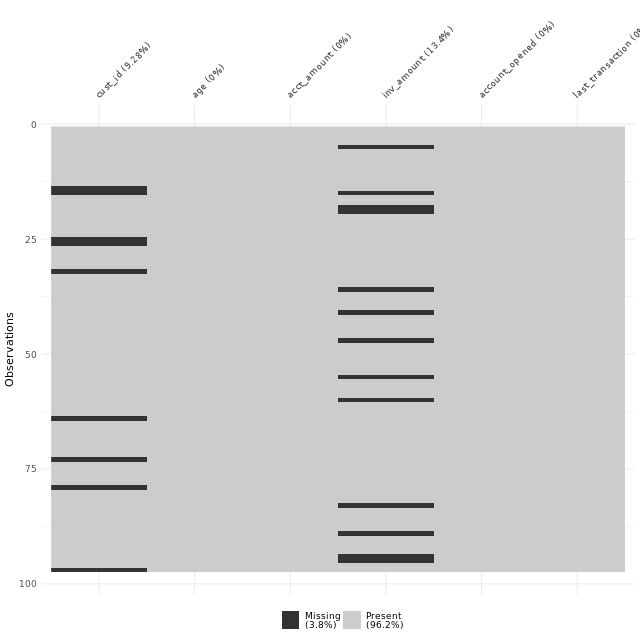
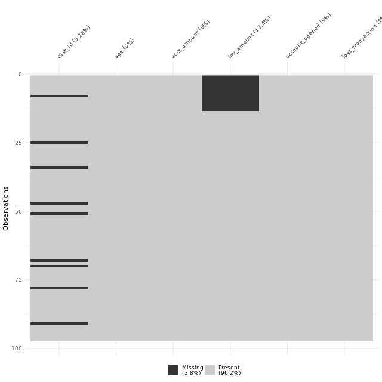

```{r setup, include=FALSE}
knitr::opts_chunk$set(echo = TRUE)
options(repos="https://CRAN.R-project.org")
```

## Data type constraints


**Converting data types**

Throughout this chapter, you'll be working with San Francisco bike share ride data called `bike_share_rides`. It contains information on start and end stations of each trip, the trip duration, and some user information.

Before beginning to analyze any dataset, it's important to take a look at the different types of columns you'll be working with, which you can do using `glimpse()`.

In this exercise, you'll take a look at the data types contained in `bike_share_rides` and see how an incorrect data type can flaw your analysis.

`dplyr` and `assertive` are loaded and `bike_share_rides` is available.

```{r}
library(dplyr)
library(assertive)

bike_share_rides <- readRDS("_data/bike_share_rides_ch1_1.rds")

# Glimpse at bike_share_rides
glimpse(bike_share_rides)

# Summary of user_birth_year
summary(bike_share_rides$user_birth_year)

# Convert user_birth_year to factor: user_birth_year_fct
bike_share_rides <- bike_share_rides %>%
  mutate(user_birth_year_fct = as.factor(user_birth_year))

# Assert user_birth_year_fct is a factor
assert_is_factor(bike_share_rides$user_birth_year_fct)

# Summary of user_birth_year_fct
summary(bike_share_rides$user_birth_year_fct)
```

Dapper data type dexterity! Looking at the new summary statistics, more riders were born in `1988` than any other year.

**Trimming strings**

In the previous exercise, you were able to identify the correct data type and convert `user_birth_year` to the correct type, allowing you to extract counts that gave you a bit more insight into the dataset.

Another common dirty data problem is having extra bits like percent signs or periods in numbers, causing them to be read in as `characters`. In order to be able to crunch these numbers, the extra bits need to be removed and the numbers need to be converted from `character` to `numeric`. In this exercise, you'll need to convert the `duration` column from `character` to `numeric`, but before this can happen, the word `"minutes"` needs to be removed from each value.

`dplyr`, `assertive`, and `stringr` are loaded and `bike_share_rides` is available.

```{r}
library(stringr)

bike_share_rides <- bike_share_rides %>%
  # Remove 'minutes' from duration: duration_trimmed
  mutate(duration_trimmed = str_remove(duration, "minutes"),
         # Convert duration_trimmed to numeric: duration_mins
         duration_mins = as.numeric(duration_trimmed))

# Glimpse at bike_share_rides
glimpse(bike_share_rides)

# Assert duration_mins is numeric
assert_is_numeric(bike_share_rides$duration_mins)

# Calculate mean duration
mean(bike_share_rides$duration_mins)
```

Great work! By removing characters and converting to a numeric type, you were able to figure out that the average ride duration is about 13 minutes - not bad for a city like San Francisco!

## Range constraints

**What's an out of range value?**

- SAT score: 400-1600
- package weight: at least 0 lb/kg
- adult heart rate: 60-100 beats per minute


**Handling out of range values**

- remove rows
- treat as missing (`NA`)
- replace with range limit
- replace with other value based on domain knowledge and/orknowledge of dataset


**Ride duration constraints**

Values that are out of range can throw off an analysis, so it's important to catch them early on. In this exercise, you'll be examining the `duration_min` column more closely. Bikes are not allowed to be kept out for `more than 24 hours`(https://help.baywheels.com/hc/en-us/articles/360033790932-How-long-can-I-keep-a-bike-out-), or 1440 minutes at a time, but issues with some of the bikes caused inaccurate recording of the time they were returned.

In this exercise, you'll replace erroneous data with the range limit (1440 minutes), however, you could just as easily replace these values with `NA`s.

`dplyr`, `assertive`, and `ggplot2` are loaded and `bike_share_rides` is available.

```{r}
library(ggplot2)

# Create breaks
breaks <- c(min(bike_share_rides$duration_mins), 0, 1440, max(bike_share_rides$duration_mins))

# Create a histogram of duration_min
ggplot(bike_share_rides, aes(duration_mins)) +
  geom_histogram(breaks = breaks)

# Create breaks
breaks <- c(min(bike_share_rides$duration_mins), 0, 1440, max(bike_share_rides$duration_mins))

# Create a histogram of duration_min
ggplot(bike_share_rides, aes(duration_mins)) +
  geom_histogram(breaks = breaks)

# duration_min_const: replace vals of duration_min > 1440 with 1440
bike_share_rides <- bike_share_rides %>%
  mutate(duration_min_const = replace(duration_mins, duration_mins > 1440, 1440))

# Make sure all values of duration_min_const are between 0 and 1440
assert_all_are_in_closed_range(bike_share_rides$duration_min_const, lower = 0, upper = 1440)
```

Radical replacing! The method of replacing erroneous data with the range limit works well, but you could just as easily replace these values with `NA`s or something else instead.

**Back to the future**

Something has gone wrong and it looks like you have data with dates from the future, which is way outside of the date range you expected to be working with. To fix this, you'll need to remove any rides from the dataset that have a `date` in the future. Before you can do this, the `date` column needs to be converted from a character to a `Date`. Having these as `Date` objects will make it much easier to figure out which rides are from the future, since R makes it easy to check if one `Date` object is before (`<`) or after (`>`) another.

`dplyr` and `assertive` are loaded and `bike_share_rides` is available.

```{r}
library(lubridate)

# Convert date to Date type
bike_share_rides <- bike_share_rides %>%
  mutate(date = as.Date(date))

# Make sure all dates are in the past
assert_all_are_in_past(bike_share_rides$date)

# Filter for rides that occurred before or on today's date
bike_share_rides_past <- bike_share_rides %>%
  filter(date <= today())

# Make sure all dates from bike_share_rides_past are in the past
assert_all_are_in_past(bike_share_rides_past$date)
```

Fabulous filtering! Handling data from the future like this is much easier than trying to verify the data's correctness by time traveling.

## Uniqueness constraints


**Full duplicates**

You've been notified that an update has been made to the bike sharing data pipeline to make it more efficient, but that duplicates are more likely to be generated as a result. To make sure that you can continue using the same scripts to run your weekly analyses about ride statistics, you'll need to ensure that any duplicates in the dataset are removed first.

When multiple rows of a data frame share the same values for all columns, they're `full duplicates` of each other. Removing duplicates like this is important, since having the same value repeated multiple times can alter summary statistics like the mean and median. Each ride, including its `ride_id` should be unique.

`dplyr` is loaded and `bike_share_rides` is available.

```{r}
# Count the number of full duplicates
sum(duplicated(bike_share_rides))

# Remove duplicates
bike_share_rides_unique <- distinct(bike_share_rides)

# Count the full duplicates in bike_share_rides_unique
sum(duplicated(bike_share_rides_unique))
```

Dazzling duplicate removal! Removing full duplicates will ensure that summary statistics aren't altered by repeated data points.

**Removing partial duplicates**

Now that you've identified and removed the full duplicates, it's time to check for partial duplicates. Partial duplicates are a bit tricker to deal with than full duplicates. In this exercise, you'll first identify any partial duplicates and then practice the most common technique to deal with them, which involves dropping all partial duplicates, keeping only the first.

`dplyr` is loaded and `bike_share_rides` is available.

```{r}
# Find duplicated ride_ids
bike_share_rides %>% 
  # Count the number of occurrences of each ride_id
  count(ride_id) %>% 
  # Filter for rows with a count > 1
  filter(n > 1)

# Remove full and partial duplicates
bike_share_rides_unique <- bike_share_rides %>%
  # Only based on ride_id instead of all cols
  distinct(ride_id, .keep_all = TRUE)

# Find duplicated ride_ids in bike_share_rides_unique
bike_share_rides_unique %>% 
  # Count the number of occurrences of each ride_id
  count(ride_id) %>% 
  # Filter for rows with a count > 1
  filter(n > 1)
```

Perfect partial duplicate removing! It's important to consider the data you're working with before removing partial duplicates, since sometimes it's expected that there will be partial duplicates in a dataset, such as if the same customer makes multiple purchases.

**Aggregating partial duplicates**

Another way of handling partial duplicates is to compute a summary statistic of the values that differ between partial duplicates, such as mean, median, maximum, or minimum. This can come in handy when you're not sure how your data was collected and want an average, or if based on domain knowledge, you'd rather have too high of an estimate than too low of an estimate (or vice versa).

`dplyr` is loaded and `bike_share_rides` is available.

```{r}
bike_share_rides %>%
  # Group by ride_id and date
  group_by(ride_id, date) %>%
  # Add duration_min_avg column
  mutate(duration_min_avg = mean(duration_mins)) %>%
  # Remove duplicates based on ride_id and date, keep all cols
  distinct(ride_id, date, .keep_all = TRUE) %>%
  # Remove duration_min column
  select(-duration_mins)
```

Awesome aggregation! Aggregation of partial duplicates allows you to keep some information about all data points instead of keeping information about just one data point.

## Checking membership


**Not a member**

Now that you've practiced identifying membership constraint problems, it's time to fix these problems in a new dataset. Throughout this chapter, you'll be working with a dataset called `sfo_survey`, containing survey responses from passengers taking flights from San Francisco International Airport (SFO). Participants were asked questions about the airport's cleanliness, wait times, safety, and their overall satisfaction.

There were a few issues during data collection that resulted in some inconsistencies in the dataset. In this exercise, you'll be working with the `dest_size` column, which categorizes the size of the destination airport that the passengers were flying to. A data frame called `dest_sizes` is available that contains all the possible destination sizes. Your mission is to find rows with invalid `dest_sizes` and remove them from the data frame.

`dplyr` has been loaded and `sfo_survey` and `dest_sizes` are available.

```{r}
sfo_survey <- readRDS("_data/sfo_survey_ch2_1.rds")
dest_size <- c("Small", "Medium", "Large", "Hub")
passengers_per_day <- c("0-20K", "20K-70K", "70K-100K", "100K+")
dest_sizes <- data.frame(cbind(dest_size, passengers_per_day))
dest_sizes$passengers_per_day <- as.factor(dest_sizes$passengers_per_day)

# Count the number of occurrences of dest_size
sfo_survey %>%
  count(dest_size)

# Find bad dest_size rows
sfo_survey %>% 
  # Join with dest_sizes data frame to get bad dest_size rows
  anti_join(dest_sizes) %>%
  # Select id, airline, destination, and dest_size cols
  select(id, airline, destination, dest_size)

# Remove bad dest_size rows
sfo_survey %>% 
  # Join with dest_sizes
  semi_join(dest_sizes) %>%
  # Count the number of each dest_size
  count(dest_size)
```

Great joining! Anti-joins can help you identify the rows that are causing issues, and semi-joins can remove the issue-causing rows. In the next lesson, you'll learn about other ways to deal with bad values so that you don't have to lose rows of data.

## Categorical data problems


**Identifying inconsistency**

In the video exercise, you learned about different kinds of inconsistencies that can occur within categories, making it look like a variable has more categories than it should.

In this exercise, you'll continue working with the `sfo_survey` dataset. You'll examine the `dest_size` column again as well as the `cleanliness` column and determine what kind of issues, if any, these two categorical variables face.

`dplyr` is loaded and `sfo_survey` is available.

```{r}
# Count dest_size
sfo_survey %>%
  count(dest_size)

# Count cleanliness
sfo_survey %>%
  count(cleanliness)
```

**Correcting inconsistency**

Now that you've identified that `dest_size` has whitespace inconsistencies and `cleanliness` has capitalization inconsistencies, you'll use the new tools at your disposal to fix the inconsistent values in `sfo_survey` instead of removing the data points entirely, which could add bias to your dataset if more than 5% of the data points need to be dropped.

`dplyr` and `stringr` are loaded and `sfo_survey` is available.

```{r}
# Add new columns to sfo_survey
sfo_survey <- sfo_survey %>%
  # dest_size_trimmed: dest_size without whitespace
  mutate(dest_size_trimmed = str_trim(dest_size),
         # cleanliness_lower: cleanliness converted to lowercase
         cleanliness_lower = str_to_lower(cleanliness))

# Count values of dest_size_trimmed
sfo_survey %>%
  count(dest_size_trimmed)

# Count values of cleanliness_lower
sfo_survey %>%
  count(cleanliness_lower)
```

Lovely lowercase conversion and terrific trimming! You were able to convert seven-category data into four-category data, which will help your analysis go more smoothly.

**Collapsing categories**

One of the tablets that participants filled out the `sfo_survey` on was not properly configured, allowing the response for `dest_region` to be free text instead of a dropdown menu. This resulted in some inconsistencies in the `dest_region` variable that you'll need to correct in this exercise to ensure that the numbers you report to your boss are as accurate as possible.

`dplyr` and `forcats` are loaded and `sfo_survey` is available.

```{r}
library(forcats)

# Count categories of dest_region
sfo_survey %>%
  count(dest_region)

# Categories to map to Europe
europe_categories <- c("EU", "eur", "Europ")

# Add a new col dest_region_collapsed
sfo_survey %>%
  # Map all categories in europe_categories to Europe
  mutate(dest_region_collapsed = fct_collapse(dest_region, 
                                              Europe = europe_categories)) %>%
  # Count categories of dest_region_collapsed
  count(dest_region_collapsed)
```

Clean collapsing! You've reduced the number of categories from 12 to 9, and you can now be confident that 401 of the survey participants were heading to Europe.

## Cleaning text data


**Detecting inconsistent text data**

You've recently received some news that the customer support team wants to ask the SFO survey participants some follow-up questions. However, the auto-dialer that the call center uses isn't able to parse all of the phone numbers since they're all in different formats. After some investigation, you found that some phone numbers are written with hyphens (`-`) and some are written with parentheses (`(`,`)`). In this exercise, you'll figure out which phone numbers have these issues so that you know which ones need fixing.

`dplyr` and `stringr` are loaded, and `sfo_survey` is available.

```
# Filter for rows with "-" in the phone column
sfo_survey %>%
  filter(str_detect(phone, "-"))
  
# Filter for rows with "(" or ")" in the phone column
sfo_survey %>%
  filter(str_detect(phone, fixed("(")) | str_detect(phone, fixed(")")))
```

Delightful detection! Now that you've identified the inconsistencies in the `phone` column, it's time to remove unnecessary characters to make the follow-up survey go as smoothly as possible.

**Replacing and removing**

In the last exercise, you saw that the `phone` column of `sfo_data` is plagued with unnecessary parentheses and hyphens. The customer support team has requested that all phone numbers be in the format `"123 456 7890"`. In this exercise, you'll use your new `stringr` skills to fulfill this request.

`dplyr` and `stringr` are loaded and `sfo_survey` is available.

```
# Remove parentheses from phone column
phone_no_parens <- sfo_survey$phone %>%
  # Remove "("s
  str_remove_all(fixed("(")) %>%
  # Remove ")"s
  str_remove_all(fixed(")"))
   
# Add phone_no_parens as column
sfo_survey %>%
  mutate(phone_no_parens = phone_no_parens)
  
# Add phone_no_parens as column
sfo_survey %>%
  mutate(phone_no_parens = phone_no_parens,
  # Replace all hyphens in phone_no_parens with spaces
         phone_clean = str_replace_all(phone_no_parens, "-", " "))
```

Radical replacing and removing! Now that your phone numbers are all in a single format, the machines in the call center will be able to auto-dial the numbers, making it easier to ask participants follow-up questions.

**Invalid phone numbers**

The customer support team is grateful for your work so far, but during their first day of calling participants, they ran into some phone numbers that were invalid. In this exercise, you'll remove any rows with invalid phone numbers so that these faulty numbers don't keep slowing the team down.

`dplyr` and `stringr` are loaded and `sfo_survey` is available.

```
# Check out the invalid numbers
sfo_survey %>%
  filter(str_length(phone) != 12)

# Remove rows with invalid numbers
sfo_survey %>%
  filter(str_length(phone) == 12) %>% nrow()
```
```
sfo_survey %>%
  filter(str_length(phone) != 12)
    id   airline          destination    phone
1 2262    UNITED          BAKERSFIELD   0244 5
2 3081      COPA          PANAMA CITY 925 8846
3  340 SOUTHWEST              PHOENIX     1623
4 1128     DELTA MINNEAPOLIS-ST. PAUL  665 803
5  373    ALASKA    SAN JOSE DEL CABO    38515
```
```
[1] 2804
```

Mission accomplished! Thanks to your savvy string skills, the follow-up survey will be done in no time!

## Uniformity


**Date uniformity**

In this chapter, you work at an asset management company and you'll be working with the `accounts` dataset, which contains information about each customer, the amount in their account, and the date their account was opened. Your boss has asked you to calculate some summary statistics about the average value of each account and whether the age of the account is associated with a higher or lower account value. Before you can do this, you need to make sure that the `accounts` dataset you've been given doesn't contain any uniformity problems. In this exercise, you'll investigate the `date_opened` column and clean it up so that all the dates are in the same format.

`dplyr` and `lubridate` are loaded and `accounts` is available.

```{r}
library(lubridate)
accounts <- readRDS("_data/ch3_1_accounts.rds")

# Check out the accounts data frame
head(accounts)

# Define the date formats
formats <- c("%Y-%m-%d", "%B %d, %Y")

# Convert dates to the same format
accounts <- accounts %>%
  mutate(date_opened_clean = parse_date_time(date_opened, orders = formats))

accounts
```

Cunning calendar cleaning! Now that the `date_opened` dates are in the same format, you'll be able to use them for some plotting in the next exercise.

**Currency uniformity**

Now that your dates are in order, you'll need to correct any unit differences. When you first plot the data, you'll notice that there's a group of very high values, and a group of relatively lower values. The bank has two different offices - one in New York, and one in Tokyo, so you suspect that the accounts managed by the Tokyo office are in Japanese yen instead of U.S. dollars. Luckily, you have a data frame called `account_offices` that indicates which office manages each customer's account, so you can use this information to figure out which totals need to be converted from yen to dollars.

The formula to convert yen to dollars is `USD = JPY / 104`.

`dplyr` and `ggplot2` are loaded and the accounts and `account_offices` data frames are available.

```{r}
office <- as.character(factor(c(1,1,2,2,1,2,2,2,2,1,1,1,1,2,1,2,2,1,1,2,2,2,1,1,1,2,1,1,1,1,1,2,2,2,1,2,1,1,2,1,2,1,1,2,1,1,2,2,1,2,2,2,1,1,1,2, 2,2,2,2,1,2,1,1,2,2,1,2,1,2,1,1,1,1,1,2,1,1,1,1,1,1,1,1,1,1,2,1,1,1,1,1,1,1,1,1,1,1), levels = c(1, 2), labels = c("New York", "Tokyo")))

account_offices <- data.frame(id = accounts$id, office)

# Scatter plot of opening date and total amount
accounts %>%
  ggplot(aes(x = date_opened_clean, y = total)) +
  geom_point()

# Left join accounts and account_offices by id
accounts %>%
  left_join(account_offices, by = "id") %>%
  # Convert totals from the Tokyo office to USD
  mutate(total_usd = ifelse(office == "Tokyo", total/104, total)) %>%
  # Scatter plot of opening date vs total_usd
  ggplot(aes(x = date_opened_clean, y = total_usd)) +
    geom_point()
```

Crafty currency conversion! The points in your last scatter plot all fall within a much smaller range now and you'll be able to accurately assess the differences between accounts from different countries.

## Cross field validation


**Validating totals**

In this lesson, you'll continue to work with the `accounts` data frame, but this time, you have a bit more information about each account. There are three different funds that account holders can store their money in. In this exercise, you'll validate whether the `total` amount in each account is equal to the sum of the amount in `fund_A`, `fund_B`, and `fund_C`. If there are any accounts that don't match up, you can look into them further to see what went wrong in the bookkeeping that led to inconsistencies.

`dplyr` is loaded and `accounts` is available.

```
# Find invalid totals
accounts %>%
  # theoretical_total: sum of the three funds
  mutate(theoretical_total = fund_A + fund_B + fund_C) %>%
  # Find accounts where total doesn't match theoretical_total
  filter(theoretical_total != total_usd)
```
```
     id date_opened  total fund_A fund_B fund_C acct_age theoretical_total
1 D5EB0F00  2001-04-16 130920  69487  48681  56408       19            174576
2 92C237C6  2005-12-13  85362  72556  21739  19537       15            113832
3 0E5B69F5  2018-05-07 134488  88475  44383  46475        2            179333
```

Great job! By using cross field validation, you've been able to detect values that don't make sense. How you choose to handle these values will depend on the dataset.

**Validating age**

Now that you found some inconsistencies in the `total` amounts, you're suspicious that there may also be inconsistencies in the `acct_age` column, and you want to see if these inconsistencies are related. Using the skills you learned from the video exercise, you'll need to validate the age of each account and see if rows with inconsistent `acct_age`s are the same ones that had inconsistent `total`s

`dplyr` and `lubridate` are loaded, and `accounts` is available.

```
# Find invalid acct_age
accounts %>%
  # theoretical_age: age of acct based on date_opened
  mutate(theoretical_age = floor(as.numeric(date_opened %--% today(), "years"))) %>%
  # Filter for rows where acct_age is different from theoretical_age
  filter(acct_age != theoretical_age)
```
```
       id date_opened  total fund_A fund_B fund_C acct_age theoretical_age
1 11C3C3C0  2017-12-24 180003  84295  31591  64117        1               2
2 EA7FF83A  2004-11-02 111526  86856  19406   5264       15              16
3 3627E08A  2008-04-01 238104  60475  89011  88618       11              12
```

Vigorous validating! There are three accounts that all have ages off by one year, but none of them are the same as the accounts that had `total` inconsistencies, so it looks like these two bookkeeping errors may not be related.

## Completeness


- it appears that missing ozone data happens more when temperatures are high


**Visualizing missing data**

Dealing with missing data is one of the most common tasks in data science. There are a variety of types of missingness, as well as a variety of types of solutions to missing data.

You just received a new version of the `accounts` data frame containing data on the amount held and amount invested for new and existing customers. However, there are rows with missing `inv_amount` values.

You know for a fact that most customers below 25 do not have investment accounts yet, and suspect it could be driving the missingness. The `dplyr` and `visdat` packages have been loaded and `accounts` is available.

```
# Visualize the missing values by column
vis_miss(accounts)
```

```
accounts %>%
  # missing_inv: Is inv_amount missing?
  mutate(missing_inv = is.na(inv_amount)) %>%
  # Group by missing_inv
  group_by(missing_inv) %>%
  # Calculate mean age for each missing_inv group
  summarize(avg_age = mean(age))
```
```
# A tibble: 97 x 8
# Groups:   missing_inv [2]
   cust_id   age acct_amount inv_amount account_opened last_transaction
   <fct>   <int>       <dbl>      <dbl> <fct>          <fct>           
 1 8C3554~    54      44245.     35500. 03-05-18       30-09-19        
 2 D55366~    36      86507.     81922. 21-01-18       14-01-19        
 3 A63198~    49      77799.     46412. 26-01-18       06-10-19        
 4 93F2F9~    56      93875.     76563. 21-08-17       10-07-19        
 5 DE0A08~    21      99998.        NA  05-06-17       15-01-19        
 6 25E68E~    47     109738.     93553. 26-12-17       12-11-18        
 7 3FA929~    53      79744.     70358. 21-06-18       24-08-18        
 8 984403~    29      17940.     14430. 07-10-17       18-05-18        
 9 870A92~    58      63523.     51297. 02-09-18       22-02-19        
10 166B05~    53      38175.     15053. 28-02-19       31-10-18        
# ... with 87 more rows, and 2 more variables: missing_inv <lgl>, avg_age <dbl>
```

Since the average age for `TRUE` `missing_inv` is 22 and the average age for `FALSE` missing_inv is 44, it is likely that the `inv_amount` variable is missing mostly in young customers.

```
# Sort by age and visualize missing vals
accounts %>%
  arrange(age) %>%
  vis_miss()
```


Fabulous visualizations! Investigating summary statistics based on missingness is a great way to determine if data is missing completely at random or missing at random.

**Treating missing data**

In this exercise, you're working with another version of the `accounts` data that contains missing values for both the `cust_id` and `acct_amount` columns.

You want to figure out how many unique customers the bank has, as well as the average amount held by customers. You know that rows with missing `cust_id` don't really help you, and that on average, the `acct_amount` is usually 5 times the amount of `inv_amount`.

In this exercise, you will drop rows of `accounts` with missing `cust_id`s, and impute missing values of `inv_amount` with some domain knowledge. `dplyr` and `assertive` are loaded and `accounts` is available.

```
# Create accounts_clean
accounts_clean <- accounts %>%
  # Filter to remove rows with missing cust_id
  filter(!is.na(cust_id)) %>%
  # Add new col acct_amount_filled with replaced NAs
  mutate(acct_amount_filled = ifelse(is.na(acct_amount), inv_amount * 5, acct_amount))

# Assert that cust_id has no missing vals
assert_all_are_not_na(accounts_clean$cust_id)

# Assert that acct_amount_filled has no missing vals
assert_all_are_not_na(accounts_clean$acct_amount_filled)
```

Great job! Since your assertions passed, there's no missing data left, and you can definitely *bank* on nailing your analysis!

## Comparing strings


**Types of edit distance**

- Damerau-Levenshtein
  - what you just learned
- Levenshtein
  - considers only substitution, insertion, and deletion
- LCS (Longest Common Subsequence)
  - considers only insertion and deletion
- Others
  - Jaro-Winkler
  - Jaccard
  
*Which is best?*


**Small distance, small difference**

In the video exercise, you learned that there are multiple ways to calculate how similar or different two strings are. Now you'll practice using the `stringdist` package to compute string distances using various methods. It's important to be familiar with different methods, as some methods work better on certain datasets, while others work better on other datasets.

The `stringdist` package has been loaded for you.

```{r}
library(stringdist)

# Calculate Damerau-Levenshtein distance
stringdist("las angelos", "los angeles", method = "dl")

# Calculate LCS distance
stringdist("las angelos", "los angeles", method = "lcs")

# Calculate Jaccard distance
stringdist("las angelos", "los angeles", method = "jaccard")
```

Superb `stringdist()` skills! In the next exercise, you'll use Damerau-Levenshtein distance to map typo-ridden cities to their true spellings.

**Fixing typos with string distance**

In this chapter, one of the datasets you'll be working with, `zagat`, is a set of restaurants in New York, Los Angeles, Atlanta, San Francisco, and Las Vegas. The data is from Zagat, a company that collects restaurant reviews, and includes the restaurant names, addresses, phone numbers, as well as other restaurant information.

The `city` column contains the name of the city that the restaurant is located in. However, there are a number of typos throughout the column. Your task is to map each `city` to one of the five correctly-spelled cities contained in the `cities` data frame.

`dplyr` and `fuzzyjoin` are loaded, and `zagat` and `cities` are available.

```{r}
library(fuzzyjoin)
zagat <- readRDS("_data/zagat.rds")
cities <- data.frame(city_actual = as.factor(c("new york", "los angeles", "atlanta", "san francisco", "las vegas")))

# Count the number of each city variation
zagat %>%
  count(city)

# Join zagat and cities and look at results
zagat %>%
  # Left join based on stringdist using city and city_actual cols
  stringdist_left_join(cities, by = c("city" = "city_actual")) %>%
  # Select the name, city, and city_actual cols
  select(name, city, city_actual)
```

Fabulous fixing! Now that you've created consistent spelling for each city, it will be much easier to compute summary statistics by city.

## Generating and comparing pairs


- this method does not scale, however to comparisons between large datasets


`lcs()` = longest common subsequence method/function


`default_comparator`s: `lcs()`, `jaccard()`, `jaro_winkler()`

**Pair blocking**

Zagat and Fodor's are both companies that gather restaurant reviews. The `zagat` and `fodors` datasets both contain information about various restaurants, including addresses, phone numbers, and cuisine types. Some restaurants appear in both datasets, but don't necessarily have the same exact name or phone number written down. In this chapter, you'll work towards figuring out which restaurants appear in both datasets.

The first step towards this goal is to generate pairs of records so that you can compare them. In this exercise, you'll first generate all possible pairs, and then use your newly-cleaned `city` column as a blocking variable.

`zagat` and `fodors` are available.

```{r}
fodors <- readRDS("_data/fodors.rds")
library(reclin)

# Generate all possible pairs
pair_blocking(zagat, fodors)

# Generate pairs with same city
pair_blocking(zagat, fodors, blocking_var = "city")
```

Perfect pairings! By using `city` as a blocking variable, you were able to reduce the number of pairs you'll need to compare from 165,230 pairs to 40,532.

**Comparing pairs**

Now that you've generated the pairs of restaurants, it's time to compare them. You can easily customize how you perform your comparisons using the `by` and `default_comparator` arguments. There's no right answer as to what each should be set to, so in this exercise, you'll try a couple options out.

`dplyr` and `reclin` are loaded and `zagat` and `fodors` are available.

```{r}
# Generate pairs
pair_blocking(zagat, fodors, blocking_var = "city") %>%
  # Compare pairs by name using lcs()
  compare_pairs(by = "name",
      default_comparator = lcs())

# Generate pairs
pair_blocking(zagat, fodors, blocking_var = "city") %>%
  # Compare pairs by name, phone, addr
  compare_pairs(by = c("name", "phone", "addr"),
      default_comparator = jaro_winkler())
```

Crafty comparisons! Choosing a comparator and the columns to compare is highly dataset-dependent, so it's best to try out different combinations to see which works best on the dataset you're working with. Next, you'll build on your string comparison skills and learn about record linkage!

## Scoring and linking


**Putting it together**

During this chapter, you've cleaned up the `city` column of `zagat` using string similarity, as well as generated and compared pairs of restaurants from `zagat` and `fodors`. The end is near - all that's left to do is score and select pairs and link the data together, and you'll be able to begin your analysis in no time!

reclin and `dplyr` are loaded and `zagat` and `fodors` are available.

```{r}
# Create pairs
pair_blocking(zagat, fodors, blocking_var = "city") %>%
  # Compare pairs
  compare_pairs(by = "name", default_comparator = jaro_winkler()) %>%
  # Score pairs
  score_problink()

# Create pairs
pair_blocking(zagat, fodors, blocking_var = "city") %>%
  # Compare pairs
  compare_pairs(by = "name", default_comparator = jaro_winkler()) %>%
  # Score pairs
  score_problink() %>%
  # Select pairs
  select_n_to_m()

# Create pairs
pair_blocking(zagat, fodors, blocking_var = "city") %>%
  # Compare pairs
  compare_pairs(by = "name", default_comparator = jaro_winkler()) %>%
  # Score pairs
  score_problink() %>%
  # Select pairs
  select_n_to_m() %>%
  # Link data 
  link()
```

Lovely linking! Now that your two datasets are merged, you can use the data to figure out if there are certain characteristics that make a restaurant more likely to be reviewed by Zagat or Fodor's.

## Congratulations!


