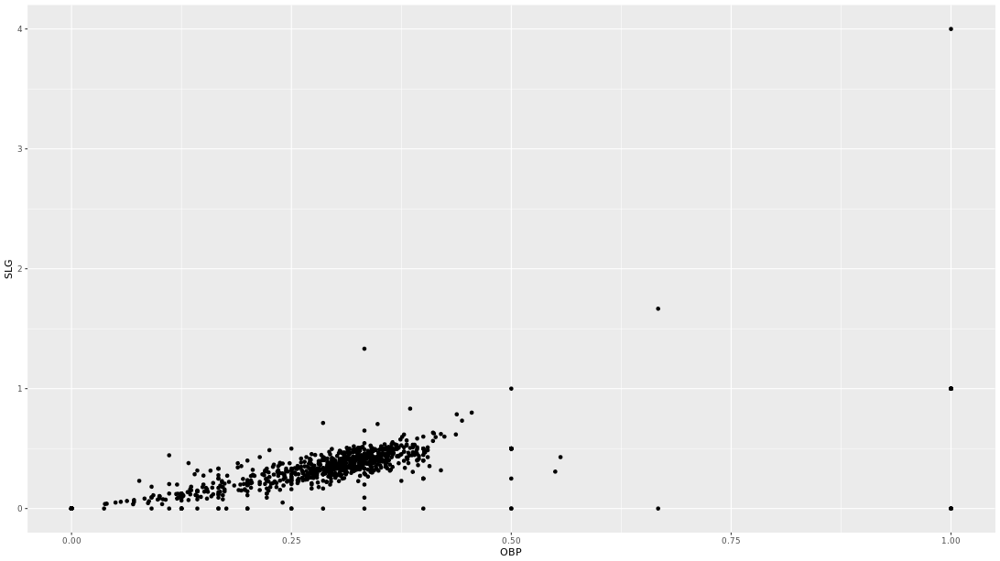
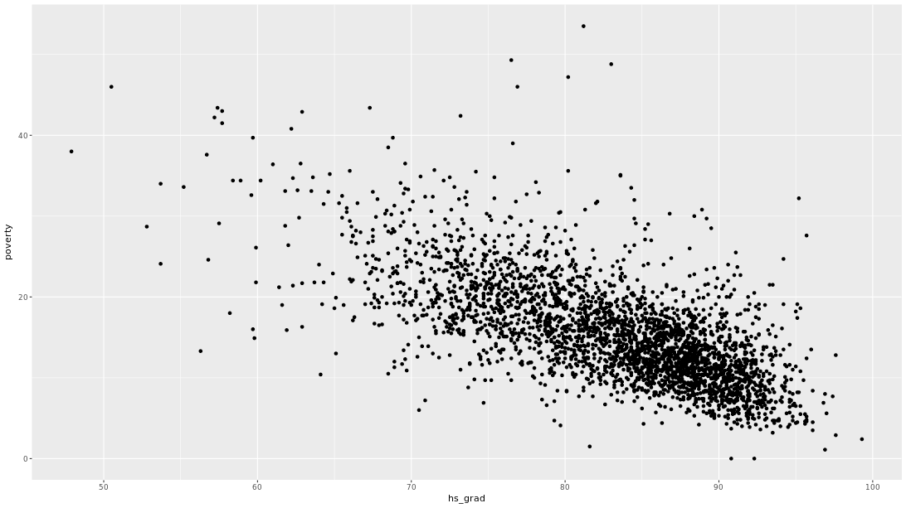
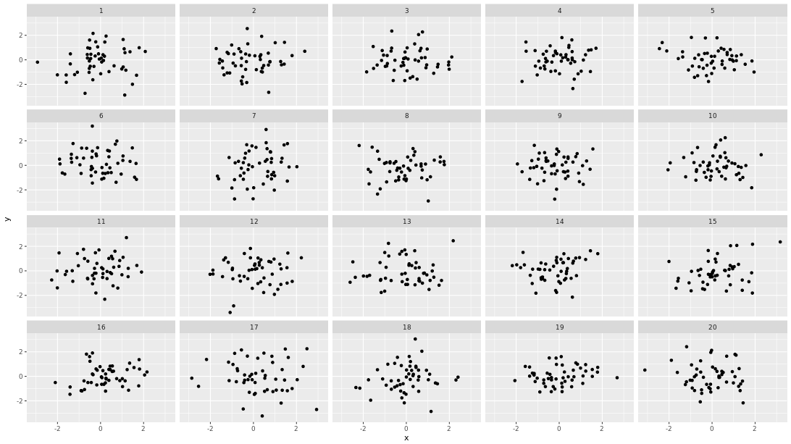
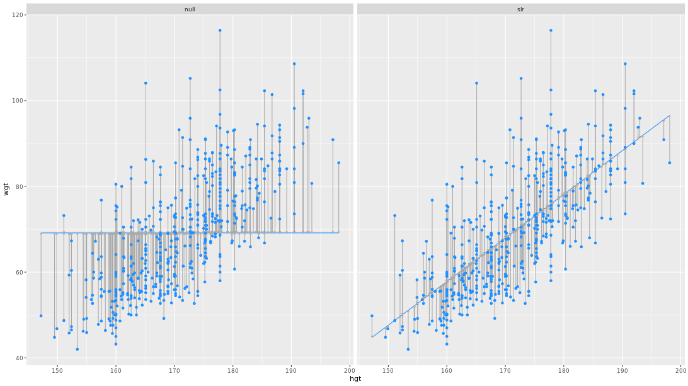
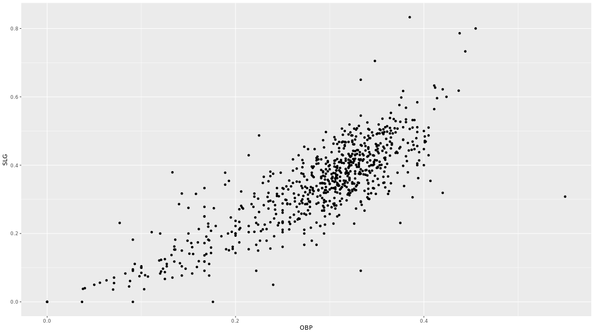

```{r setup, include=FALSE}
knitr::opts_chunk$set(echo = TRUE)
options(repos="https://CRAN.R-project.org")
```

## Visualizing bivariate relationships

**Bivariate relationships**

- both variables are numerical
- response variable
  - y, dependent
explanatory variable
  - something you think might be relate dto the response
  - x, independent, predictor


**Bivariate relationships**

- can think of boxplots as scatterplots...
  - ... but with discretized explanatory variable
- `cut()` function discretizes
  - choose appropriate number of "boxes"
  


**Scatterplots**

Scatterplots are the most common and effective tools for visualizing the relationship between two numeric variables.

The `ncbirths` dataset is a random sample of 1,000 cases taken from a larger dataset collected in 2004. Each case describes the birth of a single child born in North Carolina, along with various characteristics of the child (e.g. birth weight, length of gestation, etc.), the child's mother (e.g. age, weight gained during pregnancy, smoking habits, etc.) and the child's father (e.g. age). You can view the help file for these data by running `?ncbirths` in the console.

```{r}
library(openintro)
library(ggplot2)

# Scatterplot of weight vs. weeks
ggplot(data = ncbirths, aes(x = weeks, y = weight)) + 
  geom_point()
```

**Boxplots as discretized/conditioned scatterplots**

If it is helpful, you can think of boxplots as scatterplots for which the variable on the x-axis has been discretized.

The `cut()` function takes two arguments: the continuous variable you want to discretize and the number of `breaks` that you want to make in that continuous variable in order to discretize it.

```{r}
# Boxplot of weight vs. weeks
ggplot(data = ncbirths, 
       aes(x = cut(weeks, breaks = 5), y = weight)) + 
  geom_boxplot()
```

Great! Note how the relationship no longer seems linear.

## Characterizing bivariate relationships

- form (e.g. linear, quadratic, non-linear)
- direction (e.g. positive, negative)
- strength (how much scatter/noise?)
- outliers

**Creating scatterplots**

Creating scatterplots is simple and they are so useful that it is worthwhile to expose yourself to many examples. Over time, you will gain familiarity with the types of patterns that you see. You will begin to recognize how scatterplots can reveal the nature of the relationship between two variables.

In this exercise, and throughout this chapter, we will be using several datasets listed below. These data are available through the `openintro` package. Briefly:

- The `mammals` dataset contains information about 39 different species of mammals, including their body weight, brain weight, gestation time, and a few other variables.
- The `mlbBat10` dataset contains batting statistics for 1,199 Major League Baseball players during the 2010 season.
- The `bdims` dataset contains body girth and skeletal diameter measurements for 507 physically active individuals.
- The `smoking` dataset contains information on the smoking habits of 1,691 citizens of the United Kingdom.

To see more thorough documentation, use the `?` or `help()` functions.

```{r}
# Mammals scatterplot
ggplot(mammals, aes(y = brain_wt, x = body_wt)) +
    geom_point()

# Baseball player scatterplot
ggplot(mlbbat10, aes(y = slg, x = obp)) +
    geom_point()

# Body dimensions scatterplot
ggplot(bdims, aes(y = wgt, x = hgt, color = factor(sex))) +
    geom_point()

# Smoking scatterplot
ggplot(smoking, aes(y = amt_weekdays, x = age)) +
    geom_point()
```

**Transformations**

The relationship between two variables may not be linear. In these cases we can sometimes see strange and even inscrutable patterns in a scatterplot of the data. Sometimes there really is no meaningful relationship between the two variables. Other times, a careful *transformation* of one or both of the variables can reveal a clear relationship.

Recall the bizarre pattern that you saw in the scatterplot between brain weight and body weight among mammals in a previous exercise. Can we use transformations to clarify this relationship?

`ggplot2` provides several different mechanisms for viewing transformed relationships. The `coord_trans()` function transforms the coordinates of the plot. Alternatively, the `scale_x_log10()` and `scale_y_log10()` functions perform a base-10 log transformation of each axis. Note the differences in the appearance of the axes.

The `mammals` dataset is available in your workspace.

```{r}
# Scatterplot with coord_trans()
ggplot(data = mammals, aes(x = body_wt, y = brain_wt)) +
  geom_point() + 
  coord_trans(x = "log10", y = "log10")

# Scatterplot with scale_x_log10() and scale_y_log10()
ggplot(data = mammals, aes(x = body_wt, y = brain_wt)) +
  geom_point() +
  scale_x_log10() + 
  scale_y_log10()
```

## Outliers

**Identifying outliers**

In Chapter 5, we will discuss how outliers can affect the results of a linear regression model and how we can deal with them. For now, it is enough to simply identify them and note how the relationship between two variables may change as a result of removing outliers.

Recall that in the baseball example earlier in the chapter, most of the points were clustered in the lower left corner of the plot, making it difficult to see the general pattern of the majority of the data. This difficulty was caused by a few outlying players whose on-base percentages (OBPs) were exceptionally high. These values are present in our dataset only because these players had very few batting opportunities.

Both OBP and SLG are known as *rate* statistics, since they measure the frequency of certain events (as opposed to their *count*). In order to compare these rates sensibly, it makes sense to include only players with a reasonable number of opportunities, so that these observed rates have the chance to approach their long-run frequencies.

In Major League Baseball, batters qualify for the batting title only if they have 3.1 plate appearances per game. This translates into roughly 502 plate appearances in a 162-game season. The `mlbBat10` dataset does not include plate appearances as a variable, but we can use at-bats (`AB`) -- which constitute a subset of plate appearances -- as a proxy.



```{r}
library(dplyr)

# Filter for AB greater than or equal to 200
ab_gt_200 <- mlbbat10 %>% 
  filter(at_bat >= 200)

# Scatterplot of SLG vs. OBP
ggplot(ab_gt_200, aes(x = obp, y = slg)) +
  geom_point()

# Identify the outlying player
ab_gt_200 %>%
  filter(obp < 0.2)
```

## Quantifying the strength of bivariate relationships

**Correlation**

- correlation coefficient between -1 and 1
- sign -> direction
- magnitude -> strength


**Computing correlation**

The `cor(x, y)` function will compute the Pearson product-moment correlation between variables, `x` and` y`. Since this quantity is symmetric with respect to `x` and `y`, it doesn't matter in which order you put the variables.

At the same time, the `cor()` function is very conservative when it encounters missing data (e.g. `NA`s). The `use` argument allows you to override the default behavior of returning `NA` whenever any of the values encountered is `NA`. Setting the `use` argument to `"pairwise.complete.obs"` allows `cor()` to compute the correlation coefficient for those observations where the values of `x` and `y` are both not missing.

```{r}
# Compute correlation
ncbirths %>%
  summarize(N = n(), r = cor(weight, mage))

# Compute correlation for all non-missing pairs
ncbirths %>%
  summarize(N = n(), r = cor(weight, weeks, use = "pairwise.complete.obs"))
```

## The Anscombe dataset


- same correlation coefficient in all four datasets

**Exploring Anscombe**

In 1973, Francis Anscombe famously created four datasets with remarkably similar numerical properties, but obviously different graphic relationships. The `Anscombe` dataset contains the `x` and `y` coordinates for these four datasets, along with a grouping variable, `set`, that distinguishes the quartet.

It may be helpful to remind yourself of the graphic relationship by viewing the four scatterplots:

```
ggplot(data = Anscombe, aes(x = x, y = y)) +
  geom_point() +
  facet_wrap(~ set)
```

```{r}
library(tidyr)
library(datasets)

anscombe <- datasets::anscombe
anscombe

Anscombe <- anscombe %>%
  pivot_longer(cols = everything(),
    names_to = c(".value", "set"),
    names_pattern = "(.)(.)") #regex indicates that the names and values are separated by two characters
                              #more explicitly, "([a-z])([1-9])" indicates The first thing is a character, the second thing is a number
Anscombe

# Compute properties of Anscombe
Anscombe %>%
  group_by(set) %>%
  summarize(
    N = n(), 
    mean_of_x = mean(x), 
    std_dev_of_x = sd(x), 
    mean_of_y = mean(y), 
    std_dev_of_y = sd(y), 
    correlation_between_x_and_y = cor(x, y)
  )
```

Great work! Note that all of the measures are identical (ignoring rounding error) across the four different sets.

**Perception of correlation (2)**

Estimating the value of the correlation coefficient between two quantities from their scatterplot can be tricky. [Statisticians have shown that](https://statistics.stanford.edu/sites/default/files/EFS%20NSF%20206.pdf) people's perception of the strength of these relationships can be influenced by design choices like the x and y scales.

Nevertheless, with some practice your perception of correlation will improve. Toggle through the four scatterplots in the plotting window, each of which you've seen in a previous exercise. Jot down your best estimate of the value of the correlation coefficient between each pair of variables. Then, compare these values to the actual values you compute in this exercise.

If you're having trouble recalling variable names, it may help to preview a dataset in the console with `str()` or `glimpse()`.

```{r}
# Baseball player scatterplot
ggplot(mlbbat10, aes(y = slg, x = obp)) +
    geom_point()
# Correlation for all baseball players
mlbbat10 %>%
  summarize(N = n(), r = cor(obp, slg))

# Run this and look at the plot
mlbbat10 %>% 
    filter(at_bat > 200) %>%
    ggplot(aes(x = obp, y = slg)) + 
    geom_point()
# Correlation for all players with at least 200 ABs
mlbbat10 %>%
  filter(at_bat >= 200) %>%
  summarize(N = n(), r = cor(obp, slg))

# Body dimensions scatterplot
ggplot(bdims, aes(y = wgt, x = hgt, color = factor(sex))) +
    geom_point()
# Correlation of body dimensions
bdims %>%
  group_by(sex) %>%
  summarize(N = n(), r = cor(hgt, wgt))

# Mammals scatterplot
ggplot(mammals, aes(y = brain_wt, x = body_wt)) +
    geom_point()
# Correlation among mammals, with and without log
mammals %>%
  summarize(N = n(), 
            r = cor(body_wt, brain_wt), 
            r_log = cor(log(body_wt), log(brain_wt)))

```

## Interpretation of Correlation


correlation does not imply causation

**Interpreting correlation in context**

Recall that you previously determined the value of the correlation coefficient between the poverty rate of counties in the United States and the high school graduation rate in those counties was -0.681. The correct interpretation of this value is after the scatterplot shown below.



Counties with lower high school graduation rates are likely to have higher poverty rates.

## Spurious correlations


**Spurious correlation in random data**

Statisticians must always be skeptical of potentially spurious correlations. Human beings are very good at seeing patterns in data, sometimes when the patterns themselves are actually just random noise. To illustrate how easy it can be to fall into this trap, we will look for patterns in truly random data.

The `noise` dataset contains 20 sets of `x` and `y` variables drawn at random from a standard normal distribution. Each set, denoted as `z`, has 50 observations of `x`, `y` pairs. Do you see any pairs of variables that might be meaningfully correlated? Are all of the correlation coefficients close to zero?

```
# Create faceted scatterplot
ggplot(data = noise, aes(x = x, y = y)) +
  geom_point() + 
  facet_wrap(~ z)
```

```
# Compute correlations for each dataset
noise_summary <- noise %>%
  group_by(z) %>%
  summarize(N = n(), spurious_cor = cor(x, y))

# Isolate sets with correlations above 0.2 in absolute strength
noise_summary %>%
  filter(abs(spurious_cor) > 0.2)
```
```
# A tibble: 3 x 3
      z     N spurious_cor
  <int> <int>        <dbl>
1     7    50        0.240
2    15    50        0.309
3    16    50        0.218
```

## Visualization of Linear Models

**The "best fit" line**

The simple linear regression model for a numeric response as a function of a numeric explanatory variable can be visualized on the corresponding scatterplot by a straight line. This is a "best fit" line that cuts through the data in a way that minimizes the distance between the line and the data points.

We might consider linear regression to be a specific example of a larger class of *smooth* models. The `geom_smooth()` function allows you to draw such models over a scatterplot of the data itself. This technique is known as visualizing the model *in the data space*. The `method` argument to `geom_smooth()` allows you to specify what class of smooth model you want to see. Since we are exploring linear models, we'll set this argument to the value `"lm"`.

Note that `geom_smooth()` also takes an `se` argument that controls the standard error, which we will ignore for now.

```{r}
# Scatterplot with regression line
ggplot(data = bdims, aes(x = hgt, y = wgt)) + 
  geom_point() + 
  geom_smooth(method = "lm", se = FALSE)
```

**Uniqueness of least squares regression line**

The least squares criterion implies that the slope of the regression line is unique. In practice, the slope is computed by R. In this exercise, you will experiment with trying to find the optimal value for the regression slope for weight as a function of height in the `bdims` dataset via trial-and-error.

To help, we've built a custom function for you called `add_line()`, which takes a single argument: the proposed slope coefficient.

```{r}
add_line <- function(my_slope) {
  bdims_summary <- bdims %>%
    summarize(N = n(), r = cor(hgt, wgt),
              mean_hgt = mean(hgt), mean_wgt = mean(wgt),
              sd_hgt = sd(hgt), sd_wgt = sd(wgt)) %>%
    mutate(true_slope = r * sd_wgt / sd_hgt, 
           true_intercept = mean_wgt - true_slope * mean_hgt)
    p <- ggplot(data = bdims, aes(x = hgt, y = wgt)) + 
    geom_point() + 
    geom_point(data = bdims_summary, 
               aes(x = mean_hgt, y = mean_wgt), 
               color = "red", size = 3)
  
  my_data <- bdims_summary %>%
    mutate(my_slope = my_slope, 
           my_intercept = mean_wgt - my_slope * mean_hgt)
  p + geom_abline(data = my_data, 
                  aes(intercept = my_intercept, slope = my_slope), color = "dodgerblue")
}

# Estimate optimal value of my_slope
add_line(my_slope = 1)
add_line(my_slope = .75)
add_line(my_slope = 1.25)
```

## Understanding Linear Models

**Generic statistical model**

$response = f(explanatory) + noise$

**Generic linear model**

$response = intercept + (slope * explanatory) + noise$

**Regression model**

$Y = \beta_0 + \beta_1 \cdot X + \epsilon, \quad \epsilon ~ N(0, \sigma_c)$

**Fitted values**

$\hat{Y} = \hat{\beta}_0 + \hat{\beta}_1 \cdot X \quad \text{ where } \hat{} \text{ indicates estimated values}$

**Residuals**

$e = Y - \hat{Y}$

**Fitting procedure**

- $\text{given } n \text{ observations of pairs } (x_i, y_i)...$
- $\text{find } \hat{\beta}_1 , \hat{\beta}_2 \text{ that minimize } \sum^n_{i=1} e_i^2$

**Least squares**

- easy, deterministic, unique solution
- residuals sum to zero
- line must pass through $(\bar{x}, \bar{y})$
- other criteria exist, just not in this course

**Key concepts**

- $\hat{Y}$ is expected value given corresponding $X$
- $\hat{\beta}$ are estimates of true, unknown data
- Residuals (e's) are estimates of true, unknown $\epsilon$'s
- "error" may be a misleading term - better: noise

**Fitting a linear model "by hand"**

Recall the simple linear regression model:

$Y = b_0 + b_1 \cdot X$

Two facts enable you to compute the slope $b_1$ and intercept $b_0$
of a simple linear regression model from some basic summary statistics.

First, the slope can be defined as:

$b_1 = r_{X,Y} \cdot \frac{s_Y}{s_X}$

where $r_{X,Y}$  represents the correlation (`cor()`) of $X$ and $Y$ and 
$s_X$ and $s_Y$ represent the standard deviation (`sd()`) of $X$ and $Y$, respectively.

Second, the point $(\bar{x},\bar{y})$ is always on the least squares regression line, where 
$\bar{x}$ and $\bar{y}$ denote the average of $x$ and $y$, respectively.

The `bdims_summary` data frame contains all of the information you need to compute the slope and intercept of the least squares regression line for body weight ($Y$) as a function of height ($X$). You might need to do some algebra to solve for 
$b_0$!

```{r}
bdims_summary <- bdims %>%
    summarize(N = n(), r = cor(hgt, wgt),
              mean_hgt = mean(hgt), mean_wgt = mean(wgt),
              sd_hgt = sd(hgt), sd_wgt = sd(wgt))

# Print bdims_summary
bdims_summary

# Add slope and intercept
bdims_summary %>%
  mutate(slope = r * sd_wgt / sd_hgt, 
         intercept = mean_wgt - slope * mean_hgt)
```

## Regression vs. regression to the mean

**Heredity**

- Galton's "regression to the mean"
- thought experiment: consider the heights of the children of NBA players


- while tall father's are likely to have tall sons. the sons are not likely to be as tall as their fathers
  - dotted line indicates son's as tall as their fathers
  - blue line indicates regression line which shows that son's are not likely to be as tall as fathers
  - i.e. son's height regressed towards the mean height.

**Regression modeling**

- "Regression": techniques for modeling a quantitative response
- types of regression models
  - least squares
  - weighted
  - generalized
  - nonparametric
  - ridge
  - Bayesian
  - ...
  
**Regression to the mean**

*Regression to the mean* is a concept attributed to Sir Francis Galton. The basic idea is that extreme random observations will tend to be less extreme upon a second trial. This is simply due to chance alone. While "regression to the mean" and "linear regression" are not the same thing, we will examine them together in this exercise.

One way to see the effects of regression to the mean is to compare the heights of parents to their children's heights. While it is true that tall mothers and fathers tend to have tall children, those children tend to be less tall than their parents, relative to average. That is, fathers who are 3 inches taller than the average father tend to have children who may be taller than average, but by less than 3 inches.

The `Galton_men` and `Galton_women` datasets contain data originally collected by Galton himself in the 1880s on the heights of men and women, respectively, along with their parents' heights.

Compare the slope of the regression line to the slope of the diagonal line. What does this tell you?  

```{r}
library(mosaicData)

Galton_men <- Galton %>% filter(sex == 'M')
Galton_women <- Galton %>% filter(sex == 'F')

# Height of children vs. height of father
ggplot(data = Galton_men, aes(x = father, y = height)) +
  geom_point() + 
  geom_abline(slope = 1, intercept = 0) + 
  geom_smooth(method = "lm", se = FALSE)

# Height of children vs. height of mother
ggplot(data = Galton_women, aes(x = mother, y = height)) +
  geom_point() + 
  geom_abline(slope = 1, intercept = 0) + 
  geom_smooth(method = "lm", se = FALSE)
```

Excellent! Because the slope of the regression line is smaller than 1 (the slope of the diagonal line) for both males and females, we can verify Sir Francis Galton's *regression to the mean* concept!

## Interpretation of Regression


**Interpretation**: for every \$1 Amazon charges for its new textbooks, UCLA charges \$1.19

**Interpretation of coefficients**

Recall that the fitted model for the poverty rate of U.S. counties as a function of high school graduation rate is:

$\hat{poverty} = 64.594 - 0.591 \cdot hs\_grad$

**Q**: What is the correct interpretation of the slope coefficient?

**A**: Among U.S. counties, each additional percentage point increase in the high school graduation rate is associated
       with about a 0.591 percentage point decrease in the poverty rate.

**Fitting simple linear models**

While the `geom_smooth(method = "lm")` function is useful for drawing linear models on a scatterplot, it doesn't actually return the characteristics of the model. As suggested by that syntax, however, the function that creates linear models is `lm()`. This function generally takes two arguments:

- A `formula` that specifies the model
- A `data` argument for the data frame that contains the data you want to use to fit the model

The `lm()` function return a model object having class `"lm"`. This object contains lots of information about your regression model, including the data used to fit the model, the specification of the model, the fitted values and residuals, etc.

```{r}
# Linear model for weight as a function of height
lm(wgt ~ hgt, data = bdims)

# Linear model for SLG as a function of OBP
lm(slg ~ obp, data = mlbbat10)

# Log-linear model for body weight as a function of brain weight
lm(log(body_wt) ~ log(brain_wt), data = mammals)
```

## Your linear model object


**The lm summary output**

An `"lm"` object contains a host of information about the regression model that you fit. There are various ways of extracting different pieces of information.

The `coef()` function displays only the values of the coefficients. Conversely, the `summary()` function displays not only that information, but a bunch of other information, including the associated standard error and p-value for each coefficient, the $R^2$, adjusted $R^2$, and the residual standard error. The summary of an `"lm"` object in R is very similar to the output you would see in other statistical computing environments (e.g. Stata, SPSS, etc.)

```{r}
mod <- lm(wgt ~ hgt, data = bdims)

# Show the coefficients
coef(mod)

# Show the full output
summary(mod)
```

**Fitted values and residuals**
Once you have fit a regression model, you are often interested in the fitted values ($\hat{y}_i$) and the residuals ($e_i$), where $i$ indexes the observations. Recall that:

$e_i = y_i - \hat{y}_i$

The least squares fitting procedure guarantees that the mean of the residuals is zero (n.b., numerical instability may result in the computed values not being *exactly* zero). At the same time, the mean of the fitted values must equal the mean of the response variable.

In this exercise, we will confirm these two mathematical facts by accessing the fitted values and residuals with the `fitted.values()` and `residuals()` functions, respectively, for the following model:

```{r, eval=FALSE} 
mod <- lm(wgt ~ hgt, data = bdims)
```

```{r}
# Mean of weights equal to mean of fitted values?
mean(bdims$wgt) == mean(fitted.values(mod))

# Mean of the residuals
mean(residuals(mod))
```

Great! You have verified both facts.

**Tidying your linear model**

As you fit a regression model, there are some quantities (e.g. $R^2$) that apply to the model as a whole, while others apply to each observation (e.g. $\hat{y}_i$). If there are several of these per-observation quantities, it is sometimes convenient to attach them to the original data as new variables.

The `augment()` function from the `broom` package does exactly this. It takes a model object as an argument and returns a data frame that contains the data on which the model was fit, along with several quantities specific to the regression model, including the fitted values, residuals, leverage scores, and standardized residuals.

```{r}
# Load broom
library(broom)

# Create bdims_tidy
bdims_tidy <- augment(mod)

# Glimpse the resulting data frame
glimpse(bdims_tidy)
```

## Using your linear model


**Making predictions**

The `fitted.values()` function or the `augment()`-ed data frame provides us with the fitted values for the observations that were in the original data. However, once we have fit the model, we may want to compute expected values for observations that were **not** present in the data on which the model was fit. These types of predictions are called *out-of-sample*.

The `ben` data frame contains a height and weight observation for one person. The `mod` object contains the fitted model for weight as a function of height for the observations in the `bdims` dataset. We can use the `predict()` function to generate expected values for the weight of new individuals. We must pass the data frame of new observations through the `newdata` argument.

```{r}
ben <- data.frame(wgt = 74.8, hgt = 182.8)

# Print ben
ben

# Predict the weight of ben
predict(mod, newdata = ben)
```

Great work! Note that the data frame `ben` has variables with the *exact* same names as those in the fitted model.

**Adding a regression line to a plot manually**

The `geom_smooth()` function makes it easy to add a simple linear regression line to a scatterplot of the corresponding variables. And in fact, there are more complicated regression models that can be visualized in the data space with `geom_smooth()`. However, there may still be times when we will want to add regression lines to our scatterplot manually. To do this, we will use the `geom_abline()` function, which takes `slope` and `intercept` arguments. Naturally, we have to compute those values ahead of time, but we already saw how to do this (e.g. using `coef()`).

The `coefs` data frame contains the model estimates retrieved from `coef()`. Passing this to `geom_abline()` as the `data` argument will enable you to draw a straight line on your scatterplot.

```{r}
# Add the line to the scatterplot
ggplot(data = bdims, aes(x = hgt, y = wgt)) + 
  geom_point() + 
  geom_abline(data = mod, 
              aes(intercept = mod$coefficients[[1]], slope = mod$coefficients[[2]]),  
              color = "dodgerblue")
```

## Assessing Model Fit


**RMSE**

$RMSE= \sqrt{\frac{\sum_ie^2_i}{d.f}} = \sqrt{\frac{SSE}{n-2}}$


**RMSE**

The residual standard error reported for the regression model for poverty rate of U.S. counties in terms of high school graduation rate is 4.67. This means that the typical difference between the observed poverty rate and the poverty rate predicted by the model is about 4.67 percentage points.

**Standard error of residuals**

One way to assess strength of fit is to consider how far off the model is for a typical case. That is, for some observations, the fitted value will be very close to the actual value, while for others it will not. The magnitude of a typical residual can give us a sense of generally how close our estimates are.

However, recall that some of the residuals are positive, while others are negative. In fact, it is guaranteed by the least squares fitting procedure that the mean of the residuals is zero. Thus, it makes more sense to compute the square root of the mean squared residual, or *root mean squared error* ($RMSE$). R calls this quantity the *residual standard error*.

To make this estimate unbiased, you have to divide the sum of the squared residuals by the degrees of freedom in the model. Thus,

$RMSE= \sqrt{\frac{\sum_ie^2_i}{d.f}} = \sqrt{\frac{SSE}{n-2}}$ 
 
You can recover the residuals from `mod` with `residuals()`, and the degrees of freedom with `df.residual()`.

```{r}
# View summary of model
summary(mod)

# Compute the mean of the residuals
mean(residuals(mod))

# Compute RMSE
sqrt(sum(residuals(mod)^2) / df.residual(mod))
```

## Comparing model fits

**Null (average) model**

$\hat{y} = \bar{y}$


**Coefficient of determination**

$R^2 = 1 - \frac{SSE}{SST} = 1 - \frac{Var(e)}{Var(y)}$

SST (Sum or Squares Total) is the SSE for the null model

The proportion of variability in our response variable that is explained by our model

**Connection to correlation**

- for simple linear regression

$r^2_{x,y} = R^2$


**Assessing simple linear model fit**

Recall that the coefficient of determination ($R^2$), can be computed as

$R^2 = 1 - \frac{SSE}{SST} = 1 - \frac{Var(e)}{Var(y)}$
 
where $e$ is the vector of residuals and $y$ is the response variable. This gives us the interpretation of $R^2$ as the percentage of the variability in the response that is explained by the model, since the residuals are the part of that variability that remains unexplained by the model.

```{r}
# View model summary
summary(mod)

# Compute R-squared
bdims_tidy %>%
  summarize(var_y = var(wgt), var_e = var(.resid)) %>%
  mutate(R_squared = 1 - var_e / var_y)
```

Great work! This means that 51.4% of the variability in weight is explained by height.

**Interpretation of R^2**

The $R^2$ reported for the regression model for poverty rate of U.S. counties in terms of high school graduation rate is 0.464.

```
lm(formula = poverty ~ hs_grad, data = countyComplete) %>%
  summary()
```

This is interpreted as: 46.4% of the variability in poverty rate among U.S. counties can be explained by high school graduation rate.

**Linear vs. average**

The $R^2$ gives us a numerical measurement of the strength of fit relative to a null model based on the average of the response variable:

$\hat{y}_{null} = \bar{y}$

This model has an $R^2$ of zero because $SSE = SST$. That is, since the fitted values ($\hat{y}_{null}$) are all equal to the average ($\bar{y}$), the residual for each observation is the distance between that observation and the mean of the response. Since we can always fit the null model, it serves as a baseline against which all other models will be compared.

In the graphic, we visualize the residuals for the null model (`mod_null` at left) vs. the simple linear regression model (`mod_hgt` at right) with height as a single explanatory variable. Try to convince yourself that, if you squared the lengths of the grey arrows on the left and summed them up, you would get a larger value than if you performed the same operation on the grey arrows on the right.

It may be useful to preview these `augment()`-ed data frames with `glimpse()`:

```
glimpse(mod_null)
glimpse(mod_hgt)
```



```{r}
mod_hgt <- bdims_tidy

mod_null <- augment(lm(wgt ~ 1, data = bdims))

# Compute SSE for null model
mod_null %>%
  summarize(SSE = sum(.resid^2))

# Compute SSE for regression model
mod_hgt %>%
  summarize(SSE = sum(.resid^2))
```

## Unusual Points

**Leverage**

$h_i = \frac{1}{h} + \frac{(x_i-\bar{x})^2}{\sum^n_{i=1}(x_i-\bar{x})^2}$

- a function of the distance between the value of the explanatory variable and the mean of the explanatory variable
  - higher leverage is higher distance
  - lower leverage is lower distance


Combination of high leverage, plus high residual, determine influence


**Leverage**

The *leverage* of an observation in a regression model is defined entirely in terms of the distance of that observation from the mean of the explanatory variable. That is, observations close to the mean of the explanatory variable have low leverage, while observations far from the mean of the explanatory variable have high leverage. Points of high leverage may or may not be influential.

The `augment()` function from the `broom` package will add the leverage scores (`.hat`) to a model data frame.



```{r}
mod_baseball <- lm(slg ~ obp, data = mlbbat10)

# Rank points of high leverage
mod_baseball %>%
  augment() %>%
  arrange(desc(.hat)) %>%
  head()
```

**Influence**

As noted previously, observations of high leverage may or may not be *influential*. The influence of an observation depends not only on its leverage, but also on the magnitude of its residual. Recall that while leverage only takes into account the explanatory variable ($x$), the residual depends on the response variable ($y$) and the fitted value ($\hat{y}$).

Influential points are likely to have high leverage and deviate from the general relationship between the two variables. We measure influence using Cook's distance, which incorporates both the leverage and residual of each observation.

```{r}
# Rank influential points
mod_baseball %>%
  augment() %>%
  arrange(desc(.cooksd)) %>%
  head()
```

## Dealing with Outliers


**Removing outliers**

Observations can be outliers for a number of different reasons. Statisticians must always be careful—and more importantly, transparent—when dealing with outliers. Sometimes, a better model fit can be achieved by simply removing outliers and re-fitting the model. However, one must have strong justification for doing this. A desire to have a higher $R^2$ is not a good enough reason!

In the `mlbBat10` data, the outlier with an OBP of 0.550 is [Bobby Scales](https://en.wikipedia.org/wiki/Bobby_Scales), an infielder who had four hits in 13 at-bats for the Chicago Cubs. Scales also walked seven times, resulting in his unusually high OBP. The justification for removing Scales here is weak. While his performance was unusual, there is nothing to suggest that it is not a valid data point, nor is there a good reason to think that somehow we will learn more about Major League Baseball players by excluding him.

Nevertheless, we can demonstrate how removing him will affect our model.

```{r}
# Create nontrivial_players
nontrivial_players <- mlbbat10 %>%
  filter(at_bat >= 10, obp < 0.5)

# Fit model to new data
mod_cleaner <- lm(slg ~ obp, data = nontrivial_players)

# View model summary
summary(mod_cleaner)

# Visualize new model
ggplot(data = nontrivial_players, aes(x = obp, y = slg)) +
  geom_point() + 
  geom_smooth(method = "lm")
```

**High leverage points**

Not all points of high leverage are influential. While the high leverage observation corresponding to Bobby Scales in the previous exercise is influential, the three observations for players with OBP and SLG values of 0 are not influential.

This is because they happen to lie right near the regression anyway. Thus, while their extremely low OBP gives them the power to exert influence over the slope of the regression line, their low SLG prevents them from using it.

```{r}
# Rank high leverage points
mod_baseball %>%
  augment() %>%
  arrange(desc(.hat), .cooksd) %>%
  head()
```

Fantastic! Congratulations on finishing the last exercise of the course!

## Conclusion


