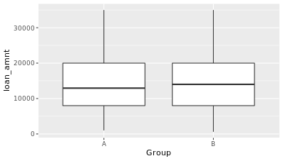
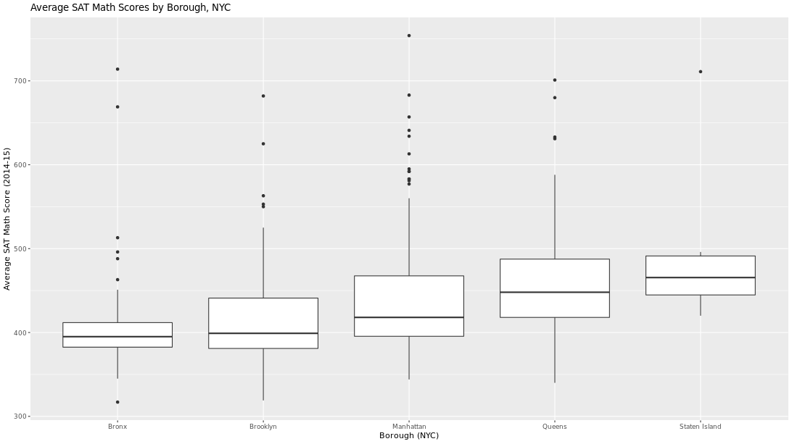
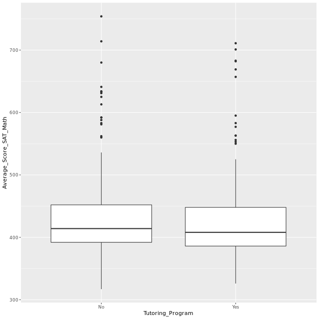
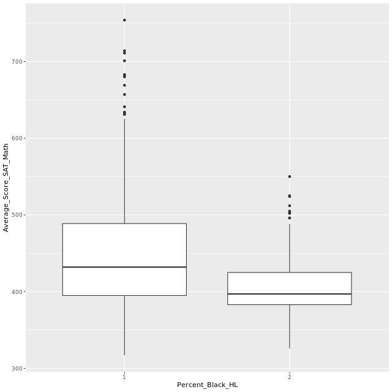
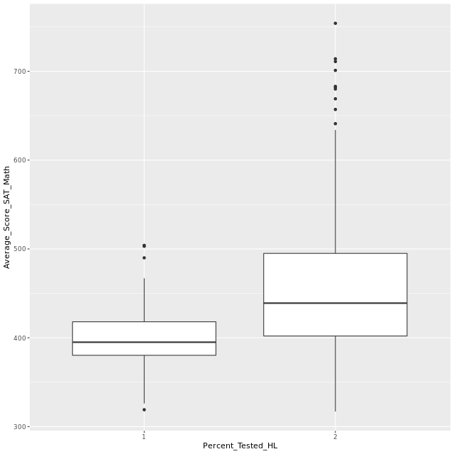
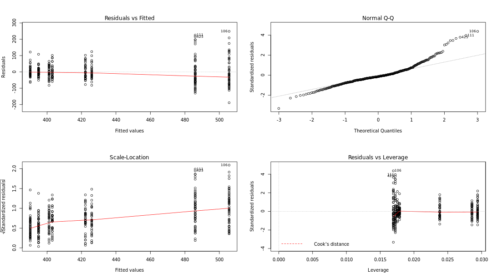

```{r setup, include=FALSE}
knitr::opts_chunk$set(echo = TRUE)
options(repos="https://CRAN.R-project.org")
```

## Intro to experimental design


**A basic experiment**

Let's dive into experimental design. Note that all of these concepts will be covered in more detail in the next video, "Hypothesis Testing."

`ToothGrowth` is a built-in R dataset from a study that examined the effect of three different doses of Vitamin C on the length of the odontoplasts, the cells responsible for teeth growth in 60 guinea pigs, where tooth length was the measured outcome variable.

Built-in data can be loaded with the `data()` function. The dataset will be loaded as a data frame with the same name passed as an argument to `data()`. For example, you can load the famous `iris` dataset using `data("iris")`.

If you wanted to conduct a two-sided t-test with the famous `mtcars` dataset, it would look like this, where `x` is the outcome in question, `alternative` is set to `"two.sided"`, and `mu` is the value you're testing to see if the mean of `mpg` is not equal to.

```
data(mtcars)

t.test(x = mtcars$mpg, alternative = "two.sided", mu = 40)
```

Suppose you know that the average length of a guinea pigs odontoplasts is 18 micrometers. Conduct a two-sided t-test on the ToothGrowth dataset. Here, a two-sided t-test will check to see if the mean of `len` is *not equal* to 18.

```{r}
# Load the ToothGrowth dataset
data("ToothGrowth")

# Perform a two-sided t-test
t.test(x = ToothGrowth$len, alternative = "two.sided", mu = 18)
```

Excellent job! Given the high p-value, we fail to reject the null hypothesis that the mean of `len` is equal to 18. That is, we don't have evidence that it is different from 18 micrometers. P-values and hypothesis testing will be covered in more detail in the next video.

**Randomization**

Randomization of subjects in an experiment helps spread any variability that exists naturally between subjects evenly across groups. For ToothGrowth, an example of effective randomization would be randomly assigning male and female guinea pigs into different experimental groups, ideally canceling out any existing differences that naturally exist between male and female guinea pigs.

In the experiment that yielded the `ToothGrowth` dataset, guinea pigs were randomized to receive Vitamin C either through orange juice or ascorbic acid, indicated in the dataset by the `supp` variable. It's natural to wonder if there is a difference in tooth length by supplement type - a question that a t-test can also answer!

Starting with this exercise, you should use `t.test()` and other modeling functions with formula notation:

`t.test(outcome ~ explanatory_variable, data = dataset)`

This can be read: "test `outcome` by `explanatory_variable` in my `dataset`." The default test for `t.test()` is a two-sided t-test.

You no longer have to explicitly declare `dataset$outcome`, because the `data` argument is specified.

```{r}
# Perform a t-test
ToothGrowth_ttest <- t.test(len ~ supp, data = ToothGrowth)

# Load broom
library(broom)

# Tidy ToothGrowth_ttest
tidy(ToothGrowth_ttest)
```

Nice job! Given the p-value of around 0.06, there seems to be no evidence to support the hypothesis that there's a difference in mean tooth length by supplement type, or, more simply, that there is no difference in mean tooth length by supplement type. Generally in most experiments, any p-value above 0.05 will offer no evidence to support the given hypothesis.

**Replication**

Recall that replication means you need to conduct an experiment with an adequate number of subjects to achieve an acceptable statistical power. Sample size and power will be discussed in more detail later in this chapter.

Let's examine the `ToothGrowth` dataset to make sure they followed the principle of replication. We'll use `dplyr` to do some exploratory data analysis (EDA). The data has already been loaded for you.

When using `dplyr` functions, we can utilize the pipe operator, `%>%`, to chain functions together. An example using `mtcars`:

```
data(mtcars)

mtcars %>%
    count(cyl)
```

`count()` groups `mtcars` by `cyl` and then counts how many there are of each number of cylinders.

```{r}
# Load dplyr
library(dplyr)

# Count number of observations for each combination of supp and dose
ToothGrowth %>% 
    count(supp, dose)
```

Great job! The researchers seem to have tested each combination of `supp` and `dose` on 10 subjects each, which is low, but was deemed adequate for this experiment.

**Blocking**

Though this is not true, suppose the supplement type is actually a nuisance factor we'd like to control for by blocking, and we're actually only interested in the effect of the dose of Vitamin C on guinea pig tooth growth.

If we block by supplement type, we create groups that are more similar, in that they'll have the same supplement type, allowing us to examine only the effect of dose on tooth length.

We'll use the `aov()` function to examine this. `aov()` creates a linear regression model by calling `lm()` and examining results with `anova()` all in one function call. To use `aov()`, we'll still need functional notation, as with the randomization exercise, but this time the formula should be `len ~ dose + supp` to indicate we've blocked by supplement type. (We'll cover `aov()` and `anova()` in more detail in the next chapter.)

`ggplot2` is loaded for you.

```{r}
library(ggplot2)

# Create a boxplot with geom_boxplot()
ggplot(ToothGrowth, aes(x = factor(dose), y = len)) + 
    geom_boxplot()

# Create ToothGrowth_aov
ToothGrowth_aov <- aov(len ~ factor(dose) + supp, data = ToothGrowth)

# Examine ToothGrowth_aov with summary()
summary(ToothGrowth_aov)
```

Congrats! You have just designed your first Randomized Complete Block Design (RCBD) experiment. We'll learn more about this type of experiment in Chapter 3. Given the very small observed p-value for `dose`, it appears we have evidence to support the hypothesis that mean `len` is different by `dose` amount.

## Hypothesis testing


**One sided vs. Two-sided tests**

Recall in the first exercise that we tested to see if the mean of the guinea pigs' teeth in `ToothGrowth` was not equal to 18 micrometers. That was an example of a two-sided t-test: we wanted to see if the mean of `len` is some other number on either side of 18.

We can also conduct a one-sided t-test, explicitly checking to see if the mean is less than or greater than 18. Whether to use a one- or two-sided test usually follows from your research question. Does an intervention cause longer tooth growth? One-sided, greater than. Does a drug cause the test group to lose more weight? One-sided, less than. Is there a difference in mean test scores between two groups of students? Two-sided test.

The `ToothGrowth` data has been loaded for you.

```{r}
# Less than
t.test(x = ToothGrowth$len,
       alternative = "less",
       mu = 18)

# Greater than
t.test(x = ToothGrowth$len,
       alternative = "greater",
       mu = 18)
```

Excellent! It turns out the mean of `len` is actually very close to 18, so neither of these tests tells us much about the mean of tooth length.

**pwr package Help Docs exploration**

The `pwr` package has been loaded for you. Use the console to look at the documentation for the `pwr.t.test()` function. The list of arguments are specialized for a t-test and include the ability to specify the alternative hypothesis.

If you'd like, take some time to explore the different `pwr` package functions and read about their inputs.

What does a call to any `pwr.*()` function yield?

A call to any `pwr.*()` function returns an object of class `power.htest`, which can then be manipulated in the same way as many different R objects.

**Power & Sample Size Calculations**

One key part of designing an experiment is knowing the required sample size you'll need to be able to test your hypothesis.

The `pwr` package provides a handy function, `pwr.t.test()`, which will calculate that for you. However, you do need to know your desired significance level (often 0.05), if the test is one- or two-sided, if the data is from one sample, two samples, or paired, the effect size, and the power. Some of this information will be given to you or can be reasoned from the design.

A power or sample size calculation is usually different each time you conduct one, and the details of the calculation strongly depend on what kind of experiment you're designing and what your end goals are.

```{r}
library(pwr)

# Calculate power
pwr.t.test(n = 100, 
           d = 0.35,
           sig.level = 0.10,
           type = "two.sample", 
           alternative = "two.sided",
           power = NULL)

# Calculate sample size
pwr.t.test(n = NULL, 
           d = 0.25, 
           sig.level = 0.05, 
           type = "one.sample", alternative = "greater", 
           power = 0.8)
```

Because this sample size calculation was for a one-sided test, we only need 101 subjects, not 101 in each group. As you design experiments in the future, the `pwr` package includes functions for calculating power and sample size for a variety of different tests, including ANOVA (more on that in the next chapter!)

## ANOVA, single and multiple factor experiments


**Exploratory Data Analysis (EDA) Lending Club**

A sample of 1500 observations from the Lending Club dataset has been loaded for you and is called `lendingclub`. Let's do some EDA on the data, in hopes that we'll learn what the dataset contains. We'll use functions from `dplyr` and `ggplot2` to explore the data.

```{r}
lendingclub <- read.csv("_data/lendclub.csv", stringsAsFactors = TRUE)
# Examine the variables with glimpse()
glimpse(lendingclub)

lendingclub %>% summarize(median(loan_amnt), 
                          mean(int_rate), 
                          mean(annual_inc))

# Use ggplot2 to build a bar chart of purpose
ggplot(lendingclub, aes(purpose)) +
    geom_bar() +
	coord_flip()

# Use recode() to create the new purpose_recode variable
lendingclub$purpose_recode <- lendingclub$purpose %>% recode( 
        "credit_card" = "debt_related", 
  		"debt_consolidation" = "debt_related",
  		"medical" = "debt_related",
        "car" = "big_purchase", 
  		"major_purchase" = "big_purchase", 
  		"vacation" = "big_purchase",
        "moving" = "life_change", 
  		"small_business" = "life_change", 
  		"wedding" = "life_change",
        "house" = "home_related", 
  		"home_improvement" = "home_related")
```

You can see that the original `purpose` variable had quite a few levels, which were very detailed. By using `recode()` here, you created `purpose_recode`, which has a much more manageable 4 general levels that describe the purpose for people's loans.

**How does loan purpose affect amount funded?**

In the last exercise, we pared the `purpose` variable down to a more reasonable 4 categories and called it `purpose_recode`. As a data scientist at Lending Club, we might want to design an experiment where we examine how the loan purpose influences the amount funded, which is the money actually issued to the applicant.

Remember that for an ANOVA test, the null hypothesis will be that all of the mean funded amounts are equal across the levels of `purpose_recode`. The alternative hypothesis is that at least one level of `purpose_recode` has a different mean. We will not be sure which, however, without some post hoc analysis, so it will be helpful to know how ANOVA results get stored as an object in R.

```{r}
# Build a linear regression model, purpose_recode_model
purpose_recode_model <- lm(funded_amnt ~ purpose_recode, data = lendingclub)

# Examine results of purpose_recode_model
summary(purpose_recode_model)

# Get anova results and save as purpose_recode_anova
purpose_recode_anova <- anova(purpose_recode_model)

# Print purpose_recode_anova
purpose_recode_anova

# Examine class of purpose_recode_anova
class(purpose_recode_anova)
```

Based on the very small p-value, `purpose_recode_anova`'s results indicate that there is evidence to support the hypothesis that the mean loan amounts are different for at least one combination of `purpose_recode`'s levels. You also saw that the ANOVA results are saved as a data frame, which is nice in case you need to access results later. Loans aren't issued in a vacuum, however, and it's likely that more than just purpose influences the amount funded.

**Which loan purpose mean is different?**

Before we examine other factors besides `purpose_recode` that might influence the amount of loan funded, let's examine which means of `purpose_recode` are different. This is the post-hoc test referred to in the last exercise.

The result of that ANOVA test was statistically significant with a very low p-value. This means we can reject the null hypothesis and accept the alternative hypothesis that at least one mean was different. But which one?

We should use Tukey's HSD test, which stands for Honest Significant Difference. To conduct Tukey's HSD test in R, you can use `TukeyHSD()`:

```
TukeyHSD(aov_model, "outcome_variable_name", conf.level = 0.9)
```

This would conduct Tukey's HSD test on some `aov_model`, looking at a specific "`outcome_variable_name`", with a `conf.level` of 90%.

```{r}
# Use aov() to build purpose_aov
purpose_aov <- aov(funded_amnt ~ purpose_recode, data = lendingclub)

# Conduct Tukey's HSD test to create tukey_output
tukey_output <- TukeyHSD(purpose_aov, "purpose_recode", conf.level = 0.95)

# Tidy tukey_output to make sense of the results
tidy(tukey_output)
```

Looking at the p-values for each comparison of the levels of `purpose_recode`, we can see that only a few of the mean differences are statistically significant, for example the differences in the means for the `debt_related` and `big_purchase` loan amounts. In this case, these tiny p-values are most likely to be due to large sample size, and further tests would be required to determine what's actually significant in the case of loans (known as the practical significance.)

**Multiple Factor Experiments**

We tested whether the purpose of a loan affects loan amount funded and found that it does. However, we also know that it's unlikely that loans are funded based only on their intended purpose. It's more likely that the company is looking at a holistic picture of an applicant before they decide to issue a loan.

We can examine more than one explanatory factor in a multiple factor experiment. Like our experiments on `ToothGrowth` from Chapter 1, an experimenter can try and control two (or more!) different factors and see how they affect the outcome. We're using open data, so we can't quite control the factors here (they're submitted as someone fills out their loan application), but let's look at how a few other factors affect loan amount funded.

```{r}
# Use aov() to build purpose_emp_aov
purpose_emp_aov <- aov(funded_amnt ~ purpose_recode + emp_length, data = lendingclub)

# Print purpose_emp_aov to the console
purpose_emp_aov

# Call summary() to see the p-values
summary(purpose_emp_aov)
```

Excellent! You could also perform Tukey's HSD test on this model, but given that `emp_length` has 12 levels, it'll be quite the output. If it was important to the experiment to know the answer, you'd definitely need to look at it.

## Model validation


**Pre-modeling EDA**

Let's do some EDA with our experiment in mind. Lending Club has now asked you, their data scientist, to examine what effect their Lending Club-assigned loan `grade` variable has on the interest rate, `int_rate`. They're interested to see if the grade they assign the applicant during the process of applying for the loan affects the interest rate ultimately assigned to the applicant during the repayment process.

The `lendingclub` data has been loaded for you, as has `dplyr` and `ggplot2`.

```{r}
# Examine the summary of int_rate
summary(lendingclub$int_rate)

# Examine int_rate by grade
lendingclub %>% 
	group_by(grade) %>% 
	summarize(mean = mean(int_rate), var = var(int_rate), median = median(int_rate))

# Make a boxplot of int_rate by grade
ggplot(lendingclub, aes(x = grade, y = int_rate)) +
	geom_boxplot()

# Use aov() to create grade_aov plus call summary() to print results
grade_aov <- aov(int_rate ~ grade, data = lendingclub)
summary(grade_aov)
```

Excellent job! You can see from the numeric summary and the boxplot that grade seems to heavily influence interest rate. Therefore, the linear model results indicating that `int_rate` is significantly different by `grade` are unsurprising.

**Post-modeling validation plots + variance**

In the last exercise, we found that `int_rate` does differ by `grade`. Now we should validate this model, which for linear regression means examining the Residuals vs. Fitted and Normal Q-Q plots.

If you call `plot()` on a model object in R, it will automatically plot both of those plots plus two more. You'll interpret these plots to evaluate model fit. We discussed how to do this in the video.

Another assumption of ANOVA and linear modeling is homogeneity of variance. Homogeneity means "same", and here that would mean that the variance of `int_rate` is the same for each level of `grade`. We can test for homogeneity of variances using `bartlett.test()`, which takes a formula and a dataset as inputs.

```{r}
# For a 2x2 grid of plots:
par(mfrow = c(2, 2))

# Plot grade_aov
plot(grade_aov)

# Bartlett's test for homogeneity of variance
bartlett.test(int_rate ~ grade, data = lendingclub)
```

Excellent! The residuals on this model are okay, though the residuals on G have a much smaller range than any other level of `grade` (the dots are far less spread out.) The Q-Q plot, however, shows that the residuals are fairly normal. However, given the highly significant p-value from Bartlett's test, the assumption of homogeneity of variances is violated, which is one of the assumptions of an ANOVA model. Therefore, ANOVA might not be the best choice for this experiment. It happens!

**Kruskal-Wallis rank sum test**

Given that we found in the last exercise that the homogeneity of variance assumption of linear modeling was violated, we may want to try an alternative.

One non-parametric alternative to ANOVA is the Kruskal-Wallis rank sum test. For those with some statistics knowledge, it is an extension of the Mann-Whitney U test for when there are more than two groups, like with our `grade` variable. For us, the null hypothesis for this test would be that all of the `int_rates` have the same ranking by `grade`.

The Kruskal-Wallis rank sum test can be conducted using the `kruskal.test()` function, available in base R. Luckily for you, the use of this function is very similar to using `lm()` or `aov()`: you input a formula and a dataset, and a result is returned.

```{r}
# Conduct the Kruskal-Wallis rank sum test
kruskal.test(int_rate ~ grade,
             data = lendingclub)
```

Good job! The low p-value indicates that based on this test, we can be confident in our result, which we found across this experiment, that `int_rate` varies by `grade`.

## A/B testing


**Sample size for A/B test**

We know now that we need to analyze our A/B test results with a t-test after we've collected data. We have two pretty important questions we need to answer before we do that: what's the effect size and what's the sample size required for this test?

In this case, effect size was given to us. Lending Club is looking to detect the relatively small effect size of 0.2. We'll again use the `pwr` package and calculate sample size using an appropriate function to find out how many we'll need to recruit into each group, A and B.

```{r}
# Load the pwr package
library(pwr)

# Use the correct function from pwr to find the sample size
pwr.t.test(n = NULL, 
           d = 0.2,
           sig.level = 0.05,
           power = 0.8,
           alternative = "two.sided")
```

Nice! You can see we need about 400 people per group to reach our desired power in this A/B test.

**Basic A/B test**

Now that we know the sample size required, and we allowed the experiment to run long enough to get at least 400 people in each group, we can analyze our A/B test.

Remember that when applicants were using the Lending Club website, they were randomly assigned to two groups, A or B, where A was shown a mint green website header and B was shown a light blue website header. Lending Club was interested to see if website header color choice influenced `loan_amnt`, the amount an applicant asked to borrow.


A new dataset, `lendingclub_ab` is available in your workspace. The A/B test was run until there were 500 applicants in each group. Each applicant has been labeled as group A or B. Conduct the proper test to see if the mean of `loan_amnt` is different between the two groups.

```
# Plot the A/B test results
ggplot(lendingclub_ab, aes(x = Group, y = loan_amnt)) + 
	geom_boxplot()
```

```
# Conduct a two-sided t-test
t.test(loan_amnt ~ Group, data = lendingclub_ab)
```
```
	Welch Two Sample t-test

data:  loan_amnt by Group
t = -0.58112, df = 997.06, p-value = 0.5613
alternative hypothesis: true difference in means is not equal to 0
95 percent confidence interval:
 -1377.1748   747.8748
sample estimates:
mean in group A mean in group B 
       14723.15        15037.80 
```

Excellent! By looking at both the boxplot and the results of the t-test, it seems that there is no compelling evidence to support the hypothesis that there is a difference the two A/B test groups' mean `loan_amnt`, a result which you would use to help make data-driven decisions at Lending Club.

**A/B tests vs. multivariable experiments**

The point of an A/B test is that only one thing is changed and the effect of that change is measured. We saw this with our examples in the video and the last few exercises. On the other hand, a multivariate experiment, such as the `ToothGrowth` experiment from chapter 1, is where a few things are changed (and is similar to a multiple factor experiment, which we covered earlier in this chapter.)

A Lending Club multivariate test can combine all of the explanatory variables we've looked at in this chapter. Let's examine how `Group`, `grade`, and `verification_status` affect `loan_amnt` in the `lendingclub_ab` dataset.

```
# Build lendingclub_multi
lendingclub_multi <- lm(loan_amnt ~ Group + grade + verification_status, data = lendingclub_ab)

# Examine lendingclub_multi results
tidy(lendingclub_multi)
```
```
# A tibble: 10 x 5
   term                               estimate std.error statistic  p.value
   <chr>                                 <dbl>     <dbl>     <dbl>    <dbl>
 1 (Intercept)                          11244.      792.    14.2   8.44e-42
 2 GroupB                                 205.      515.     0.398 6.91e- 1
 3 gradeB                                -975.      817.    -1.19  2.33e- 1
 4 gradeC                                -631.      806.    -0.783 4.34e- 1
 5 gradeD                                 718.      917.     0.783 4.34e- 1
 6 gradeE                                1477.     1208.     1.22  2.22e- 1
 7 gradeF                                5453.     1942.     2.81  5.09e- 3
 8 gradeG                                3490.     3396.     1.03  3.04e- 1
 9 verification_statusSource Verified    4528.      637.     7.10  2.30e-12
10 verification_statusVerified           5900.      668.     8.84  4.41e-18
```

From the results, verification status and having an F `grade` are the factors in this model that have a significant effect on loan amount. Let's move on to the next chapter and conduct more multivariable experiments like this.

## Intro to NHANES and sampling


**NHANES dataset construction**

As downloaded from the [NHANES website](https://wwwn.cdc.gov/nchs/nhanes/continuousnhanes/default.aspx?BeginYear=2015), the NHANES datasets are available only as separate .XPT files, a native format to SAS. Luckily for us, the `haven` package exists.

Let's combine the NHANES Demographics, Medical Conditions, and Body Measures datasets, available in their raw .XPT format and accessible through the variables `DEMO_file`, `MCQ_file`, and `BMX_file`. Join all 3 datasets using the `SEQN` variable. A good way to do this is using `Reduce()`, which allows you to combine elements in a helpful way.

The joining code, which is provided for you does the following:

- Creates a list of all 3 datasets (`nhanes_demo`, `nhanes_medical`, `nhanes_bodymeasures`).
- Uses a custom function inside of `Reduce()` to inner join all 3 datasets with the `"SEQN"` variable.
- Saves this as the `nhanes_combined` dataset.

```
# Load haven
library(haven)

# Import the three datasets using read_xpt()
nhanes_demo <- read_xpt(DEMO_file)
nhanes_medical <- read_xpt(MCQ_file)
nhanes_bodymeasures <- read_xpt(BMX_file)
```

```{r}
nhanes_demo <- read.csv("_data/nhanes_demo.csv", stringsAsFactors = TRUE)
nhanes_medical <- read.csv("_data/nhanes_medicalconditions.csv", stringsAsFactors = TRUE)
nhanes_bodymeasures <- read.csv("_data/nhanes_bodymeasures.csv", stringsAsFactors = TRUE)

# Merge the 3 datasets you just created to create nhanes_combined
nhanes_combined <- list(nhanes_demo, nhanes_medical, nhanes_bodymeasures) %>%
  Reduce(function(df1, df2) inner_join(df1, df2, by = "seqn"), .)
```

Awesome! Now that we have the NHANES data assembled, let's get to work on EDA & cleaning.

**NHANES EDA**

Let's examine our newly constructed dataset with a mind toward EDA. As in the last chapter, it's a good idea to look at both numerical summary measures and visualizations. These help with understanding data and are a good way to find data cleaning steps you may have missed. The `nhanes_combined` dataset has been pre-loaded for you.

Say we have access to NHANES patients and want to conduct a study on the effect of being told by a physician to reduce calories/fat in their diet on weight. This is our treatment; we're pretending that instead of this being a question asked of the patient, we randomly had physicians counsel some patients on their nutrition. However, we suspect that there may be a difference in weight based on the gender of the patient - a blocking factor!

```{r}
# Fill in the dplyr code
nhanes_combined %>% 
  group_by(mcq365d) %>% 
  summarize(mean = mean(bmxwt, na.rm = TRUE))

# Fill in the ggplot2 code
nhanes_combined %>% 
  ggplot(aes(as.factor(mcq365d), bmxwt)) +
  geom_boxplot() +
  labs(x = "Treatment",
       y = "Weight")
```

Great! Now that we have an idea of some of the problems with the data, namely that children weren't given the treatment - that's why we see an `NA` age category. We also have some patients have weights missing, thus the warning that the boxplot throws. It's time for some data cleaning.

**NHANES Data Cleaning**

During data cleaning, we discovered that no one under the age of 16 was given the treatment. Recall that we're pretending that the variable that indicates if a doctor has ever advised them to reduce fat or calories in their diet is purposeful nutrition counseling, our treatment. Let's only keep patients who are greater than 16 years old in the dataset.

You also may have noticed that the default settings in `ggplot2` delete any observations with a missing dependent variable, in this case, body weight. One option for dealing with the missing weights, imputation, can be implemented using the `simputation` package. Imputation is a technique for dealing with missing values where you replace them either with a summary statistic, like mean or median, or use a model to predict a value to use.

We'll use `impute_median()`, which takes a dataset and the variable to impute or formula to impute by as arguments. For example, `impute_median(ToothGrowth, len ~ dose)` would fill in any missing values in the variable `len` with the median value for `len` by `dose`. So, if a guinea pig who received a dose of 2.0 had a missing value for the `len` variable, it would be filled in with the median `len` for those guinea pigs with a `dose` of 2.0.

```{r}
# Filter to keep only those 16+
nhanes_filter <- nhanes_combined %>% filter(ridageyr > 16)

# Load simputation & impute bmxwt by riagendr
library(simputation)
nhanes_final <- impute_median(nhanes_filter, bmxwt ~ riagendr)

# Recode mcq365d with recode() & examine with count()
nhanes_final$mcq365d <- recode(nhanes_final$mcq365d, 
                               `1` = 1,
                               `2` = 2,
                               `9` = 2)
nhanes_final %>% count(mcq365d)
```

Excellent! Imputation is a powerful tool for dealing with missing data, but should be used with caution, as you can introduce bias into your data if you're not careful how you impute. Now that we have the dataset cleaned, we're ready to learn about RCBDs so we can analyze our experiment.

**Resampling NHANES data**

The NHANES data is collected on sampled units (people) specifically selected to represent the U.S. population. However, let's resample the `nhanes_final` dataset in different ways so we get a feel for the different sampling methods.

We can conduct a simple random sample using `sample_n()` from `dplyr`. It takes as input a dataset and an integer of number of rows to sample.

Stratified sampling can be done by combining `group_by()` and `sample_n()`. The function will sample `n` from each of the groups specified in the `group_by()`.

The `sampling` package's `cluster()` creates cluster samples. It takes in a dataset name, the variable in the set to be used as the cluster variable, passed as a vector with the name as a string (e.g. `c("variable")`), a number of clusters to select, and a method.

```{r}
# Use sample_n() to create nhanes_srs
nhanes_srs <- nhanes_final %>% sample_n(2500)

# Create nhanes_stratified with group_by() and sample_n()
nhanes_stratified <- nhanes_final %>% group_by(riagendr) %>% sample_n(2000)
nhanes_stratified %>% 
	count(riagendr)

# Load sampling package and create nhanes_cluster with cluster()
library(sampling)
nhanes_cluster <- cluster(nhanes_final, "indhhin2", 6, method = "srswor")
nhanes_cluster %>%
  count(indhhin2)
```

Excellent! These are some basic sampling methods you can use on your data to create the different kinds of samples that may be necessary in an experiment.

## Randomized Complete Block Designs (RCBD)


A rule of thumb in experimental design is often "block what you can, randomize what you cannot", which means you should aim to block the effects you can control for (e.g. sex) and randomize on those you cannot (e.g. smoking status). Variability inside a block is expected to be fairly small, but variability between blocks will be larger.

**Drawing RCBDs with Agricolae**

The `agricolae` package is very helpful when you want to "draw" out the design of an experiment for yourself using R. It can draw many different kinds of experiments, including a randomized complete block design. Here's an example of one:

```
     [,1] [,2] [,3] [,4]
[1,] "D"  "C"  "A"  "B" 
[2,] "B"  "A"  "D"  "C" 
[3,] "D"  "A"  "B"  "C" 
[4,] "A"  "B"  "D"  "C"
```

In this RCBD, we have 4 blocks (each row of the output). Inside of each block, each treatment "A", "B", "C", and "D" is used, because this is a *complete* design. So if these 4 blocks/rows of the output were four fields of a farmer's, they should give the first field the "D" treatment in the first season, then "C", then "A", then "B".

Let's draw an RCBD design with 5 treatments and 4 blocks, which go in the `r` argument. The `agricolae` package has been loaded for you.

```{r}
library(agricolae)

# Create designs using ls()
designs <- ls("package:agricolae", pattern = "design")
designs

# Use str() to view design.rcbd's criteria
str(design.rcbd)

# Build treats and rep
treats <- LETTERS[1:5]
blocks <- 4

# Build my_design_rcbd and view the sketch
my_design_rcbd <- design.rcbd(treats, r = blocks, seed = 42)
my_design_rcbd$sketch
```

Nice! Now that you have a better idea of what a RCBD looks like, let's try a few examples, including one with the NHANES data we cleaned.

**NHANES RCBD**

Recall that our blocked experiment involved a treatment wherein the doctor asks the patient to reduce their fat or calories in their diet, and we're testing the effect this has on weight (`bmxwt`). We plan to block by gender, which in the NHANES dataset is stored as `riagendr`. Recall that blocking is done to create experimental groups that are as similar as possible. Blocking this experiment by gender means that if we observe an effect of the treatment on `bmxwt`, it's more likely that the effect was actually due to the treatment versus the individual's gender.

In your R code, you denote a blocked experiment by using a formula that looks like: `outcome ~ treatment + blocking_factor` in the appropriate modeling function.

`nhanes_final` is available.

```{r}
# Use aov() to create nhanes_rcbd
nhanes_rcbd <- aov(bmxwt ~ mcq365d + riagendr, data = nhanes_final)

# Check results of nhanes_rcbd with summary()
summary(nhanes_rcbd)

# Print mean weights by mcq365d and riagendr
nhanes_final %>% 
	group_by(mcq365d, riagendr) %>% 
	summarize(mean_wt = mean(bmxwt, na.rm = TRUE))
```

Nice! It's pretty clear that there truly is a mean difference in weight by gender, so blocking was a good call for this experiment. We also observed a statistically significant effect of the treatment on `bmxwt`, which we hope is actually a result of the treatment. Now that we have the RCBD down, let's tackle Balanced Incomplete Block Designs (BIBD).

**RCBD Model Validation**

As we did in the last chapter (and when building any model!) it's a good idea to validate the results. We'll examine the Residuals vs. Fitted and Normal Q-Q plots, though now we'll only see a Constant Leverage plot in place of the other two. A good model has a Q-Q plot showing an approximately normal distribution and no clear patterns across blocks or treatments in the others.

We can also look at Interaction plots. We hope to see parallel lines, no matter which of the block or the treatment is on the x-axis. If they are, they satisfy a key assumption of the RCBD model called Additivity.

The `nhanes_rcbd` model object from the last exercise has been loaded for you. Examine the results with `summary(nhanes_rcbd)` in the console if you need a refresher.

```{r}
# Set up the 2x2 plotting grid and plot nhanes_rcbd
par(mfrow = c(2, 2))

plot(nhanes_rcbd)

# Run the code to view the interaction plots
par(mfrow = c(1, 2))
with(nhanes_final, interaction.plot(mcq365d, riagendr, bmxwt))
with(nhanes_final, interaction.plot(riagendr, mcq365d, bmxwt))
```

Excellent! The initial diganostic plots show that this model is pretty good but not great - especially at the larger end of the data, the Q-Q plot shows the data might not be normal. The interaction plots show nearly parallel lines, so we can move forward with this model.

## Balanced Incomplete Block Designs (BIBD)


if $\lambda$ is a whole number, then a BIBD is possible, otherwise it is not.

**Drawing BIBDs with agricolae**

We can also use `agricolae` to draw BIBDs. `design.bib()` takes, at minimum, the treatments (`treats`), an integer `k` corresponding to the number of levels of the blocks, and a `seed` as inputs.

The main thing you should notice about a BIBD is that not every treatment will be used in each block (column) of the output.

From the video and the last exercise, however, you know that sometimes a BIBD isn't valid and that you have to do a little math to be sure your BIBD design is possible. `design.bib()` will return an error message letting you know if a design is not valid.

Let's draw a few BIBDs with `agricolae` so we can see the different warning messages and errors the package provides.

```{r, error=TRUE}
#create my_design_bibd_1
my_design_bibd_1 <- design.bib(LETTERS[1:3], k = 4, seed = 42)

#create my_design_bibd_2
my_design_bibd_2 <- design.bib(LETTERS[1:8], k = 3, seed = 42)

# Create my_design_bibd_3
my_design_bibd_3 <- design.bib(LETTERS[1:4], k = 4, seed = 42)
my_design_bibd_3$sketch
```

Nice! You saw two different function errors which help lead you in the right direction with your design, plus one that works. When the design does work, the `sketch` parameter shows the design. The blocks are now the columns, however, unlike with RCBDs.

**BIBD - cat's kidney function**

To be sure we truly understand what a BIBD looks like, let's build a dataset containing a BIBD from scratch.

Say we want to test the difference between four different wet foods in cats' diets on their kidney function. Cat food, however, is expensive, so we'll only test 3 foods per block to save some money. Our cats will be blocked by color of cat, as we aren't interested in that as part of our experiment. The outcome will be measured blood creatinine level, an indicator of kidney function and dysfunction in cats and humans alike.

```{r}
lambda <- function(t, k, r) {
  return((r*(k-1)) / (t-1))
}

# Calculate lambda
lambda(4, 3, 3)

# Build the data.frame
creatinine <- c(1.98, 1.97, 2.35, 2.09, 1.87, 1.95, 2.08, 2.01, 1.84, 2.06, 1.97, 2.22)
food <- as.factor(c("A", "C", "D", "A", "B", "C", "B", "C", "D", "A", "B", "D"))
color <- as.factor(rep(c("Black", "White", "Orange", "Spotted"), each = 3))
cat_experiment <- as.data.frame(cbind(creatinine, food, color))

# Create cat_model and examine with summary()
cat_model <- aov(creatinine ~ food + color, data = cat_experiment)
summary(cat_model)
```

Purrfect! It seems there are no differences by type of wet food in kidney function. Hopefully now you can see how a BIBD comes to life!

**NHANES BIBD**

Let's jump back into the NHANES data and pretend we have access to NHANES patients ages 18-45. Blocking the adults by race, stored in NHANES as `ridreth1`, we prescribe to our groups either no particular upper body weightlifting regimen, a weightlifting regimen, or a weightlifting regimen plus a prescribed daily vitamin supplement. This information is stored in a variable called `weightlift_treat`.

Those funding the study decide they want it to be a BIBD where only 2 treatments appear in each block. The outcome, arm circumference, is stored as `bmxarmc`. The `nhanes_final` data is loaded for you.

```{r}
# Calculate lambda
lambda(3, 2, 2)
```

```
# Create weightlift_model & examine results
weightlift_model <- aov(bmxarmc ~ weightlift_treat + ridreth1, data = nhanes_final)
summary(weightlift_model)
```
```
                   Df Sum Sq Mean Sq F value Pr(>F)    
weightlift_treat    1      4     3.9   0.132  0.716    
ridreth1            4   3364   841.0  28.321 <2e-16 ***
Residuals        2331  69224    29.7                   
---
Signif. codes:  0 '***' 0.001 '**' 0.01 '*' 0.05 '.' 0.1 ' ' 1
115 observations deleted due to missingness
```

Nice! As it turns out, the weight lifting regimen doesn't seem to have a significant effect on arm circumference when the patient population is blocked by race.

## Latin squares


both the rows and columns are blocking factors


**NYC SAT Scores EDA**

Math is a subject the U.S. is consistently behind the rest of the world on, so our experiments will focus on Math score. While the original dataset is an open dataset downloaded from [Kaggle](https://www.kaggle.com/nycopendata/high-schools/data), throughout this chapter I will add a few variables that will allow you to pretend you are an education researcher conducting experiments ideally aimed at raising students' scores, hopefully increasing the likelihood they will be admitted to colleges.

Before diving into analyzing the experiments, we should do some EDA to make sure we fully understand the `nyc_scores` data. In this lesson, we'll do experiments where we block by `Borough` and `Teacher_Education_Level`, so let's examine math scores by those variables. The `nyc_scores` dataset has been loaded for you.

```
nyc_scores <- read.csv("_data/nyc_scores.csv", stringsAsFactors = TRUE)

# Mean, var, and median of Math score
nyc_scores %>%
    group_by(Borough) %>% 
    summarize(mean = mean(Average_Score_SAT_Math, na.rm = TRUE),
        var = var(Average_Score_SAT_Math, na.rm = TRUE),
        median = median(Average_Score_SAT_Math, na.rm = TRUE))
```
```
# A tibble: 5 x 4
  Borough        mean   var median
  <fct>         <dbl> <dbl>  <dbl>
1 Bronx          404. 2727.   396.
2 Brooklyn       416. 3658.   395 
3 Manhattan      456. 7026.   433 
4 Queens         462. 5168.   448 
5 Staten Island  486. 6911.   466.
```
```
# Mean, var, and median of Math score by Teacher Education Level
nyc_scores %>%
    group_by(Teacher_Education_Level) %>% 
    summarize(mean = mean(Average_Score_SAT_Math, na.rm = TRUE),
        var = var(Average_Score_SAT_Math, na.rm = TRUE),
        median = median(Average_Score_SAT_Math, na.rm = TRUE))
```
```
# A tibble: 5 x 4
  Teacher_Education_Level  mean   var median
  <chr>                   <dbl> <dbl>  <dbl>
1 BA                       431. 4918.    414
2 College Student          447. 5891.    424
3 Grad Student             430. 4029.    410
4 MA                       427. 4928.    410
5 PhD                      431. 7794.    407
```
```
# Mean, var, and median of Math score by both
nyc_scores %>%
    group_by(Borough, Teacher_Education_Level) %>% 
    summarize(mean = mean(Average_Score_SAT_Math, na.rm = TRUE),
        var = var(Average_Score_SAT_Math, na.rm = TRUE),
        median = median(Average_Score_SAT_Math, na.rm = TRUE))
```
```
# A tibble: 23 x 5
# Groups:   Borough [5]
   Borough  Teacher_Education_Level  mean   var median
   <fct>    <chr>                   <dbl> <dbl>  <dbl>
 1 Bronx    BA                       416. 4920.    393
 2 Bronx    College Student          409. 4569.    395
 3 Bronx    Grad Student             398.  674.    396
 4 Bronx    MA                       396. 1296.    394
 5 Bronx    PhD                      402.  819.    399
 6 Brooklyn BA                       419. 5892.    392
 7 Brooklyn College Student          403. 2619.    395
 8 Brooklyn Grad Student             417. 4543.    394
 9 Brooklyn MA                       424. 3207.    406
10 Brooklyn PhD                      415. 2386.    397
# ... with 13 more rows
```

Great job! Now that we've examined the data, we can move on to cleaning it, the next important step before analysis.

**Dealing with Missing Test Scores**

If we want to use SAT scores as our outcome, we should examine missingness. Examine the pattern of missingness across all the variables in `nyc_scores` using `miss_var_summary()` from the `naniar` package. `naniar` integrates with Tidyverse code styling, including the pipe operator (`%>%`).

There are 60 missing scores in each subject. Though there are many R packages which help with more advanced forms of imputation, such as `MICE`, `Amelia`, and `mi`, we will continue to use `simputation` and `impute_median()`.

Create a new dataset, nyc_scores_2 by imputing Math score by Borough, but note that `impute_median()` returns the imputed variable as type "impute". You'll convert the variable to the numeric in a separate step.

`simputation` and `dplyr` are loaded.

```
# Load naniar
library(naniar)

# Examine missingness with miss_var_summary()
nyc_scores %>% miss_var_summary()
```
```
# A tibble: 22 x 3
   variable                  n_miss pct_miss
   <chr>                      <int>    <dbl>
 1 Average_Score_SAT_Math        60    13.8 
 2 Average_Score_SAT_Reading     60    13.8 
 3 Average_Score_SAT_Writing     60    13.8 
 4 Percent_Tested                49    11.3 
 5 Student_Enrollment             7     1.61
 6 Percent_White                  7     1.61
 7 Percent_Black                  7     1.61
 8 Percent_Hispanic               7     1.61
 9 Percent_Asian                  7     1.61
10 School_ID                      0     0   
# ... with 12 more rows
```
```
# Examine missingness with md.pattern()
md.pattern(nyc_scores)

# Impute the Math score by Borough
nyc_scores_2 <- impute_median(nyc_scores, Average_Score_SAT_Math ~ Borough)
```
```
   School_ID School_Name Borough Building_Code Street_Address City State
375         1           1       1             1              1    1     1
 11         1           1       1             1              1    1     1
 42         1           1       1             1              1    1     1
  7         1           1       1             1              1    1     1
            0           0       0             0              0    0     0
    Zip_Code Latitude Longitude Phone_Number Start_Time End_Time
375        1        1         1            1          1        1
 11        1        1         1            1          1        1
 42        1        1         1            1          1        1
  7        1        1         1            1          1        1
           0        0         0            0          0        0
    Student_Enrollment Percent_White Percent_Black Percent_Hispanic
375                  1             1             1                1
 11                  1             1             1                1
 42                  1             1             1                1
  7                  0             0             0                0
                     7             7             7                7
    Percent_Asian Percent_Tested Average_Score_SAT_Math
375             1              1                      1
 11             1              1                      0
 42             1              0                      0
  7             0              0                      0
                7             49                     60
    Average_Score_SAT_Reading Average_Score_SAT_Writing    
375                         1                         1   0
 11                         0                         0   3
 42                         0                         0   4
  7                         0                         0   9
                           60                        60 264
```
```
# Convert Math score to numeric
nyc_scores_2$Average_Score_SAT_Math <- as.numeric(nyc_scores_2$Average_Score_SAT_Math)

# Examine scores by Borough in both datasets, before and after imputation
nyc_scores %>% 
	group_by(Borough) %>% 
	summarize(median = median(Average_Score_SAT_Math, na.rm = TRUE), 
              mean = mean(Average_Score_SAT_Math, na.rm = TRUE))
```
```
# A tibble: 5 x 3
  Borough       median  mean
  <fct>          <dbl> <dbl>
1 Bronx           396.  404.
2 Brooklyn        395   416.
3 Manhattan       433   456.
4 Queens          448   462.
5 Staten Island   466.  486.
```
```
nyc_scores_2 %>% 
	group_by(Borough) %>% 
	summarize(median = median(Average_Score_SAT_Math), 
              mean = mean(Average_Score_SAT_Math))
```
```
# A tibble: 5 x 3
  Borough       median  mean
  <fct>          <dbl> <dbl>
1 Bronx           395   403.
2 Brooklyn        399   418.
3 Manhattan       418   446.
4 Queens          448   460.
5 Staten Island   466.  486.
```

Nice job! Did the median scores change before and after imputation? (Hint: they shouldn't have changed by much, but rounding may have offset them by an integer or two.)

**Drawing Latin Squares with agricolae**

We return, once again, to the `agricolae` package to examine what a Latin Square design can look like. Here's an example:

```
     [,1] [,2] [,3] [,4]
[1,] "B"  "D"  "A"  "C" 
[2,] "A"  "C"  "D"  "B" 
[3,] "D"  "B"  "C"  "A" 
[4,] "C"  "A"  "B"  "D"
```

Since a Latin Square experiment has two blocking factors, you can see that in this design, each treatment appears once in both each row (blocking factor 1) and each column (blocking factor 2).

Look at the help page for `design.lsd()` by typing `?design.lsd` in the console for any help you need designing your Latin Square experiment.

```{r}
# Load agricolae
library(agricolae)

# Design a LS with 5 treatments A:E then look at the sketch
my_design_lsd <- design.lsd(trt = LETTERS[1:5], seed = 42)
my_design_lsd$sketch
```

Perhaps you're thinking to yourself 'This looks a lot like a RCBD'…bingo! It does, but as we know from the video, there are now two blocking factors in a LS design.

**Latin Square with NYC SAT Scores**

To execute a Latin Square design on this data, suppose we want to know the effect of our tutoring program, which includes one-on-one tutoring, two small groups, and an in and after-school SAT prep class. A new dataset `nyc_scores_ls` is available that represents this experiment. Feel free to explore the dataset in the console.

We'll block by `Borough` and `Teacher_Education_Level` to reduce their known variance on the score outcome. `Borough` is a good blocking factor because schools in America are funded partly based on taxes paid in each city, so it will likely make a difference in the quality of education.

```
# Build nyc_scores_ls_lm
nyc_scores_ls_lm <- lm(Average_Score_SAT_Math ~ Tutoring_Program + Borough + Teacher_Education_Level,
                       data = nyc_scores_ls)

# Tidy the results with broom
tidy(nyc_scores_ls_lm)
```
```
# A tibble: 13 x 5
   term                                  estimate std.error statistic    p.value
   <chr>                                    <dbl>     <dbl>     <dbl>      <dbl>
 1 (Intercept)                             370.        34.1    10.9      1.46e-7
 2 Tutoring_ProgramSAT Prep Class (afte~   -46         29.9    -1.54     1.50e-1
 3 Tutoring_ProgramSAT Prep Class (scho~   -58.8       29.9    -1.97     7.29e-2
 4 Tutoring_ProgramSmall Groups (2-3)      108.        29.9     3.61     3.58e-3
 5 Tutoring_ProgramSmall Groups (4-6)      -44.1       29.9    -1.47     1.66e-1
 6 BoroughBrooklyn                         101.        29.9     3.38     5.50e-3
 7 BoroughManhattan                         51.3       29.9     1.72     1.12e-1
 8 BoroughQueens                            25.        29.9     0.836    4.20e-1
 9 BoroughStaten Island                    129.        29.9     4.31     1.02e-3
10 Teacher_Education_LevelCollege Stude~    44.3       29.9     1.48     1.64e-1
11 Teacher_Education_LevelGrad Student      50.4       29.9     1.68     1.18e-1
12 Teacher_Education_LevelMA                -4.20      29.9    -0.140    8.91e-1
13 Teacher_Education_LevelPhD               53.6       29.9     1.79     9.84e-2
```
```
# Examine the results with anova
anova(nyc_scores_ls_lm)
```
```
Analysis of Variance Table

Response: Average_Score_SAT_Math
                        Df Sum Sq Mean Sq F value    Pr(>F)    
Tutoring_Program         4  94238 23559.6 10.5331 0.0006729 ***
Borough                  4  56538 14134.6  6.3193 0.0056403 ** 
Teacher_Education_Level  4  16201  4050.4  1.8108 0.1916072    
Residuals               12  26841  2236.7                      
---
Signif. codes:  0 '***' 0.001 '**' 0.01 '*' 0.05 '.' 0.1 ' ' 1
```

## Graeco-Latin squares


Greek letters indicate third blocking factor


**NYC SAT Scores Data Viz**

In the last lesson, when discussing Latin Squares, we did numerical EDA in the form of looking at means, variances, and medians of the math SAT scores. Another crucial part of the EDA is data visualization, as it often helps in spotting outliers plus gives you a visual representation of the distribution of your variables.

`ggplot2` has been loaded for you and the `nyc_scores` dataset is available. Create and examine the requested boxplot. How do the medians differ by Borough? How many outliers are present, and where are they mostly present?

```
# Create a boxplot of Math scores by Borough, with a title and x/y axis labels
ggplot(nyc_scores, aes(Borough, Average_Score_SAT_Math)) +
  geom_boxplot() + 
  labs(title = "Average SAT Math Scores by Borough, NYC",
  	   x = "Borough (NYC)",
  	   y = "Average SAT Math Score (2014-15)")
```



Beautiful! It's interesting to see the different distribution of scores by Borough and to see that every borough has scores that are outliers, though some more than others.

**Drawing Graeco-Latin Squares with agricolae**

As we've seen, `agricolae` provides us the ability to draw all of the experimental designs we've used so far, and they can also draw Graeco-Latin squares. One difference in the input to `design.graeco()` that we haven't seen before is that we'll need to input 2 vectors, `trt1` and `trt2`, which must be of equal length. You can think of `trt1` as your actual treatment and `trt2` as one of your blocking factors. `agricolae` has been loaded for you.

```{r}
# Create trt1 and trt2
trt1 <- LETTERS[1:5]
trt2 <- 1:5

# Create my_graeco_design
my_graeco_design <- design.graeco(trt1, trt2, seed = 42)

# Examine the parameters and sketch
my_graeco_design$parameters
my_graeco_design$sketch
```

Superb! You can see that this time the sketch object includes your treatment (the capital letter) and a blocking factor (the number.)

**Graeco-Latin Square with NYC SAT Scores**

Recall that our Latin Square exercise in this chapter tested the effect of our tutoring program, blocked by `Borough` and `Teacher_Education_Level`.

For our Graeco-Latin Square, say we also want to block out the known effect of `Homework_Type`, which indicates what kind of homework the student was given: individual only, small or large group homework, or some combination. We can add this as another blocking factor to create a Graeco-Latin Square experiment.

```
# Build nyc_scores_gls_lm
nyc_scores_gls_lm <- lm(Average_Score_SAT_Math ~ Tutoring_Program + Borough + Teacher_Education_Level + Homework_Type,
                        data = nyc_scores_gls)

# Tidy the results with broom
tidy(nyc_scores_gls_lm)
```
```
# A tibble: 17 x 5
   term                                    estimate std.error statistic  p.value
   <chr>                                      <dbl>     <dbl>     <dbl>    <dbl>
 1 (Intercept)                               411.        44.9    9.14    1.66e-5
 2 Tutoring_ProgramSAT Prep Class (after ~   -26.5       34.5   -0.769   4.64e-1
 3 Tutoring_ProgramSAT Prep Class (school~   -17.2       34.5   -0.499   6.31e-1
 4 Tutoring_ProgramSmall Groups (2-3)        -36.6       34.5   -1.06    3.19e-1
 5 Tutoring_ProgramSmall Groups (4-6)         27.4       34.5    0.795   4.50e-1
 6 BoroughBrooklyn                             3.60      34.5    0.104   9.19e-1
 7 BoroughManhattan                           49.9       34.5    1.45    1.86e-1
 8 BoroughQueens                             112.        34.5    3.24    1.19e-2
 9 BoroughStaten Island                       54.0       34.5    1.57    1.56e-1
10 Teacher_Education_LevelCollege Student     84.2       34.5    2.44    4.04e-2
11 Teacher_Education_LevelGrad Student       -21.8       34.5   -0.632   5.45e-1
12 Teacher_Education_LevelMA                   6.6       34.5    0.191   8.53e-1
13 Teacher_Education_LevelPhD                  6.1       34.5    0.177   8.64e-1
14 Homework_TypeLarge Group                   17.6       34.5    0.511   6.23e-1
15 Homework_TypeMix of Large Group/Indivi~   -43.9       34.5   -1.27    2.39e-1
16 Homework_TypeMix of Small Group/Indivi~     1.4       34.5    0.0406  9.69e-1
17 Homework_TypeSmall Group                  -37.0       34.5   -1.07    3.14e-1
```
```
# Examine the results with anova
anova(nyc_scores_gls_lm)
```
```
Analysis of Variance Table

Response: Average_Score_SAT_Math
                        Df Sum Sq Mean Sq F value  Pr(>F)  
Tutoring_Program         4  12644  3160.9  1.0640 0.43369  
Borough                  4  41363 10340.7  3.4809 0.06277 .
Teacher_Education_Level  4  32588  8147.1  2.7424 0.10480  
Homework_Type            4  14208  3552.0  1.1957 0.38302  
Residuals                8  23766  2970.7                  
---
Signif. codes:  0 '***' 0.001 '**' 0.01 '*' 0.05 '.' 0.1 ' ' 1
```

It seems that here, when blocked out by all the other factors, our Tutoring program has no effect on the Math score.

## Factorial experiments


**NYC SAT Scores Factorial EDA**

Let's do some more EDA before we dive into the analysis of our factorial experiment.

Let's test the effect of `Percent_Black_HL`, `Percent_Tested_HL`, and `Tutoring_Program` on the outcome, `Average_Score_SAT_Math`. The `HL` stands for high-low, where a 1 indicates respectively that less than 50% of Black students or that less than 50% of all students in an entire school were tested, and a 2 indicates that greater than 50% of either were tested.

Build a boxplot of each factor vs. the outcome to have an idea of which have a difference in median by factor level (ultimately, mean difference is what's tested.) The `nyc_scores` dataset has been loaded for you.

```
# Load ggplot2
library(ggplot2)

# Build the boxplot for the tutoring program vs. Math SAT score
ggplot(nyc_scores,
       aes(Tutoring_Program, Average_Score_SAT_Math)) + 
       geom_boxplot()
```

```
# Build the boxplot for percent black vs. Math SAT score
ggplot(nyc_scores,
       aes(Percent_Black_HL, Average_Score_SAT_Math)) + 
    geom_boxplot()
```

```
# Build the boxplot for percent tested vs. Math SAT score
ggplot(nyc_scores,
       aes(Percent_Tested_HL, Average_Score_SAT_Math)) + 
    geom_boxplot()
```


Excellent! Now, let's move on to the analysis of these factors on the score.

**Factorial Experiment with NYC SAT Scores**

Now we want to examine the effect of tutoring programs on the NYC schools' SAT Math score. As noted in the last exercise: the variable `Tutoring_Program` is simply `yes` or `no`, depending on if a school got a tutoring program implemented. For `Percent_Black_HL` and `Percent_Tested_HL`, `HL` stands for high/low. A 1 indicates less than 50% Black students or overall students tested, and a 2 indicates greater than 50% of both.

Remember that because we intend to test all of the possible combinations of factor levels, we need to write the formula like: `outcome ~ factor1 * factor2 * factor3`.

```
# Create nyc_scores_factorial and examine the results
nyc_scores_factorial <- aov(Average_Score_SAT_Math ~ Percent_Tested_HL * Percent_Black_HL * Tutoring_Program, data = nyc_scores)

tidy(nyc_scores_factorial)
```
```
# A tibble: 8 x 6
  term                                    df    sumsq meansq statistic   p.value
  <chr>                                <dbl>    <dbl>  <dbl>     <dbl>     <dbl>
1 Percent_Tested_HL                        1  476640. 4.77e5   145.     2.09e-28
2 Percent_Black_HL                         1  155891. 1.56e5    47.5    2.41e-11
3 Tutoring_Program                         1    2959. 2.96e3     0.902  3.43e- 1
4 Percent_Tested_HL:Percent_Black_HL       1   87896. 8.79e4    26.8    3.76e- 7
5 Percent_Tested_HL:Tutoring_Program       1    1599. 1.60e3     0.487  4.86e- 1
6 Percent_Black_HL:Tutoring_Program        1    1726. 1.73e3     0.526  4.69e- 1
7 Percent_Tested_HL:Percent_Black_HL:~     1    4996. 5.00e3     1.52   2.18e- 1
8 Residuals                              367 1204547. 3.28e3    NA     NA       
```

Whoo! We can see from the results that we can reject the null hypothesis that there is no difference in score based on tutoring program availability. We can also see from the low p-values that there are some interaction effects between the Percent Black and Percent Tested and the tutoring program. Next we need to check the model.

**Evaluating the NYC SAT Scores Factorial Model**

We've built our model, so we know what's next: model checking! We need to examine both if our outcome and our model residuals are normally distributed. We'll check the normality assumption using `shapiro.test()`. A low p-value means we can reject the null hypothesis that the sample came from a normally distributed population.

Let's carry out the requisite model checks for our 2^k factorial model, `nyc_scores_factorial`, which has been loaded for you.

```
# Use shapiro.test() to test the outcome
shapiro.test(nyc_scores$Average_Score_SAT_Math)
```
```
	Shapiro-Wilk normality test

data:  nyc_scores$Average_Score_SAT_Math
W = 0.84672, p-value < 2.2e-16
```
```
# Plot nyc_scores_factorial to examine residuals
par(mfrow = c(2,2))
plot(nyc_scores_factorial)
```


Brilliant! The model appears to be fairly well fit, though our evidence indicates the score may not be from a normally distributed population. Looking at the Q-Q plot, we can see that towards the higher end, the points are not on the line, so we may not be dealing with normality here. If we had more time, we might consider a transformation on the outcome to move towards normality.

## What's next in experimental design

