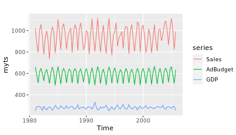
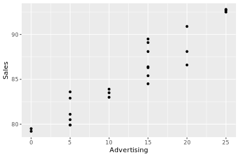
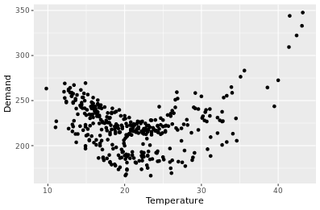
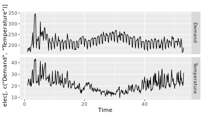

```{r setup, include=FALSE}
knitr::opts_chunk$set(echo = TRUE)
```

**What you will learn**

- Exploring and visualizing time series
- Simple benchmark methods for forecasting
- Exponential smoothing and ARIMA models
- Advanced forecasting methods
- Measuring forecast accuracy
- Choosing the best method


**Time series data**

- series of data observed over time
  - regularly spaced time series

Forecasting is estimating how the sequence of observations will continue into the future.

- What forecasting methods are available that take account of trend, seasonality and other features of the data?
- How to measure the accuracy of your forecasts?
- How to choose a good forecasting model?

**Creating time series objects in R**

A **time series** can be thought of as a vector or matrix of numbers along with some information about what times those numbers were recorded. This information is stored in a `ts` object in R. In most exercises, you will use time series that are part of existing packages. However, if you want to work with your own data, you need to know how to create a `ts` object in R.

Let's look at an example `usnim_2002` below, containing net interest margins for US banks for the year 2002 (source: FFIEC).

```
> usnim_2002
               usnim
1   2002-01-01  4.08
2   2002-04-01  4.10
3   2002-07-01  4.06
4   2002-10-01  4.04

> # ts(data, start, frequency, ...)
> usnim_ts = ts(usnim_2002[, 2], start = c(2002, 1), frequency = 4)
```

The function `ts()` takes in three arguments:

- data is set to everything in `usnim_2002` except for the date column; it isn't needed since the `ts` object will store time information separately.
- `start` is set to the form `c(year, period)` to indicate the time of the first observation. Here, January corresponds with period 1; likewise, a start date in April would refer to 2, July to 3, and October to 4. Thus, *period* corresponds to the *quarter* of the year.
- `frequency` is set to 4 because the data are quarterly.

In this exercise, you will read in some time series data from an xlsx file using `read_excel()`, a function from the `readxl` package, and store the data as a `ts` object. Both the xlsx file and package have been loaded into your workspace.

```
# Read the data from Excel into R
mydata <- read_excel("exercise1.xlsx")

# Look at the first few lines of mydata
head(mydata)
```
```
head(mydata)
          Sales AdBudget   GDP
1 Mar-81 1020.2    659.2 251.8
2 Jun-81  889.2    589.0 290.9
3 Sep-81  795.0    512.5 290.8
4 Dec-81 1003.9    614.1 292.4
5 Mar-82 1057.7    647.2 279.1
6 Jun-82  944.4    602.0 254.0
```
```
# Create a ts object called myts
myts <- ts(mydata[, 2:4], start = c(1981, 1), frequency = 4)
```

You have now created a time series object from external data.

**Time series plots**

The first step in any data analysis task is to plot the data. Graphs enable you to visualize many features of the data, including patterns, unusual observations, changes over time, and relationships between variables. Just as the type of data determines which **forecasting** method to use, it also determines which graphs are appropriate.

You can use the `autoplot()` function to produce a time plot of the data with or without facets, or panels that display different subsets of data:

```
> autoplot(usnim_2002, facets = FALSE)
```

The above method is one of the many taught in this course that accepts boolean arguments. Both `T` and `TRUE` mean "true", and `F` and `FALSE` mean "false", however, `T` and `F` can be overwritten in your code. Therefore, you should *only* rely on `TRUE` and `FALSE` to set your indicators for the remainder of the course.

You will use two more functions in this exercise, `which.max()` and `frequency()`.
`which.max()` can be used to identify the smallest index of the maximum value

```
> x <- c(4, 5, 5)
> which.max(x)
[1] 2
```

To find the number of observations per unit time, use `frequency()`. Recall the `usnim_2002` data from the previous exercise:

```
> frequency(usnim_2002)
[1] 4
```

Because this course involves the use of the `forecast` and `ggplot2` packages, they have been loaded into your workspace for you, as well as `myts` from the previous exercise and the following three series (available in the package `forecast`):

`gold` containing gold prices in US dollars
`woolyrnq` containing information on the production of woollen yarn in Australia
`gas` containing Australian gas production

```
# Plot the data with facetting
autoplot(myts, facets = TRUE)
```

```
# Plot the data without facetting
autoplot(myts, facets = FALSE)
```

```{r}
library(pacman)
p_load(forecast, ggplot2)

# Plot the three series
ggplot2::autoplot(gold)
autoplot(woolyrnq)
autoplot(gas)

# Find the outlier in the gold series
goldoutlier <- which.max(gold)

# Look at the seasonal frequencies of the three series
frequency(gold)
frequency(woolyrnq)
frequency(gas)
```

You can now produce time series plots as well as identify seasonal frequencies.

**Seasonal plots**

Along with time plots, there are other useful ways of plotting data to emphasize seasonal patterns and show changes in these patterns over time.

- A **seasonal plot** is similar to a time plot except that the data are plotted against the individual “seasons” in which the data were observed. You can create one using the `ggseasonplot()` function the same way you do with `autoplot()`.
- An interesting variant of a season plot uses polar coordinates, where the time axis is circular rather than horizontal; to make one, simply add a `polar` argument and set it to `TRUE`.
- A **subseries plot** comprises mini time plots for each season. Here, the mean for each season is shown as a blue horizontal line.

One way of splitting a time series is by using the `window()` function, which extracts a subset from the object `x` observed between the times `start` and `end`.

```
> window(x, start = NULL, end = NULL)
```

In this exercise, you will load the `fpp2` package and use two of its datasets:

- `a10` contains monthly sales volumes for anti-diabetic drugs in Australia. In the plots, can you see which month has the highest sales volume each year? What is unusual about the results in March and April 2008?
- `ausbeer` which contains quarterly beer production for Australia. What is happening to the beer production in Quarter 4?

These examples will help you to visualize these plots and understand how they can be useful.

```{r}
# Load the fpp2 package
p_load(fpp2)

# Create plots of the a10 data
autoplot(a10)
ggseasonplot(a10)

# Produce a polar coordinate season plot for the a10 data
ggseasonplot(a10, polar = TRUE)

# Restrict the ausbeer data to start in 1992
beer <- window(ausbeer, start = 1992)

# Make plots of the beer data
autoplot(beer)
ggsubseriesplot(beer)
```

You can now produce three different types of plots for studying seasonality.

**Trends, seasonality, and cyclicity**


**Seasonal or cyclic?**

Differences between seasonal and cyclic patterns:

- seasonal pattern constant length vs. cyclic pattern variable length
- average length of cycle longer than length of seasonal pattern
- magnitude of cycle more variable than magnitude of seasonal pattern

The timing of peaks and troughs is predictable with seasonal data, but unpredictable in the long term with cyclic data.

**Autocorrelation of non-seasonal time series**

Another way to look at time series data is to plot each observation against another observation that occurred some time previously by using `gglagplot()`. For example, you could plot $y_t$ against $y_{t−1}$. This is called a lag plot because you are plotting the time series against lags of itself.

The correlations associated with the lag plots form what is called the **autocorrelation function (ACF)**. The `ggAcf()` function produces ACF plots.

In this exercise, you will work with the pre-loaded `oil` data (available in the package `fpp2`), which contains the annual oil production in Saudi Arabia from 1965-2013 (measured in millions of tons).

```{r}
# Create an autoplot of the oil data
autoplot(fpp2::oil)

# Create a lag plot of the oil data
gglagplot(oil)

# Create an ACF plot of the oil data
ggAcf(oil)
```

You can now produce plots for lags and autocorrelations.

**Autocorrelation of seasonal and cyclic time series**

When data are either seasonal or cyclic, the ACF will peak around the seasonal lags or at the average cycle length.

You will investigate this phenomenon by plotting the annual sunspot series (which follows the solar cycle of approximately 10-11 years) in `sunspot.year` and the daily traffic to the Hyndsight blog (which follows a 7-day weekly pattern) in `hyndsight`. Both objects have been loaded into your workspace.

```{r}
# Plots of annual sunspot numbers
autoplot(sunspot.year)
ggAcf(sunspot.year)

# Save the lag corresponding to maximum autocorrelation
maxlag_sunspot <- 1

# Plot the traffic on the Hyndsight blog
autoplot(hyndsight)
ggAcf(hyndsight)

# Save the lag corresponding to maximum autocorrelation
maxlag_hyndsight <- 7
```

You can now visualize seasonality in the ACF plots.

**White noise**

- *iid*, or random, independent, individually distributed observations

**Ljung-Box Test**

The Llung-Box test considers the first h autocorrelation values **together**

A significant test (small p-value) indicates the data are probably not white noise.

**White noise summary**

- white noise is a time series that is purely random
- we can test for white noise by looking at an ACF plot or by doing a Ljung-Box test

**Stock prices and white noise**

As you learned in the video, **white noise** is a term that describes purely random data. You can conduct a Ljung-Box test using the function below to confirm the randomness of a series; a p-value greater than 0.05 suggests that the data are not significantly different from white noise.

```
> Box.test(pigs, lag = 24, fitdf = 0, type = "Ljung")
```

There is a well-known result in economics called the "Efficient Market Hypothesis" that states that asset prices reflect all available information. A consequence of this is that the daily changes in stock prices should behave like white noise (ignoring dividends, interest rates and transaction costs). The consequence for forecasters is that the best forecast of the future price is the current price.

You can test this hypothesis by looking at the `goog` series, which contains the closing stock price for Google over 1000 trading days ending on February 13, 2017. This data has been loaded into your workspace.

```{r}
# Plot the original series
autoplot(goog)

# Plot the differenced series
autoplot(diff(goog))

# ACF of the differenced series
ggAcf(diff(goog))

# Ljung-Box test of the differenced series
Box.test(diff(goog), lag = 10, type = "Ljung")
```

You have seen that the Ljung-Box test was not significant, so daily changes in the Google stock price look like white noise.

**Forecasts and potential futures**

- a forecast is the central tendency (e.g., mean. median) of potential simulated futures
  - point forecast is the line in the forecast graph
  - 80% interval is the darker shaded region in the forecast
    - 80% forecast intervals should contain 80% of future observations
  - 95% interval is the lighter shaded region in the forecast
    - 95% forecast intervals should contain 95% of future observations
    
**Naive forecasting methods**

As you learned in the video, a **forecast** is the mean or median of simulated futures of a time series.

The very simplest forecasting method is to use the most recent observation; this is called a **naive** forecast and can be implemented in a namesake function. This is the best that can be done for many time series including most stock price data, and even if it is not a good forecasting method, it provides a useful benchmark for other forecasting methods.

For seasonal data, a related idea is to use the corresponding season from the last year of data. For example, if you want to forecast the sales volume for next March, you would use the sales volume from the previous March. This is implemented in the `snaive()` function, meaning, **seasonal naive**.

For both forecasting methods, you can set the second argument `h`, which specifies the number of values you want to forecast; as shown in the code below, they have different default values. The resulting output is an object of class `forecast`. This is the core class of objects in the `forecast` package, and there are many functions for dealing with them including `summary()` and `autoplot()`.

```
naive(y, h = 10)
snaive(y, h = 2 * frequency(x))
```

You will try these two functions on the `goog` series and `ausbeer` series, respectively. These are available to use in your workspace.

```{r}
# Use naive() to forecast the goog series
fcgoog <- forecast::naive(goog, h = 20)

# Plot and summarize the forecasts
ggplot2::autoplot(fcgoog)
summary(fcgoog)

# Use snaive() to forecast the ausbeer series
fcbeer <- forecast::snaive(ausbeer, h = 16)

# Plot and summarize the forecasts
ggplot2::autoplot(fcbeer)
summary(fcbeer)
```

You have naively forecasted non-seasonal and seasonal time series!

**Fitted values and residuals**

A *fitted* value is the forecast of an observation using all previous observations

- That is, they are one-step forecasts
- often not true forecasts since parameters are estimated on all data

A *residual* is the difference between an observation and its fitted value

- That is, they are one-step forecast errors

**Residuals should look like white noise**

Essential assumptions:

- they should be uncorrelated
- they should have mean zero

Useful properties (for computing prediction intervals):

- they should have constant variance
- they should be normally distributed (Gaussian white noise)

We can test these assumptions using the `checkresiduals()` function.

**Checking time series residuals**

When applying a forecasting method, it is important to always check that the **residuals** are well-behaved (i.e., no outliers or patterns) and resemble white noise. The prediction intervals are computed assuming that the residuals are also normally distributed. You can use the `checkresiduals()` function to verify these characteristics; it will give the results of a Ljung-Box test.

You haven't used the pipe function (`%>%`) so far, but this is a good opportunity to introduce it. When there are many nested functions, pipe functions make the code much easier to read. To be consistent, always follow a function with parentheses to differentiate it from other objects, even if it has no arguments. An example is below:

```
> function(foo)       # These two
> foo %>% function()  # are the same!

> foo %>% function    # Inconsistent
```

In this exercise, you will test the above functions on the forecasts equivalent to what you produced in the previous exercise (`fcgoog` obtained after applying `naive()` to `goog`, and `fcbeer` obtained after applying `snaive()` to `ausbeer`).

```{r}
# Check the residuals from the naive forecasts applied to the goog series
goog %>% naive() %>% checkresiduals()

# Do they look like white noise (TRUE or FALSE)
googwn <- TRUE

# Check the residuals from the seasonal naive forecasts applied to the ausbeer series
ausbeer %>% snaive() %>% checkresiduals()

# Do they look like white noise (TRUE or FALSE)
beerwn <- FALSE
```

You have naively forecasted non-seasonal and seasonal time series.

**Training and test sets**

- the **test set** must **not** be used for any aspect of calculating forecasts
- build forecasts using **training set**
- a model which fits the training data well will **not necessarily forecast well**
  - i.e. overfitting

**Forecast errors**

**Forecast "error" = the difference between observed value and its forecast in the test set**

$\neq$ **residuals**

- which are errors on the **training set** (vs. **test set**)
- which are based on **one-step** forecasts (vs. **multi-step**)

Compute accuracy using forecast errors on test data


MAE and MSE cannot be used to compare series due to scaling problems

MAPE and MASE can be used to compare series
- however, MAPE assumes a natural zero point for the data, and no negative values

**The accuracy() command**

```
accuracy(fc, test)
```

**Evaluating forecast accuracy of non-seasonal methods**

In data science, a **training set** is a data set that is used to discover possible relationships. A **test set** is a data set that is used to verify the strength of these potential relationships. When you separate a data set into these parts, you generally allocate more of the data for training, and less for testing.

One function that can be used to create training and test sets is `subset.ts()`, which returns a subset of a time series where the optional start and end arguments are specified using index values.

```
> # x is a numerical vector or time series
> # To subset observations from 101 to 500
> train <- subset(x, start = 101, end = 500, ...)

> # To subset the first 500 observations
> train <- subset(x, end = 500, ...)
```

As you saw in the video, another function, `accuracy()`, computes various forecast accuracy statistics given the forecasts and the corresponding actual observations. It is smart enough to find the relevant observations if you give it more than the ones you are forecasting.

```
> # f is an object of class "forecast"
> # x is a numerical vector or time series
> accuracy(f, x, ...)
```

The accuracy measures provided include **root mean squared error (RMSE)** which is the square root of the mean squared error (MSE). Minimizing RMSE, which corresponds with increasing accuracy, is the same as minimizing MSE.

The pre-loaded time series `gold` comprises daily gold prices for 1108 days. Here, you'll use the first 1000 days as a training set, and compute forecasts for the remaining 108 days. These will be compared to the actual values for these days using the simple forecasting functions `naive()`, which you used earlier in this chapter, and `meanf()`, which gives forecasts equal to the mean of all observations. You'll have to specify the keyword `h` (which specifies the number of values you want to forecast) for both.

```{r}
# Create the training data as train
train <- subset(gold, end = 1000)

# Compute naive forecasts and save to naive_fc
naive_fc <- naive(train, h = 108)

# Compute mean forecasts and save to mean_fc
mean_fc <- meanf(train, h = 108)

# Use accuracy() to compute RMSE statistics
accuracy(naive_fc, gold)
accuracy(mean_fc, gold)

# Assign one of the two forecasts as bestforecasts
bestforecasts <- naive_fc
```

You have compared two types of forecasts based on their RMSE.

**Evaluating forecast accuracy of seasonal methods**

As you learned in the first chapter, the `window()` function specifies the `start` and `end` of a time series using the relevant times rather than the index values. Either of those two arguments can be formatted as a vector like `c(year, period)` which you have also previously used as an argument for `ts()`. Again, **period** refers to **quarter** here.

Here, you will use the Melbourne quarterly visitor numbers (`vn[, "Melbourne"]`) to create three different training sets, omitting the last 1, 2 and 3 years, respectively. Inspect the pre-loaded `vn` data in your console before beginning the exercise; this will help you determine the correct value to use for the keyword `h` (which specifies the number of values you want to forecast) in your forecasting methods.

Then for each training set, compute the next year of data, and finally compare the **mean absolute percentage error (MAPE)** of the forecasts using `accuracy()`. Why do you think that the MAPE vary so much?

```
# Create three training series omitting the last 1, 2, and 3 years
train1 <- window(vn[, "Melbourne"], end = c(2014, 4))
train2 <- window(vn[, "Melbourne"], end = c(2013, 4))
train3 <- window(vn[, "Melbourne"], end = c(2012, 4))

# Produce forecasts using snaive()
fc1 <- snaive(train1, h = 4)
fc2 <- snaive(train2, h = 4)
fc3 <- snaive(train3, h = 4)

# Use accuracy() to compare the MAPE of each series
accuracy(fc1, vn[, "Melbourne"])["Test set", "MAPE"]
accuracy(fc2, vn[, "Melbourne"])["Test set", "MAPE"]
accuracy(fc3, vn[, "Melbourne"])["Test set", "MAPE"]
```
```
accuracy(fc1, vn[, "Melbourne"])["Test set", "MAPE"]
[1] 5.477917
accuracy(fc2, vn[, "Melbourne"])["Test set", "MAPE"]
[1] 12.50071
accuracy(fc3, vn[, "Melbourne"])["Test set", "MAPE"]
[1] 7.950202
```

Seasonal accuracy is just as easy to compare.

**Time series cross-validation**


**tsCV function**

MSE using time series cross-validation

- choose the model with the smallest MSE computed using time series cross-validation
- compute it at the forecast horizon of most interest to you

**Using tsCV() for time series cross-validation**

The `tsCV()` function computes time series cross-validation errors. It requires you to specify the time series, the forecast method, and the forecast horizon. Here is the example used in the video:

```
> e = tsCV(oil, forecastfunction = naive, h = 1)
```

Here, you will use `tsCV()` to compute and plot the MSE values for up to 8 steps ahead, along with the `naive()` method applied to the `goog` data. The exercise uses `ggplot2` graphics which you may not be familiar with, but we have provided enough of the code so you can work out the rest.

Be sure to reference the slides on `tsCV()` in the lecture. The `goog` data has been loaded into your workspace.

```{r}
# Compute cross-validated errors for up to 8 steps ahead
e <- tsCV(goog, forecastfunction = naive, h = 8)

# Compute the MSE values and remove missing values
mse <- colMeans(e^2, na.rm = TRUE)

# Plot the MSE values against the forecast horizon
data.frame(h = 1:8, MSE = mse) %>%
  ggplot(aes(x = h, y = MSE)) + geom_point()
```

Visualizations are a great way to get a deeper understanding of your model.

**Exponentially weighted forecasts**

**simple exponential smoothing**

Forecasting Notation:
$\hat{y}_{t+h|t}$ = point forecast of $\hat{y}_{t+h}$ given data $y_1,...,y_t$


$\alpha$ indicates weights on more recent data, with higher $\alpha$ indicating higher weights with faster decay over time, and lower weights indicating lower weights with slower decay over time.


two output parameters for `ses()` function:
- l
- alpha

```{r}
# Use ses() to forecast the next 10 years of winning times
fc <- ses(marathon, h = 10)

# Use summary() to see the model parameters
summary(fc)

# Use autoplot() to plot the forecasts
autoplot(fc)

# Add the one-step forecasts for the training data to the plot
autoplot(fc) + autolayer(fitted(fc))
```

You just forecasted using simple exponential smoothing.

**SES vs naive**

In this exercise, you will apply your knowledge of training and test sets, the `subset()` function, and the `accuracy()` function, all of which you learned in Chapter 2, to compare SES and naive forecasts for the `marathon` data.

You did something very similar to compare the naive and mean forecasts in an earlier exercise "Evaluating forecast accuracy of non-seasonal methods".

Let's review the process:

- First, import and load your data. Determine how much of your data you want to allocate to training, and how much to testing; the sets should *not* overlap.
- Subset the data to create a training set, which you will use as an argument in your forecasting function(s). Optionally, you can also create a test set to use later.
- Compute forecasts of the training set using whichever forecasting function(s) you choose, and set `h` equal to the number of values you want to forecast, which is also the length of the test set.
- To view the results, use the `accuracy()` function with the forecast as the first argument and original data (or test set) as the second.
- Pick a measure in the output, such as RMSE or MAE, to evaluate the forecast(s); a smaller error indicates higher accuracy.

The marathon data is loaded into your workspace.

```{r}
# Create a training set using subset()
train <- subset(marathon, end = length(marathon) - 20)

# Compute SES and naive forecasts, save to fcses and fcnaive
fcses <- ses(train, h = 20)
fcnaive <- naive(train, h = 20)

# Calculate forecast accuracy measures
accuracy(fcses, marathon)
accuracy(fcnaive, marathon)

# Save the best forecasts as fcbest
fcbest <- fcnaive
```

More complex models aren't always better!

**Exponential smoothing methods with trend**


**Holt's method in R**

- `holt()`
- assumes a constant slope

**Damped trend method**


- `holt(damped = TRUE)`
- variation of Holt's method, but slope levels off

**Holt's trend methods**

Holt's local trend method is implemented in the `holt()` function:

```
> holt(y, h = 10, ...)
```

Here, you will apply it to the `austa` series, which contains annual counts of international visitors to Australia from 1980-2015 (in millions). The data has been pre-loaded into your workspace.

```{r}
# Produce 10 year forecasts of austa using holt()
fcholt <- holt(austa, h = 10)

# Look at fitted model using summary()
summary(fcholt)

# Plot the forecasts
autoplot(fcholt)

# Check that the residuals look like white noise
checkresiduals(fcholt)
```

Do you think the Holt's trend model gives a good forecast?

**Exponential smoothing methods with trend and seasonality**


**Taxonomy of exponential smoothing methods**


**Holt-Winters with monthly data**

In the video, you learned that the `hw()` function produces forecasts using the Holt-Winters method specific to whatever you set equal to the `seasonal` argument:

```
fc1 <- hw(aust, seasonal = "additive")
fc2 <- hw(aust, seasonal = "multiplicative")
```

Here, you will apply `hw()` to `a10`, the monthly sales of anti-diabetic drugs in Australia from 1991 to 2008. The data are available in your workspace.

```{r}
# Plot the data
autoplot(a10)

# Produce 3 year forecasts
fc <- hw(a10, seasonal = "multiplicative", h = 36)

# Check if residuals look like white noise
checkresiduals(fc)
whitenoise <- FALSE

# Plot forecasts
autoplot(fc)
```

The forecasts might still provide useful information even with residuals that fail the white noise test.

**Holt-Winters method with daily data**

The Holt-Winters method can also be used for daily type of data, where the seasonal pattern is of length 7, and the appropriate unit of time for `h` is in days.

Here, you will compare an additive Holt-Winters method and a seasonal `naive()` method for the `hyndsight` data, which contains the daily pageviews on the Hyndsight blog for one year starting April 30, 2014. The data are available in your workspace.

```{r}
# Create training data with subset()
train <- subset(hyndsight, end = length(hyndsight) - 28)

# Holt-Winters additive forecasts as fchw
fchw <- hw(train, seasonal = "additive", h = 28)

# Seasonal naive forecasts as fcsn
fcsn <- snaive(train, h = 28)

# Find better forecasts with accuracy()
accuracy(fchw, hyndsight)
accuracy(fcsn, hyndsight)

# Plot the better forecasts
autoplot(fchw)
```

Could we do better than both of these models?

**State space models for exponential smoothing**


**ETS models**

- Parameters: estimated using the **"likelihood"**, the probability of the data arsiing from the specified model
- For models with additive errors, this is **equivalent to minimizing SSE**
- Choose the best model by minimizing a corected version of Akaike's Information Criterion $(AIC_c)$
- `ets()`

**Automatic forecasting with exponential smoothing**

The namesake function for finding **errors, trend, and seasonality (ETS)** provides a completely automatic way of producing forecasts for a wide range of time series.

You will now test it on two series, `austa` and `hyndsight`, that you have previously looked at in this chapter. Both have been pre-loaded into your workspace.

```{r}
# Fit ETS model to austa in fitaus
fitaus <- ets(austa)

# Check residuals
checkresiduals(fitaus)

# Plot forecasts
autoplot(forecast(fitaus))

# Repeat for hyndsight data in fiths
fiths <- ets(hyndsight)
checkresiduals(fiths)
autoplot(forecast(fiths))

# Which model(s) fails test? (TRUE or FALSE)
fitausfail <- FALSE
fithsfail <- TRUE
```

The automatic forecasting is great for getting quick results.

**ETS vs seasonal naive**

Here, you will compare ETS forecasts against seasonal naive forecasting for 20 years of `cement`, which contains quarterly cement production using time series cross-validation for 4 steps ahead. Because this takes a while to run, a shortened version of the `cement` series will be available in your workspace.

The second argument for `tsCV()` must return a forecast object, so you need a function to fit a model and return forecasts. Recall:

```
> args(tsCV)
function (y, forecastfunction, h = 1, ...)
```

In this exercise you will use an existing forecasting function as well as one that has been created for you. Remember, sometimes simple methods work better than more sophisticated methods!

```
# Function to return ETS forecasts
fets <- function(y, h) {
  forecast(ets(y), h = h)
}

# Apply tsCV() for both methods
e1 <- tsCV(cement, fets, h = 4)
e2 <- tsCV(cement, snaive, h = 4)

# Compute MSE of resulting errors (watch out for missing values)
mean(e1^2, na.rm = TRUE)
mean(e2^2, na.rm = TRUE)
```
```
[1] 0.0329896
[1] 0.03046892
```
```
# Copy the best forecast MSE
bestmse <- mean(e2^2, na.rm = TRUE)
```

Complex isn't always better.

**When does ETS fail?**

Computing the ETS does not work well for all series.

Here, you will observe why it does not work well for the annual Canadian lynx population available in your workspace as `lynx`.

```{r}
# Plot the lynx series
autoplot(lynx)

# Use ets() to model the lynx series
fit <- ets(lynx)

# Use summary() to look at model and parameters
summary(fit)

# Plot 20-year forecasts of the lynx series
fit %>% forecast(h = 20) %>% autoplot()
```

It's important to realize that ETS doesn't work for all cases.

**Transformations for variance stabilization**

**Variance stabilization**

- if the data show increasing variation as the level of the series increases, then a **transformation** can be useful
- $y_1,...y_n$: original observations, $w_1,..., w_n$: transformed observations


`BoxCox.lambda()`


**Box-Cox transformations for time series**

Here, you will use a **Box-Cox transformation** to stabilize the variance of the pre-loaded `a10` series, which contains monthly anti-diabetic drug sales in Australia from 1991-2008.

In this exercise, you will need to experiment to see the effect of the `lambda` $(\lambda)$ argument on the transformation. Notice that small changes in $\lambda$ make little difference to the resulting series. You want to find a value of $\lambda$ that makes the seasonal fluctuations of roughly the same size across the series.

Recall from the video that the recommended range for `lambda` values is $−1 \leq \lambda \leq 1$.

```{r}
# Plot the series
autoplot(a10)

# Try four values of lambda in Box-Cox transformations
a10 %>% BoxCox(lambda = 0.0) %>% autoplot()
a10 %>% BoxCox(lambda = 0.1) %>% autoplot()
a10 %>% BoxCox(lambda = 0.2) %>% autoplot()
a10 %>% BoxCox(lambda = 0.3) %>% autoplot()

# Compare with BoxCox.lambda()
BoxCox.lambda(a10)
```

It seems like a lambda of .13 would work well.

**Non-seasonal differencing for stationarity**

**Differencing** is a way of making a time series stationary; this means that you remove any systematic patterns such as trend and seasonality from the data. A white noise series is considered a special case of a stationary time series.

With non-seasonal data, you use lag-1 differences to model changes between observations rather than the observations directly. You have done this before by using the `diff()` function.

In this exercise, you will use the pre-loaded `wmurders` data, which contains the annual female murder rate in the US from 1950-2004.

```{r}
# Plot the US female murder rate
autoplot(wmurders)

# Plot the differenced murder rate
autoplot(diff(wmurders))

# Plot the ACF of the differenced murder rate
ggAcf(diff(wmurders))
```

It seems like the data look like white noise after differencing.

**Seasonal differencing for stationarity**

With seasonal data, differences are often taken between observations in the same season of consecutive years, rather than in consecutive periods. For example, with quarterly data, one would take the difference between Q1 in one year and Q1 in the previous year. This is called **seasonal differencing**.

Sometimes you need to apply both seasonal differences and lag-1 differences to the same series, thus, calculating the differences in the differences.

In this exercise, you will use differencing and transformations simultaneously to make a time series look stationary. The data set here is `h02`, which contains 17 years of monthly corticosteroid drug sales in Australia. It has been loaded into your workspace.

```{r}
# Plot the data
autoplot(h02)

# Take logs and seasonal differences of h02
difflogh02 <- diff(log(h02), lag = 12)

# Plot difflogh02
autoplot(difflogh02)

# Take another difference and plot
ddifflogh02 <- diff(difflogh02)
autoplot(ddifflogh02)

# Plot ACF of ddifflogh02
ggAcf(ddifflogh02)
```

The data doesn't look like white noise after the transformation, but you could develop an ARIMA model for it.

**ARIMA models**


**How does auto.arima() work?**

Hyndman-Khandakar algorithm:

- select number of differences $d$ via unit root tests
- select $p$ and $q$ by minimizing $AIC_c$
- estimate parameters using *maximum likelihood estimation*
- use stepwise search to traverse model space, to save time

**Automatic ARIMA models for non-seasonal time series**

In the video, you learned that the `auto.arima()` function will select an appropriate **autoregressive integrated moving average (ARIMA)** model given a time series, just like the `ets()` function does for ETS models. The `summary()` function can provide some additional insights:

```
> # p = 2, d = 1, p = 2
> summary(fit)

Series: usnetelec
ARIMA(2,1,2) with drift
...
```

In this exercise, you will automatically choose an ARIMA model for the pre-loaded `austa` series, which contains the annual number of international visitors to Australia from 1980-2015. You will then check the residuals (recall that a p-value greater than 0.05 indicates that the data resembles white noise) and produce some forecasts. Other than the modelling function, this is identical to what you did with ETS forecasting.

```{r}
# Fit an automatic ARIMA model to the austa series
fit <- auto.arima(austa)

# Check that the residuals look like white noise
checkresiduals(fit)
residualsok <- TRUE

# Summarize the model
summary(fit)

# Find the AICc value and the number of differences used
AICc <- -14.46
d <- 1

# Plot forecasts of fit
fit %>% forecast(h = 10) %>% autoplot()
```

It looks like the ARIMA model created a pretty good forecast for you.

**Forecasting with ARIMA models**

The automatic method in the previous exercise chose an ARIMA(0,1,1) with drift model for the `austa` data, that is, $y_t=c+y_{t−1}+ \theta e_{t−1}+e_t$. You will now experiment with various other ARIMA models for the data to see what difference it makes to the forecasts.

The `Arima()` function can be used to select a specific ARIMA model. Its first argument, `order`, is set to a vector that specifies the values of $p$, $d$ and $q$. The second argument, `include.constant`, is a booolean that determines if the constant $c$, or **drift**, should be included. Below is an example of a pipe function that would plot forecasts of `usnetelec` from an ARIMA(2,1,2) model with drift:

```
> usnetelec %>%
    Arima(order = c(2,1,2), include.constant = TRUE) %>%
    forecast() %>%
    autoplot()
```

In the examples here, watch for how the different models affect the forecasts and the prediction intervals. The `austa` data is ready for you to use in your workspace.

```{r}
# Plot forecasts from an ARIMA(0,1,1) model with no drift
austa %>% Arima(order = c(0,1,1), include.constant = FALSE) %>% forecast() %>% autoplot()

# Plot forecasts from an ARIMA(2,1,3) model with drift
austa %>% Arima(order = c(2,1,3), include.constant = TRUE) %>% forecast() %>% autoplot()

# Plot forecasts from an ARIMA(0,0,1) model with a constant
austa %>% Arima(order = c(0,0,1), include.constant = TRUE) %>% forecast() %>% autoplot()

# Plot forecasts from an ARIMA(0,2,1) model with no constant
austa %>% Arima(order = c(0,2,1), include.constant = FALSE) %>% forecast() %>% autoplot()
```

The model specification makes a big impact on the forecast!

**Comparing auto.arima() and ets() on non-seasonal data**

The AICc statistic is useful for selecting between models in the *same* class. For example, you can use it to select an ETS model or to select an ARIMA model. However, you cannot use it to compare ETS and ARIMA models because they are in *different* model classes.

Instead, you can use time series cross-validation to compare an ARIMA model and an ETS model on the `austa` data. Because `tsCV()` requires functions that return forecast objects, you will set up some simple functions that fit the models and return the forecasts. The arguments of `tsCV()` are a time series, forecast function, and forecast horizon `h`. Examine this code snippet from the second chapter:

```
e <- matrix(NA_real_, nrow = 1000, ncol = 8)
for (h in 1:8)
  e[, h] <- tsCV(goog, naive, h = h)
  ...
```

Furthermore, recall that pipe operators in R take the value of whatever is on the left and pass it as an argument to whatever is on the right, step by step, from left to right. Here's an example based on code you saw in an earlier chapter:

```
# Plot 20-year forecasts of the lynx series modeled by ets()
lynx %>% ets() %>% forecast(h = 20) %>% autoplot()
```

In this exercise, you will compare the MSE of two forecast functions applied to `austa`, and plot forecasts of the function that computes the best forecasts. Once again, `austa` has been loaded into your workspace.

```{r}
# Set up forecast functions for ETS and ARIMA models
fets <- function(x, h) {
  forecast(ets(x), h = h)
}
farima <- function(x, h) {
  forecast(auto.arima(x), h = h)
}

# Compute CV errors for ETS on austa as e1
e1 <- tsCV(austa, fets, h = 1)

# Compute CV errors for ARIMA on austa as e2
e2 <- tsCV(austa, farima, h = 1)

# Find MSE of each model class
mean(e1^2, na.rm = TRUE)
mean(e2^2, na.rm = TRUE)

# Plot 10-year forecasts using the best model class
austa %>% farima(h = 10) %>% autoplot()
```

Now you know how to compare across model classes.

**Seasonal ARIMA models**


p = autoregression terms
d = differences
q = lagged errors

**Automatic ARIMA models for seasonal time series**

As you learned in the video, the `auto.arima()` function also works with seasonal data. Note that setting `lambda = 0` in the `auto.arima()` function - applying a log transformation - means that the model will be fitted to the transformed data, and that the forecasts will be back-transformed onto the original scale.

After applying `summary()` to this kind of fitted model, you may see something like the output below which corresponds with $(p,d,q)(P,D,Q)[m]:$

```
ARIMA(0,1,4)(0,1,1)[12]
```

In this exercise, you will use these functions to model and forecast the pre-loaded `h02` data, which contains monthly sales of cortecosteroid drugs in Australia.

```{r}
# Check that the logged h02 data have stable variance
h02 %>% log() %>% autoplot()

# Fit a seasonal ARIMA model to h02 with lambda = 0
fit <- auto.arima(h02, lambda = 0)

# Summarize the fitted model
summary(fit)

# Record the amount of lag-1 differencing and seasonal differencing used
d <- 1
D <- 1

# Plot 2-year forecasts
fit %>% forecast(h = 24) %>% autoplot()
```

`auto.arima()` is flexible enough to even work with seasonal time series!

**Exploring auto.arima() options**

The `auto.arima()` function needs to estimate a lot of different models, and various short-cuts are used to try to make the function as fast as possible. This can cause a model to be returned which does not actually have the smallest AICc value. To make `auto.arima()` work harder to find a good model, add the optional argument `stepwise = FALSE` to look at a much larger collection of models.

Here, you will try finding an ARIMA model for the pre-loaded `euretail` data, which contains quarterly retail trade in the Euro area from 1996-2011. Inspect it in the console before beginning this exercise.

```{r}
# Find an ARIMA model for euretail
fit1 <- auto.arima(euretail)

# Don't use a stepwise search
fit2 <- auto.arima(euretail, stepwise = FALSE)

# AICc of better model
AICc <- 68.39

# Compute 2-year forecasts from better model
fit2 %>% forecast(h = 8) %>% autoplot()
```

`auto.arima()` has a wealth of options that are worth exploring.

**Comparing auto.arima() and ets() on seasonal data**

What happens when you want to create training and test sets for data that is more frequent than yearly? If needed, you can use a vector in form `c(year, period)` for the `start` and/or `end` keywords in the `window()` function. You must also ensure that you're using the appropriate values of `h` in forecasting functions. Recall that `h` should be equal to the length of the data that makes up your test set.

For example, if your data spans 15 years, your training set consists of the first 10 years, and you intend to forecast the last 5 years of data, you would use `h = 12 * 5` not `h = 5` because your test set would include 60 monthly observations. If instead your training set consists of the first 9.5 years and you want forecast the last 5.5 years, you would use `h = 66` to account for the extra 6 months.

In the final exercise for this chapter, you will compare seasonal ARIMA and ETS models applied to the quarterly cement production data `qcement`. Because the series is very long, you can afford to use a training and test set rather than time series cross-validation. This is much faster.

The `qcement` data is available to use in your workspace.

```{r}
# Use 20 years of the qcement data beginning in 1988
train <- window(qcement, start = 1988, end = c(2007, 4))

# Fit an ARIMA and an ETS model to the training data
fit1 <- auto.arima(train)
fit2 <- ets(train)

# Check that both models have white noise residuals
checkresiduals(fit1)
checkresiduals(fit2)

# Produce forecasts for each model
fc1 <- forecast(fit1, h = 25)
fc2 <- forecast(fit2, h = 25)

# Use accuracy() to find best model based on RMSE
accuracy(fc1, qcement)
accuracy(fc2, qcement)
bettermodel <- fit2
```

Looks like the ETS model did better here.

**Dynamic regression**


**Forecasting sales allowing for advertising expenditure**

Welcome to the last chapter of the course!

The `auto.arima()` function will fit a dynamic regression model with ARIMA errors. The only change to how you used it previously is that you will now use the `xreg` argument containing a matrix of regression variables. Here are some code snippets from the video:

```
> fit <- auto.arima(uschange[, "Consumption"],
                    xreg = uschange[, "Income"])

> # rep(x, times)
> fcast <- forecast(fit, xreg = rep(0.8, 8))
```

You can see that the data is set to the `Consumption` column of `uschange`, and the regression variable is the `Income` column. Furthermore, the `rep()` function in this case would replicate the value 0.8 exactly eight times for the matrix argument `xreg`.

In this exercise, you will model sales data regressed against advertising expenditure, with an ARMA error to account for any serial correlation in the regression errors. The data are available in your workspace as `advert` and comprise 24 months of sales and advertising expenditure for an automotive parts company. The plot shows sales vs advertising expenditure.

Think through everything you have learned so far in this course, inspect the `advert` data in your console, and read each instruction carefully to tackle this challenging exercise.



```{r}
# Time plot of both variables
autoplot(advert, facets = TRUE)

# Fit ARIMA model
fit <- auto.arima(advert[, "sales"], xreg = advert[, "advert"], stationary = TRUE)

# Check model. Increase in sales for each unit increase in advertising
salesincrease <- coefficients(fit)[3]

# Forecast fit as fc
fc <- forecast(fit, xreg = rep(10, 6))

# Plot fc with x and y labels
autoplot(fc) + xlab("Month") + ylab("Sales")
```

The dynamic regression allows you to include other outside information into your forecast.

**Forecasting electricity demand**

You can also model daily electricity demand as a function of temperature. As you may have seen on your electric bill, more electricity is used on hot days due to air conditioning and on cold days due to heating.

In this exercise, you will fit a quadratic regression model with an ARMA error. One year of daily data are stored as `elec` including total daily demand, an indicator variable for workdays (a workday is represented with 1, and a non-workday is represented with 0), and daily maximum temperatures. Because there is weekly seasonality, the `frequency` has been set to 7.

Let's take a look at the first three rows:

```
> elec[1:3, ]
       Demand Temperature Workday
[1,] 168.2798        20.2       0
[2,] 183.0822        21.9       1
[3,] 184.5135        25.1       1
```

elec has been pre-loaded into your workspace.



```
# Time plots of demand and temperatures
autoplot(elec[, c("Demand", "Temperature")], facets = TRUE)
```

```
# Matrix of regressors
xreg <- cbind(MaxTemp = elec[, "Temperature"], 
              MaxTempSq = elec[, "Temperature"]^2, 
              Workday = elec[, "Workday"])

# Fit model
fit <- auto.arima(elec[, "Demand"], xreg = xreg)

# Forecast fit one day ahead
forecast(fit, xreg = cbind(20, 20^2, 1))
```
```
Warning message: xreg contains different column names from the xreg used in training. Please check that the regressors are in the same order.
         Point Forecast    Lo 80    Hi 80    Lo 95    Hi 95
53.14286       204.7168 196.1512 213.2823 191.6169 217.8166
```

Now you've seen how multiple independent variables can be included using matrices.

**Dynamic harmonic regression**


**Forecasting weekly data**

With weekly data, it is difficult to handle seasonality using ETS or ARIMA models as the seasonal length is too large (approximately 52). Instead, you can use harmonic regression which uses sines and cosines to model the seasonality.

The `fourier()` function makes it easy to generate the required harmonics. The higher the order $(K)$, the more "wiggly" the seasonal pattern is allowed to be. With $K=1$, it is a simple sine curve. You can select the value of $K$ by minimizing the AICc value. As you saw in the video, `fourier()` takes in a required time series, required number of Fourier terms to generate, and optional number of rows it needs to forecast:

```
> # fourier(x, K, h = NULL)

> fit <- auto.arima(cafe, xreg = fourier(cafe, K = 6),
                    seasonal = FALSE, lambda = 0)
> fit %>%
    forecast(xreg = fourier(cafe, K = 6, h = 24)) %>%
    autoplot() + ylim(1.6, 5.1)
```

The pre-loaded `gasoline` data comprises weekly data on US finished motor gasoline products. In this exercise, you will fit a harmonic regression to this data set and forecast the next 3 years.

```{r}
# Set up harmonic regressors of order 13
harmonics <- fourier(gasoline, K = 13)

# Fit regression model with ARIMA errors
fit <- auto.arima(gasoline, xreg = harmonics, seasonal = FALSE)

# Forecasts next 3 years
newharmonics <- fourier(gasoline, K = 13, h = 156)
fc <- forecast(fit, xreg = newharmonics)

# Plot forecasts fc
autoplot(fc)
```

The point predictions look to be a bit low.

**Harmonic regression for multiple seasonality**

Harmonic regressions are also useful when time series have multiple seasonal patterns. For example, `taylor` contains half-hourly electricity demand in England and Wales over a few months in the year 2000. The seasonal periods are 48 (daily seasonality) and 7 x 48 = 336 (weekly seasonality). There is not enough data to consider annual seasonality.

`auto.arima()` would take a long time to fit a long time series such as this one, so instead you will fit a standard regression model with Fourier terms using the `tslm()` function. This is very similar to `lm()` but is designed to handle time series. With multiple seasonality, you need to specify the order $K$ for each of the seasonal periods.

```
# The formula argument is a symbolic description
# of the model to be fitted

> args(tslm)
function (formula, ...)
```

`tslm()` is a newly introduced function, so you should be able to follow the pre-written code for the most part. The `taylor` data are loaded into your workspace.

```{r}
# Fit a harmonic regression using order 10 for each type of seasonality
fit <- tslm(taylor ~ fourier(taylor, K = c(10, 10)))

# Forecast 20 working days ahead
fc <- forecast(fit, newdata = data.frame(fourier(taylor, K = c(10, 10), h = 20 * 48)))

# Plot the forecasts
autoplot(fc)

# Check the residuals of fit
checkresiduals(fit)
```

The residuals from the fitted model fail the tests badly, yet the forecasts are quite good.

**Forecasting call bookings**

Another time series with multiple seasonal periods is `calls`, which contains 20 consecutive days of 5-minute call volume data for a large North American bank. There are 169 5-minute periods in a working day, and so the weekly seasonal frequency is 5 x 169 = 845. The weekly seasonality is relatively weak, so here you will just model daily seasonality. `calls` is pre-loaded into your workspace.

The residuals in this case still fail the white noise tests, but their autocorrelations are tiny, even though they are significant. This is because the series is so long. It is often unrealistic to have residuals that pass the tests for such long series. The effect of the remaining correlations on the forecasts will be negligible.

```{r}
# Plot the calls data
autoplot(calls)

# Set up the xreg matrix
xreg <- fourier(calls, K = c(10, 0))

# Fit a dynamic regression model
fit <- auto.arima(calls, xreg = xreg, seasonal = FALSE, stationary = TRUE)

# Check the residuals
checkresiduals(fit)

# Plot forecast for 10 working days ahead
fc <- forecast(fit, xreg = fourier(calls, c(10, 0), h = 1690))
autoplot(fc)
```

Now you've gotten a lot of experience using complex forecasting techniques.

**TBATS models**

- **T**rigonometric terms for seasonality
- **B**ox-Cox transformations for heterogeneity
- **A**RMA errors for short-term dynamics
- **T**rend (possibly damped)
- **S**easonal (including multiple and non-integer periods)
- Handles non-integer seasonality, multiple seasonal periods
- Entirely automated
- Prediction intervals often too wide
- Very slow on long series

**TBATS models for electricity demand**

As you saw in the video, a **TBATS model** is a special kind of time series model. It can be very slow to estimate, especially with multiple seasonal time series, so in this exercise you will try it on a simpler series to save time. Let's break down elements of a TBATS model in `TBATS(1, {0,0}, -, {<51.18,14>})`, one of the graph titles from the video:

**Component**   |	**Meaning**
--------------  |------------
1	              | Box-Cox transformation parameter
{0,0}           |	ARMA error
-	              | Damping parameter
${<51.18,14>}$	| Seasonal period, Fourier terms


The `gas` data contains Australian monthly gas production. A plot of the data shows the variance has changed a lot over time, so it needs a transformation. The seasonality has also changed shape over time, and there is a strong trend. This makes it an ideal series to test the `tbats()` function which is designed to handle these features.

`gas` is available to use in your workspace.

```{r}
# Plot the gas data
autoplot(gas)

# Fit a TBATS model to the gas data
fit <- tbats(gas)

# Forecast the series for the next 5 years
fc <- forecast(fit, h = 12 * 5)

# Plot the forecasts
autoplot(fc)

# Record the Box-Cox parameter and the order of the Fourier terms
lambda <- 0.082
K <- 5
```

Just remember that completely automated solutions don't work every time.

**Your future in forecasting!**

