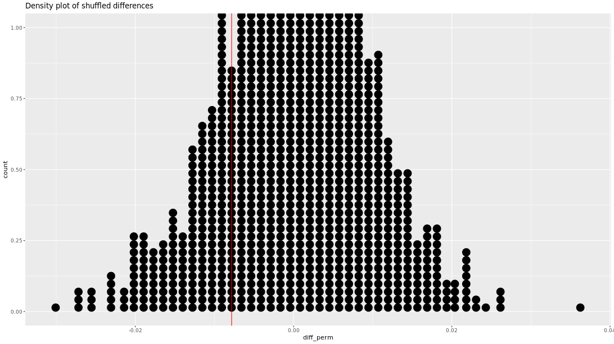

```{r setup, include=FALSE}
knitr::opts_chunk$set(echo = TRUE)
options(repos="https://CRAN.R-project.org")
```

## Welcome to the course!


**Working with the NHANES data**

Throughout this chapter, you will use the `NHANES` dataset from the [NHANES](https://www.rdocumentation.org/packages/NHANES/topics/NHANES) R package. The data are collected by the Center for Disease Control (CDC, the national public health institute in the United States) and can be thought of as a random sample of US residents.

Before moving on to investigate particular variables, you'll have an opportunity to briefly explore the data in this exercise.

```{r}
# Load packages
library(NHANES)
library(ggplot2)

# What are the variables in the NHANES dataset?
colnames(NHANES)

# Create bar plot for Home Ownership by Gender
ggplot(NHANES, aes(x = Gender, fill = HomeOwn)) + 
  # Set the position to fill
  geom_bar(position = "fill") +
  ylab("Relative frequencies")

# Density plot of SleepHrsNight colored by SleepTrouble
ggplot(NHANES, aes(x = SleepHrsNight, color = SleepTrouble)) + 
  # Adjust by 2
  geom_density(adjust = 2) + 
  # Facet by HealthGen
  facet_wrap(~ HealthGen)
```

Great work! Notice that the warning message for the densities and the grey portions of the bars both indicate a large number of missing observations in the dataset. If this were your dataset, it would be important to stop here and consider the cause of the missingness. For the course, we will now proceed without worrying about the missing observations.

**Calculating statistic of interest**

Using the `NHANES` dataset, let's investigate the relationship between gender and home ownership. Remember, more information about the dataset can be found here: [NHANES](https://www.rdocumentation.org/packages/NHANES/topics/NHANES).

As seen in the video, natural variability can be modeled from shuffling observations around to remove any relationships that might exist in the population. However, before you permute the data, you need to calculate the original observed statistic. In this exercise, you will calculate the difference in proportion of home owners who are men versus women.

Recall that:

- `%in%` returns a logical vector that is `TRUE` when values on the left hand side are listed on the right hand side.
- The mean of a logical vector is the proportion of cases where that vector is `TRUE`.

```
fruits <- c("apple", "banana", "cherry")
fruits %in% c("banana", "cherry")
mean(fruits %in% c("banana", "cherry"))
```

```{r}
library(dplyr)

(homes <- NHANES %>%
  # Select Gender and HomeOwn
  select(Gender, HomeOwn) %>%
  # Filter for HomeOwn equal to "Own" or "Rent"
  filter(HomeOwn %in% c("Own", "Rent")))

diff_orig <- homes %>%   
  # Group by gender
  group_by(Gender) %>%
  # Summarize proportion of homeowners
  summarize(prop_own = mean(HomeOwn == "Own")) %T>% print %>%
  # Summarize difference in proportion of homeowners
  summarize(obs_diff_prop = diff(prop_own)) # male - female
  
# See the result
diff_orig
```

Great work! Now that you have the observed difference in proportions, you'll move on to calculating the difference in proportions for randomized datasets.

**Randomized data under null model of independence**

The `infer` package will allow you to model a particular null hypothesis and then randomize the data to calculate permuted statistics. In this exercise, after specifying your null hypothesis you will permute the home ownership variable 10 times. By doing so, you will ensure that there is no relationship between home ownership and gender, so any difference in home ownership proportion for female versus male will be due only to natural variability.

This exercise will demonstrate the first three steps from the `infer` package:

- `specify` will specify the response and explanatory variables.
- `hypothesize` will declare the null hypothesis.
- `generate` will generate resamples, permutations, or simulations.

The `dplyr`, `ggplot2`, `NHANES`, and `infer` packages have been loaded for you and the `homes` dataset you created in the last exercise is available in your workspace.

```{r}
library(infer)

# Specify variables
homeown_perm <- homes %>%
  specify(HomeOwn ~ Gender, success = "Own")

# Print results to console
homeown_perm

# Hypothesize independence
homeown_perm <- homes %>%
  specify(HomeOwn ~ Gender, success = "Own") %>%
  hypothesize(null = "independence")  

# Print results to console
homeown_perm

# Perform 10 permutations
homeown_perm <- homes %>%
  specify(HomeOwn ~ Gender, success = "Own") %>%
  hypothesize(null = "independence") %>% 
  generate(reps = 10, type = "permute") 


# Print results to console
homeown_perm
```

Great work! Notice that you went through three sequential steps: (1) the response and explanatory variables were defined by the `specify` command, (2) the independence null hypothesis was set, and (3) you successfully shuffled the response variable, `HomeOwn`, ten times.

**Randomized statistics and dotplot**

By permuting the home ownership variable multiple times, you generate differences in proportions that are consistent with the assumption that the variables are unrelated. The statistic of interest is the difference in proportions given by `stat = "diff in props"`. After calculating the randomized statistics, you will plot them in a dotplot.

This exercise shows all four steps from the `infer` package:

- `specify` will specify the response and explanatory variables.
- `hypothesize` will declare the null hypothesis.
- `generate` will generate resamples, permutations, or simulations.
- `calculate` will calculate summary statistics.

Each step will be covered throughout the course; in this exercise you'll write code for `calculate()`.

The `dplyr`, `ggplot2`, `NHANES`, and `infer` packages have been loaded for you. Repeat the permuting and plotting with 100 differences in proportions generated by shuffling the `HomeOwn` variable.

```{r}
# Perform 100 permutations
homeown_perm <- homes %>%
  specify(HomeOwn ~ Gender, success = "Own") %>%
  hypothesize(null = "independence") %>% 
  generate(reps = 100, type = "permute") %>% 
  calculate(stat = "diff in props", order = c("male", "female"))
  
# Print results to console
homeown_perm
  
# Dotplot of 100 permuted differences in proportions
ggplot(homeown_perm, aes(x = stat)) + 
  geom_dotplot(binwidth = 0.001)
```

Nice! It's much easier to get a feel for the distribution of randomized statistics now. In the next exercise, you'll see how 1000 randomized statistics are distributed.

**Randomization density**

Using 100 repetitions allows you to understand the mechanism of permuting. However, 100 is not enough to observe the full range of likely values for the null differences in proportions.

Recall the four steps of inference. These are the same four steps that will be used in all inference exercises in this course and future statistical inference courses. Use the names of the functions to help you recall the analysis process.

- `specify` will specify the response and explanatory variables.
- `hypothesize` will declare the null hypothesis.
- `generate` will generate resamples, permutations, or simulations.
- `calculate` will calculate summary statistics.

In this exercise, you'll repeat the process 1000 times to get a sense for the complete distribution of null differences in proportions.

```{r}
# Perform 1000 permutations
  # Specify HomeOwn vs. Gender, with `"Own" as success
homeown_perm <- homes %>%
  specify(HomeOwn ~ Gender, success = "Own") %>%
  # Use a null hypothesis of independence
  hypothesize(null = "independence") %>% 
  # Generate 1000 repetitions (by permutation)
  generate(reps = 1000, type = "permute") %>% 
  # Calculate the difference in proportions (male then female)
  calculate(stat = "diff in props", order = c("male", "female"))

# Density plot of 1000 permuted differences in proportions
ggplot(homeown_perm, aes(x = stat)) + 
  geom_density()
```

Great work! You can now see that the distribution is approximately normally distributed around -0.01, but what can we conclude from it? You'll learn how to use this distribution in the next video.

## Using the randomization distribution


**Do the data come from the population?**
Recall that the observed difference (i.e. the difference in proportions in the `homes` dataset, shown as the red vertical line) was around -0.0078, which seems to fall below the bulk of the density of shuffled differences. It is important to know, however, whether any of the randomly permuted differences were as extreme as the observed difference.

In this exercise, you'll re-create this dotplot as a density plot and count the number of permuted differences that were to the left of the observed difference.



```{r}
homeown_perm <- homeown_perm %>% mutate(diff_perm = stat, diff_orig = -0.00783) %>% select (-stat)

# Plot permuted differences, diff_perm
ggplot(homeown_perm, aes(x = diff_perm)) +
  # Add a density layer
  geom_density() +
  # Add a vline layer with intercept diff_orig
  geom_vline(aes(xintercept = diff_orig), color = "red")

# Compare permuted differences to observed difference
homeown_perm %>%
  summarize(n_perm_le_obs = sum(diff_perm <= diff_orig))
```

Nice work! 212 permuted differences are more extreme than the observed difference. This only represents 21.2% of the null statistics, so you can conclude that the observed difference is consistent with the permuted distribution.

We have learned that our data is consistent with the hypothesis of no difference in home ownership across gender.

We've failed to reject the null hypothesis.

## Study conclusions


## Example: gender discrimination


$H_0$: gender and promotion are unrelated variables.
$H_A$: men are more likely to be promoted.

**Summarizing gender discrimination**

As the first step of any analysis, you should look at and summarize the data. Categorical variables are often summarized using proportions, and it is always important to understand the denominator of the proportion.

Do you want the proportion of women who were promoted or the proportion of promoted individuals who were women? Here, you want the first of these, so in your R code it's necessary to `group_by()` the `sex` variable.

The discrimination study data are available in your workspace as `disc`.

```{r}
(disc <- tibble(
  promote = c(rep("promoted", 35), rep("not promoted", 13)),
  sex = c(rep("male", 21), rep("female", 14), rep("male", 3), rep("female", 10))
))

# Create a contingency table summarizing the data
disc %>%
  # Count the rows by sex, promote
  count(sex, promote)

# Find proportion of each sex who were promoted
disc %>%
  # Group by sex
  group_by(sex) %>%
  # Calculate proportion promoted summary stat
  summarize(promoted_prop = mean(promote == "promoted"))
```

Okay, so the difference in proportions promoted is almost 0.3. Great work!

**Step-by-step through the permutation**

To help you understand the code used to create the randomization distribution, this exercise will walk you through the steps of the `infer` framework. In particular, you'll see how differences in the generated replicates affect the calculated statistics.

After running the `infer` steps, be sure to notice that the numbers are slightly different for each replicate.

```{r}
# Replicate the entire data frame, permuting the promote variable
disc_perm <- disc %>%
  specify(promote ~ sex, success = "promoted") %>%
  hypothesize(null = "independence") %>%
  generate(reps = 5, type = "permute")

disc_perm %>%
  # Group by replicate
  group_by(replicate) %>%
  # Count per group
  count()

disc_perm %>%
  # Calculate difference in proportion, male then female
  calculate(stat = "diff in props", order = c("male", "female"))
```

Cool calculating! Each replicate had slightly different counts of promotion and sex, which led to slightly different statistics being calculated for each replicate.

**Randomizing gender discrimination**

Recall that we are considering a situation where the number of men and women are fixed (representing the resumes) and the number of people promoted is fixed (the managers were able to promote only 35 individuals).

In this exercise, you'll create a randomization distribution of the null statistic with 1000 replicates as opposed to just 5 in the previous exercise. As a reminder, the statistic of interest is the difference in proportions promoted between genders (i.e. proportion for males minus proportion for females). From the original dataset, you can calculate how the promotion rates differ between males and females. Using the specify-hypothesis-generate-calculate workflow in `infer`, you can calculate the same statistic, but instead of getting a single number, you get a whole distribution. In this exercise, you'll compare that single number from the original dataset to the distribution made by the simulation.

```{r}
# Calculate the observed difference in promotion rate
diff_orig <- disc %>%
  # Group by sex
  group_by(sex) %>%
  # Summarize to calculate fraction promoted
  summarize(prop_prom = mean(promote == "promoted")) %>%
  # Summarize to calculate difference
  summarize(stat = diff(prop_prom)) %>% 
  pull()
    
# See the result
diff_orig

disc_perm <- disc %>%
  # Specify promote vs. sex
  specify(promote ~ sex, success = "promoted") %>%
  # Set null hypothesis as independence
  hypothesize(null = "independence") %>%
  # Generate 1000 permutations
  generate(reps = 1000, type = "permute") %>%
  # Calculate difference in proportions
  calculate(stat = "diff in props", order = c("male", "female"))

# Using permutation data, plot stat
ggplot(disc_perm, aes(x = stat)) + 
  # Add a histogram layer
  geom_histogram(binwidth = 0.01) +
  # Add a vertical line at diff_orig
  geom_vline(aes(xintercept = diff_orig), color = "red")
```

In the population there is evidence that women are promoted at a different rate, but we cannot tell whether the difference is due to discrimination or something else.

There are very few permuted differences which are as extreme as the observed difference, but there cannot be a causative conclusion because the study was observational.

Great work! You'll learn more about the distribution of statistics in the next video.

## Distribution of statistics


**Critical region**

It seems as though the statistic — a difference in promotion rates of 0.2917 — is on the extreme end of the permutation distribution. That is, there are very few permuted differences which are as extreme as the observed difference.

To quantify the extreme permuted (null) differences, we use the `quantile()` function.

The `dplyr` package has been loaded for you.

```{r}
disc_perm %>% 
  summarize(
    # Find the 0.9 quantile of diff_perm's stat
    q.90 = quantile(stat, p = 0.9),
    # ... and the 0.95 quantile
    q.95 = quantile(stat, p = 0.95),
    # ... and the 0.99 quantile
    q.99 = quantile(stat, p = 0.99)
  )
```

Nice job! You were able to figure out the upper bound of the permuted statistics. Note, different people will define `upper` differently. Different options are to use the top 10% or the top 5% or the top 1%.

**Two-sided critical region**

For the discrimination data, the question at hand is whether or not women were promoted less often than men. However, there are often scenarios where the research question centers around a difference without directionality.

For example, you might be interested in whether the rate of promotion for men and women is *different*. In that case, a difference in proportions of -0.29 is just as "extreme" as a difference of positive 0.29.

If you had seen that women were promoted more often, what would the other side of the distribution of permuted differences look like? That is, what are the smallest (negative) values of the distribution of permuted differences?

```{r}
# Use disc_perm
disc_perm %>% 
  # ... to calculate summary stats
  summarize(
    # Find the 0.01 quantile of stat
    q.01 = quantile(stat, p = 0.01),
    # ... and 0.05
    q.05 = quantile(stat, p = 0.05),
    # ... and 0.1 
    q.10 = quantile(stat, p = 0.1)
  )
```

Great work! Now you've seen both the upper and lower values of the permuted statistics. The information will help you know whether the value calculated from the data (the observed statistic) is large or small.

## Why 0.05?


**Sample size in randomization distribution**

We've created two new datasets for you with essentially the same difference in proportions as the original discrimination data. However, one of the datasets (`disc_small`) is one third the size of the original dataset and the other (`disc_big`) is 10 times larger than the original dataset.

Additionally, the same permutation code used previously has been run on the small and big datasets to create small and big distributions of permuted differences in promotion rates (`disc_small_perm` and `disc_big_perm`, respectively).

In this exercise, you'll use these two new distributions to get a sense for how the differences vary given widely different sample sizes. In particular, notice the range of variability on the x-axis of each plot.

```{r}
disc_small <- readRDS("_data/disc_small.rds")
disc_big <- readRDS("_data/disc_big.rds")

diff_orig_small <- disc_small %>%
  # Group by sex
  group_by(sex) %>%
  # Summarize to calculate fraction promoted
  summarize(prop_prom = mean(promote == "promoted")) %>%
  # Summarize to calculate difference
  summarize(stat = diff(prop_prom)) %>% 
  pull()

diff_orig_big <- disc_big %>%
  # Group by sex
  group_by(sex) %>%
  # Summarize to calculate fraction promoted
  summarize(prop_prom = mean(promote == "promoted")) %>%
  # Summarize to calculate difference
  summarize(stat = diff(prop_prom)) %>% 
  pull()

disc_perm_small <- disc_small %>%
  # Specify promote vs. sex
  specify(promote ~ sex, success = "promoted") %>%
  # Set null hypothesis as independence
  hypothesize(null = "independence") %>%
  # Generate 1000 permutations
  generate(reps = 1000, type = "permute") %>%
  # Calculate difference in proportions
  calculate(stat = "diff in props", order = c("male", "female"))

disc_perm_big <- disc_big %>%
  # Specify promote vs. sex
  specify(promote ~ sex, success = "promoted") %>%
  # Set null hypothesis as independence
  hypothesize(null = "independence") %>%
  # Generate 1000 permutations
  generate(reps = 1000, type = "permute") %>%
  # Calculate difference in proportions
  calculate(stat = "diff in props", order = c("male", "female"))

# Tabulate the small dataset
disc_small %>% 
  # Select sex and promote
  count(sex, promote)
  
# Do the same for disc_big
disc_big %>% 
  # Select sex and promote
  count(sex, promote)

# Using disc_perm_small, plot stat
ggplot(disc_perm_small, aes(x = stat)) + 
  # Add a histogram layer with binwidth 0.01
  geom_histogram(binwidth = 0.01) +
  # Add a vline layer, crossing x-axis at diff_orig_small
  geom_vline(aes(xintercept = diff_orig_small), color = "red")

# Swap the dataset to disc_perm_big
ggplot(disc_perm_big, aes(x = stat)) + 
  geom_histogram(binwidth = 0.01) +
  # Change the x-axis intercept to diff_orig_big
  geom_vline(aes(xintercept = diff_orig_big), color = "red")
```

Great work! The observed difference is consistent with differences you would see by chance if the sample size was small. The observed difference would virtually never be observed by chance if the sample size was big.

**Sample size for critical region**

Using the randomization distributions with the small and big datasets, calculate different cutoffs for significance. Remember, you are most interested in a large positive difference in promotion rates, so you are calculating the upper quantiles of 0.90, 0.95, and 0.99.

A function for calculating these quantiles, `calc_upper_quantiles()` is shown in the script.

```{r}
calc_upper_quantiles <- function(dataset) {
  dataset %>% 
    summarize(
      q.90 = quantile(stat, p = 0.90),
      q.95 = quantile(stat, p = 0.95),
      q.99 = quantile(stat, p = 0.99)
    )
}
# Recall the quantiles associated with the original dataset
calc_upper_quantiles(disc_perm)

# Calculate the quantiles associated with the small dataset
calc_upper_quantiles(disc_perm_small)

# Calculate the quantiles associated with the big dataset
calc_upper_quantiles(disc_perm_big)
```

Great work! Notice how the differences in proportions must be much larger to be significant if the sample size is small. With a big sample size, a small difference in proportions can be significant.

## What is a p-value?

**Definition of p-value**

> Probability of observing data as or more extreme than what we actually got given that the null hypothesis is true

**Gender discrimination p-value**

> Probability of observing a difference of 0.2917 or greater when promotion rates do not vary across gender = 0.03

**Calculating the p-values**

In the video, you learned that a p-value measures the degree of disagreement between the data and the null hypothesis. Here, you will calculate the p-value for the original discrimination dataset as well as the small and big versions, `disc_small` and `disc_big`.

The original differences in proportions are available in your workspace, `diff_orig`, `diff_orig_small`, and `diff_orig_big`, as are the permuted datasets, `disc_perm`, `disc_perm_small`, and `disc_perm_big`.

Recall that you're only interested in the one-sided hypothesis test here. That is, you're trying to answer the question, "Are men more likely to be promoted than women?"

```{r}
# Visualize and calculate the p-value for the original dataset
disc_perm %>%
  visualize() + shade_p_value(obs_stat = diff_orig, direction = "greater")

disc_perm %>%
  get_p_value(obs_stat = diff_orig, direction = "greater")

# Visualize and calculate the p-value for the small dataset
disc_perm_small %>%
  visualize() + shade_p_value(obs_stat = diff_orig_small, direction = "greater")

disc_perm_small %>%
  get_p_value(obs_stat = diff_orig_small, direction = "greater")

# Visualize and calculate the p-value for the big dataset
disc_perm_big %>%
  visualize() + shade_p_value(obs_stat = diff_orig_big, direction = "greater")

disc_perm_big %>%
  get_p_value(obs_stat = diff_orig_big, direction = "greater")
```

Great work! You may have noticed that the observed statistic is borderline significant (p-value = 0.03) for the original data. However, the same statistic would have been very consistent with the small dataset (p-value = 0.277 ) and extremely unusual for the large dataset (p-value = 0).

**Practice calculating p-values**

In the original dataset, 87.5% of the men were promoted and 58.3% of the women were promoted.

Consider a situation where there are 24 men, 24 women, and 35 people are still promoted. But in this new scenario, 75% of the men are promoted and 70.8% of the women are promoted. Does the difference in promotion rates still appear to be statistically significant? That is, could this difference in promotion rates have come from random chance?

You'll analyze these new data, contained in `disc_new`, using the same permutation algorithm from before.

The `disc_perm` and `disc_perm_new` datasets are available in your workspace.

```{r}
disc_new <- readRDS("_data/disc_new.rds")

diff_orig_new <- disc_new %>%
  # Group by sex
  group_by(sex) %>%
  # Summarize to calculate fraction promoted
  summarize(prop_prom = mean(promote == "promoted")) %>%
  # Summarize to calculate difference
  summarize(stat = diff(prop_prom)) %>% 
  pull()

disc_perm_new <- disc_new %>%
  # Specify promote vs. sex
  specify(promote ~ sex, success = "promoted") %>%
  # Set null hypothesis as independence
  hypothesize(null = "independence") %>%
  # Generate 1000 permutations
  generate(reps = 1000, type = "permute") %>%
  # Calculate difference in proportions
  calculate(stat = "diff in props", order = c("male", "female"))

# Recall the original data
disc %>% 
  count(sex, promote)

# Tabulate the new data
disc_new %>%
  count(sex, promote)

# Recall the distribution of the original permuted differences
ggplot(disc_perm, aes(x = stat)) + 
  geom_histogram() +
  geom_vline(aes(xintercept = diff_orig), color = "red")

# Plot the distribution of the new permuted differences
ggplot(disc_perm_new, aes(x = stat)) + 
  geom_histogram() +
  geom_vline(aes(xintercept = diff_orig_new), color = "red")

disc_perm %>%
  summarize(p_value = mean(diff_orig <= stat))

# Find the p-value from the new data
disc_perm_new %>%
  summarize(p_value = mean(diff_orig_new <= stat))
```

Great work! Notice that the permutation differences (the two histograms) are essentially the same regardless of whether the original or the new dataset is used.

**Calculating two-sided p-values**

What if the original research hypothesis had focused on *any* difference in promotion rates between men and women instead of focusing on whether men are more likely to be promoted than women? In this case, a difference like the one observed would occur twice as often (by chance) because sometimes the difference would be positive and sometimes it would be negative.

When there is no directionality to the alternative hypothesis, the hypothesis and p-value are considered to be *two-sided*. In a two-sided setting, the p-value is double the one-sided p-value.

In this exercise, you'll calculate a two-sided p-value given the original randomization distribution and dataset.

The observed difference is stored in `diff_orig` and the difference in each permutation is the `stat` column of `disc_perm`.

```{r}
# Calculate the two-sided p-value
disc_perm %>%
  summarize(p_value = 2 * mean(diff_orig <= stat))
```

Good job! Notice, from the calculation, that the two-sided p-value is twice as big as the one-sided p-value. Often, two-sided p-values are preferred as a way of avoiding making false significance claims.

## Summary of gender discrimination


## Example: opportunity cost


**Summarizing opportunity cost (1)**

As you saw in the video, we're interested in whether the treatment and control groups were equally likely to buy a DVD after reading the experimental statements.

In this exercise, you'll use the data from the study to find the sample statistics (here: proportions) that are needed for the analysis.

```{r}
opportunity <- data.frame(
  decision = as.factor(c(rep("buyDVD", 97), rep("nobuyDVD", 53))),
  group = as.factor(c(rep("control", 56), rep("treatment", 41), rep("control", 19), rep("treatment", 34)))
  )

# Tabulate the data
opportunity %>%
  count(decision, group)

# Find the proportion who bought the DVD in each group
opportunity %>%
  group_by(group) %>%
  summarize(buy_prop = mean(decision == "buyDVD"))
```

Okay, so about 75% of the control group bought the DVD and about 55% of the treatment group (i.e. The group that was reminded that the money could be saved) bought the DVD. Interesting!

**Plotting opportunity cost**

Again, interest is in whether the treatment and control groups were equally likely to buy a DVD after reading the experimental statements. Here, you'll create a barplot to visualize the difference in proportions between the treatment and control groups.

```{r}
# Plot group, filled by decision
ggplot(opportunity, aes(x = group, fill = decision)) + 
  # Add a bar layer, with position "fill"
  geom_bar(position = "fill")
```

Great! The barplot better displays the results from the study. The treatment seems like it might have had an effect.

**Randomizing opportunity cost**

As in Chapter 2 Exercise 5, you will permute the data to generate a distribution of differences as if the null hypothesis were true.

In the study, the number of individuals in each of the control and treatment groups is fixed. Additionally, when you assume that the null hypothesis is true—that is, the experiment had no effect on the outcome of buying a DVD—it is reasonable to infer that the number of individuals who would buy a DVD is also fixed. That is, 97 people were going to buy a DVD regardless of which treatment group they were in.

Using the new data and the methods from the previous chapter, create a randomization distribution of the difference in proportions calculated on permuted data.

```{r}
# Calculate the observed difference in purchase rate
diff_obs <- opportunity %>%
  # Group by group
  group_by(group) %>%
  # Calculate proportion deciding to buy a DVD
  summarize(prop_buy = mean(decision == "buyDVD")) %>%
  # Calculate difference between groups
  summarize(stat = diff(prop_buy)) %>% 
  pull()

# Create data frame of permuted differences in purchase rates
opp_perm <- opportunity %>%
  # Specify decision vs. group, where success is buying a DVD
  specify(decision ~ group, success = "buyDVD") %>%
  # Set the null hypothesis to independence
  hypothesize(null = "independence") %>%
  # Generate 1000 reps of type permute
  generate(reps = 1000, type = "permute") %>%
  # Calculate the summary stat difference in proportions
  calculate(stat = "diff in props", order = c("treatment", "control"))
    
# Review the result
opp_perm

# Using the permuation data, plot stat
ggplot(opp_perm, aes(x = stat)) + 
  # Add a histogram layer with binwidth 0.005
  geom_histogram(binwidth = 0.005) +
  # Add a vline layer with intercept diff_obs
  geom_vline(aes(xintercept = diff_obs), color = "red")
```

Great work! In the next exercise, you'll calculate the p-value to judge if the difference in proportions permuted is consistent with the observed difference.

**Summarizing opportunity cost (2)**

Now that you've created the randomization distribution, you'll use it to assess whether the observed difference in proportions is consistent with the null difference. You will measure this consistency (or lack thereof) with a p-value, or the *proportion of permuted differences less than or equal to the observed difference*.

The permuted dataset and the original observed statistic are available in your workspace as `opp_perm` and `diff_orig` respectively.

`visualize` and `get_p_value` using the built in infer functions. Remember that the null statistics are above the original difference, so the p-value (which represents how often a null value is more *extreme*) is calculated by counting the number of null values which are less than the original difference.

```{r}
# Visualize the statistic 
opp_perm %>%
  visualize() + shade_p_value(obs_stat = diff_obs, direction = "less")

# Calculate the p-value using `get_p_value`
opp_perm %>%
  get_p_value(obs_stat = diff_obs, direction = "less")

# Calculate the p-value using `summarize`
opp_perm %>%
  summarize(p_value = mean(stat <= diff_obs))
```

Great work! The small p-value indicates that the observed data are inconsistent with the null hypothesis. We should reject the null claim and conclude that financial advice does affect the likelihood of purchase.

Students who are reminded are less likely to buy the DVD, but it could be for reasons other than the reminder (i.e. the relationship is not necessarily causal).

We can confidently say the different messaging *caused* the students to change their buying habits, since they were randomly assigned to treatment and control groups. Let's continue.

## Errors and their consequences


**Different choice of error rate**

**Q**: Consider again a situation where the task is to differentiate the proportion of successes across two different groups. What decision should be made if the goal is to never make a type II error (false negative)?

**A**: Always claim there is a difference in proportions.

If you always claim there is a difference in proportions, you'll always reject the null hypothesis, so you'll only make type I errors, if any.

**Errors for two-sided hypotheses**

Sometimes you'll be interested in identifying any difference in proportions (as opposed to one larger proportion). Consider these slightly adjusted hypotheses for the opportunity cost example:

$H_0$: Reminding students that they can save money for later purchases will not have any impact on students' spending decisions.
$H_A$: Reminding students that they can save money for later purchases will change the chance they will continue with a purchase.
What are type I (false positive) and type II (false negative) errors for the **two-sided** hypotheses related to the opportunity costs example?

**Type I**: There is not a difference in proportions, but the observed difference is big enough to indicate that the proportions are different.
**Type II**: There is a difference in proportions, but the observed difference is not large enough to indicate that the proportions are different.

**p-value for two-sided hypotheses: opportunity costs**

The p-value measures the likelihood of data as or more extreme than the observed data, given the null hypothesis is true. Therefore, the appropriate p-value for a two-sided alternative hypothesis is a two-sided p-value.

To find a two-sided p-value, you simply double the one sided p-value. That is, you want to find two times the proportion of permuted differences that are less than or equal to the observed difference.

The `opp_perm` data frame, containing the differences in permuted proportions, and the original observed statistic, `diff_obs`, are available in your workspace.

```{r}
# Calculate the two-sided p-value
opp_perm %>%
  summarize(p_value = 2 * mean(stat <= diff_obs))
```

Great work! Take a moment to remind yourself why you used the proportion of permuted statistics that are smaller than (instead of bigger than) the observed value. Hint: look at the histogram of permuted statistics.

## Summary of opportunity costs


## Parameters and confidence intervals


**What is the parameter?**

In November 2016, the voters elected a new president of the United States. Prior to the election, thousands of polls were taken to gauge the popularity of each of the candidates. Leaving aside the idea that popular opinion changes over time, a poll can be thought of as a sample of individuals measured so as to estimate the proportion of all voters who will vote for each candiate (i.e. the population parameter).

Consider an election in your home town that will take place in a week's time. You poll a randomly selected subset of the voters in your town and ask them if they plan to vote for Candidate X or Candidate Y. In this chapter, we will focus on *sampling variability* — the variability in sample proportions due to polling different randomly selected individuals from the population.

**Q**: Before investigating the sampling variability, what is the population parameter of interest?
**A**: The proportion of all voters in your town who will vote for Candidate X on election day.

**Hypothesis test or confidence interval?**

A university is trying to determine whether parking is a problem on its campus. The student newspaper contacts a random sample of 200 students and asks whether or not they are frustrated with the parking situation. They want to estimate the proportion of students at the college who are frustrated with the parking situation.

**Q**: In this setting, which is more appropriate, a hypothesis test or a confidence interval?
**A**: Confidence interval because the goal is to estimate a population parameter.

## Bootstrapping


**Resampling from a sample**

To investigate how much the estimates of a population proportion change from sample to sample, you will set up two sampling experiments.

In the first experiment, you will simulate repeated samples from a population. In the second, you will choose a single sample from the first experiment and repeatedly resample from that sample: a method called *bootstrapping*. More specifically:

**Experiment 1**: Assume the true proportion of people who will vote for Candidate X is 0.6. Repeatedly sample 30 people from the population and measure the variability of $\hat{p}$ (the *sample* proportion).

**Experiment 2**: Take *one* sample of size 30 from the same population. Repeatedly sample 30 people (with replacement!) from the original sample and measure the variability of $\hat{p}^*$ (the *resample* proportion).

It's important to realize that the first experiment relies on knowing the population and is typically impossible in practice. The second relies only on the sample of data and is therefore easy to implement for any statistic. Fortunately, as you will see, the variability in $\hat{p}$, or the proportion of "successes" in a sample, is approximately the same whether we sample from the population or resample from a sample.

We have created 1000 random samples, each of size 30, from the population. The resulting data frame, `all_polls`, is available in your workspace. Take a look before getting started.

```{r}
(all_polls <- readRDS("_data/all_polls.rds"))

# Compute p-hat for each poll
ex1_props <- all_polls %>% 
  # Group by poll
  group_by(poll) %>% 
  # Calculate proportion of yes votes
  summarize(stat = mean(vote == "yes"))
  
# Review the result
ex1_props

# Select one poll from which to resample
(one_poll <- all_polls %>%
  # Filter for the first poll
  filter(poll == 1) %>%
  # Select vote
  select(vote))
  
# Compute p-hat* for each resampled poll
(ex2_props <- one_poll %>%
  # Specify vote as the response, where yes means success
  specify(response = vote, success = "yes") %>%
  # Generate 1000 reps of type bootstrap
  generate(reps = 1000, type = "bootstrap") %>% 
  # Calculate the summary stat "prop"
  calculate(stat = "prop"))

# Calculate variability of p-hat
ex1_props %>% 
  summarize(variability = sd(stat))
  
# Calculate variability of p-hat*
ex2_props %>% 
  summarize(variability = sd(stat))
```

Great work! The variability in the proportion of “successes” in a sample is approximately the same whether we sample from the population or resample from a sample.

**Visualizing the variability of p-hat**

In order to compare the variability of the sampled $\hat{p}$ and $\hat{p}^*$ values in the previous exercises, it is valuable to visualize their distributions. To recall, the exercises walked through two different experiments for investigating the variability of $\hat{p}$ and $\hat{p}^*$:

**Experiment 1**: Sample ($n = 30$) repeatedly from an extremely large population (gold standard, but unrealistic)
**Experiment 2**: Resample ($n = 30$) repeatedly with replacement from a single sample of size 30

```{r}
# Combine data from both experiments
(both_ex_props <- bind_rows(ex1_props, ex2_props, .id = "experiment"))

# Using both_ex_props, plot stat colored by experiment
ggplot(both_ex_props, aes(stat, color = experiment)) + 
  # Add a density layer with bandwidth 0.1
  geom_density(bw = 0.1)
```

Note that the curves are quite similar in shape. The sampled $\hat{p}$ values are centered around the true (typically unknown parameter) parameter (red); the resampled $\hat{p}^*$ values are centered around the estimate from the very first poll (blue). Great work!

**Always resample the original number of observations**

In the bootstrap examples, exactly 30 observations have been repeatedly resampled from the original sample. The choice of 30 was given because the original sample had 30 observations. If we had resampled 3 observations instead, the resampled $\hat{p}^*$ value could have ranged from 0 to 1 (producing a much larger $SE(\hat{p}^*)$ than desired). If we had resampled 300 observations instead, the resampled $\hat{p}^*$ value would have been close to the same number each time (producing a much smaller $SE(\hat{p}^*)$ than desired).

**Q**: Generally, if $n$ represents the size of the original sample, how many observations should we resample with replacement when bootstrapping?

**A**: Resample exactly $n$ observations because then the variability of $\hat{p}^*$ will be most similar / representative of the original sampling process.

Resamples with replacement are an excellent model for the process of taking the original sample from the population. Remember, in research problems, you don't have an ability to take more than one original sample, but you can take as many resamples as you like.

## Variability in p-hat


**Empirical Rule**

Many statistics we use in data analysis (including both the sample average and sample proportion) have nice properties that are used to better understand the population parameter(s) of interest.

One such property is that if the variability of the sample proportion (called the standard error, or $SE$) is known, then approximately 95% of $\hat{p}$ values (from different samples) will be within $2SE$ of the true population proportion.

To check whether that holds in the situation at hand, let's go back to the polls generated by taking many samples from the same population.

The `all_polls` dataset contains 1000 samples of size 30 from a population with a probability of voting for Candidate X equal to 0.6.

Note that you will use the R function `sd()` which calculates the variability of any set of numbers. In statistics, when `sd()` is applied to a *variable* (e.g., price of house) we call it the *standard deviation*. When `sd()` is applied to a statistic (e.g., set of sample proportions) we call it the *standard error*.

```{r}
# Proportion of yes votes by poll
props <- all_polls %>% 
  group_by(poll) %>% 
  summarize(prop_yes = mean(vote == "yes"))

# The true population proportion of yes votes
true_prop_yes <- 0.6

# Proportion of polls within 2SE
props %>%
  # Add column: is prop_yes in 2SE of 0.6
  mutate(is_in_conf_int = abs(prop_yes - true_prop_yes) < 2 * sd(prop_yes)) %>%
  # Calculate  proportion in conf int
  summarize(prop_in_conf_int = mean(is_in_conf_int))
```

Great work! In this example, it looks like 96.6% are within 2 standard errors of the true population parameter.

**Bootstrap t-confidence interval**

The previous exercises told you two things:

1. You can measure the variability associated with $\hat{p}$ by resampling from the original sample.
2. Once you know the variability of $\hat{p}$, you can use it as a way to measure how far away the true proportion is.

Note that the *rate* of closeness (here 95%) refers to how often a sample is chosen so that it is close to the population parameter. You won't ever know if a particular dataset is close to the parameter or far from it, but you do know that over your lifetime, 95% of the samples you collect should give you estimates that are within $2SE$ of the true population parameter.

The votes from a single poll, `one_poll`, and the data from 1000 bootstrap resamples, `one_poll_boot` are available in your workspace. These are based on Experiment 2 from earlier in the chapter.

As in the previous exercise, when discussing the variability of a statistic, the number is referred to as the *standard error*.

```{r}
# From previous exercises
one_poll <- all_polls %>%
  filter(poll == 1) %>%
  select(vote)

one_poll_boot <- one_poll %>%
  specify(response = vote, success = "yes") %>%
  generate(reps = 1000, type = "bootstrap") %>% 
  calculate(stat = "prop")
  
p_hat <- one_poll %>%
  # Calculate proportion of yes votes
  summarize(stat = mean(vote == "yes")) %>%
  pull()

# Create an interval of plausible values
one_poll_boot %>%
  summarize(
    # Lower bound is p_hat minus 2 std errs
    lower = p_hat - 2 * sd(stat),
    # Upper bound is p_hat plus 2 std errs
    upper = p_hat + 2 * sd(stat)
  )
```

Remember that a confidence level describes how likely you are to have gotten a sample that was close enough to the true parameter. Indeed, with the sample at hand, the confidence interval of plausible values *does* contain the true population parameter of 0.6. Nice job!

**Bootstrap percentile interval**

The main idea in the previous exercise was that the distance between the original sample $\hat{p}$ and the resampled (or bootstrapped) $\hat{p}^*$ values gives a measure for how far the original $\hat{p}$ is from the true population proportion.

The same variability can be measured through a different mechanism. As before, if $\hat{p}$ is sufficiently close to the true parameter, then the resampled (bootstrapped) $\hat{p}^*$ values will vary in such a way that they overlap with the true parameter.

Instead of using $\pm2SE$ as a way to measure the middle 95% of the sampled $\hat{p}$ values, you can find the middle of the resampled $\hat{p}^*$ values by removing the upper and lower 2.5%. Note that this second method of constructing bootstrap intervals also gives an intuitive way for making 90% or 99% confidence intervals as well as 95% intervals.

The bootstrapped resamples, `one_poll_boot`, and the proportion of yes votes, `p_hat` are available in your workspace.

```{r}
one_poll_boot

# Manually calculate a 95% percentile interval
one_poll_boot %>%
  summarize(
    lower = quantile(stat, p = 0.025),
    upper = quantile(stat, p = 0.975)
  )

# Calculate the same interval, more conveniently
percentile_ci <- one_poll_boot %>% 
  get_confidence_interval()
  
# Review the value
percentile_ci

one_poll_boot %>% 
  # Visualize in-between the endpoints given by percentile_ci
  visualize() + shade_confidence_interval(endpoints = percentile_ci, direction = "between")
```

Excellent! Note that the two intervals were created using different methods. Because the methods are different, the intervals are expected to be a bit different as well. In the long run, however, the intervals should provide the same information.

## Interpreting CIs and technical conditions


**Sample size effects on bootstrap CIs**

In a previous multiple choice exercise, you realized that if you resampled the data with the wrong size (e.g. 300 or 3 instead of 30), the standard error (SE) of the sample proportions was off. With 300 resampled observations, the SE was too small. With 3 resampled observations, the SE was too large.

Here, you will use the *incorrect* standard error (based on the incorrect sample size) to create a confidence interval. The idea is that when the standard error is off, the interval is not particularly useful, nor is it correct.

```
calc_t_conf_int <- function(resampled_dataset) {
  resampled_dataset %>%
    summarize(
      lower = p_hat - 2 * sd(stat),
      upper = p_hat + 2 * sd(stat)
    )
}

# Find the bootstrap t-confidence interval for 30 resamples
calc_t_conf_int(one_poll_boot)
```
```
# A tibble: 1 x 2
  lower upper
  <dbl> <dbl>
1 0.536 0.864
```
```
# ... and for 300 resamples
calc_t_conf_int(one_poll_boot_300)
```
```
# A tibble: 1 x 2
  lower upper
  <dbl> <dbl>
1 0.647 0.753
```
```
# ... and for 3 resamples
calc_t_conf_int(one_poll_boot_3)
```
```
# A tibble: 1 x 2
  lower upper
  <dbl> <dbl>
1 0.161  1.24
```

Notice how the resampled interval with size 300 was way too small and the resampled interval with size 3 was way too big. Great job!

**Sample proportion value effects on bootstrap CIs**

One additional element that changes the width of the confidence interval is the sample parameter value, $\hat{p}$.

Generally, when the true parameter is close to 0.5, the standard error of $\hat{p}$ is larger than when the true parameter is closer to 0 or 1. When calculating a bootstrap t-confidence interval, the standard error controls the width of the CI, and here (given a true parameter of 0.8) the sample proportion is higher than in previous exercises, so the width of the confidence interval will be narrower.

```{r}
calc_p_hat <- function(dataset) {
  dataset %>%
    summarize(stat = mean(vote == "yes")) %>%
    pull()
}

calc_t_conf_int <- function(resampled_dataset, p_hat) {
  resampled_dataset %>%
    summarize(
      lower = p_hat - 2 * sd(stat),
      upper = p_hat + 2 * sd(stat)
    )
}

# Find proportion of yes votes from original population
p_hat <- calc_p_hat(one_poll)

# Review the value
p_hat  

# Calculate bootstrap t-confidence interval (original 0.6 param)
calc_t_conf_int(one_poll_boot, p_hat)

one_poll_0.8 <- tibble(vote = c(rep("yes", 17), "no", "yes", "yes", "no", "yes", "yes", "yes", "no", "yes", "no", "no", "yes", "yes"))

one_poll_boot_0.8 <- one_poll_0.8 %>%
  specify(response = vote, success = "yes") %>%
  generate(reps = 1000, type = "bootstrap") %>% 
  calculate(stat = "prop")

# Find proportion of yes votes from new population
p_hat_0.8 <- calc_p_hat(one_poll_0.8)
  
# Review the value
p_hat_0.8  
  
# Calculate the bootstrap t-confidence interval (new 0.8 param)
calc_t_conf_int(one_poll_boot_0.8, p_hat_0.8)
```

Nice job! You have found the bootstrap t-confidence interval. Note that it's narrower than previously calculated because the sample proportion itself was close to 1.

**Percentile effects on bootstrap CIs**

Most scientists use 95% intervals to quantify their uncertainty about an estimate. That is, they understand that over a lifetime of creating confidence intervals, only 95% of them will actually contain the parameter that they set out to estimate.

There are studies, however, which warrant either stricter or more lenient confidence intervals (and subsequent error rates).

The previous bootstrapped $\hat{p}^*$ values have been loaded for you and are available in `one_poll_boot`.

```{r}
# Calculate a 95% bootstrap percentile interval
one_poll_boot %>% 
  get_confidence_interval(level = 0.95) 

# Calculate a 99% bootstrap percentile interval
one_poll_boot %>% 
  get_confidence_interval(level = 0.99) 

# Calculate a 90% bootstrap percentile interval
one_poll_boot %>% 
  get_confidence_interval(level = 0.90) 

conf_int_data <- tibble(
  p = c(0.005, 0.025, 0.05, 0.95, 0.975, 0.995),
  ci_endpoints = c(0.500, 0.533, 0.567, 0.833, 0.833, 0.9),
  ci_percent = c("99%", "95%", "90%", "90%", "95%", "99%")
  )

# Plot ci_endpoints vs. ci_percent to compare the intervals
ggplot(conf_int_data, aes(ci_percent, ci_endpoints)) +
  # Add a line layer
  geom_line()
```

Amazing! Congratulations on finishing the course!