```{r setup, include=FALSE}
knitr::opts_chunk$set(echo = TRUE)
options(repos="https://CRAN.R-project.org")
```

## The General Social Survey


**Exploring consci**

The General Social Survey asks about far more topics than just happiness. Take a moment to poke around this data set and visualize the variables that interest you. When you're ready, turn your attention to the question of how much confidence people had in the scientific community in 2016. The answers to this question have been summarized as `"High"` or `"Low"` levels of confidence and are stored in the `consci` variable.

```{r}
load("_data/gss.RData")

# Print gss data
gss

# Load dplyr
library(dplyr)
library(tidyr)

gss2016 <- gss %>%
  select(-grass, -cappun2, -protest3) %>% drop_na() %>%
  # Filter for rows in 2016
  filter(year == 2016)

# Print gss2016 data
gss2016

# Load ggplot2
library(ggplot2)
```

```r
# Plot distribution of consci
ggplot(gss2016, aes(x = consci)) +
  # Add a bar layer
  geom_bar()
```
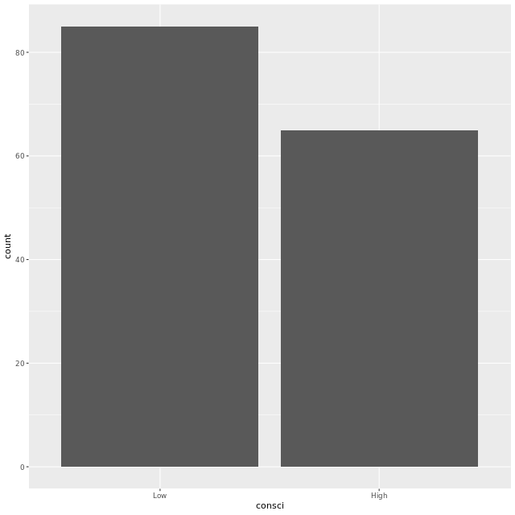
```r
# Compute proportion of high conf
p_hat <- gss2016 %>%
  summarize(prop_high = mean(consci == "High")) %>%
  pull()
```

Perfectly prepared proportion! You should have high conf in your ability to use a plot and numerical summaries to describe a sample of data.

**Generating via bootstrap**

To assess your uncertainty in this estimate of the number of people that have "High" confidence in the scientific community, you need to calculate the standard error. Start by considering how different the data might look in just a single bootstrap sample.

```r
# Load the infer package
library(infer)

# Create single bootstrap data set
boot1 <- gss2016 %>%
  # Specify the response
  specify(response = consci, success = "High") %>%
  # Generate one bootstrap replicate
  generate(reps = 1, type = "bootstrap")

# See the result
boot1
```
```
Response: consci (factor)
# A tibble: 150 x 2
# Groups:   replicate [1]
   replicate consci
       <int> <fct> 
 1         1 High  
 2         1 Low   
 3         1 Low   
 4         1 High  
 5         1 Low   
 6         1 Low   
 7         1 Low   
 8         1 High  
 9         1 High  
10         1 Low   
# ... with 140 more rows
```
```r
# Using boot1, plot consci
ggplot(boot1, aes(x = consci)) +
  # Add bar layer
  geom_bar()
```
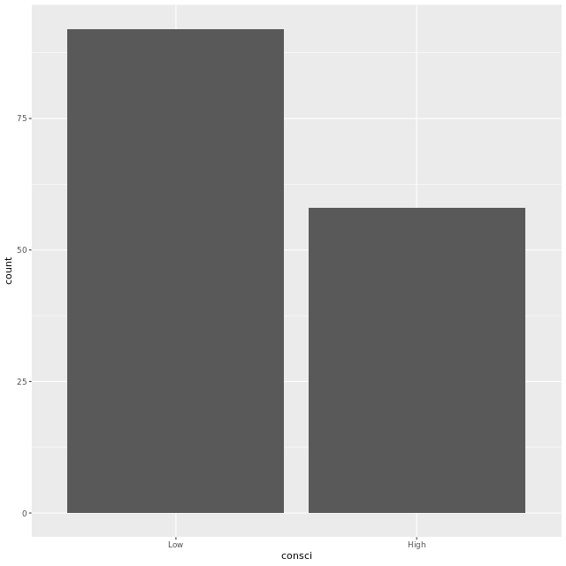
```r
# Compute proportion with high conf
boot1 %>%
  summarize(prop_high = mean(consci == "High")) %>%
  pull()
```
```
[1] 0.4333333
```

Beautifully bootstrapped! You've essentially done the same exercise twice now, but this time, you plotted and summarized a *synthetic* data set. This is the power of the bootstrap: to mimic the sampling process to create similar, but slightly different, data sets.

**Constructing a CI**

You've seen one example of how p-hat can vary upon resampling, but we need to do this many many times to get a good estimate of its variability. Here you will compute a full bootstrap distribution to estimate the standard error (SE) that will be used to form a confidence interval. You'll use an additional verb from infer, `calculate()`, to streamline this process of calculating many statistics from many data sets.

Take a moment to inspect the output of calculate. This function reduces your data frame to just two columns: one for the "stat"s and another for the "replicate" they correspond to.

When you plot your bootstrap distribution, you'll find that it's bell-shaped. It's this shape that allows you to add and subtract two SEs to get a 95% interval.

```r
# Create bootstrap distribution for proportion with High conf
boot_dist <- gss2016 %>%
  # Specify the response and success
  specify(response = consci, success = "High") %>%
  # Generate 500 bootstrap reps
  generate(reps = 500, type = "bootstrap") %>%
  # Calculate proportions
  calculate(stat = "prop")

# See the result
boot_dist
```
```
# A tibble: 500 x 2
   replicate  stat
       <int> <dbl>
 1         1 0.373
 2         2 0.36 
 3         3 0.473
 4         4 0.42 
 5         5 0.393
 6         6 0.42 
 7         7 0.44 
 8         8 0.447
 9         9 0.493
10        10 0.367
# ... with 490 more rows
```
```r
# Plot bootstrap distribution of stat
ggplot(boot_dist, aes(stat)) +
  # Add density layer
  geom_density()
```
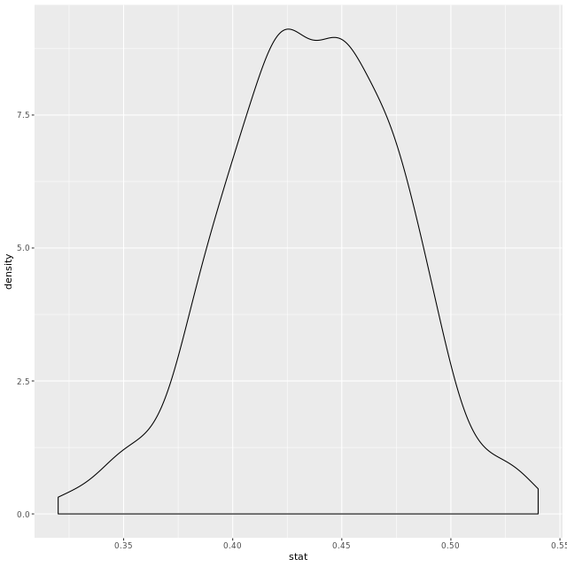
```r
# Compute estimate of SE
SE <- boot_dist %>%
  summarize(se = sd(stat)) %>%
  pull()

# Create CI
c(p_hat - 2 * SE, p_hat + 2 * SE)
```
```
[1] 0.3530717 0.5135950
```

Cleverly constructed confidence interval! You've moved from just describing the data set at hand with `p_hat` to quantifying how good of an estimate this is of the true proportion of all Americans.

If your bootstrap distribution looks rough, you can always increase the number of bootstrap samples to see if you can get a smoother picture of its shape.

## Interpreting a Confidence Interval


**SE with less data**

The less data that you have to make an estimate, the more uncertainty you will have in that estimate. This is reflected in the standard error. In this exercise you'll develop a feel for this relationship by looking at data sets of different sizes.

Two new smaller data sets have been created for you from `gss2016`: `gss2016_small`, which contains 50 observations, and `gss2016_smaller` which contains just 10 observations.

```r
# Create bootstrap distribution for proportion
boot_dist_small <- gss2016_small %>%
  # Specify the variable and success
  specify(response = consci, success = "High") %>%
  # Generate 500 bootstrap reps
  generate(reps = 500, type = "bootstrap") %>%
  # Calculate the statistic
  calculate(stat = "prop")

# See the result
glimpse(boot_dist_small)
```
```
Observations: 500
Variables: 2
$ replicate <int> 1, 2, 3, 4, 5, 6, 7, 8, 9, 10, 11, 12, 13, 14, 15, 16, 17...
$ stat      <dbl> 0.48, 0.44, 0.46, 0.32, 0.46, 0.50, 0.36, 0.46, 0.46, 0.4...
```
```r
# Compute and save estimate of SE
SE_small_n <- boot_dist_small %>%
  summarize(se = sd(stat)) %>%
  pull()

# See the result
SE_small_n
```
```
[1] 0.07121931
```
```r
# Generate bootstrap distribution for smaller data
boot_dist_smaller <-gss2016_smaller %>%
  specify(response = consci, success = "High") %>%
  generate(reps = 500, type = "bootstrap") %>%
  calculate(stat = "prop")

# See the result
glimpse(boot_dist_smaller)
```
```
Observations: 500
Variables: 2
$ replicate <int> 1, 2, 3, 4, 5, 6, 7, 8, 9, 10, 11, 12, 13, 14, 15, 16, 17...
$ stat      <dbl> 0.4, 0.3, 0.4, 0.4, 0.2, 0.4, 0.5, 0.1, 0.5, 0.2, 0.2, 0....
```
```r
# Compute and save estimate of second SE
SE_smaller_n <- boot_dist_smaller %>%
  summarize(se = sd(stat)) %>%
  pull()

# Compare the results for each dataset size
message("gss2016_small has ", nrow(gss2016_small), " rows and standard error ", SE_small_n)
message("gss2016_smaller has ", nrow(gss2016_smaller), " rows and standard error ", SE_smaller_n)
```
```
gss2016_small has 50 rows and standard error 0.0721210294281186
gss2016_smaller has 10 rows and standard error 0.159395023595764
```

Well done! This is a fundamental relationship that you've uncovered: the less data, the greater the standard error.

**SE with different p**

You just saw the effect that *sample size* can have on inference, but that's not the only variable in play here. Let's return now to our full data set and see what happens to the SE when we consider a category that has a different *population proportion*, p.

We've displayed here the plot that you made way back in exercise 4 to study the proportion of respondents that have "High" confidence in science. Notice this proportion is very close to .5. In this exercise, you'll be looking at the variable `meta_region`, which records whether or not the respondent lives in the pacific region of the US. These respondents were fairly rare, which allows you to study how SEs behave in a setting where the proportion is is very far from 0.5.

```r
# Using gss2016, plot meta_region
ggplot(gss2016, aes(meta_region)) +
  # Add bar layer
  geom_bar()
```

```r
# Specify the response for the bootstrap distribution
boot_dist <- gss2016 %>%
  specify(response = meta_region, success = "pacific") %>%
  generate(reps = 500, type = "bootstrap") %>%
  calculate(stat = "prop")
  
# Calculate std error
SE_low_p <- boot_dist %>%
  summarize(se = sd(stat)) %>%
  pull()

# Compare SEs
c(SE_low_p, SE)
```
```
[1] 0.02496027 0.03800703
```

Oh, what a difference a proportion makes! It turns out that that SEs are highest when estimating proportions are close to 0.5.

## The approximation shortcut


**CI via approximation**

The approximation shortcut offers an alternative method of describing the sampling distribution. In this exercise, you will apply the approximation shortcut to build a confidence interval for the proportion of respondents that live in the pacific region.

When building *any* confidence interval, note that you use three ingredients: the point estimate (here, `p_hat`), the SE, and the number of standard errors to add and subtract. For a sampling distribution that is bell-shaped, adding and subtracting two SEs corresponds to a confidence level of 95%. When you use the bootstrap, you can check that the distribution is bell-shaped because you have a have the bootstrap distribution to plot. When you use the approximation, you're flying blind – well, not quite blind, but you *are* dependent on the "rule of thumb" to ensure that you're working with a bell shape.

```r
# Calculate n as the number of rows
n <- nrow(gss2016)

# Calculate p_hat as the proportion in pacific meta region
p_hat <- gss2016 %>%
  summarize(prop_pacific = mean(meta_region == "pacific")) %>%
  pull()

# See the result
p_hat
```
```
[1] 0.1
```
```r
# Check conditions
n * p_hat >= 10
n * (1 - p_hat) >= 10
```
```
[1] TRUE
[1] TRUE
```
```r
# Calculate SE
SE_approx <- sqrt(p_hat * (1-p_hat) / n)

# Form 95% CI
c(p_hat - 2*SE_approx, p_hat + 2*SE_approx)
```
```
[1] 0.05101021 0.14898979
```

Well done. You probably noticed: this approximation method gives you a similar answer to the computational approach. This is a recurring theme that you'll be seeing throughout this course.

## Hypothesis test for a proportion


**Life after death**

In this chapter, you'll continue to dig into the data from the General Social Survey. One of the questions that was asked of respondents was: "Do you believe there is a life after death?"

Let's see how your sample of Americans responded to this question in 2016.

```r
# Using `gss2016`, plot postlife
ggplot(gss2016, aes(postlife)) +
  # Add bar layer
  geom_bar()
```
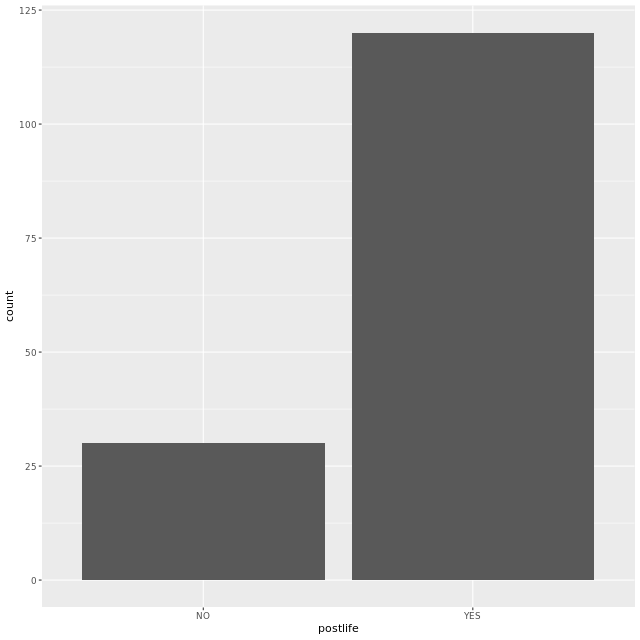
```r
# Compute and save proportion that believe
p_hat <- gss2016 %>%
  summarize(prop_yes = mean(postlife == "YES")) %>%
  pull()

# See the result
p_hat
```
```
[1] 0.8
```

Excellent effort! Your sample of data has a majority of respondents that indeed believe in an afterlife.

**Generating from H0**

Imagine that when reading the newspaper, you come across someone who makes the following claim: "3/4 of all Americans believe in life after death". This can be interpreted as a `point` null hypothesis that the population proportion has a value of 0.75.

Use this hypothesis to generate a single data set to explore.

```r
sim1 <- gss2016 %>%
  # Specify the response and success
  specify(response = postlife, success = "YES") %>%
  # Hypothesize the null value of p
  hypothesize(null = "point", p = 0.75) %>%
  # Generate a single simulated dataset
  generate(reps = 1, type = "simulate")

# See the result
sim1
```
```
Response: postlife (factor)
Null Hypothesis: point
# A tibble: 150 x 2
# Groups:   replicate [1]
   postlife replicate
   <fct>    <fct>    
 1 YES      1        
 2 YES      1        
 3 YES      1        
 4 NO       1        
 5 YES      1        
 6 YES      1        
 7 YES      1        
 8 YES      1        
 9 YES      1        
10 YES      1        
# ... with 140 more rows
```
```r
# Using sim1, plot postlife
ggplot(sim1, aes(postlife)) +
  # Add bar layer
  geom_bar()
```

```r
# Compute proportion that believe
sim1 %>%
  summarize(prop_yes = mean(postlife == "YES")) %>%
  pull()
```
```
[1] 0.72
```

Spectacular simulation! The null hypothesis describes a theoretical world and with these tools, you can generate from that world as much data as you like.

**Testing a claim**

In the last exercise, you got a sense of what a single simulated p-hat might be if in fact the true proportion of believers was 0.75. That p-hat was likely different from the p-hat in `gss2016`, but was that a fluke or is there a systematic inconsistency between that claim and the data in the GSS?

In this exercise, you'll settle this question.

```r
# Generate null distribution
null <- gss2016 %>%
  specify(response = postlife, success = "YES") %>%
  hypothesize(null = "point", p = 0.75) %>%
  generate(reps = 500, type = "simulate") %>%
  # Calculate proportions
  calculate(stat = "prop")
  
# Visualize null distribution
ggplot(null, aes(stat)) +
  # Add density layer
  geom_density() +
  # Add line at observed
  geom_vline(xintercept = p_hat, color = "red")
```
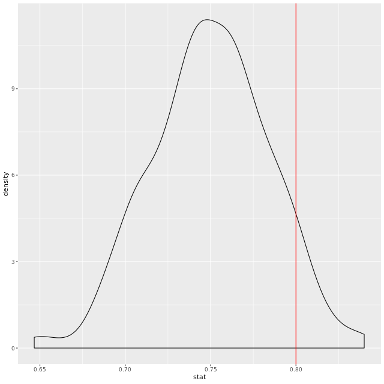
```r
null %>%
  summarize(
    # Compute the one-tailed p-value
    one_tailed_pval = mean(stat >= p_hat),
    # Compute the two-tailed p-value
    two_tailed_pval = 2 * one_tailed_pval
  ) %>%
  pull(two_tailed_pval)
```
```
[1] 0.212
```

Tip top testing! One way to think about a p-value is as a measure of how far out an observed statistic is into the tails of a null distribution.

The p-value > alpha, thus the data is consistent with the null hypothesis so I fail to reject it as a reasonable explanation. This data is consistent with a model in which ¾ of Americans believe in life after death.

## Intervals for differences


**Death penalty and sex**

While you're on the topic of death and the afterlife, take a look at another question from the GSS:

*Do you favor or oppose the death penalty for people convicted of murder?*

Your objective here is to explore if opinions on capital punishment (`cappun`) diverged between men and women in the `gss2016` data.

```r
# Plot distribution of sex filled by cappun
ggplot(gss2016, aes(x = sex, fill = cappun)) +
  # Add bar layer
  geom_bar(position = "fill")
```
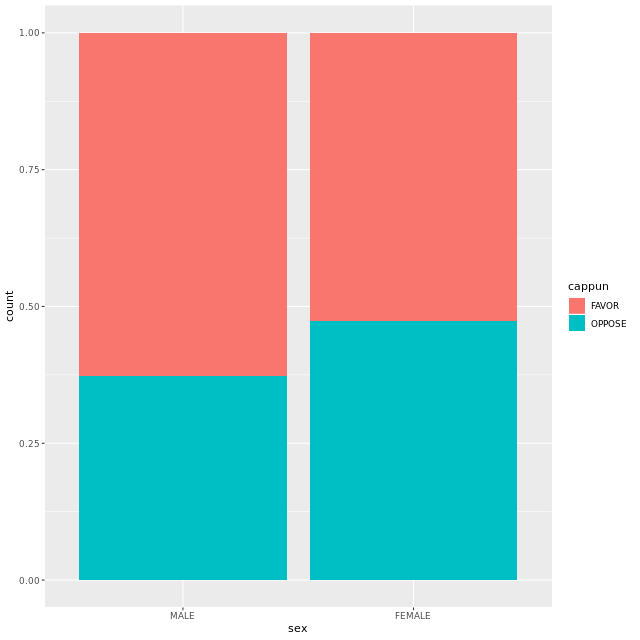
```r
# Compute two proportions
p_hats <- gss2016 %>%
  # Group by sex
  group_by(sex) %>%
  # Calculate proportion that FAVOR
  summarize(prop_favor = mean(cappun == "FAVOR")) %>%
  pull()

# See the result
p_hats
```
```
[1] 0.6271186 0.5274725
```
```r
# Compute difference in proportions
d_hat <- diff(p_hats)

# See the result
d_hat
```
```
[1] -0.09964612
```

Excellent! Unless you tell R otherwise, R will do operations like this alphabetically, so -0.09964612 is the proportion of (f)emales that favor minus the proportion of (m)ales.

**Hypothesis test on the difference in proportions**

In the last exercise you learned that about 52% of women favor the death penalty while about 63% of men do, a difference of about 11 percentage points. That seems like a large difference, but what if it's just due to chance and in fact there is no relationship between sex and support for the death penalty? Find out by testing the null hypothesis that sex and support for the death penalty are independent of one another.

The `stat`istic that you'll be using in this exercise is a `"diff in props"`, which requires that you specify the order of the difference by adding an argument, `order = c("FIRST", "SECOND")`, where first and second refer to the group names. This results in the calculation: FIRST - SECOND.

```r
# Create null distribution
null <- gss2016 %>%
  # Specify the response and explanatory as well as the success
  specify(cappun ~ sex, success = "FAVOR") %>%
  # Set up null hypothesis
  hypothesize(null = "independence") %>%
  # Generate 500 reps by permutation
  generate(reps = 500, type = "permute") %>%
  # Calculate the statistics
  calculate(stat = "diff in props", order = c("FEMALE", "MALE"))
  
# Visualize null
ggplot(null, aes(stat)) +
  # Add density layer
  geom_density() +
  # Add red vertical line at obs stat
  geom_vline(xintercept = d_hat, color = "red")
```

```r
# Compute two-tailed p-value
null %>%
  summarize(
    one_tailed_pval = mean(stat <= d_hat),
    two_tailed_pval = 2 * one_tailed_pval
  ) %>%
  pull(two_tailed_pval)
```
```
[1] 0.272
```

Correctly crafted code! While that observed difference of 11% seemed large, it's actually somewhat close to the main hump of the null distribution. As a result, the p-value isn't very small.

The data are consistent with the hypothesis that there is no association.

Despite the difference that we found between men and women in our sample, it quite possible it's simply an artifact of the process of drawing a random sample.

**Hypothesis tests and confidence intervals**

As was mentioned at the very beginning of this chapter, there is a close link between hypothesis tests and confidence intervals. The former explores whether a particular hypothesis about the world is consistent with your data. The latter has no hypothesis, it simply quantifies your uncertainty in your point estimate by adding and subtracting the margin of error.

In this exercise you will explore the duality by forming a confidence interval around the difference in proportions, `d_hat`. To get you started, here is the code that you used to form the null distribution:

```r
# Reference code for null distribution
null <- gss2016 %>%
   specify(cappun ~ sex, success = "FAVOR") %>%
   hypothesize(null = "independence") %>%
   generate(reps = 500, type = "permute") %>%
   calculate(stat = "diff in props", order = c("FEMALE", "MALE"))`
```

```r
# Create the bootstrap distribution
boot <- gss2016 %>%
  # Specify the variables and success
  specify(cappun ~ sex, success = "FAVOR") %>%
  # Generate 500 bootstrap reps
  generate(reps = 500, type = "bootstrap") %>%
  # Calculate statistics
  calculate(stat = "diff in props", order = c("FEMALE", "MALE"))

# Compute the standard error
SE <- boot %>%
  summarize(se = sd(stat)) %>%
  pull()
  
# Form the CI (lower, upper)
c(d_hat - 2*SE, d_hat + 2*SE)
```
```
[1] -0.26820753  0.06891529
```

Tremendous travail! Your CI included the value of zero, indicating that it is a plausible value. Since it's a plausible value, you wouldn't want to reject it - leading the same conclusion as the hypothesis test.

## Statistical errors


$Power = 1 - \beta$

**When the null is true**

In this exercise, you will run an experiment: what happens when you conduct a hypothesis test when you *know* that the null hypothesis is true? You hope that you will retain the null hypothesis, but there's always a chance that you will make a statistical error.

To begin the experiment, we have created a new explanatory variable called `coinflip` that captures the result of a fair coin toss for every subject. With that variable in hand you can pose the following null hypothesis:

$H_0: p_{heads} - p_{tails} = 0$

This claims that there is no difference in the proportions that favor the death penalty between the people that flipped `"heads"` and those that flipped `"tails"`. Since coinflip was formed independently of `cappun`, we `know` that this null hypothesis is true. The question is: will your test reject or retain this null hypothesis?

```r
# Inspect coinflip
gssmod %>%
  select(coinflip)

# Compute two proportions
p_hats <- gssmod %>%
  group_by(coinflip) %>%
  summarize(prop_favor = mean(cappun == "FAVOR")) %>%
  pull()
  
# See the result
p_hats
```
```
[1] 0.6307692 0.5176471
```
```r
# Compute difference in proportions
d_hat <- diff(p_hats)

# Form null distribution
null <- gssmod %>%
  # Specify the response and explanatory var and success
  specify(cappun ~ coinflip, success = "FAVOR") %>%
  # Set up the null hypothesis
  hypothesize(null = "independence") %>%
  # Generate 500 permuted data sets
  generate(reps = 500, type = "permute") %>%
  # Calculate statistics
  calculate(stat = "diff in props", order = c("heads", "tails"))

# Visualize null
ggplot(null, aes(stat)) +
  # Add density layer
  geom_density() +
  # Add vertical red line at observed stat
  geom_vline(xintercept = d_hat, color = "red")
```
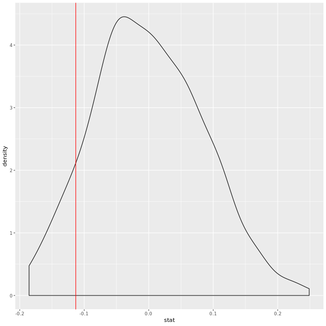

Excellent experimentation! Your experiment suggests that when there is no difference in proportions, it's still conceivable that we'd observe differences up to around +/- 0.2.

**When the null is true: decision**

In the last exercise, the observed difference in proportions is comfortably in the middle of the null distribution. In this exercise, you'll come to a formal decision on if you should reject the null hypothesis, but instead of using p-values, you'll use the notion of a rejection region.

The rejection region is the range of values of the statistic that would lead you to reject the null hypothesis. In a two-tailed test, there are two rejection regions. You know that the upper region should contain the largest 2.5% of the null statistics (when alpha = .05), so you can extract the cutoff value by finding the .975 `quantile()`. Similarly, the lower region contains the smallest 2.5% of the null statistics, which can also be found using `quantile()`.

Here's a quick look at how the `quantile()` function works for this simple data set `x`.

```r
x <- c(0, 2, 4, 6, 8, 10, 12, 14, 16, 18, 20)
quantile(x, probs = .5)
quantile(x, probs = .8)
```

Once you have the rejection region defined by the upper and lower cutoffs, you can make your decision regarding the null by checking if your observed statistic falls between those cutoffs (in which case you will fail to reject) or outside of them (in which case you will reject).

```r
# Set alpha
alpha <- 0.05

# Find cutoffs
lower <- null %>%
  summarize(l = quantile(stat, probs = alpha/2)) %>%
  pull()
upper <- null %>%
  summarize(u = quantile(stat, probs = 1 - alpha/2)) %>%
  pull()

# Is d_hat inside cutoffs?
d_hat %>%
  between(lower, upper)
```
```
[1] TRUE
```
```r
# Visualize cutoffs
ggplot(null, aes(x = stat)) +
  geom_density() +
  geom_vline(xintercept = d_hat, color = "red") +
  # Add vertical blue line for lower cutoff
  geom_vline(xintercept = lower, color = "blue") +
  # Add vertical blue line for upper cutoff
  geom_vline(xintercept = upper, color = "blue")
```
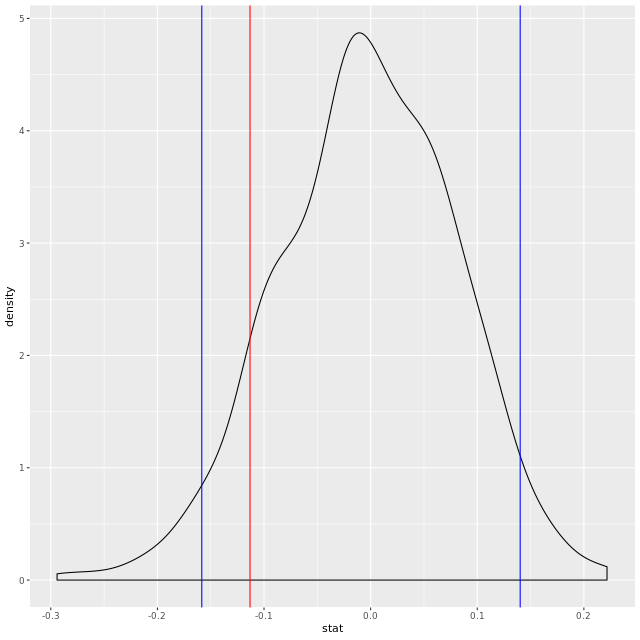

Very vibrantly visualized! In this case, the observed statistic is not in the rejection, which is good, given that you know H0 is true. Occasionally, however, you will make a type I error and reject a true H0 just due to chance. This error rate is what you set when you choose alpha.


**Politics and Space**

While the relationship between political party and military spending is no big surprise, what about the relationship between political party and another spending priority: space exploration?

Start your exploration by simplifying the data set to include only people that identified as Republicans (Rep), Democrats (Dem), and Independents (Ind).

```r
# Subset data
gss_party <- gss2016 %>%
  # Filter out the "Oth"
  filter(party != "Oth")
  
# Visualize distribution take 1
gss_party %>%
  ggplot(aes(x = party, fill = natspac)) +
  # Add bar layer of proportions
  geom_bar(position = "fill")
```
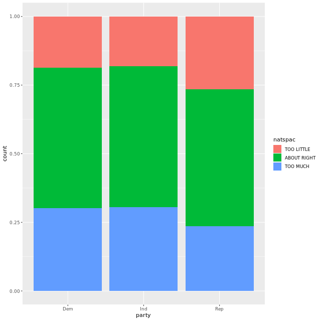
```r
# Visualize distribution take 2 
gss_party %>%
  ggplot(aes(x = party, fill = natspac)) +
  # Add bar layer of counts
  geom_bar()
```
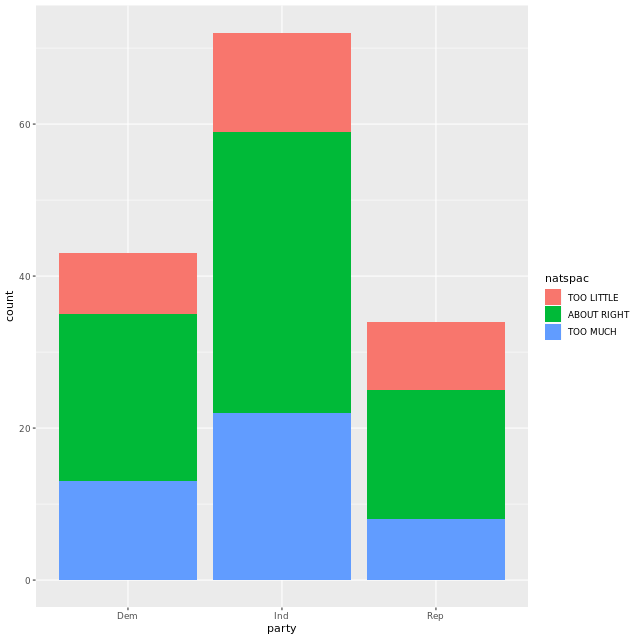

Beautiful bar plotting! The plot of proportions makes it clear that this story here is less clear cut. While thoughts on space exploration do differ slightly from party to party, do you think this difference is significant?

**From tidy to table to tidy**

The `gss_party` data set that you created is in a tidy format to facilitate visualization and analysis. In this exercise, you'll untidy the data to create a contingency table to display counts. As a data analyst, it's commonplace to be given data in a contingency table, so you'll also practice tidying it back up.

```r
library(broom)

# Create table of natspac and party
Obs <- gss_party %>%
  # Select columns of interest
  select(natspac, party) %>%
  # Create table
  table()
  
  # Convert table back to tidy df
Obs %>%
  # Tidy the table
  tidy() %>%
  # Expand out the counts
  uncount(n)
```
```
# A tibble: 149 x 2
   natspac     party
   <chr>       <chr>
 1 TOO LITTLE  Dem  
 2 TOO LITTLE  Dem  
 3 TOO LITTLE  Dem  
 4 TOO LITTLE  Dem  
 5 TOO LITTLE  Dem  
 6 TOO LITTLE  Dem  
 7 TOO LITTLE  Dem  
 8 TOO LITTLE  Dem  
 9 ABOUT RIGHT Dem  
10 ABOUT RIGHT Dem  
# ... with 139 more rows
```

Tubular tabulation and tremendous tidying! It's important to keep an eye out of these two different, but related, representations of a data set.

## Chi-squared test statistic


$\chi^2 = \frac{\sum(observed\ counts\ -\ expected\ counts)^2}{expected\ counts}$


**A single permuted Chi-sq**

The key to generating data under a null hypothesis of independence is *permutation*. Generate just a single data set to see what sort of chi-squared statistic you might observe when in fact these two variables are independent of one another.

```r
# Create one permuted data set
perm_1 <- gss_party %>%
  # Specify the variables of interest
  specify(natarms ~ party) %>%
  # Set up the null
  hypothesize(null = "independence") %>%
  # Generate a single permuted data set
  generate(reps = 1, type = "permute")
  
# Visualize permuted data
ggplot(perm_1, aes(x = party, fill = natarms)) +
  # Add bar layer
  geom_bar()
```
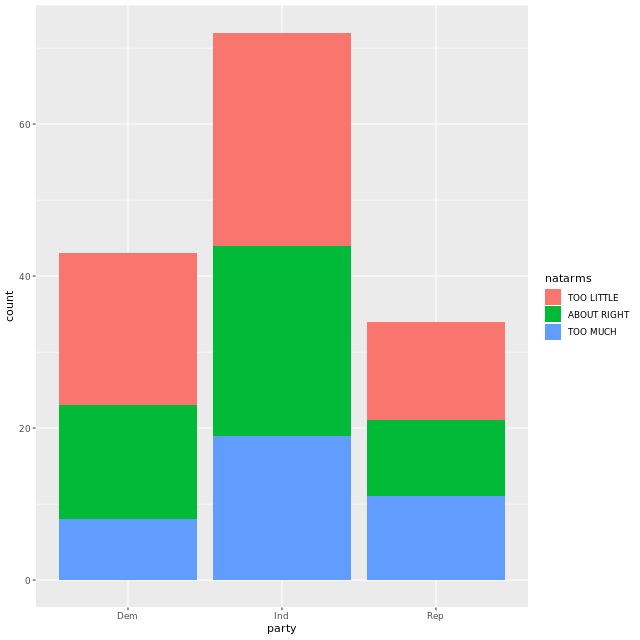
```r
# Compute chi-squared stat
gss_party %>%
  chisq_stat(natarms ~ party)
```
```
[1] 18.96998
```

Perfectly permuted! By permuting or shuffling one of the variables, you have generated a new data set (with an associated chi-squared statistic) under the null hypothesis that these variables are unrelated.

**Building two null distributions**

To get a sense of the full distribution that the chi-squared test statistic can take under this hypothesis, you need to generate many more data sets.

Do this by first adding onto your work from the previous exercise with the `natspac` variable, then conduct a second hypothesis test to see if `party` is independent of `natarms`. Once you have both null distributions, you can visualize them to see if they're consistent with your observed statistics.

```r
# Create null
null_spac <- gss_party %>%
  specify(natspac ~ party) %>%
  hypothesize(null = "independence") %>%
  generate(reps = 500, type = "permute") %>%
  calculate(stat = "Chisq")
  
# Visualize null
ggplot(null_spac, aes(x = stat)) +
  # Add density layer
  geom_density() +
  # Add vertical line at obs stat
  geom_vline(xintercept = chi_obs_spac, color = "red")
```
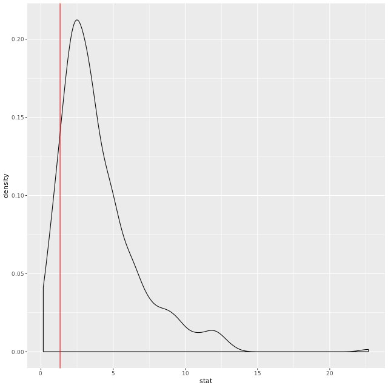
```r
# Create null
null_arms <- gss_party %>%
  specify(natarms ~ party) %>%
  hypothesize(null = "independence") %>%
  generate(reps = 500, type = "permute") %>%
  calculate(stat = "Chisq")
  
# Visualize null
ggplot(null_arms, aes(x = stat)) +
  # Add density layer
  geom_density() +
  # Add vertical red line at obs stat
  geom_vline(xintercept = chi_obs_arms, color = "red")
```


Nicely done null distributions! Notice that the statistic for the latter dataset, natarms and party, was far more into the tails of the null distribution than the statistic corresponding to the relationship between natspac and party.

```r
# Compute one-tailed p-values
null_arms %>%
  summarize(pval = mean(stat <= chi_obs_arms)) %>% pull()
```
```
[1] 0.996
```
```r
null_spac %>%
  summarize(pval = mean(stat <= chi_obs_spac)) %>% pull()
```
```
[1] 0.158
```

The data set is consistent with the hypothesis that there is no relationship between political party and space exploration spending, but does suggestion a relationship between party and spending on the military.

It seems that spending on the military is a partisan issue, while spending on space exploration is not.

## Alternate method: the chi-squared distribution


- `expected_count` is for each level/entry in the contingency table
- if you have a 2x2 table (i.e. df = 1), a normal distribution is more appropriate using comparison of proportions.

**The geography of happiness**

In addition to information regarding their opinions on policy issues, GSS survey respondents also provided the region of the United States in which they live. With this in hand, you can explore the question:

*Does this data set provide evidence of an association between happiness and geography?*

```r
# Visualize distribution of region and happy
ggplot(gss2016, aes(x = region, fill = happy)) +
  # Add bar layer of proportions
  geom_bar(position = "fill")
```
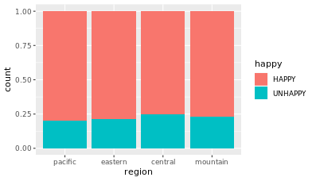
```r
# Calculate and save observed statistic
chi_obs <- gss2016 %>%
  chisq_stat(region ~ happy)

# See the result
chi_obs
```
```
[1] 0.2547647
```

Excellent effort! It seems that there were a good number of happy midwesterners in this sample. Do you think this effect exists in the greater population?

**A p-value two ways**

In this exercise you'll find out if the observed chi-squared statistic is unusually large under the following notion that,

$H_0$: Region is independent of Happy.

The competing notion is the alternative hypothesis that there is an association between these variables. For the sake of comparison, you'll be finding the p-value first from the computational approach, then use the approximation.

```r
# Generate null distribution
null <- gss2016 %>%
  # Specify variables
  specify(happy ~ region, success = "HAPPY") %>%
  # Set up null
  hypothesize(null = "independence") %>%
  # Generated 500 permuted data sets
  generate(reps = 500, type = "permute") %>%
  # Calculate statistics
  calculate(stat = "Chisq")
  
# Visualize null
ggplot(null, aes(x = stat)) +
  # Add density layer
  geom_density() +
  # Add red vertical line at obs stat
  geom_vline(xintercept = chi_obs, color = "red") +
  # Overlay chisq approximation
  stat_function(fun = dchisq, args = list(df = 3), color = "blue")
```
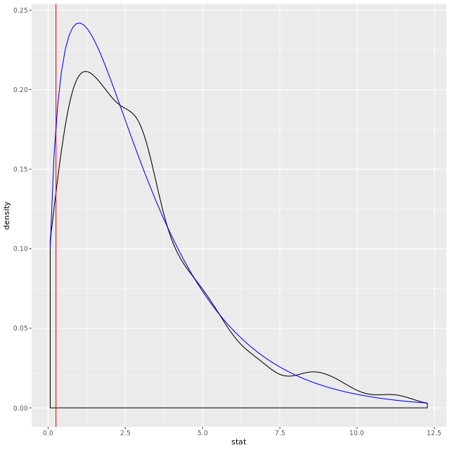
```r
# Calculate computational pval
null %>% 
  summarize(pval = mean(stat >= chi_obs))
```
```
# A tibble: 1 x 1
   pval
  <dbl>
1 0.974
```
```r
# Calculate approximate pval
pchisq(chi_obs, df = 3, lower.tail = FALSE)
```
```
[1] 0.9682987
```

Potent p-values! Although they are very similar here, you'd be slightly better off using your computational p-value. The approximation becomes less accurate when cell counts are low, as they are here.

## Intervals for the chi-squared distribution

- this approach does not make sense as $\chi^2$ is only useful in the context of a hypothesis test. You are not likely to see a confidence interval here.

## Case study: election fraud


```{r}
library(readr)
iran <- read_csv("_data/iran.csv")
iran
```

Each row refers to the total ballots for a particular city.

**Who won?**

The `iran` data set contains all of the votes cast in this election, meaning that you can find the victor by computing the total number of votes for each candidate. In addition to answering the question of who won nationwide, you can also see how the results differed by province.

Along the way, you'll use a very useful function called `gather()`. This allows you to reshape your dataframe by taking information stored in variable names and moving it to live in its own column.

```{r}
# Compute and save candidate totals
totals <- iran %>%
  summarize(ahmadinejad = sum(ahmadinejad),
            rezai = sum(rezai),
            karrubi = sum(karrubi),
            mousavi = sum(mousavi))

# Inspect totals
totals

# Gather data
gathered_totals <- totals %>%
  gather(key = "candidate", value = "votes")

# Inspect gathered totals
gathered_totals

# Plot total votes for each candidate
ggplot(gathered_totals, aes(candidate, votes)) +
  # Add col layer
  geom_col()
```

The results are in: Ahmadinejad wins!

**Breaking it down by province**

Although the overall vote totals are the most important, you can dig deeper into this data by utilizing the geographic information. In this exercise, you'll see how the results differed by province.

Did Ahmadinejad win throughout the country, or were there provinces where the second place candidate came out on top? To answer this question, start by creating a province-level data set.

```{r}
# Construct province-level dataset
province_totals <- iran %>%
  # Group by province
  group_by(province) %>%
  # Sum up votes for top two candidates
  summarize(mousavi = sum(mousavi),
            ahmadinejad = sum(ahmadinejad))
 
# Inspect data frame
province_totals

# Filter for won provinces won by #2
province_totals %>%
  filter(mousavi > ahmadinejad)
```

Incisive investigation! It looks like Ahmadinejad did not have a clean sweep; there were two provinces that preferred Mousavi.

**Extracting the first digit I**

To address the question of voter fraud, begin by creating a new column of data containing the first digit of the total number of votes cast. For this, you'll need a custom function which we've created for you called `get_first()`. The core of this function is `substr()`, which will take a string and extract a section of it called a substring.

Once you create a new variable containing only the first digit, you can get a sense of how close it follows Benford's Law by constructing a bar plot.

```{r}
get_first <- function(x) {
  x %>%
    # Convert the numbers to strings
    as.character() %>%
    # Extract the first digit
    substr(1, 1) %>%
    # Make it a categorical variable, with levels from 1 to 9 
    factor(levels = 1:9)
}

# Print get_first
get_first

# Create first_digit
iran <- iran %>%
  mutate(first_digit = get_first(total_votes_cast))

# Check if get_first worked
iran %>%
  select(total_votes_cast, first_digit)
  
# Construct bar plot
ggplot(iran, aes(x = first_digit)) +
  # Add bar layer
  geom_bar()
```

Excellent extraction of the first digit! This decaying distribution of first digits looks familiar, but is it a good fit for Benford's Law?

## Goodness of fit


**Goodness of fit test**

The null hypothesis in a goodness of fit test is a list of specific parameter values for each proportion. In your analysis, the equivalent hypothesis is that Benford's Law applies to the distribution of first digits of total vote counts at the city level. You could write this as:

$H_0: p_1 = .30, p_2 = .18, \ldots , p_9 = .05$

Where $p_1$ is the height of the first bar in the Benford's bar plot. The alternate hypothesis is that at least one of these proportions is different; that the first digit distribution *doesn't* follow Benford's Law.

In this exercise, you'll use simulation to build up the null distribution of the sorts of chi-squared statistics that you'd observe if in fact these counts did follow Benford's Law.

```{r}
library(infer)

# Inspect p_benford
p_benford <- structure(c(0.30103000, 0.17609126, 0.12493874, 0.09691001, 0.07918125, 0.06694679, 0.05799195, 0.05115252, 0.04575749), names = 1:9)
p_benford

# Compute observed stat
chi_obs_stat <- iran %>%
  infer::chisq_stat(response = first_digit, p = p_benford)

# Form null distribution
null <- iran %>%
  # Specify the response
  specify(response = first_digit) %>%
  # Set up the null hypothesis
  hypothesize(null = "point", p = p_benford) %>%
  # Generate 500 reps
  generate(reps = 500, type = "simulate") %>%
  # Calculate statistics
  calculate(stat = "Chisq")
```

Cleverly constructed chi-squareds! When looking at the null distribution, think to yourself that these are the sort of `distances` that you'd expect if the data were drawn from Benford's distribution.

**A p-value, two ways**

You've seen before how there are usually two ways to get to the null distribution: through computation and through a mathematical approximation. The chi-squared goodness of fit test is no exception. The approximation distribution is again the "Chi-squared distribution" with degrees of freedom equal to the number of categories minus one.

In this exercise you'll compare these two approaches to calculate a p-value that measures the consistency of the distribution of the Iran first digits with Benford's Law. Note that the observed statistic that you created in the last exercise is saved in your work space as `chi_obs_stat`.

```{r}
# Compute degrees of freedom
degrees_of_freedom <- iran %>% 
  # Pull out first_digit vector
  pull(first_digit) %>% 
  # Calculate n levels and subtract 1
  nlevels() - 1

# Plot both null dists
ggplot(null, aes(x = stat)) +
  # Add density layer
  geom_density() +
  # Add vertical line at obs stat
  geom_vline(xintercept = chi_obs_stat, color = "red") + 
  # Overlay chisq approx
  stat_function(fun = dchisq, args = list(df = degrees_of_freedom), color = "blue")
```

```{r}
# Permutation p-value
null %>%
  summarize(pval = mean(stat >= chi_obs_stat))

# Approximation p-value
pchisq(chi_obs_stat, df = degrees_of_freedom, lower.tail = FALSE)
```

Potent p-values! Although they are very similar here, you'd be slightly better off using your computational p-value. The approximation becomes less accurate when cell counts are low, as they are here.

The low p-value suggests this data is inconsistent with the proportions expected by Benford's Law.

## And now to US


```{r}
iowa <- read_csv("_data/iowa.csv")
```

**Extracting the first digit II**

There are different levels at which we could consider looking at vote totals. We could look at precincts, or counties, or states, and each level might give us a slightly different picture of what's going on.

For this analysis, look at totals at the *county* level in Iowa and focus on the votes for the two major party candidates: Republicans Trump / Pence and Democrats Clinton / Kaine.

```{r}
# Get Iowa county vote totals
iowa_county <- iowa %>%
  # Filter for rep/dem
  filter(candidate %in% c("Hillary Clinton / Tim Kaine", "Donald Trump / Mike Pence")) %>%
  # Group by county
  group_by(county) %>%
  # Compute total votes in each county
  summarize(dem_rep_votes = sum(votes))
  
# See the result
iowa_county
```

```{r}
# Add first digit
iowa_county <- iowa_county %>%
  mutate(first_digit = get_first(dem_rep_votes))
  
# See the result
iowa_county
```

```{r}
# Using iowa_county, plot first_digit
ggplot(iowa_county, aes(x = first_digit)) +
  # Add bar layer
  geom_bar()
```

Fantastic! Now you have another distribution of first digits. How does this compare to Iran? How does this compare to Benford's Law?

**Testing Iowa**

You probably noticed that the bar plot of first digits is alarming: it looks quite different from what Benford's Law prescribes! Before you get ahead of yourself, though, realize that those bars each only contained a handful of counties, so you don't actually have that much data.

This is a prime example of when a hypothesis test is handy. It can tell you if the structure that you see (in this case, the deviation from Benford's Law) could just be due to the random variability of your small sample, or if it's indicative of a systematic difference.

```{r}
# Compute observed stat
chi_obs_stat <- iowa_county %>%
  chisq_stat(response = first_digit, p = p_benford)

# Form null distribution
null <- iowa_county %>%
  # Specify response
  specify(response = first_digit) %>%
  # Set up null
  hypothesize(null = "point", p = p_benford) %>%
  # Generate 500 reps
  generate(reps = 500, type = "simulate") %>%
  # Calculate statistics
  calculate(stat = "Chisq")

# Visualize null stat
ggplot(null, aes(x = stat)) +
  # Add density layer
  geom_density() +
  # Add vertical line at observed stat
  geom_vline(xintercept = chi_obs_stat, color = "red") +
  # Overlay chisq approx
  stat_function(fun = dchisq, args = list(df = degrees_of_freedom), color = "blue")
```

Well done … And also rather troubling! Is it reasonable to think that *both* Iran and Iowa had fraudulent elections?

```{r}
#Calculated p value
null %>%
  summarize(pval = mean(stat >= chi_obs_stat))

#Approximated p value
pchisq(chi_obs_stat, df = 8, lower.tail = FALSE)
```

The low p-value indicates that if in fact there was election fraud in Iowa, there would be a very small probability of observing this data or more extreme.

Because the observed statistic is far into the tails of the null distribution, this indicates that your data is inconsistent with the null hypothesis that Benford's Law applies to vote totals in Iowa.

## Election fraud in Iran and Iowa: debrief


