```{r setup, include=FALSE}
knitr::opts_chunk$set(echo = TRUE)
options(repos="https://CRAN.R-project.org")
```

## Stats with geoms


**ggplot2, course 2**

- statistics
- coordinates
- facets
- data visualization best practices

**statistics layer**

- two categories of functions
  - called from within a geom
  - called independently
- `stats_`


non-parametric model is default - `loess`


**Smoothing**

To practice on the remaining layers (statistics, coordinates and facets), we'll continue working on several datasets from the first course.

The `mtcars` dataset contains information for 32 cars from Motor Trends magazine from 1974. This dataset is small, intuitive, and contains a variety of continuous and categorical (both nominal and ordinal) variables.

In the previous course you learned how to effectively use some basic geometries, such as point, bar and line. In the first chapter of this course you'll explore statistics associated with specific geoms, for example, smoothing and lines.

```{r}
library(ggplot2)

# View the structure of mtcars
str(mtcars)

# Using mtcars, draw a scatter plot of mpg vs. wt
ggplot(mtcars, aes(x = wt, y = mpg)) +
  geom_point()

# Amend the plot to add a smooth layer
ggplot(mtcars, aes(x = wt, y = mpg)) +
  geom_point() +
  geom_smooth()

# Amend the plot. Use lin. reg. smoothing; turn off std err ribbon
ggplot(mtcars, aes(x = wt, y = mpg)) +
  geom_point() +
  geom_smooth(method = "lm", se = FALSE)

# Amend the plot. Swap geom_smooth() for stat_smooth().
ggplot(mtcars, aes(x = wt, y = mpg)) +
  geom_point() +
  stat_smooth(method = "lm", se = FALSE)
```

Good job! You can use either [stat_smooth()](http://www.rdocumentation.org/packages/ggplot2/functions/geom_smooth) or [geom_smooth()](http://www.rdocumentation.org/packages/ggplot2/functions/geom_smooth) to apply a linear model. Remember to always think about how the examples and concepts we discuss throughout the data viz courses can be applied to your own datasets!

**Grouping variables**

We'll continue with the previous exercise by considering the situation of looking at sub-groups in our dataset. For this we'll encounter the invisible `group` aesthetic.

`mtcars` has been given an extra column, `fcyl`, that is the `cyl` column converted to a proper factor variable.

```{r}
mtcars$fcyl <- as.factor(mtcars$cyl)

# Using mtcars, plot mpg vs. wt, colored by fcyl
ggplot(mtcars, aes(x = wt, y = mpg, color = fcyl)) +
  # Add a point layer
  geom_point() +
  # Add a smooth lin reg stat, no ribbon
  stat_smooth(method = "lm", se = FALSE)

# Amend the plot to add another smooth layer with dummy grouping
ggplot(mtcars, aes(x = wt, y = mpg, color = fcyl)) +
  geom_point() +
  stat_smooth(method = "lm", se = FALSE) +
  stat_smooth(aes(group = 1), method = "lm", se = FALSE)
```

Good job! Notice that the color aesthetic defined an invisible group aesthetic. Defining the group aesthetic for a specific geom means we can overwrite that. Here, we use a dummy variable to calculate the smoothing model for all values.

**Modifying stat_smooth**

In the previous exercise we used `se = FALSE` in `stat_smooth()` to remove the 95% Confidence Interval. Here we'll consider another argument, `span`, used in LOESS smoothing, and we'll take a look at a nice scenario of properly mapping different models.

```{r}
ggplot(mtcars, aes(x = wt, y = mpg)) +
  geom_point() +
  # Add 3 smooth LOESS stats, varying span & color
  stat_smooth(color = "red", span = 0.9, se = FALSE) +
  stat_smooth(color = "green", span = 0.6, se = FALSE) +
  stat_smooth(color = "blue", span = 0.3, se = FALSE)

# Amend the plot to color by fcyl
ggplot(mtcars, aes(x = wt, y = mpg)) +
  geom_point() +
  # Add a smooth LOESS stat, no ribbon
  stat_smooth(se = FALSE) +
  # Add a smooth lin. reg. stat, no ribbon
  stat_smooth(method = "lm", se = FALSE)

# Amend the plot
ggplot(mtcars, aes(x = wt, y = mpg, color = fcyl)) +
  geom_point() +
  # Map color to dummy variable "All"
  stat_smooth(aes(color = "All"), se = FALSE) +
  stat_smooth(method = "lm", se = FALSE)
```

Spantastic! The default span for LOESS is 0.9. A lower span will result in a better fit with more detail; but don't overdo it or you'll end up over-fitting!

**Modifying stat_smooth (2)**

In this exercise we'll take a look at the standard error ribbons, which show the 95% confidence interval of smoothing models. `ggplot2` and the `Vocab` data frame are already loaded for you.

`Vocab` has been given an extra column, `year_group`, splitting the dates into before and after 1995.

```
head(Vocab)
```
```
         year    sex education vocabulary  year_group
19870607 1987 Female        12          5 [1974,1995]
19900423 1990 Female        14          7 [1974,1995]
19962610 1996 Female        17          6 (1995,2016]
20141153 2014   Male        14          5 (1995,2016]
19840045 1984 Female        12          8 [1974,1995]
20140694 2014   Male        14          5 (1995,2016]
```
```
# Using Vocab, plot vocabulary vs. education, colored by year group
ggplot(Vocab, aes(x = education, y = vocabulary, color = year_group)) +
  # Add jittered points with transparency 0.25
  geom_jitter(alpha = 0.25) +
  # Add a smooth lin. reg. line (with ribbon)
  stat_smooth(method = "lm")
```
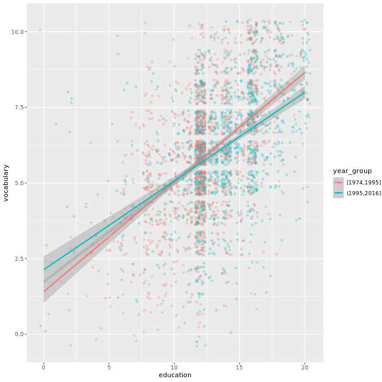
```
# Amend the plot
ggplot(Vocab, aes(x = education, y = vocabulary, color = year_group)) +
  geom_jitter(alpha = 0.25) +
  # Map the fill color to year_group, set the line size to 2
  stat_smooth(aes(fill = year_group), method = "lm", size = 2)
```

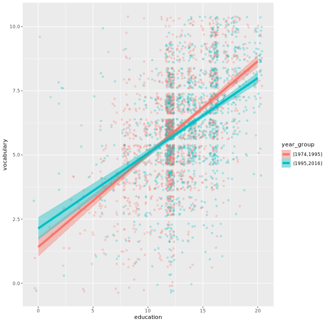

You have a vast plotting vocabulary! Notice that since 1995, education has relatively smaller effect on increasing vocabulary.

## Stats: sum and quantile


**Quantiles**

Here, we'll continue with the `Vocab` dataset and use [stat_quantile()](http://www.rdocumentation.org/packages/ggplot2/functions/geom_quantile) to apply a quantile regression.

Linear regression predicts the mean response from the explanatory variables, quantile regression predicts a quantile response (e.g. the median) from the explanatory variables. Specific quantiles can be specified with the `quantiles` argument.

Specifying many quantiles *and* color your models according to year can make plots too busy. We'll explore ways of dealing with this in the next chapter.

```
ggplot(Vocab, aes(x = education, y = vocabulary)) +
  geom_jitter(alpha = 0.25) +
  # Add a quantile stat, at 0.05, 0.5, and 0.95
  stat_quantile(quantiles = c(0.05, 0.5, 0.95))
```
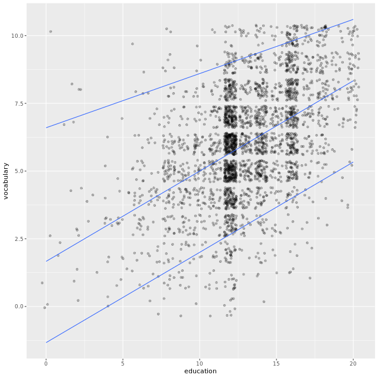
```
# Amend the plot to color by year_group
ggplot(Vocab, aes(x = education, y = vocabulary, color = year_group)) +
  geom_jitter(alpha = 0.25) +
  stat_quantile(quantiles = c(0.05, 0.5, 0.95))
```
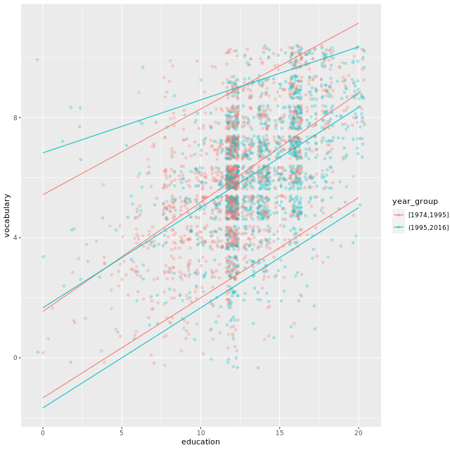

Quick quantiles! Quantile regression is a great tool for getting a more detailed overview of a large dataset.

**Using stat_sum**

In the `Vocab` dataset, `education` and `vocabulary` are integer variables. In the first course, you saw that this is one of the four causes of overplotting. You'd get a single point at each intersection between the two variables.

One solution, shown in the step 1, is jittering with transparency. Another solution is to use [stat_sum()](http://www.rdocumentation.org/packages/ggplot2/functions/geom_count), which calculates the total number of overlapping observations and maps that onto the `size` aesthetic.

`stat_sum()` allows a special variable, `..prop..`, to show the *proportion* of values within the dataset.

```
# Run this, look at the plot, then update it
ggplot(Vocab, aes(x = education, y = vocabulary)) +
  # Replace this with a sum stat
  geom_jitter(alpha = 0.25)
```
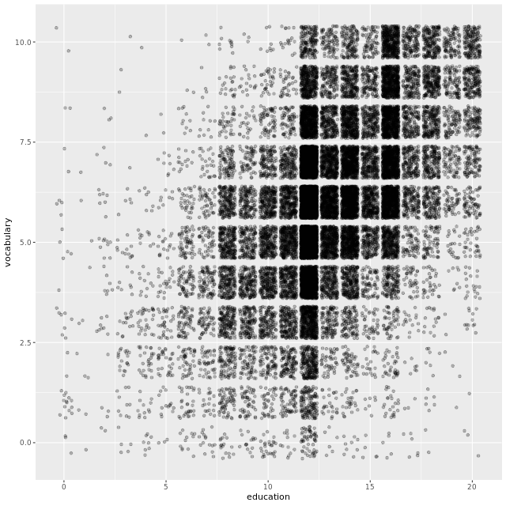
```
# update it
ggplot(Vocab, aes(x = education, y = vocabulary)) +
  # Replace this with a sum stat
  stat_sum(alpha = 0.25)
```
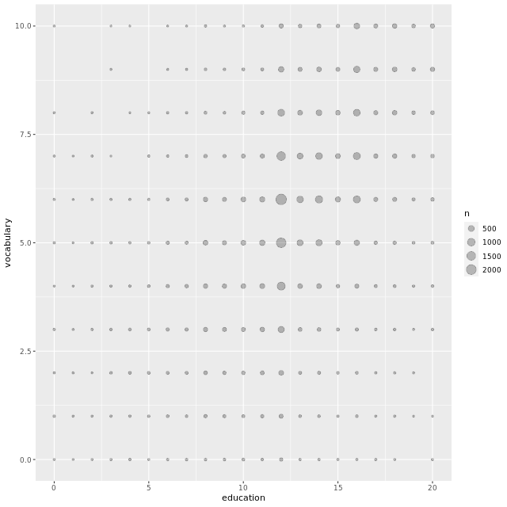
```
ggplot(Vocab, aes(x = education, y = vocabulary)) +
  stat_sum() +
  # Add a size scale, from 1 to 10
  scale_size(range = c(1, 10))
```
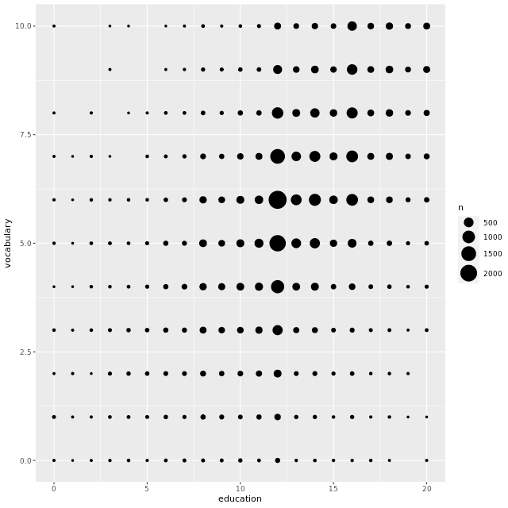
```
# Amend the stat to use proportion sizes
ggplot(Vocab, aes(x = education, y = vocabulary)) +
  stat_sum(aes(size = ..prop..))
```
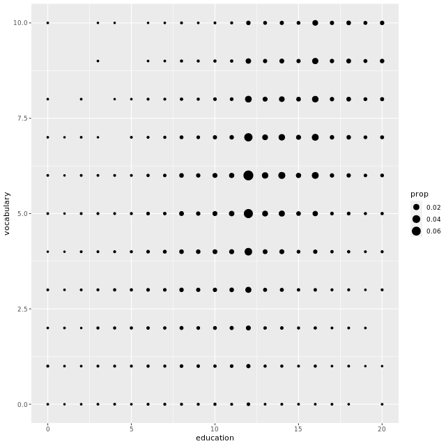
```
# Amend the plot to group by education
ggplot(Vocab, aes(x = education, y = vocabulary, group = education)) +
  stat_sum(aes(size = ..prop..))
```
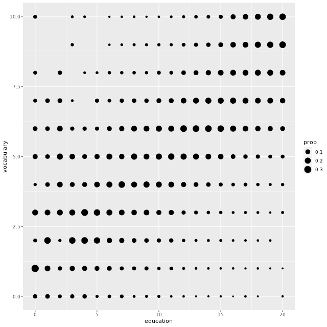

Superb stat summing! If a few data points overlap, jittering is great. When you have lots of overlaps (particularly where continuous data has been rounded), using `stat_sum()` to count the overlaps is more useful.

## Stats outside geoms


**Preparations**

In the following exercises, we'll aim to make the plot shown in the viewer. Here, we'll establish our positions and base layer of the plot.

Establishing these items as independent objects will allow us to recycle them easily in many layers, or plots.

- [position_jitter()](http://www.rdocumentation.org/packages/ggplot2/functions/position_jitter) adds *jittering* (e.g. for points).
- position_dodge(http://www.rdocumentation.org/packages/ggplot2/functions/position_dodge) *dodges* geoms, (e.g. bar, col, boxplot, violin, errorbar, pointrange).
- position_jitterdodge(http://www.rdocumentation.org/packages/ggplot2/functions/position_jitterdodge) *jitters* **and** *dodges* geoms, (e.g. points).

As before, we'll use `mtcars`, where `fcyl` and `fam` are proper factor variables of the original `cyl` and `am` variables.

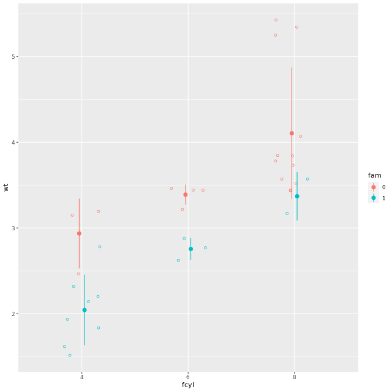

```{r}
mtcars$fam <- as.factor(mtcars$am)

# Define position objects
# 1. Jitter with width 0.2
posn_j <- position_jitter(width = 0.2)

# 2. Dodge with width 0.1
posn_d <- position_dodge(width = 0.1)

# 3. Jitter-dodge with jitter.width 0.2 and dodge.width 0.1
posn_jd <- position_jitterdodge(jitter.width = 0.2, dodge.width = 0.1)

# Create the plot base: wt vs. fcyl, colored by fam
p_wt_vs_fcyl_by_fam <- ggplot(mtcars, aes(x = fcyl, y = wt, color = fam))

# Add a point layer
p_wt_vs_fcyl_by_fam +
  geom_point()
```

Patient preparation! The default positioning of the points is highly susceptible to overplotting.

**Using position objects**

Now that the position objects have been created, you can apply them to the base plot to see their effects. You do this by adding a point geom and setting the `position` argument to the position object.

The variables from the last exercise, `posn_j`, `posn_d`, `posn_jd`, and `p_wt_vs_fcyl_by_fam` are available in your workspace.

```{r}
# Add jittering only
p_wt_vs_fcyl_by_fam +
  geom_point(position=posn_j)

# Add dodging only
p_wt_vs_fcyl_by_fam +
  geom_point(position=posn_d)

# Add jittering and dodging
p_wt_vs_fcyl_by_fam +
  geom_point(position=posn_jd)
```

Perfect positioning! Although you can set position by setting the `position` argument to a string (for example `position = "dodge"`), defining objects promotes consistency between layers.

**Plotting variations**

The preparation is done; now let's explore [stat_summary()](http://www.rdocumentation.org/packages/ggplot2/functions/stat_summary).

*Summary statistics* refers to a combination of *location* (mean or median) and *spread* (standard deviation or confidence interval).

These metrics are calculated in `stat_summary()` by passing a function to the `fun.data` argument. `mean_sdl()`, calculates multiples of the standard deviation and `mean_cl_normal()` calculates the t-corrected 95% CI.

Arguments to the data function are passed to `stat_summary()`'s `fun.args` argument as a list.

The position object, `posn_d`, and the plot with jittered points, `p_wt_vs_fcyl_by_fam_jit`, are available.

```{r}
p_wt_vs_fcyl_by_fam_jit <- p_wt_vs_fcyl_by_fam +
  geom_point(position=posn_j)

p_wt_vs_fcyl_by_fam_jit +
  # Add a summary stat of std deviation limits
  stat_summary(fun.data = mean_sdl, fun.args = list(mult = 1), position = posn_d)

p_wt_vs_fcyl_by_fam_jit +
  # Change the geom to be an errorbar
  stat_summary(fun.data = mean_sdl, fun.args = list(mult = 1), position = posn_d, geom="errorbar")

p_wt_vs_fcyl_by_fam_jit +
  # Add a summary stat of normal confidence limits
  stat_summary(fun.data = mean_cl_normal, position = posn_d)
```

Good job! You can always assign your own function to the `fun.data` argument as long as the result is a data frame and the variable names match the aesthetics that you will need for the geom layer.

## Coordinates

**Coordinates layer**

- controls plot dimensions
- `coord_`
  - e.g. `coord_cartesian()`
  
**Zooming in**

- `coord_cartesian(xlim = ...)`
- `scale_x_continuous(limits = ...)`
- `xlim(...)`


**Aspect ratio**

- height to width ratio
- watch out for deception!
- no universal standard so far
- typically use 1:1 if data is on the same scale

**Zooming In**

In the video, you saw different ways of using the coordinates layer to zoom in. In this exercise, we'll compare zooming by changing scales and by changing coordinates.

The big difference is that the scale functions change the underlying dataset, which affects calculations made by computed geoms (like histograms or smooth trend lines), whereas coordinate functions make no changes to the dataset.

A scatter plot using `mtcars` with a LOESS smoothed trend line is provided. Take a look at this before updating it.

```{r}
ggplot(mtcars, aes(x = wt, y = hp, color = fam)) +
  geom_point() +
  geom_smooth() 

ggplot(mtcars, aes(x = wt, y = hp, color = fam)) +
  geom_point() +
  geom_smooth() +
  # Add a continuous x scale from 3 to 6
  scale_x_continuous(limits=c(3, 6))

ggplot(mtcars, aes(x = wt, y = hp, color = fam)) +
  geom_point() +
  geom_smooth() +
  # Add Cartesian coordinates with x limits from 3 to 6
  coord_cartesian(xlim = c(3, 6))
```

Zesty zooming! Using the scale function to zoom in meant that there wasn't enough data to calculate the trend line, and `geom_smooth()` failed. When` coord_cartesian()` was applied, the full dataset was used for the trend calculation.

**Aspect ratio I: 1:1 ratios**

We can set the aspect ratio of a plot with [coord_fixed()](http://www.rdocumentation.org/packages/ggplot2/functions/coord_fixed), which uses `ratio = 1` as a default. A 1:1 aspect ratio is most appropriate when two continuous variables are on the same scale, as with the `iris` dataset.

All variables are measured in centimeters, so it only makes sense that one unit on the plot should be the same physical distance on each axis. This gives a more truthful depiction of the relationship between the two variables since the aspect ratio can change the angle of our smoothing line. This would give an erroneous impression of the data. Of course the underlying linear models don't change, but our perception can be influenced by the angle drawn.

A plot using the `iris` dataset, of sepal width vs. sepal length colored by species, is shown in the viewer.

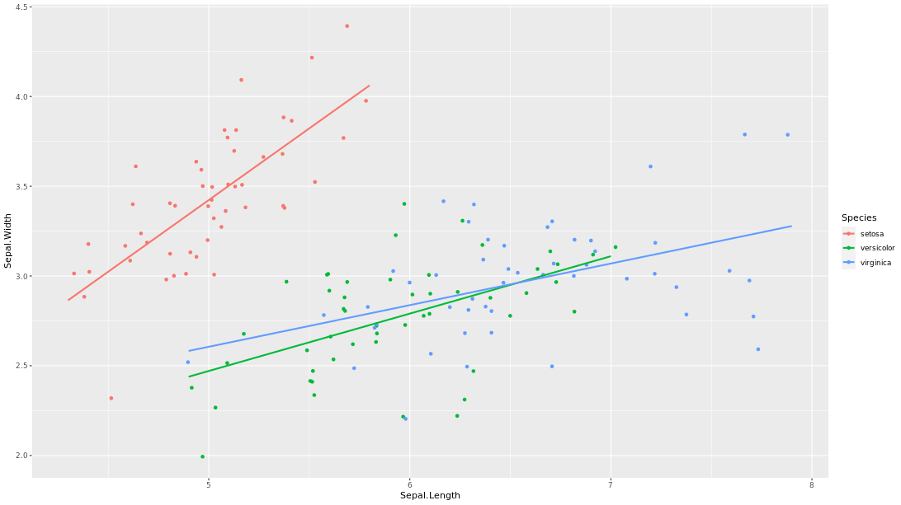

```{r}
ggplot(iris, aes(x = Sepal.Length, y = Sepal.Width, color = Species)) +
  geom_jitter() +
  geom_smooth(method = "lm", se = FALSE) +
  # Fix the coordinate ratio
  coord_fixed()
```

Awe-inspiring aspect alteration! A 1:1 aspect ratio is helpful when your axes show the same scales.

**Aspect ratio II: setting ratios**

When values are not on the same scale it can be a bit tricky to set an appropriate aspect ratio. A classic William Cleveland (inventor of dot plots) example is the `sunspots` data set. We have 3200 observations from 1750 to 2016.

`sun_plot` is a plot *without* any set aspect ratio. It fills up the graphics device.

To make aspect ratios clear, we've drawn an orange box that is 75 units high and 75 *years* wide. Using a 1:1 aspect ratio would make the box square. That aspect ratio would make things harder to see the oscillations: it is better to force a wider ratio.

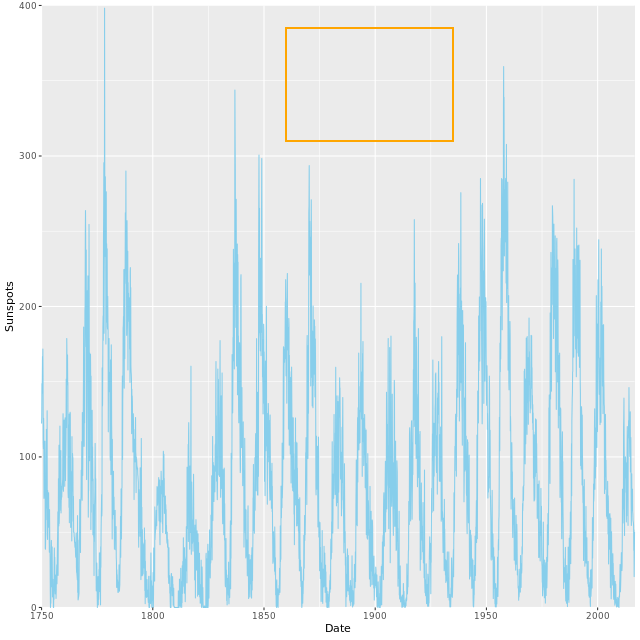

```
# Fix the aspect ratio to 1:1
sun_plot +
  coord_fixed()
```
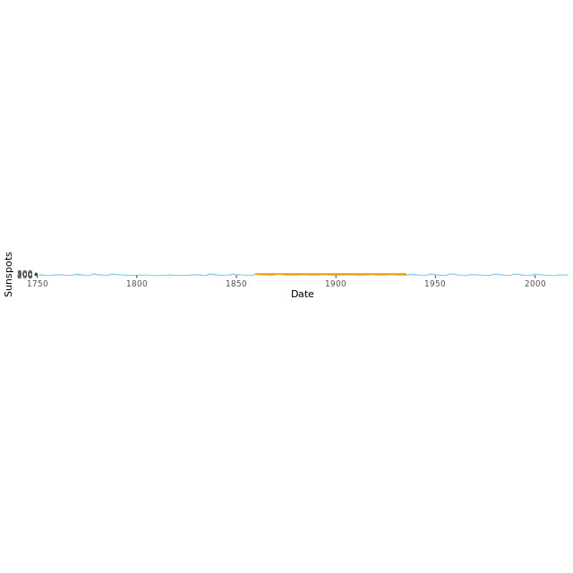
```
# Change the aspect ratio to 20:1
sun_plot +
  coord_fixed(ratio=20)
```


Fun plots with sunspots! Making a wide plot by calling `coord_fixed()` with a high `ratio` is often useful for long time series.

**Expand and clip**

The `coord_*()` layer functions offer two useful arguments that work well together: `expand` and `clip`.

- `expand` sets a buffer margin around the plot, so data and axes don't overlap. Setting `expand` to `0` draws the axes to the limits of the data.
- `clip` decides whether plot elements that would lie outside the plot panel are displayed or ignored ("clipped").

When done properly this can make a great visual effect! We'll use `theme_classic()` and modify the axis lines in this example.

```{r}
ggplot(mtcars, aes(wt, mpg)) +
  geom_point(size = 2) +
  theme_classic() +
  # Add Cartesian coordinates with zero expansion
  coord_cartesian(expand = 0)

ggplot(mtcars, aes(wt, mpg)) +
  geom_point(size = 2) +
  # Turn clipping off
  coord_cartesian(expand = 0, clip = "off") +
  theme_classic() +
  # Remove axis lines
  theme(axis.line = element_blank())
```

Cool clipping! These arguments make clean and accurate plots by not cutting off data.

## Coordinates vs. scales


**Log-transforming scales**

Using `scale_y_log10()` and `scale_x_log10()` is equivalent to transforming our actual dataset *before* getting to `ggplot2`.

Using `coord_trans()`, setting `x = "log10"` and/or `y = "log10"` arguments, transforms the data *after* statistics have been calculated. The plot will look the same as with using `scale_*_log10()`, but the scales will be different, meaning that we'll see the original values on our log10 transformed axes. This can be useful since log scales can be somewhat unintuitive.

Let's see this in action with positively skewed data - the brain and body weight of 51 mammals from the `msleep` dataset.

```{r}
# Produce a scatter plot of brainwt vs. bodywt
ggplot(msleep, aes(x=bodywt, y=brainwt)) +
  geom_point() +
  ggtitle("Raw Values")

# Add scale_*_*() functions
ggplot(msleep, aes(bodywt, brainwt)) +
  geom_point() +
  scale_x_log10() +
  scale_y_log10() +
  ggtitle("Scale_ functions")

# Perform a log10 coordinate system transformation
ggplot(msleep, aes(bodywt, brainwt)) +
  geom_point() +
  coord_trans(x = "log10", y = "log10")

# Plot with transformed coordinates
ggplot(msleep, aes(bodywt, brainwt)) +
  geom_point() +
  geom_smooth(method = "lm", se = FALSE) +
  # Add a log10 coordinate transformation for x and y axes
   coord_trans(x = "log10", y = "log10")
```

Terrific transformations! Each transformation method has implications for the plot's interpretability. Think about your audience when choosing a method for applying transformations.

**Adding stats to transformed scales**

In the last exercise, we saw the usefulness of the `coord_trans()` function, but be careful! Remember that statistics are calculated on the untransformed data. A linear model may end up looking not-so-linear after an axis transformation. Let's revisit the two plots from the previous exercise and compare their linear models.

```{r}
# Plot with a scale_*_*() function:
ggplot(msleep, aes(bodywt, brainwt)) +
  geom_point() +
  geom_smooth(method = "lm", se = FALSE) +
  # Add a log10 x scale
  scale_x_log10() +
  # Add a log10 y scale
  scale_y_log10() +
  ggtitle("Scale functions")

# Plot with transformed coordinates
ggplot(msleep, aes(bodywt, brainwt)) +
  geom_point() +
  geom_smooth(method = "lm", se = FALSE) +
  # Add a log10 coordinate transformation for x and y axes
   coord_trans(x = "log10", y = "log10")
```

Loopy lines! The smooth trend line is calculated after scale transformations but not coordinate transformations, so the second plot doesn't make sense. Be careful when using the `coord_trans()` function!

## Double and flipped axes

**Typical axis modifications**

- aspect ratios
  - adjust for best perspective
  
- transformation functions
  - adjust if original scale is inappropriate
  
- double x or y axes
  - add raw and transformed values
  
- flipped axes
  - change direction of dependencies
  - change geometry orientation


**Useful double axes**

Double x and y-axes are a contentious topic in data visualization. We'll revisit that discussion at the end of chapter 4. Here, I want to review a great use case where double axes actually do add value to a plot.

Our goal plot is displayed in the viewer. The two axes are the raw temperature values on a Fahrenheit scale and the transformed values on a Celsius scale.

You can imagine a similar scenario for Log-transformed and original values, miles and kilometers, or pounds and kilograms. A scale that is unintuitive for many people can be made easier by adding a transformation as a double axis.

```{r}
airquality$Date <- as.Date(paste('1973', airquality$Month, airquality$Day), '%Y %m %d')
  
# Using airquality, plot Temp vs. Date
ggplot(airquality, aes(x=Date, y=Temp)) +
  # Add a line layer
  geom_line() +
  labs(x = "Date (1973)", y = "Fahrenheit")

# Define breaks (Fahrenheit)
y_breaks <- c(59, 68, 77, 86, 95, 104)

# Convert y_breaks from Fahrenheit to Celsius
y_labels <- (y_breaks - 32) * 5 / 9

# Create a secondary x-axis
secondary_y_axis <- sec_axis(
  # Use identity transformation
  trans = identity,
  name = "Celsius",
  # Define breaks and labels as above
  breaks = y_breaks,
  labels = y_labels
)

# Examine the object
secondary_y_axis

# Update the plot
ggplot(airquality, aes(Date, Temp)) +
  geom_line() +
  # Add the secondary y-axis 
  scale_y_continuous(sec.axis = secondary_y_axis) +
  labs(x = "Date (1973)", y = "Fahrenheit")
```

Dazzling double axes! Double axes are most useful when you want to display the same value in two differnt units.

**Flipping axes I**

*Flipping* axes means to reverse the variables mapped onto the `x` and `y` aesthetics. We can just change the mappings in `aes()`, but we can also use the `coord_flip()` layer function.

There are two reasons to use this function:

- We want a vertical geom to be horizontal, or
- We've completed a long series of plotting functions and want to flip it without having to rewrite all our commands.

```{r}
# Plot fcyl bars, filled by fam
ggplot(mtcars, aes(fcyl, fill = fam)) +
  # Place bars side by side
  geom_bar(position = "dodge")

ggplot(mtcars, aes(fcyl, fill = fam)) +
  geom_bar(position = "dodge") +
  # Flip the x and y coordinates
  coord_flip()

ggplot(mtcars, aes(fcyl, fill = fam)) +
  # Set a dodge width of 0.5 for partially overlapping bars
  geom_bar(position = position_dodge(width=0.5)) +
  coord_flip()
```

Flipping fantastic! Horizontal bars are especially useful when the axis labels are long.

**Flipping axes II**

In this exercise, we'll continue to use the `coord_flip()` layer function to reverse the variables mapped onto the `x` and `y` aesthetics.

Within the `mtcars` dataset, `car` is the name of the car and `wt` is its weight.

```{r}
mtcars$car <- row.names(mtcars)

# Plot of wt vs. car
ggplot(mtcars, aes(x=car, y=wt)) +
  # Add a point layer
  geom_point() +
  labs(x = "car", y = "weight")

# Flip the axes to set car to the y axis
ggplot(mtcars, aes(car, wt)) +
  geom_point() +
  labs(x = "car", y = "weight") +
  coord_flip()
```

Even funkier flips! Notice how much more interpretable the plot is after flipping the axes.

##Polar coordinates


**Polar coordinates**

- Cartesian (2d)
  - orthogonal x and y-axes
  
- Maps
  - many projections
  
- Polar
  - transformed Cartesian space


**Pie charts**

The [coord_polar()](http://www.rdocumentation.org/packages/ggplot2/functions/coord_polar) function converts a planar x-y Cartesian plot to polar coordinates. This can be useful if you are producing pie charts.

We can imagine two forms for pie charts - the typical filled circle, or a colored ring.

Typical pie charts omit all of the non-data ink, which we saw in the themes chapter of the last course. Pie charts are not really better than stacked bar charts, but we'll come back to this point in the next chapter.

A bar plot using `mtcars` of the number of cylinders (as a factor), `fcyl`, is shown in the plot viewer.

```{r}
ggplot(mtcars, aes(x = 1, fill = fcyl)) +
  geom_bar()

ggplot(mtcars, aes(x = 1, fill = fcyl)) +
  geom_bar() +
  # Add a polar coordinate system
  coord_polar(theta="y")

ggplot(mtcars, aes(x = 1, fill = fcyl)) +
  # Reduce the bar width to 0.1
  geom_bar(width=0.1) +
  coord_polar(theta = "y") +
  # Add a continuous x scale from 0.5 to 1.5
  scale_x_continuous(limits=c(0.5, 1.5))
```

Super-fly pie! Polar coordinates are particularly useful if you are dealing with a cycle, like yearly data, that you would like to see represented as such.

**Wind rose plots**

Polar coordinate plots are well-suited to scales like compass direction or time of day. A popular example is the "wind rose".

The `wind` dataset is taken from the `openair` package and contains hourly measurements for windspeed (`ws`) and direction (`wd`) from London in 2003. Both variables are factors.

```{r}
library(openair)
library(forcats)
library(dplyr)

rose_breaks <- c(0, 360/32, (1/32 + (1:15 / 16)) * 360, 360)
rose_labs <- c(
  "N", "NNE", "NE", "ENE", "E", "ESE", "SE", "SSE", "S", "SSW", "SW", "WSW", "W", "WNW", "NW", "NNW", "N")
ws_labs <- c("0 - 2", "2 - 4", "4 - 6", "6 - 8", "8 - 10", "10 - 12", "12 - 14")
wind <- selectByDate(mydata[c("date", "ws", "wd")], start = "2003-01-01", end = "2003-12-31")
wind$ws <- as.factor(cut(wind$ws, breaks = c(0,2,4,6,8,10,12,14), labels = ws_labs))
wind$wd <- as.factor(cut(wind$wd, breaks = rose_breaks, labels = rose_labs))
wind <- wind[complete.cases(wind),]

# Using wind, plot wd filled by ws
ggplot(wind, aes(x=wd, fill=ws)) +
  # Add a bar layer with width 1
  geom_bar(width=1)

# Convert to polar coordinates:
ggplot(wind, aes(wd, fill = ws)) +
  geom_bar(width = 1) +
  coord_polar()

# Convert to polar coordinates:
ggplot(wind, aes(wd, fill = ws)) +
  geom_bar(width = 1) +
  coord_polar(start = -pi/16)
```

Perfect polar coordinates! They are not common, but polar coordinate plots are really useful.

## The facets layer

**Facets**

- straight-forward yet useful
- concept of small multiples
  - popularized by Edward Tufte
  - visualization of quantitative information, 1983


**Facet layer basics**

Faceting splits the data up into groups, according to a categorical variable, then plots each group in its own panel. For splitting the data by one or two categorical variables, [facet_grid()](http://www.rdocumentation.org/packages/ggplot2/functions/facet_grid) is best.

Given categorical variables `A` and `B`, the code pattern is

```
plot +
  facet_grid(rows = vars(A), cols = vars(B))
```

This draws a panel for each pairwise combination of the values of `A` and `B`.

Here, we'll use the `mtcars` data set to practice. Although `cyl` and `am` are not encoded as factor variables in the data set, `ggplot2` will coerce variables to factors when used in facets.

```{r}
ggplot(mtcars, aes(wt, mpg)) + 
  geom_point() +
  # Facet rows by am
  facet_grid(rows=vars(am))

ggplot(mtcars, aes(wt, mpg)) + 
  geom_point() +
  # Facet columns by cyl
  facet_grid(cols=vars(cyl))

ggplot(mtcars, aes(wt, mpg)) + 
  geom_point() +
  # Facet rows by am and columns by cyl
  facet_grid(rows=vars(am), cols=vars(cyl))
```

Fantastic faceting! Compare the different plots that result and see which one makes most sense.

**Many variables**

In addition to aesthetics, facets are another way of encoding factor (i.e. categorical) variables. They can be used to reduce the complexity of plots with many variables.

Our goal is the plot in the viewer, which contains 7 variables.

Two variables are mapped onto the color aesthetic, using hue and lightness. To achieve this we combined `fcyl` and `fam` into a single [interaction](https://www.rdocumentation.org/packages/base/topics/interaction) variable, `fcyl_fam`. This will allow us to take advantage of Color Brewer's *Paired* color palette.

```{r}
mtcars$fcyl_fam <- interaction(mtcars$fcyl, mtcars$fam, sep=":")

# See the interaction column
mtcars$fcyl_fam

# Color the points by fcyl_fam
ggplot(mtcars, aes(x = wt, y = mpg, color = fcyl_fam)) +
  geom_point() +
  # Use a paired color palette
  scale_color_brewer(palette = "Paired")

# Update the plot to map disp to size
ggplot(mtcars, aes(x = wt, y = mpg, color = fcyl_fam, size = disp)) +
  geom_point() +
  scale_color_brewer(palette = "Paired")

# Update the plot
ggplot(mtcars, aes(x = wt, y = mpg, color = fcyl_fam, size = disp)) +
  geom_point() +
  scale_color_brewer(palette = "Paired") +
  # Grid facet on gear and vs
  facet_grid(rows = vars(gear), cols = vars(vs))
```

Good job! The last plot you've created contains 7 variables (4 categorical, 3 continuous). Useful combinations of aesthetics and facets help to achieve this.

**Formula notation**

As well as the `vars()` notation for specifying which variables should be used to split the dataset into facets, there is also a traditional formula notation. The three cases are shown in the table.

**Modern notation**                        | **Formula notation**
------------------------------------------ | --------------------
facet_grid(rows = vars(A))	               | facet_grid(A ~ .)
facet_grid(cols = vars(B))	               | facet_grid(. ~ B)
facet_grid(rows = vars(A), cols = vars(B)) | facet_grid(A ~ B)

`mpg_by_wt` is available again. Rework the previous plots, this time using formula notation.

```{r}
ggplot(mtcars, aes(wt, mpg)) + 
  geom_point() +
  # Facet rows by am using formula notation
  facet_grid(am ~ .)

ggplot(mtcars, aes(wt, mpg)) + 
  geom_point() +
  # Facet columns by cyl using formula notation
  facet_grid(. ~ cyl)

ggplot(mtcars, aes(wt, mpg)) + 
  geom_point() +
  # Facet rows by am and columns by cyl using formula notation
  facet_grid(am ~ cyl)
```

Fortunate formula formulation! While many ggplots still use the traditional formula notation, using `vars()` is now preferred.

## Facet labels and order


**Labeling facets**

If your factor levels are not clear, your facet labels may be confusing. You can assign proper labels in your original data *before* plotting (see next exercise), or you can use the `labeller` argument in the facet layer.

The default value is

- `label_value`: Default, displays only the value

Common alternatives are:

- `label_both`: Displays both the value and the variable name
- `label_context`: Displays only the values or both the values and variables depending on whether multiple factors are faceted

```{r}
# Plot wt by mpg
ggplot(mtcars, aes(wt, mpg)) +
  geom_point() +
  # The default is label_value
  facet_grid(cols = vars(cyl))

# Plot wt by mpg
ggplot(mtcars, aes(wt, mpg)) +
  geom_point() +
  # Displaying both the values and the variables
  facet_grid(cols = vars(cyl), labeller = label_both)

# Plot wt by mpg
ggplot(mtcars, aes(wt, mpg)) +
  geom_point() +
  # Label context
  facet_grid(cols = vars(cyl), labeller = label_context)

# Plot wt by mpg
ggplot(mtcars, aes(wt, mpg)) +
  geom_point() +
  # Two variables
  facet_grid(cols = vars(vs, cyl), labeller = label_context)
```

Lovely labels! Make sure there is no ambiguity in interpreting plots by using proper labels.

**Setting order**

If you want to change the order of your facets, it's best to properly define your factor variables *before* plotting.

Let's see this in action with the `mtcars` transmission variable `am`. In this case, `0` = "automatic" and `1` = "manual".

Here, we'll make `am` a factor variable and relabel the numbers to proper names. The default order is alphabetical. To rearrange them we'll call `fct_rev()` from the `forcats` package to reverse the order.

```{r}
# Make factor, set proper labels explictly
mtcars$fam <- factor(mtcars$am, labels = c(`0` = "automatic",
                                           `1` = "manual"))

# Default order is alphabetical
ggplot(mtcars, aes(wt, mpg)) +
  geom_point() +
  facet_grid(cols = vars(fam))

# Make factor, set proper labels explictly, and
# manually set the label order
mtcars$fam <- factor(mtcars$am,
                     levels = c(1, 0),
                     labels = c("manual", "automatic"))

# View again
ggplot(mtcars, aes(wt, mpg)) +
  geom_point() +
  facet_grid(cols = vars(fam))
```

Outstanding ordering! Arrange your facets in an intuitive order for your data.

## Facet plotting spaces


**Variable plotting spaces I: continuous variables**

By default every facet of a plot has the same axes. If the data ranges vary wildly between facets, it can be clearer if each facet has its own scale. This is achieved with the `scales` argument to `facet_grid()`.

- `"fixed"` (default): axes are shared between facets.
- `"free"`: each facet has its own axes.
- `"free_x"`: each facet has its own x-axis, but the y-axis is shared.
- `"free_y"`: each facet has its own y-axis, but the x-axis is shared.

When faceting by columns, `"free_y"` has no effect, but we can adjust the x-axis. In contrast, when faceting by rows, `"free_x"` has no effect, but we can adjust the y-axis.

```{r}
ggplot(mtcars, aes(wt, mpg)) +
  geom_point() + 
  # Facet columns by cyl 
  facet_grid(cols = vars(cyl))

ggplot(mtcars, aes(wt, mpg)) +
  geom_point() + 
  # Update the faceting to free the x-axis scales
  facet_grid(cols = vars(cyl),
            scales = "free_x")

ggplot(mtcars, aes(wt, mpg)) +
  geom_point() + 
  # Swap cols for rows; free the y-axis scales
  facet_grid(rows = vars(cyl), scales = "free_y")
```

Freedom! Shared scales make it easy to compare between facets, but can be confusing if the data ranges are very different. In that case, used free scales.

**Variable plotting spaces II: categorical variables**

When you have a categorical variable with many levels which are not all present in each sub-group of another variable, it's usually desirable to drop the unused levels.

By default, each facet of a plot is the same size. This behavior can be changed with the `spaces` argument, which works in the same way as `scales`: `"free_x"` allows different sized facets on the x-axis, `"free_y"`, allows different sized facets on the y-axis, `"free"` allows different sizes in both directions.

```{r}
ggplot(mtcars, aes(x = mpg, y = car, color = fam)) +
  geom_point() +
  # Facet rows by gear
  facet_grid(rows=vars(gear))

ggplot(mtcars, aes(x = mpg, y = car, color = fam)) +
  geom_point() +
  # Free the y scales and space
  facet_grid(rows = vars(gear),              
             scales = "free_y",
             space = "free_y")
```

Super spaces! Freeing the y-scale to remove blank lines helps focus attention on the actual data present.

## Facet wrap & margins

**Using facet_wrap()**

Use cases:

1. When you want both x and y axes to be free on every individual plot
  - i.e. not just per row or column as per `facet_grid()`
2. When your categorical (factor) variable has many groups (levels)
  - i.e. too many sub plots for column or row-wise faceting
  - a more typical scenario
  


**Wrapping for many levels**

`facet_grid()` is fantastic for categorical variables with a small number of levels. Although it is possible to facet variables with many levels, the resulting plot will be very wide or very tall, which can make it difficult to view.

The solution is to use `facet_wrap()` which separates levels along one axis but wraps all the subsets across a given number of rows or columns.

For this plot, we'll use the `Vocab` dataset that we've already seen. The base layer is provided.

Since we have many `years`, it doesn't make sense to use `facet_grid()`, so let's try `facet_wrap()` instead.

```
ggplot(Vocab, aes(x = education, y = vocabulary)) +
  stat_smooth(method = "lm", se = FALSE) +
  # Create facets, wrapping by year, using vars()
  facet_wrap(vars(year))
```
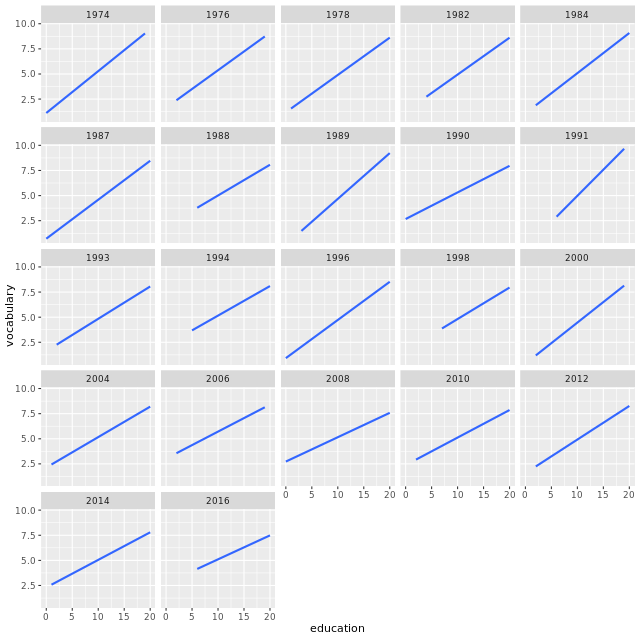
```
ggplot(Vocab, aes(x = education, y = vocabulary)) +
  stat_smooth(method = "lm", se = FALSE) +
  # Create facets, wrapping by year, using a formula
  facet_wrap(~ year)
```

```
ggplot(Vocab, aes(x = education, y = vocabulary)) +
  stat_smooth(method = "lm", se = FALSE) +
  # Update the facet layout, using 11 columns
  facet_wrap(~ year, ncol = 11)
```
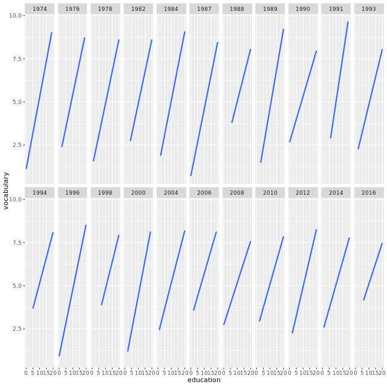

**Margin plots**

Facets are great for seeing subsets in a variable, but sometimes you want to see both those subsets and all values in a variable.

Here, the `margins` argument to `facet_grid()` is your friend.

- `FALSE`(default): no margins.
- `TRUE`: add margins to every variable being faceted by.
- `c("variable1", "variable2")`: only add margins to the variables listed.

To make it easier to follow the facets, we've created two factor variables with proper labels — `fam` for the transmission type, and `fvs` for the engine type, respectively.

```{r}
library(forcats)
# Make factor, set proper labels explictly
mtcars$fam <- factor(mtcars$am, labels = c('0' = "automatic", '1' = "manual"))
mtcars$fvs <- factor(mtcars$vs, labels = c('0' = "V-shaped", '1' = "straight"))

ggplot(mtcars, aes(x = wt, y = mpg)) + 
  geom_point() +
  # Facet rows by fvs and cols by fam
  facet_grid(rows = vars(fvs, fam), col = vars(gear))

ggplot(mtcars, aes(x = wt, y = mpg)) + 
  geom_point() +
  # Update the facets to add margins
  facet_grid(rows = vars(fvs, fam), cols = vars(gear), margins = TRUE)

ggplot(mtcars, aes(x = wt, y = mpg)) + 
  geom_point() +
  # Update the facets to only show margins on fam
  facet_grid(rows = vars(fvs, fam), cols = vars(gear), margins = "fam")

ggplot(mtcars, aes(x = wt, y = mpg)) + 
  geom_point() +
  # Update the facets to only show margins on gear and fvs
  facet_grid(rows = vars(fvs, fam), cols = vars(gear), margins = c("gear", "fvs"))
```

Magic margins! It can be really helpful to show the full margin plots!

## Best practices: bar plots

**In this chapter**

- common pitfalls in data viz
- best way to represent data
  - for effective explanatory (communication), and
  - for effective exploratory (investigation) plots
  
**bar plots**

- two types
  - absolute values
  - distributions
  


**Bar plots: dynamite plots**

In the video we saw many reasons why "dynamite plots" (bar plots with error bars) are *not* well suited for their intended purpose of depicting distributions. If you really want error bars on bar plots, you can of course get them, but you'll need to set the positions manually. A point geom will typically serve you much better.

Nonetheless, you should know how to handle these kinds of plots, so let's give it a try.

```{r}
# Plot wt vs. fcyl
ggplot(mtcars, aes(x = fcyl, y = wt)) +
  # Add a bar summary stat of means, colored skyblue
  stat_summary(fun.y = mean, geom = "bar", fill = "skyblue") +
  # Add an errorbar summary stat std deviation limits
  stat_summary(fun.data = mean_sdl, fun.args = list(mult = 1), geom = "errorbar", width = 0.1)
```

Excellent errors! Remember, we can specify any function in `fun.data` or `fun.y` and we can also specify any `geom`, as long as it's appropriate to the data type.

**Bar plots: position dodging**

In the previous exercise we used the `mtcars` dataset to draw a dynamite plot about the weight of the cars per cylinder type.

In this exercise we will add a distinction between transmission type, `fam`, for the dynamite plots and explore position dodging (where bars are side-by-side).

```{r}
# Update the aesthetics to color and fill by fam
ggplot(mtcars, aes(x = fcyl, y = wt, color = fam, fill = fam)) +
  stat_summary(fun.y = mean, geom = "bar") +
  stat_summary(fun.data = mean_sdl, fun.args = list(mult = 1), geom = "errorbar", width = 0.1)

# For each summary stat, set the position to dodge
ggplot(mtcars, aes(x = fcyl, y = wt, color = fam, fill = fam)) +
  stat_summary(fun.y = mean, geom = "bar", position = "dodge", alpha = 0.5) +
  stat_summary(fun.data = mean_sdl, fun.args = list(mult = 1), geom = "errorbar", position = "dodge", width = 0.1)

# Define a dodge position object with width 0.9
posn_d <- position_dodge(width = 0.9)

# For each summary stat, update the position to posn_d
ggplot(mtcars, aes(x = fcyl, y = wt, color = fam, fill = fam)) +
  stat_summary(fun.y = mean, geom = "bar", position = posn_d, alpha = 0.5) +
  stat_summary(fun.data = mean_sdl, fun.args = list(mult = 1), width = 0.1, position = posn_d, geom = "errorbar")
```

Bar plots 2.0! Slightly overlapping bar plots are common in the popular press and add a bit of style to your data viz.

**Bar plots: Using aggregated data**

If it *is* appropriate to use bar plots (see the video!), then it nice to give an impression of the number of values in each group.

`stat_summary()` doesn't keep track of the count. [stat_sum()](http://www.rdocumentation.org/packages/ggplot2/functions/geom_count) does (that's the whole point), but it's difficult to access. It's more straightforward to calculate exactly what we want to plot ourselves.

Here, we've created a summary data frame called `mtcars_by_cyl` which contains the average (`mean_wt`), standard deviations (`sd_wt`) and count (`n_wt`) of car weights, for each cylinder group, `cyl`. It also contains the proportion (`prop`) of each cylinder represented in the entire dataset. Use the console to familiarize yourself with the `mtcars_by_cyl` data frame.

```{r}
library(dplyr)
mtcars_by_cyl <- mtcars %>% 
                 select(wt, cyl) %>% 
                 group_by(cyl) %>% 
                 summarize(mean_wt = round(mean(wt), 2), sd_wt=round(sd(wt), 3), n_wt=n()) %>% 
                 mutate(prop=round(n_wt/sum(n_wt), 3))
mtcars_by_cyl

ggplot(mtcars_by_cyl, aes(x = cyl, y = mean_wt)) +
  # Swap geom_bar() for geom_col()
  geom_bar(stat = "identity", fill = "skyblue")

ggplot(mtcars_by_cyl, aes(x = cyl, y = mean_wt)) +
  # Swap geom_bar() for geom_col()
  geom_col(fill = "skyblue")

ggplot(mtcars_by_cyl, aes(x = cyl, y = mean_wt)) +
  # Set the width aesthetic to prop
  geom_col(aes(width = prop), fill = "skyblue")

ggplot(mtcars_by_cyl, aes(x = cyl, y = mean_wt)) +
  geom_col(aes(width = prop), fill = "skyblue") +
  # Add an errorbar layer
  geom_errorbar(
    # ... at mean weight plus or minus 1 std dev
    aes(ymin=mean_wt-sd_wt,
        ymax=mean_wt+sd_wt),
    # with width 0.1
    width=0.1)
```

Awesome Aggregrates! This is a good start, but it's difficult to adjust the spacing between the bars.

## Heatmaps use case scenario


- color on a continuous scale is problematic
  - color depends on context


- precision of perception is increased, while speed of perceiving trends is decreased


- precision of perception is decreased, while speed of perceiving trends is increased


**Heat maps**

Since heat maps encode *color* on a continuous scale, they are difficult to accurately *decode*, a topic we discussed in the first course. Hence, heat maps are most useful if you have a small number of boxes and/or a clear pattern that allows you to overcome decoding difficulties.

To produce them, map two categorical variables onto the `x` and `y` aesthetics, along with a continuous variable onto `fill`. The [geom_tile()](http://www.rdocumentation.org/packages/ggplot2/functions/geom_tile) layer adds the boxes.

We'll produce the heat map we saw in the video (in the viewer) with the built-in `barley` dataset. The `barley` dataset is in the `lattice` package and has already been loaded for you. Use [str()](http://www.rdocumentation.org/packages/utils/functions/str) to explore the structure.

```{r}
library(lattice)
library(RColorBrewer)
str(barley)

# Using barley, plot variety vs. year, filled by yield
ggplot(barley, aes(x=year, y=variety, fill=yield)) +
  # Add a tile geom
  geom_tile()

# Previously defined
ggplot(barley, aes(x = year, y = variety, fill = yield)) +
  geom_tile() + 
  # Facet, wrapping by site, with 1 column
  facet_wrap(facets = vars(site), ncol = 1) +
  # Add a fill scale using an 2-color gradient
  scale_fill_gradient(low = "white", high = "red")

# A palette of 9 reds
red_brewer_palette <- brewer.pal(9, "Reds")

# Update the plot
ggplot(barley, aes(x = year, y = variety, fill = yield)) +
  geom_tile() + 
  facet_wrap(facets = vars(site), ncol = 1) +
  # Update scale to use n-colors from red_brewer_palette
  scale_fill_gradientn(colors=red_brewer_palette)
```

Good job! You can continue by using breaks, limits and labels to modify the fill scale and update the theme, but this is a pretty good start.

**Heat map alternatives**

There are several alternatives to heat maps. The best choice really depends on the data and the story you want to tell with this data. If there is a time component, the most obvious choice is a line plot.

```{r}
# The heat map we want to replace
# Don't remove, it's here to help you!
ggplot(barley, aes(x = year, y = variety, fill = yield)) +
  geom_tile() +
  facet_wrap( ~ site, ncol = 1) +
  scale_fill_gradientn(colors = brewer.pal(9, "Reds"))

# Using barley, plot yield vs. year, colored and grouped by variety
ggplot(barley, aes(x=year, y=yield, color=variety, group=variety)) +
  # Add a line layer
  geom_line() +
  # Facet, wrapping by site, with 1 row
  facet_wrap( ~ site, nrow = 1)

# Using barely, plot yield vs. year, colored, grouped, and filled by site
ggplot(barley, aes(x = year, y = yield, color = site, group = site, fill = site)) +
  # Add a line summary stat aggregated by mean
  stat_summary(fun.y = mean, geom = "line") +
  # Add a ribbon summary stat with 10% opacity, no color
  stat_summary(fun.data = mean_sdl, fun.args = list(mult = 1), geom = "ribbon", alpha = 0.1, color = NA)
```

Good job! Whenever you see a heat map, ask yourself it it's really necessary. Many people use them because they look fancy and complicated - signs of poor communication skills.

## When good data makes bad plots

**Bad plots: style

- color
  - not color-blind-friendly (e.g. primarily red and green)
  - wrong palette for data type (remember sequential, qualitative, and divergent)
  - indistinguishable groups (i.e. colors are too similar)
  - ugly (high saturation primary colors)
  
- text
  - illegible (e.g. too small, poor resolution)
  - non-descriptive (e.g. "length" -- of what? which units?)
  - missing
  - inappropriate (e.g. comic sans)


**Guidelines not rules**

- use your common sense
  - is there anything on my plot that obscures a clear reading of the data or the take-home message?

**Suppression of the origin**

Suppression of the origin refers to not showing 0 on a continuous scale. It is inappropriate to suppress the origin when the scale has a natural zero, like height or distance - but it's not strictly necessary and not always appropriate.

**Color blindness**

Red-Green color blindness is surprisingly prevalent, which means that part of your audience will not be able to ready your plot if you are relying on color aesthetics.

It would be appropriate to use red and green in a plot when red and green have different intensities (e.g. light red and dark green).

If you really want to use red and green, this is a way to make them accessible to color blind people, since they will still be able to distinguish intensity. It's not as salient as hue, but it still works.

**Typical problems**

When you first encounter a data visualization, either from yourself or a colleague, you always want to critically ask if it's obscuring the data in any way.

Let's take a look at the steps we could take to produce and improve the plot in the view.

The data comes from an experiment where the effect of two different types of vitamin C sources, orange juice or ascorbic acid, were tested on the growth of the odontoblasts (cells responsible for tooth growth) in 60 guinea pigs.

The data is stored in the `TG` data frame, which contains three variables: `dose`, `len`, and `supp`.

```{r}
library(datasets)
TG <- ToothGrowth

# Initial plot
growth_by_dose <- ggplot(TG, aes(dose, len, color = supp)) +
  stat_summary(fun.data = mean_sdl,
               fun.args = list(mult = 1),
               position = position_dodge(0.1)) +
  theme_gray(3)

# View plot
growth_by_dose

# Change theme
growth_by_dose <- ggplot(TG, aes(dose, len, color = supp)) +
  stat_summary(fun.data = mean_sdl,
               fun.args = list(mult = 1),
               position = position_dodge(0.1)) +
  theme_classic()

# View plot
growth_by_dose

# Change type
TG$dose <- as.numeric(as.character(TG$dose))

# Plot
growth_by_dose <- ggplot(TG, aes(dose, len, color = supp)) +
  stat_summary(fun.data = mean_sdl,
               fun.args = list(mult = 1),
               position = position_dodge(0.2)) +
  theme_classic()

# View plot
growth_by_dose

# Change type
TG$dose <- as.numeric(as.character(TG$dose))

# Plot
growth_by_dose <- ggplot(TG, aes(dose, len, color = supp)) +
  stat_summary(fun.data = mean_sdl,
               fun.args = list(mult = 1),
               position = position_dodge(0.2)) +
  # Use the right geometry
  stat_summary(fun.y = mean,
               geom = "line",
               position = position_dodge(0.1)) +
  theme_classic()

# View plot
growth_by_dose

# Change type
TG$dose <- as.numeric(as.character(TG$dose))

# Plot
growth_by_dose <- ggplot(TG, aes(dose, len, color = supp)) +
  stat_summary(fun.data = mean_sdl,
               fun.args = list(mult = 1),
               position = position_dodge(0.2)) +
  stat_summary(fun.y = mean,
               geom = "line",
               position = position_dodge(0.1)) +
  theme_classic() +
  # Adjust labels and colors:
  labs(x = "Dose (mg/day)", y = "Odontoblasts length (mean, standard deviation)", color = "Supplement") +
  scale_color_brewer(palette = "Set1", labels = c("Orange juice", "Ascorbic acid")) +
  scale_y_continuous(limits = c(0,35), breaks = seq(0, 35, 5), expand = c(0,0))

# View plot
growth_by_dose
```

