```{r setup, include=FALSE}
knitr::opts_chunk$set(echo = TRUE)
```

**Your instructor - Rick Scavetta**

- email: office@scavetta.academy
- twitter: @Rick_Scavetta


**Drawing your first plot**

To get a first feel for `ggplot2`, let's try to run some basic `ggplot2` commands. The `mtcars` dataset contains information on 32 cars from a 1973 issue of Motor Trend magazine. This dataset is small, intuitive, and contains a variety of continuous and categorical variables.

```{r}
# Load the ggplot2 package
library(pacman)
p_load(ggplot2)

# Explore the mtcars data frame with str()
data(mtcars)
str(mtcars)

# Execute the following command
p <- ggplot(mtcars, aes(cyl, mpg)) +
  geom_point()
```

Notice that `ggplot2` treats `cyl` as a continuous variable. You get a plot, but it's not quite right, because it gives the impression that there is such a thing as a 5 or 7-cylinder car, which there is not.

**Data columns types affect plot types**

The plot from the previous exercise wasn't really satisfying. Although `cyl` (the number of cylinders) is categorical, you probably noticed that it is classified as numeric in `mtcars`. This is really misleading because the representation in the plot doesn't match the actual data type. You'll have to explicitly tell `ggplot2` that `cyl` is a categorical variable.

```{r}
# Change the command below so that cyl is treated as factor
ggplot(mtcars, aes(factor(cyl), mpg)) +
  geom_point()
```

Notice that `ggplot2` treats `cyl` as a factor. This time the x-axis does not contain variables like 5 or 7, only the values that are present in the dataset.

**The grammar of graphics**


**Mapping data columns to aesthetics**

Let's dive a little deeper into the three main topics in this course: The data, aesthetics, and geom layers. We'll get to making pretty plots in the last chapter with the themes layer.

We'll continue working on the 32 cars in the `mtcars` data frame.

Consider how the examples and concepts we discuss throughout these courses apply to your own data-sets!

```{r}
# Edit to add a color aesthetic mapped to disp
ggplot(mtcars, aes(wt, mpg, color = disp)) +
  geom_point()

# Change the color aesthetic to a size aesthetic
ggplot(mtcars, aes(wt, mpg, size = disp)) +
  geom_point()
```

Notice that a legend for the color and size scales was automatically generated.

**ggplot2 layers**

- the grammar of graphics implemented in R
- Two key concepts:
  1. layer grammatical elements
  2. aesthetic mappings
  


**Adding geometries**

The `diamonds` dataset contains details of 1,000 diamonds. Among the variables included are `carat` (a measurement of the diamond's size) and `price`.

You'll use two common geom layer functions:

- [geom_point()](http://www.rdocumentation.org/packages/ggplot2/functions/geom_point) adds points (as in a scatter plot).
- [geom_smooth()](http://www.rdocumentation.org/packages/ggplot2/functions/geom_smooth) adds a smooth trend curve.

As you saw previously, these are added using the `+` operator.

```
ggplot(data, aes(x, y)) +
  geom_*()
```

Where `*` is the specific geometry needed. 

```{r}
# Explore the diamonds data frame with str()
data(diamonds)
str(diamonds)

# Add geom_point() with +
ggplot(diamonds, aes(carat, price)) +
  geom_point()

# Add geom_smooth() with +
ggplot(diamonds, aes(carat, price)) +
  geom_point() +
  geom_smooth()
```

If you had executed the command without adding a `+`, it would produce an error message 'No layers in plot' because you are missing the third essential layer - the geom layer.

**Changing one geom or every geom**

If you have multiple geoms, then mapping an aesthetic to data variable inside the call to `ggplot()` will change *all* the geoms. It is also possible to make changes to *individual* geoms by passing arguments to the `geom_*()` functions.

`geom_point(`) has an `alpha` argument that controls the opacity of the points. A value of `1` (the default) means that the points are totally opaque; a value of `0` means the points are totally transparent (and therefore invisible). Values in between specify transparency.

The plot you drew last time is provided in the script.

```{r}
# Map the color aesthetic to clarity
ggplot(diamonds, aes(carat, price, color = clarity)) +
  geom_point() +
  geom_smooth()

# Make the points 40% opaque
ggplot(diamonds, aes(carat, price, color = clarity)) +
  geom_point(alpha = 0.4) +
  geom_smooth()
```

`geom_point()` + `geom_smooth()` is a common combination.

**Saving plots as variables**

Plots can be saved as variables, which can be added to later on using the `+` operator. This is really useful if you want to make multiple related plots from a common base.

```{r}
# Draw a ggplot
plt_price_vs_carat <- ggplot(
  # Use the diamonds dataset
  diamonds,
  # For the aesthetics, map x to carat and y to price
  aes(carat, price)
)

# Add a point layer to plt_price_vs_carat
plt_price_vs_carat + geom_point()

# Edit this to make points 20% opaque: plt_price_vs_carat_transparent
plt_price_vs_carat_transparent <- plt_price_vs_carat + geom_point(alpha = 0.2)

# See the plot
plt_price_vs_carat_transparent

# Edit this to map color to clarity,
# Assign the updated plot to a new object
plt_price_vs_carat_by_clarity <- plt_price_vs_carat + geom_point(aes(color = clarity))

# See the plot
plt_price_vs_carat_by_clarity
```

By assigning parts of plots to a variable then reusing that variable in other plots, it makes it really clear how much those plots have in common.

**Visible aesthetics**


**All about aesthetics: color, shape and size**

In the video you saw 9 visible aesthetics. Let's apply them to a categorical variable — the cylinders in `mtcars`, `cyl`.

These are the aesthetics you can consider within [aes()](http://www.rdocumentation.org/packages/ggplot2/functions/aes) in this chapter: `x`, `y`, `color`, `fill`, `size`, `alpha`, `labels` and `shape`.

One common convention is that you don't name the `x` and `y` arguments to `aes()`, since they almost always come first, but you do name other arguments.

In the following exercise the `fcyl` column is categorical. It is `cyl` transformed into a factor.

```{r}
mtcars$fcyl <- as.factor(mtcars$cyl)

# Map x to mpg and y to fcyl
ggplot(mtcars, aes(mpg, fcyl)) +
  geom_point()

# Swap mpg and fcyl
ggplot(mtcars, aes(fcyl, mpg)) +
  geom_point()

# Map x to wt, y to mpg and color to fcyl
ggplot(mtcars, aes(wt, mpg, color = fcyl)) +
  geom_point()

ggplot(mtcars, aes(wt, mpg, color = fcyl)) +
  # Set the shape and size of the points
  geom_point(shape = 1, size = 4)
```

Head over to the next exercise for some more aesthetics!

**All about aesthetics: color vs. fill**

Typically, the `color` aesthetic changes the *outline* of a geom and the `fill` aesthetic changes the *inside*. `geom_point()` is an exception: you use `color` (not `fill`) for the point color. However, some shapes have special behavior.

The default `geom_point()` uses `shape = 19`: a solid circle. An alternative is `shape = 21`: a circle that allows you to use *both* fill for the inside and color for the outline. This lets you map two aesthetics to each point.

All shape values are described on the [points()](https://www.rdocumentation.org/packages/graphics/topics/points) help page.

`fcyl` and `fam` are the `cyl` and `am` columns converted to factors, respectively.

```{r}
mtcars$fam <- as.factor(mtcars$am)

# Map fcyl to fill
ggplot(mtcars, aes(wt, mpg, fill = fcyl)) +
  geom_point(shape = 1, size = 4)

ggplot(mtcars, aes(wt, mpg, fill = fcyl)) +
  # Change point shape; set alpha
  geom_point(shape = 21, size = 4, alpha = 0.6)

# Map color to fam
ggplot(mtcars, aes(wt, mpg, fill = fcyl, color = fam)) +
  geom_point(shape = 21, size = 4, alpha = 0.6)
```

Notice that mapping a categorical variable onto fill doesn't change the colors, although a legend is generated! This is because the default shape for points only has a color attribute and not a fill attribute! Use fill when you have another shape (such as a bar), or when using a point that does have a fill and a color attribute, such as `shape = 21`, which is a circle with an outline. Any time you use a solid color, make sure to use alpha blending to account for over plotting.

**All about aesthetics: comparing aesthetics**

Now that you've got some practice with using attributes, be careful of a major pitfall: these attributes can overwrite the aesthetics of your plot!

```{r}
# Establish the base layer
plt_mpg_vs_wt <- ggplot(mtcars, aes(wt, mpg))

# Map fcyl to size
plt_mpg_vs_wt +
  geom_point(aes(size = fcyl))

# Map fcyl to shape, not alpha
plt_mpg_vs_wt +
  geom_point(aes(alpha = fcyl))

# Map fcyl to shape, not alpha
plt_mpg_vs_wt +
  geom_point(aes(shape = fcyl))

# Use text layer and map fcyl to label
plt_mpg_vs_wt +
  geom_text(aes(label = fcyl))
```

Which aesthetic do you think is the clearest for categorical data?

**Using attributes**

**All about attributes: color, shape, size and alpha**

This time you'll use these arguments to set *attributes* of the plot, not map variables onto *aesthetics*.

You can specify colors in R using **hex codes**: a hash followed by two hexadecimal numbers each for red, green, and blue ("`#RRGGBB`"). Hexadecimal is base-16 counting. You have 0 to 9, and A representing 10 up to F representing 15. Pairs of hexadecimal numbers give you a range from 0 to 255. "`#000000`" is "black" (no color), "`#FFFFFF`" means "white", and "`#00FFFF`" is cyan (mixed green and blue).

A hexadecimal color variable, `my_blue` has been defined for you.

```{r}
# A hexadecimal color
my_blue <- "#4ABEFF"

ggplot(mtcars, aes(wt, mpg)) +
  # Set the point color and alpha
  geom_point(color = my_blue, alpha = 0.6)

# Change the color mapping to a fill mapping
ggplot(mtcars, aes(wt, mpg, fill = fcyl)) +
  # Set point size and shape
  geom_point(color = my_blue, size = 10, shape = 21)
```

`ggplot2` lets you control these attributes in many ways to customize your plots.

**All about attributes: conflicts with aesthetics**

In the videos you saw that you can use all the aesthetics as attributes. Let's see how this works with the aesthetics you used in the previous exercises: `x`, `y`, `color`, `fill`, `size`, `alpha`, `label` and `shape`.

In this exercise you will set all kinds of attributes of the points!

You will continue to work with `mtcars`.

```{r}
ggplot(mtcars, aes(wt, mpg, color = fcyl)) +
  # Add point layer with alpha 0.5
  geom_point(alpha = 0.5)

ggplot(mtcars, aes(wt, mpg, color = fcyl)) +
  # Add text layer with label rownames(mtcars) and color red
  geom_text(label = rownames(mtcars), color = "red")

ggplot(mtcars, aes(wt, mpg, color = fcyl)) +
  # Add points layer with shape 24 and color yellow
  geom_point(shape = 24, color = "yellow")
```

**Going all out**

In this exercise, you will gradually add more aesthetics layers to the plot. You're still working with the `mtcars` dataset, but this time you're using more features of the cars. Each of the columns is described on the [mtcars](https://www.rdocumentation.org/packages/datasets/topics/mtcars) help page. Columns `fcyl` and `fam` have been added (as before) as categorical versions of `cyl` and `am` respectively.

Notice that adding more aesthetic mappings to your plot is not always a good idea! You may just increase complexity and decrease readability.

```{r}
# 3 aesthetics: qsec vs. mpg, colored by fcyl
ggplot(mtcars, aes(mpg, qsec, color = fcyl)) +
  geom_point()

# 4 aesthetics: add a mapping of shape to fam
ggplot(mtcars, aes(mpg, qsec, color = fcyl, shape = fam)) +
  geom_point()

# 5 aesthetics: add a mapping of size to hp / wt
ggplot(mtcars, aes(mpg, qsec, color = fcyl, shape = fam, size = hp / wt)) +
  geom_point()
```

Between the x and y dimensions, the color, shape, and size of the points, your plot displays five dimensions of the dataset!

**Modifying aesthetics**

**position**

Adjustment for overlapping

- identity
- dodge
- stack
- fill
- jitter
- jitterdodge
- nudge


**Updating aesthetic labels**

In this exercise, you'll modify some aesthetics to make a bar plot of the number of cylinders for cars with different types of transmission.

You'll also make use of some functions for improving the appearance of the plot.

- [labs()](https://www.rdocumentation.org/packages/ggplot2/topics/labs) to set the x- and y-axis labels. It takes strings for each argument.
- [scale_color_manual()](https://www.rdocumentation.org/packages/ggplot2/topics/scale_manual) defines properties of the color scale (i.e. axis). The first argument sets the legend title. `values` is a named vector of colors to use.

```{r}
levels(mtcars$fam) <- c("automatic", "manual")

ggplot(mtcars, aes(fcyl, fill = fam)) +
  geom_bar() +
  # Set the axis labels
  labs(x = "Number of Cylinders",
       y = "Count")

palette <- c(automatic = "#377EB8", manual = "#E41A1C")

ggplot(mtcars, aes(fcyl, fill = fam)) +
  geom_bar() +
  labs(x = "Number of Cylinders", y = "Count") +
  # Set the fill color scale
  scale_fill_manual("Transmission", values = palette)

# Set the position
ggplot(mtcars, aes(fcyl, fill = fam)) +
  geom_bar(position = "dodge") +
  labs(x = "Number of Cylinders", y = "Count") +
  scale_fill_manual("Transmission", values = palette)
```

**Setting a dummy aesthetic**

In the last chapter you saw that all the visible aesthetics can serve as attributes and aesthetics, but I very conveniently left out x and y. That's because although you can make univariate plots (such as histograms, which you'll get to in the next chapter), a y-axis will always be provided, even if you didn't ask for it.

You can make univariate plots in `ggplot2`, but you will need to add a fake y axis by mapping y to zero.

When using setting y-axis limits, you can specify the limits as separate arguments, or as a single numeric vector. That is, `ylim(lo, hi)` or `ylim(c(lo, hi))`.

```{r}
# Plot 0 vs. mpg
ggplot(mtcars, aes(mpg, 0)) +
  # Add jitter 
  geom_point(position = "jitter")

ggplot(mtcars, aes(mpg, 0)) +
  geom_jitter() +
  # Set the y-axis limits
  ylim(c(-2, 2))
```

The best way to make your plot depends on a lot of different factors and sometimes `ggplot2` might not be the best choice.

**Aesthetics best practices**

**Which aesthetics?**

- use your creative know-how, and
- follow some clear guidelines
- Jacques Bertin
  - the semiology of graphics, 1967
-William Cleveland
  - the elements of graphing data, 1985
  - visualizing data, 1993

**Form follows functions**

**Function**

Primary:

  - accurate and efficient representations
  
Secondary:

  - visually appealing, beautiful plots
  
**Guiding principles**

Never:

  - misrepresent or obscure data
  - confuse viewers with complexity
  
Always:

  - consider the audience and purpose of every plot
  
**The best choices for aesthetics**

- Efficient
  - provides a faster overview than numeric summaries
- Accurate
  - minimizes information loss

**Continuous data**  


**Categorical data**


**Scatter plots**


**Overplotting 1: large datasets**

Scatter plots (using `geom_point()`) are intuitive, easily understood, and very common, but we must *always* consider **overplotting**, particularly in the following four situations:

  1. Large datasets
  2. Aligned values on a single axis
  3. Low-precision data
  4. Integer data
  
Typically, *alpha* blending (i.e. adding transparency) is recommended when using solid shapes. Alternatively, you can use opaque, hollow shapes.

Small points are suitable for large datasets with regions of high density (lots of overlapping).

Let's use the `diamonds` dataset to practice dealing with the large dataset case.

```{r}
# Plot price vs. carat, colored by clarity
plt_price_vs_carat_by_clarity <- ggplot(diamonds, aes(carat, price, color = clarity))

# Add a point layer with tiny points
plt_price_vs_carat_by_clarity + geom_point(alpha = 0.5, shape = ".")

# Set shape to 16
plt_price_vs_carat_by_clarity + geom_point(alpha = 0.5, shape = 16)

```

**Overplotting 2: Aligned values**

Let's take a look at another case where we should be aware of overplotting: Aligning values on a single axis.

This occurs when one axis is continuous and the other is categorical, which can be overcome with some form of jittering.

In the `mtcars` data set, `fam` and `fcyl` are categorical variants of `cyl` and `am`.

```{r}
# Plot base
plt_mpg_vs_fcyl_by_fam <- ggplot(mtcars, aes(fcyl, mpg, color = fam))

# Default points are shown for comparison
plt_mpg_vs_fcyl_by_fam + geom_point()

# Alter the point positions by jittering, width 0.3
plt_mpg_vs_fcyl_by_fam + geom_point(position = position_jitter(0.3))

# Now jitter and dodge the point positions
plt_mpg_vs_fcyl_by_fam + geom_point(position = position_jitterdodge(jitter.width = 0.3, dodge.width = 0.3))
```

These are some simple ways of dealing with overplotting, but you'll encounter more ideas throughout the `ggplot2` courses when we encounter atypical geoms.

**Overplotting 3: Low-precision data**

You already saw how to deal with overplotting when using [geom_point()](http://www.rdocumentation.org/packages/ggplot2/functions/geom_point) in two cases:

1. Large datasets
2. Aligned values on a single axis

We used `position = 'jitter'` inside [geom_point()](http://www.rdocumentation.org/packages/ggplot2/functions/geom_point) or [geom_jitter()](http://www.rdocumentation.org/packages/ggplot2/functions/geom_jitter).

Let's take a look at another case:

1. Low-precision data

This results from low-resolution measurements like in the iris dataset, which is measured to 1mm precision (see viewer). It's similar to case 2, but in this case we can jitter on both the x and y axis.

```{r}
ggplot(iris, aes(Sepal.Length, Sepal.Width, color = Species)) +
  # Swap for jitter layer with width 0.1
  geom_jitter(alpha = 0.5, width = 0.1)

ggplot(iris, aes(Sepal.Length, Sepal.Width, color = Species)) +
  # Set the position to jitter
  geom_point(alpha = 0.5, position = "jitter")

ggplot(iris, aes(Sepal.Length, Sepal.Width, color = Species)) +
  # Use a jitter position function with width 0.1
  geom_point(alpha = 0.5, position = position_jitter(0.1))
```

Notice that `jitter` can be a geom itself (i.e. `geom_jitter()`), an argument in `geom_point()` (i.e. `position = "jitter"`), or a position function, (i.e. `position_jitter()`).

**Overplotting 4: Integer data**

Let's take a look at the last case of dealing with overplotting:

  1. Integer data
  
This can be type `integer` (i.e. 1 ,2, 3…) or categorical (i.e. class `factor`) variables. `factor` is just a special class of type `integer`.

You'll typically have a small, defined number of intersections between two variables, which is similar to case 3, but you may miss it if you don't realize that integer and factor data are the same as low precision data.

The `Vocab` dataset provided contains the years of education and vocabulary test scores from respondents to US General Social Surveys from 1972-2004.

```{r}
p_load(car)
data(Vocab)

# Examine the structure of Vocab
str(Vocab)

# Plot vocabulary vs. education
ggplot(Vocab, aes(education, vocabulary)) +
  # Add a point layer
  geom_point()

ggplot(Vocab, aes(education, vocabulary)) +
  # Change to a jitter layer
  geom_jitter()

ggplot(Vocab, aes(education, vocabulary)) +
  # Set the transparency to 0.2
  geom_jitter(alpha = 0.2)

ggplot(Vocab, aes(education, vocabulary)) +
  # Set the shape to 1
  geom_jitter(alpha = 0.2, shape = 1)
```

Notice how jittering and alpha blending serves as a great solution to the overplotting problem here. Setting the `shape` to `1` didn't really help, but it was useful in the previous exercises when you had less data. You need to consider each plot individually. You'll encounter this dataset again when you look at bar plots.

**Histograms**


**Drawing histograms**

Recall that histograms cut up a continuous variable into discrete bins and, by default, maps the internally calculated `count` variable (the number of observations in each bin) onto the y aesthetic. An internal variable called `density` can be accessed by using the `..` notation, i.e. `..density..`. Plotting this variable will show the relative frequency, which is the height times the width of each bin.

```{r}
# Plot mpg
ggplot(mtcars, aes(mpg)) +
  # Add a histogram layer
  geom_histogram()

ggplot(mtcars, aes(mpg)) +
  # Set the binwidth to 1
  geom_histogram(binwidth = 1)

# Map y to ..density..
ggplot(mtcars, aes(mpg, ..density..)) +
  geom_histogram(binwidth = 1)

datacamp_light_blue <- "#51A8C9"
ggplot(mtcars, aes(mpg, ..density..)) +
  # Set the fill color to datacamp_light_blue
  geom_histogram(binwidth = 1, fill = datacamp_light_blue)
```

Histograms are one of the most common exploratory plots for continuous data. If you want to use density on the y-axis be sure to set your binwidth to an intuitive value.

**Positions in histograms**

Here, we'll examine the various ways of applying positions to histograms. [geom_histogram()](http://www.rdocumentation.org/packages/ggplot2/functions/geom_histogram), a special case of [geom_bar()](http://www.rdocumentation.org/packages/ggplot2/functions/geom_bar), has a `position` argument that can take on the following values:

- `stack` (the default): Bars for different groups are stacked on top of each other.
- `dodge`: Bars for different groups are placed side by side.
- `fill`: Bars for different groups are shown as proportions.
- `identity`: Plot the values as they appear in the dataset.

```{r}
# Update the aesthetics so the fill color is by fam
ggplot(mtcars, aes(mpg, fill = fam)) +
  geom_histogram(binwidth = 1)

ggplot(mtcars, aes(mpg, fill = fam)) +
  # Change the position to dodge
  geom_histogram(binwidth = 1, position = "dodge")

ggplot(mtcars, aes(mpg, fill = fam)) +
  # Change the position to fill
  geom_histogram(binwidth = 1, position = "fill")

ggplot(mtcars, aes(mpg, fill = fam)) +
  # Change the position to identity, with transparency 0.4
  geom_histogram(binwidth = 1, position = "identity", alpha = 0.4)
```

**Bar plots**


**Position in bar and col plots**

Let's see how the `position` argument changes [geom_bar()](http://www.rdocumentation.org/packages/ggplot2/functions/geom_bar).

We have three position options:

- `stack`: The default
- `dodge`: Preferred
- `fill`: To show proportions

While we will be using `geom_bar()` here, note that the function [geom_col()](http://www.rdocumentation.org/packages/ggplot2/functions/geom_col) is just `geom_bar()` where both the `position` and `stat` arguments are set to `"identity"`. It is used when we want the heights of the bars to represent the exact values in the data.

In this exercise, you'll draw the total count of cars having a given number of cylinders (`fcyl`), according to manual or automatic transmission type (`fam`).

```{r}
# Plot fcyl, filled by fam
ggplot(mtcars, aes(fcyl, fill = fam)) +
  # Add a bar layer
  geom_bar()

ggplot(mtcars, aes(fcyl, fill = fam)) +
  # Set the position to "fill"
  geom_bar(position = "fill")

ggplot(mtcars, aes(fcyl, fill = fam)) +
  # Change the position to "dodge"
  geom_bar(position = "dodge")
```

Different kinds of plots need different `position` arguments, so it's important to be familiar with this attribute.

**Overlapping bar plots**

You can customize bar plots further by adjusting the dodging so that your bars partially overlap each other. Instead of using `position = "dodge"`, you're going to use `position_dodge()`, like you did with `position_jitter()` in the the previous exercises. Here, you'll save this as an object, `posn_d`, so that you can easily reuse it.

Remember, the reason you want to use `position_dodge()` (and `position_jitter()`) is to specify *how much* dodging (or jittering) you want.

For this example, you'll use the `mtcars` dataset.

```{r}
ggplot(mtcars, aes(cyl, fill = fam)) +
  # Change position to use the functional form, with width 0.2
  geom_bar(position = position_dodge(width = 0.2))

ggplot(mtcars, aes(cyl, fill = fam)) +
  # Set the transparency to 0.6
  geom_bar(position = position_dodge(width = 0.2), alpha = 0.6)
```

By using these position functions, you can customize your plot to suit your needs.

**Bar plots: sequential color palette**

In this bar plot, we'll fill each segment according to an ordinal variable. The best way to do that is with a sequential color palette.

Here's an example of using a sequential color palette with the `mtcars` dataset:

```
ggplot(mtcars, aes(fcyl, fill = fam)) +
  geom_bar() +
  scale_fill_brewer(palette = "Set1")
```

In the exercise, you'll use similar code on the the `Vocab` dataset. Both datasets are **ordinal**.

```{r}

Vocab$education <- as.factor(Vocab$education)
Vocab$vocabulary <- as.factor(Vocab$vocabulary)

# Plot education, filled by vocabulary
ggplot(Vocab, aes(education, fill = vocabulary)) +
  # Add a bar layer with position "fill"
  geom_bar(position = "fill")

# Plot education, filled by vocabulary
ggplot(Vocab, aes(education, fill = vocabulary)) +
  # Add a bar layer with position "fill"
  geom_bar(position = "fill") +
  # Add a brewer fill scale with default palette
  scale_fill_brewer()

#Good job! However, the plot is not complete! Let's fix this in the next exercise.
p_load(RColorBrewer)

# Definition of a set of blue colors
blues <- brewer.pal(9, "Blues") # from the RColorBrewer package

# 1 - Make a color range using colorRampPalette() and the set of blues
blue_range <- colorRampPalette(blues)

# Plot education, filled by vocabulary
ggplot(Vocab, aes(education, fill = vocabulary)) +
  # Add a bar layer with position "fill"
  geom_bar(position = "fill") +
  # Add a brewer fill scale with default palette
 scale_fill_manual(values = blue_range(11))
```

**Line plots**


**Basic line plots**

Here, we'll use the `economics` dataset to make some line plots. The dataset contains a time series for unemployment and population statistics from the Federal Reserve Bank of St. Louis in the United States. The data is contained in the `ggplot2` package.

To begin with, you can look at how the median unemployment time and the unemployment rate (the number of unemployed people as a proportion of the population) change over time.

```{r}
# Print the head of economics
head(economics)

# Using economics, plot unemploy vs. date
ggplot(economics, aes(date, unemploy)) +
  # Make it a line plot
  geom_line()

# Change the y-axis to the proportion of the population that is unemployed
ggplot(economics, aes(date, unemploy / pop)) +
  geom_line()
```

In the next exercise, we'll make more complicated line plots.

**Multiple time series**

We already saw how the form of your data affects how you can plot it. Let's explore that further with multiple time series. Here, it's important that all lines are on the same scale, and if possible, on the same plot.

`fish.species` contains the global capture rates of seven salmon species from 1950–2010. Each variable (column) is a Salmon species and each observation (row) is one year. `fish.tidy` contains the same data, but in three columns: `Species`, `Year`, and `Capture` (i.e. one variable per column).

```{r}
load("_data/fish.RData")
str(fish.species)

# Use gather to go from fish.species to fish.tidy
#fish.tidy <- gather(fish.species, Species, Capture, -Year)
str(fish.tidy)

# Plot the Rainbow Salmon time series
ggplot(fish.species, aes(x = Year, y = Rainbow)) +
  geom_line()

# Plot the Rainbow Salmon time series
ggplot(fish.species, aes(x = Year, y = Pink)) +
  geom_line()

# Plot multiple time-series by grouping by species
ggplot(fish.tidy, aes(Year, Capture)) +
  geom_line(aes(group = Species))

# Plot multiple time-series by coloring by species
ggplot(fish.tidy, aes(Year, Capture, color = Species)) +
  geom_line(aes(group = Species))
```

As you can see in the the last couple of plots, a grouping aesthetic was vital here. If you don't specify `color = Species`, you'll get a mess of lines.

**Themes from scratch**


element_blank() is used to remove an item


**Moving the legend**

Let's wrap up this course by making a publication-ready plot communicating a clear message.

To change stylistic elements of a plot, call [theme()](http://www.rdocumentation.org/packages/ggplot2/functions/theme) and set plot properties to a new value. For example, the following changes the legend position.

```
p + theme(legend.position = new_value)
```

Here, the new value can be

- `"top"`, `"bottom"`, `"left"`, or `"right"`: place it at that side of the plot.
- `"none"`: don't draw it.
- `c(x, y)`: `c(0, 0)` means the bottom-left and `c(1, 1)` means the top-right.

```
# View the default plot
plt_prop_unemployed_over_time
```
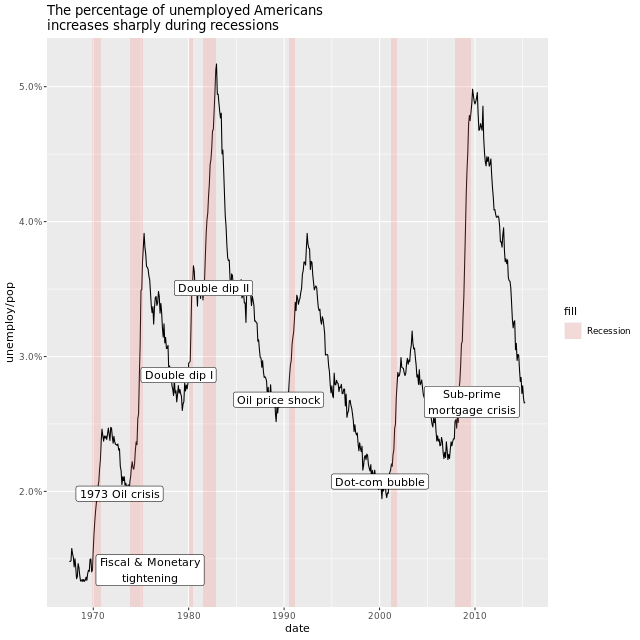
```
# Remove legend entirely
plt_prop_unemployed_over_time +
  theme(legend.position = "none")
```
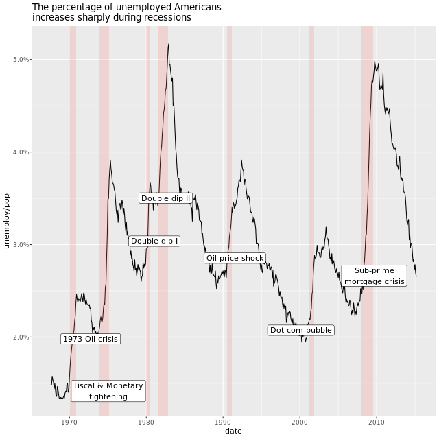
```
# Position the legend at the bottom of the plot
plt_prop_unemployed_over_time +
  theme(legend.position = "bottom")
```

```
# Position the legend inside the plot at (0.6, 0.1)
plt_prop_unemployed_over_time +
  theme(legend.position = c(0.6, 0.1))
```


Nice! But be careful when placing a legend inside your plotting space. You could end up obscuring data.

**Modifying theme elements**
Many plot elements have multiple properties that can be set. For example, line elements in the plot such as axes and gridlines have a color, a thickness (`size`), and a line type (solid line, dashed, or dotted). To set the style of a line, you use [element_line()](https://www.rdocumentation.org/packages/ggplot2/topics/margin). For example, to make the axis lines into red, dashed lines, you would use the following.

```
p + theme(axis.line = element_line(color = "red", linetype = "dashed"))
```

Similarly,` element_rect()` changes rectangles and `element_text()` changes text. You can remove a plot element using `element_blank()`.

`plt_prop_unemployed_over_time` is available.

```
plt_prop_unemployed_over_time +
  theme(
    # For all rectangles, set the fill color to grey92
    rect = element_rect(fill = "grey92"),
    # For the legend key, turn off the outline
    legend.key = element_rect(color = NA)
  )
```

```
plt_prop_unemployed_over_time +
  theme(
    rect = element_rect(fill = "grey92"),
    legend.key = element_rect(color = NA),
    # Turn off axis ticks
    axis.ticks = element_blank(),
    # Turn off the panel grid
    panel.grid = element_blank()
  )
```

```
plt_prop_unemployed_over_time +
  theme(
    rect = element_rect(fill = "grey92"),
    legend.key = element_rect(color = NA),
    axis.ticks = element_blank(),
    panel.grid = element_blank(),
    # Add major y-axis panel grid lines back
    panel.grid.major.y = element_line(
      # Set the color to white
      color = "white",
      # Set the size to 0.5
      size = 0.5,
      # Set the line type to dotted
      linetype = "dotted"
    )
  )
```

```
plt_prop_unemployed_over_time +
  theme(
    rect = element_rect(fill = "grey92"),
    legend.key = element_rect(color = NA),
    axis.ticks = element_blank(),
    panel.grid = element_blank(),
    panel.grid.major.y = element_line(
      color = "white",
      size = 0.5,
      linetype = "dotted"
    ),
    # Set the axis text color to grey25
    axis.text = element_text(color = "grey25"),
    # Set the plot title font face to italic and font size to 16
    plot.title = element_text(face = "italic", size = 16)
  )
```


This plot is ready for prime time – it's pretty AND informative. Make sure that all your text is legible for the context in which it will be viewed.

**Modifying whitespace**
Whitespace means all the non-visible margins and spacing in the plot.

To set a single whitespace value, use [unit(x, unit)](https://www.rdocumentation.org/packages/grid/topics/unit), where `x` is the amount and `unit` is the unit of measure.

Borders require you to set 4 positions, so use [margin(top, right, bottom, left, unit)](https://www.rdocumentation.org/packages/ggplot2/topics/margin). To remember the margin order, think **TRouBLe**.

The default unit is `"pt"` (points), which scales well with text. Other options include "cm", "in" (inches) and "lines" (of text).

`plt_mpg_vs_wt_by_cyl` is available. The panel and legend are wrapped in blue boxes so you can see how they change.

```
#view original plot
plt_mpg_vs_wt_by_cyl
```
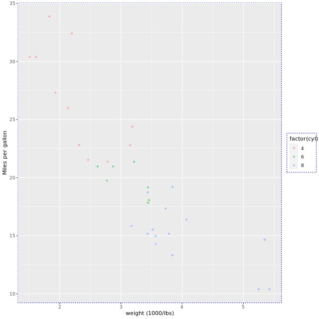
```
plt_mpg_vs_wt_by_cyl +
  theme(
    # Set the axis tick length to 2 lines
    axis.ticks.length = unit(2, "lines")
  )
```
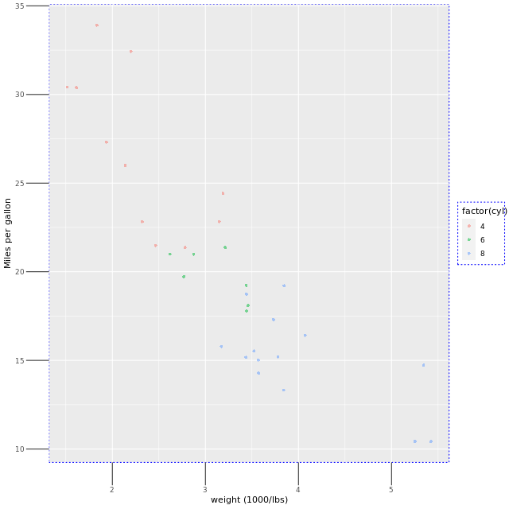
```
plt_mpg_vs_wt_by_cyl +
  theme(
    # Set the legend key size to 3 centimeters
    legend.key.size = unit(3, "cm")
  )
```

```
plt_mpg_vs_wt_by_cyl +
  theme(
    # Set the legend margin to (20, 30, 40, 50) points
    legend.margin = margin(20, 30, 40, 50, "pt")
  )
```
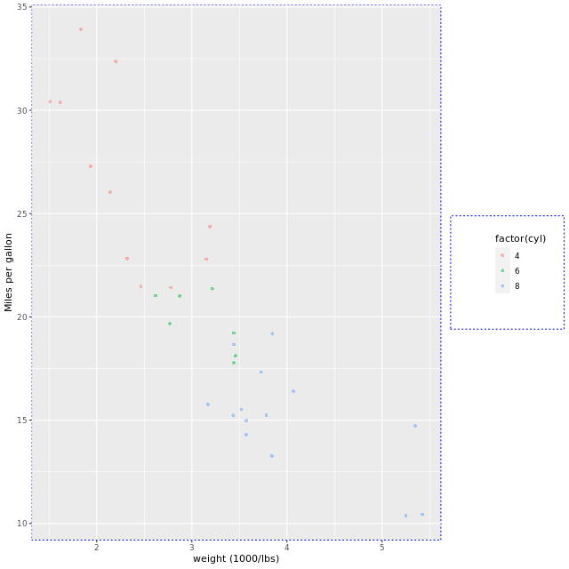
```
plt_mpg_vs_wt_by_cyl +
  theme(
    # Set the plot margin to (10, 30, 50, 70) millimeters
    plot.margin = margin(10, 30, 50, 70, "mm")
  )
```
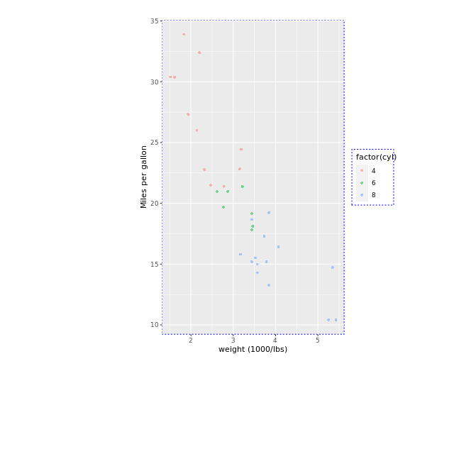

Wonderful whitespace widening! Changing the whitespace can be useful if you need to make your plot more compact, or if you want to create more space to reduce “business”.

**Theme flexibility**

**Ways to use themes**

1. from scratch (last section)
2. **Theme layer object**
3. built-in themes
  - ggplot2 or ggthemes packages
4. built-in themes from other packages
5. update/set default theme

**Defining theme objects**

- useful when you have too many plots
- provides consistency in style
- apply a specific theme everywhere

**Built-in themes**

In addition to making your own themes, there are several [out-of-the-box solutions](https://ggplot2.tidyverse.org/reference/ggtheme.html) that may save you lots of time.

- [theme_gray()](http://www.rdocumentation.org/packages/ggplot2/functions/ggtheme) is the default.
- [theme_bw()](http://www.rdocumentation.org/packages/ggplot2/functions/ggtheme) is useful when you use transparency.
- [theme_classic()](http://www.rdocumentation.org/packages/ggplot2/functions/ggtheme) is more traditional.
- [theme_void()](http://www.rdocumentation.org/packages/ggplot2/functions/ggtheme) removes everything but the data.

`plt_prop_unemployed_over_time` is available.

```
# Add a black and white theme
plt_prop_unemployed_over_time +
  theme_bw()
```
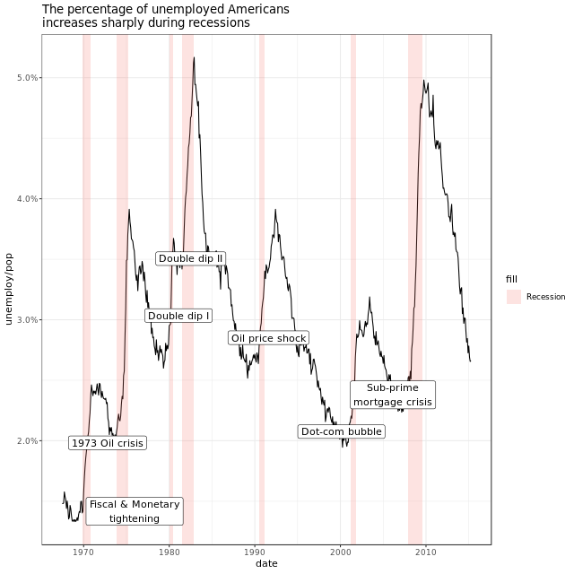
```
# Add a classic theme
plt_prop_unemployed_over_time +
  theme_classic()
```
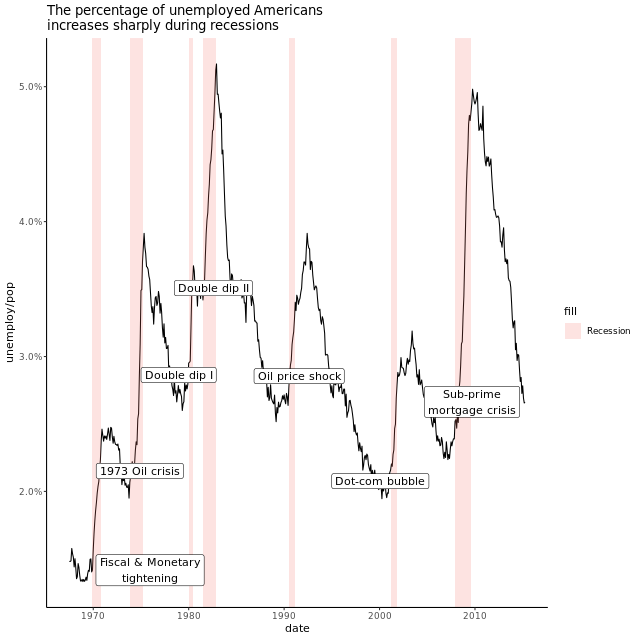
```
# Add a void theme
plt_prop_unemployed_over_time +
  theme_void()
```


The black and white theme works really well if you use transparency in your plot.

**Exploring ggthemes**

Outside of `ggplot2`, another source of built-in themes is the `ggthemes` package. The workspace already contains the `plt_prop_unemployed_over_time`, the line plot from before. Let's explore some of the ready-made `ggthemes` themes.

`plt_prop_unemployed_over_time is available`.

```
# Use the fivethirtyeight theme
plt_prop_unemployed_over_time +
  theme_fivethirtyeight()
```

```
# Use Tufte's theme
plt_prop_unemployed_over_time +
  theme_tufte()
```

```
# Use the Wall Street Journal theme
plt_prop_unemployed_over_time +
  theme_wsj()
```
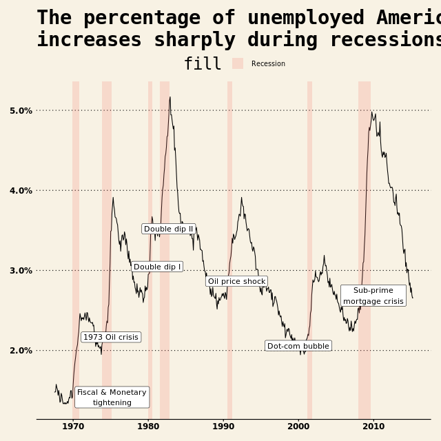

`ggthemes` has over 20 themes for you to try.

**Setting themes**

Reusing a theme across many plots helps to provide a consistent style. You have several options for this.

1. Assign the theme to a variable, and add it to each plot.
2. Set your theme as the default using [theme_set()](https://www.rdocumentation.org/packages/ggplot2/topics/theme_get).

A good strategy that you'll use here is to begin with a built-in theme then modify it.

`plt_prop_unemployed_over_time` is available. The theme you made earlier is shown in the sample code.

```
# Theme layer saved as an object, theme_recession
theme_recession <- theme(
  rect = element_rect(fill = "grey92"),
  legend.key = element_rect(color = NA),
  axis.ticks = element_blank(),
  panel.grid = element_blank(),
  panel.grid.major.y = element_line(color = "white", size = 0.5, linetype = "dotted"),
  axis.text = element_text(color = "grey25"),
  plot.title = element_text(face = "italic", size = 16),
  legend.position = c(0.6, 0.1)
)

# Combine the Tufte theme with theme_recession
theme_tufte_recession <- theme_tufte() + theme_recession

# Add the recession theme to the plot
plt_prop_unemployed_over_time + theme_tufte_recession
```

```
theme_recession <- theme(
  rect = element_rect(fill = "grey92"),
  legend.key = element_rect(color = NA),
  axis.ticks = element_blank(),
  panel.grid = element_blank(),
  panel.grid.major.y = element_line(color = "white", size = 0.5, linetype = "dotted"),
  axis.text = element_text(color = "grey25"),
  plot.title = element_text(face = "italic", size = 16),
  legend.position = c(0.6, 0.1)
)
theme_tufte_recession <- theme_tufte() + theme_recession

# Set theme_tufte_recession as the default theme
theme_set(theme_tufte_recession)

# Draw the plot (without explicitly adding a theme)
plt_prop_unemployed_over_time
```
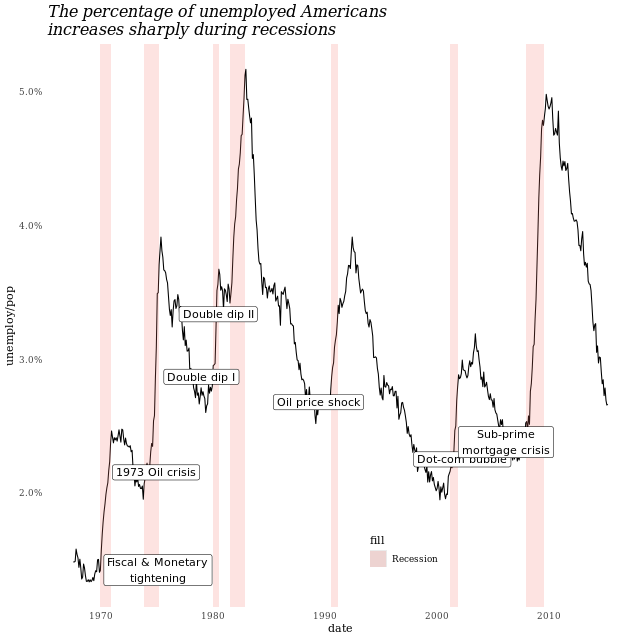

**Publication-quality plots**

We've seen many examples of beautiful, publication-quality plots. Let's take a final look and put all the pieces together.

`plt_prop_unemployed_over_time` is available.

```
plt_prop_unemployed_over_time +
  # Add Tufte's theme
  theme_tufte()
```

```
plt_prop_unemployed_over_time +
  theme_tufte() +
  # Add individual theme elements
  theme(
    # Turn off the legend
    legend.position = "none",
    # Turn off the axis ticks
    axis.ticks = element_blank()
  )
```
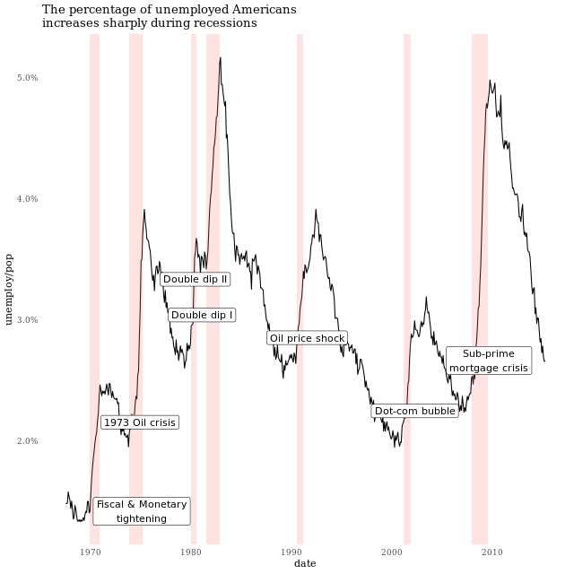
```
plt_prop_unemployed_over_time +
  theme_tufte() +
  theme(
    legend.position = "none",
    axis.ticks = element_blank(),
    # Set the axis title's text color to grey60
    axis.title = element_text(color = "grey60"),
    # Set the axis text's text color to grey60
    axis.text = element_text(color = "grey60")
  )
```
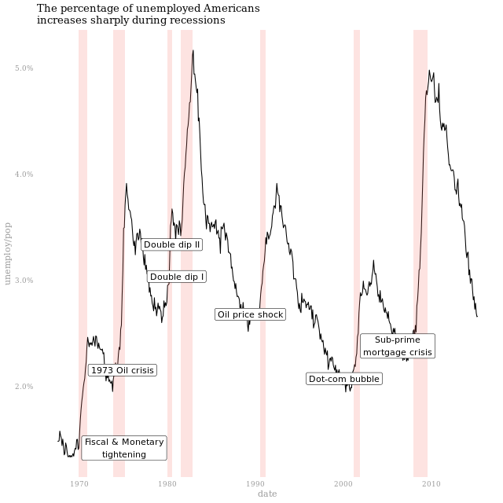
```
plt_prop_unemployed_over_time +
  theme_tufte() +
  theme(
    legend.position = "none",
    axis.ticks = element_blank(),
    axis.title = element_text(color = "grey60"),
    axis.text = element_text(color = "grey60"),
    # Set the panel gridlines major y values
    panel.grid.major.y = element_line(
      # Set the color to grey60
      color = "grey60",
      # Set the size to 0.25
      size = 0.25,
      # Set the linetype to dotted
      linetype = "dotted"
    )
  )
```
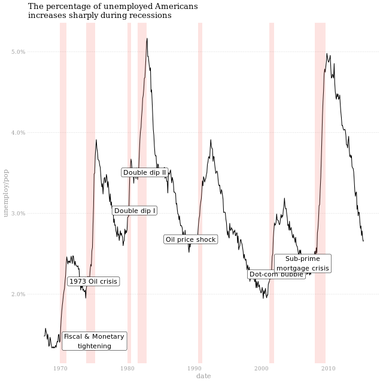

That will look great in a publication!

**Effective explanatory plots**


we take the top ten and bottom ten observations from the data set


**Using geoms for explanatory plots**


Let's focus on producing beautiful and effective explanatory plots. In the next couple of exercises, you'll create a plot that is similar to the one shown in the video using `gm2007`, a filtered subset of the `gapminder` dataset.

This type of plot will be in an info-viz style, meaning that it would be similar to something you'd see in a magazine or website for a mostly lay audience.

A scatterplot of `lifeExp` by `country`, colored by `lifeExp`, with points of size `4`, is provided.

```
# Add a geom_segment() layer
ggplot(gm2007, aes(x = lifeExp, y = country, color = lifeExp)) +
  geom_point(size = 4) +
  geom_segment(aes(xend = 30, yend = country), size = 2)
```

```
# Add a geom_text() layer
ggplot(gm2007, aes(x = lifeExp, y = country, color = lifeExp)) +
  geom_point(size = 4) +
  geom_segment(aes(xend = 30, yend = country), size = 2) +
  geom_text(aes(label = lifeExp), color = "white", size = 1.5)
```
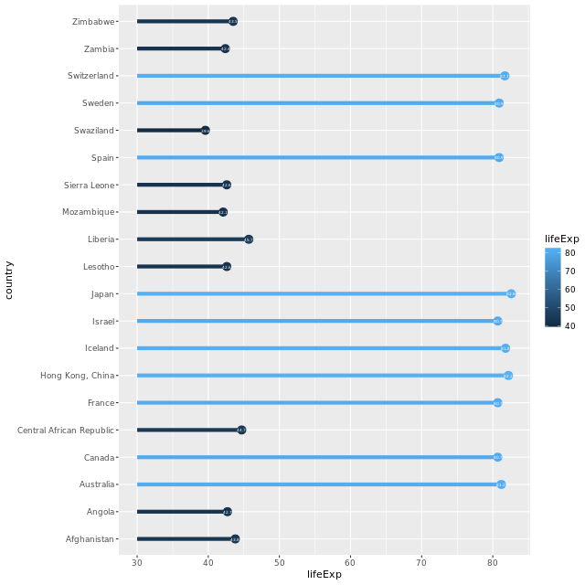
```
# Set the color scale
palette <- brewer.pal(5, "RdYlBu")[-(2:4)]

# Modify the scales
ggplot(gm2007, aes(x = lifeExp, y = country, color = lifeExp)) +
  geom_point(size = 4) +
  geom_segment(aes(xend = 30, yend = country), size = 2) +
  geom_text(aes(label = round(lifeExp,1)), color = "white", size = 1.5) +
  scale_x_continuous("", expand = c(0, 0), limits = c(30, 90), position = "top") +
  scale_color_gradientn(colors = palette)
```
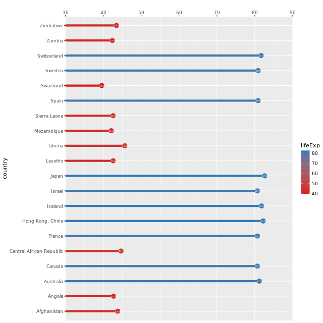
```
# Add a title and caption
ggplot(gm2007, aes(x = lifeExp, y = country, color = lifeExp)) +
  geom_point(size = 4) +
  geom_segment(aes(xend = 30, yend = country), size = 2) +
  geom_text(aes(label = round(lifeExp,1)), color = "white", size = 1.5) +
  scale_x_continuous("", expand = c(0,0), limits = c(30,90), position = "top") +
  scale_color_gradientn(colors = palette) +
  labs(title = "Highest and lowest life expectancies, 2007", caption = "Source: gapminder")
```


Let's continue adding to this plot in the next exercise.

**Using annotate() for embellishments**

In the previous exercise, we completed our basic plot. Now let's polish it by playing with the theme and adding annotations. In this exercise, you'll use `annotate()` to add text and a curve to the plot.

The following values have been calculated for you to assist with adding embellishments to the plot:

```
global_mean <- mean(gm2007_full$lifeExp)
x_start <- global_mean + 4
y_start <- 5.5
x_end <- global_mean
y_end <- 7.5
```

Our previous plot has been assigned to `plt_country_vs_lifeExp`.

```
# Define the theme
plt_country_vs_lifeExp +
  theme_classic() +
  theme(axis.line.y = element_blank(),
        axis.ticks.y = element_blank(),
        axis.text = element_text(color = "black"),
        axis.title = element_blank(),
        legend.position = "none")
```
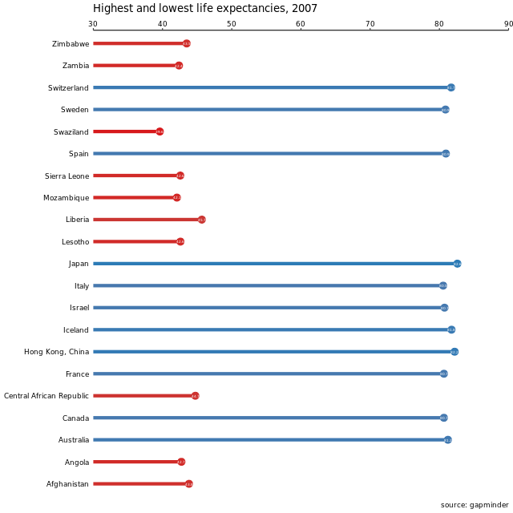
```
# Add a vertical line
plt_country_vs_lifeExp +
  step_1_themes +
  geom_vline(xintercept = global_mean, color = "grey40", linetype = 3)
```

```
# Add text
plt_country_vs_lifeExp +
  step_1_themes +
  geom_vline(xintercept = global_mean, color = "grey40", linetype = 3) +
  annotate(
    "text",
    x = x_start, y = y_start,
    label = "The\nglobal\naverage",
    vjust = 1, size = 3, color = "grey40"
  )
```

```
# Add a curve
plt_country_vs_lifeExp +  
  step_1_themes +
  geom_vline(xintercept = global_mean, color = "grey40", linetype = 3) +
  step_3_annotation +
  annotate(
    "curve",
    x = x_start, y = y_start,
    xend = x_end, yend = y_end,
    arrow = arrow(length = unit(0.2, "cm"), type = "closed"),
    color = "grey40"
  )
```
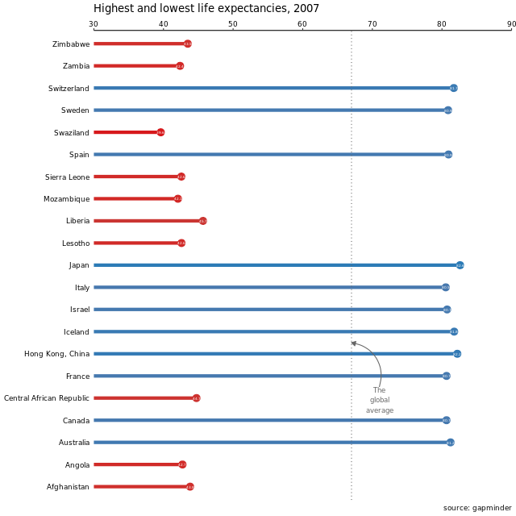

Your explanatory plot clearly shows the countries with the highest and lowest life expectancy and would be great for a lay audience.

Congratulations on finishing the course! Continue learning more in Intermediate Data Visualization with ggplot2!