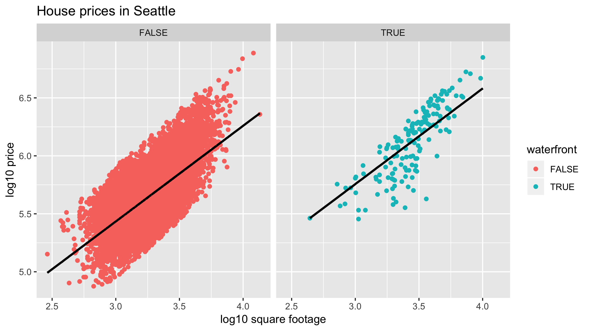

```{r setup, include=FALSE}
knitr::opts_chunk$set(echo = TRUE)
options(repos="https://CRAN.R-project.org")
```

## Background on modeling for explanation

**Course overview**

1. introduction to modeling: theory and terminology

2. regression:
  - simple linear regression
  - multiple regression
  
3. model assessment

**General modeling framework formula**

$y = f(\vec{x}) + \epsilon$

Where:

- $y$: outcome variable of interest
- $\vec{x}$: explanatory/predictor variables
- $f()$: function of the relationship between $y$ and $\vec{x}$ AKA *the signal*
- $\epsilon$: unsystematic error component AKA *the noise*

**Two modeling scenarios**

Modeling for either:

- Explanation: $\vec{x}$ are *explanatory* variables
- Prediction: $\vec{x}$ are *predictor* variables


**Exploratory data analysis**

Three basic steps to exploratory data analysis (EDA)

1. Looking at your data
2. Creating visualizations
3. Computing summary statistics

**Exploratory visualization of age**

Let's perform an exploratory data analysis (EDA) of the numerical explanatory variable `age`. You should always perform an exploratory analysis of your variables before any formal modeling. This will give you a sense of your variable's distributions, any outliers, and any patterns that might be useful when constructing your eventual model.

```{r}
# Load packages
library(moderndive)
library(ggplot2)

# Plot the histogram
ggplot(evals, aes(x = age)) +
  geom_histogram(binwidth = 5) +
  labs(x = "age", y = "count")
```

Nice! The 463 instructors' ages are centered roughly at age 50. You'll now compute notions of center numerically!

**Numerical summaries of age**

Let's continue our exploratory data analysis of the numerical explanatory variable `age` by computing **summary statistics**. Summary statistics take many values and summarize them with a single value. Let's compute three such values using `dplyr` data wrangling: mean (AKA the average), the median (the middle value), and the standard deviation (a measure of spread/variation).

```{r}
# Load packages
library(moderndive)
library(dplyr)

# Compute summary stats
evals %>%
  summarize(mean_age = mean(age),
            median_age = median(age),
            sd_age = sd(age))
```

Great! As suggested in the previous histogram for age, the center of the distribution as quantified by the mean and median is around 48 years old!

## Background on modeling for prediction


**Comparing before and after log10-transformation**


- log10 transformations are multiplicative (instead of additive) and monotonic --> they preserve orderings

**Exploratory visualization of house size**

Let's create an exploratory visualization of the predictor variable reflecting the size of houses: `sqft_living` the square footage of living space where 1 sq.foot ≈ 0.1 sq.meter.

After plotting the histogram, what can you say about the distribution of the variable `sqft_living`?

```{r}
# Load packages
library(moderndive)
library(ggplot2)

# Plot the histogram
ggplot(house_prices, aes(x = sqft_living)) +
  geom_histogram() +
  labs(x = "Size (sq.feet)", y = "count")
```

A variable is right-skewed if it has a long tail to the right.

**Log10 transformation of house size**

You just saw that the predictor variable `sqft_living` is *right*-skewed and hence a log base 10 transformation is warranted to unskew it. Just as we transformed the outcome variable `price` to create `log10_price` in the video, let's do the same for `sqft_living`.

```{r}
# Load packages
library(moderndive)
library(dplyr)
library(ggplot2)

# Add log10_size
house_prices_2 <- house_prices %>%
  mutate(log10_size = log10(sqft_living))

# Plot the histogram  
ggplot(house_prices_2, aes(x = log10_size)) +
  geom_histogram() +
  labs(x = "log10 size", y = "count")
```

Huzzah! Notice how the distribution is much less skewed. Going forward, you'll use this new transformed variable to represent the size of houses.

## The modeling problem for explanation


**EDA of relationship of teaching & "beauty" scores**

The researchers in the UT Austin created a "beauty score" by asking a panel of 6 students to rate the "beauty" of all 463 instructors. They were interested in studying any possible impact of "beauty" of teaching evaluation scores. Let's do an EDA of this variable and its relationship with teaching `score`.

From now on, assume that `ggplot2`, `dplyr`, and `moderndive` are all available in your workspace unless you're told otherwise.

```{r}
# Plot the histogram
ggplot(evals, aes(x = bty_avg)) +
  geom_histogram(binwidth = 0.5) +
  labs(x = "Beauty score", y = "count")

# Scatterplot
ggplot(evals, aes(x = bty_avg, y = score)) +
  geom_point() +
  labs(x = "beauty score", y = "teaching score")

# Jitter plot
ggplot(evals, aes(x = bty_avg, y = score)) +
  geom_jitter() +
  labs(x = "beauty score", y = "teaching score")
```

“Beauty”-ful! It seems the original scatterplot did suffer from overplotting since the jittered scatterplot reveals many originally hidden points. Most `bty_avg` scores range from 2-8, with 5 being about the center.

**Correlation between teaching and "beauty" scores**

Let's numerically summarize the relationship between teaching `score` and beauty score `bty_avg` using the correlation coefficient. Based on this, what can you say about the relationship between these two variables?

```{r}
# Compute correlation
evals %>%
  summarize(correlation = cor(score, bty_avg))
```

While there seems to be a positive relationship, +0.187 is still a long ways from +1, so the correlation is only weakly positive.

## The modeling problem for prediction

**Difference between explanation and prediction**


**EDA of relationship of house price and waterfront**

Let's now perform an exploratory data analysis of the relationship between `log10_price`, the log base 10 house price, and the binary variable `waterfront`. Let's look at the raw values of `waterfront` and then visualize their relationship.

The column `log10_price` has been added for you in the `house_prices` dataset.

```{r}
house_prices_2 <- house_prices %>%
  mutate(log10_price = log10(price), log10_size = log10(sqft_living))

house_prices <- house_prices_2

# View the structure of log10_price and waterfront
house_prices %>%
  select(log10_price, waterfront) %>%
  glimpse()

# Plot 
ggplot(house_prices, aes(x = waterfront, y = log10_price)) +
  geom_boxplot() +
  labs(x = "waterfront", y = "log10 price")
```

A+! Look at that boxplot! Houses that have a view of the waterfront tend to be MUCH more expensive as evidenced by the much higher log10 prices!

**Predicting house price with waterfront**

You just saw that houses with a view of the `waterfront` tend to be much more expensive. But by how much? Let's compute group means of `log10_price`, convert them back to dollar units, and compare!

The variable `log10_price` has already been added to `house_prices` for you.

```{r}
# Calculate stats
house_prices %>%
  group_by(waterfront) %>%
  summarize(mean_log10_price = mean(log10_price), n = n())

# Prediction of price for houses with view
10^(6.12)

# Prediction of price for houses without view
10^(5.66)
```

100%! Most houses don't have a view of the waterfront (n = 21,450), but those that do (n = 163) have a MUCH higher predicted price. Look at that difference! \$457,088 versus \$1,318,257! In the upcoming Chapter 2 on basic regression, we'll build on such intuition and construct our first formal explanatory and predictive models using basic regression!

## Explaining teaching score with age


**Plotting a "best-fitting" regression line**

Previously you visualized the relationship of teaching score and "beauty score" via a scatterplot. Now let's add the "best-fitting" regression line to provide a sense of any overall trends. Even though you know this plot suffers from overplotting, you'll stick to the non-`jitter` version.

```{r}
# Load packages
library(ggplot2)
library(dplyr)
library(moderndive)

# Plot
ggplot(evals, aes(x = bty_avg, y = score)) +
  geom_point() +
  labs(x = "beauty score", y = "score") +
  geom_smooth(method = "lm", se = FALSE)
```

Fantastic! The overall trend seems to be positive! As instructors have higher “beauty” scores, so also do they tend to have higher teaching scores.

**Fitting a regression with a numerical x**

Let's now explicity quantify the linear relationship between `score` and `bty_avg` using linear regression. You will do this by first "fitting" the model. Then you will get the *regression table*, a standard output in many statistical software packages. Finally, based on the output of `get_regression_table()`, which interpretation of the slope coefficient is correct?

```{r}
# Load package
library(moderndive)

# Fit model
model_score_2 <- lm(score ~ bty_avg, data = evals)

# Output content
model_score_2

# Output regression table
get_regression_table(model_score_2, print = TRUE)
```

As suggested by your exploratory visualization, there is a positive relationship between “beauty” and teaching score.

## Predicting teaching score using age


**Making predictions using "beauty score"**

Say there is an instructor at UT Austin and you know nothing about them except that their beauty score is 5. What is your prediction $\hat{y}$ of their teaching score $y$?

```r
get_regression_table(model_score_2)
  term      estimate std_error statistic p_value lower_ci upper_ci
  <chr>        <dbl>     <dbl>     <dbl>   <dbl>    <dbl>    <dbl>
1 intercept    3.88      0.076     51.0        0    3.73     4.03 
2 bty_avg      0.067     0.016      4.09       0    0.035    0.099
```

```{r}
# Use fitted intercept and slope to get a prediction
y_hat <- 3.88 + 5 * 0.0670
y_hat

# Compute residual y - y_hat
4.7 - 4.215
```

Awesome! Was your visual guess close to the predicted teaching score of 4.215? Also, note that this prediction is off by about 0.485 units in teaching score.

**Computing fitted/predicted values & residuals**

Now say you want to repeat this for all 463 instructors in `evals`. Doing this manually as you just did would be long and tedious, so as seen in the video, let's automate this using the `get_regression_points()` function.

Furthemore, let's unpack its output.

```{r}
# Fit regression model
model_score_2 <- lm(score ~ bty_avg, data = evals)

# Get regression table
get_regression_table(model_score_2)

# Get all fitted/predicted values and residuals
get_regression_points(model_score_2)

# Get all fitted/predicted values and residuals
get_regression_points(model_score_2) %>% 
  mutate(score_hat_2 = 3.88 + 0.067 * bty_avg)

# Get all fitted/predicted values and residuals
get_regression_points(model_score_2) %>% 
  mutate(residual_2 = score - score_hat)
```

Bingo! You'll see later that the residuals can provide useful information about the quality of your regression models. Stay tuned!

## Explaining teaching score with gender

**EDA of relationship of score and rank**

Let's perform an EDA of the relationship between an instructor's score and their rank in the `evals` dataset. You'll both visualize this relationship and compute summary statistics for each level of `rank`: `teaching`, `tenure track`, and `tenured`.

```{r}
ggplot(evals, aes(x = rank, y = score)) +
  geom_boxplot() +
  labs(x = "rank", y = "score")

evals %>%
  group_by(rank) %>%
  summarize(n = n(), mean_score = mean(score), sd_score = sd(score))
```

Cool! The boxplot and summary statistics suggest that teaching get the highest scores while tenured professors get the lowest. However, there is clearly variation around the respective means.

**Fitting a regression with a categorical x**

You'll now fit a regression model with the categorical variable `rank` as the explanatory variable and interpret the values in the resulting regression table. Note here the rank "teaching" is treated as the *baseline* for *comparison group* for the "tenure track" and "tenured" groups.

```{r}
# Fit regression model
model_score_4 <- lm(score ~ rank, data = evals)

# Get regression table
get_regression_table(model_score_4)

# teaching mean
teaching_mean <- 4.28

# tenure track mean
tenure_track_mean <- 4.28 - 0.13

# tenured mean
tenured_mean <- 4.28 - 0.145
```

Kudos! Remember that regressions with a categorical variable return group means expressed relative to a baseline for comparison!

## Predicting teaching score using gender

Regression tables for categorical explanatory variables show differences in means relative to a baseline.

**Visualizing the distribution of residuals**

Let's now compute both the predicted score $\hat{y}$ and the residual $y-\hat{y}$ for all $n = 463$ instructors in the `evals` dataset. Furthermore, you'll plot a histogram of the residuals and see if there are any patterns to the residuals, i.e. your predictive errors.

`model_score_4` from the previous exercise is available in your workspace.

```{r}
# Calculate predictions and residuals
model_score_4_points <- get_regression_points(model_score_4)
model_score_4_points

# Plot residuals
ggplot(model_score_4_points, aes(x = residual)) +
  geom_histogram() +
  labs(x = "residuals", title = "Residuals from score ~ rank model")
```

Congrats! Look at the distribution of the residuals. While it seems there are fewer negative residuals corresponding to overpredictions of score, the magnitude of the error seems to be larger (ranging all the way to -2).

## Explaining house price with year & size


Plotly was used to create [this visualization](https://chart-studio.plotly.com/~datacamp-content/1.embed)


- Taking into account all other variables (age of home in this case), larger homes tend to cost more.
- Taking into account / controlling for log10_size, for every additional year increase in home construction, there is an associated marginal decrease in log_price.

**EDA of relationship**

Unfortunately, making 3D scatterplots to perform an EDA is beyond the scope of this course. So instead let's focus on making standard 2D scatterplots of the relationship between price and the number of bedrooms, keeping an eye out for outliers.

The log10 transformations have been made for you and are saved in `house_prices`.

```{r}
# Create scatterplot with regression line
ggplot(house_prices, aes(x = bedrooms, y = log10_price)) +
  geom_point() +
  labs(x = "Number of bedrooms", y = "log10 price") +
  geom_smooth(method = "lm", se = FALSE)

# Remove outlier
house_prices_transform <- house_prices %>%
  filter(bedrooms < 20)

# Create scatterplot with regression line
ggplot(house_prices_transform, aes(x = bedrooms, y = log10_price)) +
  geom_point() +
  labs(x = "Number of bedrooms", y = "log10 price") +
  geom_smooth(method = "lm", se = FALSE)
```

Excellent! Another important reason to perform EDA is to discard any potential outliers that are likely data entry errors. In our case, after removing an outlier, you can see a clear positive relationship between the number of bedrooms and price, as one would expect.

**Fitting a regression**

house_prices, which is available in your environment, has the log base 10 transformed variables included and the outlier house with 33 bedrooms removed. Let's fit a multiple regression model of price as a function of size and the number of bedrooms and generate the regression table. In this exercise, you will first fit the model, and based on the regression table, in the second part, you will answer the following question:

Which of these interpretations of the slope coefficent for bedrooms is correct?

```{r}
# Fit model
model_price_2 <- lm(log10_price ~ log10_size + bedrooms, 
                    data = house_prices)

# Get regression table
get_regression_table(model_price_2)
```

Accounting for `log10_size`, every extra bedroom is associated with a decrease of on average 0.033 in `log10_price`.

Splendid! In this multiple regression setting, the associated effect of any variable must be viewed in light of the other variables in the model. In our case, accounting for the size of the house reverses the relationship of the number of bedrooms and price from positive to negative!

## Predicting house price using year & size


**Making predictions using size and bedrooms**

Say you want to predict the price of a house using this model and you know it has:

- 1000 square feet of living space, and
- 3 bedrooms

What is your prediction both in log10 dollars and then dollars?

The regression model from the previous exercise is available in your workspace as `model_price_2`.

```
get_regression_table(model_price_2)
# A tibble: 3 x 7
  term       estimate std_error statistic p_value lower_ci upper_ci
  <chr>         <dbl>     <dbl>     <dbl>   <dbl>    <dbl>    <dbl>
1 intercept     2.69      0.023     116.        0    2.65     2.74 
2 log10_size    0.941     0.008     118.        0    0.925    0.957
3 bedrooms     -0.033     0.002     -20.5       0   -0.036   -0.03 
```

```{r}
# Make prediction in log10 dollars
2.69 + 0.941 * log10(1000) - .033 * 3

# Make prediction dollars
10^5.414
```

Spot on! Using the values in the regression table you can make predictions of house prices! In this case, your prediction is about $260,000. Let's now apply this procedure to all 21k houses!

**Interpreting residuals**

Let's automate this process for all 21K rows in `house_prices` to obtain residuals, which you'll use to compute the *sum of squared residuals*: a measure of the lack of fit of a model. After computing the sum of squared residuals, you will answer the following question:

Which of these statements about residuals is *correct*?

```{r}
# Automate prediction and residual computation
get_regression_points(model_price_2)

# Automate prediction and residual computation
get_regression_points(model_price_2) %>%
  mutate(sq_residuals = residual^2) %>%
  summarize(sum_sq_residuals = sum(sq_residuals))
```

- The residual is the observed outcome variable minus the predicted variable.
- They can be thought of as prediction errors.
- They can be thought of as the lack-of-fit of the predictions to truth.

Residual does suggest 'leftovers', but not in the sense that they are leftover points.

## Explaining house price with size & condition


**Parallel slopes model**

Let's now fit a "parallel slopes" model with the numerical explanatory/predictor variable `log10_size` and the categorical, in this case binary, variable `waterfront`. The visualization corresponding to this model is below:



```{r}
# Fit model
model_price_4 <- lm(log10_price ~ log10_size + waterfront,
                    data = house_prices)

# Get regression table
get_regression_table(model_price_4)
```

Success! Notice how the regression table has three rows: intercept, the slope for log10_size, and an offset for houses that do have a waterfront.

- The intercept for houses with a view of the waterfront is 3.282.
- All houses are assumed to have the same slope between `log10_price` & `log10_size`.
- The intercept for houses without a view of the waterfront is 2.96.

0.322 is the offset in the intercept for houses with a view of the waterfront relative to those which don't.

## Predicting house price using size & condition


**Making predictions using size and waterfront**

Using your model for `log10_price` as a function of `log10_size` and the binary variable `waterfront`, let's make some predictions! Say you have the two following "new" houses, what would you predict their prices to be *in dollars*?

- House A: `log10_size = 2.9` that has a view of the waterfront
- House B: `log10_size = 3.1` that does not have a view of the waterfront

We make the corresponding visual predictions below:


```{r}
# Get regression table
get_regression_table(model_price_4)

# Prediction for House A
10^(2.96 + 0.825 * 2.9 + 0.322)

# Prediction for House B
10^(2.96 + 0.825 * 3.1)
```

Yay! Your modeling toolbox is getting quite extensive! Let's now automate this!

**Automating predictions on "new" houses**

Let's now repeat what you did in the last exercise, but in an automated fashion assuming the information on these "new" houses is saved in a dataframe.

Your model for `log10_price` as a function of `log10_size` and the binary variable `waterfront` (`model_price_4`) is available in your workspace, and so is `new_houses_2`, a dataframe with data on 2 new houses. While not so beneficial with only 2 "new" houses, this will save a lot of work if you had 2000 "new" houses.

```{r}
new_houses_2 <- tibble(log10_size = c(2.9, 3.1), waterfront = c(TRUE, FALSE))

# View the "new" houses
new_houses_2

# Get predictions on "new" houses
get_regression_points(model_price_4, newdata = new_houses_2)

# Get predictions price_hat in dollars on "new" houses
get_regression_points(model_price_4, newdata = new_houses_2) %>% 
  mutate(price_hat = 10^log10_price_hat)
```

Predictions of \$472,000 and \$328,000! Exceptional! You're done with the multiple regression chapter, and now you're onto model assessment and selection!

## Model selection and assessment


**Refresher: sum of squared residuals**
Let's remind you how to compute the sum of squared residuals. You'll do this for two models.

```{r}
# Model 2
model_price_2 <- lm(log10_price ~ log10_size + bedrooms, 
                    data = house_prices)

# Calculate squared residuals
get_regression_points(model_price_2) %>%
  mutate(sq_residuals = residual^2) %>%
  summarize(sum_sq_residuals = sum(sq_residuals))

# Model 4
model_price_4 <- lm(log10_price ~ log10_size + waterfront, 
                    data = house_prices)

# Calculate squared residuals
get_regression_points(model_price_4) %>%
  mutate(sq_residuals = residual^2) %>%
  summarize(sum_sq_residuals = sum(sq_residuals))
```

Wonderful! Let's use these two measures of model assessment to choose between these two models, or in other words, perform model selection!

**Which model to select?**

Based on these two values of the sum of squared residuals, which of these two models do you think is "better", and hence which would you select?

- `model_price_2` that uses `log10_size` and `bedrooms`?
- `model_price_4` that uses `log10_size` and `waterfront`?

Since `model_price_4`'s value was lower at 599, select this one.

Given the choice of just these two models, the evidence suggests using size and waterfront yield a better fit, so you should choose this one!

**Assessing model fit with R-squared**


- it is a mathematical fact that $Var_{(y)} \geq Var_{(residuals)}$


**Computing the R-squared of a model**

Let's compute the $R^2$ summary value for the two numerical explanatory/predictor variable model you fit in the Chapter 3, price as a function of size and the number of bedrooms.

Recall that $R^2$ can be calculated as:

$1 - \frac{Var_{(residuals)}}{Var_{(y)}}$

```{r}
# Fit model
model_price_2 <- lm(log10_price ~ log10_size + bedrooms,
                    data = house_prices)
                    
# Get fitted/values & residuals, compute R^2 using residuals
get_regression_points(model_price_2) %>%
  summarize(r_squared = 1 - var(residual) / var(log10_price))
```

Nice job! You observed an R-squared value of 0.465, which means that 46.5% of the total variability of the outcome variable log base 10 price can be explained by this model.

**Comparing the R-squared of two models**

Let's now compute $R^2$ for the one numerical and one categorical explanatory/predictor variable model you fit in the Chapter 3, price as a function of size and whether the house had a view of the `waterfront`, and compare its $R^2$ with the one you just computed.

```{r}
# Fit model
model_price_4 <- lm(log10_price ~ log10_size + waterfront,
                    data = house_prices)

# Get fitted/values & residuals, compute R^2 using residuals
get_regression_points(model_price_4) %>% 
  summarize(r_squared = 1 - var(residual) / var(log10_price))
```

Since `model_price_4` had a higher $R^2$ of 0.470, it "fit" the data better.

Since using waterfront explained a higher proportion of the total variance of the outcome variable than using the number of bedrooms, using waterfront in our model is preferred.

## Assessing predictions with RMSE


$RMSE$ = typical prediction error the model will make that matches units of outcome variable $y$


- you can only assess accuracy of predictions (i.e. $RMSE$) if you have access to the observed value $y$


**Computing the MSE & RMSE of a model**

Just as you did earlier with $R^2$, which is a measure of model fit, let's now compute the root mean square error (RMSE) of our models, which is a commonly used measure of preditive error. Let's use the model of price as a function of size and number of bedrooms.

The model is available in your workspace as `model_price_2`.

```{r}
# Get all residuals, square them, and take mean                    
get_regression_points(model_price_2) %>%
  mutate(sq_residuals = residual^2) %>%
  summarize(mse = mean(sq_residuals))

# Get all residuals, square them, take the mean and square root
get_regression_points(model_price_2) %>%
  mutate(sq_residuals = residual^2) %>%
  summarize(mse = mean(sq_residuals)) %>% 
  mutate(rmse = sqrt(mse))
```

Woo hoo! The RMSE is 0.167. You can think of this as the “typical” prediction error this model makes.

**Comparing the RMSE of two models**

As you did using the sum of squared residuals and $R^2$, let's once again assess and compare the quality of your two models using the root mean squared error (RMSE). Note that RMSE is more typically used in prediction settings than explanatory settings.

`model_price_2` and `model_price_4` are available in your workspace.

```{r}
# MSE and RMSE for model_price_2
get_regression_points(model_price_2) %>%
  mutate(sq_residuals = residual^2) %>%
  summarize(mse = mean(sq_residuals), rmse = sqrt(mean(sq_residuals)))

# MSE and RMSE for model_price_4
get_regression_points(model_price_4) %>%
  mutate(sq_residuals = residual^2) %>%
  summarize(mse = mean(sq_residuals), rmse = sqrt(mean(sq_residuals)))
```


Since `model_price_4` had a lower rmse of 0.166, this is suggestive that this model has better predictive power.

RMSE can be thought of as the 'typical' error a predicive model will make.

## Validation set prediction framework


**Validation set approach**

Use two independent datasets to:

1. train/fit your data
2. evaluate your model's predictive power i.e. validate your model


**Fitting model to training data**

It's time to split your data into a *training* set to fit a model and a separate test set to evaluate the predictive power of the model. Before making this split however, we first sample 100% of the rows of `house_prices` *without* replacement and assign this to `house_prices_shuffled`. This has the effect of "shuffling" the rows, thereby ensuring that the training and test sets are *randomly* sampled.

```{r}
# Set random number generator seed value for reproducibility
set.seed(76)

# Randomly reorder the rows
house_prices_shuffled <- house_prices %>% 
  sample_frac(size = 1, replace = FALSE)

# Train/test split
train <- house_prices_shuffled %>%
  slice(1:10000)
test <- house_prices_shuffled %>%
  slice(10001:21613)

# Fit model to training set
train_model_2 <- lm(log10_price ~ log10_size + bedrooms, data = train)
```

Fabulous! Since you've fit/trained the predictive model on the training set, let's now apply it to the test set to make predictions!

**Predicting on test data**

Now that you've trained the model on the `train` set, let's apply the model to the `test` data, make predictions, and evaluate the predictions. Recall that having a separate `test` set here simulates the gathering of a "new" independent dataset to test our model's predictive performance on.

The datasets `train` and `test`, and the trained model, `train_model_2` are available in your workspace.

```{r}
# Make predictions on test set
get_regression_points(train_model_2, newdata = test)

# Compute RMSE
get_regression_points(train_model_2, newdata = test) %>% 
  mutate(sq_residuals = residual^2) %>%
  summarize(rmse = sqrt(mean(sq_residuals)))
```

Magnificent! Your RMSE using size and condition as predictor variables is 0.167, which is higher than 0.165 when you used size and year built! It seems the latter is marginally better!

## Conclusion - Where to go from here?


link to Tidyverse courses is [here](https://www.datacamp.com/tidyverse-tutorials)


