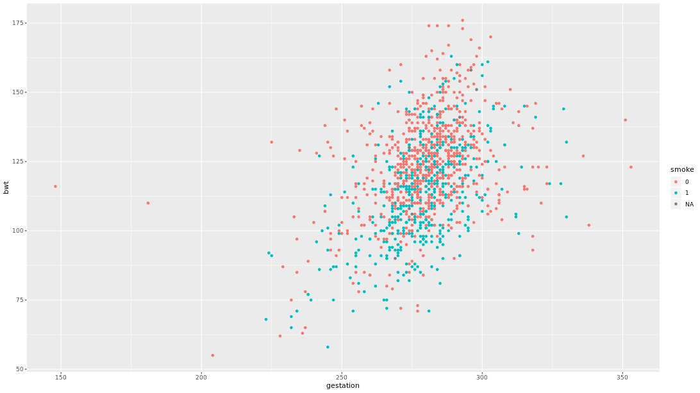
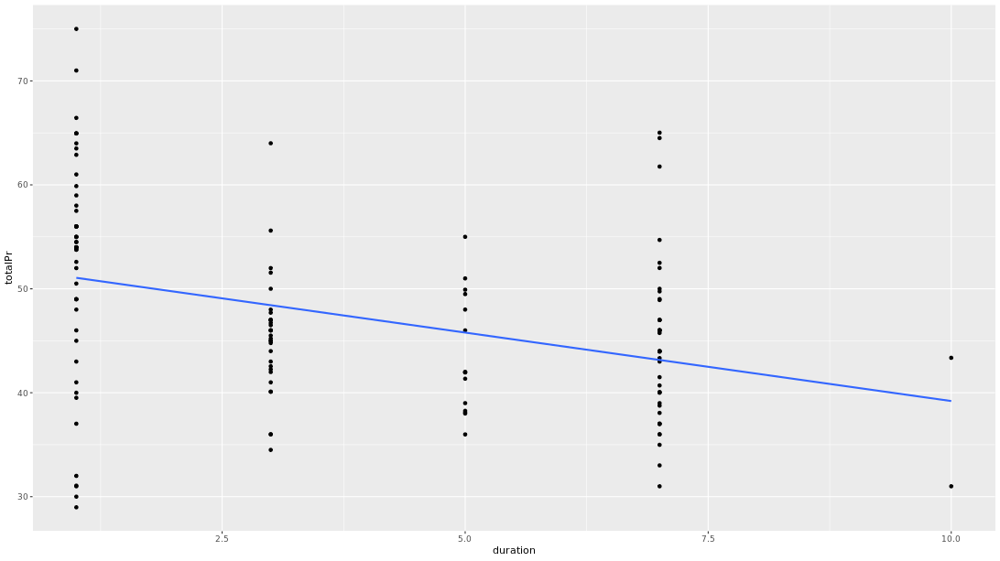

```{r setup, include=FALSE}
knitr::opts_chunk$set(echo = TRUE)
options(repos="https://CRAN.R-project.org")
```

## What if you have two groups?

**Fitting a parallel slopes model**

We use the `lm()` function to fit linear models to data. In this case, we want to understand how the price of MarioKart games sold at auction varies as a function of not only the number of wheels included in the package, but also whether the item is new or used. Obviously, it is expected that you might have to pay a premium to buy these new. But how much is that premium? Can we estimate its value *after controlling for the number of wheels*?

We will fit a parallel slopes model using `lm()`. In addition to the `data` argument, `lm()` needs to know which variables you want to include in your regression model, and how you want to include them. It accomplishes this using a `formula` argument. A simple linear regression formula looks like `y ~ x`, where `y` is the name of the response variable, and `x` is the name of the explanatory variable. Here, we will simply extend this formula to include multiple explanatory variables. A parallel slopes model has the form `y ~ x + z`, where `z` is a categorical explanatory variable, and `x` is a numerical explanatory variable.

The output from `lm()` is a model object, which when printed, will show the fitted coefficients.

```{r}
library(openintro)
library(dplyr)

mario_kart <- mariokart %>% filter(total_pr < 100)

# Explore the data
glimpse(mario_kart)

# fit parallel slopes
lm(total_pr ~ wheels + cond, data = mario_kart)
```

Awesome! On average, how much more does a new game cost compared to a used game?

- The expected price of a used MarioKart is $5.58 less than that of a new one with the same number of wheels.
- For each additional wheel, the expected price of a MarioKart increases by $7.23 regardless of whether it is new or used.

## Visualizing parallel slopes models

**Using geom_line() and augment()**

Parallel slopes models are so-named because we can visualize these models in the data space as not one line, but two parallel lines. To do this, we'll draw two things:

- a scatterplot showing the data, with color separating the points into groups
- a line for each value of the categorical variable

Our plotting strategy is to compute the fitted values, plot these, and connect the points to form a line. The `augment()` function from the `broom` package provides an easy way to add the fitted values to our data frame, and the `geom_line()` function can then use that data frame to plot the points and connect them.

Note that this approach has the added benefit of automatically coloring the lines appropriately to match the data.

You already know how to use `ggplot()` and `geom_point()` to make the scatterplot. The only twist is that now you'll pass your `augment()`-ed model as the `data` argument in your `ggplot()` call. When you add your `geom_line()`, instead of letting the `y` aesthetic inherit its values from the `ggplot()` call, you can set it to the `.fitted` column of the `augment()`-ed model. This has the advantage of automatically coloring the lines for you.

```{r}
library(broom)
library(ggplot2)

mod <- lm(total_pr ~ wheels + cond, data = mario_kart)

# Augment the model
augmented_mod <- augment(mod)
glimpse(augmented_mod)

# scatterplot, with color
data_space <- ggplot(augmented_mod, aes(x = wheels, y = total_pr, color = cond)) + 
  geom_point()
  
# single call to geom_line()
data_space + 
  geom_line(aes(y = .fitted))
```

Great work! Thinking geometrically is great way to get your head around how linear models work.

## Interpreting parallel slopes coefficients


## Three ways to describe a model

- Mathematical
- Geometric
- Syntactic

**Mathematical**

- equation: $y = \beta_0 + \beta_1x_1 + \beta_2x_2 + \epsilon$
- residuals: $\epsilon \sim N(0, \sigma_\epsilon)$
- coefficients: $\beta_0, \beta_1, \beta_2$


**Syntax from math**

The `babies` data set contains observations about the birthweight and other characteristics of children born in the San Francisco Bay area from 1960--1967.

We would like to build a model for birthweight as a function of the mother's age and whether this child was her first (`parity == 0`). Use the mathematical specification below to code the model in R.

$birthweight = \beta_0 + \beta_1 \cdot age + \beta_2 \cdot parity + \epsilon$

```{r}
# build model
lm(bwt ~ age + parity, data = babies)
```

You're parallel slopes pro! How big is the effect of `parity` compared to `age`?

**Syntax from plot**

This time, we'd like to build a model for birthweight as a function of the length of gestation and the mother's smoking status. Use the plot to inform your model specification.



```{r}
# build model
lm(bwt ~ gestation + smoke, data = babies)
```

Great work! Visually examining your data is always a great place to start when you're building models.

## Model fit, residuals, and prediction


**R-squared vs. adjusted R-squared**

Two common measures of how well a model fits to data are $R^2$ (the coefficient of determination) and the adjusted 
$R^2$. The former measures the percentage of the variability in the response variable that is explained by the model. To compute this, we define

$R^2 = 1 - \frac{SSE}{SST}$,
 
where $SSE$ and $SST$ are the sum of the squared residuals, and the total sum of the squares, respectively. One issue with this measure is that the $SSE$ can only decrease as new variables are added to the model, while the $SST$ depends only on the response variable and therefore is not affected by changes to the model. This means that you can increase $R^2$ by adding any additional variables to your model — even random noise.

The adjusted $R^2$ includes a term that penalizes a model for each additional explanatory variable (where $p$ is the number of explanatory variables).
 
$R^2_{adj} = 1 - \frac{SSE}{SST} \cdot \frac{n-1}{n-p-1}$,

We can see both measures in the output of the `summary()` function on our model object.

```{r}
# R^2 and adjusted R^2
summary(mod)

# add random noise
mario_kart_noisy <- mario_kart %>%
  mutate(noise = rnorm(nrow(mario_kart)))
  
# compute new model
mod2 <- lm(total_pr ~ wheels + cond + noise, data = mario_kart_noisy)

# new R^2 and adjusted R^2
summary(mod2)
```

Perfect! How did adding random noise change the value of $R^2$? And the adjusted $R^2$?

**Prediction**

Once we have fit a regression model, we can use it to make predictions for unseen observations or retrieve the fitted values. Here, we explore two methods for doing the latter.

A traditional way to return the fitted values (i.e. the $\hat{y}$'s) is to run the `predict()` function on the model object. This will return a vector of the fitted values. Note that `predict()` will take an optional `newdata` argument that will allow you to make predictions for observations that are not in the original data.

A newer alternative is the `augment()` function from the `broom` package, which returns a `data.frame` with the response varible ($y$), the relevant explanatory variables (the $x$'s), the fitted value ($\hat{y}$) and some information about the residuals ($e$). `augment()` will also take a `newdata` argument that allows you to make predictions.

```{r}
# return a vector
predict(mod)

# return a data frame
augment(mod)
```

Perfect! Can you see the difference between the functions `predict()` and `augment()`?

## Understanding interaction


the rate of gas mileage based on displacement will vary based on year of manufacture, but not by a significant amount.

**Fitting a model with interaction**

Including an interaction term in a model is easy — we just have to tell `lm()` that we want to include that new variable. An expression of the form

```
lm(y ~ x + z + x:z, data = mydata)
```

will do the trick. The use of the colon (`:`) here means that the interaction between $x$ and $z$ will be a third term in the model.

```{r}
# include interaction
lm(total_pr ~ duration + cond + cond:duration, data = mario_kart)
```

Great work! How does adding an interaction term affect the other coefficients in the model?

**Visualizing interaction models**

Interaction allows the slope of the regression line in each group to vary. In this case, this means that the relationship between the final price and the length of the auction is moderated by the condition of each item.

Interaction models are easy to visualize in the data space with `ggplot2` because they have the same coefficients as if the models were fit independently to each group defined by the level of the categorical variable. In this case, new and used MarioKarts each get their own regression line. To see this, we can set an aesthetic (e.g. `color`) to the categorical variable, and then add a `geom_smooth()` layer to overlay the regression line for each color.

```{r}
# interaction plot
ggplot(mario_kart, aes(y = total_pr, x = duration, color = cond)) + 
  geom_point() + 
  geom_smooth(method = "lm", se = FALSE)
```

Great work! How does the interaction model differ from the parallel slopes model?

## Simpson's Paradox


Adding one additional variable for "SAT rate" reverses the relationship from negative to positive. Why?

- group membership may be an important confounder

In this case, for every additional thousand dollars of salary for teachers in a particular state, the expected SAT score for a student from that state is about 2 points higher, after controlling for the percentage of students taking the SAT.

**Simpson's paradox in action**

A mild version of [Simpson's paradox](https://en.wikipedia.org/wiki/Simpson%27s_paradox) can be observed in the MarioKart auction data. Consider the relationship between the final auction price and the length of the auction. It seems reasonable to assume that longer auctions would result in higher prices, since—other things being equal—a longer auction gives more bidders more time to see the auction and bid on the item.

However, a simple linear regression model reveals the opposite: longer auctions are associated with lower final prices. The problem is that all other things are not equal. In this case, the new MarioKarts—which people pay a premium for—were mostly sold in one-day auctions, while a plurality of the used MarioKarts were sold in the standard seven-day auctions.

Our simple linear regression model is misleading, in that it suggests a negative relationship between final auction price and duration. However, *for the used* MarioKarts, the relationship is positive.



```{r}
slr <- ggplot(mario_kart, aes(y = total_pr, x = duration)) + 
  geom_point() + 
  geom_smooth(method = "lm", se = FALSE)

# model with one slope
lm(total_pr ~ duration, data = mario_kart)

# plot with two slopes
slr + aes(color = cond)
```

Great work! Which of the two groups is showing signs of Simpson's paradox?

## Adding a numerical explanatory variable


**Fitting a MLR model**

In terms of the R code, fitting a multiple linear regression model is easy: simply add variables to the model formula you specify in the `lm()` command.

In a parallel slopes model, we had two explanatory variables: one was numeric and one was categorical. Here, we will allow both explanatory variables to be numeric.

```{r}
# Fit the model using duration and startPr
(mod <- lm(total_pr ~ duration + start_pr, data = mario_kart))
```

Awesome work! Using R to fit multiple regression models is just as simple as fitting simpler models.

**Tiling the plane**

One method for visualizing a multiple linear regression model is to create a [heatmap](https://en.wikipedia.org/wiki/Heat_map) of the fitted values in the plane defined by the two explanatory variables. This heatmap will illustrate how the model output changes over different combinations of the explanatory variables.

This is a multistep process:

- First, create a grid of the possible pairs of values of the explanatory variables. The grid should be over the actual range of the data present in each variable. We've done this for you and stored the result as a data frame called `grid`.
- Use `augment()` with the `newdata` argument to find the $\hat{y}$'s corresponding to the values in `grid`.
- Add these to the `data_space` plot by using the `fill` aesthetic and `geom_tile()`.

```{r}
library(modelr)

data_space <- ggplot(mario_kart, aes(x = duration, y = start_pr)) +
  geom_point(aes(color = total_pr))
  
grid <- mario_kart %>%
  data_grid(
    duration = seq_range(duration, by = 1),
    start_pr = seq_range(start_pr, by = 1)
  )

# add predictions to grid
price_hats <- augment(mod, newdata = grid)

# tile the plane
data_space + 
  geom_tile(data = price_hats, aes(fill = .fitted), alpha = 0.5)
```

Great work! Visualizing higher dimensional models takes some creativity.

**Models in 3D**

An alternative way to visualize a multiple regression model with two numeric explanatory variables is as a plane in three dimensions. This is possible in R using the `plotly` package.

We have created three objects that you will need:

- `x`: a vector of unique values of `duration`
- `y`: a vector of unique values of `startPr`
- `plane`: a matrix of the fitted values across all combinations of `x` and `y`

Much like `ggplot()`, the `plot_ly()` function will allow you to create a plot object with variables mapped to `x`, `y`, and `z` aesthetics. The `add_markers()` function is similar to `geom_point()` in that it allows you to add points to your 3D plot.

Note that `plot_ly` uses the pipe (`%>%`) operator to chain commands together.

```{r}
library(plotly)
x <- seq(from = 1, to = 10, by = 9/69)
y <- seq(from = 0.01, to = 69.95, by = 69.94/69)
plane <- outer(x, y, function(a, b){mod$coefficients[[1]] + mod$coefficients[[2]]*a + mod$coefficients[[3]]*b})


# draw the 3D scatterplot
p <- plot_ly(data = mario_kart, z = ~total_pr, x = ~duration, y = ~start_pr, opacity = 0.6) %>%
  add_markers() 
  
# draw the plane
p %>%
  add_surface(x = ~x, y = ~y, z = ~plane, showscale = FALSE)
```

What a plot! You've added a whole new dimension to regression!

## Conditional interpretation of coefficients


"While holding age constant ... the effect of x on y"


"While holding gestational length constant ... the effect of x on y"

- coefficients are interpreted using their own units of measurement

**Coefficient magnitude**

The coefficients from our model for the total auction price of MarioKarts as a function of auction duration and starting price are shown below.

```
Call:
lm(formula = totalPr ~ duration + startPr, data = mario_kart)

Coefficients:
(Intercept)     duration      startPr  
     51.030       -1.508        0.233  
```

A colleague claims that these results imply that the duration of the auction is a more important determinant of final price than starting price, because the coefficient is larger. This interpretation is false because:

The coefficients have different units (dollars per day and dollars per dollar, respectively) and so they are not directly comparable.

**Practicing interpretation**

Fit a multiple regression model for the total auction price of an item in the mario_kart data set as a function of the starting price and the duration of the auction. Compute the coefficients and choose the correct interpretation of the duration variable.

For each additional day the auction lasts, the expected final price declines by $1.51, after controlling for starting price.

## Adding a third (categorical) variable


**Visualizing parallel planes**

By including the duration, starting price, and condition variables in our model, we now have two explanatory variables and one categorical variable. Our model now takes the geometric form of two parallel planes!

The first plane corresponds to the model output when the condition of the item is `new`, while the second plane corresponds to the model output when the condition of the item is `used`. The planes have the same slopes along both the duration and starting price axes—it is the $z$-intercept that is different.

Once again we have stored the `x` and `y` vectors for you. Since we now have two planes, there are matrix objects `plane0` and `plane1` stored for you as well.

```{r}
(mod <- lm(total_pr ~ duration + start_pr + cond, data = mario_kart))
plane0 <- outer(x, y, function(a, b){mod$coefficients[[1]] + mod$coefficients[[2]]*a + mod$coefficients[[3]]*b})
plane1 <- outer(x, y, function(a, b){mod$coefficients[[1]] + mod$coefficients[[4]] + mod$coefficients[[2]]*a + mod$coefficients[[3]]*b})

# draw the 3D scatterplot
p <- plot_ly(data = mario_kart, z = ~total_pr, x = ~duration, y = ~start_pr, opacity = 0.6) %>%
  add_markers(color = ~cond) 
  
# draw two planes
p %>%
  add_surface(x = ~x, y = ~y, z = ~plane0, showscale = FALSE) %>%
  add_surface(x = ~x, y = ~y, z = ~plane1, showscale = FALSE)
```

Awesome! Unfortunately, a parallel planes model is about as complicated a model as we're able to visualize.

The expected premium for new (relative to used) MarioKarts is $8.95, after controlling for the duration and starting price of the auction.

## Higher dimensions


**Interpretation of coefficient in a big model**

This time we have thrown even more variables into our model, including the number of bids in each auction (`nBids`) and the number of `wheels`. Unfortunately this makes a full visualization of our model impossible, but we can still interpret the coefficients.

```
Call:
lm(formula = totalPr ~ duration + startPr + cond + wheels + nBids, 
    data = mario_kart)

Coefficients:
(Intercept)     duration      startPr     condused       wheels  
    39.3741      -0.2752       0.1796      -4.7720       6.7216  
      nBids  
     0.1909  
```

Choose the correct interpretation of the coefficient on the number of wheels:

Each additional wheel is associated with an increase in the expected auction price of $6.72, after controlling for auction duration, starting price, number of bids, and the condition of the item.

## What is logistic regression?


**Fitting a line to a binary response**

When our response variable is binary, a regression model has several limitations. Among the more obvious—and logically incongruous—is that the regression *line* extends infinitely in either direction. This means that even though our response variable $y$ only takes on the values 0 and 1, our fitted values $\hat{y}$ can range anywhere from $-\infty$ to $+\infty$. This doesn't make sense.

To see this in action, we'll fit a linear regression model to data about 55 students who applied to medical school. We want to understand how their undergraduate $GPA$ relates to the probability they will be accepted by a particular school ($Acceptance$).

```{r}
library(Stat2Data)
data("MedGPA")

# scatterplot with jitter
data_space <- ggplot(data = MedGPA, aes(y = Acceptance, x = GPA)) + 
  geom_jitter(width = 0, height = 0.05, alpha = 0.5)

# linear regression line
data_space + 
  geom_smooth(method = "lm", se = FALSE)
```

Great work! How well does the linear model fit the data?

**Fitting a line to a binary response (2)**

In the previous exercise, we identified a major limitation to fitting a linear regression model when we have a binary response variable. However, it is not *always* inappropriate to do so. Note that our regression line only makes illogical predictions (i.e. $\hat{y} < 0$ or $\hat{y} > 1$) for students with very high or very low GPAs. For GPAs closer to average, the predictions seem fine.

Moreover, the alternative logistic regression model — which we will fit next — is very similar to the linear regression model for observations near the average of the explanatory variable. It just so happens that the logistic curve is very straight near its middle. Thus, in these cases a linear regression model may still be acceptable, even for a binary response.

```{r}
# filter
MedGPA_middle <- MedGPA %>%
  filter(GPA >= 3.375, GPA <= 3.770)

# scatterplot with jitter
data_space <- ggplot(data = MedGPA_middle, aes(y = Acceptance, x = GPA)) + 
  geom_jitter(width = 0, height = 0.05, alpha = 0.5)

# linear regression line
data_space + 
  geom_smooth(method = "lm", se = FALSE)
```

Perfect plotting! In cases like this, it can be easier to use a simpler model.

**Fitting a model**

Logistic regression is a special case of a broader class of [generalized linear models](https://en.wikipedia.org/wiki/Generalized_linear_model), often known as GLMs. Specifying a logistic regression model is very similar to specify a regression model, with two important differences:

- We use the `glm()` function instead of `lm()`
- We specify the `family` argument and set it to `binomial`. This tells the GLM function that we want to fit a logistic regression model to our binary response. (The terminology stems from the assumption that our binary response follows a [binomial distribution](https://en.wikipedia.org/wiki/Binomial_distribution).)

We still use the `formula` and `data` arguments with `glm()`.

Note that the mathematical model is now:

$log(\frac{y}{1-y}) = \beta_0 + \beta_1 \cdot x + \epsilon$,
 
where $\epsilon$ is the error term.

```{r}
# fit model
(mod <- glm(Acceptance ~ GPA, data = MedGPA, family = binomial))
```

Awesome! Fitting a GLM isn't much harder than a regular linear model.

## Visualizing logistic regression


**Using geom_smooth()**

Our logistic regression model can be visualized in the data space by overlaying the appropriate logistic curve. We can use the `geom_smooth()` function to do this. Recall that `geom_smooth()` takes a `method` argument that allows you to specify what type of smoother you want to see. In our case, we need to specify that we want to use the `glm()` function to do the smoothing.

However we also need to tell the `glm()` function which member of the GLM family we want to use. To do this, we will pass the `family` argument to `glm()` as a list using the `method.args` argument to `geom_smooth()`. This mechanism is common in R, and allows one function to pass a list of arguments to another function.

```{r}
# scatterplot with jitter
data_space <- ggplot(data = MedGPA, aes(y = Acceptance, x = GPA)) + 
  geom_jitter(width = 0, height = 0.05, alpha = 0.5)

# add logistic curve
data_space +
  geom_smooth(method = "glm", se = FALSE, method.args = list(family = "binomial"))
```

What a plot! What differences can you spot between this curve and the linear model you plotted earlier?

**Using bins**

One of the difficulties in working with a binary response variable is understanding how it "changes." The response itself ($y$) is *either* 0 or 1, while the fitted values ($\hat{y}$) — which are interpreted as probabilities — are *between* 0 and 1. But if every medical school applicant is either admitted or not, what does it mean to talk about the *probability* of being accepted?

What we'd like is a larger sample of students, so that for each GPA value (e.g. 3.54) we had many observations (say $n$), and we could then take the average of those $n$ observations to arrive at the estimated probability of acceptance. Unfortunately, since the explanatory variable is continuous, this is hopeless — it would take an infinite amount of data to make these estimates robust.

Instead, what we can do is put the observations into *bins* based on their GPA value. Within each bin, we can compute the proportion of accepted students, and we can visualize our model as a smooth logistic curve through those binned values.

We have created a `data.frame` called `MedGPA_binned` that aggregates the original data into separate bins for each 0.25 of GPA. It also contains the fitted values from the logistic regression model.

Here we are plotting $y$ as a function of $x$, where that function is

$y = \frac{exp(\hat{\beta}_0 + \hat{\beta}_1 \cdot x)}{1+ exp(\hat{\beta}_0 + \hat{\beta}_1 \cdot x)}$
 
Note that the left hand side is the expected probability $y$ of being accepted to medical school.

```{r}
(gpa_bins <- quantile(MedGPA$GPA, probs = seq(0, 1, 1/6)))
MedGPA$bins <- cut(MedGPA$GPA, breaks = gpa_bins, include.lowest = TRUE)
head(MedGPA)

(MedGPA_binned <- MedGPA %>%
group_by(bins) %>%
summarize(mean_GPA = mean(GPA), acceptance_rate = mean(Acceptance)))

# binned points and line
data_space <- ggplot(data = MedGPA_binned, aes(x = mean_GPA, y = acceptance_rate)) + 
  geom_point() + geom_line()

# augmented model
(MedGPA_plus <- mod %>%
  augment(type.predict = "response"))

# logistic model on probability scale
data_space +
  geom_line(data = MedGPA_plus, aes(x = GPA, y = .fitted), color = "red")
```

Great work! The logistic predictions seem to follow the binned values pretty well.

## Three scales approach to interpretation


- each additional year of age indicates a 6% **decrease** in the odds of survival (If the number for odds was positive, this would indicate an **increase**)

**Odds scale**

For most people, the idea that we could estimate the probability of being admitted to medical school based on undergraduate GPA is fairly intuitive. However, thinking about how the probability changes as a function of GPA is complicated by the non-linear logistic curve. By translating the response from the probability scale to the [odds](https://en.wikipedia.org/wiki/Odds) scale, we make the right hand side of our equation easier to understand.

If the probability of getting accepted is $y$, then the odds are $\frac{y}{1-y}$. Expressions of probabilities in terms of odds are common in many situations, perhaps most notably gambling.

Here we are plotting $\frac{y}{1-y}$ as a function of $x$, where that function is

$odds(\hat{y}) = \frac{\hat{y}}{1-\hat{y}} = exp(\hat{\beta}_0 + \hat{\beta}_1 \cdot x)$
 
Note that the left hand side is the expected *odds* of being accepted to medical school. The right hand side is now a familiar exponential function of $x$.

The `MedGPA_binned` data frame contains the data for each GPA bin, while the `MedGPA_plus` data frame records the original observations after being `augment()`-ed by `mod`.

```{r}
# compute odds for bins
MedGPA_binned <- MedGPA_binned %>%
  mutate(odds = acceptance_rate / (1 - acceptance_rate))

# plot binned odds
data_space <- ggplot(data = MedGPA_binned, aes(x = mean_GPA, y = odds)) + 
  geom_point() + geom_line()

# compute odds for observations
MedGPA_plus <- MedGPA_plus %>%
  mutate(odds_hat = .fitted / (1 - .fitted))

# logistic model on odds scale
data_space +
  geom_line(data = MedGPA_plus, aes(x = GPA, y = odds_hat), color = "red")
```

Fantastic job! Being able to move back and forth between different scales is essential to interpreting logistic regression models.

**Log-odds scale**

Previously, we considered two formulations of logistic regression models:

- on the probability scale, the units are easy to interpret, but the function is non-linear, which makes it hard to understand
- on the odds scale, the units are harder (but not impossible) to interpret, and the function in exponential, which makes it harder (but not impossible) to interpret

We'll now add a third formulation:

-on the log-odds scale, the units are nearly impossible to interpret, but the function is linear, which makes it easy to understand

As you can see, none of these three is uniformly superior. Most people tend to interpret the fitted values on the probability scale and the function on the log-odds scale. The interpretation of the coefficients is most commonly done on the odds scale. Recall that we interpreted our slope coefficient $\beta_1$ in *linear* regression as the expected change in $y$ given a one unit change in $x$. On the probability scale, the function is non-linear and so this approach won't work. On the log-odds, the function is linear, but the units are not interpretable (what does the $log$ of the odds mean??). However, on the odds scale, a one unit change in $x$ leads to the odds being multiplied by a factor of $\beta_1$. To see why, we form the [odds ratio](https://en.wikipedia.org/wiki/Odds_ratio):

 $OR = \frac{odds(\hat{y}|x+1)}{odds(\hat{y}|x)} = exp\ \beta_1$

Thus, the exponentiated coefficent $\beta_1$ tells us how the expected *odds* change for a one unit increase in the explanatory variable. It is tempting to interpret this as a change in the expected *probability*, but this is wrong and can lead to nonsensical predictions (e.g. expected probabilities greater than 1).

```{r}
# compute log odds for bins
MedGPA_binned <- MedGPA_binned %>%
  mutate(log_odds = log(acceptance_rate / (1 - acceptance_rate)))

# plot binned log odds
data_space <- ggplot(data = MedGPA_binned, aes(x = mean_GPA, y = log_odds)) + 
  geom_point() + geom_line()

# compute log odds for observations
MedGPA_plus <- MedGPA_plus %>%
  mutate(log_odds_hat = log(.fitted / (1 - .fitted)))

# logistic model on log odds scale
data_space +
  geom_line(data = MedGPA_plus, aes(x = GPA, y = log_odds_hat), color = "red")
```

Amazing work! When you're on the log-odds scale, your model is a simple linear function.

**Interpretation of logistic regression**

The fitted coefficient $\hat{\beta}_1$ from the medical school logistic regression model is 5.45. The exponential of this is 233.73.

Donald's GPA is 2.9, and thus the model predicts that the probability of him getting into medical school is 3.26%. The odds of Donald getting into medical school are 0.0337, or—phrased in gambling terms — 29.6:1. If Donald hacks the school's registrar and changes his GPA to 3.9, then which of the following statements are **TRUE**:

- His expected odds of getting into medical school improve to 7.8833 (or about 9:8).
- His expected probability of getting into medical school improves to 88.7%.
- His expected log-odds of getting into medical school improve by 5.45.

## Using a logistic model


Model predicted that 91 patients would die, and 12 would survive
71 actually did die, and 8 actually did survive

Accuracy was 79/103 (predicted that matched actual values/total values) == 77%

**Making probabilistic predictions**

Just as we did with linear regression, we can use our logistic regression model to make predictions about new observations. In this exercise, we will use the `newdata` argument to the `augment()` function from the `broom` package to make predictions about students who were not in our original data set. These predictions are sometimes called *out-of-sample*.

Following our previous discussion about scales, with logistic regression it is important that we specify on which scale we want the predicted values. Although the default is `terms` -- which uses the log-odds scale -- we want our predictions on the probability scale, which is the scale of the `response` variable. The `type.predict` argument to `augment()` controls this behavior.

A logistic regression model object, `mod`, has been defined for you.

```{r}
# create new data frame
new_data <- data.frame(GPA = 3.51)

# make predictions
augment(mod, newdata = new_data, type.predict = "response")
```

Perfect predicting! By framing your prediction as a probability you can show how likely it is that this student will get admitted to medical school.

**Making binary predictions**

Naturally, we want to know how well our model works. Did it predict acceptance for the students who were actually accepted to medical school? Did it predict rejections for the student who were not admitted? These types of predictions are called *in-sample*. One common way to evaluate models with a binary response is with a [confusion matrix](https://en.wikipedia.org/wiki/Confusion_matrix). [Yes, that is actually what it is called!]

However, note that while our response variable is binary, our fitted values are probabilities. Thus, we have to round them somehow into binary predictions. While the probabilities convey more information, we might ultimately have to make a decision, and so this rounding is common in practice. There are many different ways to round, but for simplicity we will predict admission if the fitted probability is greater than 0.5, and rejection otherwise.

First, we'll use `augment()` to make the predictions, and then `mutate()` and `round()` to convert these probabilities into binary decisions. Then we will form the confusion matrix using the `table()` function. `table()` will compute a 2-way table when given a data frame with two categorical variables, so we will first use `select()` to grab only those variables.

You will find that this model made only 15 mistakes on these 55 observations, so it is nearly 73% accurate.

```{r}
# data frame with binary predictions
tidy_mod <- augment(mod, type.predict = "response") %>% 
  mutate(Acceptance_hat = round(.fitted)) 
  
# confusion matrix
tidy_mod %>% 
  select(Acceptance, Acceptance_hat) %>%
  table()
```

Great work! This model doesn't seem like it's too bad!

## Italian restaurants in NYC


**Exploratory data analysis**

Multiple regression can be an effective technique for understanding how a response variable changes as a result of changes to more than one explanatory variable. But it is not magic -- understanding the relationships among the explanatory variables is also necessary, and will help us build a better model. This process is often called [exploratory data analysis](https://en.wikipedia.org/wiki/Exploratory_data_analysis) (EDA) and is covered in another DataCamp course.

One quick technique for jump-starting EDA is to examine all of the pairwise scatterplots in your data. This can be achieved using the `pairs()` function. Look for variables in the `nyc` data set that are strongly correlated, as those relationships will help us check for [multicollinearity](https://en.wikipedia.org/wiki/Multicollinearity) later on.

Which pairs of variables appear to be strongly correlated?

```{r}
nyc <- read.csv("_data/nyc.csv", stringsAsFactors = TRUE)

## Scatter Plot Matrix with histogram diagonals and r/CI95 on the top panels (Run top to bottom from here)
## Histograms on the diagonal (Thanks to Ane Handles)
panel.hist <- function(x, ...)
{
  usr <- par("usr"); on.exit(par(usr))
  par(usr = c(usr[1:2], 0, 1.5) )
  h <- hist(x, plot = FALSE)
  breaks <- h$breaks; nB <- length(breaks)
  y <- h$counts; y <- y/max(y)
  rect(breaks[-nB], 0, breaks[-1], y, col="lavender", ...)
}
## Correlations & 95% CIs on the upper panels (Thanks to Ane Handles) + p-values 
panel.cor <- function(x, y, digits=2, prefix="", cex.cor, ...)
{
  usr <- par("usr"); on.exit(par(usr))
  par(usr = c(0, 1, 0, 1))
  r <- cor(x, y,use="complete.obs")
  txt <- format(c(r, 0.123456789), digits=digits)[1]
  prefix <- "r = "
    rc <- cor.test(x,y)
  rci <- rc$conf.int
  p <- cor.test(x, y)$p.value
  txt4 <- format(c(p, 0.123456789), digits = digits)[1]
  txt4 <- paste(",\np= ", txt4, sep = "")
  if(p<0.01) txt4 <- paste(",\np= ", "<0.01", sep = "")
  txt2 <- format(c(rci, 0.123456789), digits=digits)[1]
  txt3 <- format(c(rci, 0.123456789), digits=digits)[2]
    prefix2 <- "\nCI = "
  txt <- paste(prefix, txt, prefix2, txt2, ", ", txt3, sep="", txt4)
  if(missing(cex.cor)) cex.cor <- 0.8/strwidth(txt)
  text(0.5, 0.5, txt, cex = 1)
}
## Actual Scatter Plot Matrix
pairs(nyc[2:7], 
      lower.panel=panel.smooth, cex = .8, pch = 21, bg="steelblue",
      diag.panel=panel.hist, cex.labels = 1.2, font.labels=2, 
      upper.panel=panel.cor)

pairs(nyc[2:7])
```

**SLR models**

Based on your knowledge of the restaurant industry, do you think that the quality of the food in a restaurant is an important determinant of the price of a meal at that restaurant? It would be hard to imagine that it wasn't. We'll start our modeling process by plotting and fitting a model for `Price` as a function of `Food`.

On your own, interpret these coefficients and examine the fit of the model. What does the coefficient of `Food` mean in plain English? "Each additional rating point of food quality is associated with a..."

```{r}
# Price by Food plot
ggplot(data = nyc, aes(x = Food, y = Price)) +
  geom_point()

# Price by Food model
lm(Price ~ Food, data = nyc)
```

Great work! What does the simple linear model say about how food quality affects price?

## Incorporating another variable


**Parallel lines with location**

In real estate, a common mantra is that the three most important factors in determining the price of a property are "location, location, and location." If location drives up property values and rents, then we might imagine that location would increase a restaurant's costs, which would result in them having higher prices. In many parts of New York, the east side (east of 5th Avenue) is more developed and perhaps more expensive. [This is increasingly less true, but was more true at the time these data were collected.]

Let's expand our model into a parallel slopes model by including the `East` variable in addition to `Food`.

Use `lm()` to fit a parallel slopes model for `Price` as a function of `Food` and `East`. Interpret the coefficients and the fit of the model. Can you explain the meaning of the coefficient on `East` in simple terms? Did the coefficient on `Food` change from the previous model? If so, why? Did it change by a lot or just a little?

```{r}
lm(Price ~ Food + East, data = nyc)
```

The statements that are TRUE:

- Each additional rating point of food quality is associated with a $2.88 increase in the expected price of meal, after controlling for location.

- The premium for an Italian restaurant in NYC associated with being on the east side of 5th Avenue is $1.46, after controlling for the quality of the food.

**A plane in 3D**

One reason that many people go to a restaurant — apart from the food — is that they don't have to cook or clean up. Many people appreciate the experience of being waited upon, and we can all agree that the quality of the service at restaurants varies widely. Are people willing to pay more for better restaurant `Service`? More interestingly, are they willing to pay more for better service, after controlling for the quality of the food?

Multiple regression gives us a way to reason about these questions. Fit the model with `Food` and `Service` and interpret the coefficients and fit. Did the coefficient on `Food` change from the previous model? What do the coefficients on `Food` and `Service` tell you about how these restaurants set prices?

Next, let's visually assess our model using `plotly`. The `x` and `y` vectors, as well as the `plane` matrix, have been created for you.

```{r}
# fit model
(mod <- lm(Price ~ Food + Service, data = nyc))

x <- seq(from = 16, to = 25, by = 9/49)
y <- seq(from = 14, to = 24, by = 10/49)
plane <- outer(x, y, function(a, b){mod$coefficients[[1]] + mod$coefficients[[2]]*a + mod$coefficients[[3]]*b})

# draw 3D scatterplot
p <- plot_ly(data = nyc, z = ~Price, x = ~Food, y = ~Service, opacity = 0.6) %>%
  add_markers() 

# draw a plane
p %>%
  add_surface(x = ~x, y = ~y, z = ~plane, showscale = FALSE) 
```

Fantastic! Is it surprising how service affects the price of a meal?

## Higher dimensions


**Parallel planes with location**

We have explored models that included the quality of both food and service, as well as location, but we haven't put these variables all into the same model. Let's now build a parallel planes model that incorporates all three variables.

Examine the coefficients closely. Do they make sense based on what you understand about these data so far? How did the coefficients change from the previous models that you fit?

```{r}
# Price by Food and Service and East
(mod <- lm(Price ~ Food + Service + East, data = nyc))
```

Great job! Does it seem like location has a big impact on price?

The following statements are TRUE about the magnitude of the East coefficient.

- The premium for being on the East side of 5th Avenue is just less than a dollar, after controlling for the quality of food and service.
- The impact of location is relatively small, since one additional rating point of either food or service would result in a higher expected price than moving a restaurant from the West side to the East side.

**Impact of location**

The impact of location brings us to a modeling question: should we keep this variable in our model? In a later course, you will learn how we can conduct formal hypothesis tests to help us answer that question. In this course, we will focus on the size of the effect. Is the impact of location big or small?

One way to think about this would be in terms of the practical significance. Is the value of the coefficient large enough to make a difference to your average person? The units are in dollars so in this case this question is not hard to grasp.

Another way is to examine the impact of location in the context of the variability of the other variables. We can do this by building our parallel planes in 3D and seeing how far apart they are. Are the planes close together or far apart? Does the East variable clearly separate the data into two distinct groups? Or are the points all mixed up together?

```{r}
plane0 <- outer(x, y, function(a, b){mod$coefficients[[1]] + mod$coefficients[[2]]*a + mod$coefficients[[3]]*b})
plane1 <- outer(x, y, function(a, b){mod$coefficients[[1]] + mod$coefficients[[4]] + mod$coefficients[[2]]*a + mod$coefficients[[3]]*b})


# draw 3D scatterplot
p <- plot_ly(data = nyc, z = ~Price, x = ~Food, y = ~Service, opacity = 0.6) %>%
  add_markers(color = ~factor(East)) 

# draw two planes
p %>%
  add_surface(x = ~x, y = ~y, z = ~plane0, showscale = FALSE) %>%
  add_surface(x = ~x, y = ~y, z = ~plane1, showscale = FALSE)
```

Awesome work! How does this visualization relate to the model coefficients you found in the last exercise?

**Full model**

One variable we haven't considered is `Decor`. Do people, on average, pay more for a meal in a restaurant with nicer decor? If so, does it still matter after controlling for the quality of food, service, and location?

By adding a third numeric explanatory variable to our model, we lose the ability to visualize the model in even three dimensions. Our model is now a [hyperplane](https://en.wikipedia.org/wiki/Hyperplane) -- or rather, parallel hyperplanes -- and while we won't go any further with the geometry, know that we can continue to add as many variables to our model as we want. As humans, our spatial visualization ability taps out after three numeric variables (maybe you could argue for four, but certainly no further), but neither the mathematical equation for the regression model, nor the formula specification for the model in R, is bothered by the higher dimensionality.

Use `lm()` to fit a parallel planes model for `Price` as a function of `Food`, `Service`, `Decor`, and `East`.

Notice the dramatic change in the value of the `Service` coefficient.

```{r}
lm(Price ~ Food + Service + East, data = nyc)
(mod <- lm(Price ~ Food + Service + Decor + East, data = nyc))
```

The following interpretations are valid:

- Since the quality of food, decor, and service were all strongly correlated, multicollinearity is the likely explanation.
- Once we control for the quality of food, decor, and location, the additional information conveyed by service is negligible.

## Wrap-up

- see next: **inference**