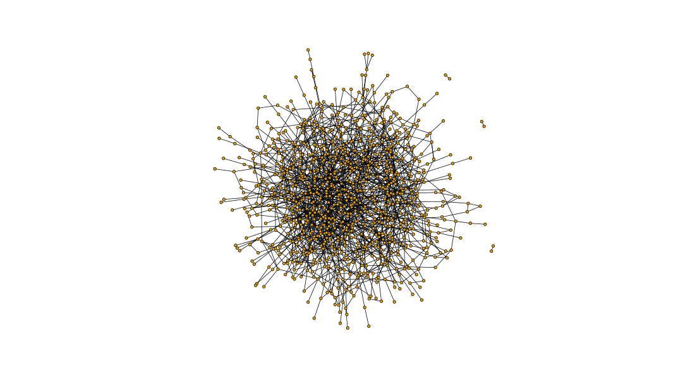
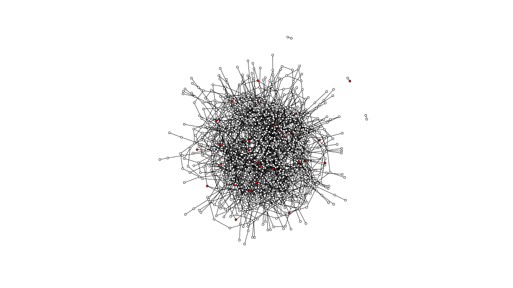
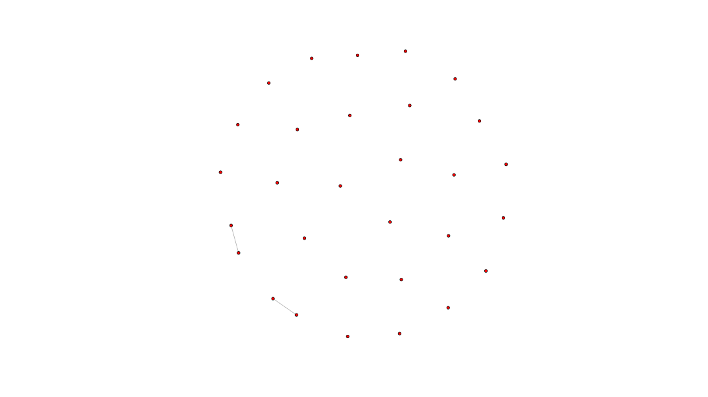
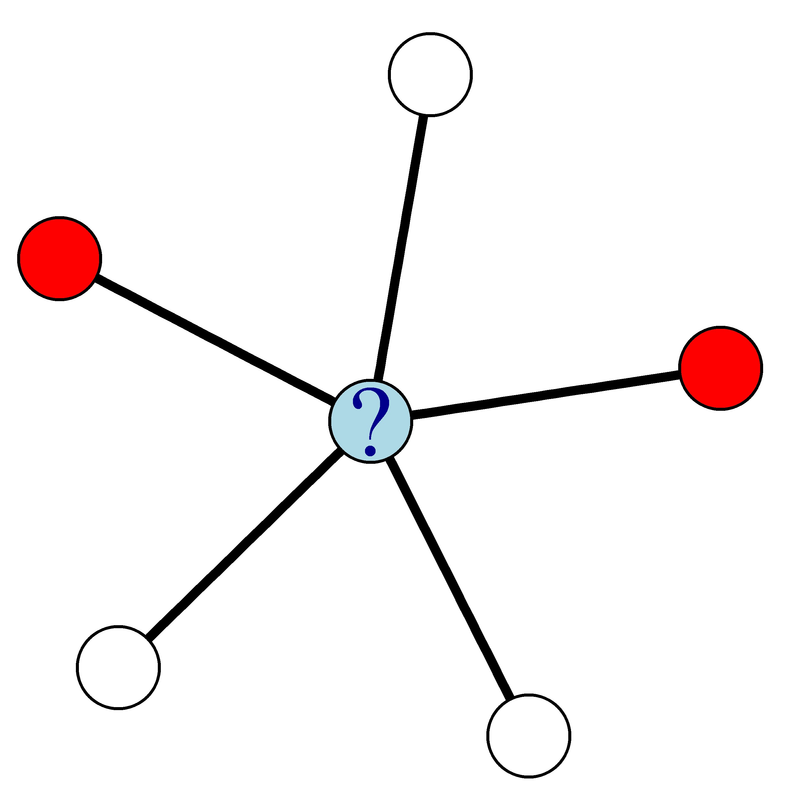
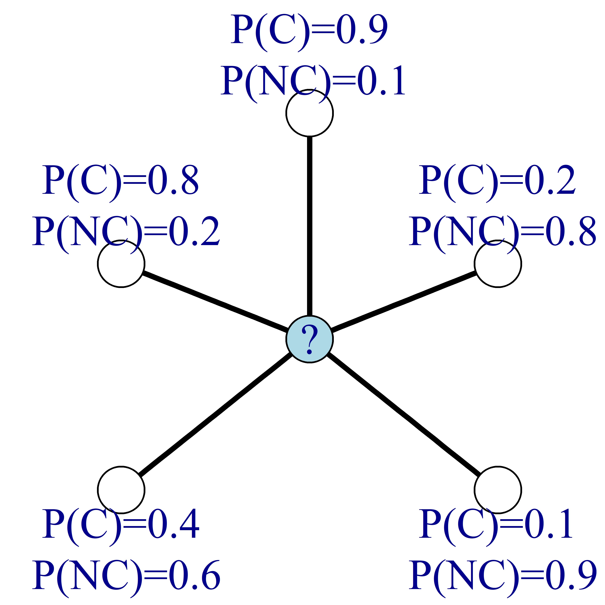
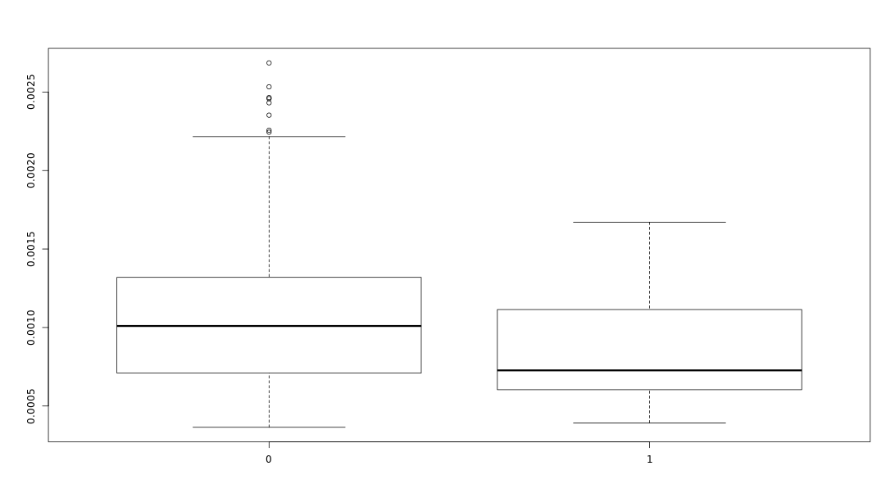
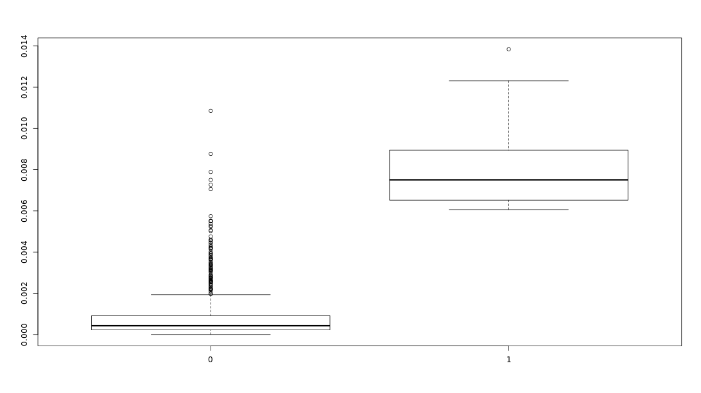
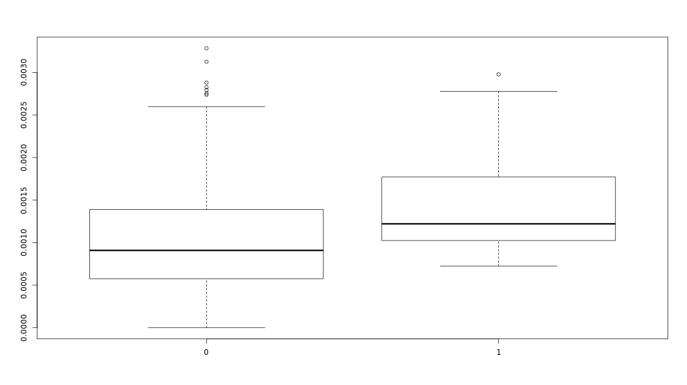
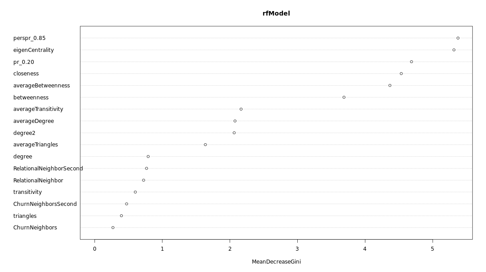

```{r setup, include=FALSE}
knitr::opts_chunk$set(echo = TRUE)
options(repos="https://CRAN.R-project.org")
```

## Motivation: social networks and predictive analytics


**Create a network from an edgelist**

In this exercise, you will create a network from an edgelist.

You will create an `igraph` object from data stored in an edgelist using the function `graph_from_data_frame()`. The data is a social network of customers and each row of the `edgeList` dataframe represents an edge in the network. The edges in this network are undirected and have weight 1. This is indicated by the `directed` argument of the function, which is logical so the value `FALSE` means that the network is undirected.

The `igraph` package has been loaded for you.

```r
library(igraph)

# Inspect edgeList
head(edgeList)
```
```
head(edgeList)
  from  to
1    1 250
2    1 308
3    1 413
4    1 525
5    1 803
6    1 894
```
```
# Construct the igraph object
network <- graph_from_data_frame(edgeList, directed = FALSE)

# View your igraph object
network
```
```
IGRAPH 51b0e10 UN-- 956 1663 -- 
+ attr: name (v/c)
+ edges from 51b0e10 (vertex names):
 [1] 1 --250 1 --308 1 --413 1 --525 1 --803 1 --894 2 --332 2 --433 2 --474
[10] 2 --847 2 --963 2 --968 3 --147 3 --290 3 --337 3 --393 3 --474 4 --179
[19] 4 --193 4 --233 5 --737 5 --793 5 --838 6 --684 6 --718 7 --237 7 --404
[28] 8 --698 8 --724 10--285 10--641 11--86  11--285 11--376 11--689 11--758
[37] 11--889 12--145 12--410 12--544 13--583 13--835 14--96  14--788 14--924
[46] 15--43  15--91  15--446 16--181 16--289 16--378 16--406 16--547 16--784
[55] 17--189 17--399 17--482 17--822 18--262 18--308 18--817 18--832 19--260
[64] 19--997 20--81  20--229 20--839 21--56  21--840 22--183 23--186 23--397
+ ... omitted several edges
```

Great job! You have created a network from an edgelist. It has 956 nodes and 1663 edges.

## Labeled networks and network learning


- assumes that linked nodes have a propensity to have the same label


- node order is alphabetical. We can see here that probability of being an R user for node "C" is 75%.

**Labeling nodes**

In this exercise, you will label the nodes in the network. You are given a dataframe called `customers` with the same customer IDs as in the network. Each customer has an indication of whether they churned or not, given by 1 or 0 respectively. You will add the churn status to the nodes of the network and visualize it.

Note that a network can have both node and edge attributes. The node attributes are represented by the function `V()` (for vertex) and the edge attributes by the function `E()`.
The node attributes of the churn network are `V(network)`.

```r
# Inspect the customers dataframe
head(customers)
```
```
   id churn
1   1     0
2 250     0
3 308     0
4 413     0
5 525     0
6 803     0
```
```r
# Count the number of churners and non-churners
table(customers$churn)
```
```
  0   1 
926  30 
```
```r
# Add a node attribute called churn
V(network)$churn <- customers$churn

# Visualize the network
plot(network, vertex.label = NA, edge.label = NA, 
     edge.color = 'black', vertex.size = 2)
```


Great work adding the churn attribute to the network and visualizing it!

**Coloring nodes**

In this exercise, you will color the nodes in the network depending on the churn status. The customers who have churned will be colored red and the non-churners will be colored white. Then you will visualize the network again.

```r
# Add a node attribute called color
V(network)$color <- V(network)$churn

# Change the color of churners to red and non-churners to white
V(network)$color <- gsub("1","red",V(network)$color)
V(network)$color <- gsub("0","white",V(network)$color)

# Plot the network
plot(network, vertex.label = NA, edge.label = NA,
     edge.color = "black", vertex.size = 2)
```


Great work on getting the colors set up! However, in a large network like this it is difficult to see what is going on.

**Visualizing Churners**

In the previous exercises, you noticed that it can be difficult to visualize a large network. Now you will visualize only the churners in the network by conditioning on the churn attribute.

```r
# Create a subgraph with only churners
churnerNetwork <- induced_subgraph(network, 
                    v = V(network)[which(V(network)$churn == 1)])
                    
# Plot the churner network                     
plot(churnerNetwork, vertex.label = NA, vertex.size = 2)
```


Nice! You have successfully made a network of churners! As you can see, some of them are connected!

**Relational Neighbor Classifier**

In this exercise, you will apply a simple network based classifier called the *relational neighbor classifier*. It uses the class labels of neighboring nodes to compute a churn probability for each node in the network.
For example, in the network below where red nodes denote churners and white nodes denote non-churners, the churn probability of the blue node is 0.4.



You are given two vectors: `ChurnNeighbors` and `NonChurnNeighbors` with each customer's number of neighbors that have churned and not churned, respectively.

```
# Compute the churn probabilities
churnProb <- ChurnNeighbors / (ChurnNeighbors + NonChurnNeighbors)

# Find who is most likely to churn
mostLikelyChurners <- which(churnProb == max(churnProb))

# Extract the IDs of the most likely churners
customers$id[mostLikelyChurners]
```
```
[1] 948 478
```

Great job using the relational neighbor classifier to discover that customers with IDs 948 and 478 are most likely to churn!

## Challenges of network-based inference


Examples:
- iterative classification
- relaxation labeling


**Probabilistic Relational Neighbor Classifier**

In this exercise, you will apply the *probabilistic relational neighbor* classifier to infer churn probabilities based on the prior churn probability of the other nodes.

Instead of knowing the nodes' labels, suppose you know each node's probability of churn, as in the image below. In the image, C stands for churn and NC for non-churn. Then, as before, you can update the churn probability of the nodes by finding the average of the neighboring nodes' churn probabilities.



```r
# Find churn probability of the 44th customer
churnProb[44]
```
```
758 
0.2 
```
```
# Update the churn probabilties and the non-churn probabilities
churnProb_updated <- as.vector((AdjacencyMatrix %*% churnProb) / neighbors)

# Find updated churn probability of the 44th customer
churnProb_updated[44]
```
```
[1] 0.2733333
```

Well done applying the probabilistic relational neighbor classifier! The churn probabiltiy of the 44th customer increased from 0.2 to 0.273333

**Collective Inferencing**

Collective inferencing is a procedure to simultaneously label nodes in interconnected data to reduce classification error.

In this exercise you will perform collective inferencing and see the effect it has on the churn prediction using the AUC performance measure. AUC, or area under the ROC curve, is commonly used to assess the performance of classification techniques.

AUC = probability that a randomly chosen churner is ranked higher by the model than a randomly chosen non-churner
AUC = number between 0.5 and 1, where a higher number means a better model
Does collective inferencing increase the AUC value?

```r
# Load the pROC package and data
library(pROC)
load("Nex132.RData")

# Compute the AUC
auc(customers$churn, as.vector(churnProb))
```
```
Area under the curve: 0.5813
```
```r
# Write a for loop to update the probabilities
for(i in 1:10){
 churnProb <- as.vector((AdjacencyMatrix %*% churnProb) / neighbors)
}

# Compute the AUC again
auc(customers$churn, as.vector(churnProb))
```
```
Area under the curve: 0.7114
```

Great job doing collective inferencing! The AUC increased from 0.5813 to 0.7114!

## Homophily

**Homophily explained**

> birds of a feather flock together

- share common property, hobbies, interest, origin, etc.
- depends on:
  - connectedness between nodes with **same** label
  - connectedness between nodes with **opposite** labels
  


**Extracting types of edges**

In this exercise, you will match the customer IDs in the customer dataframe with the customer edgelist to find out whether each edge is a churn, non-churn or a mixed edge. Using the function `match()`, you will add two columns to the edgelist.

- `fromLabel` with the churn status of the `from` column
- `toLabel` with the churn status of the `to` column


The command `match(x, y)` returns a vector with the location of `x` in `y`. In the figure above `match(edgeList$from, customers$id)` is `1,1,1,2,2`. For example, the fourth line in `edgeList$from`, which is customer with id 393, is the second element in `customers$id`. The churn label of this customer is, therefore, `customers[2,2]` or 0. Similarly, the churn label of everyone in `edgeList$from` is `customers[match(edgeList$from, customers$id),2]`.

```r
# Add the column edgeList$FromLabel
edgeList$FromLabel <- customers[match(edgeList$from, customers$id), 2]

# Add the column edgeList$ToLabel
edgeList$ToLabel <- customers[match(edgeList$to, customers$id), 2]

# Add the column edgeList$edgeType
edgeList$edgeType <- edgeList$FromLabel + edgeList$ToLabel
 
# Count the number of each type of edge
table(edgeList$edgeType)
```
```
 0      1    2 
1589   70    4 
```

Great job extracting the edge types! In your churn network, you have 1589 edges of type 0, 70 edges of type 1, and 4 edges of type 2.

**Counting types of edges**

In this exercise, you will count the number of each edge type using the `edgeType` column in the `edgeList` dataframe. In the `edgeList$edgeType` column, there are three different values:

- 0 for edges that connect two non-churn nodes.
- 1 for edges that connect a non-churn and a churn node. These are called *mixed* or *cross-label* edges.
- 2 for edges that connect two churn nodes.

```r
# Count churn edges
ChurnEdges <- sum(edgeList$edgeType == 2)
 
# Count non-churn edges
NonChurnEdges <- sum(edgeList$edgeType == 0)
 
# Count mixed edges
MixedEdges <- sum(edgeList$edgeType == 1)

# Count all edges
edges <- ChurnEdges + NonChurnEdges + MixedEdges

#Print the number of edges
edges
```
```
[1] 1663
```

Well done! Now you know the number of all edge types. There are 1663 in total.

**Counting nodes and computing connectance**

In this exercise, you will count the number of each type of node using the `customers` dataframe. The `churn` column has two different values:

- 0 for non-churners
- 1 for churners

You will also compute the network's connectance using the formula $p = \frac{2E}{N(N-1)}$ where $N$ is the number of nodes and $E$ the number of edges in the network.

```r
# Count the number of churn nodes
ChurnNodes <- sum(customers$churn == 1)

# Count the number of non-churn nodes
NonChurnNodes <- sum(customers$churn == 0)

# Count the total number of nodes
nodes <- ChurnNodes + NonChurnNodes

# Compute the network connectance
connectance <- 2 * edges / nodes / (nodes - 1)

# Print the value
connectance
```
```
[1] 0.003643015
```

Great job computing the connectance of the network! Its value is 0.00364. This network is rather sparse!

## Dyadicity


**Dyadicity**

connectedness between nodes with the **same** label compared to what is expected in a random configuration of the network

- expected number of same label edges: $\binom{n_g}{2} \cdot p = \frac{n_g(n_g-1)}{2} \cdot p$

- example:
  - network with 9 white nodes, 6 green nodes, 21 edges, and connectance $p = 0.2$
  - expected number of edges connecting two green nodes is 3 (= $\frac{6 \cdot 5 \cdot p}{2}$)

- dyadicity equals the actual number of same label edges divided by the expected number same label edge
  - $D = \frac{number\ of\ same\ label\ edges}{expected\ number\ of\ same\ label\ edges}$


**Dyadicity of churners**

In this exercise, you will compute the dyadicity amongst the churners in the network to see if they share more or fewer edges than expected in a random configuration of the network.

The variables `ChurnNodes`, `ChurnEdges`, and `connectance` are available for you to use.

For expected dyadicity, use the formula $\frac{n_c(n_c-1)}{2} \cdot p$, where $n_c$  is the number of churners, $N$ is the number of nodes, and $p$ is the connectance. Dyadicity of the churners is the ratio between the actual churners and the expected churn dyadicity.

```r
# Compute the expected churn dyadicity
ExpectedDyadChurn <- ChurnNodes * (ChurnNodes-1) * connectance / 2

# Compute the churn dyadicity
DyadChurn <- ChurnEdges / ExpectedDyadChurn

# Inspect the value
DyadChurn
```
```
[1] 2.524119
```

Great job computing the dyadicity! Because the value is greater than 1, there is dyadicity amongst the churners!

## Heterophilicity


**Heterophilicity**

connectedness between nodes with **different** labels compared to what is expected for a random configuration of the network

- expected number of cross label edges = $n_w n_g p$
- example
  - network with 9 white nodes, 6 green nodes, 21 edges, and connectance $p = 0.2$
  - expected number of cross label edges is 11(= $9 \cdot 6 \cdot p$)
- heterophilicity equals the actual number of cross label edges divided by the expected number of cross label edges
  - $H = \frac{number\ of\ cross\ label\ edges}{expected\ number\ of\ cross\ label\ edges}$


**Compute heterophilicity**

Similar to dyadicity, heterophilicity is the ratio between the actual number of mixed label edges and the expected number of mixed label edges. In this exercise, you will compute the network's heterophilicity.

For the expected number of mixed edges, use the formula $n_{NC} \cdot n_C \cdot p$  where $n_{NC}$ is the number of non-churners, $n_C$ is the number of churners and p is the connectance.

You can use the variables `NonChurnNodes`, `ChurnNodes`, `connectance`, and `MixedEdges`.

```r
# Compute the expected heterophilicity
ExpectedHet <- ChurnNodes * NonChurnNodes * connectance

# Compute the heterophilicity
Het <- MixedEdges / ExpectedHet

# Inspect the heterophilicity
Het
```
```
[1] 0.6916794
```

Great job computing the heterophilicity! It is less than one, which means that the network is heterophobic.

## Summary of homophily

**Can I do predictive analytics with my network?**

> Are the relationships between nodes important?
> Are the labels randomly spread through the network or is there some structure?
> **is the network homophilic?**


## Basic Network features


**Simple network features**

In this exercise, you will extract simple network features from the churn network and add them to the `network` object as node attributes. The `igraph` object called `network` with the node attribute `Churn`, indicating customers who have already churned, has been pre-loaded. The `igraph` library has also been loaded for you.

```r
# Extract network degree
V(network)$degree <- degree(network, normalized=TRUE)

# Extract 2.order network degree
degree2 <- neighborhood.size(network, 2)

# Normalize 2.order network degree
V(network)$degree2 <- degree2 / (length(V(network)) - 1)

# Extract number of triangles
V(network)$triangles <- count_triangles(network)
```

Great job! You've computed the first and second order degree, as well as the number of triangles, and added all these features to the network object.

**Centrality features**

In this exercise, you will compute and extract the centrality features betweenness, closeness, and eigenvector centrality.

```r
# Extract the betweenness
V(network)$betweenness <- betweenness(network, normalized=TRUE)

# Extract the closeness
V(network)$closeness <- closeness(network, normalized=TRUE)

# Extract the eigenvector centrality
V(network)$eigenCentrality <- eigen_centrality(network, scale = TRUE)$vector
```

Great job! You have added the features betweenness, closeness, and eigenvector centrality

**Transitivity**
In this exercise you will compute the network's transitivity, or clustering coefficient, both on the node level and on the global level.

```r
# Extract the local transitivity
V(network)$transitivity <- transitivity(network, type='local', isolates='zero')

# Compute the network's transitivity
transitivity(network)
```
```
[1] 0.1002653
```

Great job! The global transitivity is 0.1002653.

## Link-Based Features


**Adjacency matrices**

In this exercise, you will extract and compute the first and second order adjacency matrices of the network.
You've already seen how to extract the first order adjacency matrix using the `as_adjaceny_matrix()` function in the slides. For the second-order adjacency matrix, you need to multiply the first order matrix with itself and replace all the positive values with 1 since we are working with unweighted networks only. You also need to make sure the elements on the diagonal are 0 since we do not allow self-edges.

```r
# Extract the adjacency matrix
AdjacencyMatrix <- as_adjacency_matrix(network)

# Compute the second order matrix
SecondOrderMatrix_adj <- AdjacencyMatrix %*% AdjacencyMatrix

# Adjust the second order matrix
SecondOrderMatrix <- ((SecondOrderMatrix_adj) > 0) + 0
diag(SecondOrderMatrix) <- 0

# Inspect the second order matrix
SecondOrderMatrix[1:10, 1:10]
```
```
1   0 . 1 1 . 1 1 . . .
250 . 0 1 1 1 1 1 . . .
308 1 1 0 1 1 1 1 . . .
413 1 1 1 0 1 1 1 . . .
525 . 1 1 1 0 1 1 . . .
803 1 1 1 1 1 0 1 . . .
894 1 1 1 1 1 1 0 . . .
2   . . . . . . . 0 . .
332 . . . . . . . . 0 1
433 . . . . . . . . 1 0
```

Great job computing the adjacency matrices! Now you are ready to add some link-based features!

**Link-based features**

In this exercise, you will compute first order link-based features by multiplying the `Churn` attribute of the network with the network's adjacency matrix.

Note, that since churn is a binary indicator, the attribute `Churn` has 1 for churners and 0 for non-churners. Consequently, the attribute `1-Churn` has 1 for non-churners and 0 for churners. This is helpful when computing the number of non-churn neighbors.

```r
# Compute the number of churn neighbors
V(network)$ChurnNeighbors <- as.vector(AdjacencyMatrix %*% V(network)$Churn)

# Compute the number of non-churn neighbors
V(network)$NonChurnNeighbors <- as.vector(AdjacencyMatrix %*% (1 - V(network)$Churn))

# Compute the relational neighbor probability
V(network)$RelationalNeighbor <- as.vector(V(network)$ChurnNeighbors / 
    (V(network)$ChurnNeighbors + V(network)$NonChurnNeighbors))
```

Great job obtaining the link-based features! Next we go for the second order neighborhood!

**Second order link-based features**

In this exercise, you will compute the number and ratio of churn and non-churn neighbors in the second order neighborhood. The procedure is the same as in the previous exercise, except now you use the **second** order adjacency matrix.

```r
# Compute the number of churners in the second order neighborhood
V(network)$ChurnNeighbors2 <- as.vector(SecondOrderMatrix %*% V(network)$Churn)

# Compute the number of non-churners in the second order neighborhood
V(network)$NonChurnNeighbors2 <- as.vector(SecondOrderMatrix %*% (1 - V(network)$Churn))

# Compute the relational neighbor probability in the second order neighborhood
V(network)$RelationalNeighbor2 <- as.vector(V(network)$ChurnNeighbors2 / 
    (V(network)$ChurnNeighbors2 + V(network)$NonChurnNeighbors2))
```

Great job! You've now extracted second order link-based features!

**Neighborhood link-based features**

Sometimes, the feature values of neighboring nodes have an effect on behavior. In this exercise, you will look at the attribute value of neighboring nodes and compute their average. You will do this for degree, triangles, transitivity, and betweenness.

You need to:

- Multiply the adjacency matrix with the network attribute you want to find the average of, to obtain the overall value in the neighborhood.
- To get the average, divide by the node's degree, **given by the vector** `degree` which has been pre-loaded.
- Finally, convert the result to a vector and assign to `network` as a node attribute.

```r
# Extract the average degree of neighboring nodes
V(network)$averageDegree <- 
    as.vector(AdjacencyMatrix %*% V(network)$degree) / degree
    
# Extract the average number of triangles of neighboring nodes
V(network)$averageTriangles <- 
    as.vector(AdjacencyMatrix %*% V(network)$triangles) / degree    
    
# Extract the average transitivity of neighboring nodes    
V(network)$averageTransitivity<-
    as.vector(AdjacencyMatrix %*% V(network)$transitivity) / degree
    
# Extract the average betweenness of neighboring nodes    
V(network)$averageBetweenness <- 
    as.vector(AdjacencyMatrix %*% V(network)$betweenness) / degree
```

You've now computed the average of degree, triangles, transitivity, and betweenness in the neighborhood. Well done!

## PageRank


**Answer:** Diane

**Changes in PageRank**

The PageRank formula $\vec{PR} = \alpha \cdot A \cdot \vec{PR} + (1-\alpha) \cdot \vec{e}$ can be solved for $\vec{PR}$ iteratively. In each iteration, the current value of $\vec{PR}$ is used to compute a new value that is closer to the true value. This means that the difference between the $\vec{PR}$'s of every two subsequent iterations becomes smaller and smaller until $\vec{PR}$ converges to the true value and the difference becomes (almost) zero. In this exercise, you will inspect the PageRank algorithm and how it converges.

```r
# Compute one iteration of PageRank 
iter1 <- page.rank(network, algo = 'power', options = list(niter = 1))$vector

# Compute two iterations of PageRank 
iter2 <- page.rank(network, algo='power', options = list(niter = 2))$vector

# Inspect the change between one and two iterations
sum(abs(iter2 - iter1))
```
```
[1] 0.2790693
```
```
# Inspect the change between nine and ten iterations
sum(abs(iter10 - iter9))
```
```
[1] 0.009208855
```

Great job! The difference between iterations decreased from 0.279 to 0.009!

**Convergence of PageRank**

In this exercise, you will visually inspect how the PageRanks converge by plotting the differences of every two subsequent iterations.

```r
# Create an empty vector
value <- c()

# Write a loop to compute PageRank 
for(i in 1:15){
  value <- cbind(value, page.rank(network, algo = 'power',options = list(niter = i))$vector)
}
  
# Compute the differences 
difference <- colSums(abs(value[,1:14] - value[,2:15]))

# Plot the differences
plot(1:14, difference)
```


Great job! Did you see how the difference between iterations became less and less?

**Personalized PageRank**

In this exercise, you will study the difference between the PageRank and the personalized PageRank algorithms. You can use the function `boxplots`, which shows the score distributions of churners and non-churners with two separate boxplots. The function has two arguments:

- `damping` ($\alpha$), indicating the value of the damping factor. The default value is set to 0.85.
- `personalized`, a Boolean parameter that indicates whether the personalized PageRank algorithm should be used. When TRUE, the restart vector has 1 for the churners in the network and 0 for the non-churners. The default value is FALSE, i.e. not personalized.

```r
boxplots <- function(damping=0.85, personalized=FALSE){
  if(personalized){
    V(network)$pp<-page.rank(network,damping=damping,personalized = V(network)$Churn)$vector
  }
  else{
  V(network)$pp<-page.rank(network,damping=damping)$vector
  }
  boxplot(V(network)$pp~V(network)$Churn)#
}
```

```r
# Look at the distribution of standard PageRank scores
boxplots(damping = 0.85)
```

```
# Inspect the distribution of personalized PageRank scores
boxplots(damping = 0.85, personalized = TRUE)
```

```
# Look at the standard PageRank with damping factor 0.2
boxplots(damping = 0.2)
```

```
# Inspect the personalized PageRank scores with a damping factor 0.99
boxplots(damping = 0.99, personalized = TRUE)
```


Great job! There is clear difference between personalized and non-personalized PageRank scores.

**Extract PageRank features**

In this exercise, you will compute a few PageRank scores and add them as features to the network.

When personalizing, use the prior churners in the network as the restart vector. That is, include the argument `personalized = V(network)$Churn`.

The default damping value is 0.85.

```r
# Compute the default PageRank score
V(network)$pr_0.85 <- page.rank(network)$vector

# Compute the PageRank score with damping 0.2
V(network)$pr_0.20 <- page.rank(network, damping = 0.2)$vector

# Compute the personalized PageRank score
V(network)$perspr_0.85 <- page.rank(network, personalized = V(network)$Churn)$vector

# Compute the personalized PageRank score with damping 0.99
V(network)$perspr_0.99 <- page.rank(network, damping = 0.99, personalized = V(network)$Churn)$vector
```

You now have the final PageRank score and are finished featurizing the network! Well done!

## Extract a dataset


**Getting a flat dataset**

In this exercise, you will turn your network into a dataframe, where the rows are the people in the network and the columns are the network features you computed in the previous chapter. You will also prepare the dataset for the pre-processing.

```r
# Extract the dataset
studentnetworkdata_full <- as_data_frame(network, what = "vertices")

# Inspect the dataset
head(studentnetworkdata_full)
```
```
head(studentnetworkdata_full)
    name Churn Future      degree    degree2 triangles betweenness  closeness
1      1     0      0 0.006282723 0.02198953         2 0.008143888 0.08535931
250  250     0      0 0.004188482 0.01884817         0 0.005203912 0.08324616
308  308     0      0 0.003141361 0.01361257         1 0.002343329 0.08361790
413  413     0      0 0.005235602 0.02094241         1 0.006856084 0.08570403
525  525     0      0 0.003141361 0.01256545         0 0.002902738 0.08065197
803  803     0      0 0.006282723 0.02722513         1 0.014510436 0.08777574
    eigenCentrality transitivity ChurnNeighbors NonChurnNeighbors
1        0.16674956   0.13333333              0                 6
250      0.12172320   0.00000000              0                 4
308      0.08880306   0.33333333              0                 3
413      0.15380274   0.10000000              0                 5
525      0.04339212   0.00000000              0                 3
803      0.22528120   0.06666667              0                 6
    RelationalNeighbor ChurnNeighborsSecond NonChurnNeighborsSecond
1                    0                    0                      18
250                  0                    0                      13
308                  0                    0                      11
413                  0                    0                      16
525                  0                    0                       8
803                  0                    0                      21
    RelationalNeighborSecond averageDegree averageTriangles averageTransitivity
1                          0   0.004363002        0.8333333          0.13888889
250                        0   0.004450262        1.0000000          0.12857143
308                        0   0.004886562        1.3333333          0.15555556
413                        0   0.004397906        1.0000000          0.10666667
525                        0   0.003839442        0.6666667          0.04444444
803                        0   0.004886562        0.8333333          0.10555556
    averageBetweenness      pr_0.85      pr_0.20  perspr_0.85  perspr_0.99
1          0.005713676 0.0016432968 0.0011679051 0.0005999950 0.0016861963
250        0.005733908 0.0012545054 0.0011611762 0.0002994797 0.0010956510
308        0.006030621 0.0008559875 0.0009801438 0.0003068000 0.0008458014
413        0.006727380 0.0014219824 0.0011938511 0.0005301201 0.0014117851
525        0.003698440 0.0009856206 0.0010436938 0.0001917604 0.0008062519
803        0.009493972 0.0016022681 0.0011561387 0.0015758243 0.0018944739
```
```
# Remove customers who already churned
studentnetworkdata_filtered <- studentnetworkdata_full[-which(studentnetworkdata_full$Churn == 1), ]

# Remove useless columns
studentnetworkdata <- studentnetworkdata_filtered[, -c(1, 2)]
```

Great job extracting the dataset! The next step is preprocessing!

**Missing Values**

You can check if a dataset has missing values per column using the `apply()` function.

- The first argument of `apply()` is the dataframe you are inspecting, in this case, `studentnetworkdata`.
- The second argument indicates whether operations should be performed row-wise (1) or column-wise (2).
- The third argument is the function applied to each row or column. You specify it by writing `function(x) ...` where `...` indicates the operation. You want to count the number of missing values in each column. Use `sum(is.na(x))` to find all the missing values and count them.

How many columns in `studentnetworkdata` have missing values?

```r
apply(studentnetworkdata, 2, function(x) sum(is.na(x)))
```
```
         Future                   degree                  degree2 
                       0                        0                        0 
               triangles              betweenness                closeness 
                       0                        0                        0 
         eigenCentrality             transitivity           ChurnNeighbors 
                       0                        0                        0 
       NonChurnNeighbors       RelationalNeighbor     ChurnNeighborsSecond 
                       0                        0                        0 
 NonChurnNeighborsSecond RelationalNeighborSecond            averageDegree 
                       0                        6                        0 
        averageTriangles      averageTransitivity       averageBetweenness 
                       0                        0                        0 
                 pr_0.85                  pr_0.20              perspr_0.85 
                       0                        0                        0 
             perspr_0.99 
                       0 
```

The column `RelationalNeighborSecond` has six missing values.

**Replace missing values**

In the last exercise, you noticed that for six observations, the value of `RelationalNeighborSecond` was missing. In this exercise, you will replace those missing values with 0.

```r
# Inspect the feature
summary(studentnetworkdata$RelationalNeighborSecond)
```
```
  Min. 1st Qu.  Median    Mean 3rd Qu.    Max.    NA's 
0.00000 0.00000 0.00000 0.02399 0.00000 1.00000       6 
```
```
# Find the indices of the missing values
toReplace <- which(is.na(studentnetworkdata$RelationalNeighborSecond))

# Replace the missing values with 0
studentnetworkdata$RelationalNeighborSecond[toReplace] <- 0

# Inspect the feature again
summary(studentnetworkdata$RelationalNeighborSecond)
```
```
   Min. 1st Qu.  Median    Mean 3rd Qu.    Max. 
0.00000 0.00000 0.00000 0.02383 0.00000 1.00000 
```

Great job! You have dealt with all the missing values.

**Correlated variables**

In this exercise, you will inspect the dataset with respect to correlated variables. It is important to remove them before applying a binary classifier, especially in the case of logistic regression. When two or more variables are highly correlated you should remove all except for one.

First, we will use the `corrplot()` function in the `corrplot` package to visualize the correlations. In the correlation plot, blue represents a positive correlation and red a negative correlation. A darker color indicates a higher correlation. Finally, you will remove the highly correlated variables from the data set.

```r
# Remove the Future column from studentnetworkdata 
no_future <- studentnetworkdata[, -1]

# Load the corrplot package
library(corrplot)

# Generate the correlation matrix
M <- cor(no_future)

# Plot the correlations
corrplot(M, method = "circle")
```


```r
# Print the column names
colnames(studentnetworkdata)
```
```
 [1] "Future"                   "degree"                  
 [3] "degree2"                  "triangles"               
 [5] "betweenness"              "closeness"               
 [7] "eigenCentrality"          "transitivity"            
 [9] "ChurnNeighbors"           "NonChurnNeighbors"       
[11] "RelationalNeighbor"       "ChurnNeighborsSecond"    
[13] "NonChurnNeighborsSecond"  "RelationalNeighborSecond"
[15] "averageDegree"            "averageTriangles"        
[17] "averageTransitivity"      "averageBetweenness"      
[19] "pr_0.85"                  "pr_0.20"                 
[21] "perspr_0.85"              "perspr_0.99"             
```
```
# Create toRemove
toRemove <- c(10, 13, 19, 22)

# Remove the columns
studentnetworkdata_no_corrs <- studentnetworkdata[, -toRemove]
```

Well done! You removed the highly correlated features: `NonChurnNeighbors`, `pr_0.85`, `perspr_0.99` and `NonChurnNeighborsSecond`.

## Building a predictive model


**Split into train and test**

Now that we have a dataframe, we can apply standard techniques for modeling. In this exercise, you will split the data into training and test sets.

```r
# Set the seed
set.seed(7)

# Create the index vector
index_train <- sample(1:nrow(studentnetworkdata), 2 / 3 * nrow(studentnetworkdata))

# Make the training set
training_set <- studentnetworkdata[index_train, ]

# Make the test set
test_set <- studentnetworkdata[-index_train, ]
```

Well done! Now you have a training set and a test set.

**Logistic regression model**

In this exercise, you will build churn prediction models using logistic regression. These models predict which customers will churn in the future. You will build three models with different sets of features.
The target variable is called `Future`. You will build the models using the training dataset `training_set` and the function `glm()`.

```r
# Make firstModel
firstModel <- glm(Future ~ degree + degree2 + triangles + betweenness + closeness + transitivity, family = "binomial", data = training_set)

firstModel
```
```
Call:  glm(formula = Future ~ degree + degree2 + triangles + betweenness + 
    closeness + transitivity, family = "binomial", data = training_set)

Coefficients:
 (Intercept)        degree       degree2     triangles   betweenness  
     -6.9805      -48.6542     -156.1732        0.4957     -137.5345  
   closeness  transitivity  
     74.7736       -0.8865  

Degrees of Freedom: 616 Total (i.e. Null);  610 Residual
Null Deviance:	    202.9 
Residual Deviance: 182.7 	AIC: 196.7
```
```r
# Build the model
secondModel <- glm(Future ~ ChurnNeighbors + RelationalNeighbor + ChurnNeighborsSecond + RelationalNeighborSecond + averageDegree + averageTriangles + averageTransitivity + averageBetweenness, 
                   family = "binomial", data = training_set)

secondModel
```
```
Call:  glm(formula = Future ~ ChurnNeighbors + RelationalNeighbor + 
    ChurnNeighborsSecond + RelationalNeighborSecond + averageDegree + 
    averageTriangles + averageTransitivity + averageBetweenness, 
    family = "binomial", data = training_set)

Coefficients:
             (Intercept)            ChurnNeighbors        RelationalNeighbor  
                 -4.1202                   -0.2709                    3.6742  
    ChurnNeighborsSecond  RelationalNeighborSecond             averageDegree  
                  0.1167                   -1.4032                  775.7303  
        averageTriangles       averageTransitivity        averageBetweenness  
                 -0.9539                    1.8714                 -323.5743  

Degrees of Freedom: 616 Total (i.e. Null);  608 Residual
Null Deviance:	    202.9 
Residual Deviance: 187.9 	AIC: 205.9
```
```r
# Build the model
thirdModel <- glm(Future ~ ., family = "binomial", data = training_set)

thirdModel
```
```
Call:  glm(formula = Future ~ ., family = "binomial", data = training_set)

Coefficients:
             (Intercept)                    degree                   degree2  
                -24.8438                -1980.5282                    0.1002  
               triangles               betweenness                 closeness  
                  0.2696                 -235.0185                  152.1249  
         eigenCentrality              transitivity            ChurnNeighbors  
                 10.9705                   -1.1261                    1.9778  
      RelationalNeighbor      ChurnNeighborsSecond  RelationalNeighborSecond  
                  0.6155                    1.4341                   -6.8080  
           averageDegree          averageTriangles       averageTransitivity  
                443.9935                   -1.2387                    4.7712  
      averageBetweenness                   pr_0.20               perspr_0.85  
               -228.4347                13966.7768                 -181.8855  

Degrees of Freedom: 616 Total (i.e. Null);  599 Residual
Null Deviance:	    202.9 
Residual Deviance: 162.6 	AIC: 198.6
```

You have now made three logistic regression models! Great job!

**Random forest model**

In this exercise, you will use the `randomForest()` function in the `randomForest` package to build a random forest model for predicting churn of the customers in the training data set, `training_set`. The target variable is called `Future`. You will also inspect and visualize the importance of the variables in the model.

```r
# Load package
library(randomForest)

# Set seed
set.seed(863)

# Build model
rfModel <- randomForest(as.factor(Future)~. ,data=training_set)

rfModel
```
```
Call:
 randomForest(formula = as.factor(Future) ~ ., data = training_set) 
               Type of random forest: classification
                     Number of trees: 500
No. of variables tried at each split: 4

        OOB estimate of  error rate: 3.4%
Confusion matrix:
    0 1 class.error
0 596 0           0
1  21 0           1
```
```r
# Plot variable importance
varImpPlot(rfModel)
```


You trained a random forest on you data! Well done! In the variable importance plot, you could see that `perspr_0.85` and `eigenCentrality` are the most important features.

## Evaluating model performance


**Predicting churn**

In this exercise, you will use the `predict()` function in the `pROC` package to predict the churn probability of the customers in the test set, `test_set`. The function has three arguments:

- The model used to make the predictions.
- `newdata`: The dataset the model should be applied to.
- `type`: the type of prediction. We want to know the probability of churn, so we choose either `response` or `prob`.

Use the function `predict()` to predict the churn probability of the customers in `test_set`.

```r
# Load the package
library(pROC)

# Predict with the first model
firstPredictions <- predict(firstModel, newdata = test_set, type = "response")

# Predict with the second model
secondPredictions <- predict(secondModel, newdata = test_set, type = "response")

# Predict with the third model
thirdPredictions <- predict(thirdModel, newdata = test_set, type = "response")

# Predict with the rfModel
rfPredictions<- predict(rfModel, newdata = test_set, type= "prob")
```

Great! You computed churn probabilites using the random forest model!

**Measure AUC**

In this exercise, you will compute the AUC of your churn prediction models to find the best one. Use the `auc()` function in the `pROC` package. The function has two arguments:

1. The true churn label in the test set, `test_set$Future`.
2. The model prediction:
  a. For logistic regression, it is the prediction obtained from the `predict` function.
  b. For random forest, it is the second column of the prediction obtained from the `predict` function.
  
The objects `firstPredictions`,` secondPredictions`, `thirdPredictions`, and `rfPredictions` have been loaded for you.

Which model has the highest AUC value?

```r
auc(test_set$Future, firstPredictions)
```
```
Area under the curve: 0.7452
```
```r
auc(test_set$Future, secondPredictions)
```
```
Area under the curve: 0.74
```
```r
auc(test_set$Future, thirdPredictions)
```
```
Area under the curve: 0.7221
```
```r
auc(test_set$Future, rfPredictions[,2])
```
```
Area under the curve: 0.7548
```

The AUC of the random forest model is 0.7548.

**Measure top decile lift**

Compute and compare the top decile lift of the churn prediction models using the function `TopDecileLift()` in the `lift` package. The function takes two arguments:

1. The true churn label in the test set, `test_set$Future`.
2. The model prediction: 
  a. For logistic regression, use the prediction from the `predict` function. 
  b. For random forest, use the second column of the predictions from the `predict` function.
  
The objects `firstPredictions`, `secondPredictions`, `thirdPredictions`, and `rfPredictions`, and the package `lift` have been loaded for you.

Which model has the highest top decile lift?

```r
library(lift)
TopDecileLift(test_set$Future, firstPredictions)
```
```
[1] 1.053
```
```r
TopDecileLift(test_set$Future, secondPredictions)
```
```
[1] 1.179
```
```r
TopDecileLift(test_set$Future, thirdPredictions)
```
```
[1] 1.055
```
```r
TopDecileLift(test_set$Future, rfPredictions[,2])
```
```
[1] 1.19
```

The lift of the random forest model is 1.19.

## Summary and final thoughts


