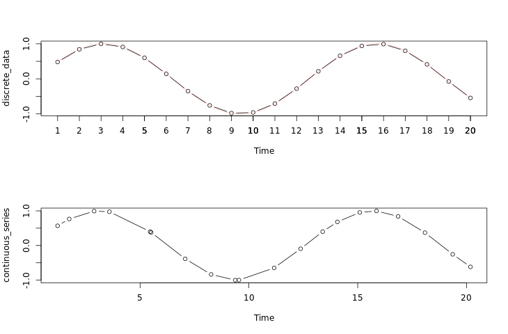
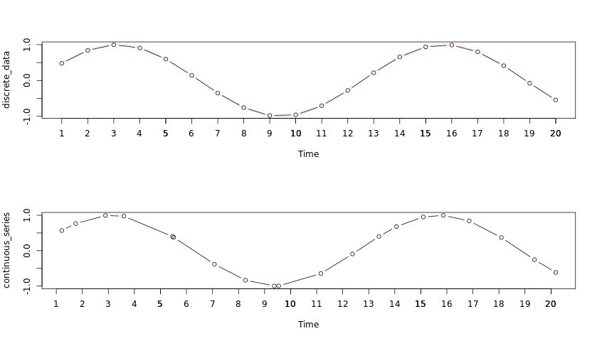
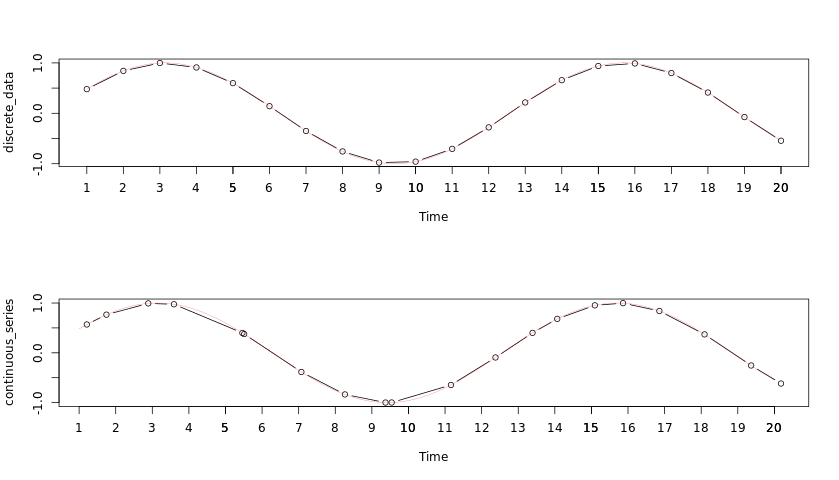

```{r setup, include=FALSE}
knitr::opts_chunk$set(echo = TRUE)
```

**Welcome to the course!**
___
* Introduction
  + Time Series: A sequence of data in chronological order.
  + Data is commonly recorded sequentially, over time.
  + Time series data is everywhere
* Time series data
  + Time series data is dated or time stamped in R
  + `print(Time_Series)`
* Time series plots
  + `plot(Time_Series)`
  + time is indexed on horizontal axis
  + observations in time from first on left to last on right
  + line connects neighboring observations
* Basic time series models
  + White Noise (WN)
  + Random Walk (RW)
  + Autoregression (AR)
  + Simple Moving Average (MA)
___

**Exploring raw time series**
The most common first step when conducting time series analysis is to display your time series dataset in a visually intuitive format. The most useful way to view raw time series data in R is to use the **print()** command, which displays the `Start`, `End`, and `Frequency` of your data along with the observations.

Another useful command for viewing time series data in R is the **length()** function, which tells you the total number of observations in your data.

Some datasets are very long, and previewing a subset of data is more suitable than displaying the entire series. The `head(___, n =___)` and `tail(___, n =___)` functions, in which `n` is the number of items to display, focus on the first and last few elements of a given dataset respectively.

In this exercise, you'll explore the famous River Nile annual streamflow data, `Nile`. This time series dataset includes some metadata information. When calling `print(Nile)`, note that `Start = 1871` indicates that 1871 is the year of the first annual observation, and `End = 1970` indicates 1970 is the year of the last annual observation.
```{r}
# Print the Nile dataset
print(Nile)

# List the number of observations in the Nile dataset
length(Nile)

# Display the first 10 elements of the Nile dataset
head(Nile, n = 10)

# Display the last 12 elements of the Nile dataset
tail(Nile, n = 12)
```

As you can see, these commands are very useful when exploring raw time series data.

**Basic time series plots**
While simple commands such as `print()`, `length()`, `head()`, and `tail()` provide crucial information about your time series data, another very useful way to explore any data is to generate a plot.

In this exercise, you will plot the River Nile annual streamflow data using the **plot()** function. For time series data objects such as `Nile`, a `Time` index for the horizontal axis is typically included. From the previous exercise, you know that this data spans from 1871 to 1970, and horizontal tick marks are labeled as such. The default label of "Time" is not very informative. Since these data are annual measurements, you should use the label "Year". While you're at it, you should change the vertical axis label to "River Volume (1e9 m^{3})".

Additionally, it helps to have an informative title, which can be set using the argument `main`. For your purposes, a useful title for this figure would be "Annual River Nile Volume at Aswan, 1871-1970".

Finally, the default plotting `type` for time series objects is `"l"` for line. Connecting consecutive observations can help make a time series plot more interpretable. Sometimes it is also useful to include both the observations points as well as the lines, and we instead use `"b" `for both.
```{r}
# Plot the Nile data
plot(Nile)

# Plot the Nile data with xlab and ylab arguments
plot(Nile, xlab = "Year", ylab = "River Volume (1e9 m^{3})")

# Plot the Nile data with xlab, ylab, main, and type arguments
plot(Nile, xlab = "Year", ylab = "River Volume (1e9 m^{3})", main = "Annual River Nile Volume at Aswan, 1871-1970", type = "b")

```

The `plot()` command is one of the most versatile commands in R. When used with time series data, this command automatically plots your data over time.

**What does the time index tell us?**
Some data are naturally evenly spaced by time. The time series `discrete_data` shown in the top figure has 20 observations, with one observation appearing at each of the discrete time indices 1 through 20. Discrete time indexing is appropriate for `discrete_data`.

The time series `continuous_series` shown in the bottom figure also has 20 observations, it is following the same periodic pattern as `discrete_data`, but its observations are not evenly spaced. Its first, second, and last observations were observed at times 1.210322, 1.746137, and 20.180524, respectively. Continuous time indexing is natural for `continuous_series`, however, the observations are approximately evenly spaced, with about 1 observation observed per time unit. Let's investigate using a discrete time indexing for `continuous_series`.




```{r}
continuous_time_index <- c(1.210322, 1.746137,  2.889634,  3.591384,  5.462065,  5.510933,  7.074295, 8.264398,  9.373382,
                           9.541063, 11.161122, 12.378371, 13.390559, 14.066280, 15.093547, 15.864515, 16.857413, 18.091457,                            19.365451, 20.180524)

continuous_series <- c(0.56889468, 0.76630408, 0.99207512, 0.97481741, 0.39912320, 0.37660246, -0.38532033, -0.83635852, 
                       -0.99966983, -0.99831019, -0.64622280, -0.09386151, 0.40052909,  0.68160578,  0.95318159,  
                       0.99693803,  0.83934194,  0.37003754, -0.25509676, -0.61743983)

# Plot the continuous_series using continuous time indexing
par(mfrow=c(2,1))
plot(continuous_time_index, continuous_series, type = "b")

# Make a discrete time index using 1:20 
discrete_time_index <- 1:20

# Now plot the continuous_series using discrete time indexing
plot(discrete_time_index, continuous_series, type = "b")

```
**Sampling frequency**
___
- Basic simplifying assumptions for time series:
  - consecutive observations are equally spaced
  - apply discrete-time observation index
  - this may only hold approximatetely
- R functions:
  - `start()`
  - `end()`
  - `frequency()`
  - `deltat()`
___

**Identifying the sampling frequency**
In addition to viewing your data and plotting over time, there are several additional operations that can be performed on time series datasets.

The `start()` and `end()` functions return the time index of the first and last observations, respectively. The `time()` function calculates a vector of time indices, with one element for each time index on which the series was observed.

The `deltat()` function returns the fixed time interval between observations and the `frequency()` function returns the number of observations per unit time. Finally, the `cycle()` function returns the position in the cycle of each observation.

In this exercise, you'll practice applying these functions to the `AirPassengers` dataset, which reports the monthly total international airline passengers (in thousands) from 1949 to 1960.
```{r}
# Plot AirPassengers
plot(AirPassengers)

# View the start and end dates of AirPassengers
start(AirPassengers)
end(AirPassengers)

# Use time(), deltat(), frequency(), and cycle() with AirPassengers 
deltat(AirPassengers)
frequency(AirPassengers)
time(AirPassengers)
cycle(AirPassengers)
```

These commands provide considerable descriptive information about the structures and patterns in your time series data. It may help to keep these commands handy when working with your own time series data.

**Missing values**
Sometimes there are missing values in time series data, denoted `NA` in R, and it is useful to know their locations. It is also important to know how missing values are handled by various R functions. Sometimes we may want to ignore any missingness, but other times we may wish to impute or estimate the missing values.

Let's again consider the monthly `AirPassengers `dataset, but now the data for the year 1956 are missing. In this exercise, you'll explore the implications of this missing data and impute some new data to solve the problem.

The `mean()` function calculates the sample mean, but it fails in the presence of any `NA` values. Use `mean(___, na.rm = TRUE)` to calculate the mean with all missing values removed. It is common to replace missing values with the mean of the observed values. Does this simple data imputation scheme appear adequate when applied the the `AirPassengers` dataset?
```{r}

# Plot the AirPassengers data
plot(AirPassengers, type = "l")

# Compute the mean of AirPassengers
mean(AirPassengers, na.rm = TRUE)

# Impute mean values to NA in AirPassengers
AirPassengers[85:96] <- mean(AirPassengers, na.rm = TRUE)

# Generate another plot of AirPassengers
plot(AirPassengers)

# Add the complete AirPassengers data to your plot
rm(AirPassengers)
points(AirPassengers, type = "l", col = 2, lty = 3)

```

ased on your plot, it seems that simple data imputation using the mean is not a great method to approximate what's really going on in the AirPassengers data.

**Basic time series objects**
___
- Building ts() objects
  - start with a vector of data
  - apply the `ts()` function
  - specify the start date and observation frequency
    - `time_series <- ts(data_vector, start = 2001, frequency = 1)`
- Why ts() objects?
  - improved plotting
  - access to time index information
  - model estimation and forecasting (later chapters)
___

**Creating a time series object with ts()**
The function [ts()](https://www.rdocumentation.org/packages/stats/versions/3.3.1/topics/ts) can be applied to create time series objects. A time series object is a vector (univariate) or matrix (multivariate) with additional attributes, including time indices for each observation, the sampling frequency and time increment between observations, and the cycle length for periodic data. Such objects are of the `ts` class, and represent data that has been observed at (approximately) equally spaced time points. Now you will create time series objects yourself.

The advantage of creating and working with time series objects of the `ts` class is that many methods are available for utilizing time series attributes, such as time index information. For example, as you've seen in earlier exercises, calling `plot()` on a ts object will automatically generate a plot over time.

In this exercise, you'll familiarize yourself with the `ts` class by encoding some time series data (saved as `data_vector`) into `ts` and exploring the result. Your time series `data_vector` starts in the year 2004 and has 4 observations per year (i.e. it is *quarterly* data).
```
# Use print() and plot() to view data_vector
print(data_vector)
plot(data_vector)

######################################################
[1]  2.0521941073  4.2928852797  3.3294132944  3.5085950670  0.0009576938
 [6]  1.9217186345  0.7978134128  0.2999543435  0.9435687536  0.5748283388
[11] -0.0034005903  0.3448649176  2.2229761136  0.1763144576  2.7097622770
[16]  1.2501948965 -0.4007164754  0.8852732121 -1.5852420266 -2.2829278891
[21] -2.5609531290 -3.1259963754 -2.8660295895 -1.7847009207 -1.8894912908
[26] -2.7255351194 -2.1033141800 -0.0174256893 -0.3613204151 -2.9008403327
[31] -3.2847440927 -2.8684594718 -1.9505074437 -4.8801892525 -3.2634605353
[36] -1.6396062522 -3.3012575840 -2.6331245433 -1.7058354022 -2.2119825061
[41] -0.5170595186  0.0752508095 -0.8406994716 -1.4022683487 -0.1382114230
[46] -1.4065954703 -2.3046941055  1.5073891432  0.7118679477 -1.1300519022
######################################################

# Convert data_vector to a ts object with start = 2004 and frequency = 4
time_series <- ts(data_vector, start = 2004, frequency = 4)

# Use print() and plot() to view time_series
print(time_series)
plot(time_series)

######################################################
print(time_series)
              Qtr1          Qtr2          Qtr3          Qtr4
2004  2.0521941073  4.2928852797  3.3294132944  3.5085950670
2005  0.0009576938  1.9217186345  0.7978134128  0.2999543435
2006  0.9435687536  0.5748283388 -0.0034005903  0.3448649176
2007  2.2229761136  0.1763144576  2.7097622770  1.2501948965
2008 -0.4007164754  0.8852732121 -1.5852420266 -2.2829278891
2009 -2.5609531290 -3.1259963754 -2.8660295895 -1.7847009207
2010 -1.8894912908 -2.7255351194 -2.1033141800 -0.0174256893
2011 -0.3613204151 -2.9008403327 -3.2847440927 -2.8684594718
2012 -1.9505074437 -4.8801892525 -3.2634605353 -1.6396062522
2013 -3.3012575840 -2.6331245433 -1.7058354022 -2.2119825061
2014 -0.5170595186  0.0752508095 -0.8406994716 -1.4022683487
2015 -0.1382114230 -1.4065954703 -2.3046941055  1.5073891432
2016  0.7118679477 -1.1300519022                
######################################################
```


As you can see, `ts` objects are treated differently by commands such as `print()` and `plot()`. For example, automatic use of the time-index in your calls to `plot()` requires a `ts` object.

**Testing whether an object is a time series**
When you work to create your own datasets, you can build them as `ts` objects. Recall the dataset `data_vector` from the previous exercise, which was just a vector of numbers, and `time_series`, the `ts` object you created from `data_vector` using the `ts()` function and information regarding the start time and the observation frequency. As a reminder, `data_vector` and `time_series` are shown in the plots above.

When you use datasets from others, such as those included in an R package, you can check whether they are `ts` objects using the **is.ts()** command. The result of the test is either `TRUE` when the data is of the `ts` class, or `FALSE` if it is not.

In this exercise, you'll explore the class of the datasets you've been using throughout this chapter.

```
# Check whether data_vector and time_series are ts objects
is.ts(data_vector)
is.ts(time_series)

######################################################
[1] FALSE
######################################################
```
```{r}
# Check whether Nile is a ts object
is.ts(Nile)

# Check whether AirPassengers is a ts object
is.ts(AirPassengers)
```
`is.ts()` is a simple command for determining whether or not you're working with a `ts` object. As you can see, the `Nile` and `AirPassengers` datasets you worked with earlier in the chapter are both encoded as `ts` objects.

**Plotting a time series object**
It is often very useful to plot data we are analyzing, as is the case when conducting time series analysis. If the dataset under study is of the `ts` class, then the `plot()` function has methods that automatically incorporate time index information into a figure.

Let's consider the `eu_stocks` dataset (available in R by default as `EuStockMarkets`). This dataset contains daily closing prices of major European stock indices from 1991-1998, specifically, from Germany (`DAX`), Switzerland (`SMI`), France (`CAC`), and the UK (`FTSE`). The data were observed when the markets were open, so there are no observations on weekends and holidays. We will proceed with the approximation that this dataset has evenly spaced observations and is a four dimensional time series.

To conclude this chapter, this exercise asks you to apply several of the functions you've already learned to this new dataset.
```{r}
eu_stocks <- EuStockMarkets

# Check whether eu_stocks is a ts object
is.ts(eu_stocks)

# View the start, end, and frequency of eu_stocks
start(eu_stocks)
end(eu_stocks)
frequency(eu_stocks)

# Generate a simple plot of eu_stocks
plot(eu_stocks)

# Use ts.plot with eu_stocks
ts.plot(eu_stocks, col = 1:4, xlab = "Year", ylab = "Index Value", main = "Major European Stock Indices, 1991-1998")

# Add a legend to your ts.plot
legend("topleft", colnames(eu_stocks), lty = 1, col = 1:4, bty = "n")

```

You've mastered the basics of the `ts` class in R, including encoding `ts` objects, viewing basic time series qualities, and plotting time series data. Now let's move on to the next chapter!

**Trend spotting!**
___
- some data do not have trends
- linear
  - positive/negative autocorrelation
- rapid growth/decay
- periodic
- variance
- Sample transformations
  - `log()` can linearize a rapid (either values or variance) growth trend 
  - `diff()` can remove a linear trend
  - `diff(..., s)` can remove periodic trends
___

**Removing trends in variability via the logarithmic transformation**
The logarithmic function `log()` is a data transformation that can be applied to positively valued time series data. It slightly shrinks observations that are greater than one towards zero, while greatly shrinking very large observations. This property can stabilize variability when a series exhibits increasing variability over time. It may also be used to linearize a rapid growth pattern over time.

The time series `rapid_growth` has already been loaded, and is shown in the figure below. Note the vertical range of the data.


```
# Log rapid_growth
linear_growth <- log(rapid_growth)
  
# Plot linear_growth using ts.plot()
ts.plot(linear_growth)  

```

As you can see, the logarithmic transformation helps stabilize your data by inducing linear growth over time. Remember to adjust your *interpetation* of the data accordingly.

**Removing trends in level by differencing**
The first difference transformation of a time series $z_t$ consists of the differences (changes) between successive observations over time, that is $z_t−z_{t−1}$.

Differencing a time series can remove a time trend. The function **diff()** will calculate the first difference or change series. A difference series lets you examine the increments or changes in a given time series. It always has one fewer observations than the original series.

The time series `z` has already been loaded, and is shown in the figure below.

```
# Generate the first difference of z
dz <- diff(z)
  
# Plot dz
ts.plot(dz)  

# View the length of z and dz, respectively
length(z)
######################################################
[1] 200
######################################################

length(dz)
######################################################
[1] 199
######################################################
```

By removing the long-term time trend, you can view the amount of change from one observation to the next.

**Removing seasonal trends with seasonal differencing**
For time series exhibiting seasonal trends, seasonal differencing can be applied to remove these periodic patterns. For example, monthly data may exhibit a strong twelve month pattern. In such situations, changes in behavior from year to year may be of more interest than changes from month to month, which may largely follow the overall seasonal pattern.

The function `diff(..., lag = s)` will calculate the lag `s` difference or length `s` seasonal change series. For monthly or quarterly data, an appropriate value of `s` would be 12 or 4, respectively. The `diff()` function has `lag = 1` as its default for first differencing. Similar to before, a seasonally differenced series will have `s` fewer observations than the original series.


```
# Generate a diff of x with n = 4. Save this to dx
dx <- diff(x, lag = 4)
  
# Plot dx
ts.plot(dx)  

# View the length of x and dx, respectively 
length(x)
######################################################
[1] 100
######################################################

length(dx)
######################################################
[1] 96
######################################################
```

Once again differencing allows you to remove the longer-term time trend - in this case, seasonal volatility - and focus on the change from one period to another.

**The white noise (WN) model**
___
- White noise
  - the simplest example of a stationary process
- a *weak* white noise process has:
  - a fixed, constant mean
  - a fixed, constant variance
  - no correlation over time

___

**Simulate the white noise model**
The white noise (WN) model is a basic time series model. It is also a basis for the more elaborate models we will consider. We will focus on the simplest form of WN, independent and identically distributed data.

The [arima.sim()](https://www.rdocumentation.org/packages/stats/versions/3.3.1/topics/arima.sim) function can be used to simulate data from a variety of time series models. ARIMA is an abbreviation for the autoregressive integrated moving average class of models we will consider throughout this course.

An **ARIMA(p, d, q)** model has three parts, the autoregressive order `p`, the order of integration (or differencing) `d`, and the moving average order `q`. We will detail each of these parts soon, but for now we note that the **ARIMA(0, 0, 0)** model, i.e., with all of these components zero, is simply the WN model.

In this exercise, you will practice simulating a basic WN model.
```{r}
# Simulate a WN model with list(order = c(0, 0, 0))
white_noise<- arima.sim(model = list(order = c(0, 0, 0)), n = 100)

# Plot the WN observations
ts.plot(white_noise)

# Simulate from the WN model with: mean = 100, sd = 10
white_noise_2 <- arima.sim(list(order = c(0, 0, 0)), n = 100, mean = 100, sd = 10)

# Plot your white_noise_2 data
ts.plot(white_noise_2)
```

The `arima.sim()` command is a useful way to quickly simulate time series data with the qualities you specify.

**Estimate the white noise model**
For a given time series `y` we can fit the white noise (WN) model using the `arima(..., order = c(0, 0, 0))` function. Recall that the WN model is an ARIMA(0,0,0) model. Applying the **arima()** function returns information or output about the estimated model. For the WN model this includes the estimated mean, labeled `intercept`, and the estimated variance, labeled `sigma^2`.

In this exercise, you'll explore the qualities of the WN model. What is the estimated mean? Compare this with the sample mean using the mean() function. What is the estimated variance? Compare this with the sample variance using the **var()** function.


The time series y has already been loaded, and is shown in the adjoining figure.


```
# Fit the WN model to y using the arima command
arima(y, order = c(0, 0, 0))

######################################################
Call:
arima(x = y, order = c(0, 0, 0))

Coefficients:
      intercept
        97.5428
s.e.     0.9697

sigma^2 estimated as 94.03:  log likelihood = -369.08,  aic = 742.15
######################################################

# Calculate the sample mean and sample variance of y
mean(y)
######################################################
[1] 97.54284
######################################################

var(y)
######################################################
[1] 94.98175
######################################################
```

From the comparisons you can see that the `arima()` function estimates are very close to the sample mean and variance estimates, in fact identical for the mean.

**The random walk (RW) model**
___
- Random walk (RW) is a simple example of a non-stationary process
- A random walk has:
  - no specified mean or variance
  - strong dependence over time
  - its changes or increments are white noise (WN)
- The random walk recursion:
  - $Today = Yesterday + Noise$
  - $Y_t = Y_{t-1} + \epsilon_t$
    - where $\epsilon_t$ is mean zero white noise (WN)
  - simulation requires an initial point $Y_0$
  - only one parameter, the WN variance $\sigma^2_\epsilon$
  - as $Y_t - Y_{t-1} = \epsilon_t$ -> `diff(Y)` is WN
- Random walk with a drift
  - $Today = Constant + Yesterday + Noise$
  - $Y_t = c + Y_{t-1} + \epsilon_t$
  - two parameters, the constant $c$, and the WN variance $\sigma^2_\epsilon$
  - $Y_t - Y_{t-1} = ?$ -> WN with mean $c$
___


