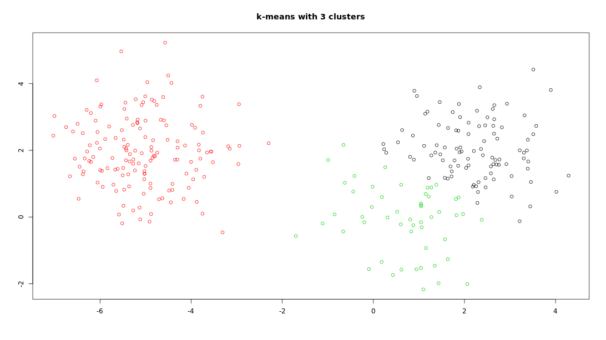
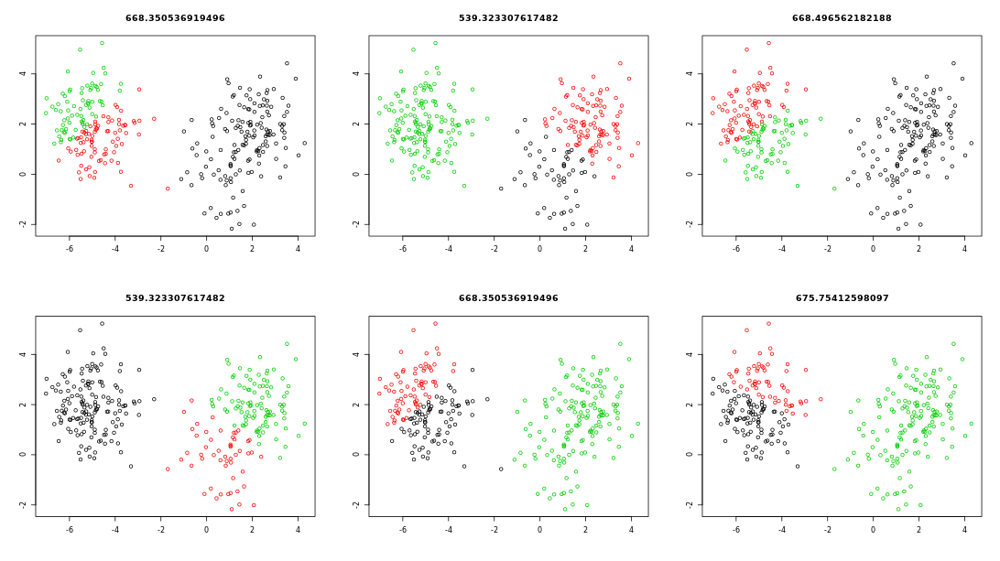
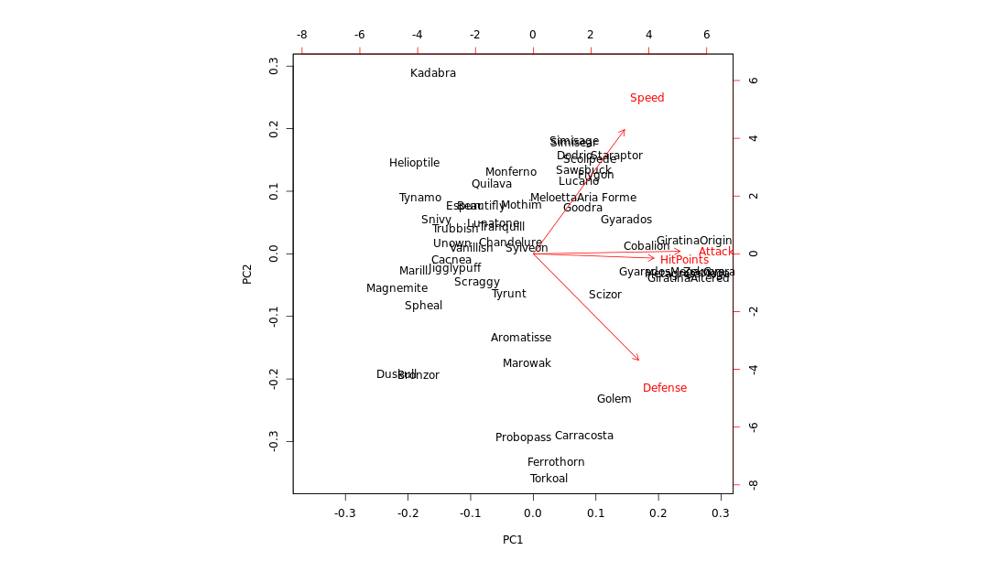

```{r setup, include=FALSE}
knitr::opts_chunk$set(echo = TRUE)
options(repos="https://CRAN.R-project.org")
```

## Welcome to the course!

**types of machine learning**

- unsupervised learning
  - finding structure in unlabeled data
  
- supervised learning
  - making predictions based on labeled data
  - predictions like regression or classification

- reinforcement learning


**Unsupervised learning - dimensionality reduction**

- finding homogeneous subgroups within larger group
  - clustering
  
- finding patterns in the features of the data
  - dimensionality reduction
  
- visualization of high dimensional data

- pre-processing before supervised learning
  
**Challenges and benefits**

- no single goal of analysis
- requires more creativity
- much more unlabeled data available than cleanly labeled data

## Introduction to k-means clustering


**k-means clustering**

We have created some two-dimensional data and stored it in a variable called `x` in your workspace. The scatter plot below is a visual representation of the data.

In this exercise, your task is to create a k-means model of the `x` data using 3 clusters, then to look at the structure of the resulting model using the [summary()](https://www.rdocumentation.org/packages/base/topics/summary) function.


```r
# Create the k-means model: km.out
km.out <- kmeans(x, centers = 3, nstart = 20)

# Inspect the result
summary(km.out)
```
```
            Length Class  Mode   
cluster      300    -none- numeric
centers        6    -none- numeric
totss          1    -none- numeric
withinss       3    -none- numeric
tot.withinss   1    -none- numeric
betweenss      1    -none- numeric
size           3    -none- numeric
iter           1    -none- numeric
ifault         1    -none- numeric
```

**Results of kmeans()**

The `kmeans()` function produces several outputs. In the video, we discussed one output of modeling, the cluster membership.

In this exercise, you will access the `cluster` component directly. This is useful anytime you need the cluster membership for each observation of the data used to build the clustering model. A future exercise will show an example of how this cluster membership might be used to help communicate the results of k-means modeling.

k-means models also have a print method to give a human friendly output of basic modeling results. This is available by using `print()` or simply typing the name of the model.

```r
# Print the cluster membership component of the model
km.out$cluster
```
```
  [1] 1 1 1 1 1 1 1 1 1 1 1 1 3 1 1 1 1 3 3 1 1 1 1 1 1 1 1 1 1 1 1 1 1 1 1 1 3
 [38] 3 3 1 1 1 1 3 1 1 1 1 1 1 1 1 1 1 1 1 1 1 3 1 1 1 1 1 1 1 1 1 1 1 1 1 1 3
 [75] 1 1 1 1 1 1 1 1 1 1 1 1 1 1 1 1 1 1 1 1 1 1 1 1 1 1 2 2 2 2 2 2 2 2 2 2 2
[112] 2 2 2 2 2 2 2 2 2 2 2 2 2 2 2 2 2 2 2 2 2 2 2 2 2 2 2 2 2 2 2 2 2 2 2 2 2
[149] 2 2 2 2 2 2 2 2 2 2 2 2 2 2 2 2 2 2 2 2 2 2 2 2 2 2 2 2 2 2 2 2 2 2 2 2 2
[186] 2 2 2 2 2 2 2 2 2 2 2 2 2 2 2 2 2 2 2 2 2 2 2 2 2 2 2 2 2 2 2 2 2 2 2 2 2
[223] 2 2 2 2 2 2 2 2 2 2 2 2 2 2 2 2 2 2 2 2 2 2 2 2 2 2 2 2 3 3 3 3 1 3 3 3 3
[260] 3 3 3 3 3 3 3 3 3 3 3 3 3 3 3 3 1 1 3 3 1 3 3 3 3 3 3 1 3 3 3 3 3 3 1 3 3
[297] 3 1 3 3
```
```r
# Print the km.out object
km.out
```
```
K-means clustering with 3 clusters of sizes 98, 150, 52

Cluster means:
        [,1]        [,2]
1  2.2171113  2.05110690
2 -5.0556758  1.96991743
3  0.6642455 -0.09132968

Clustering vector:
  [1] 1 1 1 1 1 1 1 1 1 1 1 1 3 1 1 1 1 3 3 1 1 1 1 1 1 1 1 1 1 1 1 1 1 1 1 1 3
 [38] 3 3 1 1 1 1 3 1 1 1 1 1 1 1 1 1 1 1 1 1 1 3 1 1 1 1 1 1 1 1 1 1 1 1 1 1 3
 [75] 1 1 1 1 1 1 1 1 1 1 1 1 1 1 1 1 1 1 1 1 1 1 1 1 1 1 2 2 2 2 2 2 2 2 2 2 2
[112] 2 2 2 2 2 2 2 2 2 2 2 2 2 2 2 2 2 2 2 2 2 2 2 2 2 2 2 2 2 2 2 2 2 2 2 2 2
[149] 2 2 2 2 2 2 2 2 2 2 2 2 2 2 2 2 2 2 2 2 2 2 2 2 2 2 2 2 2 2 2 2 2 2 2 2 2
[186] 2 2 2 2 2 2 2 2 2 2 2 2 2 2 2 2 2 2 2 2 2 2 2 2 2 2 2 2 2 2 2 2 2 2 2 2 2
[223] 2 2 2 2 2 2 2 2 2 2 2 2 2 2 2 2 2 2 2 2 2 2 2 2 2 2 2 2 3 3 3 3 1 3 3 3 3
[260] 3 3 3 3 3 3 3 3 3 3 3 3 3 3 3 3 1 1 3 3 1 3 3 3 3 3 3 1 3 3 3 3 3 3 1 3 3
[297] 3 1 3 3

Within cluster sum of squares by cluster:
[1] 148.64781 295.16925  95.50625
 (between_SS / total_SS =  87.2 %)

Available components:

[1] "cluster"      "centers"      "totss"        "withinss"     "tot.withinss"
[6] "betweenss"    "size"         "iter"         "ifault"   
```

Take a look at all the different components of a k-means model object as you may need to access them in later exercises. Because printing the whole model object to the console outputs many different things, you may wish to instead print a specific component of the model object using the `$` operator. Great work!

**Visualizing and interpreting results of kmeans()**

One of the more intuitive ways to interpret the results of k-means models is by plotting the data as a scatter plot and using color to label the samples' cluster membership. In this exercise, you will use the standard `plot()` function to accomplish this.

To create a scatter plot, you can pass data with two features (i.e. columns) to `plot()` with an extra argument `col = km.out$cluster`, which sets the color of each point in the scatter plot according to its cluster membership.

```r
# Scatter plot of x
plot(x, col = km.out$cluster,
     main = "k-means with 3 clusters", 
     xlab = "", ylab = "")
```



Excellent! Let's see how the `kmeans()` function works under the hood in the next video.

## How k-means works and practical matters

**Objectives**

- explain how k-means algorithm is implemented visually
- model selection: determining number of clusters


- centers are average location of all points in each respective subgroup


- points are assigned to cluster of the nearest center


- **Completion**: no observations have changed assignment

**Model Selection**

- recall k-means has a random component
- best outcome is based on total within cluster sum of squares:
  - for each cluster
    - for each observation in the cluster
      - determine squared euclidian distance from observation to cluster center
    - summ all of them together
    


**Handling random algorithms**

In the video, you saw how `kmeans()` randomly initializes the centers of clusters. This random initialization can result in assigning observations to different cluster labels. Also, the random initialization can result in finding different *local minima* for the k-means algorithm. This exercise will demonstrate both results.

At the top of each plot, the measure of model quality—total within cluster sum of squares error—will be plotted. Look for the model(s) with the lowest error to find models with the better model results.

Because `kmeans()` initializes observations to random clusters, it is important to set the random number generator seed for reproducibility.

```
# Set up 2 x 3 plotting grid
par(mfrow = c(2, 3))

# Set seed
set.seed(1)

for(i in 1:6) {
  # Run kmeans() on x with three clusters and one start
  km.out <- kmeans(x, centers = 3, nstart = 1)
  
  # Plot clusters
  plot(x, col = km.out$cluster, 
       main = km.out$tot.withinss, 
       xlab = "", ylab = "")
}
```



Interesting! Because of the random initialization of the k-means algorithm, there's quite some variation in cluster assignments among the six models.

**Selecting number of clusters**

The k-means algorithm assumes the number of clusters as part of the input. If you know the number of clusters in advance (e.g. due to certain business constraints) this makes setting the number of clusters easy. However, as you saw in the video, if you do not know the number of clusters and need to determine it, you will need to run the algorithm multiple times, each time with a different number of clusters. From this, you can observe how a measure of model quality changes with the number of clusters.

In this exercise, you will run `kmeans()` multiple times to see how model quality changes as the number of clusters changes. Plots displaying this information help to determine the number of clusters and are often referred to as scree plots.

The ideal plot will have an *elbow* where the quality measure improves more slowly as the number of clusters increases. This indicates that the quality of the model is no longer improving substantially as the model complexity (i.e. number of clusters) increases. In other words, the elbow indicates the number of clusters inherent in the data.

```
# Initialize total within sum of squares error: wss
wss <- 0

# For 1 to 15 cluster centers
for (i in 1:15) {
  km.out <- kmeans(x, centers = i, nstart = 20)
  # Save total within sum of squares to wss variable
  wss[i] <- km.out$tot.withinss
}

# Plot total within sum of squares vs. number of clusters
plot(1:15, wss, type = "b", 
     xlab = "Number of Clusters", 
     ylab = "Within groups sum of squares")
```

```
# Set k equal to the number of clusters corresponding to the elbow location
k <- 2  # 3 is probably OK, too
```

Looking at the scree plot, it looks like there are inherently 2 or 3 clusters in the data. Awesome job!

## Introduction to the Pokemon data


**Data challenges**

- selecting the variables to cluster upon
- scaling the data (will handle in last chapter)
- determining the number of clusters
  - often no clean "elbow" in scree plot
  - this will be a core part of the exercises
- visualize the results for interpretation

**Practical matters: working with real data**

Dealing with real data is often more challenging than dealing with synthetic data. Synthetic data helps with learning new concepts and techniques, but the next few exercises will deal with data that is closer to the type of real data you might find in your professional or academic pursuits.

The first challenge with the Pokemon data is that there is no pre-determined number of clusters. You will determine the appropriate number of clusters, keeping in mind that in real data the *elbow* in the scree plot might be less of a sharp elbow than in synthetic data. Use your judgement on making the determination of the number of clusters.

The second part of this exercise includes plotting the outcomes of the clustering on two dimensions, or features, of the data. These features were chosen somewhat arbitrarily for this exercise. Think about how you would use plotting and clustering to communicate interesting groups of Pokemon to other people.

An additional note: this exercise utilizes the `iter.max` argument to `kmeans()`. As you've seen, `kmeans()` is an iterative algorithm, repeating over and over until some stopping criterion is reached. The default number of iterations for `kmeans()` is 10, which is not enough for the algorithm to converge and reach its stopping criterion, so we'll set the number of iterations to 50 to overcome this issue. To see what happens when `kmeans()` does not converge, try running the example with a lower number of iterations (e.g. 3). This is another example of what might happen when you encounter real data and use real cases.

```{r}
library(tidyverse)
pokemon <- read.csv("_data/Pokemon.csv")
pokemon <- pokemon %>% select(HitPoints, Attack, Defense, SpecialAttack, SpecialDefense, Speed) %>% as.matrix()

# Initialize total within sum of squares error: wss
wss <- 0

# Look over 1 to 15 possible clusters
for (i in 1:15) {
  # Fit the model: km.out
  km.out <- kmeans(pokemon, centers = i, nstart = 20, iter.max = 50)
  # Save the within cluster sum of squares
  wss[i] <- km.out$tot.withinss
}

# Produce a scree plot
plot(1:15, wss, type = "b", 
     xlab = "Number of Clusters", 
     ylab = "Within groups sum of squares")

# Select number of clusters (2, 3, 4 probably OK)
k <- 3

# Build model with k clusters: km.out
km.out <- kmeans(pokemon, centers = k, nstart = 20, iter.max = 50)

# View the resulting model
km.out

# Plot of Defense vs. Speed by cluster membership
plot(pokemon[, c("Defense", "Speed")],
     col = km.out$cluster,
     main = paste("k-means clustering of Pokemon with", k, "clusters"),
     xlab = "Defense", ylab = "Speed")
```

Nice job! You're really getting the hang of k-means clustering quickly!

## Review of k-means clustering

**Chapter review**

- unsupervised vs. supervised learning
- how to create k-means cluster model in R
- how k-means algorithm works
- model selection
- application to "real" (and hopefully fun) dataset


**Hierarchical clustering**

- number of clusters is not known ahead of time
- two kinds: bottom-up and top-down, this course bottom-up


**Hierarchical clustering with results**

In this exercise, you will create your first hierarchical clustering model using the [hclust()](https://www.rdocumentation.org/packages/stats/topics/hclust) function.

We have created some data that has two dimensions and placed it in a variable called `x`. Your task is to create a hierarchical clustering model of `x`. Remember from the video that the first step to hierarchical clustering is determining the similarity between observations, which you will do with the [dist()](https://www.rdocumentation.org/packages/stats/topics/dist) function.

You will look at the structure of the resulting model using the `summary()` function.

```
# Create hierarchical clustering model: hclust.out
hclust.out <- hclust(dist(x))

# Inspect the result
summary(hclust.out)
```
```
summary(hclust.out)
            Length Class  Mode     
merge       98     -none- numeric  
height      49     -none- numeric  
order       50     -none- numeric  
labels       0     -none- NULL     
method       1     -none- character
call         2     -none- call     
dist.method  1     -none- character
```

Awesome! Now that you've made your first hierarchical clustering model, let's learn how to use it to solve problems.

## Selecting number of clusters


**Cutting the tree**

Remember from the video that [cutree()](https://www.rdocumentation.org/packages/stats/topics/cutree) is the R function that cuts a hierarchical model. The `h` and `k` arguments to `cutree()` allow you to cut the tree based on a certain height `h` or a certain number of clusters `k`.

In this exercise, you will use `cutree()` to cut the hierarchical model you created earlier based on each of these two criteria.

```r
# Cut by height
cutree(hclust.out, h = 7)
```
```
[1] 1 1 1 1 1 1 1 1 2 1 1 1 1 1 1 1 1 1 1 1 1 1 1 1 1 3 3 3 3 3 3 3 3 3 3 2 2 2
[39] 2 2 2 2 2 2 2 2 2 2 2 2
```
```r
# Cut by number of clusters
cutree(hclust.out, k = 3)
```
```
[1] 1 1 1 1 1 1 1 1 2 1 1 1 1 1 1 1 1 1 1 1 1 1 1 1 1 3 3 3 3 3 3 3 3 3 3 2 2 2
[39] 2 2 2 2 2 2 2 2 2 2 2 2
```

If you're wondering what the output means, remember, there are 50 observations in the original dataset x. The output of each `cutree()` call represents the cluster assignments for each observation in the original dataset. Great work!

## Clustering linkage and practical matters

**Linking clusters in hierarchical clustering**

- how is distance between clusters determined? Rules?

- Four methods to determine which cluster should be linked
  - *Complete*: pairwise similarity between all observations in cluster 1 and cluster 2, and uses **largest of similarities**
  - *Single*: same as above but uses **smallest of similarities**
  - *Average*: same as above but uses **average of similarities**
  - *Centroid*: finds centroid of cluster 1 and centroid of cluster 2, and uses **similarity between two centroids**


**Practical matters**

- Data on different scales can cause undesirable results in clustering methods
- Solution is to scale data so that features have same mean and standard deviation
  - subtract mean of a feature from all observations
  - divide each feature by the standard deviation of the feature
  - normalized features have a mean of zero and a standard deviation of one
  


**Linkage methods**

In this exercise, you will produce hierarchical clustering models using different linkages and plot the dendrogram for each, observing the overall structure of the trees.

You'll be asked to interpret the results in the next exercise.

```
# Cluster using complete linkage: hclust.complete
hclust.complete <- hclust(dist(x), method = "complete")

# Cluster using average linkage: hclust.average
hclust.average <- hclust(dist(x), method = "average")

# Cluster using single linkage: hclust.single
hclust.single <- hclust(dist(x), method = "single")

# Plot dendrogram of hclust.complete
plot(hclust.complete, main = "Complete")
```

```
# Plot dendrogram of hclust.average
plot(hclust.average, main = "Average")
```

```
# Plot dendrogram of hclust.single
plot(hclust.single, main = "Single")
```


Before moving on, make sure to toggle through the plots to compare and contrast the three dendrograms you created. You'll learn about the implications of these differences in the next exercise. Excellent work!

Whether you want balanced or unbalanced trees for your hierarchical clustering model depends on the context of the problem you're trying to solve. Balanced trees are essential if you want an even number of observations assigned to each cluster. On the other hand, if you want to detect outliers, for example, an unbalanced tree is more desirable because pruning an unbalanced tree can result in most observations assigned to one cluster and only a few observations assigned to other clusters.

**Practical matters: scaling**

Recall from the video that clustering real data may require *scaling* the features if they have different distributions. So far in this chapter, you have been working with synthetic data that did not need scaling.

In this exercise, you will go back to working with "real" data, the `pokemon` dataset introduced in the first chapter. You will observe the distribution (mean and standard deviation) of each feature, scale the data accordingly, then produce a hierarchical clustering model using the complete linkage method.

```{r}
# View column means
colMeans(pokemon)

# View column standard deviations
apply(pokemon, 2, sd)

# Scale the data
pokemon.scaled <- scale(pokemon)

# Create hierarchical clustering model: hclust.pokemon
hclust.pokemon <- hclust(dist(pokemon.scaled), method = "complete")
```

Let's quickly recap what you just did. You first checked to see if the column means and standard deviations vary. Because they do, you scaled the data, converted the scaled data to a similarity matrix and passed it into the `hclust()` function. Great work!

**Comparing kmeans() and hclust()**

Comparing k-means and hierarchical clustering, you'll see the two methods produce different cluster memberships. This is because the two algorithms make different assumptions about how the data is generated. In a more advanced course, we could choose to use one model over another based on the quality of the models' assumptions, but for now, it's enough to observe that they are different.

This exercise will have you compare results from the two models on the `pokemon` dataset to see how they differ.

```{r}
# Apply cutree() to hclust.pokemon: cut.pokemon
cut.pokemon <- cutree(hclust.pokemon, k = 3)

# Compare methods
table(km.out$cluster, cut.pokemon)
```

Looking at the table, it looks like the hierarchical clustering model assigns most of the observations to cluster 1, while the k-means algorithm distributes the observations relatively evenly among all clusters. It's important to note that there's no consensus on which method produces better clusters. The job of the analyst in unsupervised clustering is to observe the cluster assignments and make a judgment call as to which method provides more insights into the data. Excellent job!

## Introduction to PCA

**Two methods of clustering**

- finding groups of homogenous items
- dimensionality reduction
  - find structure in features
  - aid in visualization
  
**dimensionality reduction**

- a popular method is principal component analysis (PCA)
- three goals when finding lower dimensional representation of features:
  - find linear combination of variables to create principal components
  - maintain most variance in the data
  - principal components are uncorrelated (i.e. orthogonal to each other)
  


**PCA using prcomp()**

In this exercise, you will create your first PCA model and observe the diagnostic results.

We have loaded the Pokemon data from earlier, which has four dimensions, and placed it in a variable called `pokemon`. Your task is to create a PCA model of the data, then to inspect the resulting model using the `summary()` function.

```{r}
pokemon <- read.csv("_data/Pokemon.csv", row.names = "Name")
(pokemon <- pokemon %>% select(HitPoints, Attack, Defense, Speed) %>% slice(1:50) %>% as.matrix())

# Perform scaled PCA: pr.out
pr.out <- prcomp(pokemon, scale = TRUE)

# Inspect model output
summary(pr.out)
```

The first two principal components describe around 82% of the variance.

**Additional results of PCA**

PCA models in R produce additional diagnostic and output components:

- `center`: the column means used to center to the data, or `FALSE` if the data weren't centered
- `scale`: the column standard deviations used to scale the data, or `FALSE` if the data weren't scaled
- `rotation`: the directions of the principal component vectors in terms of the original features/variables. This information allows you to define new data in terms of the original principal components
- `x`: the value of each observation in the original dataset projected to the principal components

You can access these the same as other model components. For example, use `pr.out$rotation` to access the `rotation` component.

Calling `dim()` on `pr.out$rotation` and `pokemon`, you can see they have different dimensions.

## Visualizing and interpreting PCA results


**Interpreting biplots (1)**

As stated in the video, the [biplot()](https://www.rdocumentation.org/packages/stats/topics/biplot) function plots both the principal components loadings and the mapping of the observations to their first two principal component values. The next couple of exercises will check your interpretation of the `biplot()` visualization.

**Question**: Using the `biplot()` of the `pr.out` model, which two original variables have approximately the same loadings in the first two principal components?



**Answer**: `Attack` and `HitPoints`

**Interpreting biplots (2)**

In the last exercise, you saw that `Attack` and `HitPoints` have approximately the same loadings in the first two principal components.

**Question**: Again using the `biplot()` of the `pr.out` model, which two Pokemon are the least similar in terms of the second principal component?

**Answer**: Kadabra and Torkoal

**Variance explained**

The second common plot type for understanding PCA models is a *scree plot*. A scree plot shows the variance explained as the number of principal components increases. Sometimes the cumulative variance explained is plotted as well.

In this and the next exercise, you will prepare data from the `pr.out` model you created at the beginning of the chapter for use in a scree plot. Preparing the data for plotting is required because there is not a built-in function in R to create this type of plot.

```{r}
# Variability of each principal component: pr.var
pr.var <- pr.out$sdev^2

# Variance explained by each principal component: pve
pve <- pr.var / sum(pr.var)
```

**Visualize variance explained**

Now you will create a scree plot showing the proportion of variance explained by each principal component, as well as the cumulative proportion of variance explained.

Recall from the video that these plots can help to determine the number of principal components to retain. One way to determine the number of principal components to retain is by looking for an elbow in the scree plot showing that as the number of principal components increases, the rate at which variance is explained decreases substantially. In the absence of a clear elbow, you can use the scree plot as a guide for setting a threshold.

```{r}
# Plot variance explained for each principal component
plot(pve, xlab = "Principal Component",
     ylab = "Proportion of Variance Explained",
     ylim = c(0, 1), type = "b")

# Plot cumulative proportion of variance explained
plot(cumsum(pve), xlab = "Principal Component",
     ylab = "Cumulative Proportion of Variance Explained",
     ylim = c(0, 1), type = "b")
```

Awesome! Notice that when the number of principal components is equal to the number of original features in the data, the cumulative proportion of variance explained is 1.

## Practical issues with PCA

- Scaling the data
- Missing values:
  - drop observations with missing values
  - impute / estimate missing values
- Categorical data:
  - do not use categorical data features
  - encode categorical features as numbers
  


**Practical issues: scaling**

You saw in the video that scaling your data before doing PCA changes the results of the PCA modeling. Here, you will perform PCA with and without scaling, then visualize the results using biplots.

Sometimes scaling is appropriate when the variances of the variables are substantially different. This is commonly the case when variables have different units of measurement, for example, degrees Fahrenheit (temperature) and miles (distance). Making the decision to use scaling is an important step in performing a principal component analysis.

```{r}
# Mean of each variable
colMeans(pokemon)

# Standard deviation of each variable
apply(pokemon, 2, sd)

# PCA model with scaling: pr.with.scaling
pr.with.scaling <- prcomp(pokemon, scale = TRUE)

# PCA model without scaling: pr.without.scaling
pr.without.scaling <- prcomp(pokemon, scale = FALSE)

# Create biplots of both for comparison
biplot(pr.with.scaling)
biplot(pr.without.scaling)
```

Good job! The new Total column contains much more variation, on average, than the other four columns, so it has a disproportionate effect on the PCA model when scaling is not performed. After scaling the data, there's a much more even distribution of the loading vectors.

## Introduction to the case study

**Objectives**

- complete analysis using unsupervised learning
- reinforce what you've already learned
- add steps not covered before (e.g. preparing data, selecting good features for supervised learning)
- emphasize creativity


**Analysis**

- download data and prepare data for modeling
- exploratory data analysis (# observations, # features, etc.)
- perform PCA and interpret results
- complete two types of clustering
- understand and compare the two types
- combine PCA and clustering

**Unsupervised learning is open-ended**

- steps in this use case are only one example of what can be done
- there are other approaches to analyzing this dataset

```{r}
url <- "http://s3.amazonaws.com/assets.datacamp.com/production/course_1903/datasets/WisconsinCancer.csv"

# Download the data: wisc.df
wisc.df <- read.csv(url)

# Convert the features of the data: wisc.data
wisc.data <- as.matrix(wisc.df[3:32])

# Set the row names of wisc.data
row.names(wisc.data) <- wisc.df$id

# Create diagnosis vector
diagnosis <- as.numeric(wisc.df$diagnosis == "M")

str(wisc.data)
head(wisc.data)
head(diagnosis)
```

Great work! You've successfully prepared the data for exploratory data analysis.

**Performing PCA**

The next step in your analysis is to perform PCA on `wisc.data`.

You saw in the last chapter that it's important to check if the data need to be scaled before performing PCA. Recall two common reasons for scaling data:

1. The input variables use different units of measurement.
2. The input variables have *significantly different* variances.

```{r}
# Check column means and standard deviations
colMeans(wisc.data)
apply(wisc.data, 2, sd)

# Execute PCA, scaling if appropriate: wisc.pr
wisc.pr <- prcomp(wisc.data, scale = TRUE)

# Look at summary of results
summary(wisc.pr)
```

**Interpreting PCA results**

Now you'll use some visualizations to better understand your PCA model. You were introduced to one of these visualizations, the biplot, in an earlier chapter.

You'll run into some common challenges with using biplots on real-world data containing a non-trivial number of observations and variables, then you'll look at some alternative visualizations. You are encouraged to experiment with additional visualizations before moving on to the next exercise.

```{r}
# Create a biplot of wisc.pr
biplot(wisc.pr)

# Scatter plot observations by components 1 and 2
plot(wisc.pr$x[, c(1, 2)], col = (diagnosis + 1), 
     xlab = "PC1", ylab = "PC2")

# Repeat for components 1 and 3
plot(wisc.pr$x[, c(1, 3)], col = (diagnosis + 1), 
     xlab = "PC1", ylab = "PC3")

# Do additional data exploration of your choosing below (optional)

```

Excellent work! Because principal component 2 explains more variance in the original data than principal component 3, you can see that the first plot has a cleaner cut separating the two subgroups.

**Variance explained**

In this exercise, you will produce scree plots showing the proportion of variance explained as the number of principal components increases. The data from PCA must be prepared for these plots, as there is not a built-in function in R to create them directly from the PCA model.

As you look at these plots, ask yourself if there's an elbow in the amount of variance explained that might lead you to pick a natural number of principal components. If an obvious elbow does not exist, as is typical in real-world datasets, consider how else you might determine the number of principal components to retain based on the scree plot.

```{r}
# Set up 1 x 2 plotting grid
par(mfrow = c(1, 2))

# Calculate variability of each component
pr.var <- wisc.pr$sdev^2

# Variance explained by each principal component: pve
pve <- pr.var / sum(pr.var)

# Plot variance explained for each principal component
plot(pve, xlab = "Principal Component", 
     ylab = "Proportion of Variance Explained", 
     ylim = c(0, 1), type = "b")

# Plot cumulative proportion of variance explained
plot(cumsum(pve), xlab = "Principal Component", 
     ylab = "Cumulative Proportion of Variance Explained", 
     ylim = c(0, 1), type = "b")
```

Great work! Before moving on, answer the following question: What is the minimum number of principal components needed to explain 80% of the variance in the data? Write it down as you may need this in the next exercise :)

## PCA review and next steps

**Review thus far**

- downloaded data and prepared it for modeling
- exploratory data analysis
- performed principal component analysis

**Next steps**

- complete hierarchical clustering
- complete k-means clustering
- combine PCA and clustering
- contrast results of hierarchical clustering with diagnosis
- compare hierarchical and k-means clustering results
- PCA as a pre-processing step for clustering

**Hierarchical clustering of case data**

The goal of this exercise is to do hierarchical clustering of the observations. Recall from Chapter 2 that this type of clustering does not assume in advance the number of natural groups that exist in the data.

As part of the preparation for hierarchical clustering, distance between all pairs of observations are computed. Furthermore, there are different ways to *link* clusters together, with *single*, *complete*, and *average* being the most common linkage methods.

```{r}
# Scale the wisc.data data: data.scaled
data.scaled <- scale(wisc.data)

# Calculate the (Euclidean) distances: data.dist
data.dist <- dist(data.scaled)

# Create a hierarchical clustering model: wisc.hclust
wisc.hclust <- hclust(data.dist, method = "complete")

plot(wisc.hclust)
```

Nice! Let's continue to the next exercise.

**Selecting number of clusters**

In this exercise, you will compare the outputs from your hierarchical clustering model to the actual diagnoses. Normally when performing *unsupervised* learning like this, a target variable isn't available. We do have it with this dataset, however, so it can be used to check the performance of the clustering model.

When performing *supervised* learning—that is, when you're trying to predict some target variable of interest and that target variable is available in the original data—using clustering to create new features may or may not improve the performance of the final model. This exercise will help you determine if, in this case, hierarchical clustering provides a promising new feature.

```{r}
# Cut tree so that it has 4 clusters: wisc.hclust.clusters
wisc.hclust.clusters <- cutree(wisc.hclust, k = 4)

# Compare cluster membership to actual diagnoses
table(wisc.hclust.clusters, diagnosis)
```

Four clusters were picked after some exploration. Before moving on, you may want to explore how different numbers of clusters affect the ability of the hierarchical clustering to separate the different diagnoses. Great job!

**k-means clustering and comparing results**

As you now know, there are two main types of clustering: hierarchical and k-means.

In this exercise, you will create a k-means clustering model on the Wisconsin breast cancer data and compare the results to the actual diagnoses and the results of your hierarchical clustering model. Take some time to see how each clustering model performs in terms of separating the two diagnoses and how the clustering models compare to each other.

```{r}
# Create a k-means model on wisc.data: wisc.km
wisc.km <- kmeans(scale(wisc.data), centers = 2, nstart = 20)

# Compare k-means to actual diagnoses
table(wisc.km$cluster, diagnosis)

# Compare k-means to hierarchical clustering
table(wisc.hclust.clusters, wisc.km$cluster)
```

Nice! Looking at the second table you generated, it looks like clusters 1, 2, and 4 from the hierarchical clustering model can be interpreted as the cluster 1 equivalent from the k-means algorithm, and cluster 3 can be interpreted as the cluster 2 equivalent.

**Clustering on PCA results**

In this final exercise, you will put together several steps you used earlier and, in doing so, you will experience some of the creativity that is typical in unsupervised learning.

Recall from earlier exercises that the PCA model required significantly fewer features to describe 80% and 95% of the variability of the data. In addition to *normalizing* data and potentially avoiding overfitting, PCA also uncorrelates the variables, sometimes improving the performance of other modeling techniques.

Let's see if PCA improves or degrades the performance of hierarchical clustering.

```{r}
# Create a hierarchical clustering model: wisc.pr.hclust
wisc.pr.hclust <- hclust(dist(wisc.pr$x[, 1:7]), method = "complete")

# Cut model into 4 clusters: wisc.pr.hclust.clusters
wisc.pr.hclust.clusters <- cutree(wisc.pr.hclust, k = 4)

# Compare to actual diagnoses
table(diagnosis, wisc.pr.hclust.clusters)

# Compare to k-means and hierarchical
table(diagnosis, wisc.hclust.clusters)
table(diagnosis, wisc.km$cluster)
```

## Wrap-up and review

**Case study wrap-up**

- entire data analysis process using unsupervised learning
- creative approach to modeling
- prepared to tackle real world problems


