```{r setup, include=FALSE}
knitr::opts_chunk$set(echo = TRUE)
```

**Refresher on xts and the plot() function**

- a special class of object to handle time series
- eXtensible Time Series
- xts = Time Index + Matrix
- the index is a time object: `Date`, `POSIX Time`, `TimeDate`. `chron`

**plot() and plot.xts()**

- `plot()`
- `plot.xts()` <- can be abbreviated to `plot()` if object is a time series.

**plot() function - basic parameters**

The `plot.xts()` function is the most useful tool in the R time series data visualization artillery. It is fairly similar to general plotting, but its x-axis contains a time scale. You can use `plot()` instead of `plot.xts()` if the object used in the function is an `xts` object.

Let's look at a few examples:

```
> # Basic syntax
> plot(mydata)

> # Add title and double thickness of line
> plot(mydata, main = "Stock XYZ", lwd = 2)

> # Add labels for X and Y axes
> plot(mydata, xlab = "X axis", ylab = "Y axis")
```

As you can see, there are a wide variety of parameters for the function allowing endless possibilities. Note that each call of `plot()` creates an entirely new plot only using the parameters that are defined in that particular call.

Furthermore, to display the first few rows of a dataset `mydata` to your console, use `head(mydata)`. To display only the names of the columns, use `colnames(mydata)`. You can also select a particular column of a dataset by specifying its title after a dollar sign, like in `mydata$mycolumn`.

In this exercise, you will use the same dataset `data` containing the daily stocks price for four major companies since 2015.

```
# Display the first few lines of the data
head(data)
```
```
           yahoo microsoft citigroup dow_chemical
2015-01-02 50.17  44.30501  53.45259     42.48209
2015-01-05 49.13  43.89759  51.76803     41.16821
2015-01-06 49.21  43.25329  49.94556     40.50662
2015-01-07 48.59  43.80284  50.40857     40.44139
2015-01-08 50.23  45.09144  51.16711     41.44776
2015-01-09 49.72  44.71244  50.02437     41.38253
```
```
# Display the column names of the data
colnames(data)
```
```
[1] "yahoo"        "microsoft"    "citigroup"    "dow_chemical"
```
```
# Plot yahoo data and add title
plot(data$yahoo, main = "yahoo")
```

```
# Replot yahoo data with labels for X and Y axes
plot(data$yahoo, main = "yahoo", xlab = "date", ylab = "price")
```

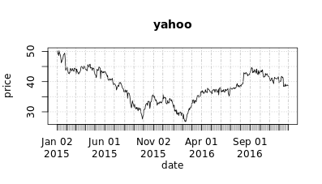

You've got basic plotting down already.

**plot() function - basic parameters (2)**

You can add even more customization with the `plot()` function using other options. As you saw in the video, the `lines()` function is especially helpful when you want to modify an existing plot.

Let's look at another example:

```
> # Use bars instead of points and add subtitle
> plot(mydata, type = "h", sub = "Subtitle")

> # Triple thickness of line and change color to red
> lines(mydata, col = "red", lwd = 3)
```

In this exercise, you will try some of this customization for yourself. The same dataset, `data`, is available in your workspace. (If you can't remember the names of the columns, run `colnames(data)` in your console.)

```
# Plot the second time series and change title
plot(data$microsoft, main = "microsoft")
```

```
# Replot with same title, add subtitle, use bars
plot(data$microsoft, main = "microsoft", sub = "Daily closing price since 2015", type = "h")
```
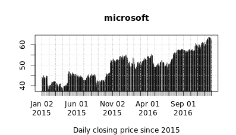
```
# Change line color to red
lines(data$microsoft, col = "red")
```
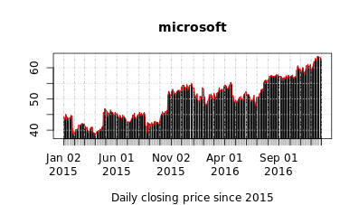


The amount of customization with plots in R is endless!

**Control graphic parameters**

In R, it is also possible to tailor the window layout using the `par()` function.

To set up a graphical window for multiple charts with `nr` rows and `nc` columns, assign the vector `c(nr, nc)` to the option `mfrow`. To adjust the size of the margins and characters in the text, set the appropriate decimal value to to the options `mex` and `cex`, respectively. Like `plot()`, each call to `par()` only implements the parameters in that particular call.

Look at this example:

```
> # Create 3x1 graphical window
> par(mfrow = c(3, 1))

> # Also reduce margin and character sizes by half
> par(mfrow = c(2, 1), mex = 0.5, cex = 0.5)
```

After this, you would make two consecutive calls to `plot()` to add the series in the order that you want them to appear.

It's time to practice! The dataset `data` is loaded in your workspace.

```
# Plot two charts on same graphical window
par(mfrow = c(2,1))
plot(data$yahoo, main = "yahoo")
plot(data$microsoft, main = "microsoft")
```

```
# Replot with reduced margin and character sizes
par(mfrow = c(2,1), mex = 0.6, cex = 0.8)
plot(data$yahoo, main = "yahoo")
plot(data$microsoft, main = "microsoft")
```
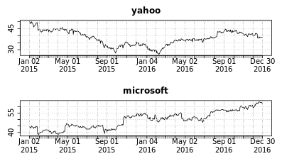

The plots on the second graphical window look much better.

**Other useful visualizing functions**

**Adding an extra series to an existing chart**

A great way to visually compare two times series is to display them on the same chart with different scales.

Suppose you already have a plot of `mydata`. As you saw in the video, you can use `lines(mydata2)` to add a new time series `mydata2` to this existing plot. If you want a scale for this time series on the right side of the plot with equally spaced tick marks, use `axis(side, at)`, where` side` is an integer specifying which side of the plot the axis should be drawn on, and `at` is set equal to `pretty(mydata2)`.

Finally, to distinguish these two time series, you can add a legend with the `legend()` function. Let's examine the one used in the video:

```
> # x specifies location of legend in plot
> legend(x = "bottomright",
         # legend specifies text label(s)
         legend = c("Stock X", "Stock Y"),
         # col specifies color(s)
         col = c("black", "red"),
         # lty specifies line type(s)
         lty = c(1, 1))
```

Since there are two time series in the plot, some options in `legend()` are set to a vector of length two.

In this exercise, you will create a plot and legend for two time series. The same dataset `data` is provided for you.

```
# Plot the "microsoft" series
plot(data$microsoft, main = "Stock prices since 2015")
```
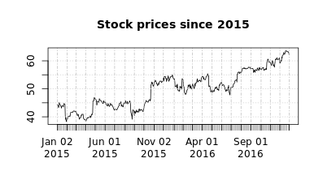
```
# Add the "dow_chemical" series in red
lines(data$dow_chemical, col = "red")
```

```
# Add a Y axis on the right side of the chart
axis(side = 4, at = pretty(data$dow_chemical))
```
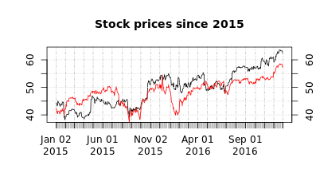
```
# Add a legend in the bottom right corner
legend(x = "bottomright", 
       legend = c("microsoft", "dow_chemical"), 
       col = c("black", "red"),
       lty = c(1, 1))
```

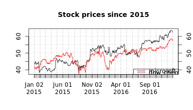

The red and black lines in the plot are easy to distinguish.

**Highlighting events in a time series**

You have also learned that it is possible to use the function `abline()` to add straight lines through an existing plot. Specifically, you can draw a horizontal line to identify a particular date by setting `h` to a specific Y value, and a vertical line to identify a particular level by setting `v` to a specific X value:

```
> abline(h = NULL, v = NULL, ...)
```

Recall that the index of an `xts` object are date objects, so the X values of a plot will also contain dates. In this exercise, you will use indexing as well as `as.Date("YYYY-MM-DD")` and `mean()` to visually compare the average of the Citigroup stock market prices to its price on January 4, 2016, after it was affected by turbulence in the Chinese stock market.

You are provided with the same dataset `data` as before. Let's give it a try.

**Note:** this code requires `xts` version `0.9-7` to work. You can use `remotes::install_version()` to install particular versions of packages.

```
# Plot the "citigroup" time series
plot(data$citigroup, main = "Citigroup")
```
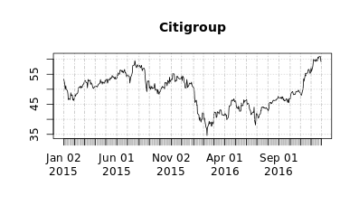
```
# Create vert_line to identify January 4th, 2016 in citigroup
vert_line <- which(index(data$citigroup) == as.Date("2016-01-04"))

# Add a red vertical line using vert_line
abline(v = .index(data$citigroup)[vert_line], col = "red")
```
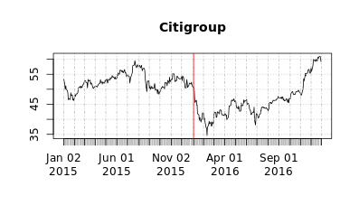
```
# Create hori_line to identify the average price of citigroup
hori_line <- mean(data$citigroup)

# Add a blue horizontal line using hori_line
abline(h = hori_line, col = "blue")
```


Adding lines allows you to identify interesting points in your time series.

**Highlighting a specific period in a time series**

To highlight a specific period in a time series, you can display it in the plot in a different background color. The [chart.TimeSeries()](https://www.rdocumentation.org/packages/PerformanceAnalytics/versions/1.4.3541/topics/chart.TimeSeries) function in the [PerformanceAnalytics](https://www.rdocumentation.org/packages/PerformanceAnalytics/versions/1.1.0?) package offers a very easy and flexible way of doing this.

Let's examine some of the arguments of this function:

```
chart.TimeSeries(R, period.areas, period.color)
```

`R` is an `xts`, time series, or `zoo` object of asset returns, `period.areas` are shaded areas specified by a start and end date in a vector of `xts` date ranges like `c("1926-10/1927-11")`, and `period.color` draws the shaded region in whichever color is specified.

In this exercise, you will highlight a single period in a chart of the Citigroup time series in `data`.

```
# Create period to hold the 3 months of 2015
period <- c("2015-01/2015-03")

# Highlight the first three months of 2015 
chart.TimeSeries(data$citigroup, period.areas = period)
```
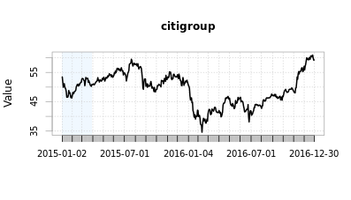
```
# Highlight the first three months of 2015 in light grey
chart.TimeSeries(data$citigroup, period.areas = period, period.color = "lightgrey")                   
```

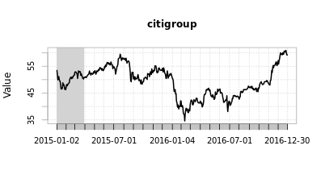

Sometimes other packages make complicated base R tasks incredibly simple.

**A fancy stock chart**

It's time to bring together what you have learned so far to create a chart that could go onto a publication.

In this exercise, you will plot Microsoft and Citigroup stock prices on the same chart. You are provided with the same dataset, `data`, as before.

```
# Plot the microsoft series
plot(data$microsoft, main = "Dividend date and amount")
```
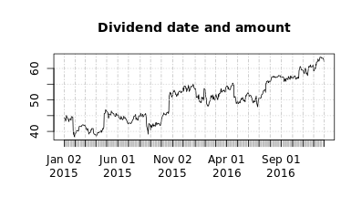
```
# Add the citigroup series
lines(data$citigroup, col = "orange", lwd = 2)
```

```
# Add a new y axis for the citigroup series
axis(side = 4, at = pretty(data$citigroup), col = "orange")
```


Great work.

**A fancy stock chart (2)**

In this exercise, you will add a legend to the chart that you just created containing the name of the companies and the dates and values of the latest dividends.

Fill in the pre-written code with the following variables containing the dividend values and dates for both companies:

- `citi_div_value`
- `citi_div_date`
- `micro_div_value`
- `micro_div_date`

Recall that the default color of a plotted line is black, and that the values for `legend`, `col`, and `lty` in `legend()` should be set to vectors of the same length as the number of time series plotted in your chart.

If you can't see all of the legend, try making the chart full screen after you plot it. Let's make our chart even fancier!

```
# Same plot as the previous exercise
plot(data$microsoft, main = "Dividend date and amount")
lines(data$citigroup, col = "orange", lwd = 2)
axis(side = 4, at = pretty(data$citigroup), col = "orange")
```
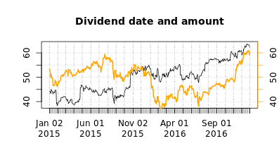
```
# Create the two legend strings
micro <- paste0("Microsoft div. of ", micro_div_value," on ", micro_div_date)
citi <- paste0("Citigroup div. of ", citi_div_value," on ", citi_div_date)

# Create the legend in the bottom right corner
legend(x = "bottomright", legend = c(micro, citi), col = c("black", "orange"), lty = c(1, 1))
```

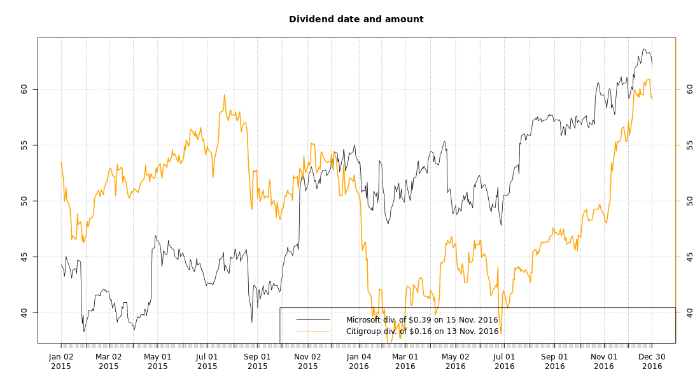

Looking good!

**Univariate time series analysis**

- Location
- Dispersion
- Distribution

**Transformations**

- In their standard form, most time series do not exhibit the right statistical properties

**Representing a univariate time series**

The very first step in the analysis of any time series is to address if the time series have the right mathematical properties to apply the standard statistical framework. If not, you must transform the time series first.

In finance, price series are often transformed to **differenced data**, making it a return series. In R, the [ROC()](https://www.rdocumentation.org/packages/TTR/versions/0.23-1/topics/ROC) (which stands for "Rate of Change") function from the [TTR](https://www.rdocumentation.org/packages/TTR/versions/0.23-1) package does this automatically to a price or volume series `x`:

```
ROC(x)
```

In this exercise, you will compare plots of the Apple daily prices and Apple daily returns using the stock data contained in `data`, which is available in your workspace.

```
# Plot Apple's stock price 
plot(data, main = "Apple stock price")
```
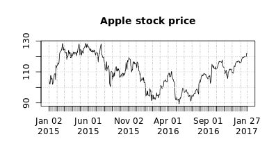
```
# Create a time series called rtn
rtn <- ROC(data)

# Plot Apple daily price and daily returns 
par(mfrow = c(1, 2))
plot(data)
plot(rtn)
```


Great job!

**Other visualization tools**

**Histograms**

**Box and Whisker**

**Autocorrelation**

**QQ-plot**

**Histogram of returns**

A simple chart of returns does not reveal much about the time series properties; often, data must be displayed in a different format to visualize interesting features.

The density function, represented by the **histogram** of returns, indicates the most common returns in a time series without taking time into account. In R, these are calculated with the [hist()](https://www.rdocumentation.org/packages/graphics/versions/3.3.3/topics/hist) and [density()](https://www.rdocumentation.org/packages/stats/versions/3.3.3/topics/density) functions.

In the video, you saw how to create a histogram with 20 buckets, a title, and no Y axis label:

```
> hist(amazon_stocks,
       breaks = 20,
       main = "AMAZON return distribution",
       xlab = "")
```

Recall that you can use the `lines()` function to add a new time series, even with different line properties like color and thickness, to an existing plot.

In this exercise, you will create a histogram of the Apple daily returns data for the last two years contained in `rtn`.

```
# Create a histogram of Apple stock returns
hist(rtn, main = "Apple stock return distribution", probability = TRUE)
```

```
# Add a density line
lines(density(rtn))
```

```
# Redraw a thicker, red density line
lines(density(rtn), col = "red", lwd = 2)
```


It looks like Apple might have some extreme returns!

**Box and whisker plot**

A **box and whisker plot** gives information regarding the shape, variability, and center (or median) of a data set. It is particularly useful for displaying skewed data.

By comparing the data set to a standard normal distribution, you can identify departure from normality (asymmetry, skewness, etc). The lines extending parallel from the boxes are known as **whiskers**, which are used to indicate variability outside the upper and lower quartiles, i.e. **outliers**. Those outliers are usually plotted as individual dots that are in-line with whiskers.

In the video, you also saw how to use **boxplot()** to create a horizontal box and whisker plot:

```
> boxplot(amazon_stocks,
          horizontal = TRUE,
          main = "Amazon return distribution")
```

In this exercise, you will draw a box and whisker plot for Apple stock returns in `rtn`, which is in your workspace.

```
# Draw box and whisker plot for the Apple returns
boxplot(rtn)
```

```
# Draw a box and whisker plot of a normal distribution
boxplot(rnorm(1000))
```

```
# Redraw both plots on the same graphical window
par(mfrow = c(2, 1))
boxplot(rtn, horizontal = TRUE)
boxplot(rnorm(1000), horizontal = TRUE)
```


Boxplots are useful for quickly getting a feel of the location and variability in your data.

**Autocorrelation**

Another important piece of information is the relationship between one point in the time series and points that come before it. This is called **autocorrelation** and it can be displayed as a chart which indicates the correlation between points separated by various time lags.

In R, you can plot the autocorrelation function using [acf()](https://www.rdocumentation.org/packages/stats/versions/3.3.3/topics/acf), which by default, displays the first 30 lags (i.e. the correlation between points n and n - 1, n and n - 2, n and n - 3 and so on up to 30). The autocorrelogram, or the autocorrelation chart, tells you how any point in the time series is related to its past as well as how significant this relationship is. The significance levels are given by 2 horizontal lines above and below 0.

You saw in the video that using this function is fairly straightforward:

```
> acf(amazon_stocks,
      main = "AMAZON return autocorrelations")
```
In this exercise, you will create an autocorrelation plot of the Apple stock price return data in `rtn`.

```
# Draw autocorrelation plot
acf(rtn, main = "Apple return autocorrelation")
```
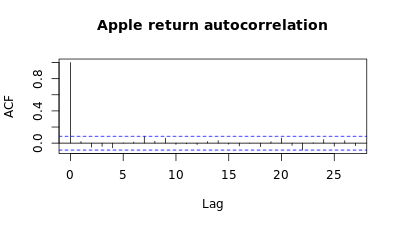
```
# Redraw with a maximum lag of 10
acf(rtn, main = "Apple return autocorrelation", lag.max = 10)
```

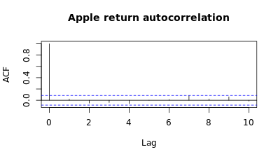

Autocorrelation helps you understand time-lagged relationships in your 
 
**q-q plot**

A **q-q plot** is a plot of the quantiles of one dataset against the quantiles of a second dataset. This is often used to understand if the data matches the standard statistical framework, or a normal distribution.

If the data is normally distributed, the points in the q-q plot follow a straight diagonal line. This is useful to check for normality at a glance but note that it is not an accurate statistical test. In the video, you saw how to create a q-q plot using the `qqnorm()` function, and how to create a reference line for if the data were perfectly normally distributed with `qqline()`:

```
> qqnorm(amazon_stocks,
         main = "AMAZON return QQ-plot")

> qqline(amazon_stocks,
         col = "red")
```

In the context of this course, the first dataset is Apple stock return and the second dataset is a standard normal distribution. In this exercise, you will check how Apple stock returns in `rtn` deviate from a normal distribution.

```
# Create q-q plot
qqnorm(rtn, main = "Apple return QQ-plot")
```

```
# Add a red line showing normality
qqline(rtn, col = "red")
```


It does not look like Apple returns fit a normal distribution very well in the tails.

**How to use everything we learned so far?**

**A comprehensive time series diagnostic**

Each plotting function that you've learned so far provides a different piece of insight about a time series. By putting together the histogram, the box and whisker plot, the autocorrelogram, and the q-q plot, you can gather a lot of useful information about time series behavior.

In this exercise, you will explore the ExxonMobil return data in the `rtn` series available in your workspace.

```
# Draw histogram and add red density line
hist(rtn, probability = TRUE)
lines(density(rtn), col = "red")
```

```
# Draw box and whisker plot
boxplot(rtn)
```

```
# Draw autocorrelogram
acf(rtn)
```
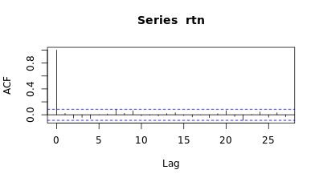
```
# Draw q-q plot and add a red line for normality
qqnorm(rtn)
qqline(rtn, col = "red")
```


What conclusions can you draw from the visualizations alone?

**A comprehensive time series diagnostic (2)**

To allow a quick and efficient diagnostic, it is often more convenient to display the four charts above on the same graphical window.

In this exercise, you will put all the charts you created from the previous exercise onto one graphical window.

```
# Set up 2x2 graphical window
par(mfrow = c(2, 2))

# Recreate all four plots
hist(rtn, probability = TRUE)
lines(density(rtn), col = "red")

boxplot(rtn)

acf(rtn)

qqnorm(rtn)
qqline(rtn, col = "red")
```


This visualization is much more compact and useful.

**Dealing with higher dimensions**

**Multiple time series**

- identify how they interact
- E.g.: **single** stock price reaction to interest rates change
- E.g.: stock price reaction of **several** stocks to interest rate changes
- Identify **patterns**

**Two time series grouped or stacked**

In the first chapter, you learned how to use `axis()` to plot two lines on the same graphic with different Y scales. Should you want to compare them, however, you may find other kind of graphs to be more insightful. One solution is to plot both time series as barcharts. There are two types:

- **Grouped barchart**: for a single period, there are as many bars as time series
- **Stacked bar chart**: for each period, there is a single bar, and each time series is represented by a portion of the bar proportional to the value of the time series at this date (i.e. the total at each period adds up to 100%)

You are provided with a dataset (`portfolio`) containing the weights of stocks A (`stocka`) and B (`stockb`) in your portfolio for each month in 2016. You will use the [barplot()](https://www.rdocumentation.org/packages/graphics/versions/3.3.3/topics/barplot) function to create both types of charts.

```
# Plot stacked barplot
barplot(portfolio)
```

```
# Plot grouped barplot
barplot(portfolio, beside = TRUE)
```

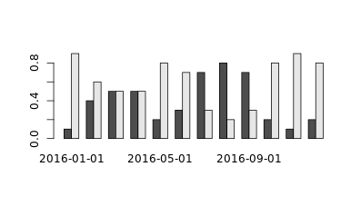

The two types of barplot display the same information in very different ways.

**Visualizing bivariate relationships**

If you want to go even further than simply plotting variables and instead investigate whether any relationship exists between 2 variables, you can draw a **scatterplot**. This is a graph where the values of two variables are plotted along two axes.

The pattern of the resulting points is used to reveal the presence of any correlation; usually, a regression line is added to identify the tendency, if there is any:

- An *upward* sloping regression line indicates a positive linear relationship between A and B (when A goes up B tends to goes up as well)
- A *downward* sloping regression line indicates a negative linear relationship between A and B
You can draw a scatterplot and then create a regression model with the following functions:

```
plot(x = A, y = B)
lm(B ~ A)
```

In this exercise, you will draw a scatterplot and regression line for the return series for the SP500 (`sp500`) and Citigroup (`citi`) from January 2015 to January 2017, both of which are provided in your workspace

```
# Draw the scatterplot
plot(sp500, citi)

# Draw a regression line
abline(reg = lm(citi ~ sp500), col = "red", lwd = 2)
```

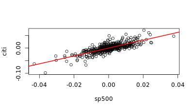

It looks there is definitely a positive linear relationship between these two variables.

**Multivariate time series**

**Correlation matrix**

What if you want to evaluate the relationship between mutiple time series? The most common tool to use is a **correlation matrix**, which is a table showing correlation coefficients between pairs of variables. Several types of correlations exist but the most used ones are:

- **Pearson correlation**: measures the linear relationship between 2 variables
- **Spearman rank correlation**: measures the statistical dependency between the ranking of 2 variables (not necessarily linear)

The latter is used when there is no assumption made on the distribution of the data. All this is achieved in R using the function [cor()](https://www.rdocumentation.org/packages/stats/versions/3.3.3/topics/cor). You can use the method argument to select the desired correlation type. `"pearson"` is the default method, but you can specify `"spearman"` as well.

In this exercise, you will calculate the correlation matrix of the data provided in the dataset `my_data` containing the returns for 5 stocks: ExxonMobile, Citigroup, Microsoft, Dow Chemical and Yahoo.

```
# Create correlation matrix using Pearson method
cor(my_data)
```
```
                sp500 citigroup microsoft     apple dowchemical     yahoo
sp500       1.0000000 0.5097953 0.3743215 0.3576966   0.5217243 0.2900962
citigroup   0.5097953 1.0000000 0.4841408 0.4291841   0.5085190 0.4029490
microsoft   0.3743215 0.4841408 1.0000000 0.5133469   0.3954523 0.4329388
apple       0.3576966 0.4291841 0.5133469 1.0000000   0.3627755 0.3413626
dowchemical 0.5217243 0.5085190 0.3954523 0.3627755   1.0000000 0.2938749
yahoo       0.2900962 0.4029490 0.4329388 0.3413626   0.2938749 1.000000
```
```
# Create correlation matrix using Spearman method
cor(my_data, method = "spearman")
```
```
                sp500 citigroup microsoft     apple dowchemical     yahoo
sp500       1.0000000 0.5192579 0.4244237 0.3518853   0.5316235 0.3262037
citigroup   0.5192579 1.0000000 0.4976477 0.4374850   0.5607511 0.3780730
microsoft   0.4244237 0.4976477 1.0000000 0.5128477   0.4684114 0.4448179
apple       0.3518853 0.4374850 0.5128477 1.0000000   0.3681791 0.3680715
dowchemical 0.5316235 0.5607511 0.4684114 0.3681791   1.0000000 0.3464743
yahoo       0.3262037 0.3780730 0.4448179 0.3680715   0.3464743 1.0000000
```

Notice how the two methods calculate different correlation values.

**Scatterplots for multiple pairs of data**

In the previous exercise, you saw a numerical representation of the relationship between pairs of data through a correlation matrix. It's also possible to have a graphical representation of those relationships using scatterplots.

Specifically, the relationship between [pairs()](https://www.rdocumentation.org/packages/graphics/versions/3.3.3/topics/pairs) of time series is represented by a facetted scatterplot of all pairs at once. This is very convenient for a quick comparison betwen pairs of time series.

In this exercise, you will draw scatterplots of the stock data in `my_data` from the previous exercise.

```
# Create scatterplot matrix
pairs(my_data)
```

```
# Create upper panel scatterplot matrix
pairs(my_data, lower.panel = NULL, main = "Stocks Correlation Scatterplots")
```


When you have a small number of time series to compare, a scatterplot matrix can be useful to visualize everything at once.

**Correlation plot**

R offers other ways of displaying the correlation matrix. With the [corrplot](https://www.rdocumentation.org/packages/corrplot/versions/0.77) package, the visualization of correlations is made easier and more powerful by allowing you to represent the correlations with numbers, symbols, colors, and more.

In this exercise, you will use the provided correlation matrix `cor_mat` and the [corrplot()](https://www.rdocumentation.org/packages/corrplot/versions/0.77/topics/corrplot) function to draw some correlation charts.

```
# Create correlation matrix
corrplot(cor_mat)
```
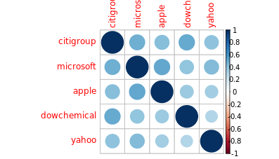
```
# Create correlation matrix with numbers
corrplot(cor_mat, method = "number")
```
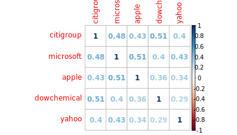
```
# Create correlation matrix with colors
corrplot(cor_mat, method = "color")
```
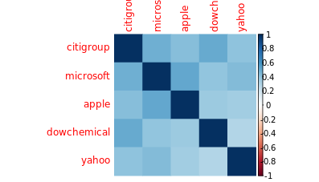
```
# Create upper triangle correlation matrix
corrplot(cor_mat, method = "number", type = "upper")
```

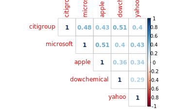

This is just one more example of the R community giving you access to great packages!

**Higher dimension time series**

**Correlation matrix as heatmap**

Should you want to check correlations betweens hundreds of time series, representing correlations with numbers is not really helpful - for a dataset of 100 elements, you would have to analyze 10,000 (100 x 100) correlation numbers!

In this case, a **heatmap** is a better suited tool. A heatmap is a map or diagram in which data values are represented as colors. When using one, it might also be useful to reorder the corelation matrix to make it more readable. You can create heatmaps using `corrplot(method = "color")`.

In this exercise, you will create some heatmaps with the same correlation matrix `cor_mat` as from the previous exercise.

```
# Draw heatmap of cor_mat
corrplot(cor_mat, method = "color")
```

```
# Draw upper heatmap
corrplot(cor_mat, method = "color", type = "upper")
```
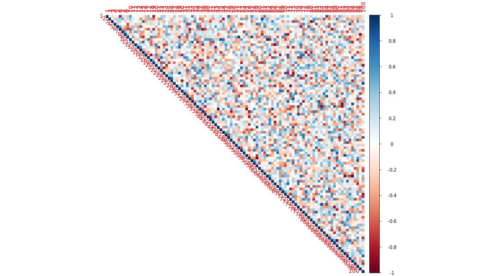
```
# Draw the upper heatmap with hclust
corrplot(cor_mat, method = "color", type = "upper", order = "hclust")
```

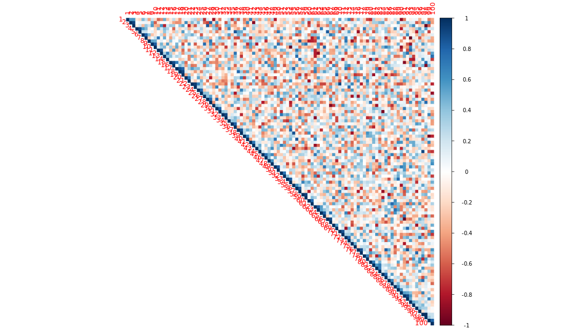

Imagine having to analyze all 10,000 numbers instead!

**Case study presentation**

**Role of correlation**

- rule number one in investment: capital protection
- low correlation = protection from severe losses
- you will use the `PerformanceAnalytics` package

**Current portfolio description**

Your savings are invested in a portfolio made of 3 stocks: Yahoo, Apple and Microsoft. Each stocks has the same weight in the portfolio at 33%. You have some extra cash to invest, but before going any further, you want to gather some information on your existing portfolio.

In this exercise, you are provided with a dataset `data` containing the value and the return of the portfolio over time, in `value` and `return`, respectively.

```
# Plot the portfolio value 
plot(data$value, main = "Portfolio Value")
```

```
# Plot the portfolio return
plot(data$return, main = "Portfolio Return")
```
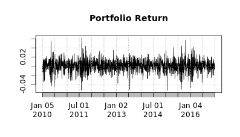
```
# Plot a histogram of portfolio return 
hist(data$return, probability = TRUE)
```

```
# Add a density line
lines(density(data$return), col = "red", lwd = 2)
```

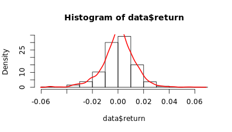

Now you understand the makeup of your current portfolio.

**New stocks**

**Conclusions so far**

- the value increased by 100% over the course of 7 years
- really good performance between 2010 and 2014
- no performance since end of 2014

**In what follows...**

- **Goal**: Choose one stock to invest your spare cash
- A new dataset
- Choose only one stock
- Compare old and new portfolio

**New stocks description**

In this exercise, you will review plotting multiple graphs on the same graphical window.

The new dataset `data` containing four new stocks is available in your workspace:

- Goldman Sachs (GS)
- Coca-Cola (KO)
- Walt Disney (DIS)
- Caterpillar (CAT)

```
# Plot the four stocks on the same graphical window
par(mfrow = c(2, 2), mex = 0.8, cex = 0.8)
plot(data$GS)
plot(data$KO)
plot(data$DIS)
plot(data$CAT)
```

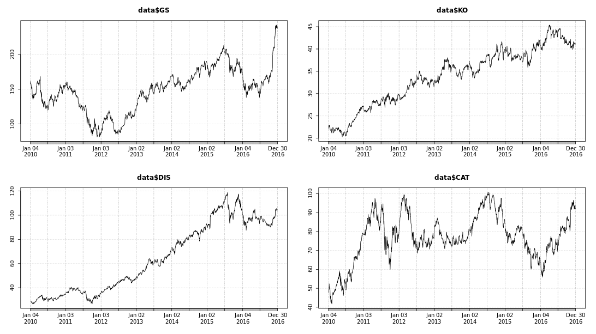

Now you have all of the stocks on one window as a way to compare them.

**New stocks description (2)**

Now that you know what the new stocks look like, you want to find out if any of them provide diversification benefits to your existing portfolio. You can do this by looking at the correlation of each stock to our portfolio, visualized through regression lines.

In this exercise, you are provided with four individual series containing the return of the same four stocks:

- Goldman Sachs (`gs`)
- Coca-Cola (`ko`)
- Walt Disney (`dis`)
- Caterpillar (`cat`)

The return of your existing portfolio in `portfolio` are also available in your workspace. Now it's your turn to analyze the relationships!

```
# Draw the scatterplot of gs against the portfolio
plot(x = gs, y = portfolio)

# Add a regression line in red
abline(reg = lm(gs ~ portfolio), col = "red", lwd = 2)
```
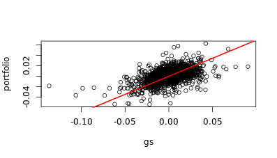
```
# Plot scatterplots and regression lines to a 2x2 window
par(mfrow = c(2, 2))

plot(x = gs, y = portfolio)
abline(reg = lm(gs ~ portfolio), col = "red", lwd = 2)

plot(x = ko, y = portfolio)
abline(reg = lm(ko ~ portfolio), col = "red", lwd = 2)

plot(x = dis, y = portfolio)
abline(reg = lm(dis ~ portfolio), col = "red", lwd = 2)

plot(x = cat, y = portfolio)
abline(reg = lm(cat ~ portfolio), col = "red", lwd = 2)
```

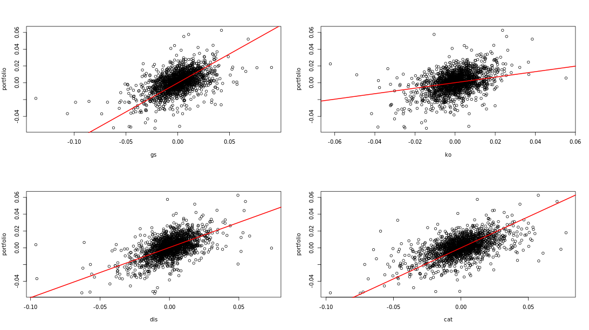

What do the regression lines imply about the correlations?

**Compare old and new portfolios**

Great work. You decide to buy stocks in Coca-Cola, and now your portfolio is made of equal proportions of four stocks: Yahoo, Microsoft, Apple and Coca-Cola.

In this exercise, you are given a dataset `old.vs.new.portfolio` with the following self-explanatory columns:

- `old.portfolio.value`
- `new.portfolio.value`
- `old.portfolio.rtn`
- `new.portfolio.rtn`

```
# Plot new and old portfolio values on same chart
plot(old.vs.new.portfolio$old.portfolio.value)
lines(old.vs.new.portfolio$new.portfolio.value, col = "red")
```

```
# Plot density of the new and old portfolio returns on same chart
plot(density(old.vs.new.portfolio$old.portfolio.rtn))
lines(density(old.vs.new.portfolio$new.portfolio.rtn), col ="red")
```

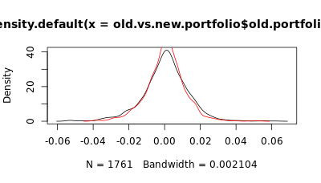

The new portfolio seems to have less variation based on the density lines.

**A more accurate comparison of portfolios**

Looking at the value and distribution of returns of your portfolio is a good start, but it doesn't necessarily tell the whole story. You could obviously look at many other charts and metrics, but ultimately what matters is performance, and specifically periods of poor performance.

The `PerformanceAnalytics` package provides additional tools to get a finer view of your portfolio. In particular, the [charts.PerformanceSummary()](https://www.rdocumentation.org/packages/PerformanceAnalytics/versions/1.4.3541/topics/charts.PerformanceSummary) function provides a quick and easy way to display the portfolio value, returns, and periods of poor performance, also known as drawdowns.

In this exercise, you will use this new function on the same old and new portfolio data in `old.vs.new.portfolio` from the previous exercise.

```
# Draw value, return, drawdowns of old portfolio
charts.PerformanceSummary(old.vs.new.portfolio$old.portfolio.rtn)
```
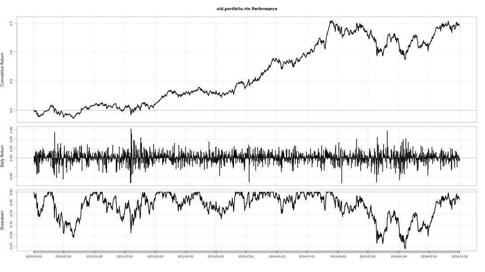
```
# Draw value, return, drawdowns of new portfolio
charts.PerformanceSummary(old.vs.new.portfolio$new.portfolio.rtn)
```
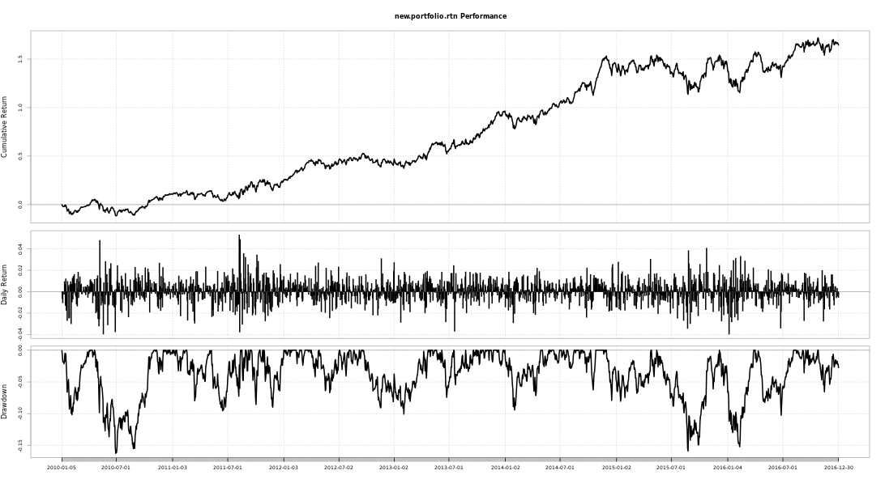
```
# Draw both portfolios on same chart
charts.PerformanceSummary(old.vs.new.portfolio[, c(3, 4)])
```


The new portfolio looks to have a higher cumulative return and lower drawdown for this period of time.

**Q**: Given that you already own a portfolio of stocks, on what grounds should you add a new stock to your portfolio?

**A**: Correlation to your existing portfolio to assess diversification, return histogram to assess risk and box and whisker plot to assess average return

**Congratulations!**

**Course wrap-up**

- Chapter 1: `xts`, `plot()` etc...
- Chapter 2: univariate time series
- Chapter 3: multivariate time series
- Chapter 4: case study


